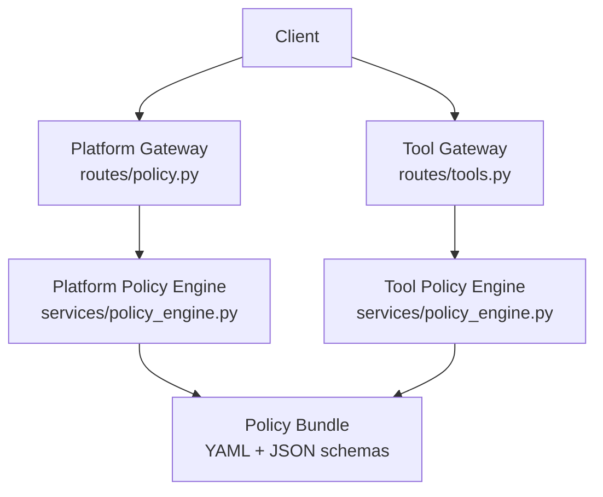
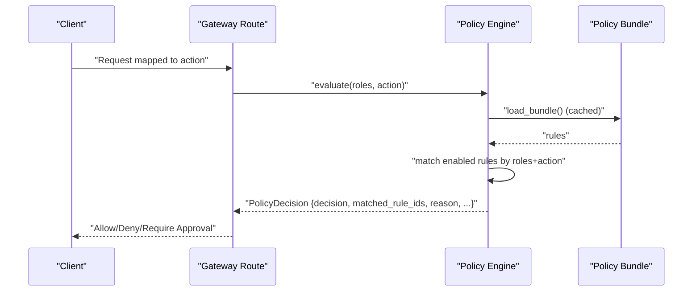
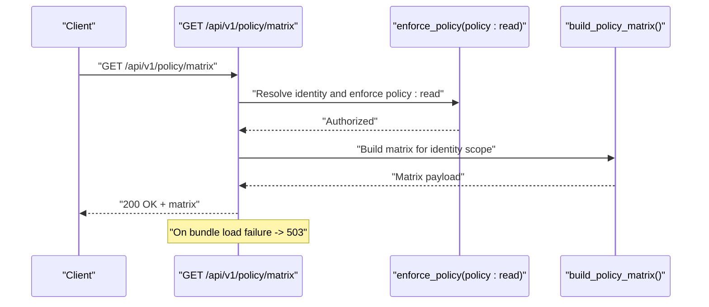
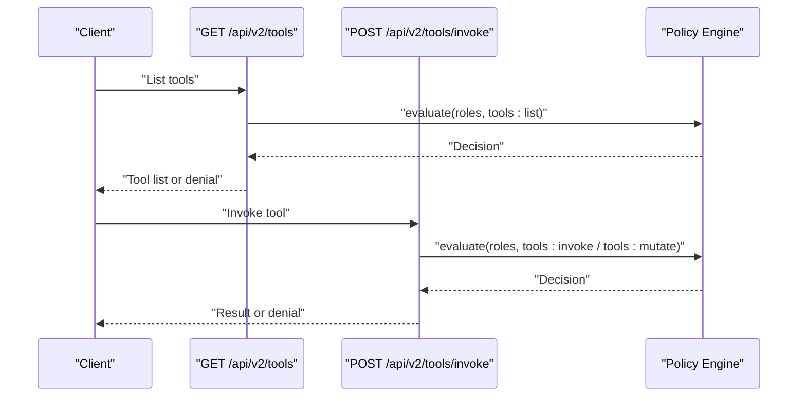
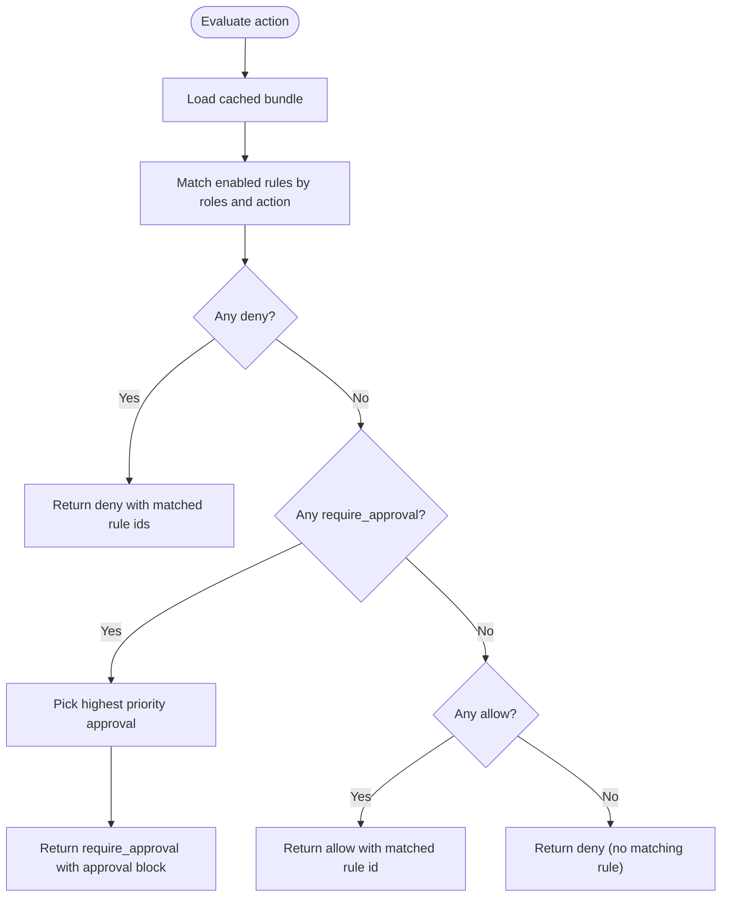
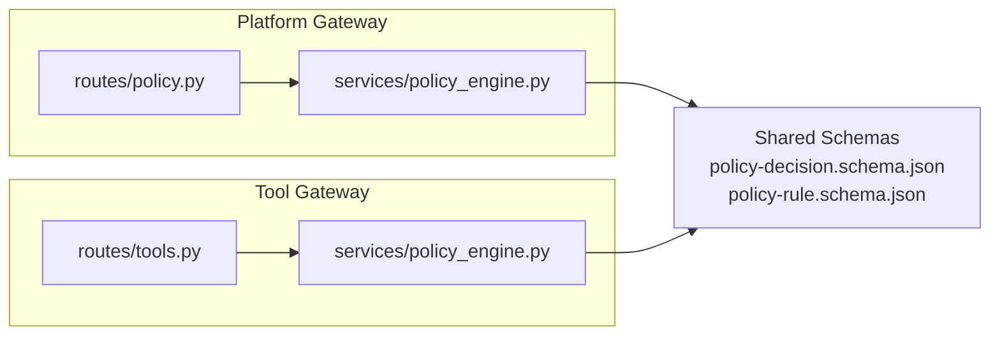

# Policy Evaluation API

<cite>
**Referenced Files in This Document**
- [policy.py](file://products/platform-gateway/src/platform_gateway/api/routes/policy.py)
- [policy_engine.py](file://products/platform-gateway/src/platform_gateway/services/policy_engine.py)
- [tools.py](file://products/tool-gateway/src/tool_gateway/api/routes/tools.py)
- [policy_engine.py](file://products/tool-gateway/src/tool_gateway/services/policy_engine.py)
- [policy-decision.schema.json](file://shared/shared-contracts/schemas/policy-decision.schema.json)
- [policy-rule.schema.json](file://shared/shared-contracts/schemas/policy-rule.schema.json)
- [test_policy_enforcement.py](file://products/platform-gateway/tests/test_policy_enforcement.py)
- [test_policy_matrix.py](file://products/platform-gateway/tests/test_policy_matrix.py)
- [README.md](file://products/policy-center/README.md)
</cite>

## Table of Contents
1. [Introduction](#introduction)
2. [Project Structure](#project-structure)
3. [Core Components](#core-components)
4. [Architecture Overview](#architecture-overview)
5. [Detailed Component Analysis](#detailed-component-analysis)
6. [Dependency Analysis](#dependency-analysis)
7. [Performance Considerations](#performance-considerations)
8. [Troubleshooting Guide](#troubleshooting-guide)
9. [Conclusion](#conclusion)

## Introduction
This document specifies the policy evaluation surface that enforces authorization rules and risk-aware decisions across the platform. It focuses on:
- How requests are mapped to named actions and evaluated against a versioned role-to-action policy bundle.
- The decision model with allow, deny, and require_approval outcomes, including approval tiers.
- Where policy evaluation is enforced today (platform gateway and tool gateway).
- How to integrate with the policy engine and plan for a future external policy service.

The project implements deny-by-default authorization at the gateway layer. Every business request is mapped to a named action, evaluated against a loaded policy bundle, and denied unless a rule explicitly allows it. Decisions are audit-logged and include enough context to trace which rules matched.

**Section sources**
- [policy_engine.py:1-12](file://products/platform-gateway/src/platform_gateway/services/policy_engine.py#L1-L12)
- [policy-engine.py:1-14](file://products/tool-gateway/src/tool_gateway/services/policy_engine.py#L1-L14)

## Project Structure
Policy enforcement is implemented in two gateways:
- Platform gateway exposes a transparency route for the live permission matrix and enforces policy for chat, sessions, approvals, documents, and other platform surfaces.
- Tool gateway enforces policy for tool listing and invocation, including mutating tool execution.

**Diagram sources**
- [policy.py:30-55](file://products/platform-gateway/src/platform_gateway/api/routes/policy.py#L30-L55)
- [tools.py:24-51](file://products/tool-gateway/src/tool_gateway/api/routes/tools.py#L24-L51)
- [policy_engine.py:334-444](file://products/platform-gateway/src/platform_gateway/services/policy_engine.py#L334-L444)
- [policy_engine.py:254-355](file://products/tool-gateway/src/tool_gateway/services/policy_engine.py#L254-L355)

**Section sources**
- [policy.py:1-55](file://products/platform-gateway/src/platform_gateway/api/routes/policy.py#L1-L55)
- [tools.py:1-51](file://products/tool-gateway/src/tool_gateway/api/routes/tools.py#L1-L51)

## Core Components
- Policy engines (platform and tool) load a YAML bundle of rules, parse and validate them, cache them in process memory, and evaluate an action against a caller’s roles.
- The shared contract defines the decision object returned by evaluation, including outcome, matched rule IDs, reason, optional subject/action, and approval metadata when applicable.
- Routes enforce policy before serving data or invoking tools.

Key behaviors:
- Deny by default when no rule matches.
- Explicit deny overrides require_approval and allow.
- require_approval overrides allow; highest priority wins within each outcome class.
- Disabled rules are ignored.
- Bundles are cached per configured path; a content hash is computed for provenance.

**Section sources**
- [policy_engine.py:390-444](file://products/platform-gateway/src/platform_gateway/services/policy_engine.py#L390-L444)
- [policy_engine.py:299-355](file://products/tool-gateway/src/tool_gateway/services/policy_engine.py#L299-L355)
- [policy-decision.schema.json:1-60](file://shared/shared-contracts/schemas/policy-decision.schema.json#L1-L60)
- [policy-rule.schema.json:1-105](file://shared/shared-contracts/schemas/policy-rule.schema.json#L1-L105)

## Architecture Overview
The current architecture evaluates policy in-process. A future design moves evaluation behind a POST /policy/evaluate endpoint so callers swap a function call for a network call.

**Diagram sources**
- [policy_engine.py:334-444](file://products/platform-gateway/src/platform_gateway/services/policy_engine.py#L334-L444)
- [policy_engine.py:254-355](file://products/tool-gateway/src/tool_gateway/services/policy_engine.py#L254-L355)
- [README.md:33-33](file://products/policy-center/README.md#L33-L33)

**Section sources**
- [README.md:33-33](file://products/policy-center/README.md#L33-L33)

## Detailed Component Analysis

### Platform Gateway Policy Transparency Endpoint
- GET /api/v1/policy/matrix
- Purpose: Serve the live role x action permission matrix derived from the currently enforced policy bundle.
- Authorization: Requires the policy:read action. Rows are scoped server-side: platform-admin sees the full matrix; other identities see only their granted roles.
- Error handling: If the policy bundle cannot be loaded, returns 503 with a structured detail indicating the bundle is unavailable.

**Diagram sources**
- [policy.py:30-55](file://products/platform-gateway/src/platform_gateway/api/routes/policy.py#L30-L55)

**Section sources**
- [policy.py:1-55](file://products/platform-gateway/src/platform_gateway/api/routes/policy.py#L1-L55)

### Tool Gateway Tool Endpoints
- GET /api/v2/tools
  - Lists registered tool definitions.
  - Enforces tools:list.
- POST /api/v2/tools/invoke
  - Invokes a registered tool with policy enforcement and audit logging.
  - Identity is derived exclusively from the verified bearer token; body identity is not trusted.

**Diagram sources**
- [tools.py:24-51](file://products/tool-gateway/src/tool_gateway/api/routes/tools.py#L24-L51)
- [policy_engine.py:299-355](file://products/tool-gateway/src/tool_gateway/services/policy_engine.py#L299-L355)

**Section sources**
- [tools.py:1-51](file://products/tool-gateway/src/tool_gateway/api/routes/tools.py#L1-L51)

### Policy Decision Model
- Outcome values: allow, deny, require_approval.
- Precedence: deny > require_approval > allow.
- When require_approval is selected, the response includes approval_tier and an approval block mirroring the winning rule’s approval configuration.
- Action and subject fields may be present to identify what was evaluated and for whom.

**Diagram sources**
- [policy_engine.py:390-444](file://products/platform-gateway/src/platform_gateway/services/policy_engine.py#L390-L444)
- [policy_engine.py:299-355](file://products/tool-gateway/src/tool_gateway/services/policy_engine.py#L299-L355)
- [policy-decision.schema.json:1-60](file://shared/shared-contracts/schemas/policy-decision.schema.json#L1-L60)

**Section sources**
- [policy-decision.schema.json:1-60](file://shared/shared-contracts/schemas/policy-decision.schema.json#L1-L60)

### Request Schemas and Action Contexts
- Requests are mapped to named actions defined by each gateway:
  - Platform gateway actions include chat, session:create/read/list/delete/update, audit:read, incident:read/create/triage, policy:read, tools:list, skills:read, chat:confirm, tools:mutate, models:list, approvals:list, documents:create/read, session:skill_draft, incident:skill_draft, session:skill_graduate.
  - Tool gateway actions include tools:list, tools:invoke, and tools:mutate for write/admin-risk tools.
- Identity is resolved from verified tokens; body identity is never trusted.
- For tool invocation, the route delegates to a service handler that performs policy checks based on the tool’s risk profile.

**Section sources**
- [policy_engine.py:30-127](file://products/platform-gateway/src/platform_gateway/services/policy_engine.py#L30-L127)
- [policy_engine.py:32-42](file://products/tool-gateway/src/tool_gateway/services/policy_engine.py#L32-L42)
- [tools.py:1-51](file://products/tool-gateway/src/tool_gateway/api/routes/tools.py#L1-L51)

### Response Formats
- All policy decisions conform to the shared policy-decision schema:
  - Required fields: decision, matched_rule_ids, reason.
  - Optional fields: action, subject.
  - When decision is require_approval: approval_tier and approval (tier, decided_by_roles, optional allow_self_approval).

**Section sources**
- [policy-decision.schema.json:1-60](file://shared/shared-contracts/schemas/policy-decision.schema.json#L1-L60)

### Examples of Policy Evaluation Scenarios
- Tool execution:
  - Listing tools requires tools:list.
  - Invoking read-only tools typically requires tools:invoke; write/admin-risk tools additionally require tools:mutate.
- Document access:
  - Reading operations use documents:read; creating/publishing/deleting uses documents:create.
- Session operations:
  - Creating, reading, listing, deleting, and updating sessions map to session:* actions.
  - Skill drafting and graduation are gated by session:skill_draft and session:skill_graduate respectively.

These scenarios are enforced by calling the appropriate action through the gateway routes and policy engine.

**Section sources**
- [policy_engine.py:30-127](file://products/platform-gateway/src/platform_gateway/services/policy_engine.py#L30-L127)
- [tools.py:24-51](file://products/tool-gateway/src/tool_gateway/api/routes/tools.py#L24-L51)

### Integration with the Policy Engine
- Both gateways implement identical evaluation semantics:
  - Load and cache the bundle once per configured path.
  - Compute a SHA-256 fingerprint of the loaded text for provenance.
  - Evaluate by filtering enabled rules that match the requested action and any of the caller’s roles.
  - Apply precedence and priority to determine the final decision.
- The platform gateway also exposes a matrix endpoint backed by the same bundle.

**Section sources**
- [policy_engine.py:334-387](file://products/platform-gateway/src/platform_gateway/services/policy_engine.py#L334-L387)
- [policy_engine.py:254-297](file://products/tool-gateway/src/tool_gateway/services/policy_engine.py#L254-L297)

### Decision Caching Strategies
- Module-level singleton caches the parsed rules and bundle metadata keyed by the configured path.
- On subsequent calls with the same path, the cached bundle is reused without re-parsing.
- A content hash is stored to detect drift and support readiness checks.

**Section sources**
- [policy_engine.py:129-136](file://products/platform-gateway/src/platform_gateway/services/policy_engine.py#L129-L136)
- [policy_engine.py:334-387](file://products/platform-gateway/src/platform_gateway/services/policy_engine.py#L334-L387)
- [policy_engine.py:54-59](file://products/tool-gateway/src/tool_gateway/services/policy_engine.py#L54-L59)
- [policy_engine.py:254-297](file://products/tool-gateway/src/tool_gateway/services/policy_engine.py#L254-L297)

### Future External Policy Service
- The codebase documents that when policy-center becomes a service, evaluate() will move behind a POST /policy/evaluate endpoint returning the same decision object. Callers will swap a function call for a network call.

**Section sources**
- [README.md:33-33](file://products/policy-center/README.md#L33-L33)

## Dependency Analysis

**Diagram sources**
- [policy.py:30-55](file://products/platform-gateway/src/platform_gateway/api/routes/policy.py#L30-L55)
- [tools.py:24-51](file://products/tool-gateway/src/tool_gateway/api/routes/tools.py#L24-L51)
- [policy_engine.py:334-444](file://products/platform-gateway/src/platform_gateway/services/policy_engine.py#L334-L444)
- [policy_engine.py:254-355](file://products/tool-gateway/src/tool_gateway/services/policy_engine.py#L254-L355)
- [policy-decision.schema.json:1-60](file://shared/shared-contracts/schemas/policy-decision.schema.json#L1-L60)
- [policy-rule.schema.json:1-105](file://shared/shared-contracts/schemas/policy-rule.schema.json#L1-L105)

**Section sources**
- [policy_engine.py:334-444](file://products/platform-gateway/src/platform_gateway/services/policy_engine.py#L334-L444)
- [policy_engine.py:254-355](file://products/tool-gateway/src/tool_gateway/services/policy_engine.py#L254-L355)

## Performance Considerations
- In-process caching: Bundles are parsed once and cached per configured path, avoiding repeated YAML parsing and validation on every request.
- Minimal evaluation cost: Matching filters enabled rules by action and role intersection, then selects the best rule per outcome class using simple scans.
- Provenance via hash: Storing a SHA-256 of the loaded bundle enables fast drift detection without re-parsing.
- Batch evaluation: Since evaluation is a pure function over roles and action, clients can batch multiple checks client-side if needed; servers do not expose a dedicated batch endpoint in this slice.
- High-frequency checks: Prefer reusing the same roles set per request and avoid unnecessary re-evaluation by caching results within a single request’s scope.

[No sources needed since this section provides general guidance]

## Troubleshooting Guide
Common issues and how they are surfaced:
- Policy bundle unavailable:
  - The platform gateway’s matrix route returns 503 with a structured detail when the bundle cannot be loaded.
- Missing or invalid rules:
  - The engines raise a PolicyLoadError during bundle load for malformed YAML, unknown outcomes, missing required fields, or invalid approval blocks.
- Unenforceable require_approval rules:
  - On the tool gateway, require_approval rules are skipped at load time because there is no approval enforcement substrate; logs indicate why they were skipped.
- Readiness degradation:
  - Tests assert that readiness degrades when the policy bundle is missing, ensuring operators can detect misconfiguration early.

Operational tips:
- Verify the bundle path configuration and file accessibility.
- Inspect logs for bundle load messages and rule counts.
- Use the matrix endpoint to confirm the live permissions being enforced.

**Section sources**
- [policy.py:38-46](file://products/platform-gateway/src/platform_gateway/api/routes/policy.py#L38-L46)
- [policy_engine.py:229-331](file://products/platform-gateway/src/platform_gateway/services/policy_engine.py#L229-L331)
- [policy_engine.py:192-251](file://products/tool-gateway/src/tool_gateway/services/policy_engine.py#L192-L251)
- [test_policy_enforcement.py:188-188](file://products/platform-gateway/tests/test_policy_enforcement.py#L188-L188)

## Conclusion
The platform and tool gateways implement a consistent, deny-by-default policy evaluation model with three outcomes and strict precedence. Decisions are deterministic, auditable, and backed by a versioned, cached policy bundle. While evaluation currently runs in-process, the design anticipates moving to a POST /policy/evaluate endpoint for centralized policy-as-a-service. Clients should map requests to the correct actions, rely on the shared decision schema, and handle deny and require_approval appropriately.

[No sources needed since this section summarizes without analyzing specific files]