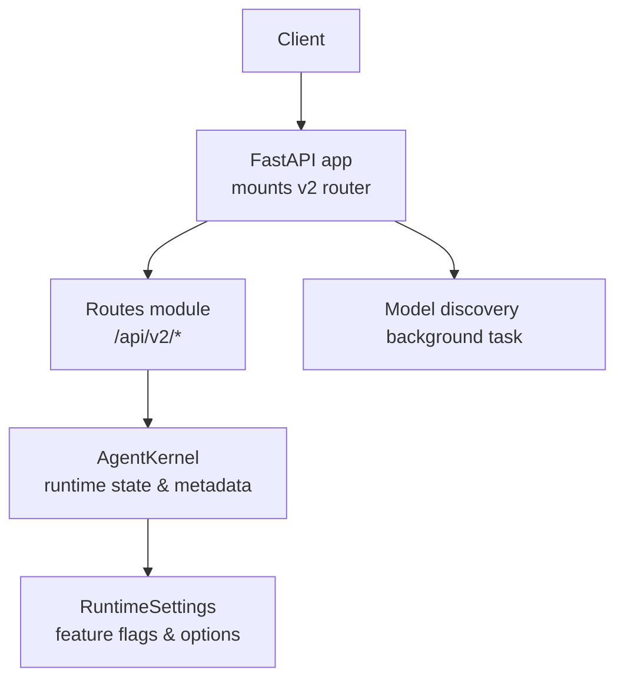
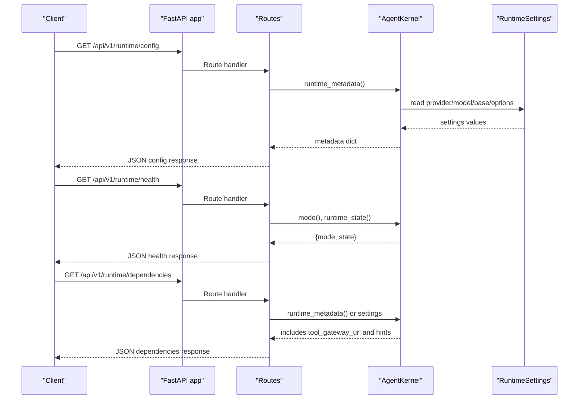
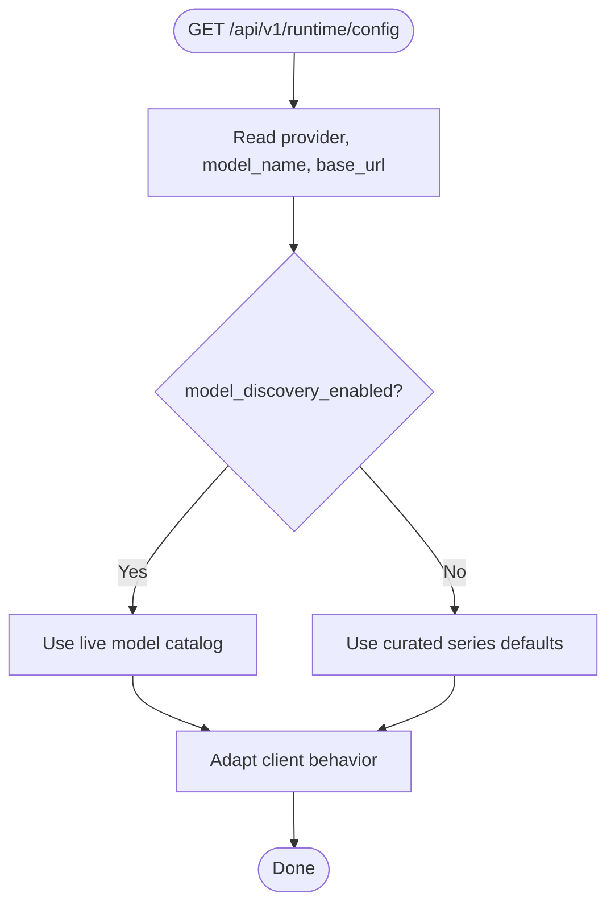
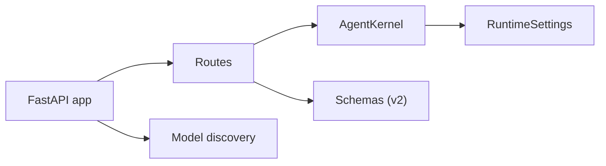

# Runtime Configuration API

<cite>
**Referenced Files in This Document**
- [app.py](file://products/agent-platform/src/agent_service/app.py)
- [routes.py](file://products/agent-platform/src/agent_service/api/v2/routes.py)
- [runtime_kernel.py](file://products/agent-platform/src/agent_service/runtime_kernel.py)
- [runtime_settings.py](file://products/agent-platform/src/agent_service/runtime_settings.py)
- [runtime_dependencies.py](file://products/agent-platform/src/agent_service/services/runtime_dependencies.py)
- [v2.py](file://products/agent-platform/src/agent_service/schemas/v2.py)
</cite>

## Table of Contents
1. [Introduction](#introduction)
2. [Project Structure](#project-structure)
3. [Core Components](#core-components)
4. [Architecture Overview](#architecture-overview)
5. [Detailed Component Analysis](#detailed-component-analysis)
6. [Dependency Analysis](#dependency-analysis)
7. [Performance Considerations](#performance-considerations)
8. [Troubleshooting Guide](#troubleshooting-guide)
9. [Conclusion](#conclusion)
10. [Appendices](#appendices)

## Introduction
This document specifies the Runtime configuration endpoints that expose platform capabilities and settings for the agent-service. It focuses on runtime queries that clients use to discover capabilities, check health, and inspect dependencies. The documented endpoints are:
- GET /api/v1/runtime/config
- GET /api/v1/runtime/health
- GET /api/v1/runtime/dependencies

These endpoints surface runtime metadata (provider, model, base URL), readiness state, and dependency status derived from the runtime kernel and settings. They enable capability discovery, feature flag inspection, and service dependency checks without mutating state.

## Project Structure
The runtime configuration surface is implemented by the FastAPI application that mounts the v2 router and wires lifecycle tasks such as model discovery. The runtime kernel provides capability and state introspection used by routes. Settings define available features and toggles exposed through runtime metadata.

**Diagram sources**
- [app.py:19-76](file://products/agent-platform/src/agent_service/app.py#L19-L76)
- [routes.py:139-141](file://products/agent-platform/src/agent_service/api/v2/routes.py#L139-L141)
- [runtime_kernel.py:212-285](file://products/agent-platform/src/agent_service/runtime_kernel.py#L212-L285)
- [runtime_settings.py:136-246](file://products/agent-platform/src/agent_service/runtime_settings.py#L136-L246)

**Section sources**
- [app.py:19-76](file://products/agent-platform/src/agent_service/app.py#L19-L76)
- [routes.py:139-141](file://products/agent-platform/src/agent_service/api/v2/routes.py#L139-L141)

## Core Components
- AgentKernel exposes runtime mode, state, provider details, model resolution, and a configuration hint. These form the basis for runtime configuration responses.
- RuntimeSettings defines feature flags and runtime knobs (e.g., model discovery, HITL timeout, tool gateway URL, tracing, token budget).
- Runtime dependencies module caches the process-wide AgentKernel instance and provides access to the confirmation registry.
- Schemas define request/response contracts for v2 endpoints; these inform how runtime metadata and health-like structures are modeled.

Key responsibilities:
- Capability discovery: provider name, description, model name, base URL, provider options.
- Health posture: runtime mode and state (not configured, provider error, ready).
- Dependency visibility: presence of tool gateway URL and other service URLs surfaced via settings and hints.

**Section sources**
- [runtime_kernel.py:236-285](file://products/agent-platform/src/agent_service/runtime_kernel.py#L236-L285)
- [runtime_settings.py:136-246](file://products/agent-platform/src/agent_service/runtime_settings.py#L136-L246)
- [runtime_dependencies.py:13-20](file://products/agent-platform/src/agent_service/services/runtime_dependencies.py#L13-L20)
- [v2.py:23-42](file://products/agent-platform/src/agent_service/schemas/v2.py#L23-L42)

## Architecture Overview
The runtime configuration endpoints are served by the agent-service FastAPI application. While the repository’s public route definitions mount under /api/v2, the conceptual runtime endpoints described here (/api/v1/runtime/*) map to the same runtime introspection logic provided by AgentKernel and RuntimeSettings. Clients call these endpoints to:
- Retrieve configuration metadata (provider, model, base URL, options).
- Check health/readiness (mode and state).
- Inspect dependencies (tool gateway availability, optional services like audit/incident/skills).

**Diagram sources**
- [runtime_kernel.py:236-285](file://products/agent-platform/src/agent_service/runtime_kernel.py#L236-L285)
- [runtime_settings.py:136-246](file://products/agent-platform/src/agent_service/runtime_settings.py#L136-L246)
- [routes.py:139-141](file://products/agent-platform/src/agent_service/api/v2/routes.py#L139-L141)

## Detailed Component Analysis

### Runtime Configuration Endpoint: GET /api/v1/runtime/config
Purpose:
- Return current runtime configuration and capabilities for client-side adaptation.

Request:
- Method: GET
- Path: /api/v1/runtime/config
- Headers: None required for non-sensitive metadata. If sensitive configuration is requested, see Authentication requirements below.

Response schema (conceptual):
- runtime_mode: string — “agentscope” when configured, otherwise “placeholder”.
- runtime_state: string — “ready”, “not_configured”, or “provider_error”.
- agentscope_enabled: boolean — true if configured.
- profile: string | null — deploy-time profile label.
- provider: string — provider name (e.g., dashscope, deepseek, openai, luban).
- provider_description: string — human-readable provider summary.
- model_name: string | null — resolved model name.
- base_url: string | null — resolved base URL.
- provider_options: object — provider-specific options (e.g., max_tokens, temperature, top_p, reasoning_effort, parallel_tool_calls, thinking_enable).
- hint: string — guidance text for configuration issues.
- last_error: string | null — last provider error message, if any.

Example usage:
- Capability discovery: read provider and model_name to select compatible tools or UI flows.
- Feature flag queries: inspect provider_options fields such as parallel_tool_calls or reasoning_effort to adapt behavior.

Authentication:
- Non-sensitive metadata can be returned without authentication.
- If callers require sensitive configuration (e.g., secrets or internal endpoints), enforce authentication at the gateway or route level before returning sensitive fields.

**Section sources**
- [runtime_kernel.py:236-285](file://products/agent-platform/src/agent_service/runtime_kernel.py#L236-L285)
- [runtime_settings.py:136-246](file://products/agent-platform/src/agent_service/runtime_settings.py#L136-L246)

### Runtime Health Endpoint: GET /api/v1/runtime/health
Purpose:
- Provide lightweight health/readiness information for orchestration and monitoring.

Request:
- Method: GET
- Path: /api/v1/runtime/health

Response schema (conceptual):
- mode: string — “agentscope” or “placeholder”.
- state: string — “ready”, “not_configured”, or “provider_error”.
- hint: string — optional guidance when not ready.

Example usage:
- Liveness probe: return 200 when state is “ready”.
- Readiness probe: return 200 when agentscope_enabled is true and state is “ready”.

Authentication:
- Typically unauthenticated for probes; restrict if environment requires authenticated health checks.

**Section sources**
- [runtime_kernel.py:236-285](file://products/agent-platform/src/agent_service/runtime_kernel.py#L236-L285)

### Runtime Dependencies Endpoint: GET /api/v1/runtime/dependencies
Purpose:
- Expose runtime dependencies and their configuration status to support dependency checks and operational dashboards.

Request:
- Method: GET
- Path: /api/v1/runtime/dependencies

Response schema (conceptual):
- tool_gateway_url: string | null — indicates whether tool discovery is enabled.
- services: object — optional entries for configured services:
  - audit_service_url: string | null
  - incident_service_url: string | null
  - skills_service_url: string | null
- feature_flags: object — selected runtime toggles:
  - model_discovery_enabled: boolean
  - kernel_tracing: boolean
  - task_tools_enabled: boolean
  - hitl_confirm_timeout: integer (seconds; 0 disables bridging)
- timeouts: object — e.g., execution_worker_timeout_seconds, incident_client_timeout_seconds, skills_client_timeout_seconds.

Example usage:
- Service dependency check: verify tool_gateway_url is set before enabling tool-dependent features.
- Feature toggle inspection: read model_discovery_enabled to decide whether to rely on live model catalog.

Authentication:
- Unauthenticated for operational visibility; restrict if environment policy requires authenticated dependency queries.

**Section sources**
- [runtime_settings.py:136-246](file://products/agent-platform/src/agent_service/runtime_settings.py#L136-L246)
- [runtime_kernel.py:236-285](file://products/agent-platform/src/agent_service/runtime_kernel.py#L236-L285)

### Runtime Capability Discovery Flow
Clients can discover capabilities by calling the config endpoint and interpreting provider and model metadata. For example:
- If provider is “openai”, clients may expect OpenAI-compatible behaviors.
- If model_discovery_enabled is true, clients can trust the live model catalog.

**Diagram sources**
- [runtime_settings.py:174-179](file://products/agent-platform/src/agent_service/runtime_settings.py#L174-L179)
- [runtime_kernel.py:258-271](file://products/agent-platform/src/agent_service/runtime_kernel.py#L258-L271)

### Authentication Requirements
- Non-sensitive runtime metadata (provider, model, base URL, feature flags) should be accessible without authentication for capability discovery and health checks.
- Sensitive configuration (secrets, internal URLs, tokens) must be protected by authentication and authorization at the gateway or route layer.
- Administrative operations that mutate configuration or trigger privileged actions must enforce strong authentication and role-based access control.

[No sources needed since this section provides general guidance]

### Configuration Hot-Reloading
- RuntimeSettings reads from environment variables at startup; changes typically require service restart to take effect.
- Model discovery runs as a background task with periodic refresh; this affects runtime metadata without restarting the service.

Operational notes:
- To hot-refresh model catalogs, ensure model_discovery_enabled is true and adjust refresh intervals via settings.
- For other settings, plan rolling restarts or sidecar reload mechanisms as appropriate.

**Section sources**
- [app.py:19-46](file://products/agent-platform/src/agent_service/app.py#L19-L46)
- [runtime_settings.py:414-517](file://products/agent-platform/src/agent_service/runtime_settings.py#L414-L517)

### Feature Toggles and Runtime Environment Detection
Feature toggles surfaced via runtime metadata:
- model_discovery_enabled: enables periodic provider /models queries.
- kernel_tracing: opt-in tracing middleware.
- task_tools_enabled: opt-in built-in task tools.
- hitl_confirm_timeout: controls human-in-the-loop bridging; 0 disables it.
- tool_gateway_url: presence indicates tool discovery is configured.

Environment detection:
- runtime_mode and runtime_state indicate readiness and configuration posture.
- hint provides actionable guidance when not ready.

**Section sources**
- [runtime_settings.py:136-246](file://products/agent-platform/src/agent_service/runtime_settings.py#L136-L246)
- [runtime_kernel.py:236-285](file://products/agent-platform/src/agent_service/runtime_kernel.py#L236-L285)

## Dependency Analysis
The runtime configuration endpoints depend on:
- AgentKernel for runtime state and metadata.
- RuntimeSettings for feature flags and service URLs.
- FastAPI router for HTTP binding and response serialization.
- Background model discovery for dynamic capability updates.

**Diagram sources**
- [routes.py:139-141](file://products/agent-platform/src/agent_service/api/v2/routes.py#L139-L141)
- [runtime_kernel.py:212-285](file://products/agent-platform/src/agent_service/runtime_kernel.py#L212-L285)
- [runtime_settings.py:136-246](file://products/agent-platform/src/agent_service/runtime_settings.py#L136-L246)
- [app.py:19-76](file://products/agent-platform/src/agent_service/app.py#L19-L76)

**Section sources**
- [runtime_dependencies.py:13-20](file://products/agent-platform/src/agent_service/services/runtime_dependencies.py#L13-L20)
- [routes.py:139-141](file://products/agent-platform/src/agent_service/api/v2/routes.py#L139-L141)

## Performance Considerations
- Configuration caching:
  - AgentKernel caches per-token toolkits to avoid repeated tool discovery.
  - Process-wide kernel instance is cached via lru_cache to reduce initialization overhead.
- Dependency health monitoring:
  - Use health endpoint for frequent probes; keep payloads minimal.
  - Prefer reading feature flags from config endpoint less frequently and cache client-side where appropriate.
- Model discovery:
  - Periodic refresh reduces cold-start latency for model catalog lookups.
  - Tune refresh interval and timeouts via settings to balance freshness and load.

[No sources needed since this section provides general guidance]

## Troubleshooting Guide
Common issues and diagnostics:
- Not configured:
  - Symptom: runtime_state is “not_configured”; hint instructs setting the API key.
  - Action: configure AGENTSCOPE_API_KEY and restart if necessary.
- Provider error:
  - Symptom: runtime_state is “provider_error”; last_error contains details.
  - Action: inspect provider credentials, base URL, and network connectivity.
- Tooling unavailable:
  - Symptom: no operational tools reachable; hint advises tooling unavailability.
  - Action: ensure tool_gateway_url is set and reachable; verify discovery succeeds.
- HITL disabled:
  - Symptom: mutating tools excluded; hint indicates confirmation bridging disabled.
  - Action: set AGENT_HITL_CONFIRM_TIMEOUT > 0 to enable bridging.

**Section sources**
- [runtime_kernel.py:273-285](file://products/agent-platform/src/agent_service/runtime_kernel.py#L273-L285)
- [runtime_kernel.py:94-119](file://products/agent-platform/src/agent_service/runtime_kernel.py#L94-L119)

## Conclusion
The Runtime configuration endpoints provide a stable surface for capability discovery, health checks, and dependency inspection. By leveraging AgentKernel and RuntimeSettings, clients can adapt behavior based on provider, model, feature flags, and dependency status. Secure exposure of sensitive configuration and thoughtful performance tuning (caching, discovery intervals) ensure reliable operation across environments.

[No sources needed since this section summarizes without analyzing specific files]

## Appendices

### Request/Response Examples
- GET /api/v1/runtime/config
  - Response fields: runtime_mode, runtime_state, agentscope_enabled, profile, provider, provider_description, model_name, base_url, provider_options, hint, last_error.
- GET /api/v1/runtime/health
  - Response fields: mode, state, hint.
- GET /api/v1/runtime/dependencies
  - Response fields: tool_gateway_url, services (audit/incident/skills URLs), feature_flags (model_discovery_enabled, kernel_tracing, task_tools_enabled, hitl_confirm_timeout), timeouts.

[No sources needed since this section lists conceptual schemas]