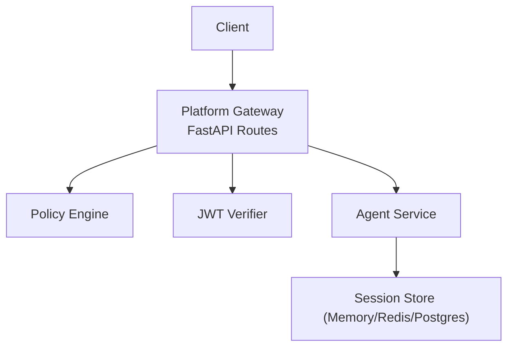
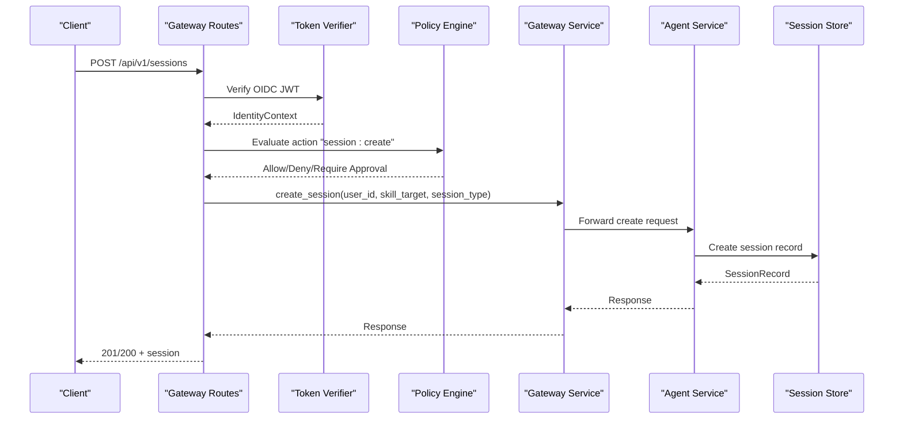
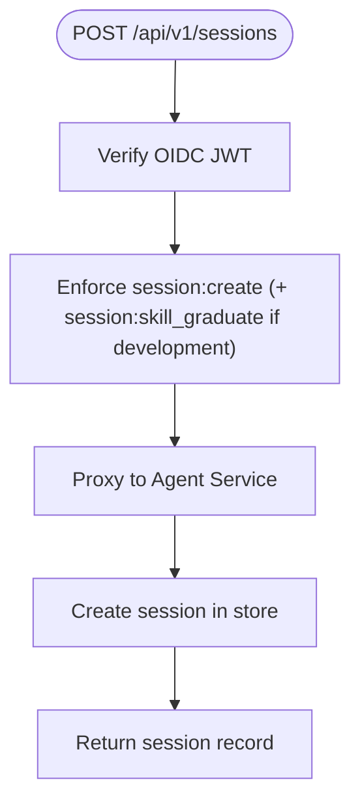
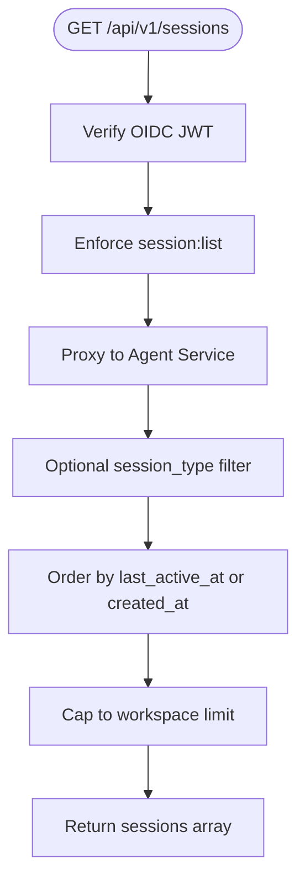
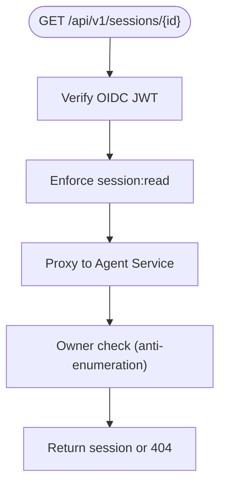
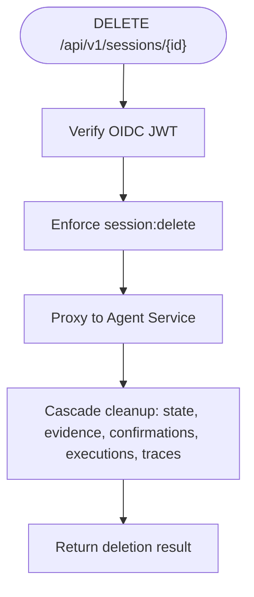
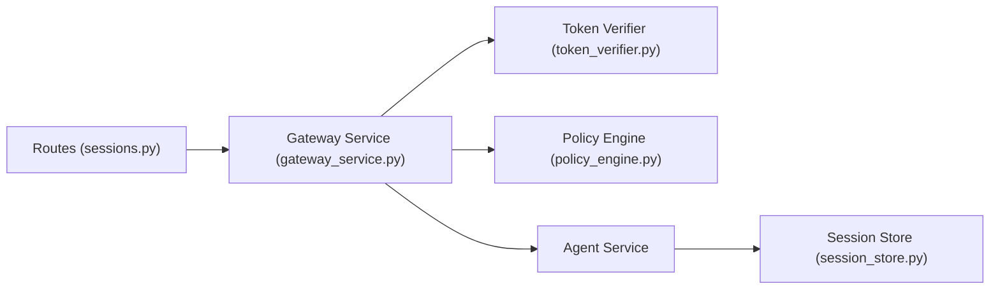

# Sessions API

<cite>
**Referenced Files in This Document**
- [sessions.py](file://products/platform-gateway/src/platform_gateway/api/routes/sessions.py)
- [gateway_service.py](file://products/platform-gateway/src/platform_gateway/services/gateway_service.py)
- [policy_engine.py](file://products/platform-gateway/src/platform_gateway/services/policy_engine.py)
- [token_verifier.py](file://products/platform-gateway/src/platform_gateway/services/token_verifier.py)
- [api.py](file://products/platform-gateway/src/platform_gateway/schemas/api.py)
- [session_service.py](file://products/agent-platform/src/agent_service/services/session_service.py)
- [session_store.py](file://products/agent-platform/src/agent_service/services/session_store.py)
- [agent-session.schema.json](file://shared/shared-contracts/schemas/agent-session.schema.json)
- [identity-token.schema.json](file://shared/shared-contracts/schemas/identity-token.schema.json)
</cite>

## Table of Contents
1. [Introduction](#introduction)
2. [Project Structure](#project-structure)
3. [Core Components](#core-components)
4. [Architecture Overview](#architecture-overview)
5. [Detailed Component Analysis](#detailed-component-analysis)
6. [Dependency Analysis](#dependency-analysis)
7. [Performance Considerations](#performance-considerations)
8. [Troubleshooting Guide](#troubleshooting-guide)
9. [Conclusion](#conclusion)

## Introduction
This document provides comprehensive API documentation for the Sessions management endpoints exposed by the Platform Gateway. It covers session lifecycle operations including creation, listing, retrieval, and deletion, along with related workspace operations such as title updates and skill-development workflows. The gateway enforces authentication via OIDC tokens, evaluates authorization through a policy engine, and proxies requests to the Agent Service while preserving error postures and auditability.

## Project Structure
The Sessions API surface is implemented as FastAPI routes that:
- Resolve identity from an Authorization header containing an OIDC JWT
- Enforce per-action authorization using the policy engine
- Proxy calls to the Agent Service for session persistence and business logic
- Emit structured logs and audit events

**Diagram sources**
- [sessions.py:41-360](file://products/platform-gateway/src/platform_gateway/api/routes/sessions.py#L41-L360)
- [gateway_service.py:204-300](file://products/platform-gateway/src/platform_gateway/services/gateway_service.py#L204-L300)
- [policy_engine.py:390-443](file://products/platform-gateway/src/platform_gateway/services/policy_engine.py#L390-L443)
- [token_verifier.py:52-89](file://products/platform-gateway/src/platform_gateway/services/token_verifier.py#L52-L89)
- [session_store.py:128-800](file://products/agent-platform/src/agent_service/services/session_store.py#L128-L800)

**Section sources**
- [sessions.py:41-360](file://products/platform-gateway/src/platform_gateway/api/routes/sessions.py#L41-L360)
- [gateway_service.py:204-300](file://products/platform-gateway/src/platform_gateway/services/gateway_service.py#L204-L300)

## Core Components
- Route handlers define HTTP endpoints and enforce identity and policy before proxying.
- Gateway service functions handle upstream communication, error mapping, and request forwarding.
- Policy engine defines actions and evaluates allow/deny/require_approval decisions based on roles.
- Token verifier validates OIDC JWTs locally using JWKS and maps claims to an IdentityContext.
- Session service and store implement session lifecycle, ownership checks, listing, and persistence backends.

Key responsibilities:
- Authentication: Bearer token verification against configured issuer and audience.
- Authorization: Per-action evaluation (create, read, list, delete, update, skill draft, skill graduate).
- Persistence: Pluggable stores (in-memory, Redis, Postgres) with TTL, ordering, and cleanup.
- Auditability: Structured logging and audit events for key mutations.

**Section sources**
- [sessions.py:41-360](file://products/platform-gateway/src/platform_gateway/api/routes/sessions.py#L41-L360)
- [gateway_service.py:331-683](file://products/platform-gateway/src/platform_gateway/services/gateway_service.py#L331-L683)
- [policy_engine.py:30-127](file://products/platform-gateway/src/platform_gateway/services/policy_engine.py#L30-L127)
- [token_verifier.py:52-89](file://products/platform-gateway/src/platform_gateway/services/token_verifier.py#L52-L89)
- [session_service.py:45-265](file://products/agent-platform/src/agent_service/services/session_service.py#L45-L265)
- [session_store.py:46-800](file://products/agent-platform/src/agent_service/services/session_store.py#L46-L800)

## Architecture Overview
The end-to-end flow for session operations involves identity resolution, policy enforcement, and proxying to the Agent Service, which persists data via a pluggable session store.

**Diagram sources**
- [sessions.py:41-101](file://products/platform-gateway/src/platform_gateway/api/routes/sessions.py#L41-L101)
- [gateway_service.py:331-371](file://products/platform-gateway/src/platform_gateway/services/gateway_service.py#L331-L371)
- [policy_engine.py:390-443](file://products/platform-gateway/src/platform_gateway/services/policy_engine.py#L390-L443)
- [token_verifier.py:52-89](file://products/platform-gateway/src/platform_gateway/services/token_verifier.py#L52-L89)
- [session_store.py:163-181](file://products/agent-platform/src/agent_service/services/session_store.py#L163-L181)

## Detailed Component Analysis

### Endpoints Reference

#### POST /api/v1/sessions
- Purpose: Create a new session; optionally declare a skill-development target and specify session type.
- Authentication: Requires a valid OIDC bearer token unless running in dev mode with synthetic identity.
- Authorization: Requires action "session:create". If session_type is "development", also requires "session:skill_graduate".
- Request body fields:
  - user_id: string | null (optional)
  - skill_target: string | null (min_length=1, max_length=2048)
  - session_type: "operation" | "development" (default "operation")
- Success response: Session object per shared schema.
- Error responses:
  - 401: Malformed or missing token when auth is required.
  - 403: Action denied by policy.
  - 422: Validation errors on request body.
  - 502: Agent service unavailable or upstream failure mapped by gateway.

Example usage:
- Create an operational session: send session_type "operation" without skill_target.
- Open a development session: set session_type "development"; ensure caller has "session:skill_graduate".
- Declare a skill target at creation: include skill_target; agent layer normalizes origin and drops query strings/credentials.

**Section sources**
- [sessions.py:41-101](file://products/platform-gateway/src/platform_gateway/api/routes/sessions.py#L41-L101)
- [api.py:59-84](file://products/platform-gateway/src/platform_gateway/schemas/api.py#L59-L84)
- [gateway_service.py:331-371](file://products/platform-gateway/src/platform_gateway/services/gateway_service.py#L331-L371)
- [policy_engine.py:30-127](file://products/platform-gateway/src/platform_gateway/services/policy_engine.py#L30-L127)

#### GET /api/v1/sessions
- Purpose: List sessions for the caller’s workspace, most recently active first.
- Query parameters:
  - session_type: optional filter ("operation" | "development"); omitted returns all sessions.
- Authentication: Requires a valid OIDC bearer token unless dev mode.
- Authorization: Requires action "session:list".
- Success response: Array of session records.
- Error responses:
  - 401: Missing/invalid token when required.
  - 403: Action denied by policy.
  - 502: Agent service unavailable or upstream failure.

Notes:
- Listing is scoped server-side to the caller’s sessions; foreign sessions are not enumerated.
- Optional session_type filter is additive and enforced upstream; omitting it preserves legacy behavior.

**Section sources**
- [sessions.py:104-134](file://products/platform-gateway/src/platform_gateway/api/routes/sessions.py#L104-L134)
- [gateway_service.py:406-436](file://products/platform-gateway/src/platform_gateway/services/gateway_service.py#L406-L436)
- [session_service.py:141-161](file://products/agent-platform/src/agent_service/services/session_service.py#L141-L161)

#### GET /api/v1/sessions/{session_id}
- Purpose: Retrieve details for a specific session owned by the caller.
- Path parameter:
  - session_id: string
- Authentication: Requires a valid OIDC bearer token unless dev mode.
- Authorization: Requires action "session:read".
- Success response: Single session record.
- Error responses:
  - 401: Missing/invalid token when required.
  - 403: Action denied by policy.
  - 404: Unknown or foreign session (anti-enumeration posture).
  - 502: Agent service unavailable or upstream failure.

**Section sources**
- [sessions.py:137-158](file://products/platform-gateway/src/platform_gateway/api/routes/sessions.py#L137-L158)
- [gateway_service.py:374-403](file://products/platform-gateway/src/platform_gateway/services/gateway_service.py#L374-L403)
- [session_service.py:116-121](file://products/agent-platform/src/agent_service/services/session_service.py#L116-L121)

#### PATCH /api/v1/sessions/{session_id}/title
- Purpose: Rename the session title (owner-only).
- Path parameter:
  - session_id: string
- Request body fields:
  - title: string (min_length=1, max_length=80)
- Authentication: Requires a valid OIDC bearer token unless dev mode.
- Authorization: Requires action "session:update".
- Success response: Updated session record.
- Error responses:
  - 401: Missing/invalid token when required.
  - 403: Action denied by policy.
  - 404: Unknown or foreign session.
  - 422: Validation errors on title length/format.
  - 502: Agent service unavailable or upstream failure.

Notes:
- Ownership is enforced server-side by the agent layer; unknown/foreign IDs return 404.
- Renames are cosmetic and unaudited at the gateway level.

**Section sources**
- [sessions.py:161-191](file://products/platform-gateway/src/platform_gateway/api/routes/sessions.py#L161-L191)
- [api.py:86-92](file://products/platform-gateway/src/platform_gateway/schemas/api.py#L86-L92)
- [gateway_service.py:533-562](file://products/platform-gateway/src/platform_gateway/services/gateway_service.py#L533-L562)
- [session_service.py:124-138](file://products/agent-platform/src/agent_service/services/session_service.py#L124-L138)

#### DELETE /api/v1/sessions/{session_id}
- Purpose: Delete a session owned by the caller.
- Path parameter:
  - session_id: string
- Authentication: Requires a valid OIDC bearer token unless dev mode.
- Authorization: Requires action "session:delete".
- Success response: Deletion confirmation.
- Error responses:
  - 401: Missing/invalid token when required.
  - 403: Action denied by policy.
  - 404: Unknown or foreign session.
  - 409: Parked session (confirmation pending) rejected by agent.
  - 502: Agent service unavailable or upstream failure.

Notes:
- Deleting cascades cleanup of agent state, evidence, confirmations, execution records, and authoring traces where applicable.

**Section sources**
- [sessions.py:325-360](file://products/platform-gateway/src/platform_gateway/api/routes/sessions.py#L325-L360)
- [gateway_service.py:501-530](file://products/platform-gateway/src/platform_gateway/services/gateway_service.py#L501-L530)
- [session_service.py:203-265](file://products/agent-platform/src/agent_service/services/session_service.py#L203-L265)

### Data Models

#### Session Record
- Fields:
  - session_id: string (required)
  - user_id: string (required)
  - created_at: date-time (required)
  - status: "active" | "expired" (default "active")
  - session_type: "operation" | "development" (default "operation")
  - title: string | null
  - last_active_at: date-time | null
  - pending_confirmation: boolean
  - transcript_available: boolean
  - transcript: array of {role, content, created_at}
  - evidence_turns: array | null
  - confirmations: array | null
  - model: string | null

Validation rules and semantics are defined by the shared schema and mirrored in Pydantic models.

**Section sources**
- [agent-session.schema.json:1-224](file://shared/shared-contracts/schemas/agent-session.schema.json#L1-L224)
- [api.py:165-194](file://products/platform-gateway/src/platform_gateway/schemas/api.py#L165-L194)

#### Identity Token Claims
- Required claims: iss, sub, username, aud, iat, exp
- Optional claims: email, roles, groups, act
- Audience must include the gateway’s configured audience; issuer must match configured issuer.

**Section sources**
- [identity-token.schema.json:1-56](file://shared/shared-contracts/schemas/identity-token.schema.json#L1-L56)
- [token_verifier.py:52-89](file://products/platform-gateway/src/platform_gateway/services/token_verifier.py#L52-L89)

### Authentication and Authorization

- Authentication:
  - Bearer token expected in Authorization header.
  - Local JWT verification using JWKS; supports expired/invalid issuer/audience detection.
  - Dev mode allows synthetic identity when no token is present and configuration permits.

- Authorization:
  - Actions evaluated by policy engine: session:create, session:read, session:list, session:delete, session:update, session:skill_draft, session:skill_graduate.
  - Deny-by-default; explicit deny overrides require_approval and allow; require_approval overrides allow.
  - For development sessions, dual-gate requires both session:create and session:skill_graduate.

Error posture:
- 401 for malformed/missing/expired tokens when auth is required.
- 403 for policy denial with structured detail including action and reason.

**Section sources**
- [gateway_service.py:204-300](file://products/platform-gateway/src/platform_gateway/services/gateway_service.py#L204-L300)
- [policy_engine.py:390-443](file://products/platform-gateway/src/platform_gateway/services/policy_engine.py#L390-L443)
- [token_verifier.py:52-89](file://products/platform-gateway/src/platform_gateway/services/token_verifier.py#L52-L89)

### Session Lifecycle Flows

#### Creation Flow

**Diagram sources**
- [sessions.py:41-101](file://products/platform-gateway/src/platform_gateway/api/routes/sessions.py#L41-L101)
- [gateway_service.py:331-371](file://products/platform-gateway/src/platform_gateway/services/gateway_service.py#L331-L371)
- [session_store.py:163-181](file://products/agent-platform/src/agent_service/services/session_store.py#L163-L181)

#### Listing Flow

**Diagram sources**
- [sessions.py:104-134](file://products/platform-gateway/src/platform_gateway/api/routes/sessions.py#L104-L134)
- [session_service.py:141-161](file://products/agent-platform/src/agent_service/services/session_service.py#L141-L161)

#### Retrieval Flow

**Diagram sources**
- [sessions.py:137-158](file://products/platform-gateway/src/platform_gateway/api/routes/sessions.py#L137-L158)
- [session_service.py:116-121](file://products/agent-platform/src/agent_service/services/session_service.py#L116-L121)

#### Deletion Flow

**Diagram sources**
- [sessions.py:325-360](file://products/platform-gateway/src/platform_gateway/api/routes/sessions.py#L325-L360)
- [session_service.py:203-265](file://products/agent-platform/src/agent_service/services/session_service.py#L203-L265)

### Workspace Context Management
- Title minting: First user turn sets a capped title; separate owner rename overwrites it.
- Model pinning: Most recent resolved model id is pinned per session.
- Ordering: Sessions ordered by last_active_at descending; fallback to created_at.
- Scope filtering: Optional session_type narrows listings to operation or development entries.

**Section sources**
- [session_service.py:164-200](file://products/agent-platform/src/agent_service/services/session_service.py#L164-L200)
- [session_store.py:400-446](file://products/agent-platform/src/agent_service/services/session_store.py#L400-L446)

## Dependency Analysis
- Routes depend on gateway service functions for proxying and error mapping.
- Gateway service depends on token verifier and policy engine for security.
- Agent service implements session business logic and delegates to session store backends.
- Session store backends provide pluggable persistence with consistent interface.

**Diagram sources**
- [sessions.py:41-360](file://products/platform-gateway/src/platform_gateway/api/routes/sessions.py#L41-L360)
- [gateway_service.py:204-683](file://products/platform-gateway/src/platform_gateway/services/gateway_service.py#L204-L683)
- [policy_engine.py:390-443](file://products/platform-gateway/src/platform_gateway/services/policy_engine.py#L390-L443)
- [token_verifier.py:52-89](file://products/platform-gateway/src/platform_gateway/services/token_verifier.py#L52-L89)
- [session_store.py:128-800](file://products/agent-platform/src/agent_service/services/session_store.py#L128-L800)

**Section sources**
- [sessions.py:41-360](file://products/platform-gateway/src/platform_gateway/api/routes/sessions.py#L41-L360)
- [gateway_service.py:204-683](file://products/platform-gateway/src/platform_gateway/services/gateway_service.py#L204-L683)
- [session_store.py:128-800](file://products/agent-platform/src/agent_service/services/session_store.py#L128-L800)

## Performance Considerations
- Listing cap: Workspace lists are capped to prevent large payloads.
- TTL and eviction: In-memory and Redis backends use TTL and eviction to bound memory usage.
- Server-side limits: Postgres backend applies server-side limits and sweeps expired rows opportunistically.
- Best-effort cleanup: Cascading deletions are best-effort to avoid failing session deletion due to downstream store failures.

[No sources needed since this section provides general guidance]

## Troubleshooting Guide
Common issues and resolutions:
- 401 Unauthorized:
  - Ensure Authorization header contains a valid Bearer token.
  - Check token issuer and audience configuration.
  - Validate token expiration and signature.

- 403 Forbidden:
  - Confirm caller roles include required action grants.
  - For development sessions, verify session:skill_graduate is granted.

- 404 Not Found:
  - Unknown or foreign session IDs return 404 to prevent enumeration.
  - Verify session ownership and existence.

- 409 Conflict:
  - Parked sessions may reject deletion until confirmations are resolved.

- 502 Bad Gateway:
  - Indicates upstream Agent Service unavailability or transport failure.
  - Retry after transient outages; inspect agent service health.

Rate limiting:
- No explicit rate limiting is enforced at the gateway layer for these endpoints; clients should implement retries with backoff for transient errors.

**Section sources**
- [gateway_service.py:204-300](file://products/platform-gateway/src/platform_gateway/services/gateway_service.py#L204-L300)
- [gateway_service.py:331-683](file://products/platform-gateway/src/platform_gateway/services/gateway_service.py#L331-L683)
- [session_service.py:45-121](file://products/agent-platform/src/agent_service/services/session_service.py#L45-L121)

## Conclusion
The Platform Gateway’s Sessions API provides a secure, policy-driven surface for managing session lifecycles across multi-tenant workspaces. It enforces OIDC-based authentication, role-based authorization, and robust error postures while delegating persistence to pluggable backends. Clients should adhere to the documented schemas, handle 4xx/5xx responses appropriately, and respect optional filters like session_type for workspace scoping.

[No sources needed since this section summarizes without analyzing specific files]