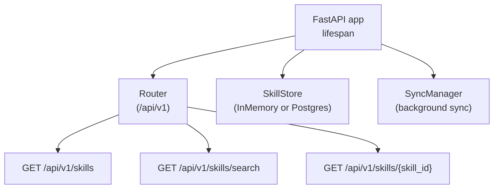
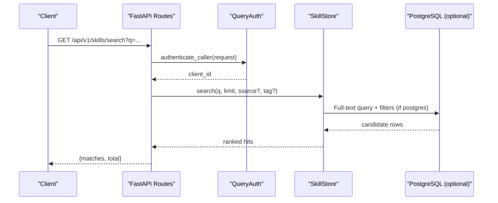
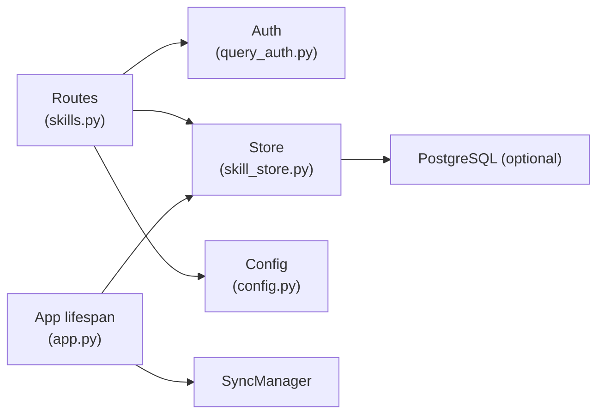

# Skills Registry API

<cite>
**Referenced Files in This Document**
- [app.py](file://products/skills-hub/src/skills_hub/app.py)
- [router.py](file://products/skills-hub/src/skills_hub/api/router.py)
- [skills.py](file://products/skills-hub/src/skills_hub/api/routes/skills.py)
- [skill_store.py](file://products/skills-hub/src/skills_hub/services/skill_store.py)
- [query_auth.py](file://products/skills-hub/src/skills_hub/services/query_auth.py)
- [config.py](file://products/skills-hub/src/skills_hub/core/config.py)
- [skill.schema.json](file://shared/shared-contracts/schemas/skill.schema.json)
- [skill.py](file://products/skills-hub/src/skills_hub/schemas/skill.py)
- [test_routes.py](file://products/skills-hub/tests/test_routes.py)
- [SkillsView.tsx](file://products/operator-portal/web-ui/app/src/views/control/SkillsView.tsx)
- [skills_connector.py](file://products/tool-gateway/src/tool_gateway/tools/skills_connector.py)
- [SPEC-057-skill-composition-runbooks/spec.md](file://docs/specs/SPEC-057-skill-composition-runbooks/spec.md)
- [composition-trust-model-spike.md](file://docs/workspace/composition-trust-model-spike.md)
</cite>

## Table of Contents
1. [Introduction](#introduction)
2. [Project Structure](#project-structure)
3. [Core Components](#core-components)
4. [Architecture Overview](#architecture-overview)
5. [Detailed Component Analysis](#detailed-component-analysis)
6. [Dependency Analysis](#dependency-analysis)
7. [Performance Considerations](#performance-considerations)
8. [Troubleshooting Guide](#troubleshooting-guide)
9. [Conclusion](#conclusion)

## Introduction
This document specifies the Skills registry API exposed by the skills-hub service for discovering, retrieving, and searching operational guidance and runbooks (skills). It covers:
- HTTP endpoints for listing, retrieving, and searching skills
- Request/response schemas for skill metadata, content versions, and search queries
- Authentication and authorization for skill access
- Skill lifecycle states and composition semantics
- Execution context passing for executable flows
- Performance characteristics and caching strategies

The API is versioned under /api/v1 and is consumed by platform services and operator tools.

## Project Structure
The skills-hub FastAPI application wires routers, initializes a durable or in-memory store, and starts a background sync manager. The retrieval routes are registered under /api/v1 with explicit ordering to ensure /skills/search matches before the catch-all /skills/{skill_id:path}.

**Diagram sources**
- [app.py:20-86](file://products/skills-hub/src/skills_hub/app.py#L20-L86)
- [router.py:1-10](file://products/skills-hub/src/skills_hub/api/router.py#L1-L10)

**Section sources**
- [app.py:20-86](file://products/skills-hub/src/skills_hub/app.py#L20-L86)
- [router.py:1-10](file://products/skills-hub/src/skills_hub/api/router.py#L1-L10)

## Core Components
- Retrieval routes: list, search, get, validate
- Skill store abstraction with in-memory and PostgreSQL backends
- Query authentication supporting static Basic credentials and projected workload tokens
- Shared schema definitions for skill envelopes and steps
- Usage audit emission for search and retrieval

Key responsibilities:
- Route handlers authenticate callers, validate parameters, delegate to the store, emit usage events, and return JSON responses.
- Store implementations provide list, search, get, count, and source replacement/pruning.
- Auth module resolves caller identity from Authorization headers.
- Schema models enforce field constraints and provide summary serialization.

**Section sources**
- [skills.py:28-215](file://products/skills-hub/src/skills_hub/api/routes/skills.py#L28-L215)
- [skill_store.py:30-66](file://products/skills-hub/src/skills_hub/services/skill_store.py#L30-L66)
- [query_auth.py:107-120](file://products/skills-hub/src/skills_hub/services/query_auth.py#L107-L120)
- [skill.py:15-66](file://products/skills-hub/src/skills_hub/schemas/skill.py#L15-L66)

## Architecture Overview
The API follows a layered design:
- HTTP layer: FastAPI routes handle request parsing, auth, validation, metrics, and audit emissions.
- Service layer: SkillStore abstracts storage; backend selection is configured at startup.
- Data layer: In-memory dict for dev/test; PostgreSQL with full-text search index for production.
- Cross-cutting: Settings loaded from environment; telemetry/metrics; audit emission.

**Diagram sources**
- [skills.py:99-146](file://products/skills-hub/src/skills_hub/api/routes/skills.py#L99-L146)
- [query_auth.py:107-120](file://products/skills-hub/src/skills_hub/services/query_auth.py#L107-L120)
- [skill_store.py:417-443](file://products/skills-hub/src/skills_hub/services/skill_store.py#L417-L443)

## Detailed Component Analysis

### Endpoint: GET /api/v1/skills
Purpose: List skill summaries with pagination and optional filtering by source and tag.

Authentication: Required (Basic or Bearer workload token).

Query parameters:
- offset: integer >= 0
- limit: integer within 1..100
- source: optional string
- tag: optional string

Response fields:
- skills: array of skill summaries (no body)
- total: integer
- offset: integer
- limit: integer

Error responses:
- 401 UNAUTHORIZED when authentication fails
- 400 INVALID_PARAMETERS for invalid offset/limit values

Example usage patterns:
- Discovery: call with default pagination to enumerate available skills
- Filtering: add source or tag to narrow results

Notes:
- Search and list do not include the full Markdown body to reduce payload size.
- Audit events are emitted for search and retrieval; list failures are intentionally not audited.

**Section sources**
- [skills.py:68-96](file://products/skills-hub/src/skills_hub/api/routes/skills.py#L68-L96)
- [test_routes.py:132-134](file://products/skills-hub/tests/test_routes.py#L132-L134)

### Endpoint: GET /api/v1/skills/{skill_id}
Purpose: Retrieve the full skill record including the Markdown body.

Authentication: Required.

Path parameter:
- skill_id: namespaced identifier <source_id>/<slug>

Response fields:
- All fields defined by the skill envelope, including body (capped), updated_at, tags, version, kind, steps (when present), etc.

Error responses:
- 401 UNAUTHORIZED on auth failure
- 404 SKILL_NOT_FOUND when skill_id does not exist

Usage example:
- Open a specific skill’s full content after discovery via list or search.

**Section sources**
- [skills.py:184-215](file://products/skills-hub/src/skills_hub/api/routes/skills.py#L184-L215)
- [skill.schema.json:1-125](file://shared/shared-contracts/schemas/skill.schema.json#L1-L125)
- [skill.py:31-66](file://products/skills-hub/src/skills_hub/schemas/skill.py#L31-L66)

### Endpoint: GET /api/v1/skills/search
Note: Although the objective mentions POST /api/v1/skills/search, the implemented endpoint is GET with query parameters.

Purpose: Search skills by text across title/body/tags with optional source and tag filters. Returns ranked matches with excerpts.

Authentication: Required.

Query parameters:
- q: required non-empty string
- limit: integer within 1..20
- source: optional string
- tag: optional string

Response fields:
- matches: array of hit objects containing skill summary plus score and excerpt
- total: number of matches

Error responses:
- 401 UNAUTHORIZED on auth failure
- 400 INVALID_PARAMETERS if q is empty or limit out of range

Search behavior:
- Tokenized lexemes used to build a safe tsquery
- PostgreSQL uses a GIN full-text index over title+body; tags are pre-filtered
- Results are re-ranked by the shared scorer for consistent ordering

Examples:
- Discover skills matching an incident keyword
- Narrow search by source or tag

**Section sources**
- [skills.py:99-146](file://products/skills-hub/src/skills_hub/api/routes/skills.py#L99-L146)
- [skill_store.py:417-443](file://products/skills-hub/src/skills_hub/services/skill_store.py#L417-L443)
- [test_routes.py:138-162](file://products/skills-hub/tests/test_routes.py#L138-L162)

### Endpoint: POST /api/v1/skills/validate
Purpose: Validate a candidate skill document against the skill format without persisting it.

Authentication: Required.

Request body:
- document: string (UTF-8 bytes capped)

Response fields:
- valid: boolean
- reason: string (present when valid is false)

Behavior:
- Uses the same ingestion validation path as the sync process
- Read-only; no store write, no sync trigger, no audit emission

**Section sources**
- [skills.py:149-182](file://products/skills-hub/src/skills_hub/api/routes/skills.py#L149-L182)

### Skill Envelope and Versioning
The canonical skill envelope defines metadata, optional execution artifacts, and content:
- Identifiers: skill_id, source_id, source_path, source_ref
- Content: title, description, tags, version, source_url, updated_at, body
- Executable flow fields: kind (knowledge or executable_flow), steps (ordered replay), web_target, risk_class, flow_intent

Versioning:
- version is an author-managed marker carried in the envelope
- updated_at reflects ingestion-side UTC timestamp of last accepted sync
- For executable flows, steps carry tool, args, and optional expect assertions

Rendering:
- List and search omit body; get returns full record
- Excerpts in search are generated alongside scores

**Section sources**
- [skill.schema.json:1-125](file://shared/shared-contracts/schemas/skill.schema.json#L1-L125)
- [skill.py:15-66](file://products/skills-hub/src/skills_hub/schemas/skill.py#L15-L66)

### Authentication and Authorization
Two supported paths:
- Static Basic credentials against a configured query client registry
- Workload tokens (Bearer) validated against a cluster OIDC issuer with audience and subject mapping

Authorization model:
- Access control is based on successful authentication against the configured registry
- No per-skill RBAC is enforced at this layer; downstream consumers may apply policy

Audit:
- Successful searches and retrievals emit usage audit events correlated by x-request-id

**Section sources**
- [query_auth.py:36-95](file://products/skills-hub/src/skills_hub/services/query_auth.py#L36-L95)
- [query_auth.py:107-120](file://products/skills-hub/src/skills_hub/services/query_auth.py#L107-L120)
- [config.py:133-158](file://products/skills-hub/src/skills_hub/core/config.py#L133-L158)
- [skills.py:47-66](file://products/skills-hub/src/skills_hub/api/routes/skills.py#L47-L66)

### Skill Lifecycle States
Lifecycle phases relevant to skills:
- Draft: Authoring and preview state during development
- Testing: Validation and iteration prior to graduation
- Production: Graduated skills served by the registry

Graduation:
- Graduation transitions a skill into production-like status
- Tests assert that graduation emits an audit event and flips lifecycle state
- Graduation does not publish directly through these retrieval endpoints; it affects how skills are treated downstream

**Section sources**
- [test_skill_graduation.py:1643-1671](file://products/agent-platform/tests/test_skill_graduation.py#L1643-L1671)

### Skill Composition and Dependency Resolution
Composition semantics:
- Skills are single-target; multi-target workflows are expressed as compositions
- A composition is an ordered, validated list of single-target sub-skill references
- Compositions carry no authority; each sub-skill retains its own gate
- There is no interpreter or transactional sequencing; compositions serve as grounded guidance

Dependency resolution:
- Each sub-skill is resolved independently at runtime
- Rebinding to a different sub-skill triggers re-parking of subsequent write-tier actions

**Section sources**
- [SPEC-057-skill-composition-runbooks/spec.md:35-55](file://docs/specs/SPEC-057-skill-composition-runbooks/spec.md#L35-L55)
- [composition-trust-model-spike.md:25-92](file://docs/workspace/composition-trust-model-spike.md#L25-L92)

### Execution Context Passing
Execution context:
- FlowContext.identity() returns (skill_id, origin)
- One context per session; rebind to a different flow replaces identity
- Write-tier browser calls are admitted only while bound to the same flow; rebinding causes re-park

Implications:
- Compositions navigate between sub-skills by rebinding, which naturally enforces per-sub-skill gates
- Steps and expects are display/replay aids and never security inputs

**Section sources**
- [composition-trust-model-spike.md:25-92](file://docs/workspace/composition-trust-model-spike.md#L25-L92)

### Example Workflows

#### Skill Discovery
- Call GET /api/v1/skills with pagination and optional source/tag filters
- Use returned skill_id values to open details

#### Version Retrieval
- Call GET /api/v1/skills/{skill_id} to fetch full content including body and version metadata

#### Content Rendering
- UI consumes list/search summaries for browsing
- On view, fetches full record for rendering Markdown content

**Section sources**
- [SkillsView.tsx:46-79](file://products/operator-portal/web-ui/app/src/views/control/SkillsView.tsx#L46-L79)
- [skills_connector.py:316-357](file://products/tool-gateway/src/tool_gateway/tools/skills_connector.py#L316-L357)

## Dependency Analysis
The API depends on configuration, authentication, and storage abstractions.

**Diagram sources**
- [skills.py:28-215](file://products/skills-hub/src/skills_hub/api/routes/skills.py#L28-L215)
- [query_auth.py:107-120](file://products/skills-hub/src/skills_hub/services/query_auth.py#L107-L120)
- [skill_store.py:489-498](file://products/skills-hub/src/skills_hub/services/skill_store.py#L489-L498)
- [app.py:20-86](file://products/skills-hub/src/skills_hub/app.py#L20-L86)

**Section sources**
- [router.py:1-10](file://products/skills-hub/src/skills_hub/api/router.py#L1-L10)
- [app.py:20-86](file://products/skills-hub/src/skills_hub/app.py#L20-L86)

## Performance Considerations
- Pagination: Use offset and limit on list to avoid large payloads
- Search limits: Enforced to MAX_SEARCH_LIMIT to bound result sets
- Full-text search: PostgreSQL GIN index on title+body accelerates search; tags are pre-filtered to keep queries efficient
- Backend selection: In-memory store for dev/test; PostgreSQL for production durability and indexing
- Connection handling: Per-operation connections for low-volume retrieval traffic
- Metrics and telemetry: Request logging and metrics recorded for observability

Optimization recommendations:
- Cache frequently accessed skill IDs at the client or gateway layer where appropriate
- Prefer targeted search with source/tag filters to reduce result set size
- Monitor search latency and adjust limits based on observed load

[No sources needed since this section provides general guidance]

## Troubleshooting Guide
Common issues and resolutions:
- 401 UNAUTHORIZED: Ensure Authorization header contains either Basic credentials from the configured registry or a valid Bearer workload token
- 400 INVALID_PARAMETERS: Verify q is non-empty for search; ensure offset >= 0 and limit within allowed ranges
- 404 SKILL_NOT_FOUND: Confirm skill_id exists and is correctly namespaced
- Empty search results: Check tokenization and query terms; consider broader keywords or removing filters

Diagnostics:
- Inspect audit events for search and retrieval outcomes correlated by x-request-id
- Review server logs for request duration and status codes emitted by middleware

**Section sources**
- [skills.py:40-44](file://products/skills-hub/src/skills_hub/api/routes/skills.py#L40-L44)
- [skills.py:108-119](file://products/skills-hub/src/skills_hub/api/routes/skills.py#L108-L119)
- [skills.py:190-205](file://products/skills-hub/src/skills_hub/api/routes/skills.py#L190-L205)
- [app.py:65-81](file://products/skills-hub/src/skills_hub/app.py#L65-L81)

## Conclusion
The Skills registry API provides secure, paginated discovery, precise retrieval, and efficient search of operational guidance and runbooks. It supports both knowledge and executable-flow skills, integrates with platform authentication, and emits usage audit events. Composition enables multi-target workflows while preserving per-skill authorization boundaries. With robust storage backends and performance-oriented design, the API serves as a reliable foundation for skill-driven operations.