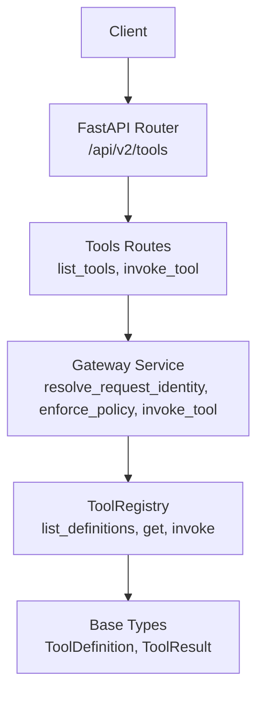
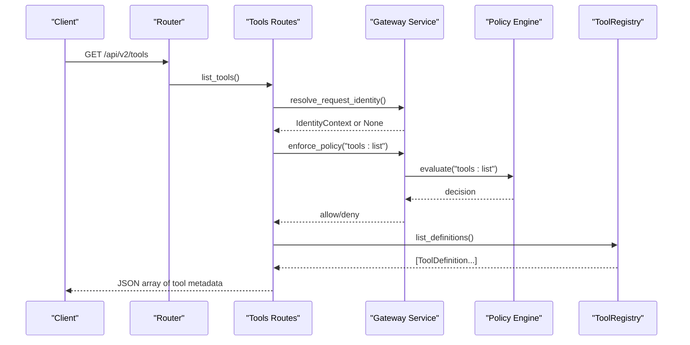
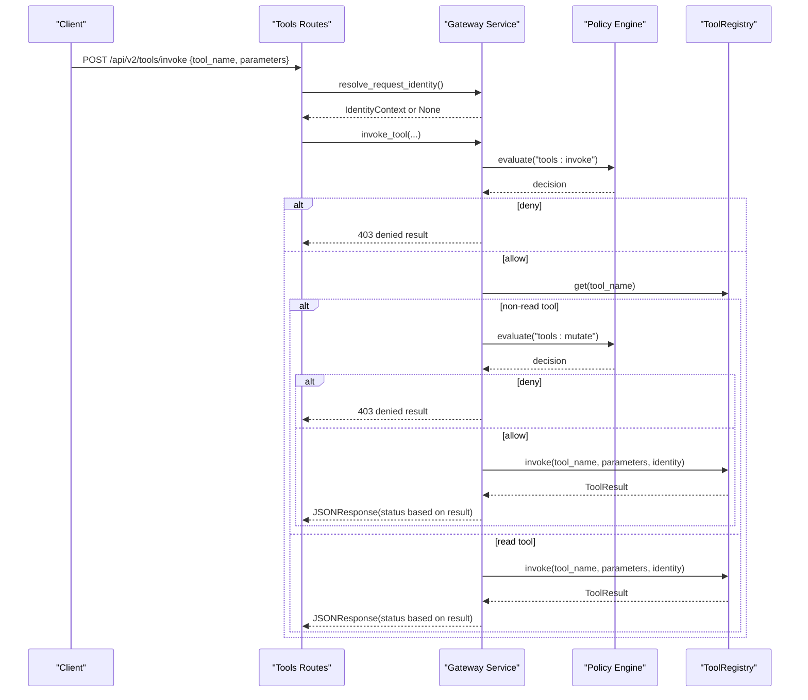
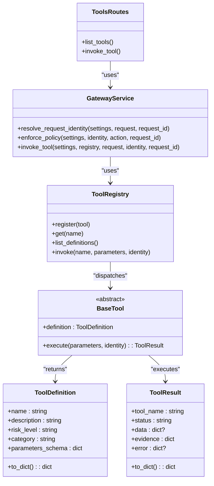

# Tools Discovery API

<cite>
**Referenced Files in This Document**
- [tools.py](file://products/tool-gateway/src/tool_gateway/api/routes/tools.py)
- [router.py](file://products/tool-gateway/src/tool_gateway/api/router.py)
- [gateway_service.py](file://products/tool-gateway/src/tool_gateway/services/gateway_service.py)
- [registry.py](file://products/tool-gateway/src/tool_gateway/tools/registry.py)
- [base.py](file://products/tool-gateway/src/tool_gateway/tools/base.py)
- [api.py](file://products/tool-gateway/src/tool_gateway/schemas/api.py)
</cite>

## Table of Contents
1. [Introduction](#introduction)
2. [Project Structure](#project-structure)
3. [Core Components](#core-components)
4. [Architecture Overview](#architecture-overview)
5. [Detailed Component Analysis](#detailed-component-analysis)
6. [Dependency Analysis](#dependency-analysis)
7. [Performance Considerations](#performance-considerations)
8. [Troubleshooting Guide](#troubleshooting-guide)
9. [Conclusion](#conclusion)
10. [Appendices](#appendices)

## Introduction
This document specifies the Tools discovery and metadata endpoints exposed by the Tool Gateway. It covers how clients can discover available tools, inspect tool metadata (including parameters), and understand authentication, authorization, versioning, deprecation, and performance characteristics relevant to large catalogs.

The implementation exposes a v2 tools router under /api/v2/tools with:
- A list endpoint that returns metadata for all registered tools.
- An invoke endpoint that executes a tool with policy enforcement and audit logging.

There is no dedicated per-tool GET endpoint or categories listing endpoint in the current code; tool filtering by category, capability, or availability must be performed client-side using the returned metadata.

## Project Structure
The Tools API lives in the Tool Gateway product. The FastAPI router mounts the tools routes, which delegate identity resolution, policy checks, and invocation orchestration to service functions. Tool definitions are provided by an in-process registry used by both discovery and execution paths.

**Diagram sources**
- [router.py:1-8](file://products/tool-gateway/src/tool_gateway/api/router.py#L1-L8)
- [tools.py:21-51](file://products/tool-gateway/src/tool_gateway/api/routes/tools.py#L21-L51)
- [gateway_service.py:61-155](file://products/tool-gateway/src/tool_gateway/services/gateway_service.py#L61-L155)
- [registry.py:18-89](file://products/tool-gateway/src/tool_gateway/tools/registry.py#L18-L89)
- [base.py:15-55](file://products/tool-gateway/src/tool_gateway/tools/base.py#L15-L55)

**Section sources**
- [router.py:1-8](file://products/tool-gateway/src/tool_gateway/api/router.py#L1-L8)
- [tools.py:21-51](file://products/tool-gateway/src/tool_gateway/api/routes/tools.py#L21-L51)

## Core Components
- Tools routes: Define HTTP endpoints for listing tool metadata and invoking tools.
- Gateway service: Resolves request identity from bearer tokens, enforces policies, orchestrates invocation, redaction, auditing, and response shaping.
- Tool registry: Holds registered tools, validates risk tiers, lists definitions, and dispatches invocations.
- Base types: Define ToolDefinition (metadata schema) and ToolResult (execution envelope).
- Identity context: Typed model mirroring shared identity contract.

Key responsibilities:
- Authentication: Bearer token verification; optional dev synthetic identity when auth is disabled.
- Authorization: Policy evaluation for actions like tools:list and tools:invoke; additional tools:mutate check for non-read tools.
- Metadata exposure: List endpoint returns ToolDefinition objects serialized to dicts.
- Execution: Invoke endpoint validates input, applies policy, dispatches to registry, redacts output if configured, audits, and returns structured results.

**Section sources**
- [tools.py:24-51](file://products/tool-gateway/src/tool_gateway/api/routes/tools.py#L24-L51)
- [gateway_service.py:61-155](file://products/tool-gateway/src/tool_gateway/services/gateway_service.py#L61-L155)
- [gateway_service.py:158-376](file://products/tool-gateway/src/tool_gateway/services/gateway_service.py#L158-L376)
- [registry.py:18-89](file://products/tool-gateway/src/tool_gateway/tools/registry.py#L18-L89)
- [base.py:15-55](file://products/tool-gateway/src/tool_gateway/tools/base.py#L15-L55)
- [api.py:6-17](file://products/tool-gateway/src/tool_gateway/schemas/api.py#L6-L17)

## Architecture Overview
The Tools API follows a layered design:
- API layer: FastAPI routers define endpoints and parse headers.
- Service layer: Handles identity resolution, policy enforcement, orchestration, redaction, and auditing.
- Domain layer: ToolRegistry encapsulates tool registration and dispatch; base types define contracts.

**Diagram sources**
- [tools.py:24-35](file://products/tool-gateway/src/tool_gateway/api/routes/tools.py#L24-L35)
- [gateway_service.py:61-155](file://products/tool-gateway/src/tool_gateway/services/gateway_service.py#L61-L155)
- [registry.py:61-63](file://products/tool-gateway/src/tool_gateway/tools/registry.py#L61-L63)

## Detailed Component Analysis

### Endpoint: List Tools
- Method and path: GET /api/v2/tools
- Purpose: Return metadata for all registered tools.
- Request:
  - Headers:
    - Authorization: Optional Bearer token. If present, must be valid; otherwise may require auth depending on settings.
    - x-request-id: Optional correlation ID.
- Response: Array of tool metadata objects. Each object contains fields defined by ToolDefinition.to_dict():
  - name: string
  - description: string
  - risk_level: one of "read", "write", "admin"
  - category: string (e.g., "kubernetes", "browser", "system")
  - parameters_schema: object describing required/optional parameters for the tool
- Authentication:
  - If Authorization header is present, it must be a valid bearer token; otherwise 401.
  - If no token and auth is required, 401.
  - If no token and auth is optional, a synthetic developer identity is used.
- Authorization:
  - Requires action tools:list to be allowed by policy. Denial returns 403 with reason.
- Filtering:
  - No server-side filters for category, capability, or availability. Clients should filter the returned list using the category and risk_level fields.

Example usage patterns:
- Browser automation: Filter by category containing "browser" and risk_level "read" to discover read-only browser inspection tools.
- Kubernetes operations: Filter by category "kubernetes" and risk_level "read" to find cluster state queries.
- System administration tasks: Filter by risk_level "write" or "admin" to identify mutating system tools.

**Section sources**
- [tools.py:24-35](file://products/tool-gateway/src/tool_gateway/api/routes/tools.py#L24-L35)
- [gateway_service.py:61-155](file://products/tool-gateway/src/tool_gateway/services/gateway_service.py#L61-L155)
- [base.py:15-32](file://products/tool-gateway/src/tool_gateway/tools/base.py#L15-L32)

### Endpoint: Invoke Tool
- Method and path: POST /api/v2/tools/invoke
- Purpose: Execute a registered tool with policy enforcement and audit logging.
- Request body:
  - tool_name: string (required)
  - parameters: object (tool-specific)
  - session_id: optional string (trusted internal callers only; carries no authority)
  - approval_kind: optional string, restricted to "flow" or "action" (trusted internal callers only; carries no authority)
- Response: Structured ToolResult envelope:
  - tool_name: string
  - status: "success", "error", or "denied"
  - data: optional result payload
  - evidence: object including executed_at, duration_ms, risk_level, source_system
  - error: optional {code, message}
- Authentication and Authorization:
  - Same identity resolution rules as list.
  - Requires action tools:invoke to be allowed by policy.
  - For non-read tools, an additional tools:mutate check is enforced.
- Redaction:
  - If enabled, responses may be redacted; overflow conditions return an error instead of leaking sensitive content.
- Audit:
  - All invocations emit durable audit events with subject, roles, tool_name, status, and risk_level.

**Diagram sources**
- [tools.py:38-51](file://products/tool-gateway/src/tool_gateway/api/routes/tools.py#L38-L51)
- [gateway_service.py:158-376](file://products/tool-gateway/src/tool_gateway/services/gateway_service.py#L158-L376)
- [registry.py:57-89](file://products/tool-gateway/src/tool_gateway/tools/registry.py#L57-L89)

**Section sources**
- [tools.py:38-51](file://products/tool-gateway/src/tool_gateway/api/routes/tools.py#L38-L51)
- [gateway_service.py:158-376](file://products/tool-gateway/src/tool_gateway/services/gateway_service.py#L158-L376)
- [registry.py:57-89](file://products/tool-gateway/src/tool_gateway/tools/registry.py#L57-L89)
- [base.py:35-55](file://products/tool-gateway/src/tool_gateway/tools/base.py#L35-L55)

### Tool Metadata Schema
Tool metadata is represented by ToolDefinition and serialized via to_dict(). Consumers should expect:
- name: unique identifier for the tool
- description: human-readable summary
- risk_level: "read", "write", or "admin"
- category: grouping label such as "kubernetes", "browser", or "system"
- parameters_schema: JSON Schema-like object describing required and optional parameters

Clients can use these fields to build dynamic UIs, filter tool lists, and validate invocation payloads before calling invoke.

**Section sources**
- [base.py:15-32](file://products/tool-gateway/src/tool_gateway/tools/base.py#L15-L32)

### Risk Tiers and Capability Filtering
Risk levels are validated at registration time and enforced at invocation time:
- read: requires tools:invoke
- write/admin: additionally require tools:mutate and cannot be auto-approved by the agent

To simulate capability-based filtering:
- Use risk_level to distinguish read-only vs mutating capabilities.
- Use category to group tools by domain (e.g., kubernetes, browser, system).

**Section sources**
- [registry.py:18-55](file://products/tool-gateway/src/tool_gateway/tools/registry.py#L18-L55)
- [base.py:9-12](file://products/tool-gateway/src/tool_gateway/tools/base.py#L9-L12)
- [gateway_service.py:250-291](file://products/tool-gateway/src/tool_gateway/services/gateway_service.py#L250-L291)

### Availability Status
Availability is not exposed as a separate field. A tool is considered available if it is registered in the ToolRegistry and passes policy checks. Clients can infer availability by:
- Listing tools and checking presence.
- Attempting invocation and handling TOOL_NOT_FOUND or policy denial responses.

**Section sources**
- [registry.py:57-77](file://products/tool-gateway/src/tool_gateway/tools/registry.py#L57-L77)
- [gateway_service.py:198-248](file://products/tool-gateway/src/tool_gateway/services/gateway_service.py#L198-L248)

### Categories Listing
There is no dedicated categories endpoint. To derive categories:
- Call GET /api/v2/tools and extract distinct values from the category field in the returned tool metadata.

**Section sources**
- [tools.py:24-35](file://products/tool-gateway/src/tool_gateway/api/routes/tools.py#L24-L35)
- [base.py:15-32](file://products/tool-gateway/src/tool_gateway/tools/base.py#L15-L32)

### Versioning and Deprecation Notices
- Service version: The gateway exposes its version in health/readiness surfaces.
- Tool-level versioning and deprecation notices are not modeled in ToolDefinition or ToolResult in the current code. Clients should treat tool names as stable identifiers and rely on runtime behavior changes being communicated through other channels (e.g., documentation or policy updates).

**Section sources**
- [gateway_service.py:32-58](file://products/tool-gateway/src/tool_gateway/services/gateway_service.py#L32-L58)
- [base.py:15-32](file://products/tool-gateway/src/tool_gateway/tools/base.py#L15-L32)

### Compatibility Matrices
Compatibility between clients and tools is best inferred from:
- parameters_schema: describe accepted inputs per tool.
- risk_level: indicates mutation scope and authorization requirements.
- category: indicates domain compatibility (e.g., kubernetes vs browser).

No explicit compatibility matrix endpoint exists; clients should implement their own mapping based on discovered metadata.

**Section sources**
- [base.py:15-32](file://products/tool-gateway/src/tool_gateway/tools/base.py#L15-L32)

## Dependency Analysis
The following diagram shows key dependencies among components involved in tool discovery and invocation.

**Diagram sources**
- [registry.py:18-89](file://products/tool-gateway/src/tool_gateway/tools/registry.py#L18-L89)
- [base.py:15-123](file://products/tool-gateway/src/tool_gateway/tools/base.py#L15-L123)
- [gateway_service.py:61-376](file://products/tool-gateway/src/tool_gateway/services/gateway_service.py#L61-L376)
- [tools.py:24-51](file://products/tool-gateway/src/tool_gateway/api/routes/tools.py#L24-L51)

**Section sources**
- [registry.py:18-89](file://products/tool-gateway/src/tool_gateway/tools/registry.py#L18-L89)
- [base.py:15-123](file://products/tool-gateway/src/tool_gateway/tools/base.py#L15-L123)
- [gateway_service.py:61-376](file://products/tool-gateway/src/tool_gateway/services/gateway_service.py#L61-L376)
- [tools.py:24-51](file://products/tool-gateway/src/tool_gateway/api/routes/tools.py#L24-L51)

## Performance Considerations
- Catalog size: The list endpoint returns all registered tools. For large catalogs, clients should cache the metadata locally and refresh periodically or on demand.
- Policy evaluation: Each request triggers policy evaluation; caching identities and decisions where appropriate can reduce overhead.
- Redaction: When enabled, output redaction adds processing cost and may truncate responses if overflow thresholds are exceeded.
- Invocation latency: End-to-end latency depends on downstream connectors; include timeouts and retries at the client layer.
- Observability: Metrics and logs are emitted for token verification, policy decisions, and tool invocations; use them to detect hotspots and tune behavior.

[No sources needed since this section provides general guidance]

## Troubleshooting Guide
Common issues and resolutions:
- 401 Unauthorized:
  - Missing or malformed Authorization header.
  - Expired or invalid token.
  - Auth required but no token provided.
- 403 Forbidden:
  - Policy denies tools:list or tools:invoke.
  - Non-read tool invoked without tools:mutate permission.
  - No identity context for invocation.
- 400 Bad Request:
  - Tool execution error or parameter validation failure within the tool.
  - Redaction overflow causing output withholding.
- 200 OK with status "denied":
  - Policy denied the invocation; inspect error.message for reason.

Useful diagnostics:
- Check service readiness for policy bundle load status and version.
- Inspect audit events for detailed policy decisions and invocation outcomes.
- Correlate requests using x-request-id across logs.

**Section sources**
- [gateway_service.py:61-155](file://products/tool-gateway/src/tool_gateway/services/gateway_service.py#L61-L155)
- [gateway_service.py:158-376](file://products/tool-gateway/src/tool_gateway/services/gateway_service.py#L158-L376)
- [registry.py:57-89](file://products/tool-gateway/src/tool_gateway/tools/registry.py#L57-L89)

## Conclusion
The Tool Gateway provides a concise set of endpoints for discovering tool metadata and invoking tools with strong authentication and authorization controls. While there is no per-tool GET or categories listing endpoint, clients can derive categories and filter tools using the returned metadata. Risk tiers and policy enforcement ensure safe access to mutating capabilities. For large catalogs, implement client-side caching and leverage observability signals to maintain performance and reliability.

[No sources needed since this section summarizes without analyzing specific files]

## Appendices

### Example Workflows

- Discover browser automation tools:
  - GET /api/v2/tools
  - Filter results by category containing "browser" and risk_level "read" to find inspection-only tools.

- Discover Kubernetes operations:
  - GET /api/v2/tools
  - Filter by category "kubernetes" and risk_level "read" for cluster state queries.

- Perform system administration tasks:
  - GET /api/v2/tools
  - Filter by risk_level "write" or "admin" to identify mutating tools.
  - Ensure tools:mutate policy allows invocation before calling POST /api/v2/tools/invoke.

[No sources needed since this section provides conceptual examples]