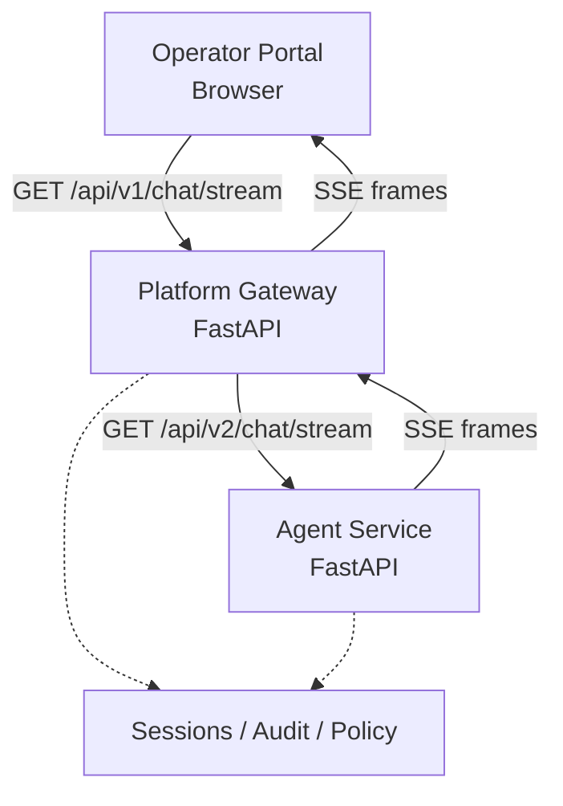
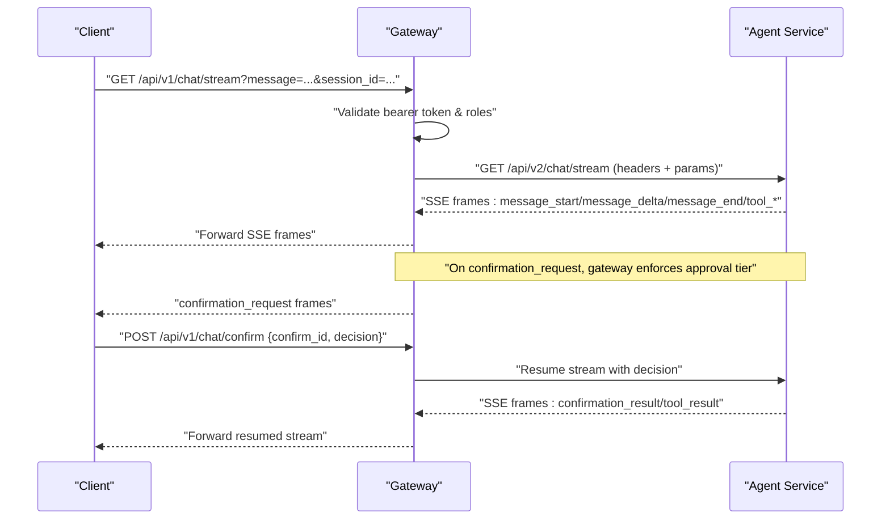
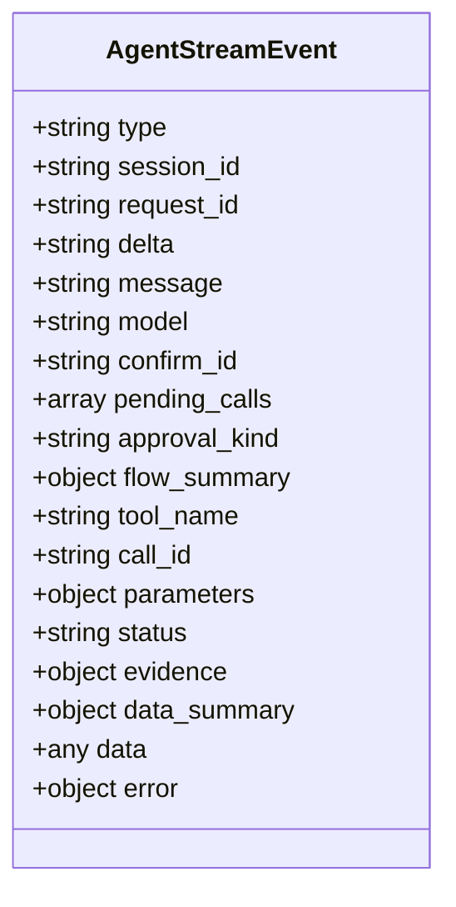
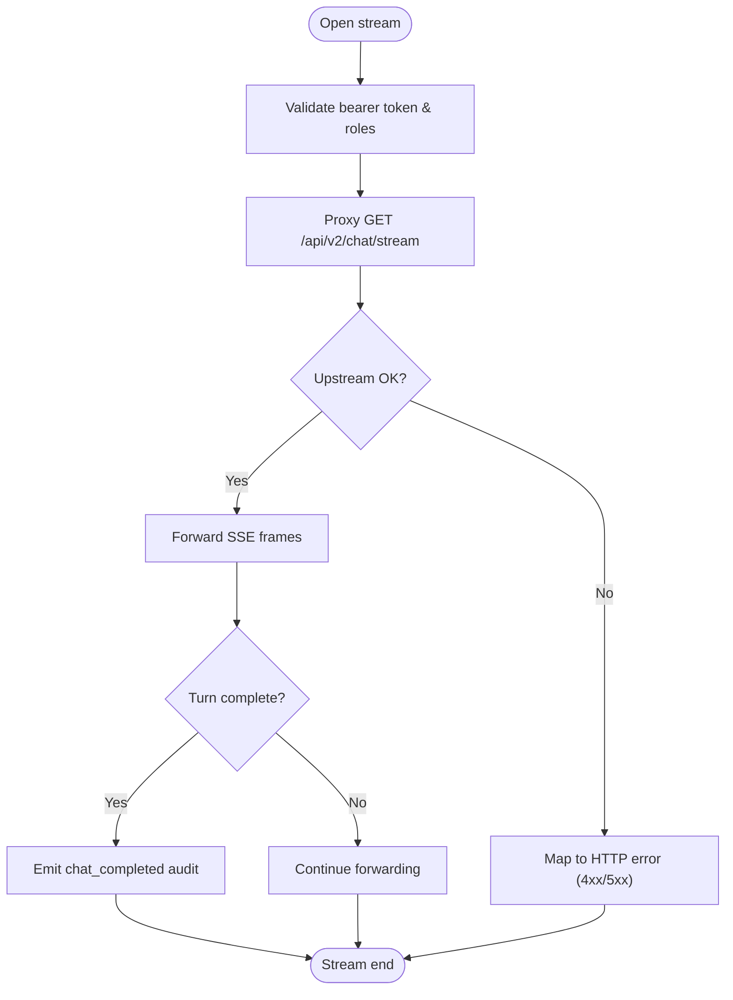
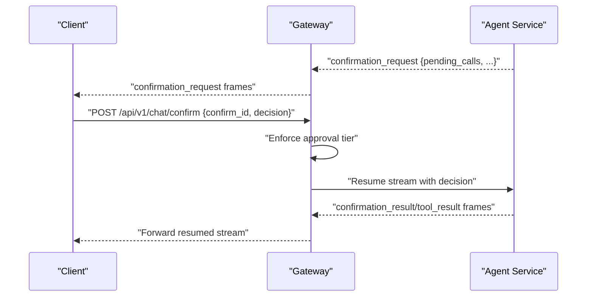
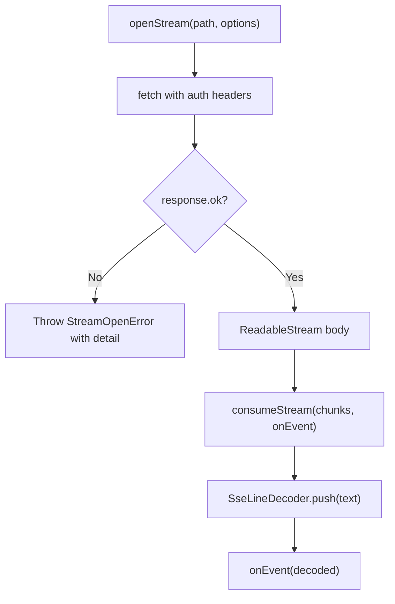
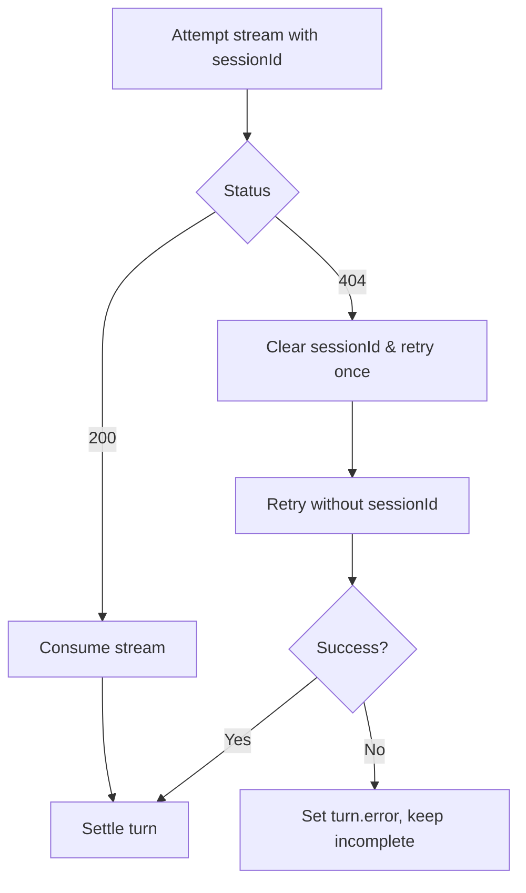
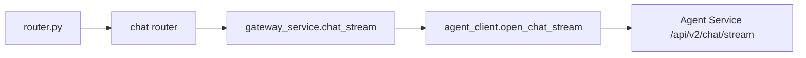

# Streaming APIs

<cite>
**Referenced Files in This Document**
- [agent-stream-event.schema.json](file://shared/shared-contracts/schemas/agent-stream-event.schema.json)
- [stream-event.schema.json](file://shared/shared-contracts/schemas/stream-event.schema.json)
- [routes.py](file://products/agent-platform/src/agent_service/api/v2/routes.py)
- [gateway_service.py](file://products/platform-gateway/src/platform_gateway/services/gateway_service.py)
- [agent_client.py](file://products/platform-gateway/src/platform_gateway/services/agent_client.py)
- [router.py](file://products/platform-gateway/src/platform_gateway/api/router.py)
- [auth.py](file://products/platform-gateway/src/platform_gateway/api/routes/auth.py)
- [transport.ts](file://products/operator-portal/web-ui/app/src/stream/transport.ts)
- [decoder.ts](file://products/operator-portal/web-ui/app/src/stream/decoder.ts)
- [useChatStream.ts](file://products/operator-portal/web-ui/app/src/stream/useChatStream.ts)
- [test_chat_model_relay.py](file://products/platform-gateway/tests/test_chat_model_relay.py)
- [test_gateway_auth.py](file://products/platform-gateway/tests/test_gateway_auth.py)
</cite>

## Table of Contents
1. [Introduction](#introduction)
2. [Project Structure](#project-structure)
3. [Core Components](#core-components)
4. [Architecture Overview](#architecture-overview)
5. [Detailed Component Analysis](#detailed-component-analysis)
6. [Dependency Analysis](#dependency-analysis)
7. [Performance Considerations](#performance-considerations)
8. [Troubleshooting Guide](#troubleshooting-guide)
9. [Conclusion](#conclusion)

## Introduction
This document describes the Server-Sent Events (SSE) streaming APIs used by the Luban AIOPS platform for real-time chat and live updates. It covers:
- Connection establishment over HTTP with SSE framing
- Event types, schema, and lifecycle semantics
- Error handling patterns and graceful degradation
- Client-side implementation guidance for incremental rendering, reconnection, and tool call processing
- Authentication and session-based access control for streaming endpoints
- Performance best practices including backpressure and stream resilience

## Project Structure
Streaming is implemented across three layers:
- Agent Platform (Agent Service): emits typed SSE frames for chat turns, tool calls, and confirmations
- Platform Gateway: proxies streams, enforces authentication/policy, enriches audit events, and preserves upstream error shapes
- Operator Portal (Web UI): opens SSE connections, decodes frames incrementally, renders UI updates, and manages reconnection

**Diagram sources**
- [router.py:20-33](file://products/platform-gateway/src/platform_gateway/api/router.py#L20-L33)
- [agent_client.py:173-222](file://products/platform-gateway/src/platform_gateway/services/agent_client.py#L173-L222)
- [gateway_service.py:950-1001](file://products/platform-gateway/src/platform_gateway/services/gateway_service.py#L950-L1001)
- [routes.py:443-464](file://products/agent-platform/src/agent_service/api/v2/routes.py#L443-L464)

**Section sources**
- [router.py:20-33](file://products/platform-gateway/src/platform_gateway/api/router.py#L20-L33)
- [agent_client.py:173-222](file://products/platform-gateway/src/platform_gateway/services/agent_client.py#L173-L222)
- [gateway_service.py:950-1001](file://products/platform-gateway/src/platform_gateway/services/gateway_service.py#L950-L1001)
- [routes.py:443-464](file://products/agent-platform/src/agent_service/api/v2/routes.py#L443-L464)

## Core Components
- Agent Service SSE frames: The agent service yields SSE lines with JSON payloads conforming to the agent stream event schema. Frames include message_start, message_delta, message_end, error, tool_call, tool_result, confirmation_request, and confirmation_result.
- Platform Gateway proxy: The gateway opens an HTTP GET to the agent service stream, forwards SSE lines, performs policy checks on confirmations, emits audit events, and maps upstream errors to appropriate HTTP statuses.
- Web UI transport: The portal uses fetch with a ReadableStream body, decodes SSE blocks incrementally, and dispatches decoded events to UI state. It handles 404/409/5xx and supports abort-driven cancellation.

Key responsibilities:
- Frame contract: defined by shared schemas
- Stream lifecycle: start, delta delivery, completion, and termination
- Security: bearer token validation and role-based approval enforcement
- Observability: per-turn completion and confirmation decisions are audited

**Section sources**
- [agent-stream-event.schema.json:1-160](file://shared/shared-contracts/schemas/agent-stream-event.schema.json#L1-L160)
- [gateway_service.py:950-1001](file://products/platform-gateway/src/platform_gateway/services/gateway_service.py#L950-L1001)
- [transport.ts:108-164](file://products/operator-portal/web-ui/app/src/stream/transport.ts#L108-L164)

## Architecture Overview
The chat stream follows a request-response-like handshake where the initial HTTP response is upgraded to an SSE stream. The gateway validates identity, optionally obtains a delegated token, and proxies the upstream stream while auditing and enforcing policies.

**Diagram sources**
- [agent_client.py:173-222](file://products/platform-gateway/src/platform_gateway/services/agent_client.py#L173-L222)
- [gateway_service.py:1004-1089](file://products/platform-gateway/src/platform_gateway/services/gateway_service.py#L1004-L1089)
- [routes.py:443-464](file://products/agent-platform/src/agent_service/api/v2/routes.py#L443-L464)

## Detailed Component Analysis

### SSE Frame Schema and Event Types
The agent stream event schema defines the frame contract for all SSE payloads. Required fields include type, session_id, and request_id. Optional fields vary by event type:
- message_start: begins a new assistant turn
- message_delta: carries incremental text chunks
- message_end: terminal metadata; may include model id that resolved for the turn
- error: failure details with code and message
- tool_call: invoked tool name, parameters, and call correlation id
- tool_result: outcome status, optional full data or summary, execution evidence
- confirmation_request: parked batch awaiting approval; includes pending_calls, risk_level/action hints, flow_summary, approval_kind
- confirmation_result: mirrors parked batch with final status

The legacy stream-event schema also exists for compatibility and enumerates message_start, message_delta, message_end, and error.

**Diagram sources**
- [agent-stream-event.schema.json:1-160](file://shared/shared-contracts/schemas/agent-stream-event.schema.json#L1-L160)

**Section sources**
- [agent-stream-event.schema.json:1-160](file://shared/shared-contracts/schemas/agent-stream-event.schema.json#L1-L160)
- [stream-event.schema.json:1-27](file://shared/shared-contracts/schemas/stream-event.schema.json#L1-L27)

### Chat Stream Establishment and Forwarding
- Client opens GET /api/v1/chat/stream with query parameters (message, optional session_id, input_modality, model).
- Gateway validates identity via bearer token and roles, then proxies to agent-service GET /api/v2/chat/stream.
- Upstream status is checked eagerly; non-OK responses are surfaced before any SSE frames are emitted.
- The gateway forwards each SSE line verbatim and emits audit events when a turn completes or a confirmation is decided.

**Diagram sources**
- [agent_client.py:173-222](file://products/platform-gateway/src/platform_gateway/services/agent_client.py#L173-L222)
- [gateway_service.py:950-1001](file://products/platform-gateway/src/platform_gateway/services/gateway_service.py#L950-L1001)

**Section sources**
- [agent_client.py:173-222](file://products/platform-gateway/src/platform_gateway/services/agent_client.py#L173-L222)
- [gateway_service.py:950-1001](file://products/platform-gateway/src/platform_gateway/services/gateway_service.py#L950-L1001)

### Confirmation Bridge and Approval Enforcement
When the agent service parks mutating actions, it emits confirmation_request frames. The gateway:
- Fetches parked state and evaluates the action against policy
- Enforces approval tiers (decider roles, self-approval rules)
- Proxies the decision via POST /api/v1/chat/confirm to resume the stream
- Emits confirmation_decided audit only when the matching confirmation_result flows through

**Diagram sources**
- [gateway_service.py:1004-1089](file://products/platform-gateway/src/platform_gateway/services/gateway_service.py#L1004-L1089)

**Section sources**
- [gateway_service.py:1004-1089](file://products/platform-gateway/src/platform_gateway/services/gateway_service.py#L1004-L1089)

### Web UI Transport and Decoder
The portal implements:
- openStream: fetch with headers (including auth), returns requestId and chunk source
- consumeStream: iterates chunks, decodes SSE blocks using SseLineDecoder, and invokes callbacks for each decoded event
- Robustness: parses structured error bodies on non-OK responses, discards partial trailing blocks, and supports abort signals for session switches

**Diagram sources**
- [transport.ts:108-164](file://products/operator-portal/web-ui/app/src/stream/transport.ts#L108-L164)
- [decoder.ts:204-250](file://products/operator-portal/web-ui/app/src/stream/decoder.ts#L204-L250)

**Section sources**
- [transport.ts:108-164](file://products/operator-portal/web-ui/app/src/stream/transport.ts#L108-L164)
- [decoder.ts:204-250](file://products/operator-portal/web-ui/app/src/stream/decoder.ts#L204-L250)

### Reconnection and Graceful Degradation
- On 404 during stream open, the client clears stale session pointers and retries once with server-side auto-creation
- Abort errors (e.g., session switch) settle partial replies without surfacing errors
- Non-404 failures propagate errors to the turn’s error field and mark incomplete

**Diagram sources**
- [useChatStream.ts:276-312](file://products/operator-portal/web-ui/app/src/stream/useChatStream.ts#L276-L312)

**Section sources**
- [useChatStream.ts:276-312](file://products/operator-portal/web-ui/app/src/stream/useChatStream.ts#L276-L312)

## Dependency Analysis
- Router composition mounts chat routes under the gateway API namespace
- Chat streaming depends on identity resolution, policy evaluation, and agent service connectivity
- Tests verify:
  - Unauthenticated requests return 401 for chat and stream endpoints
  - message_end model propagation reaches chat_completed audit exactly once

**Diagram sources**
- [router.py:20-33](file://products/platform-gateway/src/platform_gateway/api/router.py#L20-L33)
- [gateway_service.py:950-1001](file://products/platform-gateway/src/platform_gateway/services/gateway_service.py#L950-L1001)
- [agent_client.py:173-222](file://products/platform-gateway/src/platform_gateway/services/agent_client.py#L173-L222)

**Section sources**
- [router.py:20-33](file://products/platform-gateway/src/platform_gateway/api/router.py#L20-L33)
- [test_gateway_auth.py:105-127](file://products/platform-gateway/tests/test_gateway_auth.py#L105-L127)
- [test_chat_model_relay.py:193-218](file://products/platform-gateway/tests/test_chat_model_relay.py#L193-L218)

## Performance Considerations
- Backpressure: Use streaming reads and avoid buffering entire responses; the gateway forwards lines as they arrive and the decoder processes chunks incrementally
- Frame boundaries: SSE frames are delimited by “\n\n”; partial frames are held until complete, preventing UI corruption from split events
- Model attribution: message_end may carry the resolved model; if absent, the gateway attributes the turn with the requested model at stream end
- Stream timeouts: Connect timeout is set for upstream requests; read/write timeouts are disabled to support long-lived streams
- Error passthrough: Upstream 4xx errors are preserved with structured detail to enable precise client handling (e.g., already_resolved conflicts)

[No sources needed since this section provides general guidance]

## Troubleshooting Guide
Common issues and resolutions:
- 401 Unauthorized: Ensure bearer token is present and valid; unauthenticated requests to chat/stream return 401
- 404 Not Found: Indicates stale or deleted session; clear session pointer and retry once without sessionId
- 409 Conflict: Already resolved confirmation; parse structured detail to show winner’s outcome instead of retrying
- 502 Bad Gateway: Upstream agent service unavailable or returned 5xx; surface user-facing error and consider retry with backoff
- Empty stream: If no message_end arrives but deltas were seen, treat as completed and attribute with requested model

Operational checks:
- Verify gateway mounts chat routes correctly
- Confirm identity middleware resolves user and roles
- Validate that agent service responds with proper SSE frames and status codes

**Section sources**
- [test_gateway_auth.py:105-127](file://products/platform-gateway/tests/test_gateway_auth.py#L105-L127)
- [gateway_service.py:950-1001](file://products/platform-gateway/src/platform_gateway/services/gateway_service.py#L950-L1001)
- [gateway_service.py:1004-1089](file://products/platform-gateway/src/platform_gateway/services/gateway_service.py#L1004-L1089)
- [transport.ts:108-164](file://products/operator-portal/web-ui/app/src/stream/transport.ts#L108-L164)

## Conclusion
The Luban AIOPS streaming layer delivers low-latency, incremental chat updates and live tool execution feedback via SSE. The agent service emits a well-defined frame schema; the gateway enforces security and policy while preserving upstream semantics; and the web UI consumes streams efficiently with robust error handling and reconnection logic. Following the recommended practices ensures reliable, performant, and secure real-time interactions across the platform.