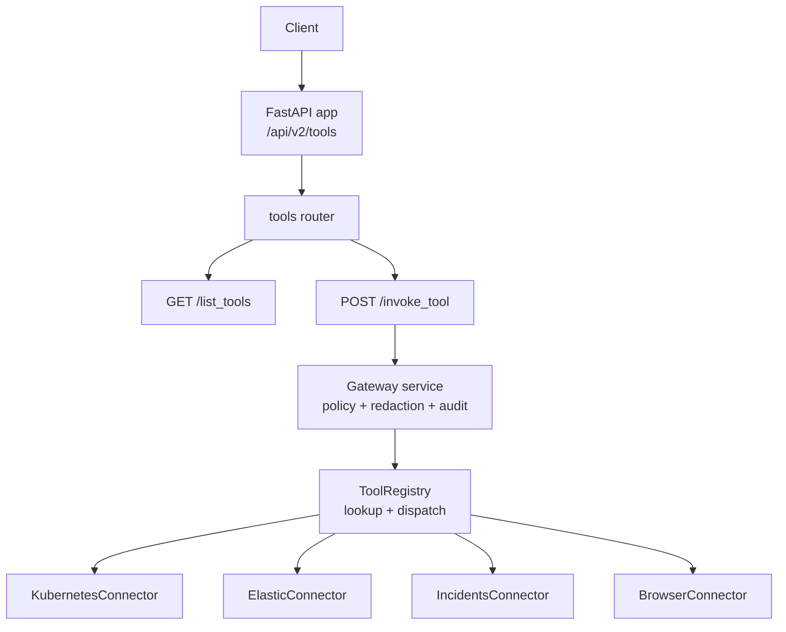
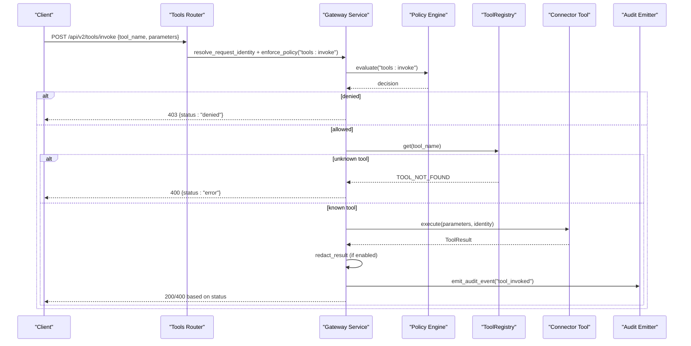
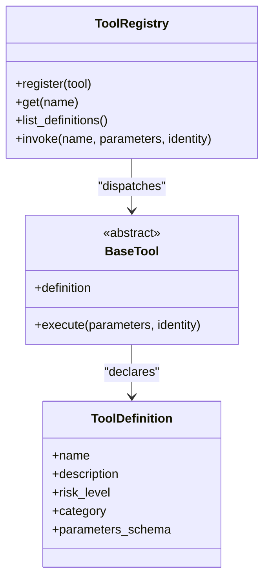
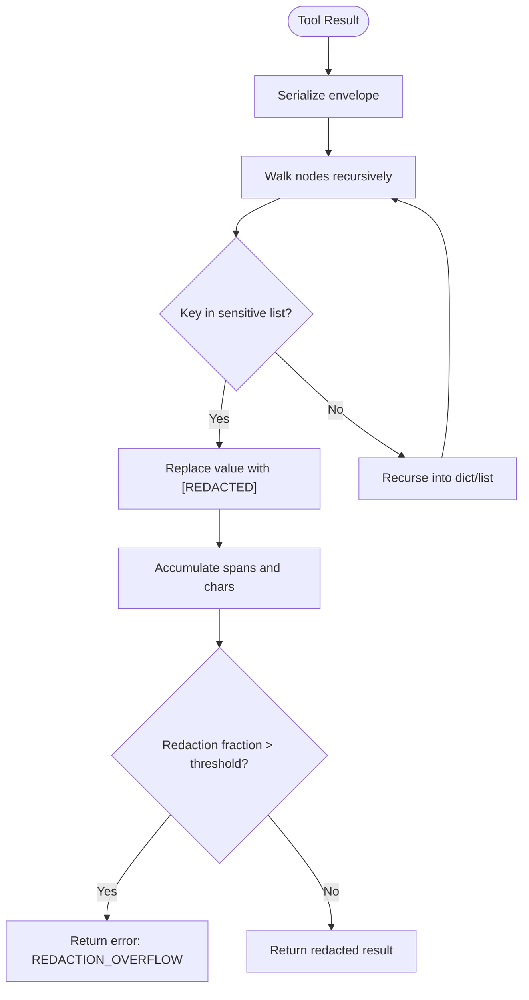
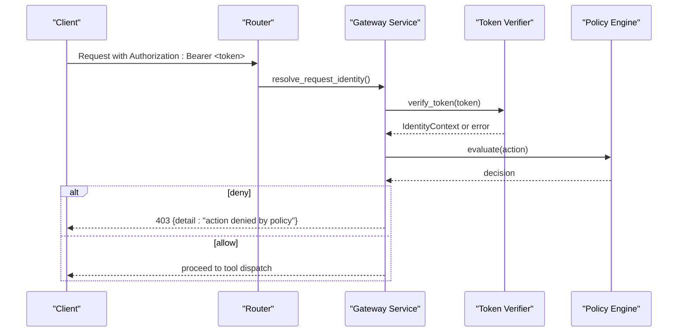
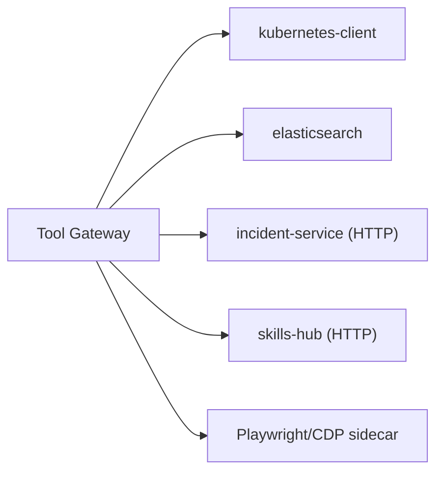

# Tool Gateway API

<cite>
**Referenced Files in This Document**
- [app.py](file://products/tool-gateway/src/tool_gateway/app.py)
- [main.py](file://products/tool-gateway/src/tool_gateway/main.py)
- [tools.py](file://products/tool-gateway/src/tool_gateway/api/routes/tools.py)
- [gateway_service.py](file://products/tool-gateway/src/tool_gateway/services/gateway_service.py)
- [registry.py](file://products/tool-gateway/src/tool_gateway/tools/registry.py)
- [base.py](file://products/tool-gateway/src/tool_gateway/tools/base.py)
- [browser_connector.py](file://products/tool-gateway/src/tool_gateway/tools/browser_connector.py)
- [k8s_connector.py](file://products/tool-gateway/src/tool_gateway/tools/k8s_connector.py)
- [elastic_connector.py](file://products/tool-gateway/src/tool_gateway/tools/elastic_connector.py)
- [incidents_connector.py](file://products/tool-gateway/src/tool_gateway/tools/incidents_connector.py)
- [credential_sets.py](file://products/tool-gateway/src/tool_gateway/tools/credential_sets.py)
- [redaction.py](file://products/tool-gateway/src/tool_gateway/tools/redaction.py)
- [tool-invocation.schema.json](file://shared/shared-contracts/schemas/tool-invocation.schema.json)
- [tool-result.schema.json](file://shared/shared-contracts/schemas/tool-result.schema.json)
</cite>

## Table of Contents
1. Introduction
2. Project Structure
3. Core Components
4. Architecture Overview
5. Detailed Component Analysis
6. Dependency Analysis
7. Performance Considerations
8. Troubleshooting Guide
9. Conclusion

## Introduction
The Tool Gateway is a unified HTTP API that discovers, authorizes, and executes tools against external systems. It exposes:
- A tool discovery endpoint to list registered tools and their schemas.
- A single invocation endpoint that enforces identity, policy, risk-tier gating, output redaction, and audit logging before dispatching to the appropriate connector.

Supported tool categories include:
- Browser automation (web.*) for bounded web-check flows with origin allowlisting, flow binding, credential sets, and screenshot masking.
- Kubernetes operations for read-only cluster inspection and one bounded mutating action.
- Elasticsearch queries for logs, service health metrics, and active alerts.
- Incident management tools for listing and retrieving incidents from the incident-service.

Authentication uses a verified bearer token; authorization is enforced by a policy engine. Output redaction prevents secrets from leaking into results or audit trails.

## Project Structure
The Tool Gateway is a FastAPI application that wires connectors at startup, registers tools into an in-process registry, and exposes two routes under /api/v2/tools.

**Diagram sources**
- [app.py:100-142](file://products/tool-gateway/src/tool_gateway/app.py#L100-L142)
- [tools.py:21-51](file://products/tool-gateway/src/tool_gateway/api/routes/tools.py#L21-L51)
- [gateway_service.py:158-376](file://products/tool-gateway/src/tool_gateway/services/gateway_service.py#L158-L376)
- [registry.py:18-89](file://products/tool-gateway/src/tool_gateway/tools/registry.py#L18-L89)

**Section sources**
- [app.py:19-97](file://products/tool-gateway/src/tool_gateway/app.py#L19-L97)
- [tools.py:21-51](file://products/tool-gateway/src/tool_gateway/api/routes/tools.py#L21-L51)

## Core Components
- Tool discovery and invocation routes:
  - GET /api/v2/tools returns metadata for all registered tools after enforcing tools:list.
  - POST /api/v2/tools/invoke executes a tool after identity resolution, policy checks, risk-tier gating, redaction, and audit emission.
- Tool registry:
  - Holds BaseTool instances, validates risk levels, refuses mutating tools when disabled, and dispatches invoke calls with structured error handling.
- Gateway service:
  - Resolves identity from bearer tokens, enforces policies, applies redaction, emits audit events, and maps result status to HTTP codes.
- Connector implementations:
  - Each connector defines a set of tools with parameters_schema and execute() logic, returning ToolResult envelopes.

**Section sources**
- [tools.py:24-51](file://products/tool-gateway/src/tool_gateway/api/routes/tools.py#L24-L51)
- [registry.py:18-89](file://products/tool-gateway/src/tool_gateway/tools/registry.py#L18-L89)
- [gateway_service.py:61-156](file://products/tool-gateway/src/tool_gateway/services/gateway_service.py#L61-L156)
- [gateway_service.py:158-376](file://products/tool-gateway/src/tool_gateway/services/gateway_service.py#L158-L376)

## Architecture Overview
End-to-end request flow for tool invocation:

**Diagram sources**
- [tools.py:38-51](file://products/tool-gateway/src/tool_gateway/api/routes/tools.py#L38-L51)
- [gateway_service.py:61-156](file://products/tool-gateway/src/tool_gateway/services/gateway_service.py#L61-L156)
- [gateway_service.py:158-376](file://products/tool-gateway/src/tool_gateway/services/gateway_service.py#L158-L376)
- [registry.py:65-89](file://products/tool-gateway/src/tool_gateway/tools/registry.py#L65-L89)

## Detailed Component Analysis

### Tool Invocation Endpoint
- Path: POST /api/v2/tools/invoke
- Request body fields:
  - tool_name: string, required
  - parameters: object, optional but tool-specific
  - session_id: string, optional, trusted internal correlation handle
  - approval_kind: string, optional, trusted internal provenance handle ("flow" or "action")
- Identity and policy:
  - Identity is derived from the Authorization header (Bearer token). If missing and auth is required, 401 is returned. Otherwise, a synthetic dev identity may be used.
  - Policy enforcement evaluates "tools:invoke". Mutating tools additionally require "tools:mutate".
- Response envelope:
  - Always returns a ToolResult structure with tool_name, status, evidence, and optional data/error.
  - HTTP status: 200 for success, 400 for errors, 403 for denied.

Request schema reference: [tool-invocation.schema.json:1-35](file://shared/shared-contracts/schemas/tool-invocation.schema.json#L1-L35)
Response schema reference: [tool-result.schema.json:1-69](file://shared/shared-contracts/schemas/tool-result.schema.json#L1-L69)

**Section sources**
- [tools.py:38-51](file://products/tool-gateway/src/tool_gateway/api/routes/tools.py#L38-L51)
- [gateway_service.py:61-156](file://products/tool-gateway/src/tool_gateway/services/gateway_service.py#L61-L156)
- [gateway_service.py:158-376](file://products/tool-gateway/src/tool_gateway/services/gateway_service.py#L158-L376)
- [tool-invocation.schema.json:1-35](file://shared/shared-contracts/schemas/tool-invocation.schema.json#L1-L35)
- [tool-result.schema.json:1-69](file://shared/shared-contracts/schemas/tool-result.schema.json#L1-L69)

### Tool Discovery Endpoint
- Path: GET /api/v2/tools
- Behavior: Returns a list of tool definitions including name, description, risk_level, category, and parameters_schema. Requires tools:list permission.

**Section sources**
- [tools.py:24-36](file://products/tool-gateway/src/tool_gateway/api/routes/tools.py#L24-L36)

### Browser Automation Tools
- Category: browser
- Risk tiers:
  - Read: web.navigate, web.snapshot, web.screenshot, web.fill_credential, web.extract, web.wait_for, web.hover, web.scroll, web.switch_frame
  - Write: web.click, web.type, web.select, web.press_key, web.upload_file, web.evaluate
- Key behaviors:
  - Origin allowlist enforced server-side; navigation and captures re-check live origin.
  - Flow binding via skill_id validates web_target and risk_class; deviation guard prevents off-origin or unauthorized writes.
  - Credential sets are resolved from a secret-mounted file at call time; values never appear in results or logs.
  - Screenshots mask password-like values injected into inputs.
  - Per-chat-session serialization ensures safe execution on a shared page.

Example tool definitions and parameter schemas are declared within the connector’s tool classes.

**Section sources**
- [browser_connector.py:1-149](file://products/tool-gateway/src/tool_gateway/tools/browser_connector.py#L1-L149)
- [browser_connector.py:315-399](file://products/tool-gateway/src/tool_gateway/tools/browser_connector.py#L315-L399)
- [browser_connector.py:402-699](file://products/tool-gateway/src/tool_gateway/tools/browser_connector.py#L402-L699)
- [browser_connector.py:730-800](file://products/tool-gateway/src/tool_gateway/tools/browser_connector.py#L730-L800)
- [credential_sets.py:1-103](file://products/tool-gateway/src/tool_gateway/tools/credential_sets.py#L1-L103)

### Kubernetes Tools
- Category: kubernetes
- Tools:
  - k8s.list_pods: list pods with optional label selector
  - k8s.get_pod: get pod details
  - k8s.get_events: list events with optional field selector
  - k8s.get_pod_logs: tail logs with bounded tail_lines
  - k8s.delete_pod: bounded mutating action (write), requires operator confirmation upstream
- Configuration:
  - Uses in-cluster config or kubeconfig; returns structured K8S_NOT_CONFIGURED if unavailable.
- Parameter validation:
  - tail_lines clamped to [1, MAX_TAIL_LINES]; invalid input yields INVALID_PARAMETERS.

**Section sources**
- [k8s_connector.py:1-16](file://products/tool-gateway/src/tool_gateway/tools/k8s_connector.py#L1-L16)
- [k8s_connector.py:41-92](file://products/tool-gateway/src/tool_gateway/tools/k8s_connector.py#L41-L92)
- [k8s_connector.py:231-276](file://products/tool-gateway/src/tool_gateway/tools/k8s_connector.py#L231-L276)
- [k8s_connector.py:278-327](file://products/tool-gateway/src/tool_gateway/tools/k8s_connector.py#L278-L327)
- [k8s_connector.py:329-374](file://products/tool-gateway/src/tool_gateway/tools/k8s_connector.py#L329-L374)
- [k8s_connector.py:376-437](file://products/tool-gateway/src/tool_gateway/tools/k8s_connector.py#L376-L437)
- [k8s_connector.py:439-518](file://products/tool-gateway/src/tool_gateway/tools/k8s_connector.py#L439-L518)

### Elasticsearch Tools
- Category: observability
- Tools:
  - elastic.search_logs: search logs with query, index, time_range_minutes, max_results
  - elastic.get_service_health: aggregated metrics for a service
  - elastic.get_active_alerts: list active alerts filtered by severity
- Configuration:
  - Supports API key or basic auth; TLS verification configurable; returns ELASTIC_NOT_CONFIGURED when not configured.
- Parameter validation:
  - time_range_minutes clamped to [1, MAX_TIME_RANGE_MINUTES]
  - max_results clamped to [1, MAX_RESULTS]
  - severity enum validated for alerts tool

**Section sources**
- [elastic_connector.py:1-12](file://products/tool-gateway/src/tool_gateway/tools/elastic_connector.py#L1-L12)
- [elastic_connector.py:40-103](file://products/tool-gateway/src/tool_gateway/tools/elastic_connector.py#L40-L103)
- [elastic_connector.py:287-380](file://products/tool-gateway/src/tool_gateway/tools/elastic_connector.py#L287-L380)
- [elastic_connector.py:382-457](file://products/tool-gateway/src/tool_gateway/tools/elastic_connector.py#L382-L457)
- [elastic_connector.py:459-535](file://products/tool-gateway/src/tool_gateway/tools/elastic_connector.py#L459-L535)

### Incident Management Tools
- Category: incidents
- Tools:
  - incidents.list: list incidents with filters (status, severity, source) and pagination
  - incidents.get: retrieve full incident record by id
- Authentication:
  - Calls incident-service using gateway-held Basic credentials; user token is not forwarded.
- Validation:
  - Enum parameters validated; limit clamped; offset must be non-negative; incident_id pattern-checked.

**Section sources**
- [incidents_connector.py:1-13](file://products/tool-gateway/src/tool_gateway/tools/incidents_connector.py#L1-L13)
- [incidents_connector.py:68-94](file://products/tool-gateway/src/tool_gateway/tools/incidents_connector.py#L68-L94)
- [incidents_connector.py:154-273](file://products/tool-gateway/src/tool_gateway/tools/incidents_connector.py#L154-L273)
- [incidents_connector.py:275-339](file://products/tool-gateway/src/tool_gateway/tools/incidents_connector.py#L275-L339)

### Tool Registration and Dynamic Discovery
- Registration:
  - Connectors register tools via ToolRegistry.register during app startup.
  - Risk-tier admission blocks mutating tools unless GATEWAY_MUTATING_TOOLS_ENABLED is true.
- Discovery:
  - GET /api/v2/tools returns ToolDefinition objects including parameters_schema per tool.

**Diagram sources**
- [registry.py:18-89](file://products/tool-gateway/src/tool_gateway/tools/registry.py#L18-L89)
- [base.py:15-33](file://products/tool-gateway/src/tool_gateway/tools/base.py#L15-L33)
- [base.py:108-123](file://products/tool-gateway/src/tool_gateway/tools/base.py#L108-L123)

**Section sources**
- [app.py:19-97](file://products/tool-gateway/src/tool_gateway/app.py#L19-L97)
- [registry.py:18-89](file://products/tool-gateway/src/tool_gateway/tools/registry.py#L18-L89)
- [tools.py:24-36](file://products/tool-gateway/src/tool_gateway/api/routes/tools.py#L24-L36)

### Credential Set Management
- Purpose: Provide named login credentials for browser flows without exposing them in results or logs.
- Storage: JSON file mounted as a secret; hot-reloaded on mtime change.
- Access: Connector resolves a named set by name; unknown names return None; values only flow into browser fill actions.

**Section sources**
- [credential_sets.py:1-103](file://products/tool-gateway/src/tool_gateway/tools/credential_sets.py#L1-L103)

### Output Redaction
- Mechanism: Deterministic redaction applied to every tool result before response and audit emission.
- Patterns:
  - Value patterns: PEM private keys, JWTs, Bearer/Basic headers, AWS access key IDs.
  - Explicit key list: sensitive field names like password, secret, token, api_key.
- Overflow protection: If too much of the payload would be redacted, the result is withheld and an error is returned.

**Diagram sources**
- [redaction.py:1-151](file://products/tool-gateway/src/tool_gateway/tools/redaction.py#L1-L151)
- [gateway_service.py:307-335](file://products/tool-gateway/src/tool_gateway/services/gateway_service.py#L307-L335)

**Section sources**
- [redaction.py:1-151](file://products/tool-gateway/src/tool_gateway/tools/redaction.py#L1-L151)
- [gateway_service.py:307-335](file://products/tool-gateway/src/tool_gateway/services/gateway_service.py#L307-L335)

### Authentication and Authorization
- Authentication:
  - Bearer token parsed from Authorization header; verified locally; expired or malformed tokens yield 401.
  - When auth is optional and no token is present, a synthetic dev identity is used.
- Authorization:
  - Policy engine evaluates actions:
    - tools:list for discovery
    - tools:invoke for execution
    - tools:mutate for write/admin tools
  - Denials return 403 with reason and matched rule ids.

**Diagram sources**
- [gateway_service.py:61-156](file://products/tool-gateway/src/tool_gateway/services/gateway_service.py#L61-L156)

**Section sources**
- [gateway_service.py:61-156](file://products/tool-gateway/src/tool_gateway/services/gateway_service.py#L61-L156)

### Error Handling, Timeouts, and Audit Logging
- Errors:
  - Unknown tools: TOOL_NOT_FOUND
  - Tool execution failures: TOOL_EXECUTION_ERROR
  - Connector-specific errors: e.g., K8S_NOT_CONFIGURED, ELASTIC_NOT_CONFIGURED, INCIDENT_NOT_FOUND
  - Policy denials: POLICY_DENIED
  - Browser-specific: BROWSER_ORIGIN_NOT_ALLOWED, BROWSER_FLOW_TARGET_MISMATCH, BROWSER_REF_UNKNOWN, etc.
- Timeouts:
  - Browser navigation timeout and request timeouts are defined in the connector.
  - Incident and skills connectors use httpx timeouts.
- Audit logging:
  - Every tool invocation emits an audit event with subject, roles, tool_name, status, duration_ms, risk_level, and redacted_spans.

**Section sources**
- [registry.py:65-89](file://products/tool-gateway/src/tool_gateway/tools/registry.py#L65-L89)
- [k8s_connector.py:439-518](file://products/tool-gateway/src/tool_gateway/tools/k8s_connector.py#L439-L518)
- [elastic_connector.py:287-535](file://products/tool-gateway/src/tool_gateway/tools/elastic_connector.py#L287-L535)
- [incidents_connector.py:154-339](file://products/tool-gateway/src/tool_gateway/tools/incidents_connector.py#L154-L339)
- [gateway_service.py:336-376](file://products/tool-gateway/src/tool_gateway/services/gateway_service.py#L336-L376)

## Dependency Analysis
Connectors depend on external libraries and services:
- Kubernetes: kubernetes-client/python
- Elasticsearch: elasticsearch Python client
- Incidents: HTTP client to incident-service
- Browser: Playwright sidecar over CDP and skills-hub for flow validation

**Diagram sources**
- [k8s_connector.py:49-76](file://products/tool-gateway/src/tool_gateway/tools/k8s_connector.py#L49-L76)
- [elastic_connector.py:61-97](file://products/tool-gateway/src/tool_gateway/tools/elastic_connector.py#L61-L97)
- [incidents_connector.py:86-94](file://products/tool-gateway/src/tool_gateway/tools/incidents_connector.py#L86-L94)
- [browser_connector.py:445-481](file://products/tool-gateway/src/tool_gateway/tools/browser_connector.py#L445-L481)

**Section sources**
- [k8s_connector.py:49-76](file://products/tool-gateway/src/tool_gateway/tools/k8s_connector.py#L49-L76)
- [elastic_connector.py:61-97](file://products/tool-gateway/src/tool_gateway/tools/elastic_connector.py#L61-L97)
- [incidents_connector.py:86-94](file://products/tool-gateway/src/tool_gateway/tools/incidents_connector.py#L86-L94)
- [browser_connector.py:445-481](file://products/tool-gateway/src/tool_gateway/tools/browser_connector.py#L445-L481)

## Performance Considerations
- Asynchronous I/O:
  - Connectors run blocking client calls in executors to avoid blocking the event loop.
- Bounded parameters:
  - tail_lines, time_range_minutes, max_results, and screenshot sizes are clamped to prevent excessive resource usage.
- Session pooling:
  - Browser sessions are pooled with TTL and max session limits; interactions are serialized per chat session to avoid race conditions.
- Redaction overhead:
  - Redaction runs once per result; overflow detection prevents large secret-heavy payloads from being processed further.

[No sources needed since this section provides general guidance]

## Troubleshooting Guide
Common issues and resolutions:
- 401 Unauthorized:
  - Missing or malformed Authorization header; ensure a valid bearer token is provided.
- 403 Forbidden:
  - Policy denied tools:list, tools:invoke, or tools:mutate; check roles and policy rules.
- TOOL_NOT_FOUND:
  - The requested tool_name is not registered; confirm the connector is enabled and the tool exists.
- K8S_NOT_CONFIGURED / ELASTIC_NOT_CONFIGURED:
  - Ensure connector configuration (in-cluster config, kubeconfig, URL, credentials) is correct.
- BROWSER_ORIGIN_NOT_ALLOWED / BROWSER_FLOW_TARGET_MISMATCH:
  - Navigate to an allowlisted origin or bind a valid skill_id whose web_target matches the URL.
- REDACTION_OVERFLOW:
  - Too much of the result appears to contain credentials; tighten parameters or reduce sensitive data exposure.

**Section sources**
- [gateway_service.py:61-156](file://products/tool-gateway/src/tool_gateway/services/gateway_service.py#L61-L156)
- [gateway_service.py:158-376](file://products/tool-gateway/src/tool_gateway/services/gateway_service.py#L158-L376)
- [registry.py:65-89](file://products/tool-gateway/src/tool_gateway/tools/registry.py#L65-L89)
- [k8s_connector.py:439-518](file://products/tool-gateway/src/tool_gateway/tools/k8s_connector.py#L439-L518)
- [elastic_connector.py:287-535](file://products/tool-gateway/src/tool_gateway/tools/elastic_connector.py#L287-L535)
- [browser_connector.py:402-699](file://products/tool-gateway/src/tool_gateway/tools/browser_connector.py#L402-L699)
- [redaction.py:126-151](file://products/tool-gateway/src/tool_gateway/tools/redaction.py#L126-L151)

## Conclusion
The Tool Gateway centralizes tool execution behind a consistent API with strong security and operational guarantees:
- Unified discovery and invocation endpoints with standardized request/response schemas.
- Robust authentication via bearer tokens and authorization via policy evaluation.
- Risk-tier gating and connector-specific safeguards (origin allowlists, flow binding, bounded mutations).
- Deterministic output redaction and durable audit logging.
- Extensible connector architecture enabling new tool categories while preserving platform invariants.

[No sources needed since this section summarizes without analyzing specific files]