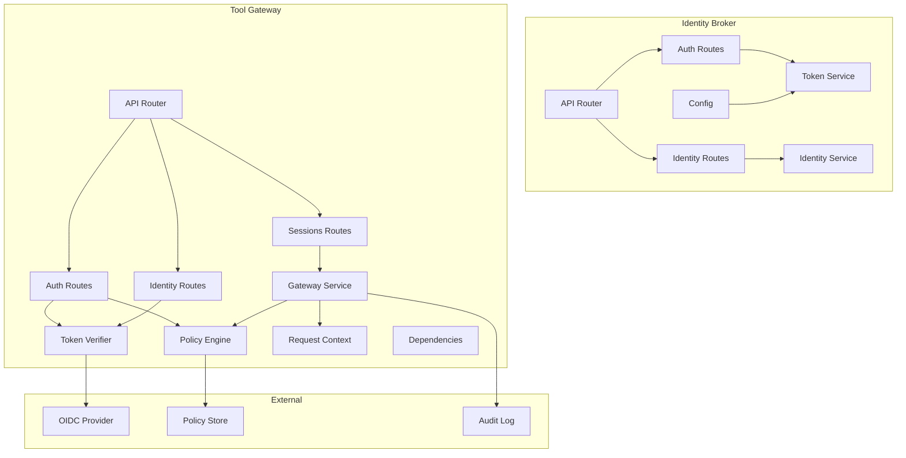
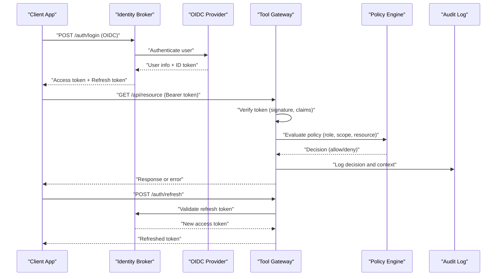
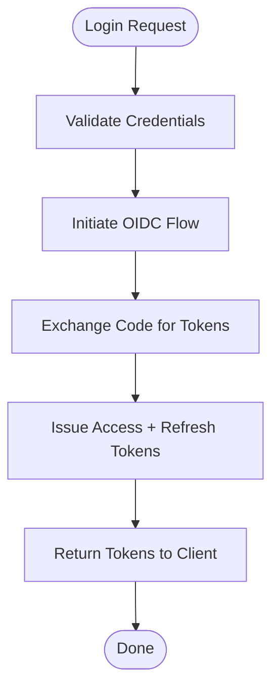
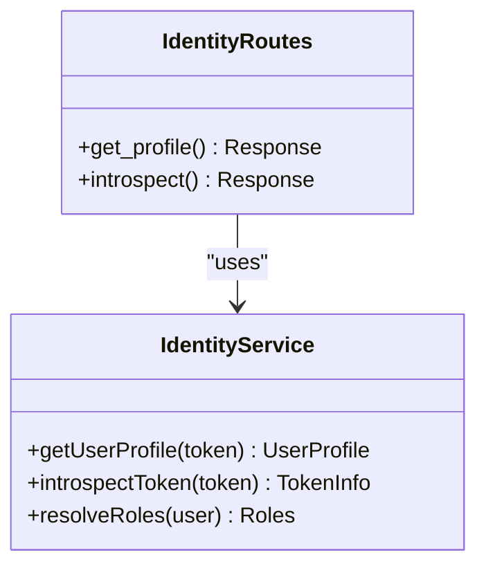
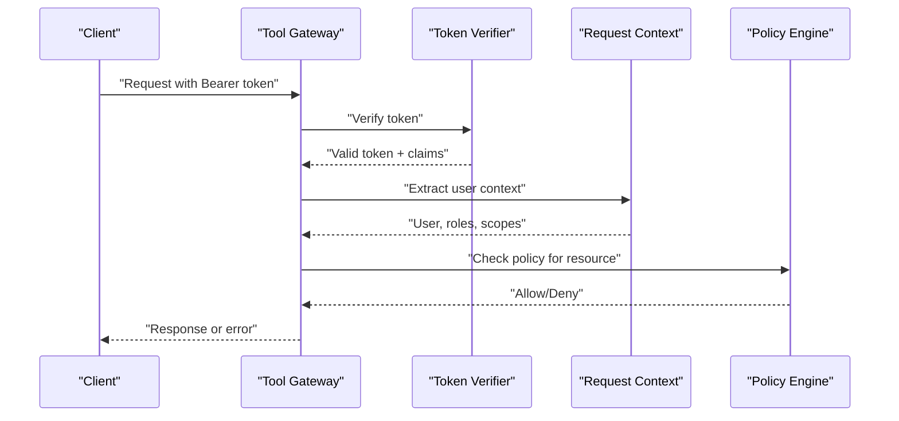
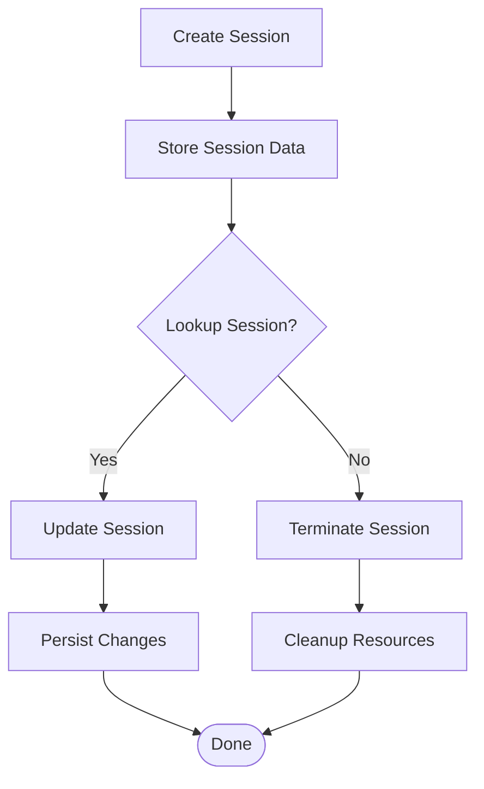
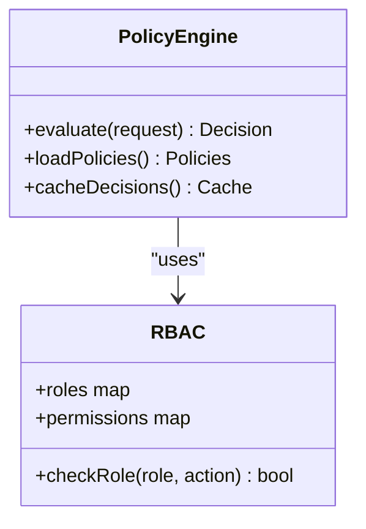
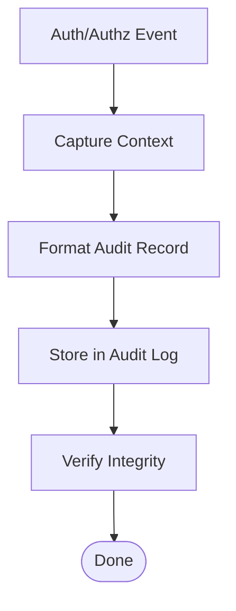
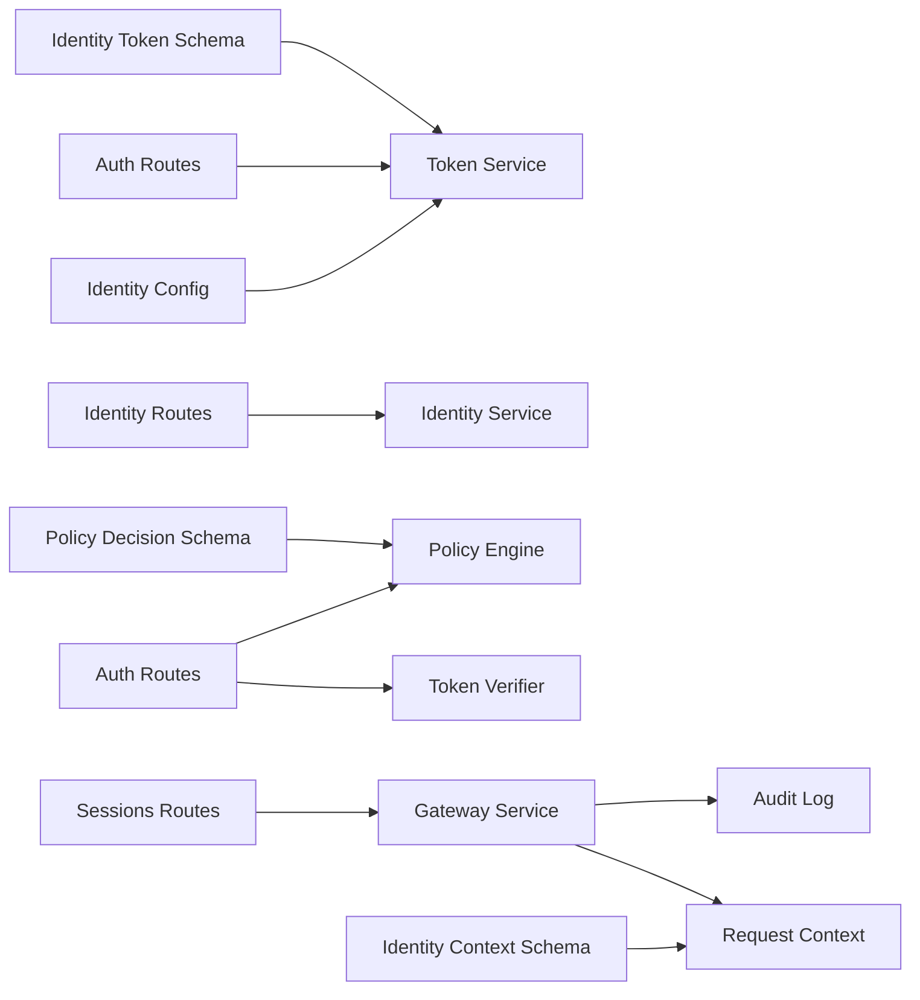

# Authentication & Authorization API

<cite>
**Referenced Files in This Document**
- [auth.py](file://products/identity-broker/src/identity_service/api/routes/auth.py)
- [identity.py](file://products/identity-broker/src/identity_service/api/routes/identity.py)
- [router.py](file://products/identity-broker/src/identity_service/api/router.py)
- [config.py](file://products/identity-broker/src/identity_service/core/config.py)
- [token_service.py](file://products/identity-broker/src/identity_service/services/token_service.py)
- [identity_service.py](file://products/identity-broker/src/identity_service/services/identity_service.py)
- [auth.py](file://products/tool-gateway/src/api_gateway/api/routes/auth.py)
- [identity.py](file://products/tool-gateway/src/api_gateway/api/routes/identity.py)
- [sessions.py](file://products/tool-gateway/src/api_gateway/api/routes/sessions.py)
- [policy_engine.py](file://products/tool-gateway/src/api_gateway/services/policy_engine.py)
- [token_verifier.py](file://products/tool-gateway/src/api_gateway/services/token_verifier.py)
- [gateway_service.py](file://products/tool-gateway/src/api_gateway/services/gateway_service.py)
- [request_context.py](file://products/tool-gateway/src/api_gateway/core/request_context.py)
- [dependencies.py](file://products/tool-gateway/src/api_gateway/core/dependencies.py)
- [rbac.yaml](file://shared/platform-ops/gitops/dev-k8s/base/tool-gateway/rbac.yaml)
- [policy-default.yaml](file://products/tool-gateway/src/api_gateway/policies/policy-default.yaml)
- [identity-token.schema.json](file://shared/shared-contracts/schemas/identity-token.schema.json)
- [identity-context.schema.json](file://shared/shared-contracts/schemas/identity-context.schema.json)
- [policy-decision.schema.json](file://shared/shared-contracts/schemas/policy-decision.schema.json)
- [session.schema.json](file://shared/shared-contracts/schemas/session.schema.json)
</cite>

## Table of Contents
1. [Introduction](#introduction)
2. [Project Structure](#project-structure)
3. [Core Components](#core-components)
4. [Architecture Overview](#architecture-overview)
5. [Detailed Component Analysis](#detailed-component-analysis)
6. [Dependency Analysis](#dependency-analysis)
7. [Performance Considerations](#performance-considerations)
8. [Troubleshooting Guide](#troubleshooting-guide)
9. [Conclusion](#conclusion)
10. [Appendices](#appendices)

## Introduction
This document provides comprehensive API documentation for authentication and authorization endpoints across the Identity Broker and Tool Gateway services. It covers token validation, user context extraction, permission checking mechanisms, JWT handling, OIDC integration, session management, role-based access control (RBAC), resource-level permissions, and audit trail generation. It also includes examples of secure API consumption, token refresh flows, and error handling strategies, along with security best practices and compliance considerations.

## Project Structure
The authentication and authorization features are implemented primarily in two services:
- Identity Broker: issues tokens, validates OIDC flows, and exposes identity endpoints.
- Tool Gateway: verifies tokens, enforces policies, manages sessions, and extracts request context for downstream services.

**Diagram sources**
- [router.py](file://products/identity-broker/src/identity_service/api/router.py)
- [auth.py](file://products/identity-broker/src/identity_service/api/routes/auth.py)
- [identity.py](file://products/identity-broker/src/identity_service/api/routes/identity.py)
- [token_service.py](file://products/identity-broker/src/identity_service/services/token_service.py)
- [identity_service.py](file://products/identity-broker/src/identity_service/services/identity_service.py)
- [config.py](file://products/identity-broker/src/identity_service/core/config.py)
- [auth.py](file://products/tool-gateway/src/api_gateway/api/routes/auth.py)
- [identity.py](file://products/tool-gateway/src/api_gateway/api/routes/identity.py)
- [sessions.py](file://products/tool-gateway/src/api_gateway/api/routes/sessions.py)
- [policy_engine.py](file://products/tool-gateway/src/api_gateway/services/policy_engine.py)
- [token_verifier.py](file://products/tool-gateway/src/api_gateway/services/token_verifier.py)
- [gateway_service.py](file://products/tool-gateway/src/api_gateway/services/gateway_service.py)
- [request_context.py](file://products/tool-gateway/src/api_gateway/core/request_context.py)
- [dependencies.py](file://products/tool-gateway/src/api_gateway/core/dependencies.py)

**Section sources**
- [router.py](file://products/identity-broker/src/identity_service/api/router.py)
- [auth.py](file://products/identity-broker/src/identity_service/api/routes/auth.py)
- [identity.py](file://products/identity-broker/src/identity_service/api/routes/identity.py)
- [token_service.py](file://products/identity-broker/src/identity_service/services/token_service.py)
- [identity_service.py](file://products/identity-broker/src/identity_service/services/identity_service.py)
- [config.py](file://products/identity-broker/src/identity_service/core/config.py)
- [auth.py](file://products/tool-gateway/src/api_gateway/api/routes/auth.py)
- [identity.py](file://products/tool-gateway/src/api_gateway/api/routes/identity.py)
- [sessions.py](file://products/tool-gateway/src/api_gateway/api/routes/sessions.py)
- [policy_engine.py](file://products/tool-gateway/src/api_gateway/services/policy_engine.py)
- [token_verifier.py](file://products/tool-gateway/src/api_gateway/services/token_verifier.py)
- [gateway_service.py](file://products/tool-gateway/src/api_gateway/services/gateway_service.py)
- [request_context.py](file://products/tool-gateway/src/api_gateway/core/request_context.py)
- [dependencies.py](file://products/tool-gateway/src/api_gateway/core/dependencies.py)

## Core Components
- Identity Broker Auth Routes: handle OIDC login, token issuance, and refresh.
- Identity Broker Identity Routes: expose identity metadata and introspection endpoints.
- Token Service: generates and validates JWTs, handles claims and expiration.
- Identity Service: integrates with external OIDC providers and resolves user attributes.
- Tool Gateway Auth Routes: validate incoming tokens, enforce RBAC, and manage sessions.
- Policy Engine: evaluates policy rules to authorize requests at resource level.
- Token Verifier: performs signature verification, JWKS fetching, and claim validation.
- Gateway Service: orchestrates request processing, context enrichment, and audit logging.
- Request Context: extracts authenticated user, roles, scopes, and tenant from tokens.
- Dependencies: wires services and configuration into route handlers.

**Section sources**
- [auth.py](file://products/identity-broker/src/identity_service/api/routes/auth.py)
- [identity.py](file://products/identity-broker/src/identity_service/api/routes/identity.py)
- [token_service.py](file://products/identity-broker/src/identity_service/services/token_service.py)
- [identity_service.py](file://products/identity-broker/src/identity_service/services/identity_service.py)
- [auth.py](file://products/tool-gateway/src/api_gateway/api/routes/auth.py)
- [policy_engine.py](file://products/tool-gateway/src/api_gateway/services/policy_engine.py)
- [token_verifier.py](file://products/tool-gateway/src/api_gateway/services/token_verifier.py)
- [gateway_service.py](file://products/tool-gateway/src/api_gateway/services/gateway_service.py)
- [request_context.py](file://products/tool-gateway/src/api_gateway/core/request_context.py)
- [dependencies.py](file://products/tool-gateway/src/api_gateway/core/dependencies.py)

## Architecture Overview
The system follows a clear separation of concerns:
- Identity Broker is responsible for issuing tokens and exposing identity information.
- Tool Gateway acts as an API gateway that validates tokens, enforces policies, and manages sessions.
- External OIDC providers supply user identities and support token refresh flows.
- Policy engine centralizes authorization decisions based on RBAC and resource-level rules.
- Audit trails capture critical events for compliance and observability.

**Diagram sources**
- [auth.py](file://products/identity-broker/src/identity_service/api/routes/auth.py)
- [identity.py](file://products/identity-broker/src/identity_service/api/routes/identity.py)
- [token_service.py](file://products/identity-broker/src/identity_service/services/token_service.py)
- [auth.py](file://products/tool-gateway/src/api_gateway/api/routes/auth.py)
- [policy_engine.py](file://products/tool-gateway/src/api_gateway/services/policy_engine.py)
- [token_verifier.py](file://products/tool-gateway/src/api_gateway/services/token_verifier.py)
- [gateway_service.py](file://products/tool-gateway/src/api_gateway/services/gateway_service.py)
- [request_context.py](file://products/tool-gateway/src/api_gateway/core/request_context.py)

## Detailed Component Analysis

### Identity Broker: Authentication Endpoints
- Login endpoint initiates OIDC flow, exchanges credentials for tokens, and returns access and refresh tokens.
- Token refresh endpoint validates refresh tokens and issues new access tokens without re-authentication.
- Error responses include standard HTTP codes and structured error payloads for client handling.

**Diagram sources**
- [auth.py](file://products/identity-broker/src/identity_service/api/routes/auth.py)
- [token_service.py](file://products/identity-broker/src/identity_service/services/token_service.py)

**Section sources**
- [auth.py](file://products/identity-broker/src/identity_service/api/routes/auth.py)
- [token_service.py](file://products/identity-broker/src/identity_service/services/token_service.py)

### Identity Broker: Identity Endpoints
- Expose user profile, roles, and scopes derived from OIDC provider.
- Introspection endpoint allows downstream services to validate tokens and retrieve claims.

**Diagram sources**
- [identity.py](file://products/identity-broker/src/identity_service/api/routes/identity.py)
- [identity_service.py](file://products/identity-broker/src/identity_service/services/identity_service.py)

**Section sources**
- [identity.py](file://products/identity-broker/src/identity_service/api/routes/identity.py)
- [identity_service.py](file://products/identity-broker/src/identity_service/services/identity_service.py)

### Tool Gateway: Token Verification and Context Extraction
- Validates JWT signatures using JWKS, checks expiration, and verifies required claims.
- Extracts user context including roles, scopes, and tenant from validated tokens.
- Enforces RBAC by evaluating policy rules against requested resources.

**Diagram sources**
- [auth.py](file://products/tool-gateway/src/api_gateway/api/routes/auth.py)
- [token_verifier.py](file://products/tool-gateway/src/api_gateway/services/token_verifier.py)
- [request_context.py](file://products/tool-gateway/src/api_gateway/core/request_context.py)
- [policy_engine.py](file://products/tool-gateway/src/api_gateway/services/policy_engine.py)

**Section sources**
- [auth.py](file://products/tool-gateway/src/api_gateway/api/routes/auth.py)
- [token_verifier.py](file://products/tool-gateway/src/api_gateway/services/token_verifier.py)
- [request_context.py](file://products/tool-gateway/src/api_gateway/core/request_context.py)
- [policy_engine.py](file://products/tool-gateway/src/api_gateway/services/policy_engine.py)

### Tool Gateway: Session Management
- Creates sessions upon successful authentication and stores session metadata.
- Supports session lookup, update, and termination for lifecycle management.
- Integrates with storage backends for durable session persistence.

**Diagram sources**
- [sessions.py](file://products/tool-gateway/src/api_gateway/api/routes/sessions.py)
- [gateway_service.py](file://products/tool-gateway/src/api_gateway/services/gateway_service.py)

**Section sources**
- [sessions.py](file://products/tool-gateway/src/api_gateway/api/routes/sessions.py)
- [gateway_service.py](file://products/tool-gateway/src/api_gateway/services/gateway_service.py)

### RBAC and Policy Enforcement
- Role-based access control defines roles and their permissions.
- Resource-level policies specify allowed actions per resource type and identifier.
- Policy engine evaluates requests against policies and returns decisions.

**Diagram sources**
- [policy_engine.py](file://products/tool-gateway/src/api_gateway/services/policy_engine.py)
- [rbac.yaml](file://shared/platform-ops/gitops/dev-k8s/base/tool-gateway/rbac.yaml)
- [policy-default.yaml](file://products/tool-gateway/src/api_gateway/policies/policy-default.yaml)

**Section sources**
- [policy_engine.py](file://products/tool-gateway/src/api_gateway/services/policy_engine.py)
- [rbac.yaml](file://shared/platform-ops/gitops/dev-k8s/base/tool-gateway/rbac.yaml)
- [policy-default.yaml](file://products/tool-gateway/src/api_gateway/policies/policy-default.yaml)

### Audit Trail Generation
- Logs authentication events, authorization decisions, and session lifecycle changes.
- Captures contextual data such as user ID, IP address, and resource accessed.
- Ensures compliance by maintaining immutable audit records.

**Diagram sources**
- [gateway_service.py](file://products/tool-gateway/src/api_gateway/services/gateway_service.py)
- [policy_engine.py](file://products/tool-gateway/src/api_gateway/services/policy_engine.py)

**Section sources**
- [gateway_service.py](file://products/tool-gateway/src/api_gateway/services/gateway_service.py)
- [policy_engine.py](file://products/tool-gateway/src/api_gateway/services/policy_engine.py)

## Dependency Analysis
The authentication and authorization components have well-defined dependencies:
- Identity Broker depends on OIDC providers and internal token service.
- Tool Gateway depends on token verifier, policy engine, and request context.
- Shared schemas ensure consistent data structures across services.

**Diagram sources**
- [config.py](file://products/identity-broker/src/identity_service/core/config.py)
- [token_service.py](file://products/identity-broker/src/identity_service/services/token_service.py)
- [auth.py](file://products/identity-broker/src/identity_service/api/routes/auth.py)
- [identity.py](file://products/identity-broker/src/identity_service/api/routes/identity.py)
- [identity_service.py](file://products/identity-broker/src/identity_service/services/identity_service.py)
- [auth.py](file://products/tool-gateway/src/api_gateway/api/routes/auth.py)
- [token_verifier.py](file://products/tool-gateway/src/api_gateway/services/token_verifier.py)
- [policy_engine.py](file://products/tool-gateway/src/api_gateway/services/policy_engine.py)
- [sessions.py](file://products/tool-gateway/src/api_gateway/api/routes/sessions.py)
- [gateway_service.py](file://products/tool-gateway/src/api_gateway/services/gateway_service.py)
- [request_context.py](file://products/tool-gateway/src/api_gateway/core/request_context.py)
- [identity-token.schema.json](file://shared/shared-contracts/schemas/identity-token.schema.json)
- [identity-context.schema.json](file://shared/shared-contracts/schemas/identity-context.schema.json)
- [policy-decision.schema.json](file://shared/shared-contracts/schemas/policy-decision.schema.json)

**Section sources**
- [config.py](file://products/identity-broker/src/identity_service/core/config.py)
- [token_service.py](file://products/identity-broker/src/identity_service/services/token_service.py)
- [auth.py](file://products/identity-broker/src/identity_service/api/routes/auth.py)
- [identity.py](file://products/identity-broker/src/identity_service/api/routes/identity.py)
- [identity_service.py](file://products/identity-broker/src/identity_service/services/identity_service.py)
- [auth.py](file://products/tool-gateway/src/api_gateway/api/routes/auth.py)
- [token_verifier.py](file://products/tool-gateway/src/api_gateway/services/token_verifier.py)
- [policy_engine.py](file://products/tool-gateway/src/api_gateway/services/policy_engine.py)
- [sessions.py](file://products/tool-gateway/src/api_gateway/api/routes/sessions.py)
- [gateway_service.py](file://products/tool-gateway/src/api_gateway/services/gateway_service.py)
- [request_context.py](file://products/tool-gateway/src/api_gateway/core/request_context.py)
- [identity-token.schema.json](file://shared/shared-contracts/schemas/identity-token.schema.json)
- [identity-context.schema.json](file://shared/shared-contracts/schemas/identity-context.schema.json)
- [policy-decision.schema.json](file://shared/shared-contracts/schemas/policy-decision.schema.json)

## Performance Considerations
- Token verification should leverage caching for JWKS and policy decisions to reduce latency.
- Session storage should use high-performance backends like Redis for fast lookups.
- Audit logging should be asynchronous to avoid blocking request processing.
- Implement rate limiting on authentication endpoints to prevent brute-force attacks.

[No sources needed since this section provides general guidance]

## Troubleshooting Guide
Common issues and resolutions:
- Invalid token errors: verify signature, expiration, and issuer configuration.
- Permission denied: check RBAC roles and policy definitions for the requesting user.
- Session not found: ensure session store is accessible and session IDs are valid.
- OIDC integration failures: validate provider URLs, client secrets, and redirect URIs.

**Section sources**
- [token_verifier.py](file://products/tool-gateway/src/api_gateway/services/token_verifier.py)
- [policy_engine.py](file://products/tool-gateway/src/api_gateway/services/policy_engine.py)
- [sessions.py](file://products/tool-gateway/src/api_gateway/api/routes/sessions.py)
- [auth.py](file://products/identity-broker/src/identity_service/api/routes/auth.py)

## Conclusion
The authentication and authorization system provides robust security through JWT validation, OIDC integration, RBAC enforcement, and comprehensive audit trails. By following the documented APIs and best practices, developers can securely consume services while maintaining compliance and operational visibility.

[No sources needed since this section summarizes without analyzing specific files]

## Appendices

### API Endpoints Reference
- Identity Broker:
  - POST /auth/login: Authenticate via OIDC and obtain tokens.
  - POST /auth/refresh: Refresh access tokens using refresh tokens.
  - GET /identity/profile: Retrieve user profile and roles.
  - POST /identity/introspect: Validate and inspect tokens.
- Tool Gateway:
  - GET /api/*: Protected endpoints requiring valid tokens and permissions.
  - POST /auth/refresh: Refresh tokens through gateway.
  - POST /sessions/create: Create new session after authentication.
  - GET /sessions/{id}: Retrieve session details.
  - DELETE /sessions/{id}: Terminate session.

**Section sources**
- [auth.py](file://products/identity-broker/src/identity_service/api/routes/auth.py)
- [identity.py](file://products/identity-broker/src/identity_service/api/routes/identity.py)
- [auth.py](file://products/tool-gateway/src/api_gateway/api/routes/auth.py)
- [sessions.py](file://products/tool-gateway/src/api_gateway/api/routes/sessions.py)

### Security Best Practices
- Use HTTPS for all communications.
- Implement short-lived access tokens with refresh token rotation.
- Validate all inputs and sanitize outputs.
- Apply least privilege principle in RBAC configurations.
- Monitor and alert on suspicious authentication patterns.

[No sources needed since this section provides general guidance]

### Compliance Requirements
- Maintain audit logs for all authentication and authorization events.
- Ensure data protection and privacy controls are in place.
- Regularly review and update security policies.
- Conduct periodic security assessments and penetration testing.

[No sources needed since this section provides general guidance]