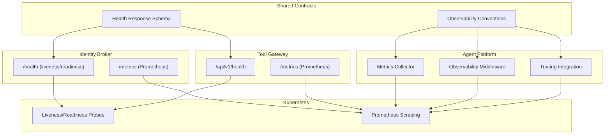
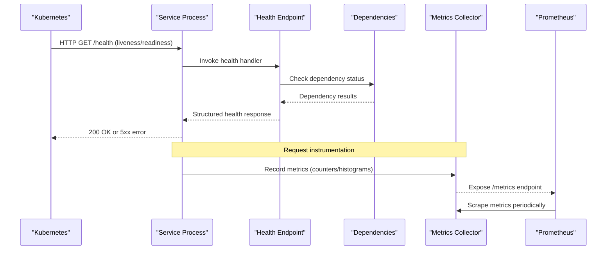
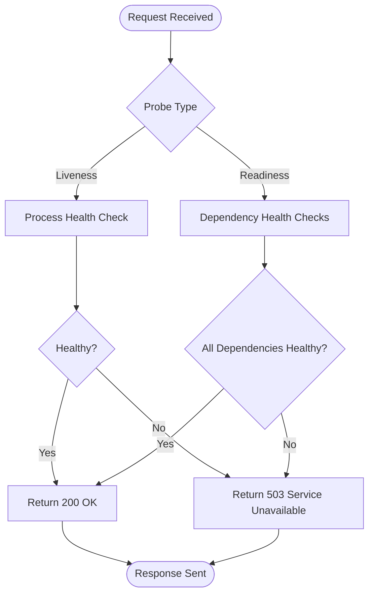
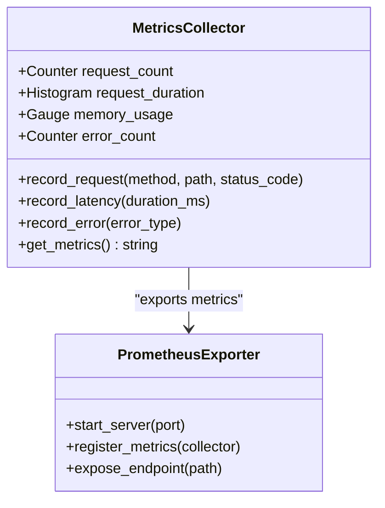
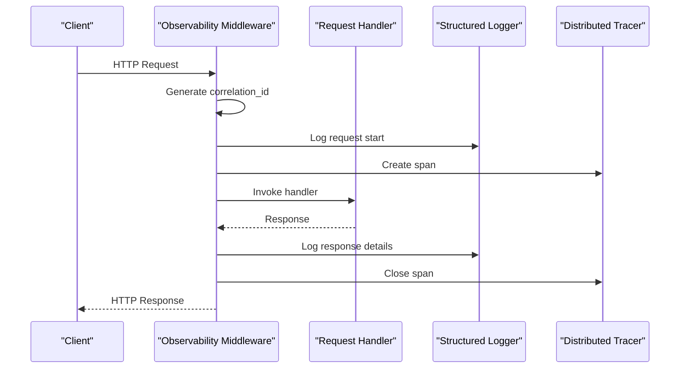
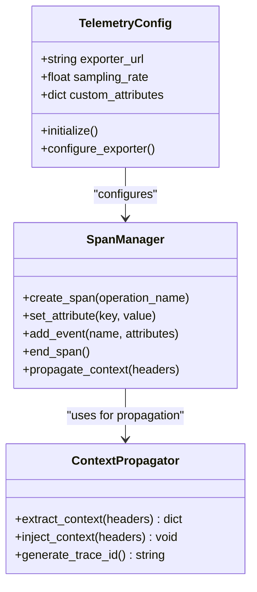
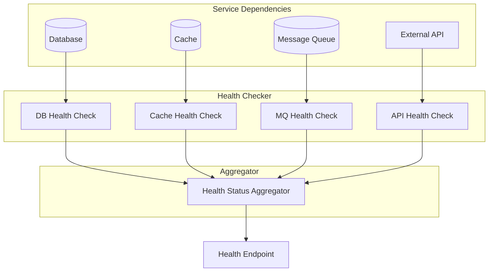

# Health & Monitoring API

<cite>
**Referenced Files in This Document**
- [health.py](file://products/identity-broker/src/identity_service/api/routes/health.py)
- [routes.py](file://products/tool-gateway/src/api_gateway/api/routes/health.py)
- [metrics.py](file://products/agent-platform/src/agent_service/core/metrics.py)
- [observability.py](file://products/agent-platform/src/agent_service/core/observability.py)
- [telemetry.py](file://products/agent-platform/src/agent_service/core/telemetry.py)
- [metrics.py](file://products/tool-gateway/src/api_gateway/core/metrics.py)
- [observability.py](file://products/tool-gateway/src/api_gateway/core/observability.py)
- [telemetry.py](file://products/tool-gateway/src/api_gateway/core/telemetry.py)
- [observability-conventions.md](file://shared/shared-contracts/observability-conventions.md)
- [health-response.schema.json](file://shared/shared-contracts/schemas/health-response.schema.json)
- [agent-health.schema.json](file://shared/shared-contracts/schemas/agent-health.schema.json)
- [agent-service-deployment.yaml](file://shared/platform-ops/gitops/dev-k8s/base/agent-platform/agent-service-deployment.yaml)
- [api-gateway-deployment.yaml](file://shared/platform-ops/gitops/dev-k8s/base/tool-gateway/api-gateway-deployment.yaml)
- [identity-service-deployment.yaml](file://shared/platform-ops/gitops/dev-k8s/base/identity-broker/identity-service-deployment.yaml)
</cite>

## Table of Contents
1. [Introduction](#introduction)
2. [Project Structure](#project-structure)
3. [Core Components](#core-components)
4. [Architecture Overview](#architecture-overview)
5. [Detailed Component Analysis](#detailed-component-analysis)
6. [Dependency Analysis](#dependency-analysis)
7. [Performance Considerations](#performance-considerations)
8. [Troubleshooting Guide](#troubleshooting-guide)
9. [Conclusion](#conclusion)
10. [Appendices](#appendices)

## Introduction
This document provides comprehensive API documentation for health check and monitoring endpoints across the platform services. It covers:
- Health status endpoints (liveness, readiness, dependency checks)
- Metrics collection and Prometheus exposition
- Observability data exposure (logs, traces, metrics)
- Structured logging conventions and distributed tracing integration
- Examples for health dashboards, alerting rules, and performance monitoring
- Troubleshooting methodologies, log analysis techniques, and incident response procedures

The goal is to enable operators and developers to reliably monitor service health, detect issues early, and respond effectively using standardized observability practices.

## Project Structure
Health and monitoring capabilities are implemented consistently across services:
- Identity Broker exposes a dedicated health route
- Tool Gateway exposes a health route under its API routes
- Agent Platform centralizes metrics, observability, and telemetry utilities
- Shared contracts define schemas and observability conventions
- Kubernetes manifests configure probes and expose metrics endpoints

**Diagram sources**
- [health.py](file://products/identity-broker/src/identity_service/api/routes/health.py)
- [routes.py](file://products/tool-gateway/src/api_gateway/api/routes/health.py)
- [metrics.py](file://products/agent-platform/src/agent_service/core/metrics.py)
- [observability.py](file://products/agent-platform/src/agent_service/core/observability.py)
- [telemetry.py](file://products/agent-platform/src/agent_service/core/telemetry.py)
- [metrics.py](file://products/tool-gateway/src/api_gateway/core/metrics.py)
- [observability.py](file://products/tool-gateway/src/api_gateway/core/observability.py)
- [telemetry.py](file://products/tool-gateway/src/api_gateway/core/telemetry.py)
- [observability-conventions.md](file://shared/shared-contracts/observability-conventions.md)
- [health-response.schema.json](file://shared/shared-contracts/schemas/health-response.schema.json)
- [agent-health.schema.json](file://shared/shared-contracts/schemas/agent-health.schema.json)
- [agent-service-deployment.yaml](file://shared/platform-ops/gitops/dev-k8s/base/agent-platform/agent-service-deployment.yaml)
- [api-gateway-deployment.yaml](file://shared/platform-ops/gitops/dev-k8s/base/tool-gateway/api-gateway-deployment.yaml)
- [identity-service-deployment.yaml](file://shared/platform-ops/gitops/dev-k8s/base/identity-broker/identity-service-deployment.yaml)

**Section sources**
- [health.py](file://products/identity-broker/src/identity_service/api/routes/health.py)
- [routes.py](file://products/tool-gateway/src/api_gateway/api/routes/health.py)
- [metrics.py](file://products/agent-platform/src/agent_service/core/metrics.py)
- [observability.py](file://products/agent-platform/src/agent_service/core/observability.py)
- [telemetry.py](file://products/agent-platform/src/agent_service/core/telemetry.py)
- [metrics.py](file://products/tool-gateway/src/api_gateway/core/metrics.py)
- [observability.py](file://products/tool-gateway/src/api_gateway/core/observability.py)
- [telemetry.py](file://products/tool-gateway/src/api_gateway/core/telemetry.py)
- [observability-conventions.md](file://shared/shared-contracts/observability-conventions.md)
- [health-response.schema.json](file://shared/shared-contracts/schemas/health-response.schema.json)
- [agent-health.schema.json](file://shared/shared-contracts/schemas/agent-health.schema.json)
- [agent-service-deployment.yaml](file://shared/platform-ops/gitops/dev-k8s/base/agent-platform/agent-service-deployment.yaml)
- [api-gateway-deployment.yaml](file://shared/platform-ops/gitops/dev-k8s/base/tool-gateway/api-gateway-deployment.yaml)
- [identity-service-deployment.yaml](file://shared/platform-ops/gitops/dev-k8s/base/identity-broker/identity-service-deployment.yaml)

## Core Components
- Health endpoints provide liveness and readiness signals with structured responses conforming to shared schemas.
- Metrics collectors expose Prometheus-compatible metrics for request rates, latency, errors, and resource usage.
- Observability middleware instruments requests with tracing spans and structured logs.
- Telemetry modules integrate distributed tracing backends and propagate context across services.

Key responsibilities:
- Health endpoints: Validate internal state and dependencies; return standardized health status objects.
- Metrics: Define counters, histograms, gauges; ensure consistent naming and labels per conventions.
- Observability: Attach correlation IDs, capture request/response metadata, and emit structured logs.
- Telemetry: Initialize tracing providers, export spans, and maintain trace context propagation.

**Section sources**
- [health.py](file://products/identity-broker/src/identity_service/api/routes/health.py)
- [routes.py](file://products/tool-gateway/src/api_gateway/api/routes/health.py)
- [metrics.py](file://products/agent-platform/src/agent_service/core/metrics.py)
- [observability.py](file://products/agent-platform/src/agent_service/core/observability.py)
- [telemetry.py](file://products/agent-platform/src/agent_service/core/telemetry.py)
- [metrics.py](file://products/tool-gateway/src/api_gateway/core/metrics.py)
- [observability.py](file://products/tool-gateway/src/api_gateway/core/observability.py)
- [telemetry.py](file://products/tool-gateway/src/api_gateway/core/telemetry.py)
- [observability-conventions.md](file://shared/shared-contracts/observability-conventions.md)
- [health-response.schema.json](file://shared/shared-contracts/schemas/health-response.schema.json)
- [agent-health.schema.json](file://shared/shared-contracts/schemas/agent-health.schema.json)

## Architecture Overview
The health and monitoring architecture follows a layered approach:
- API layer exposes health endpoints and metrics endpoints
- Service layer performs dependency checks and collects metrics
- Observability layer instruments requests and emits structured logs
- Telemetry layer integrates tracing and propagates context
- Kubernetes orchestrates probes and scraping configurations

**Diagram sources**
- [health.py](file://products/identity-broker/src/identity_service/api/routes/health.py)
- [routes.py](file://products/tool-gateway/src/api_gateway/api/routes/health.py)
- [metrics.py](file://products/agent-platform/src/agent_service/core/metrics.py)
- [observability.py](file://products/agent-platform/src/agent_service/core/observability.py)
- [telemetry.py](file://products/agent-platform/src/agent_service/core/telemetry.py)
- [metrics.py](file://products/tool-gateway/src/api_gateway/core/metrics.py)
- [observability.py](file://products/tool-gateway/src/api_gateway/core/observability.py)
- [telemetry.py](file://products/tool-gateway/src/api_gateway/core/telemetry.py)
- [agent-service-deployment.yaml](file://shared/platform-ops/gitops/dev-k8s/base/agent-platform/agent-service-deployment.yaml)
- [api-gateway-deployment.yaml](file://shared/platform-ops/gitops/dev-k8s/base/tool-gateway/api-gateway-deployment.yaml)
- [identity-service-deployment.yaml](file://shared/platform-ops/gitops/dev-k8s/base/identity-broker/identity-service-deployment.yaml)

## Detailed Component Analysis

### Health Endpoints
Health endpoints implement liveness and readiness checks with structured responses:
- Liveness probe: Validates process is running and responsive
- Readiness probe: Validates dependencies are healthy and service can accept traffic
- Dependency checks: Database connections, external APIs, message brokers
- Structured response format: Conforms to shared health response schema

**Diagram sources**
- [health.py](file://products/identity-broker/src/identity_service/api/routes/health.py)
- [routes.py](file://products/tool-gateway/src/api_gateway/api/routes/health.py)
- [health-response.schema.json](file://shared/shared-contracts/schemas/health-response.schema.json)
- [agent-health.schema.json](file://shared/shared-contracts/schemas/agent-health.schema.json)

**Section sources**
- [health.py](file://products/identity-broker/src/identity_service/api/routes/health.py)
- [routes.py](file://products/tool-gateway/src/api_gateway/api/routes/health.py)
- [health-response.schema.json](file://shared/shared-contracts/schemas/health-response.schema.json)
- [agent-health.schema.json](file://shared/shared-contracts/schemas/agent-health.schema.json)

### Metrics Collection
Metrics collection follows Prometheus best practices:
- Counter metrics: Request counts, error rates, queue lengths
- Histogram metrics: Latency distributions, payload sizes
- Gauge metrics: Memory usage, CPU utilization, connection pools
- Consistent naming: snake_case with domain prefixes
- Labels: service name, version, environment, region

**Diagram sources**
- [metrics.py](file://products/agent-platform/src/agent_service/core/metrics.py)
- [metrics.py](file://products/tool-gateway/src/api_gateway/core/metrics.py)

**Section sources**
- [metrics.py](file://products/agent-platform/src/agent_service/core/metrics.py)
- [metrics.py](file://products/tool-gateway/src/api_gateway/core/metrics.py)
- [observability-conventions.md](file://shared/shared-contracts/observability-conventions.md)

### Observability Middleware
Observability middleware provides request instrumentation:
- Correlation ID generation and propagation
- Structured logging with consistent fields
- Request/response metadata capture
- Error context enrichment
- Performance timing measurement

**Diagram sources**
- [observability.py](file://products/agent-platform/src/agent_service/core/observability.py)
- [observability.py](file://products/tool-gateway/src/api_gateway/core/observability.py)

**Section sources**
- [observability.py](file://products/agent-platform/src/agent_service/core/observability.py)
- [observability.py](file://products/tool-gateway/src/api_gateway/core/observability.py)

### Distributed Tracing Integration
Telemetry modules handle distributed tracing:
- Tracer initialization and configuration
- Span creation and context propagation
- Trace sampling strategies
- Exporter configuration for tracing backends
- Cross-service trace correlation

**Diagram sources**
- [telemetry.py](file://products/agent-platform/src/agent_service/core/telemetry.py)
- [telemetry.py](file://products/tool-gateway/src/api_gateway/core/telemetry.py)

**Section sources**
- [telemetry.py](file://products/agent-platform/src/agent_service/core/telemetry.py)
- [telemetry.py](file://products/tool-gateway/src/api_gateway/core/telemetry.py)

## Dependency Analysis
Health checks validate service dependencies:
- Database connectivity checks
- External API availability validation
- Message broker connection verification
- Cache service health assessment
- Configuration validation

**Diagram sources**
- [health.py](file://products/identity-broker/src/identity_service/api/routes/health.py)
- [routes.py](file://products/tool-gateway/src/api_gateway/api/routes/health.py)

**Section sources**
- [health.py](file://products/identity-broker/src/identity_service/api/routes/health.py)
- [routes.py](file://products/tool-gateway/src/api_gateway/api/routes/health.py)

## Performance Considerations
- Health check endpoints should be lightweight and fast (<100ms response time)
- Metrics collection should use asynchronous operations to avoid blocking
- Sampling rates for tracing should be configurable based on load
- Log volume should be controlled with appropriate log levels
- Resource monitoring should not impact application performance
- Connection pooling for dependency checks to prevent resource exhaustion

## Troubleshooting Guide
Common troubleshooting approaches:
- Health endpoint diagnostics: Check individual dependency statuses
- Metrics analysis: Monitor error rates, latency percentiles, resource usage
- Log correlation: Use correlation IDs to trace request flows
- Trace analysis: Follow distributed traces across service boundaries
- Resource monitoring: Identify bottlenecks in CPU, memory, I/O

Incident response procedures:
- Automated alerts based on health check failures
- Escalation policies for critical dependencies
- Rollback procedures for failing deployments
- Communication templates for stakeholders
- Post-mortem analysis frameworks

**Section sources**
- [health.py](file://products/identity-broker/src/identity_service/api/routes/health.py)
- [routes.py](file://products/tool-gateway/src/api_gateway/api/routes/health.py)
- [metrics.py](file://products/agent-platform/src/agent_service/core/metrics.py)
- [observability.py](file://products/agent-platform/src/agent_service/core/observability.py)
- [telemetry.py](file://products/agent-platform/src/agent_service/core/telemetry.py)

## Conclusion
The health and monitoring system provides comprehensive observability across all platform services. By following standardized conventions for health checks, metrics, logging, and tracing, operators can maintain high availability and quickly diagnose issues. The modular architecture allows for easy extension and customization while maintaining consistency across services.

## Appendices

### Prometheus Metrics Format
Standardized metrics include:
- Request counters: `http_requests_total{method,endpoint,status}`
- Latency histograms: `http_request_duration_seconds_bucket`
- Error counters: `errors_total{type,service}`
- Resource gauges: `process_memory_bytes`, `cpu_usage_percent`
- Custom business metrics: Domain-specific counters and gauges

### Structured Logging Conventions
Consistent log structure includes:
- Timestamp in ISO 8601 format
- Log level (DEBUG, INFO, WARN, ERROR)
- Service name and version
- Correlation ID for request tracing
- Request method and endpoint
- Response status code and duration
- Error details with stack traces when applicable

### Health Dashboard Setup
Recommended dashboard components:
- Service health overview with status indicators
- Dependency health matrix
- Request rate and error rate charts
- Latency percentile graphs
- Resource utilization monitors
- Alert status and recent incidents

### Alerting Rules
Critical alerts should trigger on:
- Health check failures
- Error rate spikes (>5% for 5 minutes)
- Latency degradation (>95th percentile >1s)
- Resource exhaustion (>90% memory/CPU)
- Dependency unavailability
- Deployment failures

### Performance Monitoring
Key performance indicators:
- Request throughput (requests/second)
- Response latency (p50, p95, p99)
- Error rates by endpoint and type
- Resource utilization trends
- Dependency response times
- Queue depths and processing rates