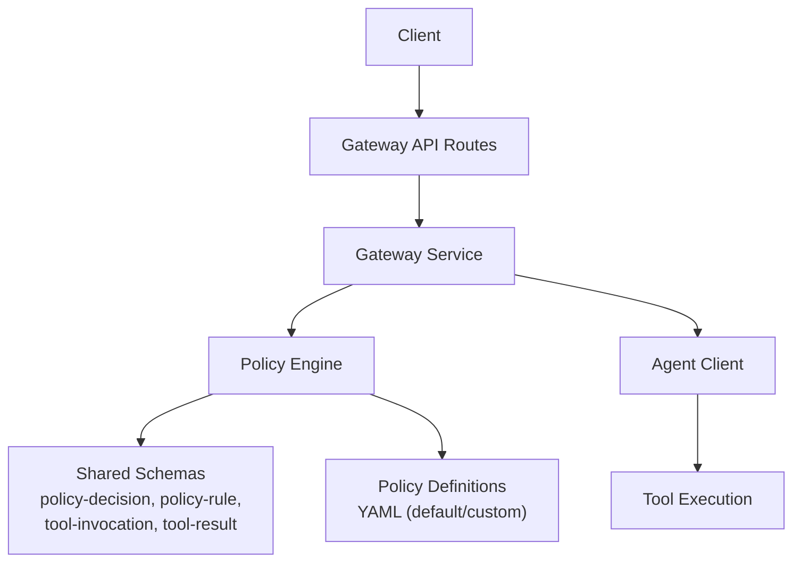
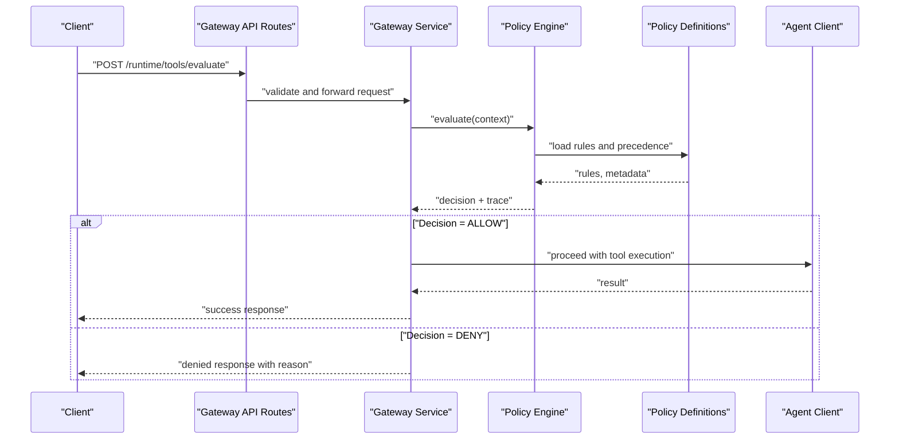
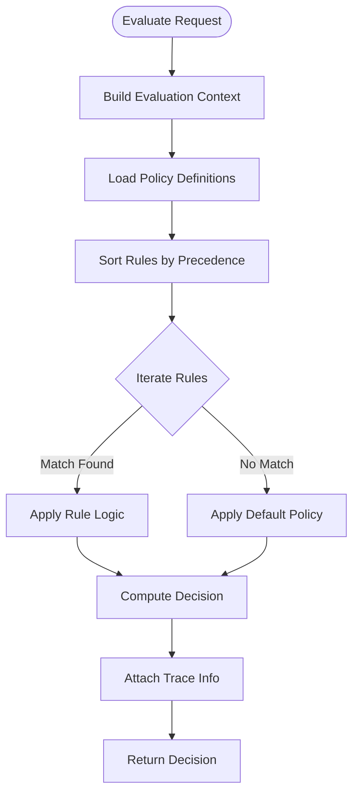
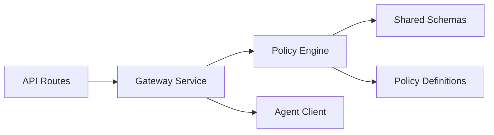

# Policy Enforcement API

<cite>
**Referenced Files in This Document**
- [SPEC-004-policy-enforcement/spec.md](file://docs/specs/SPEC-004-policy-enforcement/spec.md)
- [SPEC-004-policy-enforcement/plan.md](file://docs/specs/SPEC-004-policy-enforcement/plan.md)
- [SPEC-004-policy-enforcement/tasks.md](file://docs/specs/SPEC-004-policy-enforcement/tasks.md)
- [policy-default.yaml](file://products/tool-gateway/src/api_gateway/policies/policy-default.yaml)
- [policy_engine.py](file://products/tool-gateway/src/api_gateway/services/policy_engine.py)
- [test_policy_engine.py](file://products/tool-gateway/tests/test_policy_engine.py)
- [test_policy_enforcement.py](file://products/tool-gateway/tests/test_policy_enforcement.py)
- [policy-decision.schema.json](file://shared/shared-contracts/schemas/policy-decision.schema.json)
- [policy-rule.schema.json](file://shared/shared-contracts/schemas/policy-rule.schema.json)
- [tool-invocation.schema.json](file://shared/shared-contracts/schemas/tool-invocation.schema.json)
- [tool-result.schema.json](file://shared/shared-contracts/schemas/tool-result.schema.json)
- [api.py](file://products/tool-gateway/src/api_gateway/schemas/api.py)
- [routes.py](file://products/tool-gateway/src/api_gateway/api/routes/runtime.py)
- [gateway_service.py](file://products/tool-gateway/src/api_gateway/services/gateway_service.py)
- [agent_client.py](file://products/tool-gateway/src/api_gateway/services/agent_client.py)
</cite>

## Table of Contents
1. [Introduction](#introduction)
2. [Project Structure](#project-structure)
3. [Core Components](#core-components)
4. [Architecture Overview](#architecture-overview)
5. [Detailed Component Analysis](#detailed-component-analysis)
6. [Dependency Analysis](#dependency-analysis)
7. [Performance Considerations](#performance-considerations)
8. [Troubleshooting Guide](#troubleshooting-guide)
9. [Conclusion](#conclusion)
10. [Appendices](#appendices)

## Introduction
This document provides detailed API documentation for policy enforcement endpoints within the tool-gateway service. It covers policy evaluation requests, decision responses, rule matching mechanisms, and the policy engine architecture. It also includes guidance on policy definition formats, custom rule creation, testing workflows, versioning, rollback procedures, compliance reporting, debugging, performance tuning, and integration with external policy systems.

## Project Structure
The policy enforcement capability is implemented primarily in the tool-gateway product:
- Policy schemas are defined under shared contracts for consistent request/response modeling.
- The policy engine resides in the services layer and is invoked by gateway routes during tool invocation flows.
- Default policies are provided as YAML configuration files.
- Tests validate both the engine logic and end-to-end enforcement behavior.

**Diagram sources**
- [routes.py](file://products/tool-gateway/src/api_gateway/api/routes/runtime.py)
- [gateway_service.py](file://products/tool-gateway/src/api_gateway/services/gateway_service.py)
- [policy_engine.py](file://products/tool-gateway/src/api_gateway/services/policy_engine.py)
- [policy-decision.schema.json](file://shared/shared-contracts/schemas/policy-decision.schema.json)
- [policy-rule.schema.json](file://shared/shared-contracts/schemas/policy-rule.schema.json)
- [tool-invocation.schema.json](file://shared/shared-contracts/schemas/tool-invocation.schema.json)
- [tool-result.schema.json](file://shared/shared-contracts/schemas/tool-result.schema.json)
- [policy-default.yaml](file://products/tool-gateway/src/api_gateway/policies/policy-default.yaml)

**Section sources**
- [SPEC-004-policy-enforcement/spec.md](file://docs/specs/SPEC-004-policy-enforcement/spec.md)
- [policy_engine.py](file://products/tool-gateway/src/api_gateway/services/policy_engine.py)
- [policy-default.yaml](file://products/tool-gateway/src/api_gateway/policies/policy-default.yaml)

## Core Components
- Policy Engine: Evaluates incoming tool invocations against configured rules and returns a decision.
- Gateway Service: Orchestrates request handling, invokes the policy engine, and proceeds to tool execution based on decisions.
- API Routes: Expose endpoints that accept policy evaluation requests and return standardized decisions.
- Shared Schemas: Define the structure of policy decisions, rules, tool invocations, and results.
- Policy Definitions: YAML-based policy documents defining rules, precedence, and evaluation order.

Key responsibilities:
- Validate inputs using shared schemas.
- Load and parse policy definitions.
- Match rules against context and request attributes.
- Compute decisions with deterministic precedence.
- Return structured decisions with traceability information.

**Section sources**
- [policy_engine.py](file://products/tool-gateway/src/api_gateway/services/policy_engine.py)
- [gateway_service.py](file://products/tool-gateway/src/api_gateway/services/gateway_service.py)
- [api.py](file://products/tool-gateway/src/api_gateway/schemas/api.py)
- [policy-decision.schema.json](file://shared/shared-contracts/schemas/policy-decision.schema.json)
- [policy-rule.schema.json](file://shared/shared-contracts/schemas/policy-rule.schema.json)
- [tool-invocation.schema.json](file://shared/shared-contracts/schemas/tool-invocation.schema.json)
- [tool-result.schema.json](file://shared/shared-contracts/schemas/tool-result.schema.json)

## Architecture Overview
The policy enforcement flow integrates into the tool invocation lifecycle:
- Clients send tool invocation requests through gateway routes.
- The gateway service validates the request and constructs a policy evaluation context.
- The policy engine evaluates rules from loaded policy definitions and produces a decision.
- Based on the decision, the gateway either allows or denies the operation and returns a response.

**Diagram sources**
- [routes.py](file://products/tool-gateway/src/api_gateway/api/routes/runtime.py)
- [gateway_service.py](file://products/tool-gateway/src/api_gateway/services/gateway_service.py)
- [policy_engine.py](file://products/tool-gateway/src/api_gateway/services/policy_engine.py)
- [policy-default.yaml](file://products/tool-gateway/src/api_gateway/policies/policy-default.yaml)

## Detailed Component Analysis

### Policy Engine
Responsibilities:
- Parse and cache policy definitions.
- Build an evaluation context from request data.
- Apply rule matching with precedence and ordering.
- Produce a decision object including matched rules and reasons.

Evaluation order:
- Rules are evaluated in declared precedence order.
- First-match-wins semantics apply unless otherwise specified by policy configuration.
- Deny rules typically take precedence over allow rules when conflicts exist.

Rule matching:
- Context fields include identity, resource attributes, action, and environment variables.
- Matchers support attribute comparisons, regex patterns, and set membership checks.
- Custom rule functions can be registered for domain-specific logic.

**Diagram sources**
- [policy_engine.py](file://products/tool-gateway/src/api_gateway/services/policy_engine.py)
- [policy-default.yaml](file://products/tool-gateway/src/api_gateway/policies/policy-default.yaml)

**Section sources**
- [policy_engine.py](file://products/tool-gateway/src/api_gateway/services/policy_engine.py)
- [test_policy_engine.py](file://products/tool-gateway/tests/test_policy_engine.py)

### Gateway Service Integration
Responsibilities:
- Receive requests at API routes.
- Construct policy evaluation contexts.
- Invoke the policy engine and handle outcomes.
- Proceed to tool execution if allowed; otherwise, return denial.

Integration points:
- Uses shared schemas to validate payloads.
- Leverages agent client for downstream tool execution.
- Emits observability metrics and telemetry for auditability.

**Section sources**
- [gateway_service.py](file://products/tool-gateway/src/api_gateway/services/gateway_service.py)
- [agent_client.py](file://products/tool-gateway/src/api_gateway/services/agent_client.py)
- [api.py](file://products/tool-gateway/src/api_gateway/schemas/api.py)

### API Endpoints
Endpoints exposed by the gateway for policy enforcement:
- Evaluate endpoint: Accepts a tool invocation context and returns a policy decision.
- Health endpoint: Returns service health and policy engine status.

Request/response models:
- Requests conform to tool invocation schema.
- Responses conform to policy decision schema.

**Section sources**
- [routes.py](file://products/tool-gateway/src/api_gateway/api/routes/runtime.py)
- [tool-invocation.schema.json](file://shared/shared-contracts/schemas/tool-invocation.schema.json)
- [policy-decision.schema.json](file://shared/shared-contracts/schemas/policy-decision.schema.json)

### Policy Definition Format
Policy definitions are YAML documents containing:
- Version metadata for policy sets.
- Rule lists with precedence, matchers, and actions.
- Global settings such as default decision and evaluation mode.

Example structure references:
- See default policy file for baseline rules and precedence.
- Use shared schemas to ensure consistency across environments.

**Section sources**
- [policy-default.yaml](file://products/tool-gateway/src/api_gateway/policies/policy-default.yaml)
- [policy-rule.schema.json](file://shared/shared-contracts/schemas/policy-rule.schema.json)

### Custom Rule Creation
To create custom rules:
- Implement a rule function adhering to the engine’s interface contract.
- Register the rule with the engine’s rule registry.
- Reference the custom rule in policy definitions.

Guidelines:
- Ensure idempotency and determinism.
- Provide clear error messages and traceable reasons.
- Include unit tests for custom rule logic.

**Section sources**
- [policy_engine.py](file://products/tool-gateway/src/api_gateway/services/policy_engine.py)
- [test_policy_engine.py](file://products/tool-gateway/tests/test_policy_engine.py)

### Policy Testing Workflows
Testing strategies:
- Unit tests for policy engine and custom rules.
- Integration tests validating end-to-end enforcement via gateway routes.
- Contract tests ensuring schema compliance for requests and decisions.

Recommended workflow:
- Write tests alongside policy changes.
- Use fixtures for common contexts and rule sets.
- Assert decision outcomes and trace details.

**Section sources**
- [test_policy_engine.py](file://products/tool-gateway/tests/test_policy_engine.py)
- [test_policy_enforcement.py](file://products/tool-gateway/tests/test_policy_enforcement.py)

### Policy Versioning and Rollback
Versioning:
- Each policy set includes a version identifier.
- Deployments should pin versions to ensure reproducibility.

Rollback procedures:
- Maintain previous versions in deployment artifacts.
- Switch back to a known-good version upon issues.
- Validate rollback by re-running policy tests.

Compliance reporting:
- Emit audit logs capturing decisions, matched rules, and reasons.
- Aggregate metrics for denied operations and hotspots.

**Section sources**
- [policy-default.yaml](file://products/tool-gateway/src/api_gateway/policies/policy-default.yaml)
- [policy-engine spec](file://docs/specs/SPEC-004-policy-enforcement/spec.md)

### Debugging Guidance
Debugging steps:
- Enable verbose logging for policy evaluations.
- Inspect trace information in decision responses.
- Use test harnesses to simulate requests and verify rule matches.

Common pitfalls:
- Incorrect context fields leading to unexpected matches.
- Misconfigured precedence causing unintended denials.
- Missing custom rule registrations.

**Section sources**
- [policy_engine.py](file://products/tool-gateway/src/api_gateway/services/policy_engine.py)
- [test_policy_enforcement.py](file://products/tool-gateway/tests/test_policy_enforcement.py)

### Performance Tuning
Optimization recommendations:
- Cache policy definitions to avoid repeated parsing.
- Minimize expensive matcher computations.
- Batch evaluations where possible.
- Monitor latency and throughput metrics.

[No sources needed since this section provides general guidance]

### Integration with External Policy Systems
Integration approaches:
- Delegate complex evaluations to external policy engines via adapters.
- Map local rule structures to external policy formats.
- Handle timeouts and fallback behaviors gracefully.

Considerations:
- Ensure consistent decision semantics across systems.
- Preserve traceability and audit trails.
- Validate external responses against shared schemas.

[No sources needed since this section provides general guidance]

## Dependency Analysis
The policy enforcement components depend on shared schemas and policy definitions. The gateway service orchestrates interactions between routes, the policy engine, and the agent client.

**Diagram sources**
- [routes.py](file://products/tool-gateway/src/api_gateway/api/routes/runtime.py)
- [gateway_service.py](file://products/tool-gateway/src/api_gateway/services/gateway_service.py)
- [policy_engine.py](file://products/tool-gateway/src/api_gateway/services/policy_engine.py)
- [policy-decision.schema.json](file://shared/shared-contracts/schemas/policy-decision.schema.json)
- [policy-rule.schema.json](file://shared/shared-contracts/schemas/policy-rule.schema.json)
- [tool-invocation.schema.json](file://shared/shared-contracts/schemas/tool-invocation.schema.json)
- [tool-result.schema.json](file://shared/shared-contracts/schemas/tool-result.schema.json)
- [policy-default.yaml](file://products/tool-gateway/src/api_gateway/policies/policy-default.yaml)

**Section sources**
- [policy_engine.py](file://products/tool-gateway/src/api_gateway/services/policy_engine.py)
- [gateway_service.py](file://products/tool-gateway/src/api_gateway/services/gateway_service.py)
- [api.py](file://products/tool-gateway/src/api_gateway/schemas/api.py)

## Performance Considerations
- Prefer caching for policy definitions and compiled rule sets.
- Avoid synchronous I/O in rule evaluators; use async where applicable.
- Profile matcher performance and optimize heavy computations.
- Instrument key paths with metrics and traces for observability.

[No sources needed since this section provides general guidance]

## Troubleshooting Guide
Common issues and resolutions:
- Invalid request payloads: Validate against shared schemas before evaluation.
- Unexpected denials: Review rule precedence and context construction.
- Missing custom rules: Ensure registration and correct naming.
- External system failures: Implement fallbacks and circuit breakers.

Diagnostic steps:
- Enable debug logs for policy engine.
- Inspect decision trace for matched rules and reasons.
- Reproduce with minimal policy sets to isolate issues.

**Section sources**
- [test_policy_enforcement.py](file://products/tool-gateway/tests/test_policy_enforcement.py)
- [policy_engine.py](file://products/tool-gateway/src/api_gateway/services/policy_engine.py)

## Conclusion
The policy enforcement API provides a robust mechanism for evaluating tool invocations against configurable rules. By leveraging shared schemas, deterministic precedence, and extensible rule functions, it supports secure and compliant operations. Proper testing, versioning, and observability ensure reliability and maintainability.

[No sources needed since this section summarizes without analyzing specific files]

## Appendices

### API Endpoint Summary
- POST /runtime/tools/evaluate: Submit a tool invocation context for policy evaluation.
- GET /health: Check service health and policy engine status.

Request and response models:
- Requests follow tool invocation schema.
- Responses follow policy decision schema.

**Section sources**
- [routes.py](file://products/tool-gateway/src/api_gateway/api/routes/runtime.py)
- [tool-invocation.schema.json](file://shared/shared-contracts/schemas/tool-invocation.schema.json)
- [policy-decision.schema.json](file://shared/shared-contracts/schemas/policy-decision.schema.json)

### Policy Specification References
For deeper understanding of design decisions and requirements:
- Refer to the policy enforcement specification and related plans.

**Section sources**
- [SPEC-004-policy-enforcement/spec.md](file://docs/specs/SPEC-004-policy-enforcement/spec.md)
- [SPEC-004-policy-enforcement/plan.md](file://docs/specs/SPEC-004-policy-enforcement/plan.md)
- [SPEC-004-policy-enforcement/tasks.md](file://docs/specs/SPEC-004-policy-enforcement/tasks.md)