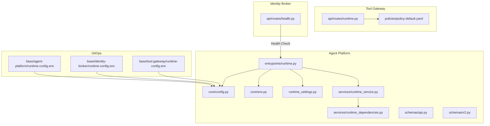
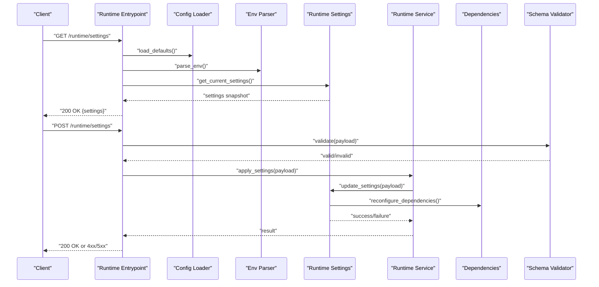
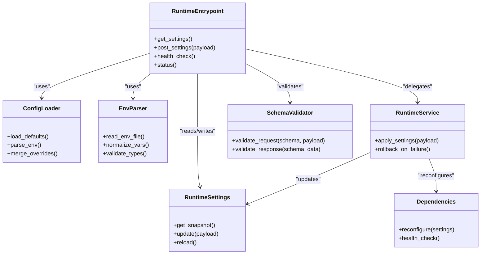

# Runtime Management API

<cite>
**Referenced Files in This Document**
- [runtime.py](file://products/agent-platform/src/agent_service/entrypoints/runtime.py)
- [routes.py](file://products/tool-gateway/src/api_gateway/api/routes/runtime.py)
- [config.py](file://products/agent-platform/src/agent_service/core/config.py)
- [env.py](file://products/agent-platform/src/agent_service/core/env.py)
- [runtime_settings.py](file://products/agent-platform/src/agent_service/runtime_settings.py)
- [runtime_service.py](file://products/agent-platform/src/agent_service/services/runtime_service.py)
- [runtime_dependencies.py](file://products/agent-platform/src/agent_service/services/runtime_dependencies.py)
- [health.py](file://products/identity-broker/src/identity_service/api/routes/health.py)
- [api.py](file://products/agent-platform/src/agent_service/schemas/api.py)
- [v2.py](file://products/agent-platform/src/agent_service/schemas/v2.py)
- [runtime-config.env](file://shared/platform-ops/gitops/dev-k8s/base/agent-platform/runtime-config.env)
- [runtime-config.env](file://shared/platform-ops/gitops/dev-k8s/base/identity-broker/runtime-config.env)
- [runtime-config.env](file://shared/platform-ops/gitops/dev-k8s/base/tool-gateway/runtime-config.env)
- [policy-default.yaml](file://products/tool-gateway/src/api_gateway/policies/policy-default.yaml)
- [observability-conventions.md](file://shared/shared-contracts/observability-conventions.md)
</cite>

## Table of Contents
1. [Introduction](#introduction)
2. [Project Structure](#project-structure)
3. [Core Components](#core-components)
4. [Architecture Overview](#architecture-overview)
5. [Detailed Component Analysis](#detailed-component-analysis)
6. [Dependency Analysis](#dependency-analysis)
7. [Performance Considerations](#performance-considerations)
8. [Troubleshooting Guide](#troubleshooting-guide)
9. [Conclusion](#conclusion)
10. [Appendices](#appendices)

## Introduction
This document provides comprehensive API documentation for runtime management endpoints across the platform’s services. It covers:
- Runtime configuration retrieval and updates (GET/POST)
- Environment variable management and environment-specific overrides
- Service lifecycle operations including health checks and status monitoring
- Configuration schema validation, dynamic reloading, and audit logging
- Security considerations for runtime configuration changes
- Best practices and troubleshooting guidance

The runtime management surface is exposed primarily by the Agent Platform service and the Tool Gateway, with health endpoints available in other services such as the Identity Broker.

## Project Structure
Runtime management spans multiple modules:
- Entry points expose HTTP routes for runtime settings and health
- Core modules provide configuration loading, environment parsing, and metrics
- Services encapsulate business logic for runtime state and dependency management
- Schemas define request/response contracts and validation rules
- GitOps overlays supply environment-specific runtime configuration files

**Diagram sources**
- [runtime.py](file://products/agent-platform/src/agent_service/entrypoints/runtime.py)
- [config.py](file://products/agent-platform/src/agent_service/core/config.py)
- [env.py](file://products/agent-platform/src/agent_service/core/env.py)
- [runtime_settings.py](file://products/agent-platform/src/agent_service/runtime_settings.py)
- [runtime_service.py](file://products/agent-platform/src/agent_service/services/runtime_service.py)
- [runtime_dependencies.py](file://products/agent-platform/src/agent_service/services/runtime_dependencies.py)
- [routes.py](file://products/tool-gateway/src/api_gateway/api/routes/runtime.py)
- [health.py](file://products/identity-broker/src/identity_service/api/routes/health.py)
- [api.py](file://products/agent-platform/src/agent_service/schemas/api.py)
- [v2.py](file://products/agent-platform/src/agent_service/schemas/v2.py)
- [runtime-config.env](file://shared/platform-ops/gitops/dev-k8s/base/agent-platform/runtime-config.env)
- [runtime-config.env](file://shared/platform-ops/gitops/dev-k8s/base/identity-broker/runtime-config.env)
- [runtime-config.env](file://shared/platform-ops/gitops/dev-k8s/base/tool-gateway/runtime-config.env)
- [policy-default.yaml](file://products/tool-gateway/src/api_gateway/policies/policy-default.yaml)

**Section sources**
- [runtime.py](file://products/agent-platform/src/agent_service/entrypoints/runtime.py)
- [routes.py](file://products/tool-gateway/src/api_gateway/api/routes/runtime.py)
- [config.py](file://products/agent-platform/src/agent_service/core/config.py)
- [env.py](file://products/agent-platform/src/agent_service/core/env.py)
- [runtime_settings.py](file://products/agent-platform/src/agent_service/runtime_settings.py)
- [runtime_service.py](file://products/agent-platform/src/agent_service/services/runtime_service.py)
- [runtime_dependencies.py](file://products/agent-platform/src/agent_service/services/runtime_dependencies.py)
- [health.py](file://products/identity-broker/src/identity_service/api/routes/health.py)
- [api.py](file://products/agent-platform/src/agent_service/schemas/api.py)
- [v2.py](file://products/agent-platform/src/agent_service/schemas/v2.py)
- [runtime-config.env](file://shared/platform-ops/gitops/dev-k8s/base/agent-platform/runtime-config.env)
- [runtime-config.env](file://shared/platform-ops/gitops/dev-k8s/base/identity-broker/runtime-config.env)
- [runtime-config.env](file://shared/platform-ops/gitops/dev-k8s/base/tool-gateway/runtime-config.env)
- [policy-default.yaml](file://products/tool-gateway/src/api_gateway/policies/policy-default.yaml)

## Core Components
- Runtime entrypoint exposes GET/POST endpoints for runtime settings and health/status queries.
- Configuration module loads defaults, environment variables, and applies overrides.
- Environment parser validates and normalizes runtime variables.
- Runtime settings module centralizes mutable runtime configuration and supports reload semantics.
- Runtime service orchestrates configuration reads/writes and interacts with dependencies.
- Dependencies module manages external resources required at runtime.
- Schemas define request/response structures and validation constraints.
- Health endpoint provides liveness/readiness checks.

Key responsibilities:
- Validate incoming configuration payloads against schemas
- Apply environment-specific overrides from GitOps-provided .env files
- Persist or propagate runtime changes safely
- Emit observability signals for configuration changes and errors

**Section sources**
- [runtime.py](file://products/agent-platform/src/agent_service/entrypoints/runtime.py)
- [config.py](file://products/agent-platform/src/agent_service/core/config.py)
- [env.py](file://products/agent-platform/src/agent_service/core/env.py)
- [runtime_settings.py](file://products/agent-platform/src/agent_service/runtime_settings.py)
- [runtime_service.py](file://products/agent-platform/src/agent_service/services/runtime_service.py)
- [runtime_dependencies.py](file://products/agent-platform/src/agent_service/services/runtime_dependencies.py)
- [api.py](file://products/agent-platform/src/agent_service/schemas/api.py)
- [v2.py](file://products/agent-platform/src/agent_service/schemas/v2.py)
- [health.py](file://products/identity-broker/src/identity_service/api/routes/health.py)

## Architecture Overview
The runtime management architecture integrates HTTP endpoints with configuration and service layers:

**Diagram sources**
- [runtime.py](file://products/agent-platform/src/agent_service/entrypoints/runtime.py)
- [config.py](file://products/agent-platform/src/agent_service/core/config.py)
- [env.py](file://products/agent-platform/src/agent_service/core/env.py)
- [runtime_settings.py](file://products/agent-platform/src/agent_service/runtime_settings.py)
- [runtime_service.py](file://products/agent-platform/src/agent_service/services/runtime_service.py)
- [runtime_dependencies.py](file://products/agent-platform/src/agent_service/services/runtime_dependencies.py)
- [api.py](file://products/agent-platform/src/agent_service/schemas/api.py)
- [v2.py](file://products/agent-platform/src/agent_service/schemas/v2.py)

## Detailed Component Analysis

### Runtime Entrypoint (Agent Platform)
Responsibilities:
- Expose GET/POST endpoints for runtime settings
- Provide health and status endpoints
- Coordinate validation and application of configuration changes

Endpoints:
- GET /runtime/settings: Returns current runtime configuration snapshot
- POST /runtime/settings: Applies new runtime configuration after validation
- GET /health: Liveness/readiness check
- GET /status: Service status and metadata

Behavior:
- Validates requests using schema definitions
- Persists changes via runtime settings and notifies dependencies
- Emits metrics and telemetry on successful and failed operations

**Section sources**
- [runtime.py](file://products/agent-platform/src/agent_service/entrypoints/runtime.py)
- [api.py](file://products/agent-platform/src/agent_service/schemas/api.py)
- [v2.py](file://products/agent-platform/src/agent_service/schemas/v2.py)

### Runtime Entrypoint (Tool Gateway)
Responsibilities:
- Exposes runtime-related routes for gateway-level configuration
- Enforces policy-based access to runtime endpoints

Endpoints:
- GET /runtime/settings: Retrieves gateway runtime settings
- POST /runtime/settings: Updates gateway runtime settings subject to policy checks

Behavior:
- Integrates with policy engine to authorize configuration changes
- Logs audit events for all runtime modifications

**Section sources**
- [routes.py](file://products/tool-gateway/src/api_gateway/api/routes/runtime.py)
- [policy-default.yaml](file://products/tool-gateway/src/api_gateway/policies/policy-default.yaml)

### Configuration Loader and Environment Parser
Responsibilities:
- Load default configuration values
- Parse environment variables from runtime-config.env files
- Apply environment-specific overrides and merge strategies

Behavior:
- Supports hierarchical merging (defaults < env vars < explicit overrides)
- Validates types and required fields
- Provides a normalized configuration object to services

**Section sources**
- [config.py](file://products/agent-platform/src/agent_service/core/config.py)
- [env.py](file://products/agent-platform/src/agent_service/core/env.py)
- [runtime-config.env](file://shared/platform-ops/gitops/dev-k8s/base/agent-platform/runtime-config.env)
- [runtime-config.env](file://shared/platform-ops/gitops/dev-k8s/base/identity-broker/runtime-config.env)
- [runtime-config.env](file://shared/platform-ops/gitops/dev-k8s/base/tool-gateway/runtime-config.env)

### Runtime Settings and Service
Responsibilities:
- Manage mutable runtime configuration
- Support dynamic reloading without service restart
- Coordinate dependency reconfiguration

Behavior:
- Maintains an in-memory settings store with versioning
- Applies atomic updates and rollback on failure
- Emits audit logs and metrics for changes

**Section sources**
- [runtime_settings.py](file://products/agent-platform/src/agent_service/runtime_settings.py)
- [runtime_service.py](file://products/agent-platform/src/agent_service/services/runtime_service.py)
- [runtime_dependencies.py](file://products/agent-platform/src/agent_service/services/runtime_dependencies.py)

### Health Endpoint (Identity Broker)
Responsibilities:
- Provide liveness and readiness probes
- Report basic service health status

Behavior:
- Returns simple JSON indicating health state
- Can be extended to include dependency health checks

**Section sources**
- [health.py](file://products/identity-broker/src/identity_service/api/routes/health.py)

### Schema Definitions
Responsibilities:
- Define request/response structures for runtime endpoints
- Enforce validation rules for configuration payloads

Behavior:
- Used by entrypoints to validate inputs
- Versioned schemas support backward compatibility

**Section sources**
- [api.py](file://products/agent-platform/src/agent_service/schemas/api.py)
- [v2.py](file://products/agent-platform/src/agent_service/schemas/v2.py)

## Dependency Analysis
Runtime management components have clear separation of concerns:
- Entrypoints depend on schemas, config, env, settings, and services
- Services depend on dependencies for external resource management
- Policy enforcement applies to configuration changes in the Tool Gateway

**Diagram sources**
- [runtime.py](file://products/agent-platform/src/agent_service/entrypoints/runtime.py)
- [config.py](file://products/agent-platform/src/agent_service/core/config.py)
- [env.py](file://products/agent-platform/src/agent_service/core/env.py)
- [runtime_settings.py](file://products/agent-platform/src/agent_service/runtime_settings.py)
- [runtime_service.py](file://products/agent-platform/src/agent_service/services/runtime_service.py)
- [runtime_dependencies.py](file://products/agent-platform/src/agent_service/services/runtime_dependencies.py)
- [api.py](file://products/agent-platform/src/agent_service/schemas/api.py)
- [v2.py](file://products/agent-platform/src/agent_service/schemas/v2.py)

**Section sources**
- [runtime.py](file://products/agent-platform/src/agent_service/entrypoints/runtime.py)
- [routes.py](file://products/tool-gateway/src/api_gateway/api/routes/runtime.py)
- [config.py](file://products/agent-platform/src/agent_service/core/config.py)
- [env.py](file://products/agent-platform/src/agent_service/core/env.py)
- [runtime_settings.py](file://products/agent-platform/src/agent_service/runtime_settings.py)
- [runtime_service.py](file://products/agent-platform/src/agent_service/services/runtime_service.py)
- [runtime_dependencies.py](file://products/agent-platform/src/agent_service/services/runtime_dependencies.py)
- [api.py](file://products/agent-platform/src/agent_service/schemas/api.py)
- [v2.py](file://products/agent-platform/src/agent_service/schemas/v2.py)

## Performance Considerations
- Configuration reads should be cached where appropriate to avoid repeated file I/O
- Validation should be efficient and fail fast on invalid inputs
- Dynamic reloading should minimize downtime by using atomic swaps
- Metrics and telemetry should be sampled to reduce overhead
- Health checks should be lightweight and not trigger expensive operations

[No sources needed since this section provides general guidance]

## Troubleshooting Guide
Common issues and resolutions:
- Invalid configuration payload: Verify schema compliance and field types
- Environment variable conflicts: Check override precedence and naming conventions
- Failed dynamic reload: Inspect dependency reconfiguration logs and rollback status
- Health check failures: Review dependency health and service readiness
- Audit log gaps: Ensure logging middleware is active and permissions are correct

Best practices:
- Use environment-specific .env files for different deployments
- Validate configurations before applying them in production
- Monitor metrics and logs for configuration change patterns
- Implement rate limiting on configuration update endpoints

Security considerations:
- Restrict write access to runtime configuration via policies
- Encrypt sensitive environment variables at rest and in transit
- Audit all configuration changes with user and timestamp context
- Validate and sanitize all inputs to prevent injection attacks

**Section sources**
- [policy-default.yaml](file://products/tool-gateway/src/api_gateway/policies/policy-default.yaml)
- [observability-conventions.md](file://shared/shared-contracts/observability-conventions.md)

## Conclusion
The runtime management API provides a robust foundation for configuring and monitoring services dynamically. By leveraging schema validation, environment-specific overrides, and policy-based access control, the system ensures safe and auditable runtime customization. Proper observability and troubleshooting practices enable reliable operation across diverse environments.

[No sources needed since this section summarizes without analyzing specific files]

## Appendices

### API Endpoints Summary
- GET /runtime/settings: Retrieve current runtime configuration
- POST /runtime/settings: Update runtime configuration with validation
- GET /health: Liveness/readiness check
- GET /status: Service status and metadata

### Configuration Sources Priority
1. Default configuration values
2. Environment variables from runtime-config.env
3. Explicit overrides via API calls
4. Policy-enforced restrictions

### Audit Logging Requirements
- Log all configuration changes with user identity
- Include timestamps and previous/new values
- Store logs securely with retention policies
- Integrate with centralized logging systems

**Section sources**
- [runtime.py](file://products/agent-platform/src/agent_service/entrypoints/runtime.py)
- [routes.py](file://products/tool-gateway/src/api_gateway/api/routes/runtime.py)
- [config.py](file://products/agent-platform/src/agent_service/core/config.py)
- [env.py](file://products/agent-platform/src/agent_service/core/env.py)
- [runtime_settings.py](file://products/agent-platform/src/agent_service/runtime_settings.py)
- [runtime_service.py](file://products/agent-platform/src/agent_service/services/runtime_service.py)
- [runtime_dependencies.py](file://products/agent-platform/src/agent_service/services/runtime_dependencies.py)
- [health.py](file://products/identity-broker/src/identity_service/api/routes/health.py)
- [api.py](file://products/agent-platform/src/agent_service/schemas/api.py)
- [v2.py](file://products/agent-platform/src/agent_service/schemas/v2.py)
- [runtime-config.env](file://shared/platform-ops/gitops/dev-k8s/base/agent-platform/runtime-config.env)
- [runtime-config.env](file://shared/platform-ops/gitops/dev-k8s/base/identity-broker/runtime-config.env)
- [runtime-config.env](file://shared/platform-ops/gitops/dev-k8s/base/tool-gateway/runtime-config.env)
- [policy-default.yaml](file://products/tool-gateway/src/api_gateway/policies/policy-default.yaml)
- [observability-conventions.md](file://shared/shared-contracts/observability-conventions.md)