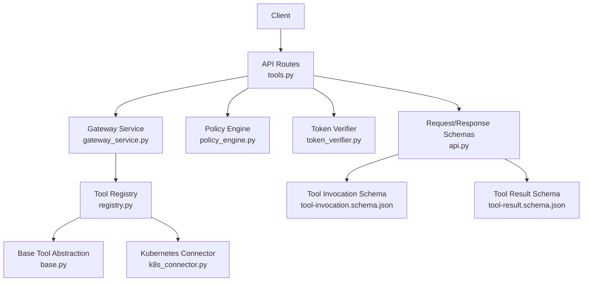
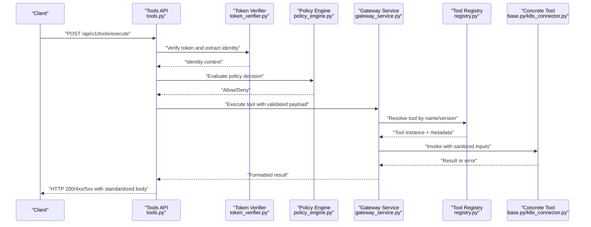
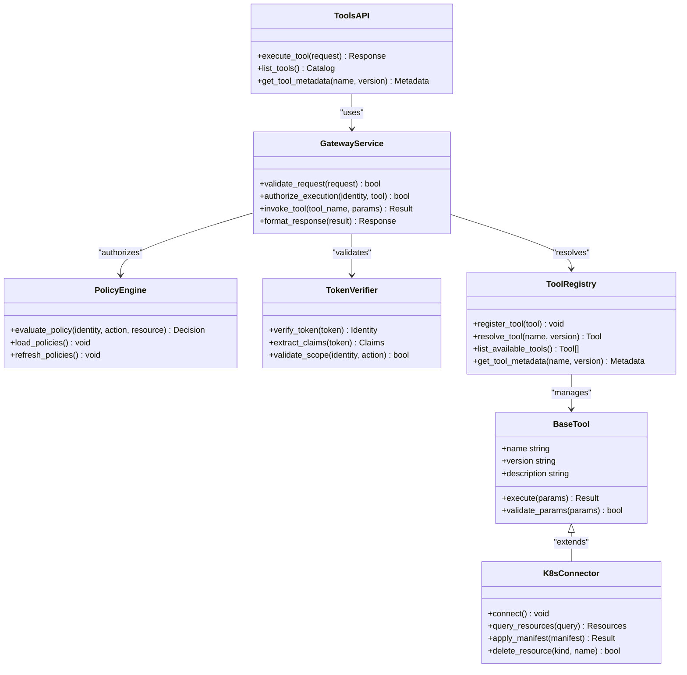

# Tool Execution API

<cite>
**Referenced Files in This Document**
- [tools.py](file://products/tool-gateway/src/api_gateway/api/routes/tools.py)
- [api.py](file://products/tool-gateway/src/api_gateway/schemas/api.py)
- [gateway_service.py](file://products/tool-gateway/src/api_gateway/services/gateway_service.py)
- [policy_engine.py](file://products/tool-gateway/src/api_gateway/services/policy_engine.py)
- [token_verifier.py](file://products/tool-gateway/src/api_gateway/services/token_verifier.py)
- [base.py](file://products/tool-gateway/src/api_gateway/tools/base.py)
- [registry.py](file://products/tool-gateway/src/api_gateway/tools/registry.py)
- [k8s_connector.py](file://products/tool-gateway/src/api_gateway/tools/k8s_connector.py)
- [SPEC-007-tool-execution-framework/spec.md](file://docs/specs/SPEC-007-tool-execution-framework/spec.md)
- [tool-invocation.schema.json](file://shared/shared-contracts/schemas/tool-invocation.schema.json)
- [tool-result.schema.json](file://shared/shared-contracts/schemas/tool-result.schema.json)
</cite>

## Table of Contents
1. [Introduction](#introduction)
2. [Project Structure](#project-structure)
3. [Core Components](#core-components)
4. [Architecture Overview](#architecture-overview)
5. [Detailed Component Analysis](#detailed-component-analysis)
6. [Dependency Analysis](#dependency-analysis)
7. [Performance Considerations](#performance-considerations)
8. [Troubleshooting Guide](#troubleshooting-guide)
9. [Conclusion](#conclusion)

## Introduction
This document provides detailed API documentation for tool execution endpoints, focusing on the POST /api/v1/tools/execute endpoint. It covers request/response schemas, parameter validation, error handling, invocation patterns, input sanitization, output formatting, and result processing. It also documents the tool discovery mechanism, available tools list, metadata retrieval, security considerations (input validation, rate limiting, access control), troubleshooting guidance, and performance optimization tips.

## Project Structure
The tool execution feature is implemented within the tool-gateway product. Key modules include:
- API routes that expose HTTP endpoints for tool execution and discovery
- Schemas that define request/response contracts
- Services that orchestrate policy checks, token verification, and gateway operations
- Tools registry and base abstractions for implementing concrete tools
- Shared JSON schemas defining tool invocation and result formats

**Diagram sources**
- [tools.py](file://products/tool-gateway/src/api_gateway/api/routes/tools.py)
- [api.py](file://products/tool-gateway/src/api_gateway/schemas/api.py)
- [policy_engine.py](file://products/tool-gateway/src/api_gateway/services/policy_engine.py)
- [token_verifier.py](file://products/tool-gateway/src/api_gateway/services/token_verifier.py)
- [gateway_service.py](file://products/tool-gateway/src/api_gateway/services/gateway_service.py)
- [registry.py](file://products/tool-gateway/src/api_gateway/tools/registry.py)
- [base.py](file://products/tool-gateway/src/api_gateway/tools/base.py)
- [k8s_connector.py](file://products/tool-gateway/src/api_gateway/tools/k8s_connector.py)
- [tool-invocation.schema.json](file://shared/shared-contracts/schemas/tool-invocation.schema.json)
- [tool-result.schema.json](file://shared/shared-contracts/schemas/tool-result.schema.json)

**Section sources**
- [tools.py](file://products/tool-gateway/src/api_gateway/api/routes/tools.py)
- [api.py](file://products/tool-gateway/src/api_gateway/schemas/api.py)
- [gateway_service.py](file://products/tool-gateway/src/api_gateway/services/gateway_service.py)
- [policy_engine.py](file://products/tool-gateway/src/api_gateway/services/policy_engine.py)
- [token_verifier.py](file://products/tool-gateway/src/api_gateway/services/token_verifier.py)
- [registry.py](file://products/tool-gateway/src/api_gateway/tools/registry.py)
- [base.py](file://products/tool-gateway/src/api_gateway/tools/base.py)
- [k8s_connector.py](file://products/tool-gateway/src/api_gateway/tools/k8s_connector.py)
- [tool-invocation.schema.json](file://shared/shared-contracts/schemas/tool-invocation.schema.json)
- [tool-result.schema.json](file://shared/shared-contracts/schemas/tool-result.schema.json)

## Core Components
- API Route: Exposes POST /api/v1/tools/execute and related endpoints for tool execution and discovery.
- Schemas: Define strict request/response structures for tool invocation and results.
- Policy Engine: Enforces policies to authorize or deny tool execution based on identity and context.
- Token Verifier: Validates authentication tokens and extracts identity context.
- Gateway Service: Orchestrates end-to-end execution flow including validation, authorization, invocation, and response formatting.
- Tool Registry: Manages available tools, metadata, and dynamic discovery.
- Base Tool Abstraction: Provides common interfaces and utilities for implementing tools.
- Kubernetes Connector: Integrates with Kubernetes resources when required by specific tools.

Key responsibilities:
- Input validation against shared schemas
- Policy-based authorization
- Secure token verification
- Tool resolution and invocation
- Standardized result formatting and error mapping

**Section sources**
- [tools.py](file://products/tool-gateway/src/api_gateway/api/routes/tools.py)
- [api.py](file://products/tool-gateway/src/api_gateway/schemas/api.py)
- [policy_engine.py](file://products/tool-gateway/src/api_gateway/services/policy_engine.py)
- [token_verifier.py](file://products/tool-gateway/src/api_gateway/services/token_verifier.py)
- [gateway_service.py](file://products/tool-gateway/src/api_gateway/services/gateway_service.py)
- [registry.py](file://products/tool-gateway/src/api_gateway/tools/registry.py)
- [base.py](file://products/tool-gateway/src/api_gateway/tools/base.py)
- [k8s_connector.py](file://products/tool-gateway/src/api_gateway/tools/k8s_connector.py)

## Architecture Overview
The tool execution pipeline follows a layered approach:
- HTTP layer validates requests using Pydantic models derived from shared schemas
- Authorization layer enforces policies via the policy engine
- Identity layer verifies tokens and builds context
- Orchestration layer invokes tools through the registry
- Execution layer runs tool implementations, potentially interacting with Kubernetes
- Response layer formats results and errors consistently

**Diagram sources**
- [tools.py](file://products/tool-gateway/src/api_gateway/api/routes/tools.py)
- [token_verifier.py](file://products/tool-gateway/src/api_gateway/services/token_verifier.py)
- [policy_engine.py](file://products/tool-gateway/src/api_gateway/services/policy_engine.py)
- [gateway_service.py](file://products/tool-gateway/src/api_gateway/services/gateway_service.py)
- [registry.py](file://products/tool-gateway/src/api_gateway/tools/registry.py)
- [base.py](file://products/tool-gateway/src/api_gateway/tools/base.py)
- [k8s_connector.py](file://products/tool-gateway/src/api_gateway/tools/k8s_connector.py)

## Detailed Component Analysis

### POST /api/v1/tools/execute Endpoint
- Purpose: Execute a registered tool with provided parameters.
- Request schema: Defined by the tool invocation schema; includes tool identification, versioning, and parameters.
- Response schema: Defined by the tool result schema; includes success/failure status, data payload, and error details.
- Parameter validation: Strict validation against shared schemas; rejects malformed or unsafe inputs early.
- Error handling: Maps internal exceptions to standardized HTTP codes and error bodies.

Invocation patterns:
- Direct tool invocation with minimal parameters
- Batched invocations where supported by tool implementation
- Asynchronous execution with polling or callbacks (if enabled by tool)

Input sanitization:
- Type coercion and normalization
- Length and format constraints enforced by schemas
- Dangerous characters and payloads filtered before reaching tool logic

Output formatting:
- Consistent envelope structure across all tools
- Success payloads wrapped with metadata and trace identifiers
- Error payloads include machine-readable codes and human-friendly messages

Result processing:
- Aggregation and transformation performed by gateway service
- Caching strategies for idempotent operations (when applicable)
- Streaming responses for long-running tools (if supported)

Security considerations:
- Input validation prevents injection and overflow attacks
- Rate limiting applied at API route level to mitigate abuse
- Access control enforced via policy engine decisions based on identity and resource permissions

**Section sources**
- [tools.py](file://products/tool-gateway/src/api_gateway/api/routes/tools.py)
- [api.py](file://products/tool-gateway/src/api_gateway/schemas/api.py)
- [tool-invocation.schema.json](file://shared/shared-contracts/schemas/tool-invocation.schema.json)
- [tool-result.schema.json](file://shared/shared-contracts/schemas/tool-result.schema.json)

### Tool Discovery Mechanism
- Available tools list: Retrieved via dedicated endpoint returning names, versions, and capabilities.
- Metadata retrieval: Includes descriptions, parameter schemas, and execution constraints.
- Dynamic registration: Tools can be added at runtime through the registry.
- Versioning support: Allows multiple versions of the same tool to coexist.

Discovery workflow:
- Client requests tool catalog
- Registry returns structured metadata
- Client selects appropriate tool and version for invocation

**Section sources**
- [registry.py](file://products/tool-gateway/src/api_gateway/tools/registry.py)
- [base.py](file://products/tool-gateway/src/api_gateway/tools/base.py)

### Security Considerations
- Input validation: All requests validated against strict schemas before processing
- Rate limiting: Configurable limits per client/IP to prevent abuse
- Access control: Policy engine evaluates permissions based on identity and requested actions
- Token verification: JWT/OIDC tokens validated and contextualized for authorization decisions
- Audit logging: All executions logged with sufficient detail for compliance and debugging

**Section sources**
- [policy_engine.py](file://products/tool-gateway/src/api_gateway/services/policy_engine.py)
- [token_verifier.py](file://products/tool-gateway/src/api_gateway/services/token_verifier.py)
- [tools.py](file://products/tool-gateway/src/api_gateway/api/routes/tools.py)

### Performance Optimization Tips
- Connection pooling for external dependencies like Kubernetes APIs
- Caching frequently accessed tool metadata and policies
- Async execution for I/O-bound operations
- Request batching where supported by tools
- Efficient serialization/deserialization using optimized libraries

[No sources needed since this section provides general guidance]

## Dependency Analysis
The tool execution system has clear dependency boundaries:
- API routes depend on schemas, services, and middleware
- Services coordinate between policy, auth, and tool execution layers
- Tools are abstracted through base classes and connectors
- External systems accessed through dedicated connectors

**Diagram sources**
- [tools.py](file://products/tool-gateway/src/api_gateway/api/routes/tools.py)
- [gateway_service.py](file://products/tool-gateway/src/api_gateway/services/gateway_service.py)
- [policy_engine.py](file://products/tool-gateway/src/api_gateway/services/policy_engine.py)
- [token_verifier.py](file://products/tool-gateway/src/api_gateway/services/token_verifier.py)
- [registry.py](file://products/tool-gateway/src/api_gateway/tools/registry.py)
- [base.py](file://products/tool-gateway/src/api_gateway/tools/base.py)
- [k8s_connector.py](file://products/tool-gateway/src/api_gateway/tools/k8s_connector.py)

**Section sources**
- [tools.py](file://products/tool-gateway/src/api_gateway/api/routes/tools.py)
- [gateway_service.py](file://products/tool-gateway/src/api_gateway/services/gateway_service.py)
- [policy_engine.py](file://products/tool-gateway/src/api_gateway/services/policy_engine.py)
- [token_verifier.py](file://products/tool-gateway/src/api_gateway/services/token_verifier.py)
- [registry.py](file://products/tool-gateway/src/api_gateway/tools/registry.py)
- [base.py](file://products/tool-gateway/src/api_gateway/tools/base.py)
- [k8s_connector.py](file://products/tool-gateway/src/api_gateway/tools/k8s_connector.py)

## Performance Considerations
- Minimize latency by validating inputs early and failing fast
- Use connection pooling for database and Kubernetes API calls
- Implement caching for static tool metadata and frequently accessed policies
- Employ asynchronous processing for long-running tool executions
- Monitor and optimize serialization overhead for large payloads
- Scale horizontally behind load balancers for high-throughput scenarios

[No sources needed since this section provides general guidance]

## Troubleshooting Guide
Common execution failures and resolutions:
- Invalid request schema: Verify payload structure against tool invocation schema
- Authentication failures: Check token validity and expiration
- Authorization denied: Review policy configuration and user permissions
- Tool not found: Ensure tool is registered and accessible by name/version
- Internal server errors: Inspect logs for stack traces and underlying causes
- Timeout errors: Adjust timeout configurations or optimize tool performance

Debugging steps:
- Enable detailed logging for API requests and tool executions
- Validate tokens using identity broker endpoints
- Test tool invocations directly against tool implementations
- Monitor policy engine decisions and audit logs
- Check Kubernetes connectivity and resource availability

**Section sources**
- [tools.py](file://products/tool-gateway/src/api_gateway/api/routes/tools.py)
- [gateway_service.py](file://products/tool-gateway/src/api_gateway/services/gateway_service.py)
- [policy_engine.py](file://products/tool-gateway/src/api_gateway/services/policy_engine.py)
- [token_verifier.py](file://products/tool-gateway/src/api_gateway/services/token_verifier.py)

## Conclusion
The tool execution API provides a secure, scalable, and well-structured interface for executing tools within the platform. Through strict input validation, comprehensive authorization, and standardized response formatting, it ensures reliable operation while maintaining security and performance. The modular architecture allows for easy extension and maintenance of new tools while preserving consistency across the ecosystem.

[No sources needed since this section summarizes without analyzing specific files]