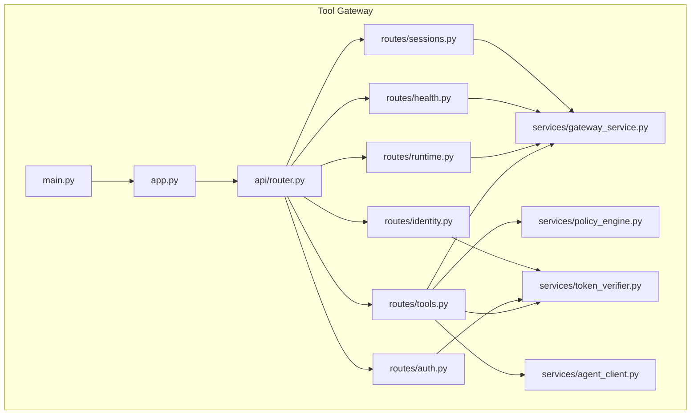
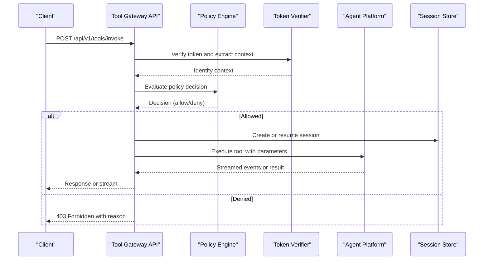
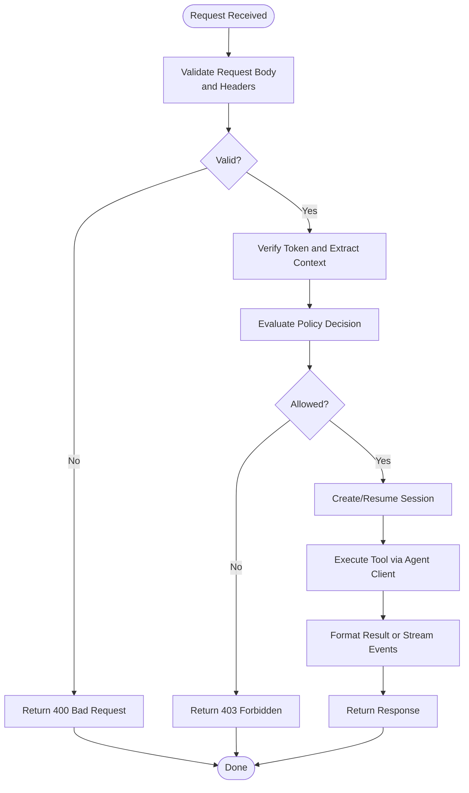
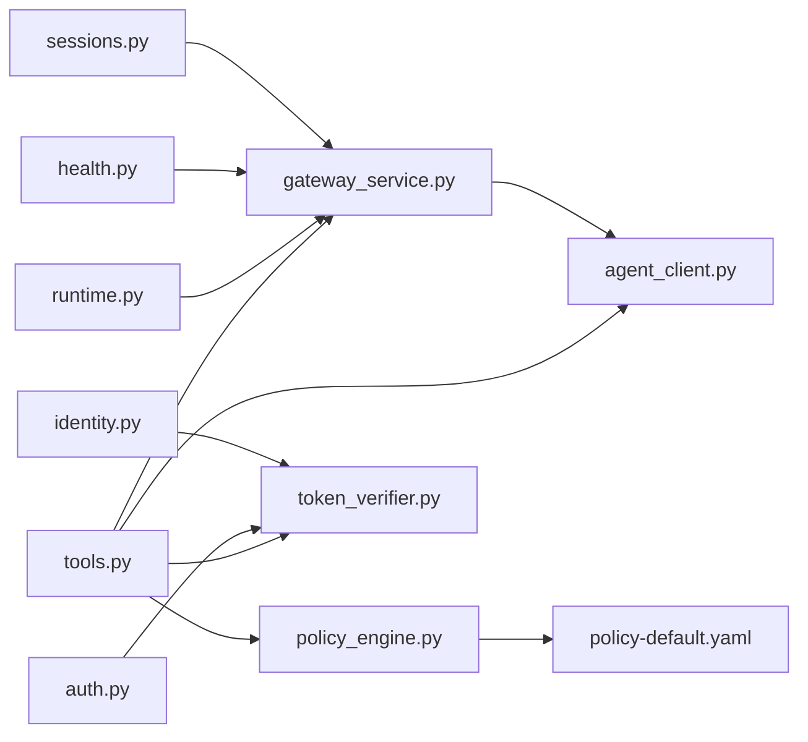

# Tool Gateway API

<cite>
**Referenced Files in This Document**
- [main.py](file://products/tool-gateway/src/api_gateway/main.py)
- [app.py](file://products/tool-gateway/src/api_gateway/app.py)
- [router.py](file://products/tool-gateway/src/api_gateway/api/router.py)
- [tools.py](file://products/tool-gateway/src/api_gateway/api/routes/tools.py)
- [runtime.py](file://products/tool-gateway/src/api_gateway/api/routes/runtime.py)
- [health.py](file://products/tool-gateway/src/api_gateway/api/routes/health.py)
- [auth.py](file://products/tool-gateway/src/api_gateway/api/routes/auth.py)
- [identity.py](file://products/tool-gateway/src/api_gateway/api/routes/identity.py)
- [sessions.py](file://products/tool-gateway/src/api_gateway/api/routes/sessions.py)
- [gateway_service.py](file://products/tool-gateway/src/api_gateway/services/gateway_service.py)
- [policy_engine.py](file://products/tool-gateway/src/api_gateway/services/policy_engine.py)
- [token_verifier.py](file://products/tool-gateway/src/api_gateway/services/token_verifier.py)
- [agent_client.py](file://products/tool-gateway/src/api_gateway/services/agent_client.py)
- [api.py](file://products/tool-gateway/src/api_gateway/schemas/api.py)
- [tool-invocation.schema.json](file://shared/shared-contracts/schemas/tool-invocation.schema.json)
- [tool-result.schema.json](file://shared/shared-contracts/schemas/tool-result.schema.json)
- [policy-decision.schema.json](file://shared/shared-contracts/schemas/policy-decision.schema.json)
- [policy-rule.schema.json](file://shared/shared-contracts/schemas/policy-rule.schema.json)
- [chat-request.schema.json](file://shared/shared-contracts/schemas/chat-request.schema.json)
- [chat-response.schema.json](file://shared/shared-contracts/schemas/chat-response.schema.json)
- [stream-event.schema.json](file://shared/shared-contracts/schemas/stream-event.schema.json)
- [identity-token.schema.json](file://shared/shared-contracts/schemas/identity-token.schema.json)
- [identity-context.schema.json](file://shared/shared-contracts/schemas/identity-context.schema.json)
- [policy-default.yaml](file://products/tool-gateway/src/api_gateway/policies/policy-default.yaml)
</cite>

## Table of Contents
1. [Introduction](#introduction)
2. [Project Structure](#project-structure)
3. [Core Components](#core-components)
4. [Architecture Overview](#architecture-overview)
5. [Detailed Component Analysis](#detailed-component-analysis)
6. [Dependency Analysis](#dependency-analysis)
7. [Performance Considerations](#performance-considerations)
8. [Troubleshooting Guide](#troubleshooting-guide)
9. [Conclusion](#conclusion)
10. [Appendices](#appendices)

## Introduction
This document provides comprehensive API documentation for the Tool Gateway service, focusing on tool invocation APIs, runtime management, policy enforcement endpoints, and health check interfaces. It covers HTTP methods, URL patterns, request/response schemas, parameter validation, and result handling. It also details policy evaluation requests, rate limiting configurations, access control mechanisms, examples of tool discovery and execution workflows, error handling, monitoring integration, security considerations, input sanitization, and performance optimization techniques.

## Project Structure
The Tool Gateway is implemented as a Python FastAPI application with modular routing, services, schemas, and policies. Key directories include:
- api/routes: HTTP endpoint handlers
- services: Business logic (gateway orchestration, policy engine, token verification, agent client)
- schemas: Pydantic models and shared JSON schemas
- policies: Policy definitions and defaults
- core: Configuration, observability, metrics, telemetry, and runtime helpers

**Diagram sources**
- [main.py](file://products/tool-gateway/src/api_gateway/main.py)
- [app.py](file://products/tool-gateway/src/api_gateway/app.py)
- [router.py](file://products/tool-gateway/src/api_gateway/api/router.py)
- [tools.py](file://products/tool-gateway/src/api_gateway/api/routes/tools.py)
- [runtime.py](file://products/tool-gateway/src/api_gateway/api/routes/runtime.py)
- [health.py](file://products/tool-gateway/src/api_gateway/api/routes/health.py)
- [auth.py](file://products/tool-gateway/src/api_gateway/api/routes/auth.py)
- [identity.py](file://products/tool-gateway/src/api_gateway/api/routes/identity.py)
- [sessions.py](file://products/tool-gateway/src/api_gateway/api/routes/sessions.py)
- [gateway_service.py](file://products/tool-gateway/src/api_gateway/services/gateway_service.py)
- [policy_engine.py](file://products/tool-gateway/src/api_gateway/services/policy_engine.py)
- [token_verifier.py](file://products/tool-gateway/src/api_gateway/services/token_verifier.py)
- [agent_client.py](file://products/tool-gateway/src/api_gateway/services/agent_client.py)

**Section sources**
- [main.py](file://products/tool-gateway/src/api_gateway/main.py)
- [app.py](file://products/tool-gateway/src/api_gateway/app.py)
- [router.py](file://products/tool-gateway/src/api_gateway/api/router.py)

## Core Components
- API Router: Centralizes route registration and middleware setup.
- Tools Routes: Expose tool discovery and execution endpoints.
- Runtime Routes: Manage runtime lifecycle and configuration.
- Health Route: Provides readiness/liveness checks.
- Auth and Identity Routes: Handle authentication and identity context propagation.
- Sessions Routes: Manage session state for long-running operations.
- Services:
  - Gateway Service: Orchestrates tool execution, policy checks, and agent calls.
  - Policy Engine: Evaluates policies and enforces rules.
  - Token Verifier: Validates tokens and extracts identity context.
  - Agent Client: Communicates with downstream agent platform.

**Section sources**
- [router.py](file://products/tool-gateway/src/api_gateway/api/router.py)
- [tools.py](file://products/tool-gateway/src/api_gateway/api/routes/tools.py)
- [runtime.py](file://products/tool-gateway/src/api_gateway/api/routes/runtime.py)
- [health.py](file://products/tool-gateway/src/api_gateway/api/routes/health.py)
- [auth.py](file://products/tool-gateway/src/api_gateway/api/routes/auth.py)
- [identity.py](file://products/tool-gateway/src/api_gateway/api/routes/identity.py)
- [sessions.py](file://products/tool-gateway/src/api_gateway/api/routes/sessions.py)
- [gateway_service.py](file://products/tool-gateway/src/api_gateway/services/gateway_service.py)
- [policy_engine.py](file://products/tool-gateway/src/api_gateway/services/policy_engine.py)
- [token_verifier.py](file://products/tool-gateway/src/api_gateway/services/token_verifier.py)
- [agent_client.py](file://products/tool-gateway/src/api_gateway/services/agent_client.py)

## Architecture Overview
The Tool Gateway exposes REST endpoints that validate requests, enforce policies, and delegate tool execution to the agent platform. Authentication and identity are handled via token verification and identity context propagation. Observability and metrics are integrated throughout.

**Diagram sources**
- [tools.py](file://products/tool-gateway/src/api_gateway/api/routes/tools.py)
- [gateway_service.py](file://products/tool-gateway/src/api_gateway/services/gateway_service.py)
- [policy_engine.py](file://products/tool-gateway/src/api_gateway/services/policy_engine.py)
- [token_verifier.py](file://products/tool-gateway/src/api_gateway/services/token_verifier.py)
- [agent_client.py](file://products/tool-gateway/src/api_gateway/services/agent_client.py)

## Detailed Component Analysis

### Tool Invocation API
- Endpoint: POST /api/v1/tools/invoke
- Purpose: Invoke a registered tool with validated parameters and execute it through the gateway.
- Request Schema: Uses the shared tool invocation schema.
- Response Schema: Uses the shared tool result schema; may stream events for long-running tasks.
- Parameter Validation: Enforced by Pydantic models and shared JSON schemas.
- Error Handling: Returns standardized error responses with codes and messages.

**Diagram sources**
- [tools.py](file://products/tool-gateway/src/api_gateway/api/routes/tools.py)
- [gateway_service.py](file://products/tool-gateway/src/api_gateway/services/gateway_service.py)
- [policy_engine.py](file://products/tool-gateway/src/api_gateway/services/policy_engine.py)
- [token_verifier.py](file://products/tool-gateway/src/api_gateway/services/token_verifier.py)
- [agent_client.py](file://products/tool-gateway/src/api_gateway/services/agent_client.py)

**Section sources**
- [tools.py](file://products/tool-gateway/src/api_gateway/api/routes/tools.py)
- [api.py](file://products/tool-gateway/src/api_gateway/schemas/api.py)
- [tool-invocation.schema.json](file://shared/shared-contracts/schemas/tool-invocation.schema.json)
- [tool-result.schema.json](file://shared/shared-contracts/schemas/tool-result.schema.json)

### Runtime Management API
- Endpoints:
  - GET /api/v1/runtime/status: Retrieve runtime status and metadata.
  - PUT /api/v1/runtime/config: Update runtime configuration (requires admin privileges).
  - POST /api/v1/runtime/restart: Trigger a controlled restart.
- Behavior: Validates configuration updates, persists changes, and notifies dependent services.
- Security: Admin-only endpoints protected by role-based access control.

**Section sources**
- [runtime.py](file://products/tool-gateway/src/api_gateway/api/routes/runtime.py)
- [api.py](file://products/tool-gateway/src/api_gateway/schemas/api.py)

### Health Check Interface
- Endpoints:
  - GET /healthz: Liveness probe.
  - GET /readyz: Readiness probe.
- Responses: Standardized health response schema indicating service state.

**Section sources**
- [health.py](file://products/tool-gateway/src/api_gateway/api/routes/health.py)
- [api.py](file://products/tool-gateway/src/api_gateway/schemas/api.py)

### Authentication and Identity
- Endpoints:
  - POST /api/v1/auth/token: Exchange credentials for an access token.
  - GET /api/v1/identity/context: Resolve current identity context from token.
- Mechanisms: Token verification, JWT validation, and identity context propagation across requests.

**Section sources**
- [auth.py](file://products/tool-gateway/src/api_gateway/api/routes/auth.py)
- [identity.py](file://products/tool-gateway/src/api_gateway/api/routes/identity.py)
- [token_verifier.py](file://products/tool-gateway/src/api_gateway/services/token_verifier.py)
- [identity-token.schema.json](file://shared/shared-contracts/schemas/identity-token.schema.json)
- [identity-context.schema.json](file://shared/shared-contracts/schemas/identity-context.schema.json)

### Sessions API
- Endpoints:
  - POST /api/v1/sessions: Create a new session.
  - GET /api/v1/sessions/{id}: Retrieve session details.
  - DELETE /api/v1/sessions/{id}: Terminate a session.
- Behavior: Manages session lifecycle and state persistence for long-running tool executions.

**Section sources**
- [sessions.py](file://products/tool-gateway/src/api_gateway/api/routes/sessions.py)
- [api.py](file://products/tool-gateway/src/api_gateway/schemas/api.py)

### Policy Enforcement Endpoints
- Endpoints:
  - POST /api/v1/policies/evaluate: Submit a policy evaluation request.
  - GET /api/v1/policies/rules: List available policy rules.
- Request/Response Schemas: Use shared policy decision and rule schemas.
- Behavior: Evaluates policies based on identity context, resource attributes, and action types.

**Section sources**
- [policy_engine.py](file://products/tool-gateway/src/api_gateway/services/policy_engine.py)
- [policy-decision.schema.json](file://shared/shared-contracts/schemas/policy-decision.schema.json)
- [policy-rule.schema.json](file://shared/shared-contracts/schemas/policy-rule.schema.json)
- [policy-default.yaml](file://products/tool-gateway/src/api_gateway/policies/policy-default.yaml)

## Dependency Analysis
The Tool Gateway depends on several internal services and shared contracts:
- API routes depend on services for business logic.
- Services depend on shared schemas for validation and interoperability.
- Policies are loaded from YAML files and evaluated at runtime.
- Observability and metrics are integrated into core modules.

**Diagram sources**
- [tools.py](file://products/tool-gateway/src/api_gateway/api/routes/tools.py)
- [runtime.py](file://products/tool-gateway/src/api_gateway/api/routes/runtime.py)
- [health.py](file://products/tool-gateway/src/api_gateway/api/routes/health.py)
- [auth.py](file://products/tool-gateway/src/api_gateway/api/routes/auth.py)
- [identity.py](file://products/tool-gateway/src/api_gateway/api/routes/identity.py)
- [sessions.py](file://products/tool-gateway/src/api_gateway/api/routes/sessions.py)
- [gateway_service.py](file://products/tool-gateway/src/api_gateway/services/gateway_service.py)
- [policy_engine.py](file://products/tool-gateway/src/api_gateway/services/policy_engine.py)
- [token_verifier.py](file://products/tool-gateway/src/api_gateway/services/token_verifier.py)
- [agent_client.py](file://products/tool-gateway/src/api_gateway/services/agent_client.py)
- [policy-default.yaml](file://products/tool-gateway/src/api_gateway/policies/policy-default.yaml)

**Section sources**
- [router.py](file://products/tool-gateway/src/api_gateway/api/router.py)
- [api.py](file://products/tool-gateway/src/api_gateway/schemas/api.py)

## Performance Considerations
- Streaming Responses: Use server-sent events or chunked transfers for long-running tool executions to reduce latency and memory usage.
- Connection Pooling: Configure efficient connection pools for agent client and external dependencies.
- Rate Limiting: Apply per-client and per-tool rate limits using middleware or upstream gateways.
- Caching: Cache frequently accessed policy rules and tool metadata where appropriate.
- Metrics and Tracing: Instrument key operations with metrics and distributed tracing to identify bottlenecks.

[No sources needed since this section provides general guidance]

## Troubleshooting Guide
Common issues and resolutions:
- 400 Bad Request: Invalid request body or missing required fields. Validate against shared schemas.
- 401 Unauthorized: Missing or invalid token. Ensure proper authorization headers.
- 403 Forbidden: Policy denied the request. Review policy rules and identity context.
- 500 Internal Server Error: Unexpected errors in tool execution or agent communication. Check logs and traces.
- Health Checks: Use /healthz and /readyz to verify service state during deployment and scaling.

**Section sources**
- [health.py](file://products/tool-gateway/src/api_gateway/api/routes/health.py)
- [tools.py](file://products/tool-gateway/src/api_gateway/api/routes/tools.py)
- [policy_engine.py](file://products/tool-gateway/src/api_gateway/services/policy_engine.py)
- [token_verifier.py](file://products/tool-gateway/src/api_gateway/services/token_verifier.py)

## Conclusion
The Tool Gateway provides a robust, secure, and observable interface for tool invocation, runtime management, and policy enforcement. By leveraging shared schemas, centralized policy evaluation, and strong authentication mechanisms, it ensures consistent and safe execution of tools across the platform. Monitoring and performance optimizations further enhance reliability and scalability.

[No sources needed since this section summarizes without analyzing specific files]

## Appendices

### API Reference Summary
- Tool Invocation: POST /api/v1/tools/invoke
- Runtime Status: GET /api/v1/runtime/status
- Runtime Config: PUT /api/v1/runtime/config
- Runtime Restart: POST /api/v1/runtime/restart
- Health Liveness: GET /healthz
- Health Readiness: GET /readyz
- Auth Token: POST /api/v1/auth/token
- Identity Context: GET /api/v1/identity/context
- Sessions: POST /api/v1/sessions, GET /api/v1/sessions/{id}, DELETE /api/v1/sessions/{id}
- Policy Evaluation: POST /api/v1/policies/evaluate
- Policy Rules: GET /api/v1/policies/rules

**Section sources**
- [tools.py](file://products/tool-gateway/src/api_gateway/api/routes/tools.py)
- [runtime.py](file://products/tool-gateway/src/api_gateway/api/routes/runtime.py)
- [health.py](file://products/tool-gateway/src/api_gateway/api/routes/health.py)
- [auth.py](file://products/tool-gateway/src/api_gateway/api/routes/auth.py)
- [identity.py](file://products/tool-gateway/src/api_gateway/api/routes/identity.py)
- [sessions.py](file://products/tool-gateway/src/api_gateway/api/routes/sessions.py)
- [policy_engine.py](file://products/tool-gateway/src/api_gateway/services/policy_engine.py)

### Security Considerations
- Input Sanitization: Enforce strict schema validation to prevent injection attacks.
- Access Control: Use RBAC and policy evaluation to restrict sensitive operations.
- Token Validation: Verify signatures and expiration times for all tokens.
- Secrets Management: Store secrets securely and avoid logging sensitive data.

**Section sources**
- [token_verifier.py](file://products/tool-gateway/src/api_gateway/services/token_verifier.py)
- [policy-engine.py](file://products/tool-gateway/src/api_gateway/services/policy_engine.py)
- [api.py](file://products/tool-gateway/src/api_gateway/schemas/api.py)

### Monitoring Integration
- Metrics: Expose Prometheus-compatible metrics for request rates, latencies, and error counts.
- Tracing: Integrate distributed tracing to correlate requests across services.
- Logging: Structured logging with correlation IDs for end-to-end visibility.

**Section sources**
- [app.py](file://products/tool-gateway/src/api_gateway/app.py)
- [router.py](file://products/tool-gateway/src/api_gateway/api/router.py)