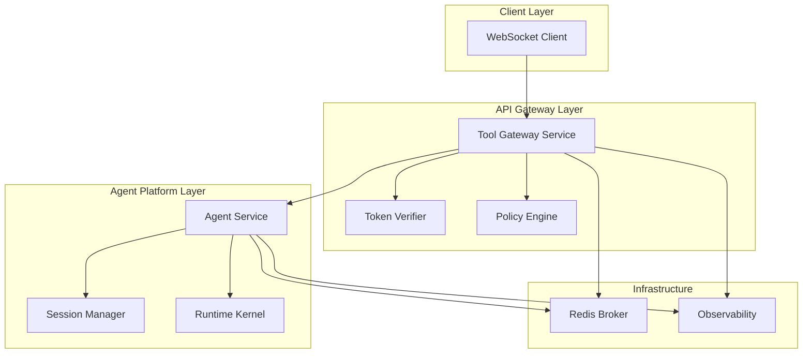
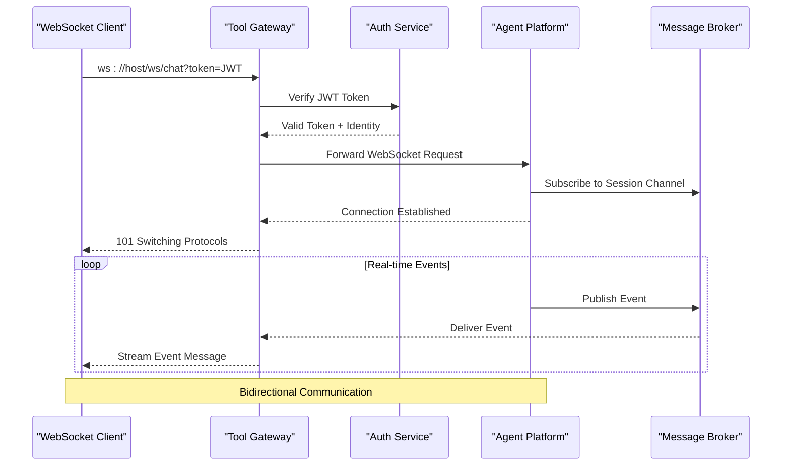
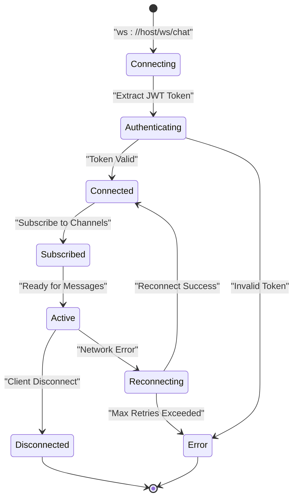
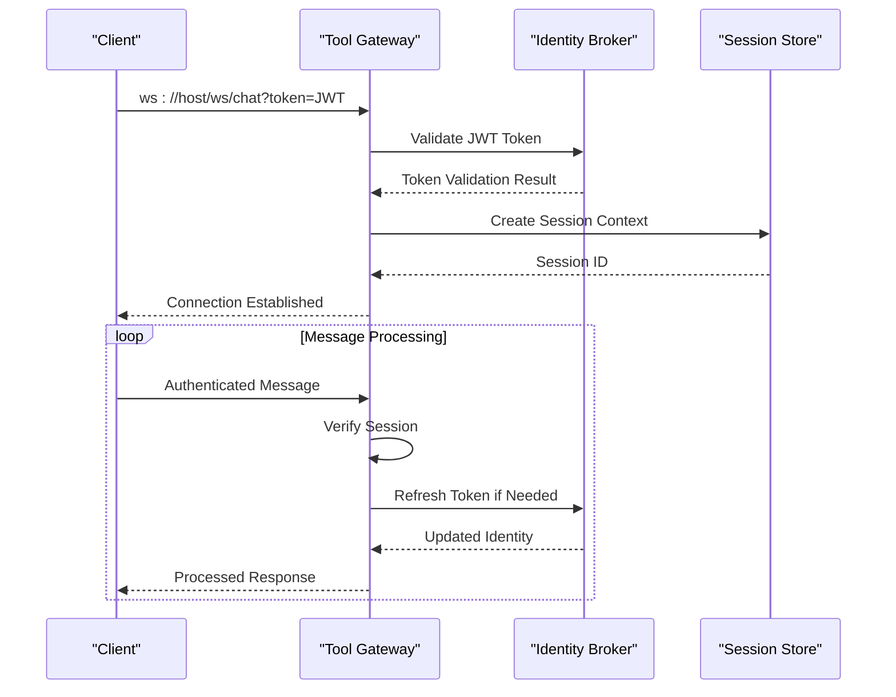
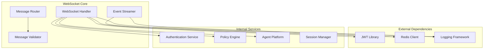

# WebSocket API

<cite>
**Referenced Files in This Document**
- [stream-event.schema.json](file://shared/shared-contracts/schemas/stream-event.schema.json)
- [agent-stream-event.schema.json](file://shared/shared-contracts/schemas/agent-stream-event.schema.json)
- [routes.py](file://products/tool-gateway/src/api_gateway/api/routes/chat.py)
- [routes.py](file://products/agent-platform/src/agent_service/api/v2/routes.py)
- [api.py](file://products/tool-gateway/src/api_gateway/schemas/api.py)
- [v2.py](file://products/agent-platform/src/agent_service/schemas/v2.py)
- [gateway_service.py](file://products/tool-gateway/src/api_gateway/services/gateway_service.py)
- [session_service.py](file://products/agent-platform/src/agent_service/services/session_service.py)
- [token_verifier.py](file://products/tool-gateway/src/api_gateway/services/token_verifier.py)
</cite>

## Table of Contents
1. [Introduction](#introduction)
2. [Project Structure](#project-structure)
3. [Core Components](#core-components)
4. [Architecture Overview](#architecture-overview)
5. [Detailed Component Analysis](#detailed-component-analysis)
6. [Dependency Analysis](#dependency-analysis)
7. [Performance Considerations](#performance-considerations)
8. [Troubleshooting Guide](#troubleshooting-guide)
9. [Conclusion](#conclusion)
10. [Appendices](#appendices)

## Introduction

The WebSocket API provides real-time communication channels for the AI Ops platform, enabling live streaming of agent responses, tool execution progress, and system notifications. This documentation covers connection establishment, authentication via WebSocket handshake, message formats, event types, and connection lifecycle management.

The WebSocket implementation follows a broker-mediated architecture where clients connect to the Tool Gateway service, which authenticates requests and forwards them to the Agent Platform service for processing. Real-time events flow back through the same channel, providing immediate feedback on agent operations and tool executions.

## Project Structure

The WebSocket functionality is distributed across multiple services:



**Diagram sources**
- [gateway_service.py](file://products/tool-gateway/src/api_gateway/services/gateway_service.py)
- [session_service.py](file://products/agent-platform/src/agent_service/services/session_service.py)
- [token_verifier.py](file://products/tool-gateway/src/api_gateway/services/token_verifier.py)

**Section sources**
- [routes.py](file://products/tool-gateway/src/api_gateway/api/routes/chat.py)
- [routes.py](file://products/agent-platform/src/agent_service/api/v2/routes.py)

## Core Components

### WebSocket Connection Handler
The WebSocket endpoint handles connection establishment, authentication verification, and message routing between clients and backend services.

### Authentication Middleware
Validates JWT tokens during WebSocket handshake and establishes client identity context for subsequent messages.

### Event Stream Manager
Manages real-time event streams, ensuring proper message ordering and delivery guarantees.

### Session Management
Maintains WebSocket session state and coordinates with the agent runtime for long-running operations.

**Section sources**
- [api.py](file://products/tool-gateway/src/api_gateway/schemas/api.py)
- [v2.py](file://products/agent-platform/src/agent_service/schemas/v2.py)

## Architecture Overview

The WebSocket architecture follows a layered approach with clear separation of concerns:



**Diagram sources**
- [routes.py](file://products/tool-gateway/src/api_gateway/api/routes/chat.py)
- [gateway_service.py](file://products/tool-gateway/src/api_gateway/services/gateway_service.py)

## Detailed Component Analysis

### WebSocket Connection Lifecycle

The WebSocket connection follows a well-defined lifecycle with proper error handling and cleanup:



**Diagram sources**
- [routes.py](file://products/tool-gateway/src/api_gateway/api/routes/chat.py)
- [gateway_service.py](file://products/tool-gateway/src/api_gateway/services/gateway_service.py)

### Message Format Specification

All WebSocket messages follow a standardized JSON schema:

#### Connection Establishment
```json
{
  "type": "connection",
  "action": "establish",
  "metadata": {
    "client_id": "unique-client-identifier",
    "version": "1.0.0",
    "capabilities": ["streaming", "batching"]
  }
}
```

#### Chat Request
```json
{
  "type": "chat_request",
  "session_id": "session-uuid",
  "message": {
    "content": "User query or command",
    "context": {
      "user_id": "authenticated-user-id",
      "workspace": "active-workspace"
    }
  },
  "options": {
    "stream": true,
    "timeout": 300,
    "max_tokens": 1000
  }
}
```

#### Stream Events
Stream events provide real-time updates during agent processing:

```json
{
  "type": "stream_event",
  "event_id": "event-uuid",
  "session_id": "session-uuid",
  "timestamp": "2024-01-01T00:00:00Z",
  "data": {
    "stage": "processing",
    "progress": 0.5,
    "message": "Processing request...",
    "metadata": {
      "tool_calls": [],
      "agent_steps": []
    }
  }
}
```

**Section sources**
- [stream-event.schema.json](file://shared/shared-contracts/schemas/stream-event.schema.json)
- [agent-stream-event.schema.json](file://shared/shared-contracts/schemas/agent-stream-event.schema.json)

### Event Types and Schemas

#### Agent Response Events
Agent response events contain the final processed output from the AI agent:

| Field | Type | Description | Required |
|-------|------|-------------|----------|
| type | string | Always "agent_response" | Yes |
| session_id | string | Unique session identifier | Yes |
| content | object | Agent's response data | Yes |
| metadata | object | Additional processing info | No |
| timestamp | string | ISO 8601 timestamp | Yes |

#### Tool Execution Events
Tool execution events provide progress updates for external tool calls:

| Field | Type | Description | Required |
|-------|------|-------------|----------|
| type | string | Always "tool_execution" | Yes |
| tool_name | string | Name of executed tool | Yes |
| status | enum | "started", "running", "completed", "failed" | Yes |
| progress | number | Progress percentage (0-100) | No |
| result | object | Tool execution result | No |

#### System Notification Events
System notifications convey platform-level information:

| Field | Type | Description | Required |
|-------|------|-------------|----------|
| type | string | Always "system_notification" | Yes |
| level | enum | "info", "warning", "error" | Yes |
| message | string | Human-readable notification | Yes |
| code | string | Machine-readable error code | No |

**Section sources**
- [stream-event.schema.json](file://shared/shared-contracts/schemas/stream-event.schema.json)
- [agent-stream-event.schema.json](file://shared/shared-contracts/schemas/agent-stream-event.schema.json)

### Authentication Flow

The WebSocket authentication process ensures secure connections:



**Diagram sources**
- [token_verifier.py](file://products/tool-gateway/src/api_gateway/services/token_verifier.py)
- [session_service.py](file://products/agent-platform/src/agent_service/services/session_service.py)

## Dependency Analysis

The WebSocket system has clear dependency relationships:



**Diagram sources**
- [gateway_service.py](file://products/tool-gateway/src/api_gateway/services/gateway_service.py)
- [session_service.py](file://products/agent-platform/src/agent_service/services/session_service.py)

**Section sources**
- [gateway_service.py](file://products/tool-gateway/src/api_gateway/services/gateway_service.py)
- [session_service.py](file://products/agent-platform/src/agent_service/services/session_service.py)

## Performance Considerations

### Connection Pooling
- Implement connection pooling for Redis and external services
- Use async I/O for non-blocking operations
- Configure appropriate timeout values for network operations

### Message Batching
- Support message batching for high-throughput scenarios
- Implement backpressure mechanisms to prevent memory overflow
- Use compression for large payloads when possible

### Memory Management
- Implement proper cleanup for disconnected clients
- Use streaming for large responses instead of buffering
- Monitor memory usage and set appropriate limits

### Scaling Considerations
- Horizontal scaling with stateless WebSocket handlers
- Use Redis pub/sub for cross-instance message broadcasting
- Implement load balancing for WebSocket connections

## Troubleshooting Guide

### Common Connection Issues

#### Authentication Failures
- Verify JWT token format and expiration
- Check token signing keys and algorithms
- Ensure proper scope permissions are granted

#### Connection Drops
- Implement heartbeat/ping-pong mechanism
- Configure appropriate timeout values
- Monitor network connectivity and retry logic

#### Message Delivery Issues
- Check Redis connectivity and performance
- Verify message queue capacity and consumer lag
- Monitor for dead letter queues and failed message handling

### Debugging Techniques

#### Log Analysis
- Enable detailed logging for WebSocket connections
- Track message flow with correlation IDs
- Monitor error rates and latency metrics

#### Network Inspection
- Use browser developer tools for frontend debugging
- Employ network sniffing tools for protocol analysis
- Monitor WebSocket frame sizes and frequencies

#### Performance Profiling
- Profile memory usage during long sessions
- Monitor CPU utilization under load
- Track database query performance

**Section sources**
- [token_verifier.py](file://products/tool-gateway/src/api_gateway/services/token_verifier.py)
- [session_service.py](file://products/agent-platform/src/agent_service/services/session_service.py)

## Conclusion

The WebSocket API provides a robust foundation for real-time communication in the AI Ops platform. The implementation follows best practices for security, performance, and reliability while maintaining clear separation of concerns across services. The standardized message formats and event schemas ensure consistency across different client implementations and facilitate easy integration.

Key strengths include:
- Secure authentication via JWT tokens
- Scalable architecture with Redis-backed messaging
- Comprehensive error handling and reconnection strategies
- Rich event types supporting various use cases

Future enhancements could include:
- GraphQL subscriptions for more flexible querying
- Message encryption for sensitive data
- Advanced rate limiting and quota management
- Enhanced monitoring and observability features

## Appendices

### Client Implementation Examples

#### JavaScript WebSocket Client
```javascript
// Connection establishment
const ws = new WebSocket('wss://api.example.com/ws/chat?token=' + jwtToken);

// Connection handlers
ws.onopen = () => console.log('Connected');
ws.onmessage = (event) => handleWebSocketMessage(JSON.parse(event.data));
ws.onerror = (error) => console.error('WebSocket error:', error);
ws.onclose = () => console.log('Disconnected');

// Message handling
function handleWebSocketMessage(message) {
  switch (message.type) {
    case 'stream_event':
      updateProgress(message.data.progress);
      break;
    case 'agent_response':
      displayResponse(message.data.content);
      break;
    case 'error':
      handleError(message.data.message);
      break;
  }
}
```

#### Python WebSocket Client
```python
import asyncio
import websockets
import json

async def websocket_client():
    uri = "wss://api.example.com/ws/chat?token=" + jwt_token
    async with websockets.connect(uri) as websocket:
        # Send initial message
        await websocket.send(json.dumps({
            "type": "chat_request",
            "message": {"content": "Hello, world!"}
        }))
        
        # Receive messages
        async for message in websocket:
            data = json.loads(message)
            if data["type"] == "stream_event":
                print(f"Progress: {data['data']['progress']}")
            elif data["type"] == "agent_response":
                print(f"Response: {data['data']['content']}")
```

### Security Best Practices

#### Connection Security
- Always use WSS (WebSocket Secure) for encrypted connections
- Implement proper CORS configuration
- Validate all incoming messages against schemas
- Sanitize user input before processing

#### Authentication and Authorization
- Use short-lived JWT tokens with refresh mechanisms
- Implement proper role-based access control
- Monitor for suspicious activity and implement rate limiting
- Regularly rotate signing keys and certificates

#### Data Protection
- Encrypt sensitive data in transit and at rest
- Implement proper logging without exposing sensitive information
- Use parameterized queries to prevent injection attacks
- Validate and sanitize all user inputs

[No sources needed since this section provides general guidance]