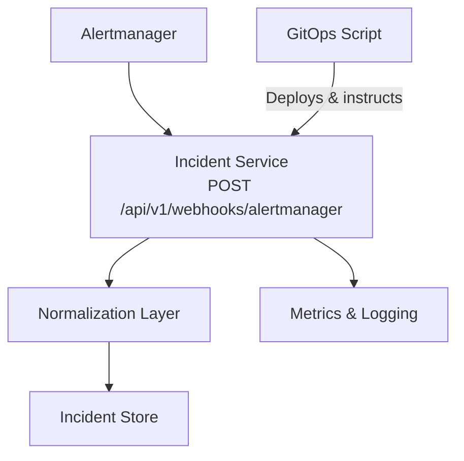
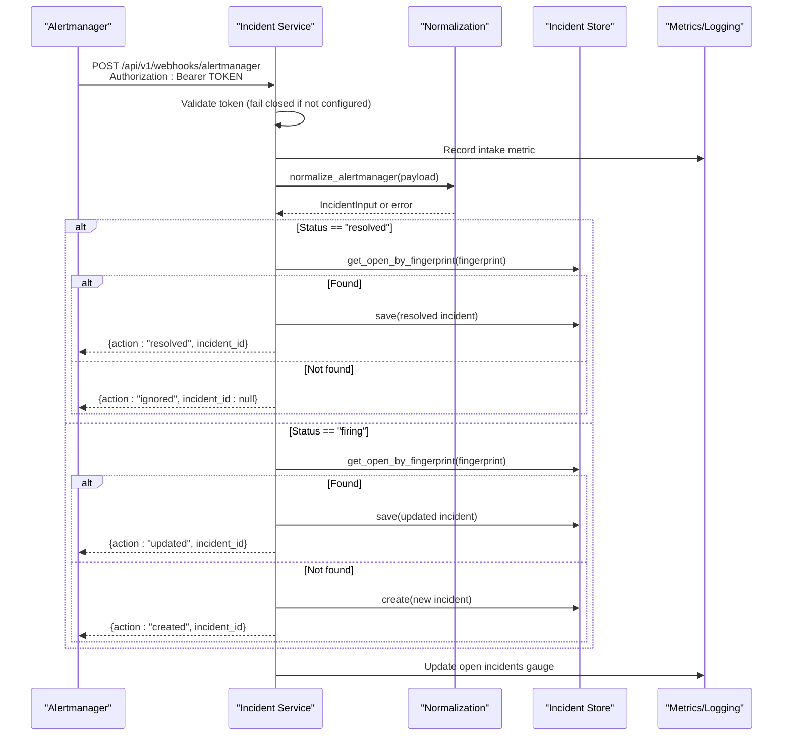
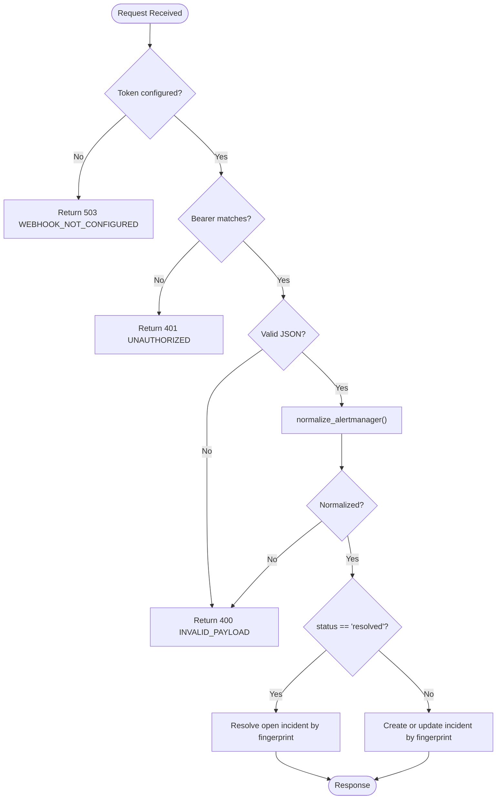
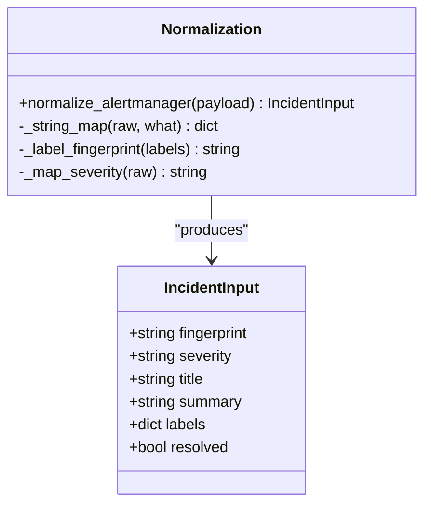
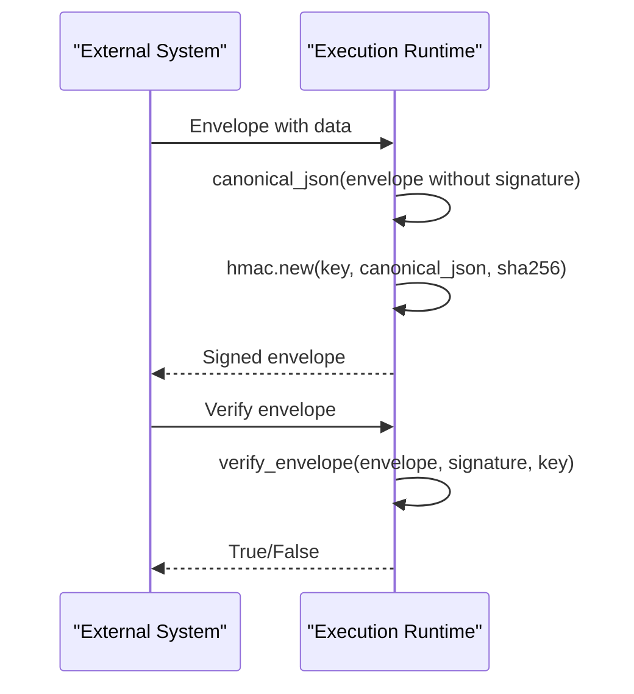
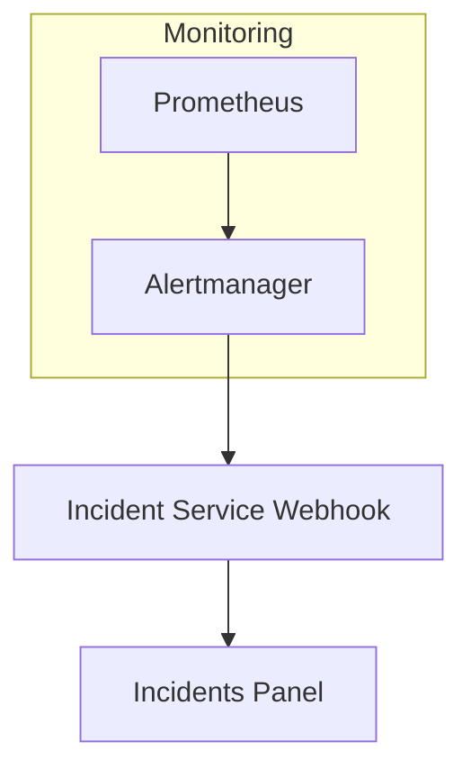
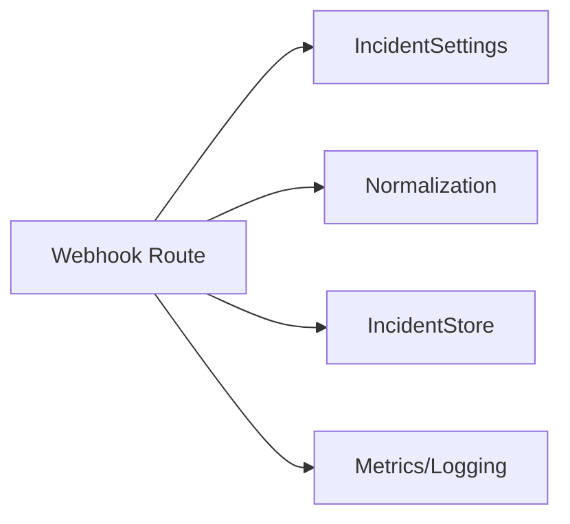

# Webhook Integrations

<cite>
**Referenced Files in This Document**
- [webhooks.py](file://products/incident-service/src/incident_service/api/routes/webhooks.py)
- [normalization.py](file://products/incident-service/src/incident_service/services/normalization.py)
- [config.py](file://products/incident-service/src/incident_service/core/config.py)
- [app.py](file://products/incident-service/src/incident_service/app.py)
- [incident-guide.md](file://docs/guides/incident-guide.md)
- [sync-incident-secrets.sh](file://shared/platform-ops/gitops/sync-incident-secrets.sh)
- [test_routes.py](file://products/incident-service/tests/test_routes.py)
- [metrics.py](file://products/platform-gateway/src/platform_gateway/core/metrics.py)
- [execution_signing.py](file://products/execution-runtime/src/execution_runtime/services/execution_signing.py)
</cite>

## Table of Contents
1. Introduction
2. Project Structure
3. Core Components
4. Architecture Overview
5. Detailed Component Analysis
6. Dependency Analysis
7. Performance Considerations
8. Troubleshooting Guide
9. Conclusion

## Introduction
This document describes webhook integrations that enable external monitoring systems to connect with the Luban AIOPS platform. It focuses on the Alertmanager webhook intake for incident creation and resolution, including payload format, authentication, deduplication, delivery semantics, and operational guidance. It also covers security mechanisms used across the platform (HMAC envelope signing and verification) and provides troubleshooting advice for common webhook issues.

## Project Structure
The webhook integration is implemented in the incident-service product and integrates with configuration, metrics, and deployment scripts:
- Webhook route and processing logic live under the incident-service API routes.
- Payload normalization maps Alertmanager v4 webhooks into a canonical incident input.
- Configuration exposes the webhook token via environment variables.
- The application wires request logging and metrics.
- GitOps scripts provide deployment instructions and example curl usage.
- Tests validate authentication, payload validation, deduplication, and resolution behavior.

**Diagram sources**
- [webhooks.py:69-102](file://products/incident-service/src/incident_service/api/routes/webhooks.py#L69-L102)
- [normalization.py:68-109](file://products/incident-service/src/incident_service/services/normalization.py#L68-L109)
- [app.py:48-69](file://products/incident-service/src/incident_service/app.py#L48-L69)
- [sync-incident-secrets.sh:158-175](file://shared/platform-ops/gitops/sync-incident-secrets.sh#L158-L175)

**Section sources**
- [webhooks.py:1-102](file://products/incident-service/src/incident_service/api/routes/webhooks.py#L1-L102)
- [normalization.py:1-109](file://products/incident-service/src/incident_service/services/normalization.py#L1-L109)
- [config.py:72-126](file://products/incident-service/src/incident_service/core/config.py#L72-L126)
- [app.py:42-69](file://products/incident-service/src/incident_service/app.py#L42-L69)
- [sync-incident-secrets.sh:158-175](file://shared/platform-ops/gitops/sync-incident-secrets.sh#L158-L175)

## Core Components
- Webhook endpoint: POST /api/v1/webhooks/alertmanager
  - Authenticates using a bearer token from INCIDENT_WEBHOOK_TOKEN.
  - Parses JSON body and normalizes it into an IncidentInput.
  - Creates or updates incidents based on fingerprint; resolves open incidents when status is resolved.
  - Returns structured responses with action codes (created, updated, resolved, ignored).
- Normalization layer:
  - Validates payload structure, enforces label limits, computes stable fingerprints, and maps severity.
- Configuration:
  - INCIDENT_WEBHOOK_TOKEN controls webhook acceptance; missing token fails closed with 503.
- Observability:
  - Request logging middleware records method, path, status, and duration.
  - Metrics are exposed via Prometheus-compatible endpoints.

**Section sources**
- [webhooks.py:57-102](file://products/incident-service/src/incident_service/api/routes/webhooks.py#L57-L102)
- [normalization.py:15-109](file://products/incident-service/src/incident_service/services/normalization.py#L15-L109)
- [config.py:72-126](file://products/incident-service/src/incident_service/core/config.py#L72-L126)
- [app.py:48-69](file://products/incident-service/src/incident_service/app.py#L48-L69)
- [metrics.py:1-91](file://products/platform-gateway/src/platform_gateway/core/metrics.py#L1-L91)

## Architecture Overview
The webhook flow authenticates incoming requests, validates and normalizes payloads, persists incidents, and emits metrics and logs. Resolution paths handle idempotent no-ops for unknown fingerprints.

**Diagram sources**
- [webhooks.py:69-206](file://products/incident-service/src/incident_service/api/routes/webhooks.py#L69-L206)
- [normalization.py:68-109](file://products/incident-service/src/incident_service/services/normalization.py#L68-L109)

## Detailed Component Analysis

### Webhook Endpoint: POST /api/v1/webhooks/alertmanager
- Authentication:
  - Requires Authorization: Bearer token matching INCIDENT_WEBHOOK_TOKEN.
  - Missing token configuration returns 503 with code WEBHOOK_NOT_CONFIGURED.
  - Invalid or missing token returns 401 with code UNAUTHORIZED.
- Payload parsing:
  - Must be valid JSON; otherwise returns 400 with code INVALID_PAYLOAD.
- Normalization:
  - Enforces required fields and constraints; raises NormalizationError on invalid inputs.
- Processing:
  - Resolutions close open incidents by fingerprint; unknown fingerprints return ignored.
  - Fires create or update based on existing open incident by fingerprint.
- Responses:
  - created: 201 with incident_id.
  - updated: 200 with incident_id.
  - resolved: 200 with incident_id.
  - ignored: 200 with no incident_id.

**Diagram sources**
- [webhooks.py:57-102](file://products/incident-service/src/incident_service/api/routes/webhooks.py#L57-L102)
- [webhooks.py:105-206](file://products/incident-service/src/incident_service/api/routes/webhooks.py#L105-L206)
- [normalization.py:68-109](file://products/incident-service/src/incident_service/services/normalization.py#L68-L109)

**Section sources**
- [webhooks.py:57-206](file://products/incident-service/src/incident_service/api/routes/webhooks.py#L57-L206)
- [test_routes.py:172-289](file://products/incident-service/tests/test_routes.py#L172-L289)

### Payload Format and Normalization
- Supported payload: Alertmanager v4 webhook format.
- Key fields:
  - status: "firing" or "resolved".
  - groupKey: preferred fingerprint; falls back to stable hash of commonLabels.
  - commonLabels: map of string labels (bounded size and length).
  - commonAnnotations: summary and description used for title and summary.
- Constraints:
  - Labels must be string pairs; oversized maps or values are rejected.
  - Severity mapping defaults to warning/info when absent or unrecognized.
- Deduplication:
  - Based on fingerprint derived from groupKey or labels; re-fires update existing open incidents.

**Diagram sources**
- [normalization.py:15-109](file://products/incident-service/src/incident_service/services/normalization.py#L15-L109)

**Section sources**
- [normalization.py:15-109](file://products/incident-service/src/incident_service/services/normalization.py#L15-L109)
- [incident-guide.md:57-73](file://docs/guides/incident-guide.md#L57-L73)

### Security: Token Authentication and HMAC Envelopes
- Webhook token:
  - INCIDENT_WEBHOOK_TOKEN configures acceptance; missing token fails closed with 503.
  - Bearer token comparison uses constant-time comparison to prevent timing attacks.
- HMAC envelope signing and verification:
  - Canonical JSON serialization ensures deterministic signatures.
  - sign_envelope computes HMAC-SHA256 over envelope excluding signature field.
  - verify_envelope performs constant-time comparison of expected vs. provided signatures.

**Diagram sources**
- [execution_signing.py:40-67](file://products/execution-runtime/src/execution_runtime/services/execution_signing.py#L40-L67)

**Section sources**
- [webhooks.py:57-82](file://products/incident-service/src/incident_service/api/routes/webhooks.py#L57-L82)
- [execution_signing.py:40-67](file://products/execution-runtime/src/execution_runtime/services/execution_signing.py#L40-L67)

### Integration Examples
- Alertmanager:
  - Point webhook_configs receiver at incident-service endpoint with bearer token.
  - Minimal configuration includes URL and http_config bearer_token.
  - Example usage via GitOps script demonstrates firing and resolving payloads.

**Diagram sources**
- [incident-guide.md:36-62](file://docs/guides/incident-guide.md#L36-L62)
- [sync-incident-secrets.sh:158-175](file://shared/platform-ops/gitops/sync-incident-secrets.sh#L158-L175)

**Section sources**
- [incident-guide.md:36-73](file://docs/guides/incident-guide.md#L36-L73)
- [sync-incident-secrets.sh:158-175](file://shared/platform-ops/gitops/sync-incident-secrets.sh#L158-L175)

### Retry Policies and Delivery Semantics
- Authentication failures (401) and unconfigured token (503) trigger retries from Alertmanager by default.
- Malformed payloads (400) are not retried by Alertmanager’s default policy; fix the payload.
- Duplicate deliveries are tolerated due to fingerprint-based deduplication.

**Section sources**
- [incident-guide.md:64-73](file://docs/guides/incident-guide.md#L64-L73)
- [test_routes.py:172-289](file://products/incident-service/tests/test_routes.py#L172-L289)

### Observability and Monitoring
- Request logging middleware records HTTP details per request.
- Prometheus metrics include HTTP request counts and durations, plus service-specific counters.
- Open incident count is updated after each webhook processing step.

**Section sources**
- [app.py:48-69](file://products/incident-service/src/incident_service/app.py#L48-L69)
- [metrics.py:1-91](file://products/platform-gateway/src/platform_gateway/core/metrics.py#L1-L91)
- [webhooks.py:95-102](file://products/incident-service/src/incident_service/api/routes/webhooks.py#L95-L102)

## Dependency Analysis
The webhook route depends on:
- Configuration for token and service URLs.
- Normalization for payload validation and mapping.
- Incident store for persistence and lookup by fingerprint.
- Metrics and logging for observability.

**Diagram sources**
- [webhooks.py:21-35](file://products/incident-service/src/incident_service/api/routes/webhooks.py#L21-L35)
- [config.py:72-126](file://products/incident-service/src/incident_service/core/config.py#L72-L126)
- [normalization.py:68-109](file://products/incident-service/src/incident_service/services/normalization.py#L68-L109)

**Section sources**
- [webhooks.py:21-102](file://products/incident-service/src/incident_service/api/routes/webhooks.py#L21-L102)
- [config.py:72-126](file://products/incident-service/src/incident_service/core/config.py#L72-L126)

## Performance Considerations
- Label cardinality limits protect against high-cardinality metrics and storage bloat.
- Constant-time token comparison avoids timing side channels.
- Deduplication reduces redundant writes and keeps incident lists manageable.
- Metrics collection excludes the /metrics endpoint to avoid self-instrumentation loops.

[No sources needed since this section provides general guidance]

## Troubleshooting Guide
Common issues and resolutions:
- 401 Unauthorized:
  - Ensure Authorization header contains correct Bearer token matching INCIDENT_WEBHOOK_TOKEN.
  - Verify token is configured; otherwise service returns 503.
- 503 Webhook Not Configured:
  - Set INCIDENT_WEBHOOK_TOKEN in environment before starting the service.
- 400 Invalid Payload:
  - Validate JSON structure; ensure status is "firing" or "resolved".
  - Provide groupKey or non-empty commonLabels; enforce label constraints.
- No incident created on resolution:
  - Unknown fingerprint resolution is idempotent and returns ignored; confirm prior fire event exists.
- Delivery timeouts:
  - Monitor health endpoints (/health/live, /health/ready) and metrics for latency spikes.
  - Use structured logs and metrics to identify bottlenecks.

**Section sources**
- [webhooks.py:57-102](file://products/incident-service/src/incident_service/api/routes/webhooks.py#L57-L102)
- [normalization.py:68-109](file://products/incident-service/src/incident_service/services/normalization.py#L68-L109)
- [incident-guide.md:64-73](file://docs/guides/incident-guide.md#L64-L73)
- [test_routes.py:172-289](file://products/incident-service/tests/test_routes.py#L172-L289)

## Conclusion
The Luban AIOPS platform provides a robust webhook integration for Alertmanager, enabling reliable incident ingestion with strong authentication, normalized payload handling, and idempotent deduplication. Operators can integrate monitoring tools confidently, leveraging built-in observability and clear delivery semantics. For advanced security needs, HMAC envelope signing and verification are available within the execution runtime. Proper configuration and monitoring ensure resilient operations and quick troubleshooting.