# Agent Platform Service

<cite>
**Referenced Files in This Document**
- [main.py](file://products/agent-platform/src/agent_service/main.py)
- [app.py](file://products/agent-platform/src/agent_service/app.py)
- [agent_app.py](file://products/agent-platform/src/agent_service/agent_app.py)
- [runtime_kernel.py](file://products/agent-platform/src/agent_service/runtime_kernel.py)
- [runtime_settings.py](file://products/agent-platform/src/agent_service/runtime_settings.py)
- [config.py](file://products/agent-platform/src/agent_service/core/config.py)
- [env.py](file://products/agent-platform/src/agent_service/core/env.py)
- [metrics.py](file://products/agent-platform/src/agent_service/core/metrics.py)
- [observability.py](file://products/agent-platform/src/agent_service/core/observability.py)
- [telemetry.py](file://products/agent-platform/src/agent_service/core/telemetry.py)
- [request_context.py](file://products/agent-platform/src/agent_service/core/request_context.py)
- [routes.py](file://products/agent-platform/src/agent_service/api/v2/routes.py)
- [api.py](file://products/agent-platform/src/agent_service/schemas/api.py)
- [v2.py](file://products/agent-platform/src/agent_service/schemas/v2.py)
- [base.py](file://products/agent-platform/src/agent_service/providers/base.py)
- [openai.py](file://products/agent-platform/src/agent_service/providers/openai.py)
- [dashscope.py](file://products/agent-platform/src/agent_service/providers/dashscope.py)
- [deepseek.py](file://products/agent-platform/src/agent_service/providers/deepseek.py)
- [registry.py](file://products/agent-platform/src/agent_service/providers/registry.py)
- [session_service.py](file://products/agent-platform/src/agent_service/services/session_service.py)
- [session_store.py](file://products/agent-platform/src/agent_service/services/session_store.py)
- [session_transcript.py](file://products/agent-platform/src/agent_service/services/session_transcript.py)
- [hitl_confirmations.py](file://products/agent-platform/src/agent_service/services/hitl_confirmations.py)
- [runtime_service.py](file://products/agent-platform/src/agent_service/services/runtime_service.py)
- [runtime_dependencies.py](file://products/agent-platform/src/agent_service/services/runtime_dependencies.py)
- [gateway_tools.py](file://products/agent-platform/src/agent_service/tools/gateway_tools.py)
- [chat.py](file://products/platform-gateway/src/platform_gateway/api/routes/chat.py)
- [test_chat_stream_modality.py](file://products/agent-platform/tests/test_chat_stream_modality.py)
- [pyproject.toml](file://products/agent-platform/pyproject.toml)
- [Dockerfile](file://products/agent-platform/Dockerfile)
- [README.md](file://products/agent-platform/README.md)
</cite>

## Update Summary
**Changes Made**
- Added input_modality parameter support to v2 streaming endpoint with Literal type validation for 'text' and 'voice' values
- Implemented voice-readiness parity between POST /chat and GET /chat/stream endpoints
- Enhanced API schema definitions to include input_modality field with proper validation
- Updated streaming endpoint to accept query parameter for modality metadata
- Added comprehensive test coverage for modality validation and default behavior
- Maintained backward compatibility with existing clients by defaulting to 'text' modality

## Table of Contents
1. [Introduction](#introduction)
2. [Project Structure](#project-structure)
3. [Core Components](#core-components)
4. [Architecture Overview](#architecture-overview)
5. [Detailed Component Analysis](#detailed-component-analysis)
6. [Multi-Session Operator Workspace](#multi-session-operator-workspace)
7. [Session Store Enhancements](#session-store-enhancements)
8. [Transcript Extraction Service](#transcript-extraction-service)
9. [HITL Confirmation Registry Integration](#hitl-confirmation-registry-integration)
10. [Enhanced Streaming Architecture](#enhanced-streaming-architecture)
11. [Voice Readiness Support](#voice-readiness-support)
12. [Per-Request Trace Queues](#per-request-trace-queues)
13. [Delegated Token Management](#delegated-token-management)
14. [Dependency Analysis](#dependency-analysis)
15. [Performance Considerations](#performance-considerations)
16. [Troubleshooting Guide](#troubleshooting-guide)
17. [Conclusion](#conclusion)
18. [Appendices](#appendices)

## Introduction
The Agent Platform Service is the core orchestration engine of the Luban AIOps Platform. It provides a runtime kernel for agent execution, a provider registry for multi-model backends (OpenAI, DashScope, DeepSeek), and robust session management with durable storage. The service exposes REST APIs for agent interactions, streaming responses, and configuration management, enabling scalable and observable AI operations across diverse model providers.

**Updated** The service now includes comprehensive voice-readiness support through the addition of input_modality parameters to both POST /chat and GET /chat/stream endpoints, ensuring parity between synchronous and asynchronous chat interfaces. This enhancement enables voice-based interactions while maintaining the same policy enforcement and HITL workflows as text-based inputs. The service also includes comprehensive multi-session operator workspace foundations with v2 session routes, enhanced session stores supporting last_active_at timestamps and server-minted titles, transcript extraction capabilities for conversation history reconstruction, and integrated HITL confirmation registry for human-in-the-loop workflows.

## Project Structure
The Agent Platform Service is implemented as a Python FastAPI application organized by feature layers:
- Entrypoints and application bootstrapping
- API routes and request/response schemas
- Runtime kernel and settings
- Provider implementations and registry
- Session services and stores
- Tools and integrations
- Core cross-cutting concerns (configuration, observability, metrics, telemetry, request context)

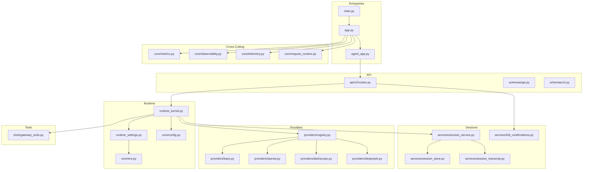
```mermaid
graph TB
subgraph "Entrypoints"
main["main.py"]
app["app.py"]
agent_app["agent_app.py"]
end
subgraph "API"
routes_v2["api/v2/routes.py"]
schema_api["schemas/api.py"]
schema_v2["schemas/v2.py"]
end
subgraph "Runtime"
kernel["runtime_kernel.py"]
settings["runtime_settings.py"]
config["core/config.py"]
env["core/env.py"]
end
subgraph "Providers"
base_prov["providers/base.py"]
openai["providers/openai.py"]
dashscope["providers/dashscope.py"]
deepseek["providers/deepseek.py"]
reg["providers/registry.py"]
end
subgraph "Sessions"
sess_svc["services/session_service.py"]
sess_store["services/session_store.py"]
sess_transcript["services/session_transcript.py"]
hitl_reg["services/hitl_confirmations.py"]
end
subgraph "Tools"
gw_tools["tools/gateway_tools.py"]
end
subgraph "Cross-Cutting"
metrics["core/metrics.py"]
obs["core/observability.py"]
tel["core/telemetry.py"]
ctx["core/request_context.py"]
end
main --> app --> agent_app
agent_app --> routes_v2
routes_v2 --> kernel
kernel --> reg
reg --> base_prov
reg --> openai
reg --> dashscope
reg --> deepseek
kernel --> sess_svc
sess_svc --> sess_store
sess_svc --> sess_transcript
routes_v2 --> hitl_reg
kernel --> gw_tools
app --> metrics
app --> obs
app --> tel
app --> ctx
kernel --> config
kernel --> settings
settings --> env
```

**Diagram sources**
- [main.py](file://products/agent-platform/src/agent_service/main.py)
- [app.py](file://products/agent-platform/src/agent_service/app.py)
- [agent_app.py](file://products/agent-platform/src/agent_service/agent_app.py)
- [routes.py](file://products/agent-platform/src/agent_service/api/v2/routes.py)
- [runtime_kernel.py](file://products/agent-platform/src/agent_service/runtime_kernel.py)
- [runtime_settings.py](file://products/agent-platform/src/agent_service/runtime_settings.py)
- [config.py](file://products/agent-platform/src/agent_service/core/config.py)
- [env.py](file://products/agent-platform/src/agent_service/core/env.py)
- [base.py](file://products/agent-platform/src/agent_service/providers/base.py)
- [openai.py](file://products/agent-platform/src/agent_service/providers/openai.py)
- [dashscope.py](file://products/agent-platform/src/agent_service/providers/dashscope.py)
- [deepseek.py](file://products/agent-platform/src/agent_service/providers/deepseek.py)
- [registry.py](file://products/agent-platform/src/agent_service/providers/registry.py)
- [session_service.py](file://products/agent-platform/src/agent_service/services/session_service.py)
- [session_store.py](file://products/agent-platform/src/agent_service/services/session_store.py)
- [session_transcript.py](file://products/agent-platform/src/agent_service/services/session_transcript.py)
- [hitl_confirmations.py](file://products/agent-platform/src/agent_service/services/hitl_confirmations.py)
- [gateway_tools.py](file://products/agent-platform/src/agent_service/tools/gateway_tools.py)
- [metrics.py](file://products/agent-platform/src/agent_service/core/metrics.py)
- [observability.py](file://products/agent-platform/src/agent_service/core/observability.py)
- [telemetry.py](file://products/agent-platform/src/agent_service/core/telemetry.py)
- [request_context.py](file://products/agent-platform/src/agent_service/core/request_context.py)

**Section sources**
- [README.md](file://products/agent-platform/README.md)
- [pyproject.toml](file://products/agent-platform/pyproject.toml)
- [Dockerfile](file://products/agent-platform/Dockerfile)

## Core Components
- Runtime Kernel: Orchestrates agent lifecycle, conversation state, tool invocation, and provider dispatch with enhanced AgentScope 2.x toolkit registration and anti-hallucination guards.
- Provider Registry: Discovers and manages model providers (OpenAI, DashScope, DeepSeek) with pluggable interfaces using new AgentScope 2.x model construction patterns.
- Session Management: Persists and restores conversations with durable storage, multi-session workspace support, and concurrency-safe access.
- API Layer: Exposes REST endpoints for chat, sessions, streaming events, and health checks with v3 streaming protocol support, session workspace operations, and voice-readiness parity.
- Cross-Cutting: Configuration, environment, metrics, observability, telemetry, and request-scoped context.

Key responsibilities:
- Lifecycle: Initialize, start, run, and shutdown agents safely with AgentScope 2.x compatibility.
- Conversation: Maintain message history, context, and state per session with workspace organization.
- Streaming: Emit incremental events to clients over HTTP streaming with v3 tool_call/tool_result frames.
- Security: Manage per-user toolkit closures bound to delegated tokens for secure tool execution.
- Anti-Hallucination: Prevent model fabrication through systematic NO_TOOLS_NOTICE injection.
- Auto-Approval: Pre-approve vetted read-only tools to prevent headless stream stalls while maintaining security.
- Voice Readiness: Support both text and voice input modalities with consistent policy enforcement and HITL workflows.
- Workspace Management: Provide multi-session operator workspace with session listing, detail views, and owner-only deletion.
- Transcript Reconstruction: Extract conversation history from kernel state snapshots for workspace UIs.
- HITL Integration: Support human-in-the-loop workflows with parked confirmation management.
- Observability: Emit structured logs, metrics, and traces for each operation with per-request audit trails.

**Updated** The service now includes comprehensive voice-readiness support with input_modality parameters on both POST /chat and GET /chat/stream endpoints, ensuring consistent behavior across synchronous and asynchronous interfaces while maintaining full policy enforcement and HITL workflow compatibility.

**Section sources**
- [runtime_kernel.py](file://products/agent-platform/src/agent_service/runtime_kernel.py)
- [registry.py](file://products/agent-platform/src/agent_service/providers/registry.py)
- [session_service.py](file://products/agent-platform/src/agent_service/services/session_service.py)
- [routes.py](file://products/agent-platform/src/agent_service/api/v2/routes.py)
- [metrics.py](file://products/agent-platform/src/agent_service/core/metrics.py)
- [observability.py](file://products/agent-platform/src/agent_service/core/observability.py)
- [telemetry.py](file://products/agent-platform/src/agent_service/core/telemetry.py)
- [request_context.py](file://products/agent-platform/src/agent_service/core/request_context.py)

## Architecture Overview
The service follows a layered architecture with enhanced security and anti-hallucination features:
- API layer receives requests, validates payloads, and delegates to the runtime kernel with v3 streaming support, session workspace operations, and voice-readiness parity.
- Runtime kernel coordinates sessions, tools, and provider selection via the registry with AgentScope 2.x toolkit registration.
- Providers implement standardized interfaces to communicate with external model APIs using new model construction patterns.
- Session service persists state using a configurable store with workspace bookkeeping and transcript extraction.
- Cross-cutting modules provide configuration, metrics, observability, and telemetry with per-request audit trails.

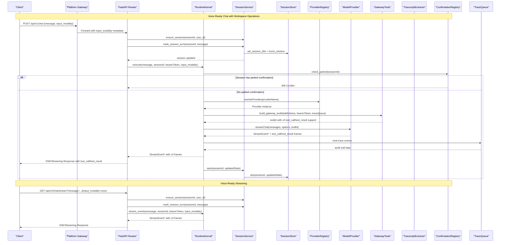
```mermaid
sequenceDiagram
participant Client as "Client"
participant Gateway as "Platform Gateway"
participant API as "FastAPI Routes"
participant Kernel as "RuntimeKernel"
participant Sess as "SessionService"
participant Store as "SessionStore"
participant Reg as "ProviderRegistry"
participant Prov as "ModelProvider"
participant Tools as "GatewayTools"
participant Transcript as "TranscriptExtractor"
participant HITL as "ConfirmationRegistry"
participant Trace as "TraceQueue"
Note over Client,HITL : Voice-Ready Chat with Workspace Operations
Client->>Gateway : POST /api/v1/chat {message, input_modality}
Gateway->>API : Forward with input_modality metadata
API->>Sess : ensure_session(sessionId, user_id)
API->>Sess : mark_session_turn(sessionId, message)
Sess->>Store : set_session_title + touch_session
Sess-->>API : session updated
API->>Kernel : execute(message, sessionId, bearerToken, input_modality)
Kernel->>HITL : check_parked(sessionId)
alt Session has parked confirmation
HITL-->>API : 409 Conflict
else No parked confirmation
Kernel->>Reg : resolveProvider(providerName)
Reg-->>Kernel : Provider instance
Kernel->>Tools : build_gateway_toolkit(definitions, bearerToken, traceQueue)
Tools-->>Kernel : toolkit with v3 tool_call/tool_result support
Kernel->>Prov : streamChat(messages, options, toolkit)
Prov-->>Kernel : StreamEvent* + tool_call/tool_result frames
Kernel->>Trace : emit trace events
Trace-->>Kernel : audit trail data
Kernel-->>API : StreamEvent* with v3 frames
API-->>Client : SSE/Streaming Response with tool_call/tool_result
Kernel->>Sess : save(sessionId, updatedState)
Sess->>Store : set(sessionId, updatedState)
end
Note over Client,HITL : Voice-Ready Streaming
Client->>API : GET /api/v2/chat/stream?message=...&input_modality=voice
API->>Sess : ensure_session(sessionId, user_id)
API->>Sess : mark_session_turn(sessionId, message)
API->>Kernel : stream_events(message, sessionId, bearerToken, input_modality)
Kernel-->>API : StreamEvent* with v3 frames
API-->>Client : SSE/Streaming Response
```

**Updated** The sequence diagram now shows the complete voice-readiness flow, including both POST /chat and GET /chat/stream endpoints accepting input_modality parameters, while maintaining consistent policy enforcement and HITL workflows across both modalities.

**Diagram sources**
- [routes.py](file://products/agent-platform/src/agent_service/api/v2/routes.py)
- [runtime_kernel.py](file://products/agent-platform/src/agent_service/runtime_kernel.py)
- [session_service.py](file://products/agent-platform/src/agent_service/services/session_service.py)
- [session_store.py](file://products/agent-platform/src/agent_service/services/session_store.py)
- [session_transcript.py](file://products/agent-platform/src/agent_service/services/session_transcript.py)
- [hitl_confirmations.py](file://products/agent-platform/src/agent_service/services/hitl_confirmations.py)
- [registry.py](file://products/agent-platform/src/agent_service/providers/registry.py)
- [base.py](file://products/agent-platform/src/agent_service/providers/base.py)
- [gateway_tools.py](file://products/agent-platform/src/agent_service/tools/gateway_tools.py)
- [chat.py](file://products/platform-gateway/src/platform_gateway/api/routes/chat.py)

## Detailed Component Analysis

### Runtime Kernel
The runtime kernel is the central orchestrator for agent execution with enhanced AgentScope 2.x compatibility and anti-hallucination features. It manages:
- Agent lifecycle initialization and shutdown with AgentScope 2.x toolkit registration
- Conversation state transitions with per-request toolkit rebuilding
- Tool invocation and result aggregation with v3 streaming support
- Provider selection and streaming event handling with trace queue integration
- Anti-hallucination guard system with NO_TOOLS_NOTICE injection
- Auto-approval mechanism for vetted read-only tools to prevent headless stream stalls
- Voice readiness support through input_modality parameter passthrough

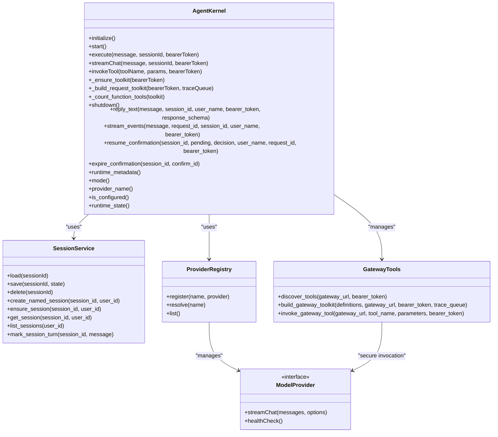
```mermaid
classDiagram
class AgentKernel {
+initialize()
+start()
+execute(message, sessionId, bearerToken)
+streamChat(message, sessionId, bearerToken)
+invokeTool(toolName, params, bearerToken)
+_ensure_toolkit(bearerToken)
+_build_request_toolkit(bearerToken, traceQueue)
+_count_function_tools(toolkit)
+shutdown()
+reply_text(message, session_id, user_name, bearer_token, response_schema)
+stream_events(message, request_id, session_id, user_name, bearer_token)
+resume_confirmation(session_id, pending, decision, user_name, request_id, bearer_token)
+expire_confirmation(session_id, confirm_id)
+runtime_metadata()
+mode()
+provider_name()
+is_configured()
+runtime_state()
}
class SessionService {
+load(sessionId)
+save(sessionId, state)
+delete(sessionId)
+create_named_session(session_id, user_id)
+ensure_session(session_id, user_id)
+get_session(session_id, user_id)
+list_sessions(user_id)
+mark_session_turn(session_id, message)
}
class ProviderRegistry {
+register(name, provider)
+resolve(name)
+list()
}
class ModelProvider {
<<interface>>
+streamChat(messages, options)
+healthCheck()
}
class GatewayTools {
+discover_tools(gateway_url, bearer_token)
+build_gateway_toolkit(definitions, gateway_url, bearer_token, trace_queue)
+invoke_gateway_tool(gateway_url, tool_name, parameters, bearer_token)
}
AgentKernel --> SessionService : "uses"
AgentKernel --> ProviderRegistry : "uses"
AgentKernel --> GatewayTools : "manages"
ProviderRegistry --> ModelProvider : "manages"
GatewayTools --> ModelProvider : "secure invocation"
```

**Updated** The runtime kernel now includes AgentScope 2.x toolkit registration, per-request toolkit rebuilding with trace queues, anti-hallucination guard system, auto-approval mechanism for preventing headless stream stalls, enhanced session management methods for multi-session workspace operations, and voice readiness support through input_modality parameter passthrough.

**Diagram sources**
- [runtime_kernel.py](file://products/agent-platform/src/agent_service/runtime_kernel.py)
- [session_service.py](file://products/agent-platform/src/agent_service/services/session_service.py)
- [registry.py](file://products/agent-platform/src/agent_service/providers/registry.py)
- [base.py](file://products/agent-platform/src/agent_service/providers/base.py)
- [gateway_tools.py](file://products/agent-platform/src/agent_service/tools/gateway_tools.py)

**Section sources**
- [runtime_kernel.py](file://products/agent-platform/src/agent_service/runtime_kernel.py)

### Provider Registry and Implementations
The provider registry supports multiple model backends through a common interface. Implementations include OpenAI, DashScope, and DeepSeek, all updated to use AgentScope 2.x model construction patterns with enhanced parameter support.

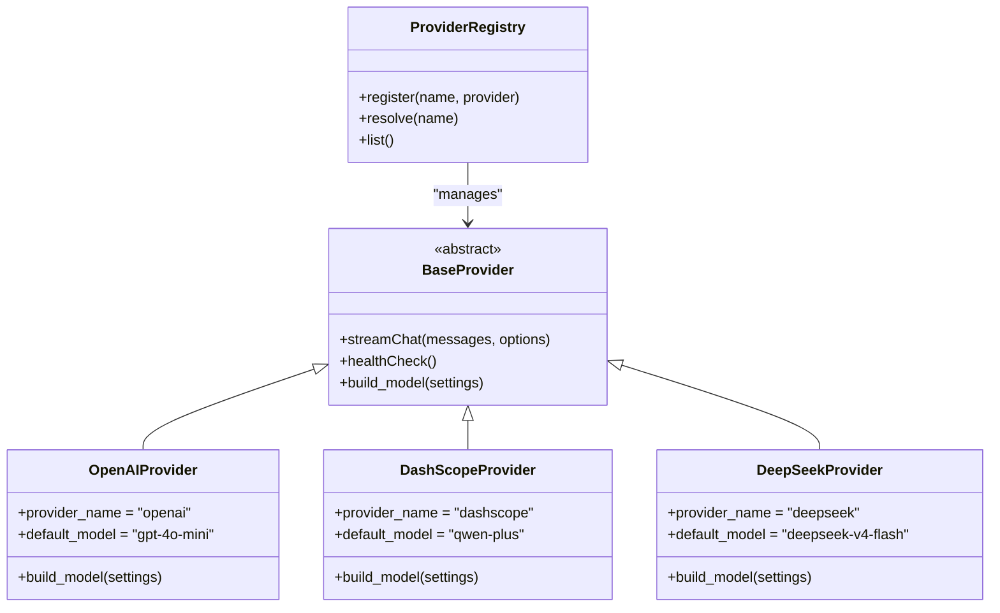
```mermaid
classDiagram
class BaseProvider {
<<abstract>>
+streamChat(messages, options)
+healthCheck()
+build_model(settings)
}
class OpenAIProvider {
+build_model(settings)
+provider_name = "openai"
+default_model = "gpt-4o-mini"
}
class DashScopeProvider {
+build_model(settings)
+provider_name = "dashscope"
+default_model = "qwen-plus"
}
class DeepSeekProvider {
+build_model(settings)
+provider_name = "deepseek"
+default_model = "deepseek-v4-flash"
}
class ProviderRegistry {
+register(name, provider)
+resolve(name)
+list()
}
BaseProvider <|-- OpenAIProvider
BaseProvider <|-- DashScopeProvider
BaseProvider <|-- DeepSeekProvider
ProviderRegistry --> BaseProvider : "manages"
```

Configuration examples:
- OpenAI: Configure API key, model name, organization, and reasoning effort via environment variables or runtime settings.
- DashScope: Set endpoint URL, credentials, thinking budget, and parallel tool calls; select model variant.
- DeepSeek: Provide authentication token, target model identifier, and reasoning effort level.

**Updated** All provider implementations now use AgentScope 2.x model construction patterns with enhanced parameter support including reasoning effort, thinking enable flags, and parallel tool calls. Voice readiness is supported through consistent parameter passing across all modalities.

**Section sources**
- [base.py](file://products/agent-platform/src/agent_service/providers/base.py)
- [openai.py](file://products/agent-platform/src/agent_service/providers/openai.py)
- [dashscope.py](file://products/agent-platform/src/agent_service/providers/dashscope.py)
- [deepseek.py](file://products/agent-platform/src/agent_service/providers/deepseek.py)
- [registry.py](file://products/agent-platform/src/agent_service/providers/registry.py)
- [runtime_settings.py](file://products/agent-platform/src/agent_service/runtime_settings.py)
- [config.py](file://products/agent-platform/src/agent_service/core/config.py)
- [env.py](file://products/agent-platform/src/agent_service/core/env.py)

### Multi-Session Operator Workspace
The multi-session operator workspace provides comprehensive session lifecycle management for operators to organize and manage conversation workspaces.

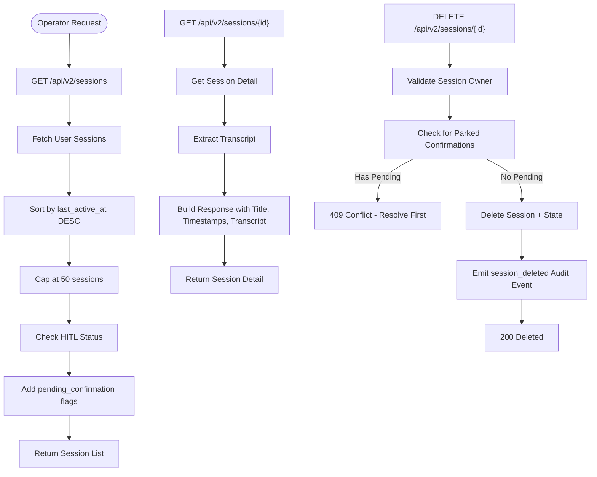
```mermaid
flowchart TD
Start(["Operator Request"]) --> List["GET /api/v2/sessions"]
List --> Fetch["Fetch User Sessions"]
Fetch --> Sort["Sort by last_active_at DESC"]
Sort --> Cap["Cap at 50 sessions"]
Cap --> CheckHITL["Check HITL Status"]
CheckHITL --> AddFlags["Add pending_confirmation flags"]
AddFlags --> ReturnList["Return Session List"]
Detail["GET /api/v2/sessions/{id}"] --> GetSession["Get Session Detail"]
GetSession --> ExtractTranscript["Extract Transcript"]
ExtractTranscript --> BuildResponse["Build Response with Title, Timestamps, Transcript"]
BuildResponse --> ReturnDetail["Return Session Detail"]
Delete["DELETE /api/v2/sessions/{id}"] --> ValidateOwner["Validate Session Owner"]
ValidateOwner --> CheckParked["Check for Parked Confirmations"]
CheckParked --> |Has Pending| Reject["409 Conflict - Resolve First"]
CheckParked --> |No Pending| DeleteSession["Delete Session + State"]
DeleteSession --> Audit["Emit session_deleted Audit Event"]
Audit --> Success["200 Deleted"]
```

**Diagram sources**
- [routes.py:334-419](file://products/agent-platform/src/agent_service/api/v2/routes.py#L334-L419)
- [session_service.py:72-123](file://products/agent-platform/src/agent_service/services/session_service.py#L72-L123)
- [session_store.py:72-73](file://products/agent-platform/src/agent_service/services/session_store.py#L72-L73)

Key features:
- **Session Listing**: Most-recently-active first, capped at 50 sessions per user
- **Workspace Ordering**: Uses `last_active_at` timestamps for chronological organization
- **Server-Minted Titles**: First user turn creates immutable session titles (80-char cap)
- **Owner-Only Access**: Foreign session IDs return 404 (anti-enumeration pattern)
- **HITL Integration**: Sessions with parked confirmations block deletion with 409
- **Transcript Extraction**: Best-effort conversation history from kernel state snapshots
- **Audit Trail**: All delete operations emit durable `session_deleted` audit events

**Section sources**
- [routes.py:334-419](file://products/agent-platform/src/agent_service/api/v2/routes.py#L334-L419)
- [session_service.py:72-123](file://products/agent-platform/src/agent_service/services/session_service.py#L72-L123)

### Session Store Enhancements
The session store has been enhanced with workspace bookkeeping capabilities including last_active_at timestamps and server-minted titles.

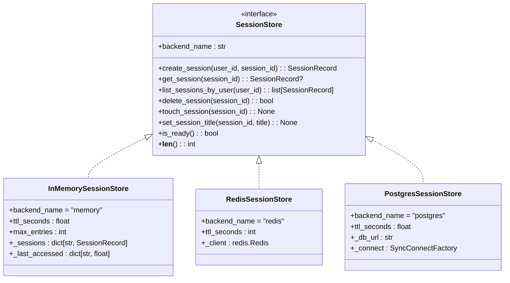
```mermaid
classDiagram
class SessionStore {
<<interface>>
+backend_name : str
+create_session(user_id, session_id) : SessionRecord
+get_session(session_id) : SessionRecord?
+list_sessions_by_user(user_id) : list[SessionRecord]
+delete_session(session_id) : bool
+touch_session(session_id) : None
+set_session_title(session_id, title) : None
+is_ready() : bool
+__len__() : int
}
class InMemorySessionStore {
+backend_name = "memory"
+ttl_seconds : float
+max_entries : int
+_sessions : dict[str, SessionRecord]
+_last_accessed : dict[str, float]
}
class RedisSessionStore {
+backend_name = "redis"
+ttl_seconds : int
+_client : redis.Redis
}
class PostgresSessionStore {
+backend_name = "postgres"
+ttl_seconds : float
+_db_url : str
+_connect : SyncConnectFactory
}
SessionStore <|.. InMemorySessionStore
SessionStore <|.. RedisSessionStore
SessionStore <|.. PostgresSessionStore
```

Enhanced capabilities:
- **Last Active Tracking**: `last_active_at` timestamps for workspace ordering and activity monitoring
- **Server-Minted Titles**: Immutable titles created from first user turn (80-character cap)
- **Backend-Specific Optimization**: Postgres uses native SQL ordering, memory/Redis sort client-side
- **TTL-Aware Operations**: All workspace operations respect session TTL and idle expiration
- **Fail-Open Design**: Workspace bookkeeping failures don't block chat operations
- **Idempotent DDL**: Postgres schema migration handles pre-existing deployments gracefully

**Section sources**
- [session_store.py:46-73](file://products/agent-platform/src/agent_service/services/session_store.py#L46-L73)
- [session_store.py:81-169](file://products/agent-platform/src/agent_service/services/session_store.py#L81-L169)
- [session_store.py:176-320](file://products/agent-platform/src/agent_service/services/session_store.py#L176-L320)
- [session_store.py:420-612](file://products/agent-platform/src/agent_service/services/session_store.py#L420-L612)

### Transcript Extraction Service
The transcript extraction service provides best-effort conversation history reconstruction from kernel state snapshots for workspace UIs.

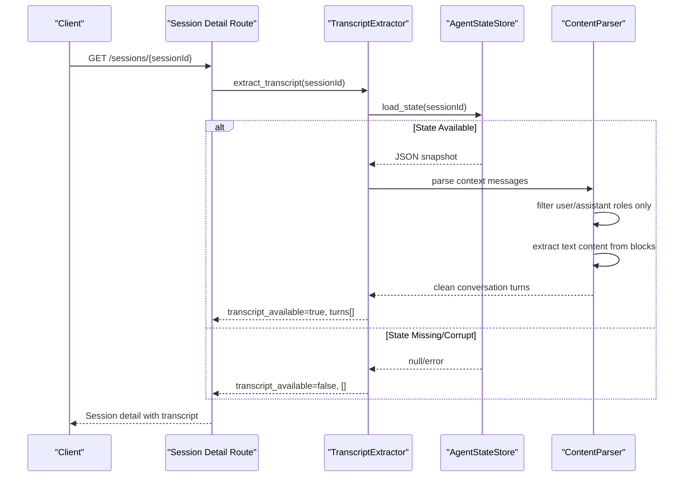
```mermaid
sequenceDiagram
participant Client as "Client"
participant API as "Session Detail Route"
participant Transcript as "TranscriptExtractor"
participant StateStore as "AgentStateStore"
participant Parser as "ContentParser"
Client->>API : GET /sessions/{sessionId}
API->>Transcript : extract_transcript(sessionId)
Transcript->>StateStore : load_state(sessionId)
alt State Available
StateStore-->>Transcript : JSON snapshot
Transcript->>Parser : parse context messages
Parser->>Parser : filter user/assistant roles only
Parser->>Parser : extract text content from blocks
Parser-->>Transcript : clean conversation turns
Transcript-->>API : transcript_available=true, turns[]
else State Missing/Corrupt
StateStore-->>Transcript : null/error
Transcript-->>API : transcript_available=false, []
end
API-->>Client : Session detail with transcript
```

**Diagram sources**
- [session_transcript.py:30-64](file://products/agent-platform/src/agent_service/services/session_transcript.py#L30-L64)
- [routes.py:375-395](file://products/agent-platform/src/agent_service/api/v2/routes.py#L375-L395)

Key characteristics:
- **Best-Effort Design**: Missing snapshots degrade gracefully without errors
- **Role Filtering**: Only extracts user and assistant messages (excludes system/tool frames)
- **Content Flattening**: Converts block-structured content to plain text
- **Timestamp Preservation**: Maintains original message creation times when available
- **Error Resilience**: Corrupt JSON or unknown shapes return empty transcripts
- **Security Boundary**: Never fabricates conversation history

**Section sources**
- [session_transcript.py:1-83](file://products/agent-platform/src/agent_service/services/session_transcript.py#L1-L83)

### HITL Confirmation Registry Integration
The HITL (Human-In-The-Loop) confirmation registry manages parked tool confirmations for interactive workflows.

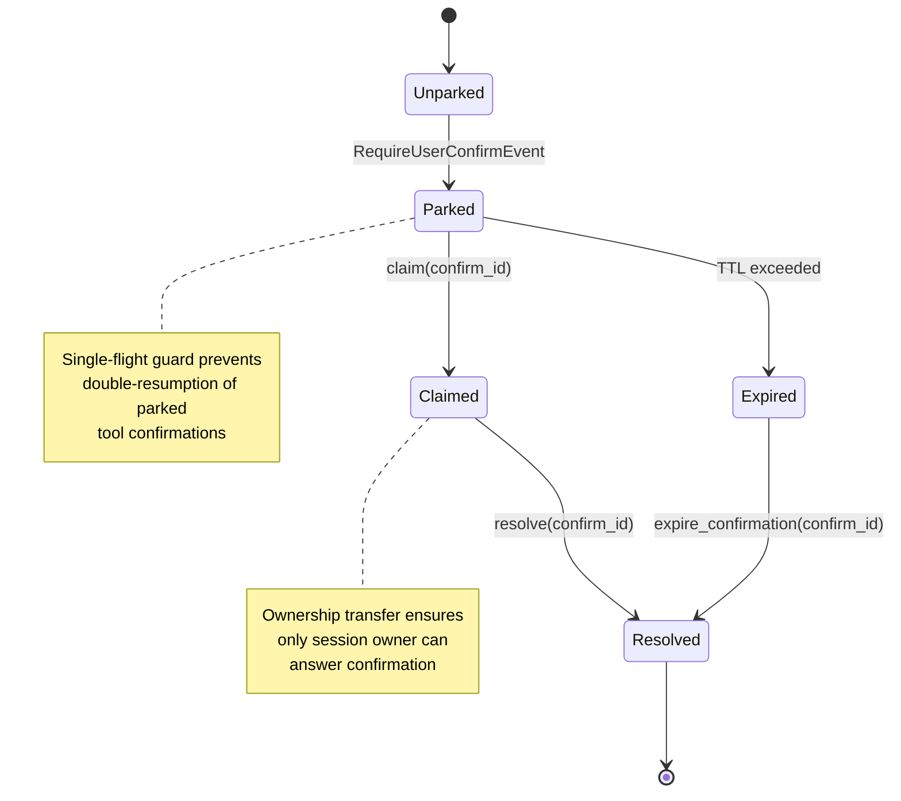
```mermaid
stateDiagram-v2
[*] --> Unparked
Unparked --> Parked : RequireUserConfirmEvent
Parked --> Claimed : claim(confirm_id)
Claimed --> Resolved : resolve(confirm_id)
Parked --> Expired : TTL exceeded
Expired --> Resolved : expire_confirmation(confirm_id)
Resolved --> [*]
note right of Parked
Single-flight guard prevents
double-resumption of parked
tool confirmations
end note
note right of Claimed
Ownership transfer ensures
only session owner can
answer confirmation
end note
```

**Diagram sources**
- [hitl_confirmations.py:93-229](file://products/agent-platform/src/agent_service/services/hitl_confirmations.py#L93-L229)
- [routes.py:71-100](file://products/agent-platform/src/agent_service/api/v2/routes.py#L71-L100)

Core functionality:
- **Parked Confirmation Management**: Tracks tool calls awaiting user approval
- **Single-Flight Guarantees**: Prevents duplicate confirmation processing
- **TTL-Based Expiration**: Automatic cleanup of expired confirmations
- **Owner Validation**: Ensures only session owners can answer confirmations
- **Risk Level Tracking**: Captures mutating tool risk levels for UI flagging
- **Integration Points**: Bridges AgentScope kernel events with platform workflows

**Section sources**
- [hitl_confirmations.py:1-229](file://products/agent-platform/src/agent_service/services/hitl_confirmations.py#L1-L229)
- [routes.py:71-100](file://products/agent-platform/src/agent_service/api/v2/routes.py#L71-L100)

### API Endpoints
The API layer exposes REST endpoints for agent interactions, session management, and health checks. Requests are validated against schemas and routed to the runtime kernel with v3 streaming protocol support.

Typical endpoints:
- Chat: POST /chat with message, optional session ID, and delegated token
- Sessions: GET/POST/DELETE /sessions for lifecycle management
- Health: GET /health for readiness and liveness probes
- Streaming: Server-sent events for incremental responses with v3 tool_call/tool_result frames

Request/response validation uses Pydantic models defined in schemas with enhanced v3 streaming event types.

**Updated** Chat endpoints now accept delegated tokens for secure tool execution and support v3 streaming protocol with tool_call/tool_result frames for comprehensive audit trails. Both POST /chat and GET /chat/stream endpoints accept input_modality parameters for voice-readiness parity. Session endpoints provide multi-session workspace operations with proper authorization and audit trails.

**Section sources**
- [routes.py:106-235](file://products/agent-platform/src/agent_service/api/v2/routes.py#L106-L235)
- [routes.py:334-419](file://products/agent-platform/src/agent_service/api/v2/routes.py#L334-L419)
- [api.py:8-18](file://products/agent-platform/src/agent_service/schemas/api.py#L8-L18)
- [v2.py](file://products/agent-platform/src/agent_service/schemas/v2.py)

### Tools Integration
The service integrates with external tools through a gateway abstraction. Tools can be invoked during agent execution to perform actions like Kubernetes operations or data retrieval with enhanced AgentScope 2.x compatibility.

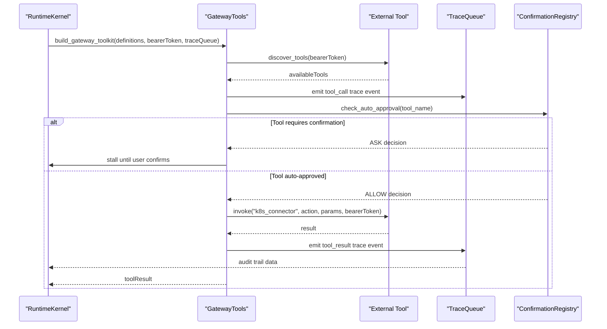
```mermaid
sequenceDiagram
participant Kernel as "RuntimeKernel"
participant GatewayTools as "GatewayTools"
participant External as "External Tool"
participant Trace as "TraceQueue"
participant HITL as "ConfirmationRegistry"
Kernel->>GatewayTools : build_gateway_toolkit(definitions, bearerToken, traceQueue)
GatewayTools->>External : discover_tools(bearerToken)
External-->>GatewayTools : availableTools
GatewayTools->>Trace : emit tool_call trace event
GatewayTools->>HITL : check_auto_approval(tool_name)
alt Tool requires confirmation
HITL-->>GatewayTools : ASK decision
GatewayTools->>Kernel : stall until user confirms
else Tool auto-approved
HITL-->>GatewayTools : ALLOW decision
GatewayTools->>External : invoke("k8s_connector", action, params, bearerToken)
External-->>GatewayTools : result
GatewayTools->>Trace : emit tool_result trace event
Trace-->>Kernel : audit trail data
GatewayTools-->>Kernel : toolResult
end
```

**Updated** The tools integration now includes AgentScope 2.x toolkit registration pattern, per-request trace queues for audit trails, v3 streaming support with tool_call/tool_result frames, auto-approval mechanism for vetted read-only tools, and HITL confirmation registry integration for interactive workflows. Voice readiness is maintained throughout the tool execution pipeline.

**Diagram sources**
- [gateway_tools.py](file://products/agent-platform/src/agent_service/tools/gateway_tools.py)
- [runtime_kernel.py](file://products/agent-platform/src/agent_service/runtime_kernel.py)
- [hitl_confirmations.py](file://products/agent-platform/src/agent_service/services/hitl_confirmations.py)

**Section sources**
- [gateway_tools.py](file://products/agent-platform/src/agent_service/tools/gateway_tools.py)

## Multi-Session Operator Workspace

### Overview
The multi-session operator workspace provides comprehensive session lifecycle management for operators to organize, monitor, and manage conversation workspaces. This foundation enables operators to handle multiple concurrent incidents, track conversation progress, and maintain workspace organization without direct database access.

### Key Features
- **Session Listing**: Browse user's sessions ordered by most recent activity
- **Workspace Organization**: Server-minted titles from first user turns for easy identification
- **Activity Tracking**: Last active timestamps for workspace sorting and monitoring
- **Owner-Only Access**: Anti-enumeration pattern prevents session enumeration attacks
- **HITL Integration**: Sessions with pending confirmations are properly flagged and protected
- **Transcript Access**: Best-effort conversation history reconstruction for workspace UIs
- **Audit Trail**: All workspace operations are logged for compliance and debugging

### Implementation Details
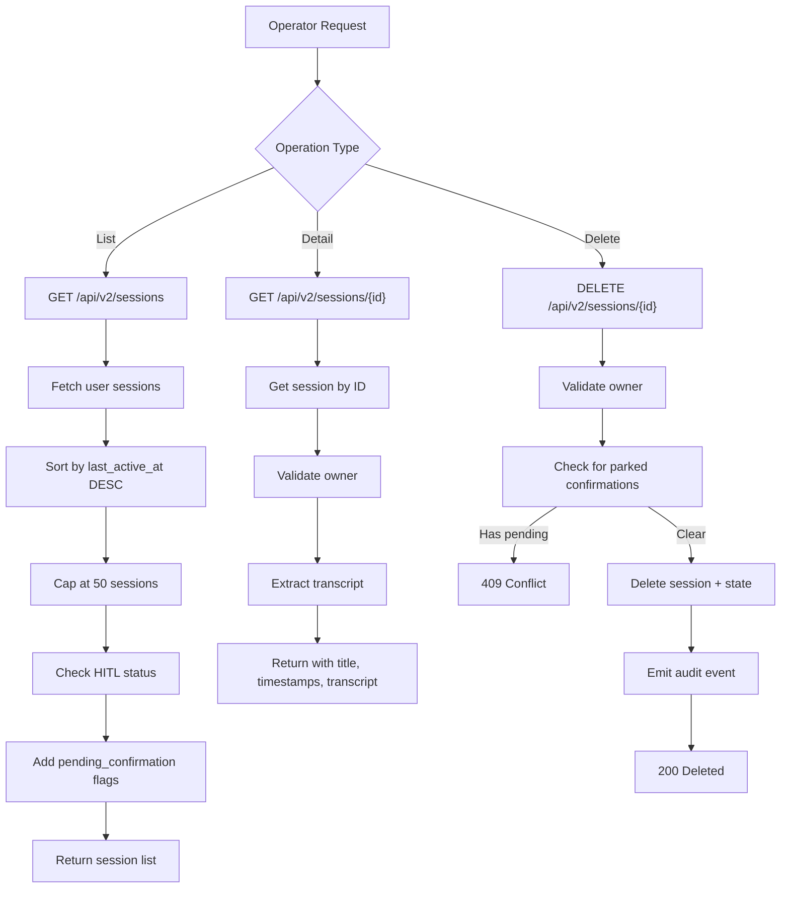
```mermaid
flowchart TD
A["Operator Request"] --> B{"Operation Type"}
B --> |List| C["GET /api/v2/sessions"]
B --> |Detail| D["GET /api/v2/sessions/{id}"]
B --> |Delete| E["DELETE /api/v2/sessions/{id}"]
C --> F["Fetch user sessions"]
F --> G["Sort by last_active_at DESC"]
G --> H["Cap at 50 sessions"]
H --> I["Check HITL status"]
I --> J["Add pending_confirmation flags"]
J --> K["Return session list"]
D --> L["Get session by ID"]
L --> M["Validate owner"]
M --> N["Extract transcript"]
N --> O["Return with title, timestamps, transcript"]
E --> P["Validate owner"]
P --> Q["Check for parked confirmations"]
Q --> |Has pending| R["409 Conflict"]
Q --> |Clear| S["Delete session + state"]
S --> T["Emit audit event"]
T --> U["200 Deleted"]
```

**Diagram sources**
- [routes.py:334-419](file://products/agent-platform/src/agent_service/api/v2/routes.py#L334-L419)
- [session_service.py:72-123](file://products/agent-platform/src/agent_service/services/session_service.py#L72-L123)

### Security Considerations
- **Anti-Enumeration**: Foreign session IDs return 404, indistinguishable from unknown IDs
- **Owner Validation**: All operations validate session ownership before processing
- **HITL Protection**: Sessions with parked confirmations cannot be deleted (409 conflict)
- **Audit Logging**: All workspace operations generate audit events for compliance
- **Role-Based Access**: Platform gateway enforces policy rules for session operations

**Section sources**
- [routes.py:334-419](file://products/agent-platform/src/agent_service/api/v2/routes.py#L334-L419)
- [session_service.py:72-123](file://products/agent-platform/src/agent_service/services/session_service.py#L72-L123)

## Session Store Enhancements

### Overview
The session store has been enhanced with workspace bookkeeping capabilities to support multi-session operator workspace functionality. These enhancements include last_active_at timestamps for activity tracking and server-minted titles for session identification.

### Enhanced Schema
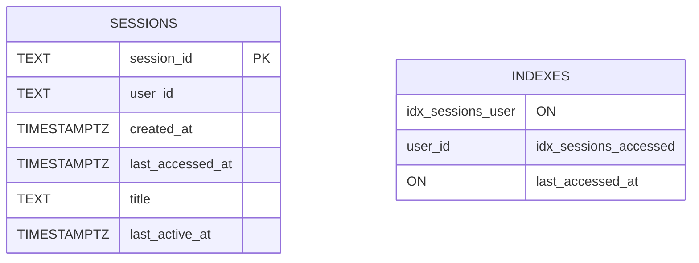
```mermaid
erDiagram
SESSIONS {
TEXT session_id PK
TEXT user_id
TIMESTAMPTZ created_at
TIMESTAMPTZ last_accessed_at
TEXT title
TIMESTAMPTZ last_active_at
}
INDEXES {
idx_sessions_user ON user_id
idx_sessions_accessed ON last_accessed_at
}
```

**Diagram sources**
- [session_store.py:327-344](file://products/agent-platform/src/agent_service/services/session_store.py#L327-L344)

### Backend Implementations
All three backend implementations support the enhanced workspace features:

- **In-Memory Store**: Supports TTL-based eviction with workspace metadata
- **Redis Store**: Uses JSON serialization with sorted sets for user-scoped listing
- **Postgres Store**: Native SQL queries with optimized indexing for workspace operations

### Workspace Bookkeeping
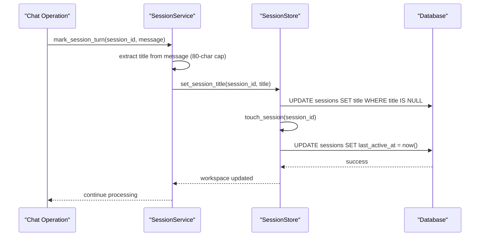
```mermaid
sequenceDiagram
participant Chat as "Chat Operation"
participant Service as "SessionService"
participant Store as "SessionStore"
participant DB as "Database"
Chat->>Service : mark_session_turn(session_id, message)
Service->>Service : extract title from message (80-char cap)
Service->>Store : set_session_title(session_id, title)
Store->>DB : UPDATE sessions SET title WHERE title IS NULL
Store->>Store : touch_session(session_id)
Store->>DB : UPDATE sessions SET last_active_at = now()
DB-->>Store : success
Store-->>Service : workspace updated
Service-->>Chat : continue processing
```

**Diagram sources**
- [session_service.py:86-102](file://products/agent-platform/src/agent_service/services/session_service.py#L86-L102)
- [session_store.py:386-398](file://products/agent-platform/src/agent_service/services/session_store.py#L386-L398)

### Performance Optimizations
- **Server-Side Sorting**: Postgres backend uses native SQL ORDER BY for efficient workspace listing
- **Indexed Queries**: Proper indexing on user_id, last_accessed_at, and last_active_at columns
- **TTL-Aware Operations**: All workspace operations respect session TTL and idle expiration
- **Fail-Open Design**: Workspace bookkeeping failures don't block core chat operations
- **Idempotent Migration**: Postgres DDL handles pre-existing deployments gracefully

**Section sources**
- [session_store.py:46-73](file://products/agent-platform/src/agent_service/services/session_store.py#L46-L73)
- [session_store.py:81-169](file://products/agent-platform/src/agent_service/services/session_store.py#L81-L169)
- [session_store.py:176-320](file://products/agent-platform/src/agent_service/services/session_store.py#L176-L320)
- [session_store.py:420-612](file://products/agent-platform/src/agent_service/services/session_store.py#L420-L612)

## Transcript Extraction Service

### Overview
The transcript extraction service provides best-effort conversation history reconstruction from kernel state snapshots. This enables workspace UIs to display conversation context without requiring live stream replay or direct database access.

### Extraction Process
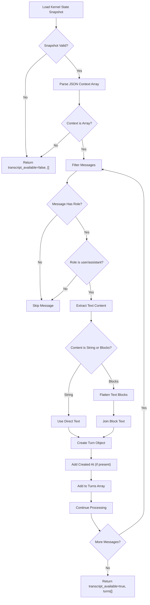
```mermaid
flowchart TD
A["Load Kernel State Snapshot"] --> B{"Snapshot Valid?"}
B --> |No| C["Return transcript_available=false, []"]
B --> |Yes| D["Parse JSON Context Array"]
D --> E{"Context is Array?"}
E --> |No| C
E --> |Yes| F["Filter Messages"]
F --> G{"Message Has Role?"}
G --> |No| H["Skip Message"]
G --> |Yes| I{"Role is user/assistant?"}
I --> |No| H
I --> |Yes| J["Extract Text Content"]
J --> K{"Content is String or Blocks?"}
K --> |String| L["Use Direct Text"]
K --> |Blocks| M["Flatten Text Blocks"]
M --> N["Join Block Text"]
L --> O["Create Turn Object"]
N --> O
O --> P["Add Created At (if present)"]
P --> Q["Add to Turns Array"]
Q --> R["Continue Processing"]
R --> S{"More Messages?"}
S --> |Yes| F
S --> |No| T["Return transcript_available=true, turns[]"]
```

**Diagram sources**
- [session_transcript.py:30-64](file://products/agent-platform/src/agent_service/services/session_transcript.py#L30-L64)

### Key Characteristics
- **Best-Effort Design**: Missing or corrupt snapshots degrade gracefully without errors
- **Role Filtering**: Only extracts user and assistant messages (excludes system/tool frames)
- **Content Flattening**: Converts block-structured content to plain text
- **Timestamp Preservation**: Maintains original message creation times when available
- **Security Boundary**: Never fabricates conversation history
- **Error Resilience**: Handles various content formats and edge cases gracefully

### Integration Points
- **Session Detail Endpoint**: Provides transcript data alongside session metadata
- **Workspace UI**: Enables conversation context display in operator interfaces
- **Audit Trail**: Transcript availability status aids in debugging and monitoring
- **Fallback Handling**: Graceful degradation when snapshots are unavailable

**Section sources**
- [session_transcript.py:1-83](file://products/agent-platform/src/agent_service/services/session_transcript.py#L1-L83)
- [routes.py:375-395](file://products/agent-platform/src/agent_service/api/v2/routes.py#L375-L395)

## HITL Confirmation Registry Integration

### Overview
The HITL (Human-In-The-Loop) confirmation registry manages parked tool confirmations for interactive workflows. When AgentScope kernel encounters tools requiring user approval, it parks the reply and waits for operator confirmation before proceeding.

### Confirmation Lifecycle
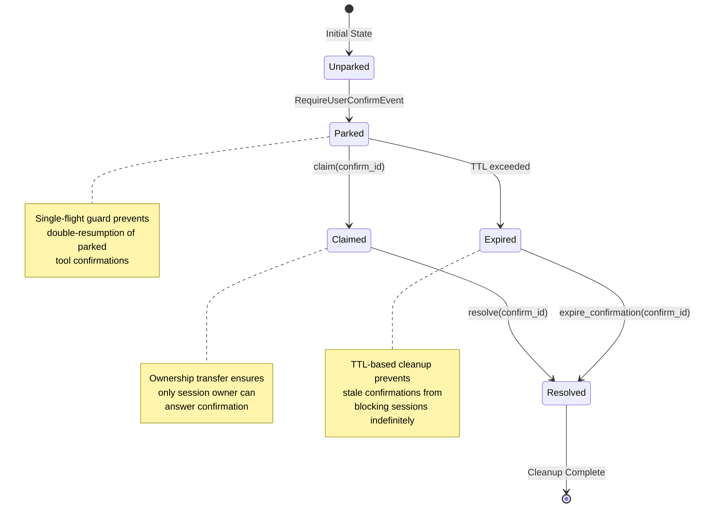
```mermaid
stateDiagram-v2
[*] --> Unparked : Initial State
Unparked --> Parked : RequireUserConfirmEvent
Parked --> Claimed : claim(confirm_id)
Claimed --> Resolved : resolve(confirm_id)
Parked --> Expired : TTL exceeded
Expired --> Resolved : expire_confirmation(confirm_id)
Resolved --> [*] : Cleanup Complete
note right of Parked
Single-flight guard prevents
double-resumption of parked
tool confirmations
end note
note right of Claimed
Ownership transfer ensures
only session owner can
answer confirmation
end note
note right of Expired
TTL-based cleanup prevents
stale confirmations from
blocking sessions indefinitely
end note
```

**Diagram sources**
- [hitl_confirmations.py:93-229](file://products/agent-platform/src/agent_service/services/hitl_confirmations.py#L93-L229)

### Core Components
- **PendingConfirmation**: Data structure holding parked tool call information
- **ConfirmationRegistry**: In-memory registry managing confirmation lifecycle
- **Risk Level Tracking**: Captures mutating tool risk levels for UI flagging
- **TTL Management**: Automatic expiration of stale confirmations
- **Owner Validation**: Ensures only session owners can answer confirmations

### Integration Patterns
- **Chat Routes**: Check for parked confirmations before processing new messages
- **Stream Events**: Surface confirmation requests to clients via SSE
- **Confirmation Endpoint**: Handle operator decisions to resume parked workflows
- **Session Protection**: Block deletion of sessions with pending confirmations

**Section sources**
- [hitl_confirmations.py:1-229](file://products/agent-platform/src/agent_service/services/hitl_confirmations.py#L1-L229)
- [routes.py:71-100](file://products/agent-platform/src/agent_service/api/v2/routes.py#L71-L100)

## Enhanced Streaming Architecture

### Overview
The streaming architecture has been enhanced with v3 protocol support, including dedicated tool_call and tool_result frames for comprehensive audit trails and evidence panel rendering.

### V3 Protocol Features
- **Tool Call Frames**: Capture tool invocation details including parameters and call IDs
- **Tool Result Frames**: Record execution outcomes with evidence and data summaries
- **Evidence Panel Support**: Structured data for UI components to display tool usage
- **Audit Trail Integration**: Seamless integration with per-request trace queues

### Stream Event Types
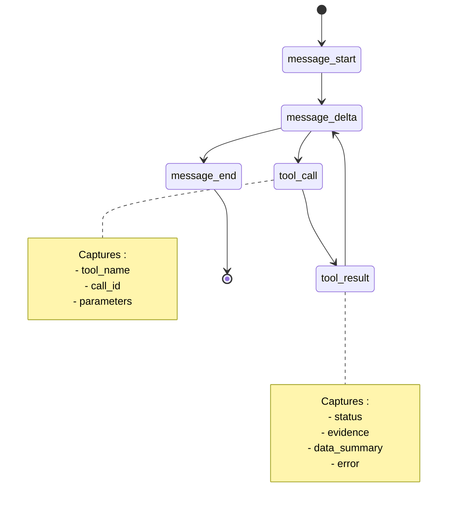
```mermaid
stateDiagram-v2
[*] --> message_start
message_start --> message_delta
message_delta --> message_end
message_delta --> tool_call
tool_call --> tool_result
tool_result --> message_delta
message_end --> [*]
note right of tool_call
Captures :
- tool_name
- call_id
- parameters
end note
note right of tool_result
Captures :
- status
- evidence
- data_summary
- error
end note
```

**Diagram sources**
- [v2.py:42-68](file://products/agent-platform/src/agent_service/schemas/v2.py#L42-L68)
- [routes.py:105-150](file://products/agent-platform/src/agent_service/api/v2/routes.py#L105-L150)

### Evidence Panel Data
The v3 protocol supports rich evidence data including:
- **Execution Context**: Tool names, parameters, and call identifiers
- **Results and Errors**: Status codes, error messages, and failure details
- **Data Summaries**: Truncated previews of large tool outputs
- **Audit Information**: Request IDs, session IDs, and timestamps

**Section sources**
- [v2.py:42-68](file://products/agent-platform/src/agent_service/schemas/v2.py#L42-L68)
- [routes.py:105-150](file://products/agent-platform/src/agent_service/api/v2/routes.py#L105-L150)
- [gateway_tools.py:212-251](file://products/agent-platform/src/agent_service/tools/gateway_tools.py#L212-L251)

## Voice Readiness Support

### Overview
The Agent Platform Service now provides comprehensive voice-readiness support through the addition of input_modality parameters to both POST /chat and GET /chat/stream endpoints. This enhancement ensures parity between synchronous and asynchronous chat interfaces while maintaining consistent policy enforcement and HITL workflows.

### Input Modality Implementation
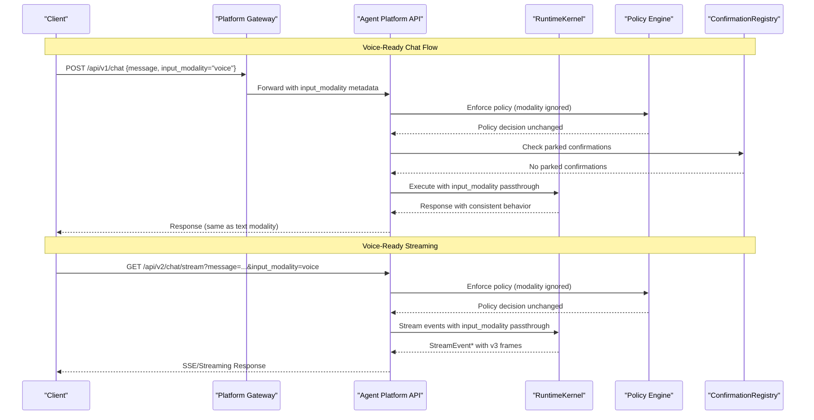
```mermaid
sequenceDiagram
participant Client as "Client"
participant Gateway as "Platform Gateway"
participant API as "Agent Platform API"
participant Kernel as "RuntimeKernel"
participant Policy as "Policy Engine"
participant HITL as "ConfirmationRegistry"
Note over Client,HITL : Voice-Ready Chat Flow
Client->>Gateway : POST /api/v1/chat {message, input_modality="voice"}
Gateway->>API : Forward with input_modality metadata
API->>Policy : Enforce policy (modality ignored)
Policy-->>API : Policy decision unchanged
API->>HITL : Check parked confirmations
HITL-->>API : No parked confirmations
API->>Kernel : Execute with input_modality passthrough
Kernel-->>API : Response with consistent behavior
API-->>Client : Response (same as text modality)
Note over Client,HITL : Voice-Ready Streaming
Client->>API : GET /api/v2/chat/stream?message=...&input_modality=voice
API->>Policy : Enforce policy (modality ignored)
Policy-->>API : Policy decision unchanged
API->>Kernel : Stream events with input_modality passthrough
Kernel-->>API : StreamEvent* with v3 frames
API-->>Client : SSE/Streaming Response
```

**Diagram sources**
- [routes.py:135-165](file://products/agent-platform/src/agent_service/api/v2/routes.py#L135-L165)
- [v2.py:31-48](file://products/agent-platform/src/agent_service/schemas/v2.py#L31-L48)
- [chat.py:90-143](file://products/platform-gateway/src/platform_gateway/api/routes/chat.py#L90-L143)

### Key Features
- **Literal Type Validation**: Strict validation of input_modality to 'text' or 'voice' values
- **Default Behavior**: Defaults to 'text' modality for backward compatibility
- **Metadata-Only**: Input modality is metadata only and never changes policy or HITL outcomes
- **Consistent Enforcement**: Same policy enforcement regardless of input modality
- **Audit Trail Integration**: Input modality is recorded in audit events for tracking
- **Test Coverage**: Comprehensive tests validate acceptance, validation, and default behavior

### API Changes
- **POST /api/v2/chat**: Accepts input_modality in request body with Literal["text", "voice"] validation
- **GET /api/v2/chat/stream**: Accepts input_modality as query parameter with Literal["text", "voice"] validation
- **Schema Validation**: Pydantic models enforce strict type checking for input_modality
- **Backward Compatibility**: Default value of 'text' ensures existing clients continue to work

### Testing and Validation
The implementation includes comprehensive test coverage:
- **Acceptance Testing**: Validates that both 'text' and 'voice' modalities are accepted
- **Validation Testing**: Ensures invalid modality values are rejected with 422 status
- **Default Behavior Testing**: Confirms default 'text' modality when not specified
- **Parity Testing**: Verifies consistent behavior across POST and GET endpoints

**Section sources**
- [routes.py:135-165](file://products/agent-platform/src/agent_service/api/v2/routes.py#L135-L165)
- [v2.py:31-48](file://products/agent-platform/src/agent_service/schemas/v2.py#L31-L48)
- [test_chat_stream_modality.py:1-63](file://products/agent-platform/tests/test_chat_stream_modality.py#L1-L63)
- [chat.py:90-143](file://products/platform-gateway/src/platform_gateway/api/routes/chat.py#L90-L143)

## Per-Request Trace Queues

### Overview
Per-request trace queues provide comprehensive audit trails for tool execution, enabling evidence panel rendering and detailed monitoring of tool usage patterns.

### Queue Architecture
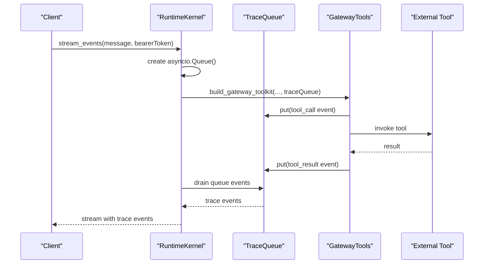
```mermaid
sequenceDiagram
participant Client as "Client"
participant Kernel as "RuntimeKernel"
participant Queue as "TraceQueue"
participant Tools as "GatewayTools"
participant External as "External Tool"
Client->>Kernel : stream_events(message, bearerToken)
Kernel->>Kernel : create asyncio.Queue()
Kernel->>Tools : build_gateway_toolkit(..., traceQueue)
Tools->>Queue : put(tool_call event)
Tools->>External : invoke tool
External-->>Tools : result
Tools->>Queue : put(tool_result event)
Kernel->>Queue : drain queue events
Queue-->>Kernel : trace events
Kernel-->>Client : stream with trace events
```

**Diagram sources**
- [runtime_kernel.py:404-447](file://products/agent-platform/src/agent_service/runtime_kernel.py#L404-L447)
- [gateway_tools.py:212-251](file://products/agent-platform/src/agent_service/tools/gateway_tools.py#L212-L251)

### Key Features
- **Isolation**: Each request gets its own trace queue for clean separation
- **Non-blocking**: Async queue operations don't block tool execution
- **Complete Coverage**: Captures both tool invocations and results
- **Structured Data**: Rich metadata including parameters, evidence, and summaries

### Trace Event Structure
Each trace event includes:
- **Event Type**: `tool_call` or `tool_result`
- **Identification**: Tool name, call ID, request ID, session ID
- **Execution Context**: Parameters, status, errors
- **Evidence Data**: Tool-specific evidence and data summaries

**Section sources**
- [runtime_kernel.py:404-447](file://products/agent-platform/src/agent_service/runtime_kernel.py#L404-L447)
- [gateway_tools.py:212-251](file://products/agent-platform/src/agent_service/tools/gateway_tools.py#L212-L251)

## Delegated Token Management

### Overview
The Agent Platform Service implements comprehensive delegated token management to ensure secure tool discovery and invocation. The runtime kernel manages per-user toolkit closures that are bound to delegated tokens, providing a secure execution context for all tool operations.

### Token Flow Architecture
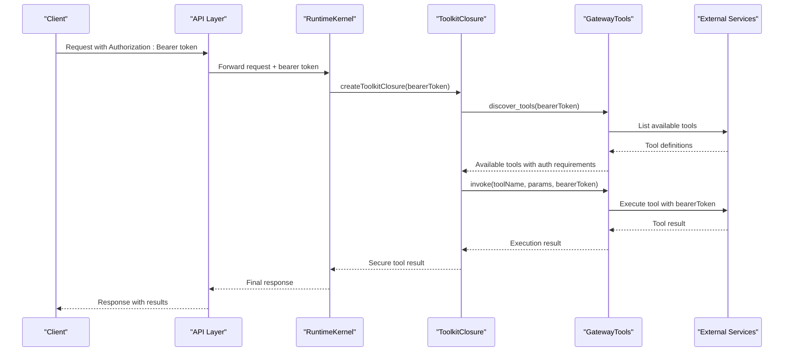
```mermaid
sequenceDiagram
participant Client as "Client"
participant API as "API Layer"
participant Kernel as "RuntimeKernel"
participant Closure as "ToolkitClosure"
participant Tools as "GatewayTools"
participant External as "External Services"
Client->>API : Request with Authorization : Bearer token
API->>Kernel : Forward request + bearer token
Kernel->>Closure : createToolkitClosure(bearerToken)
Closure->>Tools : discover_tools(bearerToken)
Tools->>External : List available tools
External-->>Tools : Tool definitions
Tools-->>Closure : Available tools with auth requirements
Closure->>Tools : invoke(toolName, params, bearerToken)
Tools->>External : Execute tool with bearerToken
External-->>Tools : Tool result
Tools-->>Closure : Execution result
Closure-->>Kernel : Secure tool result
Kernel-->>API : Final response
API-->>Client : Response with results
```

**Diagram sources**
- [runtime_kernel.py:178-223](file://products/agent-platform/src/agent_service/runtime_kernel.py#L178-L223)
- [gateway_tools.py:99-126](file://products/agent-platform/src/agent_service/tools/gateway_tools.py#L99-L126)
- [routes.py:40-47](file://products/agent-platform/src/agent_service/api/v2/routes.py#L40-L47)

### Key Features
- **Per-User Isolation**: Each user's toolkit closure is isolated and bound to their specific delegated token
- **Bearer Token Relay**: Delegated tokens are automatically converted to bearer tokens for downstream tool calls
- **Secure Discovery**: Tool discovery happens within the context of the user's delegated token
- **Context Propagation**: Authentication context flows through the entire execution pipeline
- **Lifecycle Management**: Toolkit closures are created per-request and cleaned up after execution

### Security Benefits
- Prevents token leakage between users
- Ensures tools execute with appropriate user permissions
- Provides audit trail for tool access patterns
- Maintains separation of concerns between identity and execution contexts

**Section sources**
- [runtime_kernel.py:178-223](file://products/agent-platform/src/agent_service/runtime_kernel.py#L178-L223)
- [gateway_tools.py:99-126](file://products/agent-platform/src/agent_service/tools/gateway_tools.py#L99-L126)
- [routes.py:40-47](file://products/agent-platform/src/agent_service/api/v2/routes.py#L40-L47)

## Dependency Analysis
The service has clear separation of concerns with minimal coupling between layers:
- API depends on schemas and kernel
- Kernel depends on session service, provider registry, and tools
- Providers are independent implementations registered at runtime
- Session service abstracts storage backend
- Cross-cutting concerns are injected into the application lifecycle

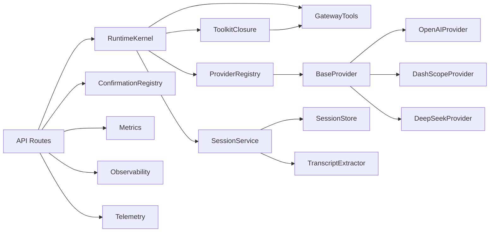
```mermaid
graph LR
API["API Routes"] --> Kernel["RuntimeKernel"]
Kernel --> Session["SessionService"]
Kernel --> Registry["ProviderRegistry"]
Kernel --> Tools["GatewayTools"]
Kernel --> Closure["ToolkitClosure"]
Registry --> Base["BaseProvider"]
Base --> OpenAI["OpenAIProvider"]
Base --> DashScope["DashScopeProvider"]
Base --> DeepSeek["DeepSeekProvider"]
Session --> Store["SessionStore"]
Session --> Transcript["TranscriptExtractor"]
API --> HITL["ConfirmationRegistry"]
API --> Metrics["Metrics"]
API --> Obs["Observability"]
API --> Tel["Telemetry"]
Closure --> Tools
```

**Updated** The dependency graph now shows the enhanced toolkit registration pattern with per-request trace queues, auto-approval mechanism, v3 streaming support, multi-session workspace foundations, and voice-readiness support through input_modality parameter passthrough.

**Diagram sources**
- [routes.py](file://products/agent-platform/src/agent_service/api/v2/routes.py)
- [runtime_kernel.py](file://products/agent-platform/src/agent_service/runtime_kernel.py)
- [session_service.py](file://products/agent-platform/src/agent_service/services/session_service.py)
- [registry.py](file://products/agent-platform/src/agent_service/providers/registry.py)
- [base.py](file://products/agent-platform/src/agent_service/providers/base.py)
- [openai.py](file://products/agent-platform/src/agent_service/providers/openai.py)
- [dashscope.py](file://products/agent-platform/src/agent_service/providers/dashscope.py)
- [deepseek.py](file://products/agent-platform/src/agent_service/providers/deepseek.py)
- [session_store.py](file://products/agent-platform/src/agent_service/services/session_store.py)
- [session_transcript.py](file://products/agent-platform/src/agent_service/services/session_transcript.py)
- [hitl_confirmations.py](file://products/agent-platform/src/agent_service/services/hitl_confirmations.py)
- [metrics.py](file://products/agent-platform/src/agent_service/core/metrics.py)
- [observability.py](file://products/agent-platform/src/agent_service/core/observability.py)
- [telemetry.py](file://products/agent-platform/src/agent_service/core/telemetry.py)
- [gateway_tools.py](file://products/agent-platform/src/agent_service/tools/gateway_tools.py)

**Section sources**
- [runtime_dependencies.py](file://products/agent-platform/src/agent_service/services/runtime_dependencies.py)

## Performance Considerations
- Streaming responses reduce latency by emitting events incrementally with v3 protocol support
- Connection pooling for provider HTTP clients improves throughput
- Session store caching minimizes I/O overhead
- Async processing for long-running operations prevents blocking
- Metrics collection enables performance monitoring and bottleneck identification
- Request context propagation ensures efficient tracing across components
- Toolkit closure caching reduces overhead for repeated tool invocations within the same request
- Per-request trace queues minimize memory footprint through efficient queue management
- Anti-hallucination guards prevent unnecessary tool discovery when tools are unavailable
- Auto-approval mechanism eliminates permission prompt overhead for vetted read-only tools
- **Workspace Optimization**: Server-side sorting in Postgres backend for efficient session listing
- **TTL-Aware Operations**: All workspace operations respect session TTL to prevent resource leaks
- **Fail-Open Design**: Workspace bookkeeping failures don't impact core chat performance
- **Transcript Extraction**: Best-effort design ensures degraded performance without errors
- **Voice Readiness**: Input modality parameter adds minimal overhead as metadata-only processing

**Updated** Performance considerations now include multi-session workspace optimizations, server-side sorting capabilities, TTL-aware operations, fail-open workspace bookkeeping that doesn't impact core chat performance, and voice-readiness support with minimal overhead through metadata-only processing.

## Troubleshooting Guide
Common issues and resolutions:
- Provider connection failures: Verify API keys, endpoints, and network connectivity
- Session persistence errors: Check storage backend availability and permissions
- Streaming interruptions: Monitor network stability and timeout configurations
- Performance degradation: Analyze metrics for slow providers or storage bottlenecks
- Configuration errors: Validate environment variables and runtime settings
- Delegated token issues: Verify token validity, expiration, and permission scope
- Tool invocation failures: Check bearer token relay and tool-specific authentication
- Empty toolkit issues: Ensure AgentScope 2.x toolkit registration is working correctly
- Hallucination problems: Verify NO_TOOLS_NOTICE injection when tools are unavailable
- Trace queue issues: Check per-request queue creation and event emission
- Headless stream stalls: Verify auto-approval configuration for vetted read-only tools
- Permission prompt issues: Check if tools are properly configured as read-only and on allow-list
- **Workspace Issues**: Verify session store backend connectivity and workspace bookkeeping operations
- **Transcript Problems**: Check kernel state snapshot availability and format compatibility
- **HITL Issues**: Verify confirmation registry state and TTL configuration
- **Session Listing**: Check user session filtering and workspace ordering logic
- **Voice Readiness Issues**: Validate input_modality parameter acceptance and Literal type validation
- **Modality Validation**: Ensure 'text' and 'voice' values are accepted, invalid values return 422
- **Parity Issues**: Verify consistent behavior between POST /chat and GET /chat/stream endpoints

Debugging utilities:
- Health check endpoints for service status
- Structured logging with correlation IDs
- Metrics endpoints for operational insights
- Telemetry traces for request flow analysis
- Token validation endpoints for debugging delegated token flow
- Tool schema inspection for verifying toolkit registration
- Trace event monitoring for audit trail analysis
- Environment variable inspection for auto-allow-list configuration
- **Workspace Monitoring**: Check session store backend status and workspace operation metrics
- **Transcript Debugging**: Verify kernel state snapshot availability and transcript extraction logs
- **HITL Debugging**: Monitor confirmation registry state and parked confirmation lifecycle
- **Session Audit**: Review audit trail for session workspace operations
- **Voice Readiness Debugging**: Validate input_modality parameter handling and modality-specific behaviors

**Updated** Troubleshooting guide now includes multi-session workspace troubleshooting, transcript extraction debugging strategies, HITL confirmation registry diagnostics, workspace operation monitoring, and voice-readiness debugging with input_modality parameter validation and parity testing.

**Section sources**
- [metrics.py](file://products/agent-platform/src/agent_service/core/metrics.py)
- [observability.py](file://products/agent-platform/src/agent_service/core/observability.py)
- [telemetry.py](file://products/agent-platform/src/agent_service/core/telemetry.py)
- [request_context.py](file://products/agent-platform/src/agent_service/core/request_context.py)

## Conclusion
The Agent Platform Service provides a robust foundation for AI agent orchestration with multi-provider support, durable session management, and comprehensive observability. Its modular architecture enables easy customization and scaling while maintaining high performance and reliability.

**Updated** The service now includes comprehensive voice-readiness support through input_modality parameters on both POST /chat and GET /chat/stream endpoints, ensuring parity between synchronous and asynchronous interfaces while maintaining consistent policy enforcement and HITL workflows. The service also includes comprehensive multi-session operator workspace foundations with v2 session routes, enhanced session stores supporting last_active_at timestamps and server-minted titles, transcript extraction capabilities for conversation history reconstruction, and integrated HITL confirmation registry for human-in-the-loop workflows. These enhancements enable operators to manage conversation state, resume sessions by ID, and maintain workspace organization while preserving security through anti-enumeration patterns and role-based access control. The service also includes enhanced security through delegated token management, AgentScope 2.x toolkit registration pattern, anti-hallucination guards, auto-approval mechanism for vetted tools, v3 streaming architecture with comprehensive audit trails, and per-request trace queues. These improvements strengthen the platform's security posture, prevent model hallucinations, eliminate headless stream stalls, and provide detailed operational visibility while maintaining the flexibility and performance characteristics that make it suitable for production AI operations.

## Appendices

### Practical Examples

#### Agent Development
- Define agent behavior through conversation templates and tool integrations
- Use the runtime kernel to manage agent lifecycle and state with AgentScope 2.x compatibility
- Implement custom tools for domain-specific operations with proper toolkit registration
- Leverage delegated tokens for secure tool execution with per-request isolation

#### Provider Customization
- Extend the base provider interface for new model backends using AgentScope 2.x patterns
- Register custom providers in the registry with proper model construction
- Configure provider-specific settings through environment variables with enhanced parameter support

#### Integration Patterns
- Use the API gateway for unified access to multiple agents with v3 streaming support
- Implement policy enforcement for security and compliance with audit trail integration
- Leverage streaming responses for real-time interactions with tool_call/tool_result frames
- Utilize per-request toolkit closures for secure multi-tenant scenarios with comprehensive audit trails

#### Anti-Hallucination Strategies
- Configure NO_TOOLS_NOTICE thresholds based on operational requirements
- Monitor tool discovery success rates and adjust accordingly
- Implement fallback mechanisms when tools are unavailable
- Use evidence panels to visualize tool usage and prevent fabrication

#### Auto-Approval Configuration
- Customize the allow-list via `AGENT_GATEWAY_TOOL_AUTO_ALLOW` environment variable
- Ensure tools are properly marked as read-only in tool definitions
- Monitor tool execution logs to verify auto-approval is working correctly
- Regularly review and update the allow-list based on security policies

#### Multi-Session Workspace Operations
- **Session Management**: Create, list, and delete sessions with proper authorization
- **Workspace Organization**: Use server-minted titles and last_active_at timestamps for organization
- **Transcript Access**: Retrieve conversation history from kernel state snapshots
- **HITL Integration**: Handle parked confirmations and interactive workflows
- **Audit Compliance**: Monitor workspace operations through audit trails

#### Voice Readiness Implementation
- **Input Modality**: Use input_modality parameter for voice-based interactions
- **Consistent Behavior**: Ensure same policy enforcement regardless of input modality
- **Testing**: Validate both 'text' and 'voice' modalities work consistently
- **Backward Compatibility**: Default to 'text' modality for existing clients
- **Audit Trail**: Track input modality in audit events for monitoring and analysis

**Updated** Practical examples now include guidance on leveraging AgentScope 2.x toolkit registration, anti-hallucination guards, auto-approval mechanism, v3 streaming protocols, per-request trace queues, comprehensive multi-session workspace operations, and voice-readiness support with input_modality parameters for complete operator workflow management.

**Section sources**
- [runtime_kernel.py](file://products/agent-platform/src/agent_service/runtime_kernel.py)
- [registry.py](file://products/agent-platform/src/agent_service/providers/registry.py)
- [base.py](file://products/agent-platform/src/agent_service/providers/base.py)
- [routes.py](file://products/agent-platform/src/agent_service/api/v2/routes.py)
- [session_service.py](file://products/agent-platform/src/agent_service/services/session_service.py)
- [session_store.py](file://products/agent-platform/src/agent_service/services/session_store.py)
- [session_transcript.py](file://products/agent-platform/src/agent_service/services/session_transcript.py)
- [hitl_confirmations.py](file://products/agent-platform/src/agent_service/services/hitl_confirmations.py)
- [gateway_tools.py](file://products/agent-platform/src/agent_service/tools/gateway_tools.py)
- [v2.py](file://products/agent-platform/src/agent_service/schemas/v2.py)
- [test_chat_stream_modality.py](file://products/agent-platform/tests/test_chat_stream_modality.py)