# Agent Platform Service

<cite>
**Referenced Files in This Document**
- [main.py](file://products/agent-platform/src/agent_service/main.py)
- [app.py](file://products/agent-platform/src/agent_service/app.py)
- [agent_app.py](file://products/agent-platform/src/agent_service/agent_app.py)
- [runtime_kernel.py](file://products/agent-platform/src/agent_service/runtime_kernel.py)
- [runtime_settings.py](file://products/agent-platform/src/agent_service/runtime_settings.py)
- [config.py](file://products/agent-platform/src/agent_service/core/config.py)
- [env.py](file://products/agent-platform/src/agent_service/core/env.py)
- [metrics.py](file://products/agent-platform/src/agent_service/core/metrics.py)
- [observability.py](file://products/agent-platform/src/agent_service/core/observability.py)
- [telemetry.py](file://products/agent-platform/src/agent_service/core/telemetry.py)
- [request_context.py](file://products/agent-platform/src/agent_service/core/request_context.py)
- [routes.py](file://products/agent-platform/src/agent_service/api/v2/routes.py)
- [api.py](file://products/agent-platform/src/agent_service/schemas/api.py)
- [v2.py](file://products/agent-platform/src/agent_service/schemas/v2.py)
- [base.py](file://products/agent-platform/src/agent_service/providers/base.py)
- [openai.py](file://products/agent-platform/src/agent_service/providers/openai.py)
- [dashscope.py](file://products/agent-platform/src/agent_service/providers/dashscope.py)
- [deepseek.py](file://products/agent-platform/src/agent_service/providers/deepseek.py)
- [registry.py](file://products/agent-platform/src/agent_service/providers/registry.py)
- [session_service.py](file://products/agent-platform/src/agent_service/services/session_service.py)
- [session_store.py](file://products/agent-platform/src/agent_service/services/session_store.py)
- [runtime_service.py](file://products/agent-platform/src/agent_service/services/runtime_service.py)
- [runtime_dependencies.py](file://products/agent-platform/src/agent_service/services/runtime_dependencies.py)
- [gateway_tools.py](file://products/agent-platform/src/agent_service/tools/gateway_tools.py)
- [pyproject.toml](file://products/agent-platform/pyproject.toml)
- [Dockerfile](file://products/agent-platform/Dockerfile)
- [README.md](file://products/agent-platform/README.md)
</cite>

## Update Summary
**Changes Made**
- Updated runtime kernel to reflect AgentScope 2.x toolkit registration pattern migration with proper constructor-based toolkit building
- Enhanced anti-hallucination guard system with deterministic NO_TOOLS_NOTICE injection for empty toolkits
- Added comprehensive documentation for auto-approval mechanism of vetted read-only tools to prevent headless stream stalls
- Documented v3 stream contract extension with tool_call and tool_result frame support for evidence panels
- Updated provider implementations to use new AgentScope 2.x model construction patterns with enhanced parameter support
- Enhanced security documentation for delegated token management and bearer token relay mechanisms

## Table of Contents
1. [Introduction](#introduction)
2. [Project Structure](#project-structure)
3. [Core Components](#core-components)
4. [Architecture Overview](#architecture-overview)
5. [Detailed Component Analysis](#detailed-component-analysis)
6. [AgentScope 2.x Toolkit Registration Pattern](#agentscope-2x-toolkit-registration-pattern)
7. [Anti-Hallucination Guard System](#anti-hallucination-guard-system)
8. [Auto-Approval Mechanism for Vetted Tools](#auto-approval-mechanism-for-vetted-tools)
9. [Enhanced Streaming Architecture](#enhanced-streaming-architecture)
10. [Per-Request Trace Queues](#per-request-trace-queues)
11. [Delegated Token Management](#delegated-token-management)
12. [Dependency Analysis](#dependency-analysis)
13. [Performance Considerations](#performance-considerations)
14. [Troubleshooting Guide](#troubleshooting-guide)
15. [Conclusion](#conclusion)
16. [Appendices](#appendices)

## Introduction
The Agent Platform Service is the core orchestration engine of the Luban AIOps Platform. It provides a runtime kernel for agent execution, a provider registry for multi-model backends (OpenAI, DashScope, DeepSeek), and robust session management with durable storage. The service exposes REST APIs for agent interactions, streaming responses, and configuration management, enabling scalable and observable AI operations across diverse model providers.

**Updated** The service has been migrated to AgentScope 2.x toolkit registration pattern with critical compatibility fixes including proper constructor-based toolkit construction, auto-approval of vetted read-only tools to prevent headless stream stalls, and v3 stream contract support with tool_call/tool_result frames for comprehensive audit trails and evidence panel rendering.

## Project Structure
The Agent Platform Service is implemented as a Python FastAPI application organized by feature layers:
- Entrypoints and application bootstrapping
- API routes and request/response schemas
- Runtime kernel and settings
- Provider implementations and registry
- Session services and stores
- Tools and integrations
- Core cross-cutting concerns (configuration, observability, metrics, telemetry, request context)

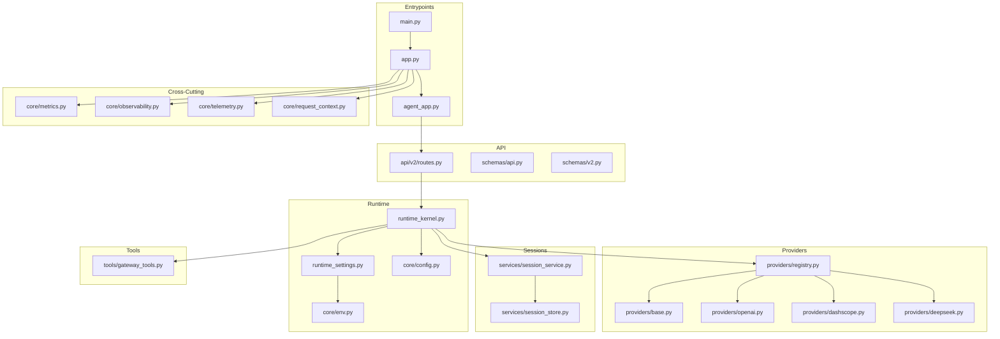

**Diagram sources**
- [main.py](file://products/agent-platform/src/agent_service/main.py)
- [app.py](file://products/agent-platform/src/agent_service/app.py)
- [agent_app.py](file://products/agent-platform/src/agent_service/agent_app.py)
- [routes.py](file://products/agent-platform/src/agent_service/api/v2/routes.py)
- [runtime_kernel.py](file://products/agent-platform/src/agent_service/runtime_kernel.py)
- [runtime_settings.py](file://products/agent-platform/src/agent_service/runtime_settings.py)
- [config.py](file://products/agent-platform/src/agent_service/core/config.py)
- [env.py](file://products/agent-platform/src/agent_service/core/env.py)
- [base.py](file://products/agent-platform/src/agent_service/providers/base.py)
- [openai.py](file://products/agent-platform/src/agent_service/providers/openai.py)
- [dashscope.py](file://products/agent-platform/src/agent_service/providers/dashscope.py)
- [deepseek.py](file://products/agent-platform/src/agent_service/providers/deepseek.py)
- [registry.py](file://products/agent-platform/src/agent_service/providers/registry.py)
- [session_service.py](file://products/agent-platform/src/agent_service/services/session_service.py)
- [session_store.py](file://products/agent-platform/src/agent_service/services/session_store.py)
- [gateway_tools.py](file://products/agent-platform/src/agent_service/tools/gateway_tools.py)
- [metrics.py](file://products/agent-platform/src/agent_service/core/metrics.py)
- [observability.py](file://products/agent-platform/src/agent_service/core/observability.py)
- [telemetry.py](file://products/agent-platform/src/agent_service/core/telemetry.py)
- [request_context.py](file://products/agent-platform/src/agent_service/core/request_context.py)

**Section sources**
- [README.md](file://products/agent-platform/README.md)
- [pyproject.toml](file://products/agent-platform/pyproject.toml)
- [Dockerfile](file://products/agent-platform/Dockerfile)

## Core Components
- Runtime Kernel: Orchestrates agent lifecycle, conversation state, tool invocation, and provider dispatch with enhanced AgentScope 2.x toolkit registration and anti-hallucination guards.
- Provider Registry: Discovers and manages model providers (OpenAI, DashScope, DeepSeek) with pluggable interfaces using new AgentScope 2.x model construction patterns.
- Session Management: Persists and restores conversations with durable storage and concurrency-safe access.
- API Layer: Exposes REST endpoints for chat, sessions, streaming events, and health checks with v3 streaming protocol support.
- Cross-Cutting: Configuration, environment, metrics, observability, telemetry, and request-scoped context.

Key responsibilities:
- Lifecycle: Initialize, start, run, and shutdown agents safely with AgentScope 2.x compatibility.
- Conversation: Maintain message history, context, and state per session.
- Streaming: Emit incremental events to clients over HTTP streaming with v3 tool_call/tool_result frames.
- Security: Manage per-user toolkit closures bound to delegated tokens for secure tool execution.
- Anti-Hallucination: Prevent model fabrication through systematic NO_TOOLS_NOTICE injection.
- Auto-Approval: Pre-approve vetted read-only tools to prevent headless stream stalls while maintaining security.
- Observability: Emit structured logs, metrics, and traces for each operation with per-request audit trails.

**Updated** The runtime kernel now implements AgentScope 2.x toolkit registration pattern, anti-hallucination guards, auto-approval mechanism for vetted tools, and enhanced streaming architecture with comprehensive audit trail support through per-request trace queues.

**Section sources**
- [runtime_kernel.py](file://products/agent-platform/src/agent_service/runtime_kernel.py)
- [registry.py](file://products/agent-platform/src/agent_service/providers/registry.py)
- [session_service.py](file://products/agent-platform/src/agent_service/services/session_service.py)
- [routes.py](file://products/agent-platform/src/agent_service/api/v2/routes.py)
- [metrics.py](file://products/agent-platform/src/agent_service/core/metrics.py)
- [observability.py](file://products/agent-platform/src/agent_service/core/observability.py)
- [telemetry.py](file://products/agent-platform/src/agent_service/core/telemetry.py)
- [request_context.py](file://products/agent-platform/src/agent_service/core/request_context.py)

## Architecture Overview
The service follows a layered architecture with enhanced security and anti-hallucination features:
- API layer receives requests, validates payloads, and delegates to the runtime kernel with v3 streaming support.
- Runtime kernel coordinates sessions, tools, and provider selection via the registry with AgentScope 2.x toolkit registration.
- Providers implement standardized interfaces to communicate with external model APIs using new model construction patterns.
- Session service persists state using a configurable store.
- Cross-cutting modules provide configuration, metrics, observability, and telemetry with per-request audit trails.

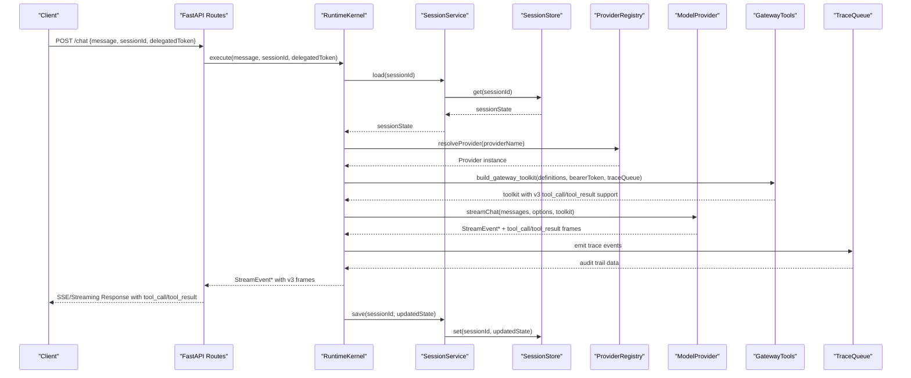

**Updated** The sequence diagram now shows the complete AgentScope 2.x toolkit registration flow, including per-request trace queue creation, auto-approval of vetted tools, and v3 streaming event handling with tool_call/tool_result frames for audit trails.

**Diagram sources**
- [routes.py](file://products/agent-platform/src/agent_service/api/v2/routes.py)
- [runtime_kernel.py](file://products/agent-platform/src/agent_service/runtime_kernel.py)
- [session_service.py](file://products/agent-platform/src/agent_service/services/session_service.py)
- [session_store.py](file://products/agent-platform/src/agent_service/services/session_store.py)
- [registry.py](file://products/agent-platform/src/agent_service/providers/registry.py)
- [base.py](file://products/agent-platform/src/agent_service/providers/base.py)
- [gateway_tools.py](file://products/agent-platform/src/agent_service/tools/gateway_tools.py)

## Detailed Component Analysis

### Runtime Kernel
The runtime kernel is the central orchestrator for agent execution with enhanced AgentScope 2.x compatibility and anti-hallucination features. It manages:
- Agent lifecycle initialization and shutdown with AgentScope 2.x toolkit registration
- Conversation state transitions with per-request toolkit rebuilding
- Tool invocation and result aggregation with v3 streaming support
- Provider selection and streaming event handling with trace queue integration
- Anti-hallucination guard system with NO_TOOLS_NOTICE injection
- Auto-approval mechanism for vetted read-only tools to prevent headless stream stalls

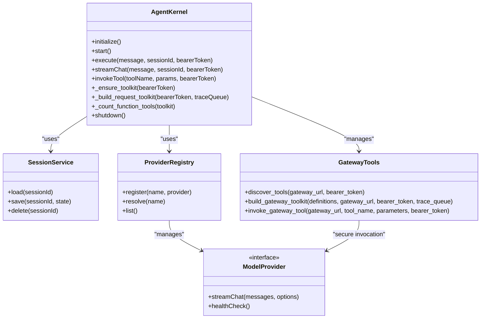

**Updated** The runtime kernel now includes AgentScope 2.x toolkit registration, per-request toolkit rebuilding with trace queues, anti-hallucination guard system, and auto-approval mechanism for preventing headless stream stalls.

**Diagram sources**
- [runtime_kernel.py](file://products/agent-platform/src/agent_service/runtime_kernel.py)
- [session_service.py](file://products/agent-platform/src/agent_service/services/session_service.py)
- [registry.py](file://products/agent-platform/src/agent_service/providers/registry.py)
- [base.py](file://products/agent-platform/src/agent_service/providers/base.py)
- [gateway_tools.py](file://products/agent-platform/src/agent_service/tools/gateway_tools.py)

**Section sources**
- [runtime_kernel.py](file://products/agent-platform/src/agent_service/runtime_kernel.py)

### Provider Registry and Implementations
The provider registry supports multiple model backends through a common interface. Implementations include OpenAI, DashScope, and DeepSeek, all updated to use AgentScope 2.x model construction patterns with enhanced parameter support.

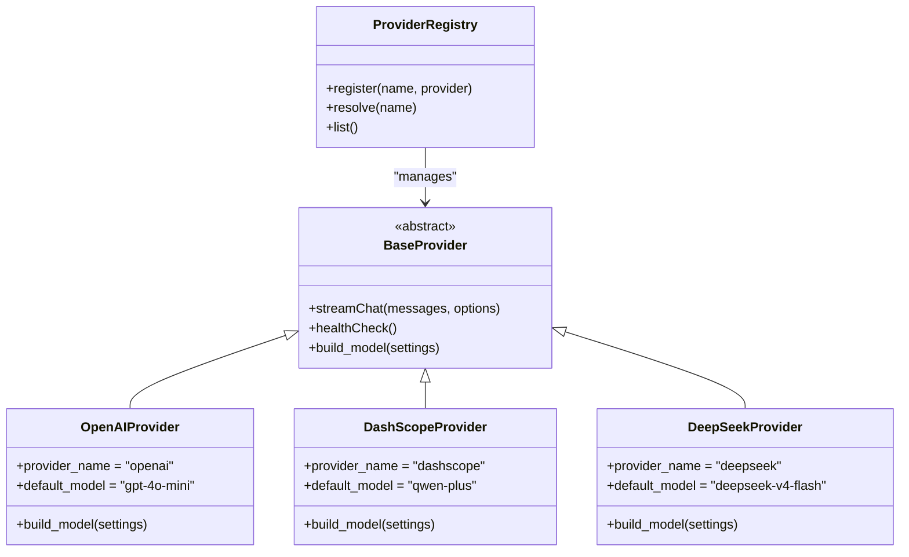

Configuration examples:
- OpenAI: Configure API key, model name, organization, and reasoning effort via environment variables or runtime settings.
- DashScope: Set endpoint URL, credentials, thinking budget, and parallel tool calls; select model variant.
- DeepSeek: Provide authentication token, target model identifier, and reasoning effort level.

**Updated** All provider implementations now use AgentScope 2.x model construction patterns with enhanced parameter support including reasoning effort, thinking enable flags, and parallel tool calls.

**Section sources**
- [base.py](file://products/agent-platform/src/agent_service/providers/base.py)
- [openai.py](file://products/agent-platform/src/agent_service/providers/openai.py)
- [dashscope.py](file://products/agent-platform/src/agent_service/providers/dashscope.py)
- [deepseek.py](file://products/agent-platform/src/agent_service/providers/deepseek.py)
- [registry.py](file://products/agent-platform/src/agent_service/providers/registry.py)
- [runtime_settings.py](file://products/agent-platform/src/agent_service/runtime_settings.py)
- [config.py](file://products/agent-platform/src/agent_service/core/config.py)
- [env.py](file://products/agent-platform/src/agent_service/core/env.py)

### Session Management
Session management ensures durable conversation state across requests. The session service abstracts persistence behind a store interface, supporting in-memory or Redis-backed storage.

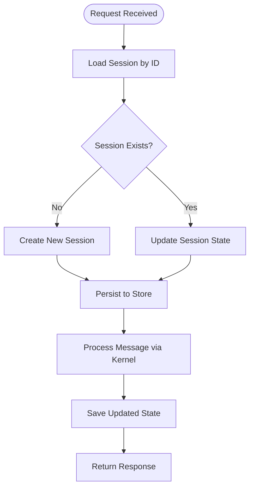

**Diagram sources**
- [session_service.py](file://products/agent-platform/src/agent_service/services/session_service.py)
- [session_store.py](file://products/agent-platform/src/agent_service/services/session_store.py)

**Section sources**
- [session_service.py](file://products/agent-platform/src/agent_service/services/session_service.py)
- [session_store.py](file://products/agent-platform/src/agent_service/services/session_store.py)

### API Endpoints
The API layer exposes REST endpoints for agent interactions, session management, and health checks. Requests are validated against schemas and routed to the runtime kernel with v3 streaming protocol support.

Typical endpoints:
- Chat: POST /chat with message, optional session ID, and delegated token
- Sessions: GET/POST/DELETE /sessions for lifecycle management
- Health: GET /health for readiness and liveness probes
- Streaming: Server-sent events for incremental responses with v3 tool_call/tool_result frames

Request/response validation uses Pydantic models defined in schemas with enhanced v3 streaming event types.

**Updated** Chat endpoints now accept delegated tokens for secure tool execution and support v3 streaming protocol with tool_call/tool_result frames for comprehensive audit trails.

**Section sources**
- [routes.py](file://products/agent-platform/src/agent_service/api/v2/routes.py)
- [api.py](file://products/agent-platform/src/agent_service/schemas/api.py)
- [v2.py](file://products/agent-platform/src/agent_service/schemas/v2.py)

### Tools Integration
The service integrates with external tools through a gateway abstraction. Tools can be invoked during agent execution to perform actions like Kubernetes operations or data retrieval with enhanced AgentScope 2.x compatibility.

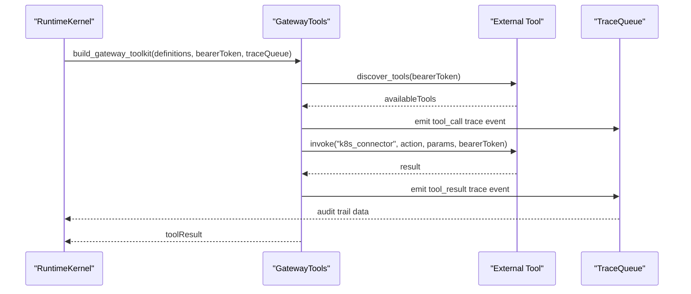

**Updated** The tools integration now includes AgentScope 2.x toolkit registration pattern, per-request trace queues for audit trails, v3 streaming support with tool_call/tool_result frames, and auto-approval mechanism for vetted read-only tools.

**Diagram sources**
- [gateway_tools.py](file://products/agent-platform/src/agent_service/tools/gateway_tools.py)
- [runtime_kernel.py](file://products/agent-platform/src/agent_service/runtime_kernel.py)

**Section sources**
- [gateway_tools.py](file://products/agent-platform/src/agent_service/tools/gateway_tools.py)

## AgentScope 2.x Toolkit Registration Pattern

### Overview
The platform has been migrated from the legacy `Toolkit.add()` method to AgentScope 2.x's constructor-based toolkit registration pattern. This change addresses critical issues where empty toolkits were silently created, leading to model hallucinations and fabricated responses.

### Key Changes
- **Constructor-Based Registration**: Tools are now passed directly to `Toolkit(tools=[FunctionTool(...)])` instead of using non-existent `Toolkit.add()` methods
- **Per-Request Toolkit Rebuilding**: Each request builds fresh toolkits with appropriate trace queues for audit trails
- **Enhanced Error Handling**: Failed tool registrations are logged as warnings rather than causing hard failures
- **Schema Validation**: Input schemas are normalized to ensure compatibility with AgentScope 2.x requirements

### Implementation Details
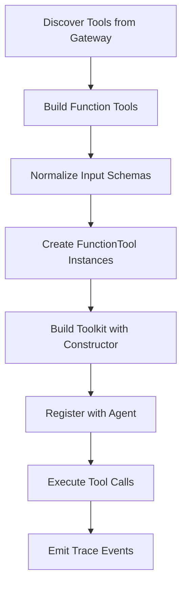

**Diagram sources**
- [gateway_tools.py:313-334](file://products/agent-platform/src/agent_service/tools/gateway_tools.py#L313-L334)
- [runtime_kernel.py:225-250](file://products/agent-platform/src/agent_service/runtime_kernel.py#L225-L250)

### Benefits
- **Prevents Hallucinations**: Ensures tools are properly registered before agent execution
- **Improved Reliability**: Eliminates silent failures from missing toolkit methods
- **Better Audit Trails**: Per-request toolkits enable comprehensive tool usage tracking
- **Enhanced Security**: Each toolkit is bound to specific user credentials

**Section sources**
- [gateway_tools.py:313-334](file://products/agent-platform/src/agent_service/tools/gateway_tools.py#L313-L334)
- [runtime_kernel.py:225-250](file://products/agent-platform/src/agent_service/runtime_kernel.py#L225-L250)
- [test_runtime_kernel.py:338-402](file://products/agent-platform/tests/test_runtime_kernel.py#L338-L402)

## Anti-Hallucination Guard System

### Overview
The NO_TOOLS_NOTICE system prevents model hallucinations when tool discovery returns no available tools. This deterministic guard injects explicit system notices into the conversation when the risk of fabrication exists.

### Guard Mechanism
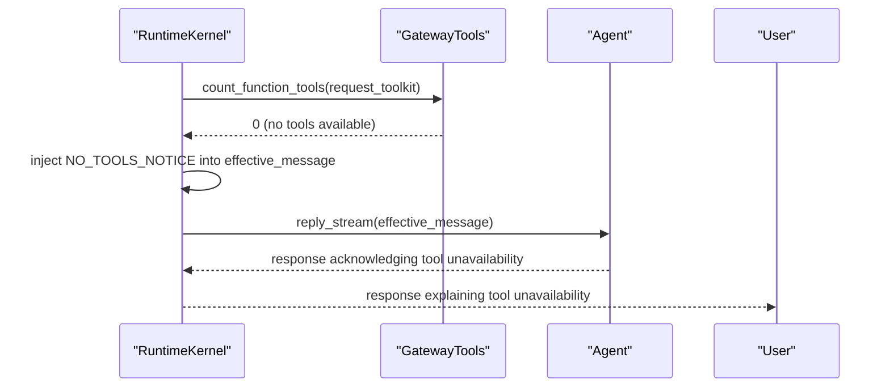

**Diagram sources**
- [runtime_kernel.py:20-32](file://products/agent-platform/src/agent_service/runtime_kernel.py#L20-L32)
- [runtime_kernel.py:415-424](file://products/agent-platform/src/agent_service/runtime_kernel.py#L415-L424)

### Key Features
- **Deterministic Detection**: Uses `_count_function_tools()` to check for actual function tools
- **Explicit Notice Injection**: Adds clear system notice to prevent model fabrication
- **Contextual Messaging**: Preserves original user message while adding anti-hallucination guidance
- **Logging and Monitoring**: Logs warnings when no tools are detected for operational visibility

### Guard Message Content
The NO_TOOLS_NOTICE explicitly instructs the model to:
- Acknowledge tool unavailability
- Avoid reporting infrastructure status without real data
- Refrain from estimating or implying metrics
- Direct users to operational tooling availability

**Section sources**
- [runtime_kernel.py:20-32](file://products/agent-platform/src/agent_service/runtime_kernel.py#L20-L32)
- [runtime_kernel.py:415-424](file://products/agent-platform/src/agent_service/runtime_kernel.py#L415-L424)

## Auto-Approval Mechanism for Vetted Tools

### Overview
The auto-approval mechanism prevents headless streams from stalling when AgentScope 2.x requires interactive permission confirmation for custom tools. Only vetted read-only tools on an explicit allow-list are pre-approved, while all other tools maintain the default ASK behavior.

### Permission Flow Architecture
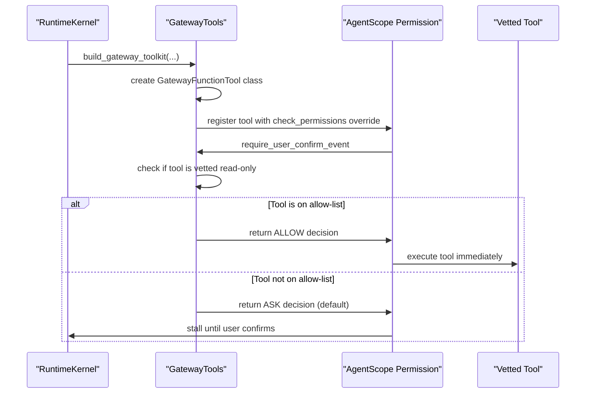

**Diagram sources**
- [gateway_tools.py:64-96](file://products/agent-platform/src/agent_service/tools/gateway_tools.py#L64-L96)
- [gateway_tools.py:283-310](file://products/agent-platform/src/agent_service/tools/gateway_tools.py#L283-L310)

### Key Features
- **Allow-List Based**: Only explicitly vetted tools receive auto-approval
- **Read-Only Enforcement**: Auto-approval only applies to tools marked as read-only
- **Environment Override**: Deployment-specific allow-list customization via `AGENT_GATEWAY_TOOL_AUTO_ALLOW`
- **Security Maintained**: Tool-gateway still enforces admission and policy on every invocation
- **Default Safety**: Non-vetted tools maintain ASK behavior to prevent unauthorized execution

### Default Allow-List
The system includes a curated list of safe, read-only tools:
- `k8s.list_pods`: List pods in Kubernetes clusters
- `k8s.get_pod`: Get pod details and status
- `k8s.get_events`: Retrieve cluster events
- `k8s.get_pod_logs`: Access pod log output

### Configuration
Customize the allow-list via environment variable:
```bash
AGENT_GATEWAY_TOOL_AUTO_ALLOW="k8s.list_pods,k8s.get_pod"
```

**Section sources**
- [gateway_tools.py:35-62](file://products/agent-platform/src/agent_service/tools/gateway_tools.py#L35-L62)
- [gateway_tools.py:64-96](file://products/agent-platform/src/agent_service/tools/gateway_tools.py#L64-L96)
- [test_gateway_tools.py:228-284](file://products/agent-platform/tests/test_gateway_tools.py#L228-L284)

## Enhanced Streaming Architecture

### Overview
The streaming architecture has been enhanced with v3 protocol support, including dedicated tool_call and tool_result frames for comprehensive audit trails and evidence panel rendering.

### V3 Protocol Features
- **Tool Call Frames**: Capture tool invocation details including parameters and call IDs
- **Tool Result Frames**: Record execution outcomes with evidence and data summaries
- **Evidence Panel Support**: Structured data for UI components to display tool usage
- **Audit Trail Integration**: Seamless integration with per-request trace queues

### Stream Event Types
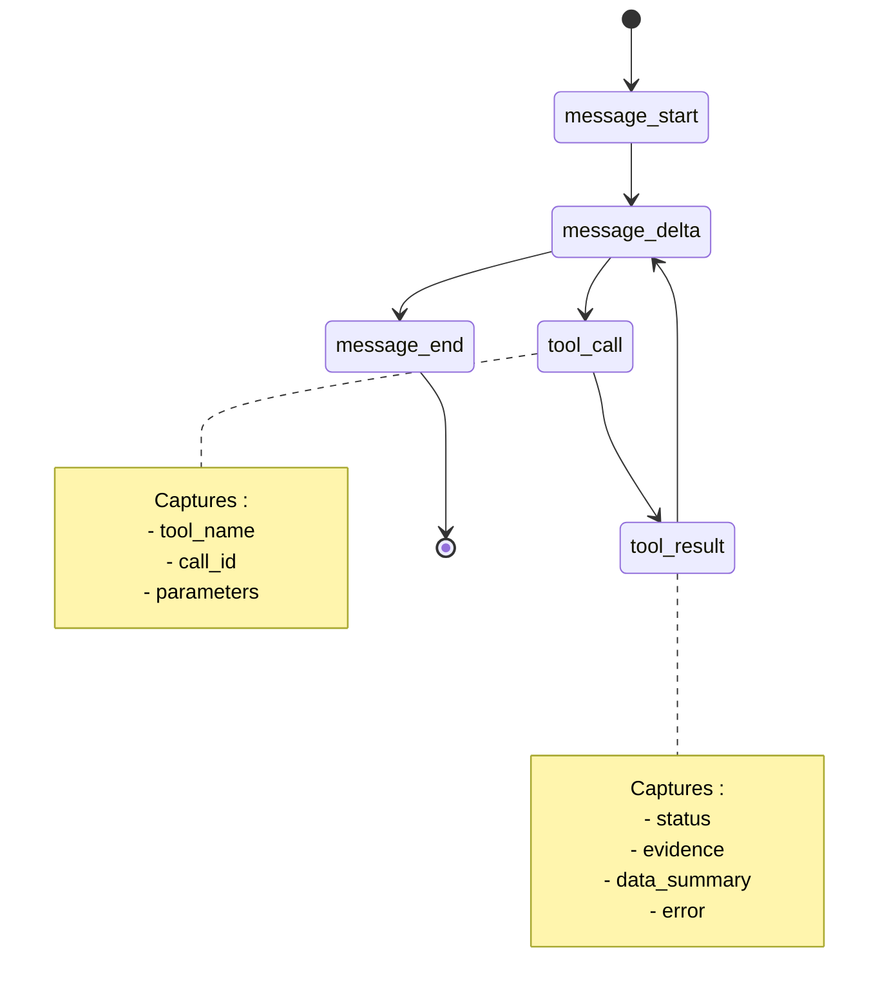

**Diagram sources**
- [v2.py:42-68](file://products/agent-platform/src/agent_service/schemas/v2.py#L42-L68)
- [routes.py:105-150](file://products/agent-platform/src/agent_service/api/v2/routes.py#L105-L150)

### Evidence Panel Data
The v3 protocol supports rich evidence data including:
- **Execution Context**: Tool names, parameters, and call identifiers
- **Results and Errors**: Status codes, error messages, and failure details
- **Data Summaries**: Truncated previews of large tool outputs
- **Audit Information**: Request IDs, session IDs, and timestamps

**Section sources**
- [v2.py:42-68](file://products/agent-platform/src/agent_service/schemas/v2.py#L42-L68)
- [routes.py:105-150](file://products/agent-platform/src/agent_service/api/v2/routes.py#L105-L150)
- [gateway_tools.py:212-251](file://products/agent-platform/src/agent_service/tools/gateway_tools.py#L212-L251)

## Per-Request Trace Queues

### Overview
Per-request trace queues provide comprehensive audit trails for tool execution, enabling evidence panel rendering and detailed monitoring of tool usage patterns.

### Queue Architecture
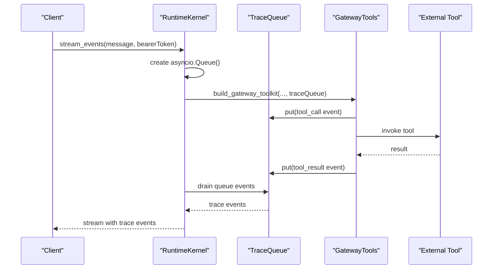

**Diagram sources**
- [runtime_kernel.py:404-447](file://products/agent-platform/src/agent_service/runtime_kernel.py#L404-L447)
- [gateway_tools.py:212-251](file://products/agent-platform/src/agent_service/tools/gateway_tools.py#L212-L251)

### Key Features
- **Isolation**: Each request gets its own trace queue for clean separation
- **Non-blocking**: Async queue operations don't block tool execution
- **Complete Coverage**: Captures both tool invocations and results
- **Structured Data**: Rich metadata including parameters, evidence, and summaries

### Trace Event Structure
Each trace event includes:
- **Event Type**: `tool_call` or `tool_result`
- **Identification**: Tool name, call ID, request ID, session ID
- **Execution Context**: Parameters, status, errors
- **Evidence Data**: Tool-specific evidence and data summaries

**Section sources**
- [runtime_kernel.py:404-447](file://products/agent-platform/src/agent_service/runtime_kernel.py#L404-L447)
- [gateway_tools.py:212-251](file://products/agent-platform/src/agent_service/tools/gateway_tools.py#L212-L251)

## Delegated Token Management

### Overview
The Agent Platform Service implements comprehensive delegated token management to ensure secure tool discovery and invocation. The runtime kernel manages per-user toolkit closures that are bound to delegated tokens, providing a secure execution context for all tool operations.

### Token Flow Architecture
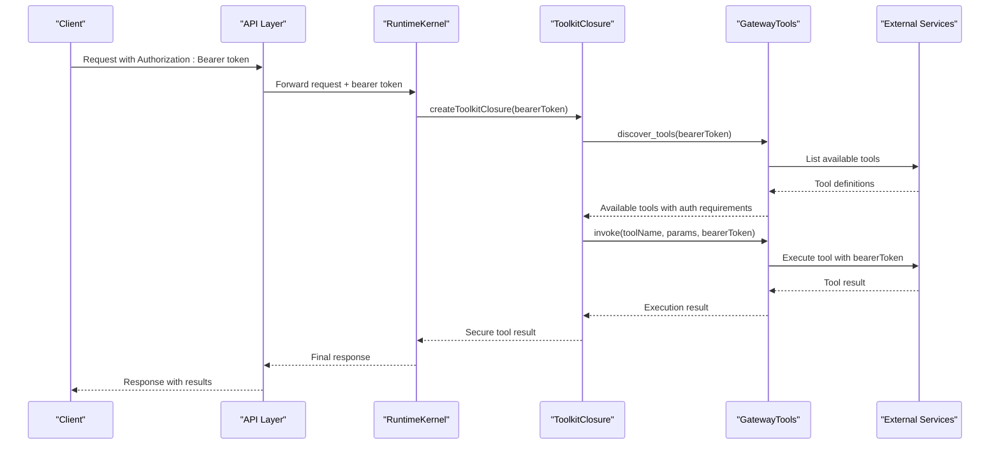

**Diagram sources**
- [runtime_kernel.py:178-223](file://products/agent-platform/src/agent_service/runtime_kernel.py#L178-L223)
- [gateway_tools.py:99-126](file://products/agent-platform/src/agent_service/tools/gateway_tools.py#L99-L126)
- [routes.py:40-47](file://products/agent-platform/src/agent_service/api/v2/routes.py#L40-L47)

### Key Features
- **Per-User Isolation**: Each user's toolkit closure is isolated and bound to their specific delegated token
- **Bearer Token Relay**: Delegated tokens are automatically converted to bearer tokens for downstream tool calls
- **Secure Discovery**: Tool discovery happens within the context of the user's delegated token
- **Context Propagation**: Authentication context flows through the entire execution pipeline
- **Lifecycle Management**: Toolkit closures are created per-request and cleaned up after execution

### Security Benefits
- Prevents token leakage between users
- Ensures tools execute with appropriate user permissions
- Provides audit trail for tool access patterns
- Maintains separation of concerns between identity and execution contexts

**Section sources**
- [runtime_kernel.py:178-223](file://products/agent-platform/src/agent_service/runtime_kernel.py#L178-L223)
- [gateway_tools.py:99-126](file://products/agent-platform/src/agent_service/tools/gateway_tools.py#L99-L126)
- [routes.py:40-47](file://products/agent-platform/src/agent_service/api/v2/routes.py#L40-L47)

## Dependency Analysis
The service has clear separation of concerns with minimal coupling between layers:
- API depends on schemas and kernel
- Kernel depends on session service, provider registry, and tools
- Providers are independent implementations registered at runtime
- Session service abstracts storage backend
- Cross-cutting concerns are injected into the application lifecycle

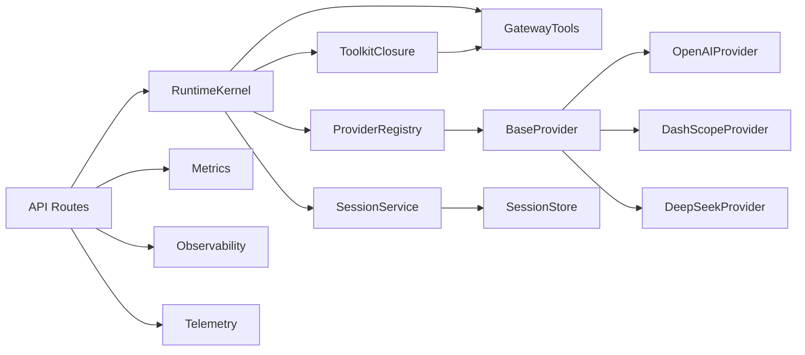

**Updated** The dependency graph now shows the enhanced toolkit registration pattern with per-request trace queues, auto-approval mechanism, and v3 streaming support.

**Diagram sources**
- [routes.py](file://products/agent-platform/src/agent_service/api/v2/routes.py)
- [runtime_kernel.py](file://products/agent-platform/src/agent_service/runtime_kernel.py)
- [session_service.py](file://products/agent-platform/src/agent_service/services/session_service.py)
- [registry.py](file://products/agent-platform/src/agent_service/providers/registry.py)
- [base.py](file://products/agent-platform/src/agent_service/providers/base.py)
- [openai.py](file://products/agent-platform/src/agent_service/providers/openai.py)
- [dashscope.py](file://products/agent-platform/src/agent_service/providers/dashscope.py)
- [deepseek.py](file://products/agent-platform/src/agent_service/providers/deepseek.py)
- [session_store.py](file://products/agent-platform/src/agent_service/services/session_store.py)
- [metrics.py](file://products/agent-platform/src/agent_service/core/metrics.py)
- [observability.py](file://products/agent-platform/src/agent_service/core/observability.py)
- [telemetry.py](file://products/agent-platform/src/agent_service/core/telemetry.py)
- [gateway_tools.py](file://products/agent-platform/src/agent_service/tools/gateway_tools.py)

**Section sources**
- [runtime_dependencies.py](file://products/agent-platform/src/agent_service/services/runtime_dependencies.py)

## Performance Considerations
- Streaming responses reduce latency by emitting events incrementally with v3 protocol support
- Connection pooling for provider HTTP clients improves throughput
- Session store caching minimizes I/O overhead
- Async processing for long-running operations prevents blocking
- Metrics collection enables performance monitoring and bottleneck identification
- Request context propagation ensures efficient tracing across components
- Toolkit closure caching reduces overhead for repeated tool invocations within the same request
- Per-request trace queues minimize memory footprint through efficient queue management
- Anti-hallucination guards prevent unnecessary tool discovery when tools are unavailable
- Auto-approval mechanism eliminates permission prompt overhead for vetted read-only tools

**Updated** Performance considerations now include AgentScope 2.x toolkit registration optimization, per-request trace queue efficiency, anti-hallucination guard performance benefits, and auto-approval mechanism improvements.

## Troubleshooting Guide
Common issues and resolutions:
- Provider connection failures: Verify API keys, endpoints, and network connectivity
- Session persistence errors: Check storage backend availability and permissions
- Streaming interruptions: Monitor network stability and timeout configurations
- Performance degradation: Analyze metrics for slow providers or storage bottlenecks
- Configuration errors: Validate environment variables and runtime settings
- Delegated token issues: Verify token validity, expiration, and permission scope
- Tool invocation failures: Check bearer token relay and tool-specific authentication
- Empty toolkit issues: Ensure AgentScope 2.x toolkit registration is working correctly
- Hallucination problems: Verify NO_TOOLS_NOTICE injection when tools are unavailable
- Trace queue issues: Check per-request queue creation and event emission
- Headless stream stalls: Verify auto-approval configuration for vetted read-only tools
- Permission prompt issues: Check if tools are properly configured as read-only and on allow-list

Debugging utilities:
- Health check endpoints for service status
- Structured logging with correlation IDs
- Metrics endpoints for operational insights
- Telemetry traces for request flow analysis
- Token validation endpoints for debugging delegated token flow
- Tool schema inspection for verifying toolkit registration
- Trace event monitoring for audit trail analysis
- Environment variable inspection for auto-allow-list configuration

**Updated** Troubleshooting guide now includes AgentScope 2.x toolkit registration issues, anti-hallucination guard troubleshooting, per-request trace queue debugging strategies, and auto-approval mechanism troubleshooting.

**Section sources**
- [metrics.py](file://products/agent-platform/src/agent_service/core/metrics.py)
- [observability.py](file://products/agent-platform/src/agent_service/core/observability.py)
- [telemetry.py](file://products/agent-platform/src/agent_service/core/telemetry.py)
- [request_context.py](file://products/agent-platform/src/agent_service/core/request_context.py)

## Conclusion
The Agent Platform Service provides a robust foundation for AI agent orchestration with multi-provider support, durable session management, and comprehensive observability. Its modular architecture enables easy customization and scaling while maintaining high performance and reliability.

**Updated** The service now includes enhanced security through delegated token management, AgentScope 2.x toolkit registration pattern, anti-hallucination guards, auto-approval mechanism for vetted tools, v3 streaming architecture with comprehensive audit trails, and per-request trace queues. These improvements strengthen the platform's security posture, prevent model hallucinations, eliminate headless stream stalls, and provide detailed operational visibility while maintaining the flexibility and performance characteristics that make it suitable for production AI operations.

## Appendices

### Practical Examples

#### Agent Development
- Define agent behavior through conversation templates and tool integrations
- Use the runtime kernel to manage agent lifecycle and state with AgentScope 2.x compatibility
- Implement custom tools for domain-specific operations with proper toolkit registration
- Leverage delegated tokens for secure tool execution with per-request isolation

#### Provider Customization
- Extend the base provider interface for new model backends using AgentScope 2.x patterns
- Register custom providers in the registry with proper model construction
- Configure provider-specific settings through environment variables with enhanced parameter support

#### Integration Patterns
- Use the API gateway for unified access to multiple agents with v3 streaming support
- Implement policy enforcement for security and compliance with audit trail integration
- Leverage streaming responses for real-time interactions with tool_call/tool_result frames
- Utilize per-request toolkit closures for secure multi-tenant scenarios with comprehensive audit trails

#### Anti-Hallucination Strategies
- Configure NO_TOOLS_NOTICE thresholds based on operational requirements
- Monitor tool discovery success rates and adjust accordingly
- Implement fallback mechanisms when tools are unavailable
- Use evidence panels to visualize tool usage and prevent fabrication

#### Auto-Approval Configuration
- Customize the allow-list via `AGENT_GATEWAY_TOOL_AUTO_ALLOW` environment variable
- Ensure tools are properly marked as read-only in tool definitions
- Monitor tool execution logs to verify auto-approval is working correctly
- Regularly review and update the allow-list based on security policies

**Updated** Practical examples now include guidance on leveraging AgentScope 2.x toolkit registration, anti-hallucination guards, auto-approval mechanism, v3 streaming protocols, and per-request trace queues for comprehensive audit trails.

**Section sources**
- [runtime_kernel.py](file://products/agent-platform/src/agent_service/runtime_kernel.py)
- [registry.py](file://products/agent-platform/src/agent_service/providers/registry.py)
- [base.py](file://products/agent-platform/src/agent_service/providers/base.py)
- [routes.py](file://products/agent-platform/src/agent_service/api/v2/routes.py)
- [gateway_tools.py](file://products/agent-platform/src/agent_service/tools/gateway_tools.py)
- [v2.py](file://products/agent-platform/src/agent_service/schemas/v2.py)