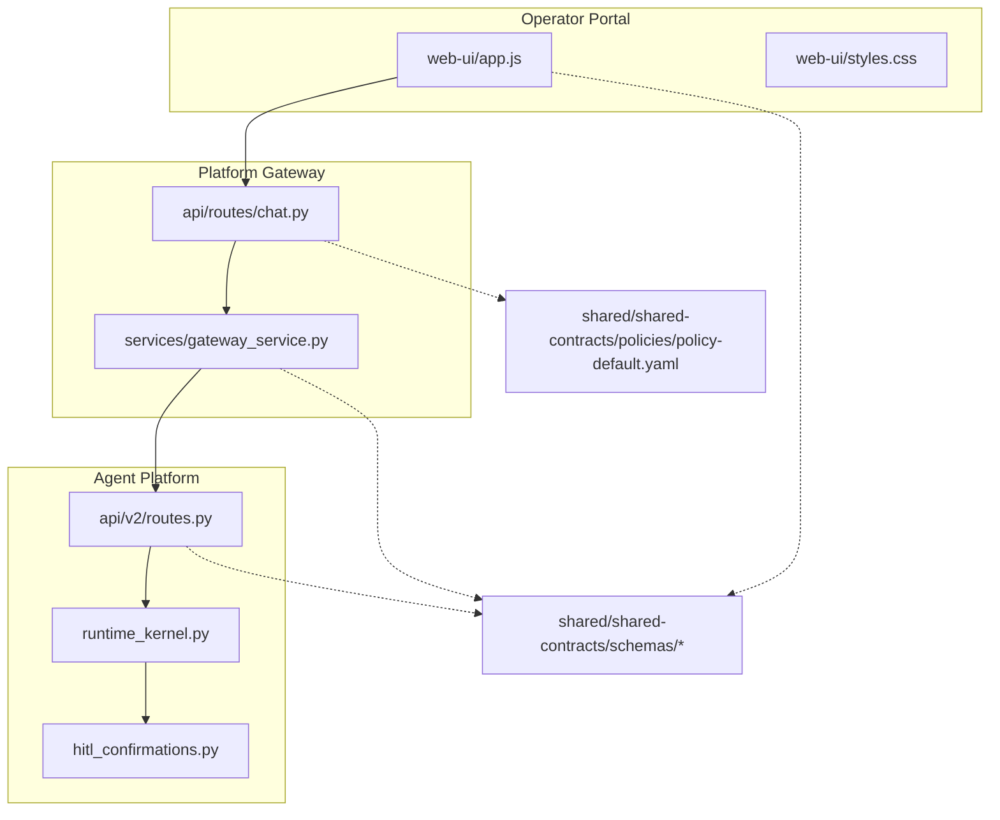
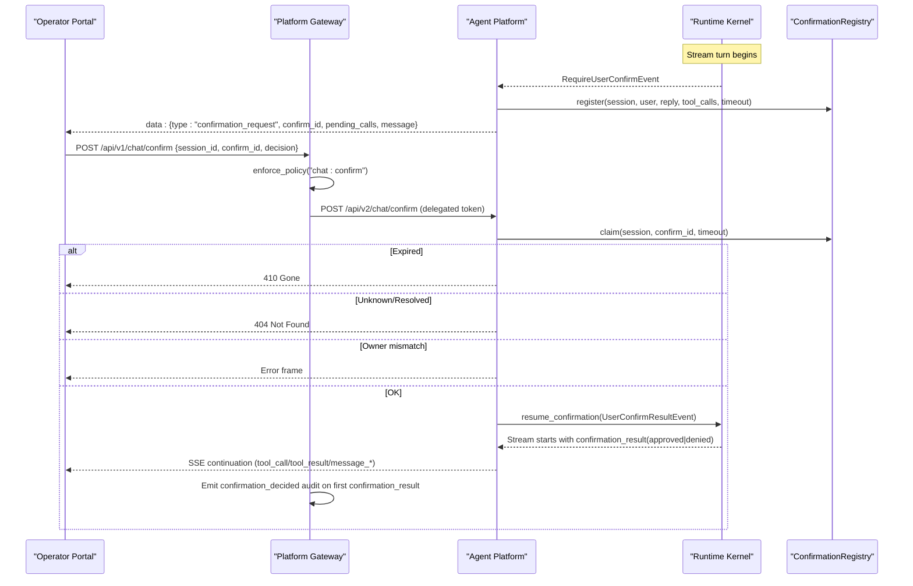
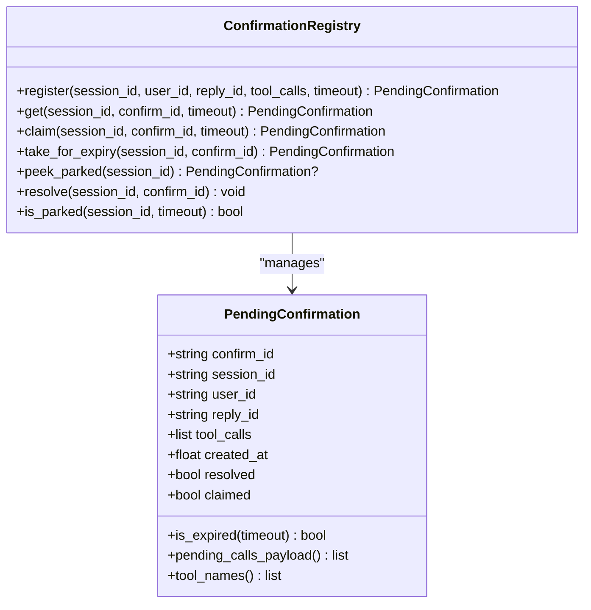
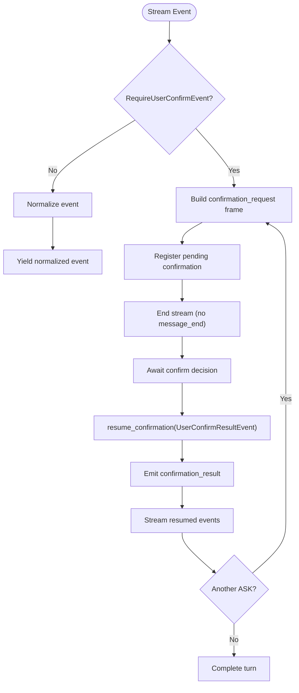
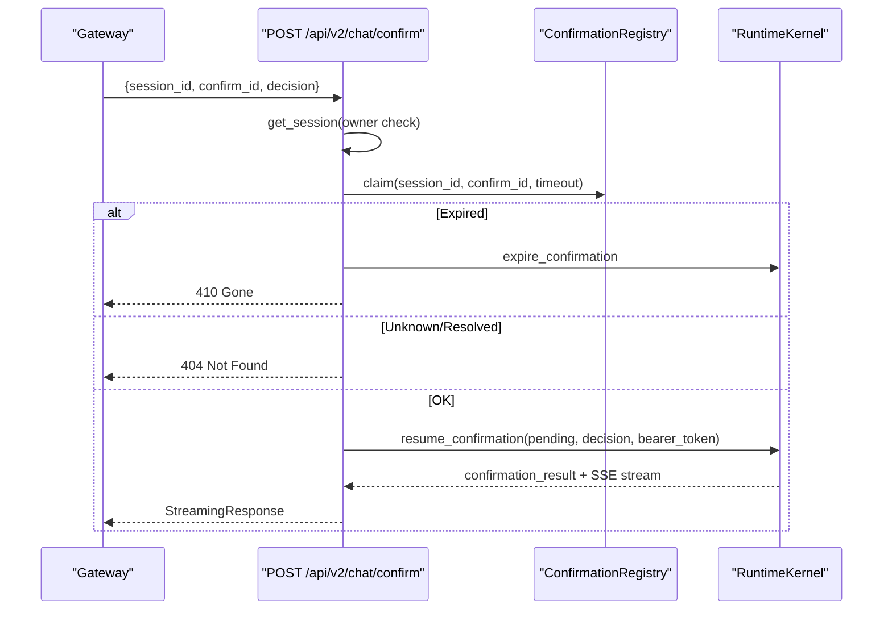
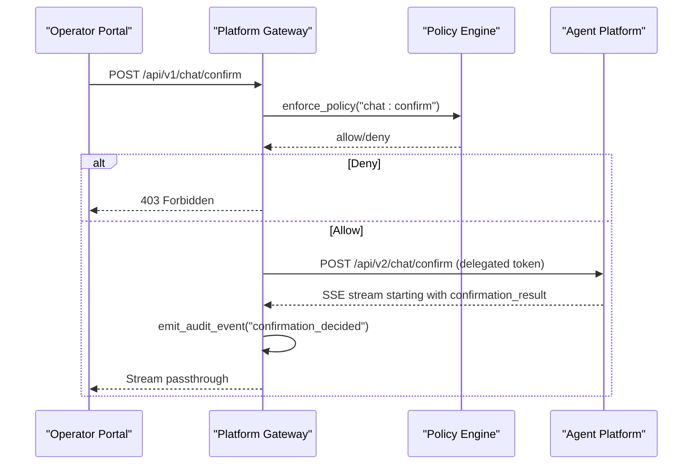
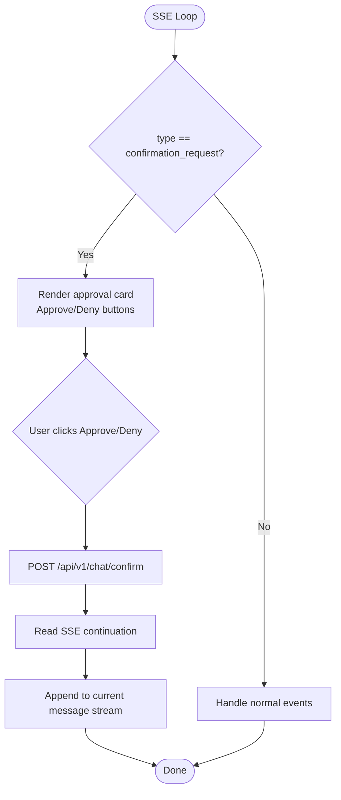
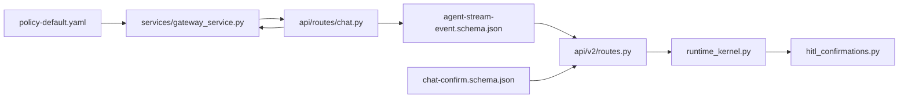

# HITL Confirmation Bridging (SPEC-020)

<cite>
**Referenced Files in This Document**
- [spec.md](file://docs/specs/SPEC-020-hitl-confirmation-bridging/spec.md)
- [plan.md](file://docs/specs/SPEC-020-hitl-confirmation-bridging/plan.md)
- [tasks.md](file://docs/specs/SPEC-020-hitl-confirmation-bridging/tasks.md)
- [release-notes.md](file://docs/agentic-aiops-platform/release-notes/2026-08-21-hitl-confirmation-bridging.md)
- [hitl_confirmations.py](file://products/agent-platform/src/agent_service/services/hitl_confirmations.py)
- [runtime_kernel.py](file://products/agent-platform/src/agent_service/runtime_kernel.py)
- [routes.py](file://products/agent-platform/src/agent_service/api/v2/routes.py)
- [chat-confirm.schema.json](file://shared/shared-contracts/schemas/chat-confirm.schema.json)
- [agent-stream-event.schema.json](file://shared/shared-contracts/schemas/agent-stream-event.schema.json)
- [policy-default.yaml](file://shared/shared-contracts/policies/policy-default.yaml)
- [chat.py](file://products/platform-gateway/src/platform_gateway/api/routes/chat.py)
- [gateway_service.py](file://products/platform-gateway/src/platform_gateway/services/gateway_service.py)
- [app.js](file://products/operator-portal/web-ui/app.js)
- [styles.css](file://products/operator-portal/web-ui/styles.css)
</cite>

## Table of Contents
1. Introduction
2. Project Structure
3. Core Components
4. Architecture Overview
5. Detailed Component Analysis
6. Dependency Analysis
7. Performance Considerations
8. Troubleshooting Guide
9. Conclusion

## Introduction
This document explains the Human-in-the-Loop (HITL) confirmation bridging implemented under SPEC-020. It maps the kernel’s ASK permission parking into a portal-visible approval flow, with durable audit and policy enforcement. The bridge is read-to-write: it must precede any mutating tool execution and ensures that operator decisions are explicit, attributable, and enforced by policy.

Key outcomes:
- Kernel ASK events become SSE confirmation_request frames.
- A new confirm endpoint resumes parked replies with approve/deny.
- Platform-gateway proxies confirm requests under a deny-by-default action.
- Operator portal renders an inline approval card and continues the stream after decision.
- Decisions are recorded in the durable audit trail.

**Section sources**
- [spec.md:11-20](file://docs/specs/SPEC-020-hitl-confirmation-bridging/spec.md#L11-L20)
- [release-notes.md:3-35](file://docs/agentic-aiops-platform/release-notes/2026-08-21-hitl-confirmation-bridging.md#L3-L35)

## Project Structure
The feature spans three products plus shared contracts:
- Agent platform: runtime park/resume, registry, v2 routes, schemas, settings.
- Platform gateway: confirm proxy route, policy action, audit emission.
- Operator portal: confirmation card rendering and confirm handler.
- Shared contracts: stream event schema growth, confirm request schema, policy rule.

**Diagram sources**
- [runtime_kernel.py:555-794](file://products/agent-platform/src/agent_service/runtime_kernel.py#L555-L794)
- [hitl_confirmations.py:85-208](file://products/agent-platform/src/agent_service/services/hitl_confirmations.py#L85-L208)
- [routes.py:156-227](file://products/agent-platform/src/agent_service/api/v2/routes.py#L156-L227)
- [chat.py:134-175](file://products/platform-gateway/src/platform_gateway/api/routes/chat.py#L134-L175)
- [gateway_service.py:336-446](file://products/platform-gateway/src/platform_gateway/services/gateway_service.py#L336-L446)
- [agent-stream-event.schema.json:1-96](file://shared/shared-contracts/schemas/agent-stream-event.schema.json#L1-L96)
- [chat-confirm.schema.json:1-27](file://shared/shared-contracts/schemas/chat-confirm.schema.json#L1-L27)
- [policy-default.yaml:42-54](file://shared/shared-contracts/policies/policy-default.yaml#L42-L54)

**Section sources**
- [plan.md:3-6](file://docs/specs/SPEC-020-hitl-confirmation-bridging/plan.md#L3-L6)
- [tasks.md:5-41](file://docs/specs/SPEC-020-hitl-confirmation-bridging/tasks.md#L5-L41)

## Core Components
- Confirmation registry: In-memory per-process store keyed by session_id; supports register, claim, resolve, expiry, and parked checks. Single pending confirmation per session.
- Runtime kernel bridge: Translates RequireUserConfirmEvent into confirmation_request frame, registers pending calls, ends stream without message_end, and resumes via UserConfirmResultEvent on decision.
- Confirm route (agent platform): POST /api/v2/chat/confirm validates ownership, claims entry, handles expired/unknown states, streams resumed reply with confirmation_result first.
- Confirm proxy (platform gateway): POST /api/v1/chat/confirm enforces chat:confirm action, obtains delegated token, proxies to agent platform, emits confirmation_decided audit when kernel applies decision.
- Portal card: Renders confirmation_request as inline card with Approve/Deny; posts to gateway confirm and continues SSE stream; locks card status on result or error.

**Section sources**
- [hitl_confirmations.py:34-208](file://products/agent-platform/src/agent_service/services/hitl_confirmations.py#L34-L208)
- [runtime_kernel.py:657-794](file://products/agent-platform/src/agent_service/runtime_kernel.py#L657-L794)
- [routes.py:65-227](file://products/agent-platform/src/agent_service/api/v2/routes.py#L65-L227)
- [chat.py:134-175](file://products/platform-gateway/src/platform_gateway/api/routes/chat.py#L134-L175)
- [gateway_service.py:336-446](file://products/platform-gateway/src/platform_gateway/services/gateway_service.py#L336-L446)
- [app.js:1956-2036](file://products/operator-portal/web-ui/app.js#L1956-L2036)
- [styles.css:749-800](file://products/operator-portal/web-ui/styles.css#L749-L800)

## Architecture Overview
End-to-end flow from kernel ASK to portal decision and resumed execution:

**Diagram sources**
- [runtime_kernel.py:657-794](file://products/agent-platform/src/agent_service/runtime_kernel.py#L657-L794)
- [routes.py:156-227](file://products/agent-platform/src/agent_service/api/v2/routes.py#L156-L227)
- [gateway_service.py:336-446](file://products/platform-gateway/src/platform_gateway/services/gateway_service.py#L336-L446)
- [chat.py:134-175](file://products/platform-gateway/src/platform_gateway/api/routes/chat.py#L134-L175)
- [hitl_confirmations.py:101-199](file://products/agent-platform/src/agent_service/services/hitl_confirmations.py#L101-L199)

## Detailed Component Analysis

### Confirmation Registry (In-Memory State)
Responsibilities:
- Register pending confirmations per session with TTL awareness.
- Atomic claim to prevent double-resume.
- Resolve entries after decision or expiry closure.
- Provide parked checks for new-turn rejection.

Concurrency and safety:
- Single-flight claim via claimed flag prevents duplicate decisions.
- Expiry path uses take_for_expiry to avoid interrupting in-flight resumes.
- No persistence across restarts; parked state is lost safely.

**Diagram sources**
- [hitl_confirmations.py:34-208](file://products/agent-platform/src/agent_service/services/hitl_confirmations.py#L34-L208)

**Section sources**
- [hitl_confirmations.py:85-208](file://products/agent-platform/src/agent_service/services/hitl_confirmations.py#L85-L208)

### Runtime Kernel Bridge (Park and Resume)
Behavior:
- On RequireUserConfirmEvent, builds confirmation_request frame, registers pending calls, yields frame, and ends stream without message_end.
- resume_confirmation sets delegated token, emits confirmation_result first, then streams resumed reply through normalization/evidence pipeline.
- Handles chained parks: resumed turns can trigger another ASK, emitting a fresh confirmation_request.

**Diagram sources**
- [runtime_kernel.py:555-644](file://products/agent-platform/src/agent_service/runtime_kernel.py#L555-L644)
- [runtime_kernel.py:657-794](file://products/agent-platform/src/agent_service/runtime_kernel.py#L657-L794)

**Section sources**
- [runtime_kernel.py:657-794](file://products/agent-platform/src/agent_service/runtime_kernel.py#L657-L794)

### Agent Platform Confirm Route
Responsibilities:
- Validate session ownership via existing session lookup.
- Claim registry entry before streaming headers to prevent duplicates.
- Map errors: unknown/resolved -> 404, expired -> 410, owner mismatch -> error frame mid-stream.
- Reject new turns on parked sessions with 409 until resolved or expired.

**Diagram sources**
- [routes.py:65-227](file://products/agent-platform/src/agent_service/api/v2/routes.py#L65-L227)
- [hitl_confirmations.py:101-199](file://products/agent-platform/src/agent_service/services/hitl_confirmations.py#L101-L199)
- [runtime_kernel.py:708-794](file://products/agent-platform/src/agent_service/runtime_kernel.py#L708-L794)

**Section sources**
- [routes.py:65-227](file://products/agent-platform/src/agent_service/api/v2/routes.py#L65-L227)

### Platform Gateway Confirm Proxy and Audit
Responsibilities:
- Enforce policy action chat:confirm (deny-by-default).
- Obtain delegated token and proxy SSE to agent platform.
- Emit confirmation_decided audit only when kernel-applied confirmation_result flows through.
- Map upstream 4xx passthrough; transport failures map to 502.

**Diagram sources**
- [chat.py:134-175](file://products/platform-gateway/src/platform_gateway/api/routes/chat.py#L134-L175)
- [gateway_service.py:336-446](file://products/platform-gateway/src/platform_gateway/services/gateway_service.py#L336-L446)
- [policy-default.yaml:42-54](file://shared/shared-contracts/policies/policy-default.yaml#L42-L54)

**Section sources**
- [chat.py:134-175](file://products/platform-gateway/src/platform_gateway/api/routes/chat.py#L134-L175)
- [gateway_service.py:336-446](file://products/platform-gateway/src/platform_gateway/services/gateway_service.py#L336-L446)

### Operator Portal Confirmation Card
Responsibilities:
- Render confirmation_request as inline card with tool names, parameters, and permission message.
- Hide Approve/Deny buttons for roles without chat:confirm (client-side convenience; server re-enforces).
- Post decision to gateway confirm endpoint and continue SSE stream into same message area.
- Lock card status on confirmation_result or error; handle 410 as expired.

**Diagram sources**
- [app.js:1956-2036](file://products/operator-portal/web-ui/app.js#L1956-L2036)
- [styles.css:749-800](file://products/operator-portal/web-ui/styles.css#L749-L800)

**Section sources**
- [app.js:1956-2036](file://products/operator-portal/web-ui/app.js#L1956-L2036)
- [styles.css:749-800](file://products/operator-portal/web-ui/styles.css#L749-L800)

## Dependency Analysis
- Contracts:
  - Stream event schema v5 adds confirmation_request and confirmation_result types, confirm_id, pending_calls, and optional data field on tool_result.
  - Confirm request schema binds session_id, confirm_id, decision.
  - Policy bundle adds chat:confirm action granted to operational/developer roles; observer excluded.
- Services:
  - Agent platform depends on runtime kernel and registry for park/resume semantics.
  - Platform gateway depends on policy engine, delegation client, and agent client for proxying and audit.
  - Portal depends on SSE parser and styles for card rendering.

**Diagram sources**
- [agent-stream-event.schema.json:1-96](file://shared/shared-contracts/schemas/agent-stream-event.schema.json#L1-L96)
- [chat-confirm.schema.json:1-27](file://shared/shared-contracts/schemas/chat-confirm.schema.json#L1-L27)
- [policy-default.yaml:42-54](file://shared/shared-contracts/policies/policy-default.yaml#L42-L54)
- [routes.py:230-320](file://products/agent-platform/src/agent_service/api/v2/routes.py#L230-L320)
- [gateway_service.py:336-446](file://products/platform-gateway/src/platform_gateway/services/gateway_service.py#L336-L446)
- [chat.py:134-175](file://products/platform-gateway/src/platform_gateway/api/routes/chat.py#L134-L175)
- [runtime_kernel.py:657-794](file://products/agent-platform/src/agent_service/runtime_kernel.py#L657-L794)
- [hitl_confirmations.py:85-208](file://products/agent-platform/src/agent_service/services/hitl_confirmations.py#L85-L208)

**Section sources**
- [agent-stream-event.schema.json:1-96](file://shared/shared-contracts/schemas/agent-stream-event.schema.json#L1-L96)
- [chat-confirm.schema.json:1-27](file://shared/shared-contracts/schemas/chat-confirm.schema.json#L1-L27)
- [policy-default.yaml:42-54](file://shared/shared-contracts/policies/policy-default.yaml#L42-L54)

## Performance Considerations
- In-memory registry avoids persistent overhead but means parked confirmations do not survive process restarts; this is intentional and safe.
- Claim-based single-flight prevents duplicate resumption and reduces contention.
- SSE passthrough minimizes transformation cost; only first confirmation_result triggers audit emission.
- Tool evidence data is bounded by middleware caps to keep streams responsive.

[No sources needed since this section provides general guidance]

## Troubleshooting Guide
Common issues and resolutions:
- 409 Conflict on new chat turns: Indicates a parked confirmation exists; answer or wait for expiry before sending a new message.
- 410 Gone on confirm: Confirmation expired; close parked calls and retry with a new turn.
- 404 Not Found: Unknown or already-resolved confirm_id; verify session and confirm_id match.
- 403 Forbidden: Missing chat:confirm role; ensure identity has required role per policy.
- Mid-stream error frame: Owner mismatch between registry and session; re-authenticate and retry.

Operational checks:
- Verify AGENT_HITL_CONFIRM_TIMEOUT > 0 to enable bridging; set to 0 to restore legacy silent-park behavior.
- Confirm policy bundle includes allow-chat-confirm rule for intended roles.
- Inspect audit trail for confirmation_decided events to validate applied decisions.

**Section sources**
- [routes.py:65-94](file://products/agent-platform/src/agent_service/api/v2/routes.py#L65-L94)
- [routes.py:156-227](file://products/agent-platform/src/agent_service/api/v2/routes.py#L156-L227)
- [gateway_service.py:336-396](file://products/platform-gateway/src/platform_gateway/services/gateway_service.py#L336-L396)
- [policy-default.yaml:42-54](file://shared/shared-contracts/policies/policy-default.yaml#L42-L54)

## Conclusion
SPEC-020 delivers a robust, auditable HITL bridge that transforms kernel ASK parking into a portal-driven approval workflow. It enforces policy at the gateway, preserves session integrity, and records decisions durably. The design keeps the kernel unchanged, relies on existing agentscope machinery, and scales to future write/mutating tools by gating them behind the same confirmation surface.

[No sources needed since this section summarizes without analyzing specific files]