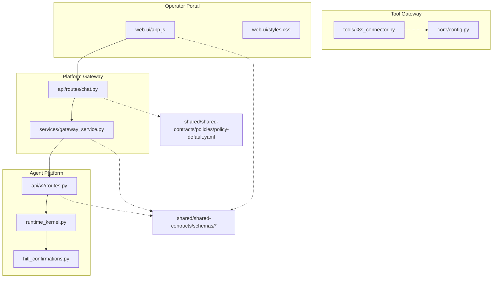
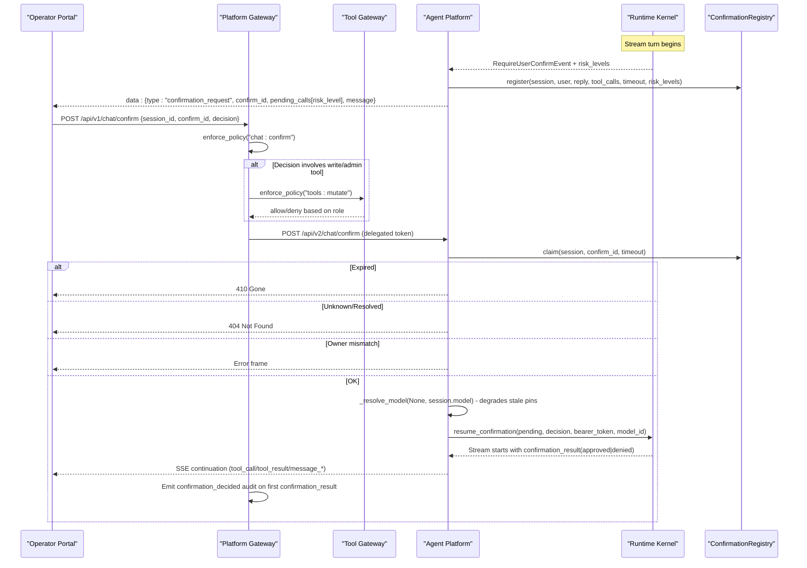
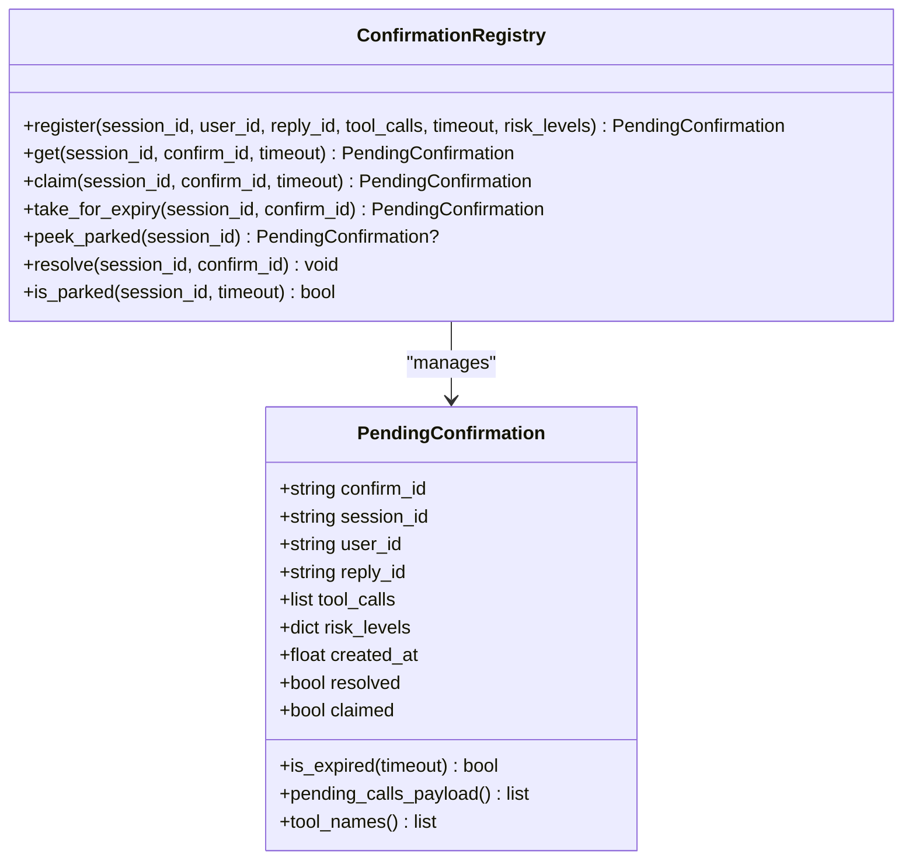
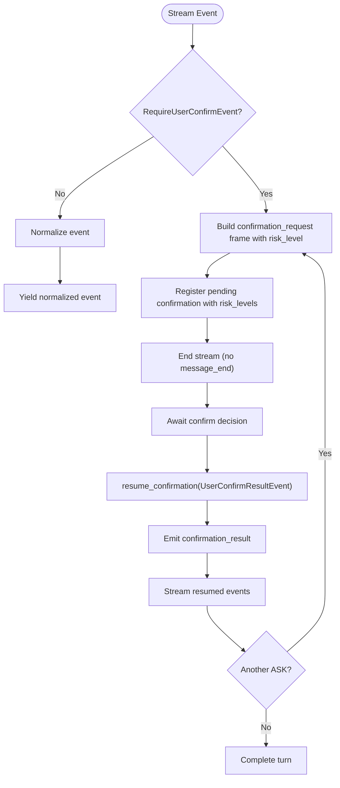
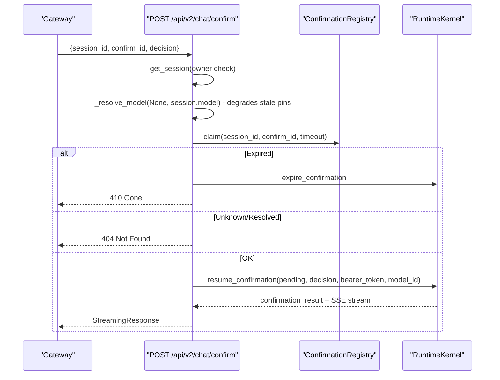
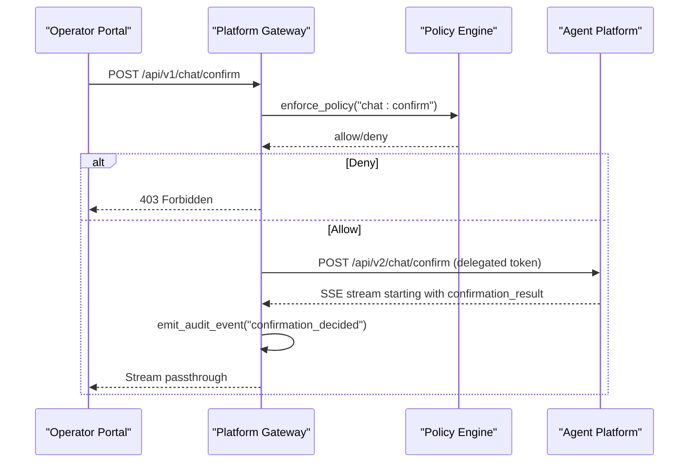
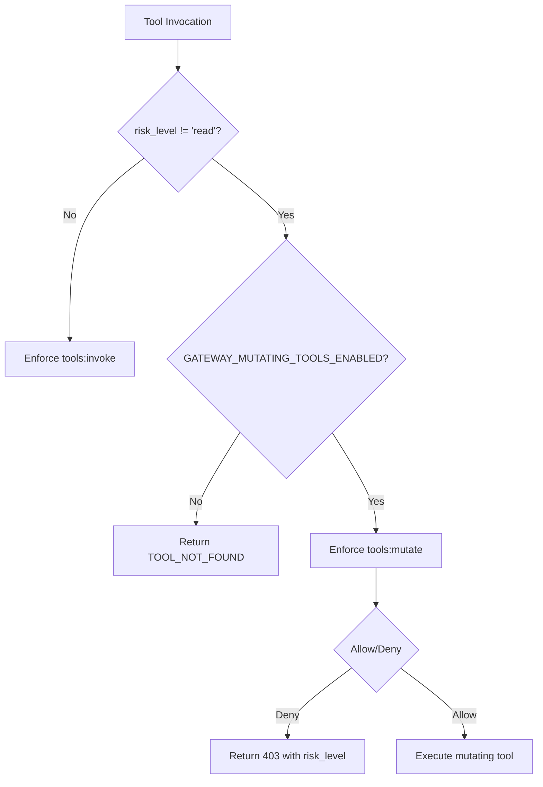
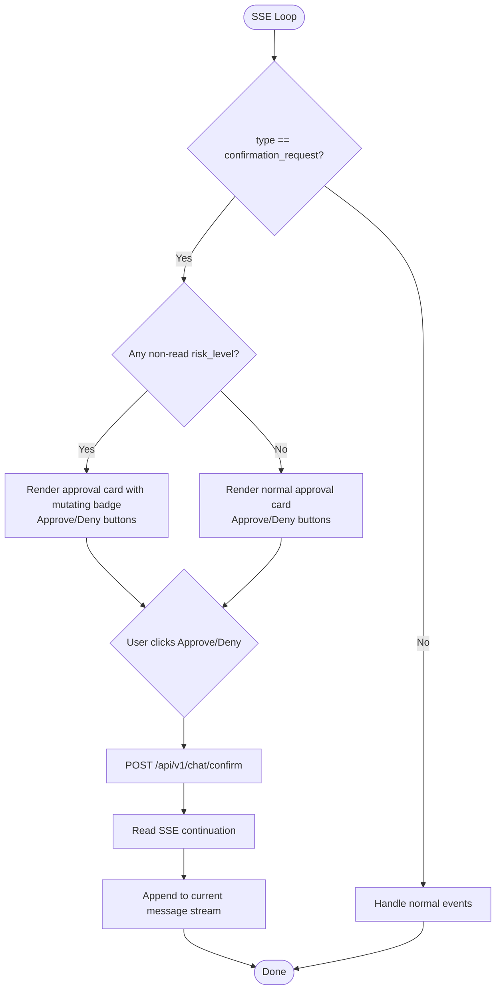
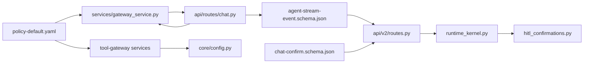

# HITL Confirmation Bridging (SPEC-020)

<cite>
**Referenced Files in This Document**
- [spec.md](file://docs/specs/SPEC-020-hitl-confirmation-bridging/spec.md)
- [plan.md](file://docs/specs/SPEC-020-hitl-confirmation-bridging/plan.md)
- [tasks.md](file://docs/specs/SPEC-020-hitl-confirmation-bridging/tasks.md)
- [release-notes.md](file://docs/agentic-aiops-platform/release-notes/2026-08-21-hitl-confirmation-bridging.md)
- [multimodel-runtime-and-live-discovery.md](file://docs/agentic-aiops-platform/release-notes/2026-08-24-multimodel-runtime-and-live-discovery.md)
- [hitl_confirmations.py](file://products/agent-platform/src/agent_service/services/hitl_confirmations.py)
- [runtime_kernel.py](file://products/agent-platform/src/agent_service/runtime_kernel.py)
- [routes.py](file://products/agent-platform/src/agent_service/api/v2/routes.py)
- [chat-confirm.schema.json](file://shared/shared-contracts/schemas/chat-confirm.schema.json)
- [agent-stream-event.schema.json](file://shared/shared-contracts/schemas/agent-stream-event.schema.json)
- [policy-default.yaml](file://shared/shared-contracts/policies/policy-default.yaml)
- [chat.py](file://products/platform-gateway/src/platform_gateway/api/routes/chat.py)
- [gateway_service.py](file://products/platform-gateway/src/platform_gateway/services/gateway_service.py)
- [app.js](file://products/operator-portal/web-ui/app.js)
- [styles.css](file://products/operator-portal/web-ui/styles.css)
- [k8s_connector.py](file://products/tool-gateway/src/tool_gateway/tools/k8s_connector.py)
- [config.py](file://products/tool-gateway/src/tool_gateway/core/config.py)
</cite>

## Update Summary
**Changes Made**
- Enhanced with SPEC-021 integration including risk_level field in pending_calls
- Added mutating tool badges and visual indicators for write/admin tools
- Expanded approval workflows for write/admin tools with tools:mutate policy action
- Updated confirmation registry to track risk levels per tool call
- Enhanced portal UI with mutating badges and risk-level visualization
- Integrated GATEWAY_MUTATING_TOOLS_ENABLED configuration gate
- **Critical Fix**: Resolved HITL confirmation wedge issue where evicted model pins caused UnknownModelError exceptions mid-stream; /chat/confirm route now resolves model pins through the same degraded resolution ladder as other turns, falling back to catalog defaults when pinned models become unavailable due to discovery refreshes or key revocations

## Table of Contents
1. Introduction
2. Project Structure
3. Core Components
4. Architecture Overview
5. Detailed Component Analysis
6. Dependency Analysis
7. Performance Considerations
8. Troubleshooting Guide
9. Conclusion

## Introduction
This document explains the Human-in-the-Loop (HITL) confirmation bridging implemented under SPEC-020, enhanced with SPEC-021's bounded mutating actions. It maps the kernel's ASK permission parking into a portal-visible approval flow, with durable audit and policy enforcement. The bridge is read-to-write: it must precede any mutating tool execution and ensures that operator decisions are explicit, attributable, and enforced by policy.

Key outcomes:
- Kernel ASK events become SSE confirmation_request frames with risk_level metadata.
- A new confirm endpoint resumes parked replies with approve/deny.
- Platform-gateway proxies confirm requests under a deny-by-default action.
- Operator portal renders an inline approval card with mutating badges and continues the stream after decision.
- Decisions are recorded in the durable audit trail.
- Mutating tools require both chat:confirm approval AND tools:mutate policy authorization.
- **Model pin resilience**: Stale session pins degrade gracefully to catalog defaults instead of causing mid-stream failures.

**Section sources**
- [spec.md:11-20](file://docs/specs/SPEC-020-hitl-confirmation-bridging/spec.md#L11-L20)
- [release-notes.md:3-35](file://docs/agentic-aiops-platform/release-notes/2026-08-21-hitl-confirmation-bridging.md#L3-L35)
- [multimodel-runtime-and-live-discovery.md:126-136](file://docs/agentic-aiops-platform/release-notes/2026-08-24-multimodel-runtime-and-live-discovery.md#L126-L136)

## Project Structure
The feature spans three products plus shared contracts, enhanced with SPEC-021 capabilities:
- Agent platform: runtime park/resume, registry with risk tracking, v2 routes, schemas, settings.
- Platform gateway: confirm proxy route, policy action, audit emission.
- Tool gateway: risk-tier admission gate, mutating tool registration, tools:mutate enforcement.
- Operator portal: confirmation card rendering with mutating badges and confirm handler.
- Shared contracts: stream event schema growth with risk_level, confirm request schema, policy rule.

**Diagram sources**
- [runtime_kernel.py:555-794](file://products/agent-platform/src/agent_service/runtime_kernel.py#L555-L794)
- [hitl_confirmations.py:85-208](file://products/agent-platform/src/agent_service/services/hitl_confirmations.py#L85-L208)
- [routes.py:156-227](file://products/agent-platform/src/agent_service/api/v2/routes.py#L156-L227)
- [chat.py:134-175](file://products/platform-gateway/src/platform_gateway/api/routes/chat.py#L134-L175)
- [gateway_service.py:336-446](file://products/platform-gateway/src/platform_gateway/services/gateway_service.py#L336-L446)
- [k8s_connector.py:439-518](file://products/tool-gateway/src/tool_gateway/tools/k8s_connector.py#L439-L518)
- [config.py:75-81](file://products/tool-gateway/src/tool_gateway/core/config.py#L75-L81)
- [agent-stream-event.schema.json:1-96](file://shared/shared-contracts/schemas/agent-stream-event.schema.json#L1-L96)
- [chat-confirm.schema.json:1-27](file://shared/shared-contracts/schemas/chat-confirm.schema.json#L1-L27)
- [policy-default.yaml:42-54](file://shared/shared-contracts/policies/policy-default.yaml#L42-L54)

**Section sources**
- [plan.md:3-6](file://docs/specs/SPEC-020-hitl-confirmation-bridging/plan.md#L3-L6)
- [tasks.md:5-41](file://docs/specs/SPEC-020-hitl-confirmation-bridging/tasks.md#L5-L41)

## Core Components
- **Enhanced Confirmation Registry**: In-memory per-process store keyed by session_id with risk_level tracking; supports register, claim, resolve, expiry, and parked checks with risk tier awareness. Single pending confirmation per session with optional risk metadata.
- **Runtime kernel bridge**: Translates RequireUserConfirmEvent into confirmation_request frame with risk_level payload, registers pending calls with risk mapping, ends stream without message_end, and resumes via UserConfirmResultEvent on decision.
- **Confirm route (agent platform)**: POST /api/v2/chat/confirm validates ownership, claims entry, handles expired/unknown states, streams resumed reply with confirmation_result first. **Updated**: Now uses degraded model resolution to prevent UnknownModelError exceptions.
- **Confirm proxy (platform gateway)**: POST /api/v1/chat/confirm enforces chat:confirm action, obtains delegated token, proxies to agent platform, emits confirmation_decided audit when kernel applies decision.
- **Risk-tier admission (tool gateway)**: Enforces tools:mutate policy action for write/admin tools, gates k8s.delete_pod behind GATEWAY_MUTATING_TOOLS_ENABLED flag.
- **Portal card**: Renders confirmation_request as inline card with mutating badges, tool names, parameters, and permission message; posts to gateway confirm and continues SSE stream; locks card status on result or error.

**Section sources**
- [hitl_confirmations.py:34-208](file://products/agent-platform/src/agent_service/services/hitl_confirmations.py#L34-L208)
- [runtime_kernel.py:657-794](file://products/agent-platform/src/agent_service/runtime_kernel.py#L657-L794)
- [routes.py:65-227](file://products/agent-platform/src/agent_service/api/v2/routes.py#L65-L227)
- [chat.py:134-175](file://products/platform-gateway/src/platform_gateway/api/routes/chat.py#L134-L175)
- [gateway_service.py:336-446](file://products/platform-gateway/src/platform_gateway/services/gateway_service.py#L336-L446)
- [k8s_connector.py:439-518](file://products/tool-gateway/src/tool_gateway/tools/k8s_connector.py#L439-L518)
- [config.py:75-81](file://products/tool-gateway/src/tool_gateway/core/config.py#L75-L81)
- [app.js:1697-1758](file://products/operator-portal/web-ui/app.js#L1697-L1758)
- [styles.css:682-683](file://products/operator-portal/web-ui/styles.css#L682-L683)

## Architecture Overview
End-to-end flow from kernel ASK to portal decision and resumed execution, enhanced with risk-tier enforcement and resilient model resolution:

**Diagram sources**
- [runtime_kernel.py:657-794](file://products/agent-platform/src/agent_service/runtime_kernel.py#L657-L794)
- [routes.py:156-227](file://products/agent-platform/src/agent_service/api/v2/routes.py#L156-L227)
- [gateway_service.py:336-446](file://products/platform-gateway/src/platform_gateway/services/gateway_service.py#L336-L446)
- [chat.py:134-175](file://products/platform-gateway/src/platform_gateway/api/routes/chat.py#L134-L175)
- [hitl_confirmations.py:101-199](file://products/agent-platform/src/agent_service/services/hitl_confirmations.py#L101-L199)

## Detailed Component Analysis

### Enhanced Confirmation Registry (In-Memory State with Risk Tracking)
Responsibilities:
- Register pending confirmations per session with TTL awareness and risk level mapping.
- Atomic claim to prevent double-resume.
- Resolve entries after decision or expiry closure.
- Provide parked checks for new-turn rejection.
- Track risk levels per tool call for portal visualization.

Concurrency and safety:
- Single-flight claim via claimed flag prevents duplicate decisions.
- Expiry path uses take_for_expiry to avoid interrupting in-flight resumes.
- No persistence across restarts; parked state is lost safely.
- Risk levels captured at park time from toolkit discovery.

**Diagram sources**
- [hitl_confirmations.py:34-208](file://products/agent-platform/src/agent_service/services/hitl_confirmations.py#L34-L208)

**Section sources**
- [hitl_confirmations.py:85-208](file://products/agent-platform/src/agent_service/services/hitl_confirmations.py#L85-L208)

### Runtime Kernel Bridge (Park and Resume with Risk Mapping)
Behavior:
- On RequireUserConfirmEvent, builds confirmation_request frame with risk_level payload, registers pending calls with risk mapping, yields frame, and ends stream without message_end.
- resume_confirmation sets delegated token, emits confirmation_result first, then streams resumed reply through normalization/evidence pipeline.
- Handles chained parks: resumed turns can trigger another ASK, emitting a fresh confirmation_request.
- Filters mutating tools when HITL bridging is disabled to maintain honest posture.

**Diagram sources**
- [runtime_kernel.py:555-644](file://products/agent-platform/src/agent_service/runtime_kernel.py#L555-L644)
- [runtime_kernel.py:657-794](file://products/agent-platform/src/agent_service/runtime_kernel.py#L657-L794)

**Section sources**
- [runtime_kernel.py:657-794](file://products/agent-platform/src/agent_service/runtime_kernel.py#L657-L794)

### Agent Platform Confirm Route
Responsibilities:
- Validate session ownership via existing session lookup.
- Claim registry entry before streaming headers to prevent duplicates.
- Map errors: unknown/resolved -> 404, expired -> 410, owner mismatch -> error frame mid-stream.
- Reject new turns on parked sessions with 409 until resolved or expired.
- **Updated**: Uses degraded model resolution to handle evicted session pins gracefully.

**Diagram sources**
- [routes.py:65-227](file://products/agent-platform/src/agent_service/api/v2/routes.py#L65-L227)
- [hitl_confirmations.py:101-199](file://products/agent-platform/src/agent_service/services/hitl_confirmations.py#L101-L199)
- [runtime_kernel.py:708-794](file://products/agent-platform/src/agent_service/runtime_kernel.py#L708-L794)

**Section sources**
- [routes.py:65-227](file://products/agent-platform/src/agent_service/api/v2/routes.py#L65-L227)

### Platform Gateway Confirm Proxy and Audit
Responsibilities:
- Enforce policy action chat:confirm (deny-by-default).
- Obtain delegated token and proxy SSE to agent platform.
- Emit confirmation_decided audit only when kernel-applied confirmation_result flows through.
- Map upstream 4xx passthrough; transport failures map to 502.

**Diagram sources**
- [chat.py:134-175](file://products/platform-gateway/src/platform_gateway/api/routes/chat.py#L134-L175)
- [gateway_service.py:336-446](file://products/platform-gateway/src/platform_gateway/services/gateway_service.py#L336-L446)
- [policy-default.yaml:42-54](file://shared/shared-contracts/policies/policy-default.yaml#L42-L54)

**Section sources**
- [chat.py:134-175](file://products/platform-gateway/src/platform_gateway/api/routes/chat.py#L134-L175)
- [gateway_service.py:336-446](file://products/platform-gateway/src/platform_gateway/services/gateway_service.py#L336-L446)

### Tool Gateway Risk-Tier Admission
Responsibilities:
- Enforce tools:mutate policy action for write/admin tools.
- Gate k8s.delete_pod registration behind GATEWAY_MUTATING_TOOLS_ENABLED.
- Return structured 403 responses with risk_level metadata for denied mutations.
- Maintain backward compatibility with read-only tool surface.

**Diagram sources**
- [gateway_service.py:222-263](file://products/tool-gateway/src/tool_gateway/services/gateway_service.py#L222-L263)
- [config.py:75-81](file://products/tool-gateway/src/tool_gateway/core/config.py#L75-L81)

**Section sources**
- [k8s_connector.py:439-518](file://products/tool-gateway/src/tool_gateway/tools/k8s_connector.py#L439-L518)
- [config.py:75-81](file://products/tool-gateway/src/tool_gateway/core/config.py#L75-L81)

### Enhanced Operator Portal Confirmation Card
Responsibilities:
- Render confirmation_request as inline card with mutating badges and tool names, parameters, and permission message.
- Hide Approve/Deny buttons for roles without chat:confirm (client-side convenience; server re-enforces).
- Post decision to gateway confirm endpoint and continue SSE stream into same message area.
- Lock card status on confirmation_result or error; handle 410 as expired.
- Display risk_level badges for write/admin tools with visual warning indicators.

**Diagram sources**
- [app.js:1697-1758](file://products/operator-portal/web-ui/app.js#L1697-L1758)
- [styles.css:682-683](file://products/operator-portal/web-ui/styles.css#L682-L683)

**Section sources**
- [app.js:1697-1758](file://products/operator-portal/web-ui/app.js#L1697-L1758)
- [styles.css:682-683](file://products/operator-portal/web-ui/styles.css#L682-L683)

## Dependency Analysis
- Contracts:
  - Stream event schema v6 adds confirmation_request and confirmation_result types, confirm_id, pending_calls with optional risk_level, and optional data field on tool_result.
  - Confirm request schema binds session_id, confirm_id, decision.
  - Policy bundle adds tools:mutate action granted to platform-admin and operator roles; observer excluded.
- Services:
  - Agent platform depends on runtime kernel and registry for park/resume semantics with risk tracking.
  - Platform gateway depends on policy engine, delegation client, and agent client for proxying and audit.
  - Tool gateway depends on policy engine for tools:mutate enforcement and configuration management.
  - Portal depends on SSE parser and styles for card rendering with mutating badges.

**Diagram sources**
- [agent-stream-event.schema.json:1-96](file://shared/shared-contracts/schemas/agent-stream-event.schema.json#L1-L96)
- [chat-confirm.schema.json:1-27](file://shared/shared-contracts/schemas/chat-confirm.schema.json#L1-L27)
- [policy-default.yaml:42-54](file://shared/shared-contracts/policies/policy-default.yaml#L42-L54)
- [routes.py:230-320](file://products/agent-platform/src/agent_service/api/v2/routes.py#L230-L320)
- [gateway_service.py:336-446](file://products/platform-gateway/src/platform_gateway/services/gateway_service.py#L336-L446)
- [chat.py:134-175](file://products/platform-gateway/src/platform_gateway/api/routes/chat.py#L134-L175)
- [runtime_kernel.py:657-794](file://products/agent-platform/src/agent_service/runtime_kernel.py#L657-L794)
- [hitl_confirmations.py:85-208](file://products/agent-platform/src/agent_service/services/hitl_confirmations.py#L85-L208)
- [config.py:75-81](file://products/tool-gateway/src/tool_gateway/core/config.py#L75-L81)

**Section sources**
- [agent-stream-event.schema.json:1-96](file://shared/shared-contracts/schemas/agent-stream-event.schema.json#L1-L96)
- [chat-confirm.schema.json:1-27](file://shared/shared-contracts/schemas/chat-confirm.schema.json#L1-L27)
- [policy-default.yaml:42-54](file://shared/shared-contracts/policies/policy-default.yaml#L42-L54)

## Performance Considerations
- In-memory registry avoids persistent overhead but means parked confirmations do not survive process restarts; this is intentional and safe.
- Claim-based single-flight prevents duplicate resumption and reduces contention.
- SSE passthrough minimizes transformation cost; only first confirmation_result triggers audit emission.
- Tool evidence data is bounded by middleware caps to keep streams responsive.
- Risk-level mapping is computed once at toolkit construction and cached per token.
- Mutating tool gating prevents unnecessary policy evaluation for read operations.
- **Model resolution caching**: Degraded model resolution happens once per confirm request, avoiding repeated catalog lookups.

[No sources needed since this section provides general guidance]

## Troubleshooting Guide
Common issues and resolutions:
- 409 Conflict on new chat turns: Indicates a parked confirmation exists; answer or wait for expiry before sending a new message.
- 410 Gone on confirm: Confirmation expired; close parked calls and retry with a new turn.
- 404 Not Found: Unknown or already-resolved confirm_id; verify session and confirm_id match.
- 403 Forbidden: Missing chat:confirm role; ensure identity has required role per policy.
- Mid-stream error frame: Owner mismatch between registry and session; re-authenticate and retry.
- Mutating tool absent from discovery: Verify GATEWAY_MUTATING_TOOLS_ENABLED is set to true and RBAC permissions are configured.
- 403 on mutating tool invocation: Ensure tools:mutate policy action is granted to the user's role.
- No confirmation card appears: Check AGENT_HITL_CONFIRM_TIMEOUT setting; when 0, mutating tools are excluded from toolkit entirely.
- **Stuck confirmation with evicted model pin**: If a session had a pinned model that was later evicted by discovery refresh or key revocation, the confirm route now automatically degrades to the catalog default instead of raising UnknownModelError mid-stream.

Operational checks:
- Verify AGENT_HITL_CONFIRM_TIMEOUT > 0 to enable bridging; set to 0 to restore legacy silent-park behavior.
- Confirm policy bundle includes allow-chat-confirm and allow-operators-tools-mutate rules for intended roles.
- Inspect audit trail for confirmation_decided events to validate applied decisions.
- Check tool discovery endpoints to verify mutating tools are registered when enabled.
- Verify GATEWAY_MUTATING_TOOLS_ENABLED configuration in tool-gateway deployment.
- **Monitor model catalog health**: Ensure discovery refreshes don't leave sessions with invalid pinned models; the system should automatically degrade to defaults.

**Section sources**
- [routes.py:65-94](file://products/agent-platform/src/agent_service/api/v2/routes.py#L65-L94)
- [routes.py:156-227](file://products/agent-platform/src/agent_service/api/v2/routes.py#L156-L227)
- [gateway_service.py:336-396](file://products/platform-gateway/src/platform_gateway/services/gateway_service.py#L336-L396)
- [policy-default.yaml:42-54](file://shared/shared-contracts/policies/policy-default.yaml#L42-L54)
- [config.py:75-81](file://products/tool-gateway/src/tool_gateway/core/config.py#L75-L81)
- [multimodel-runtime-and-live-discovery.md:126-136](file://docs/agentic-aiops-platform/release-notes/2026-08-24-multimodel-runtime-and-live-discovery.md#L126-L136)

## Conclusion
SPEC-020 delivers a robust, auditable HITL bridge that transforms kernel ASK parking into a portal-driven approval workflow, enhanced with SPEC-021's bounded mutating actions. It enforces policy at the gateway, preserves session integrity, and records decisions durably. The design keeps the kernel unchanged, relies on existing agentscope machinery, and scales to future write/mutating tools by gating them behind the same confirmation surface with risk-tier enforcement.

The integration provides a four-layer security model: deny-by-default policy bundle actions, tool risk tiers with tools:mutate admission gate, agent auto-allow list exclusion for mutating tools, and mandatory HITL confirmation. This ensures that no mutating action can execute without explicit human approval, maintaining the platform's operational safety guarantees while enabling powerful automated remediation capabilities.

**Critical Enhancement**: The recent fix addresses a major wedge scenario where evicted model pins could cause UnknownModelError exceptions mid-stream, permanently stalling parked sessions. By implementing the same degraded resolution ladder used by other turns (request > pinned > default), the /chat/confirm route now gracefully handles stale session pins by falling back to catalog defaults when pinned models become unavailable due to discovery refreshes or key revocations. This ensures continuous operation even during model catalog changes.

[No sources needed since this section summarizes without analyzing specific files]