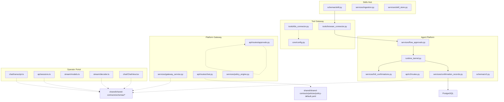
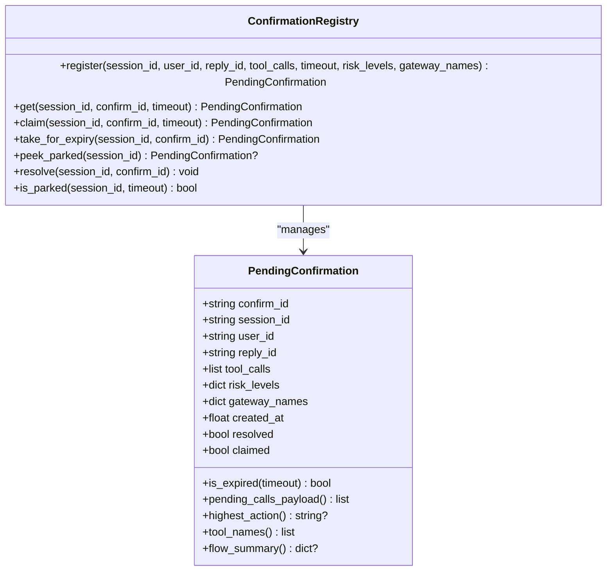
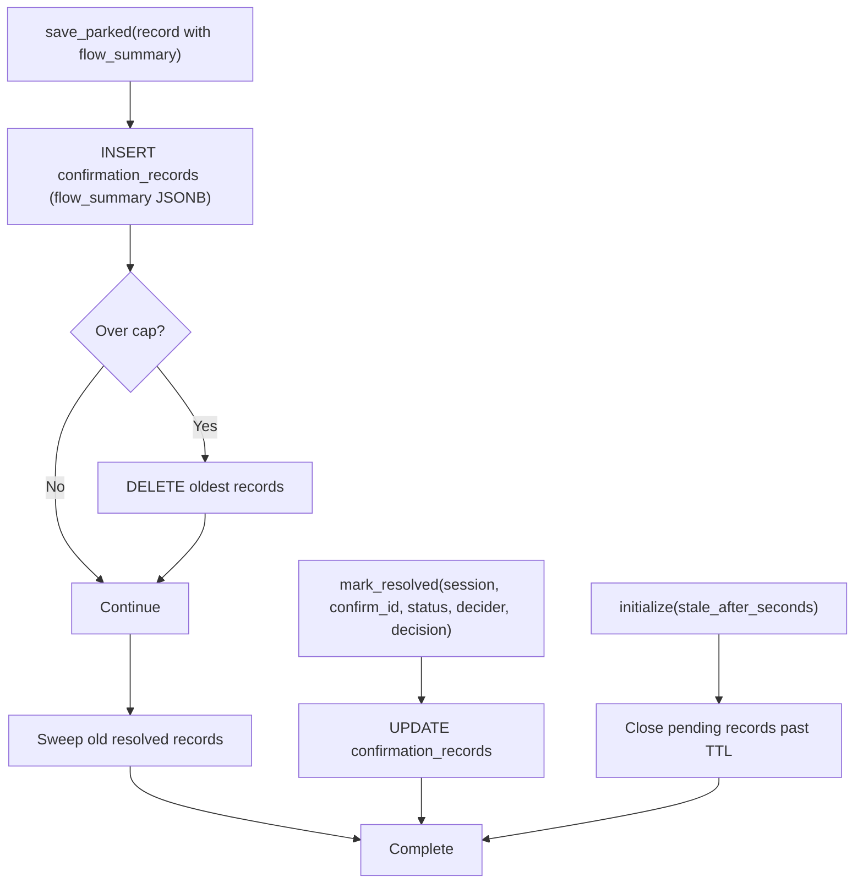
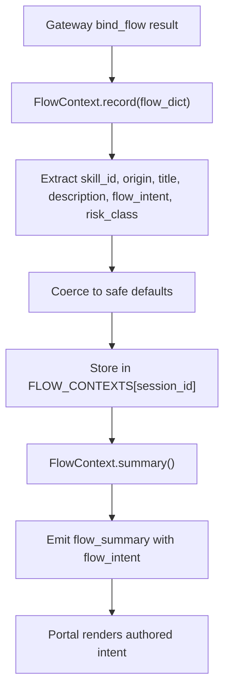
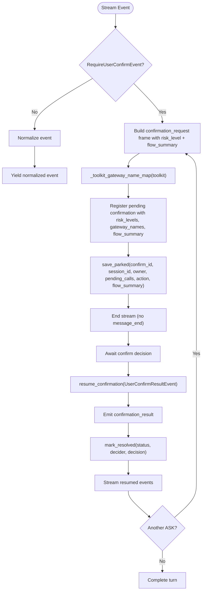
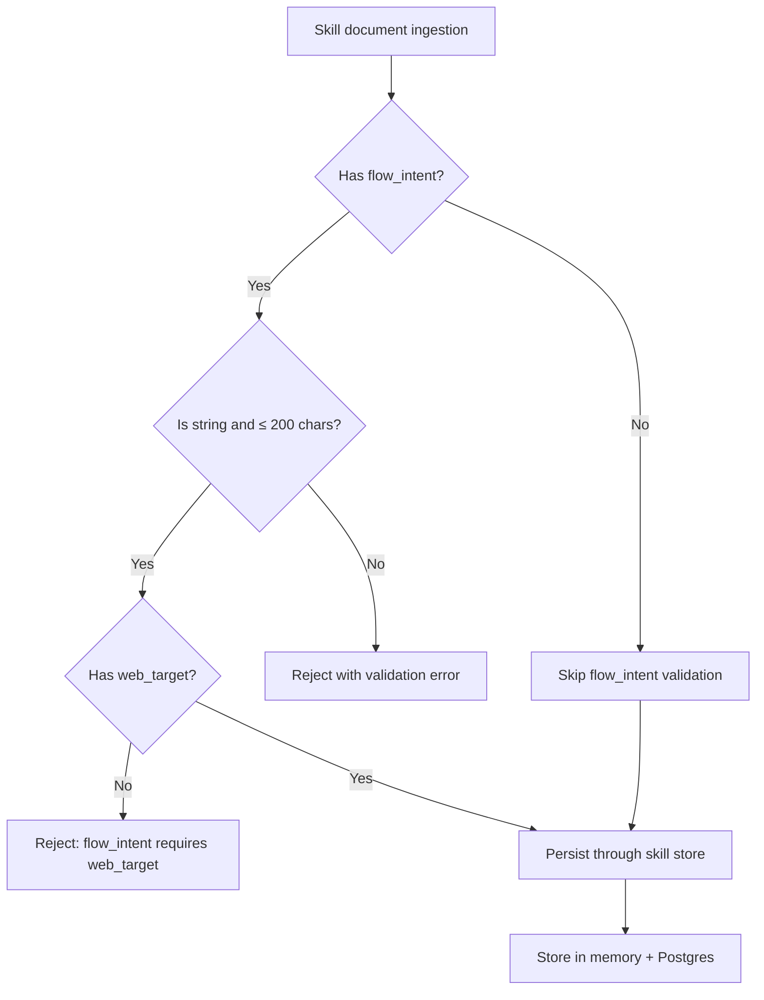
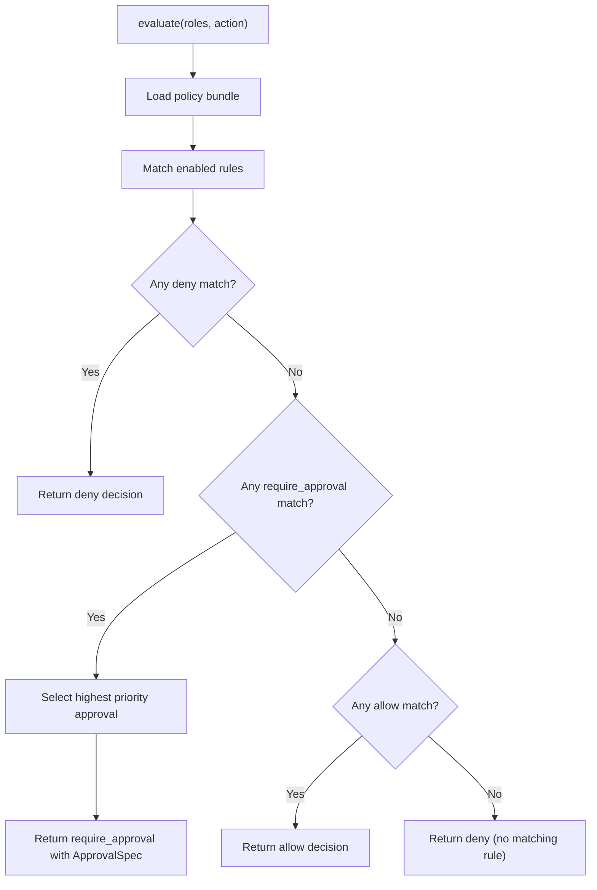
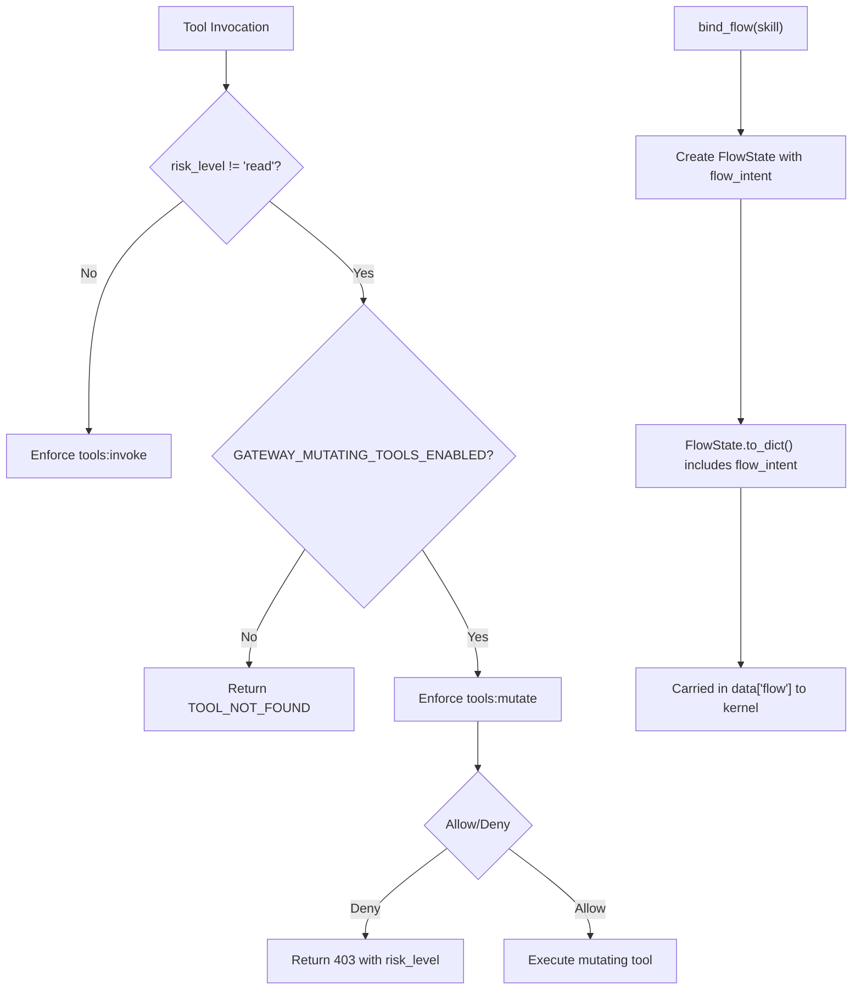
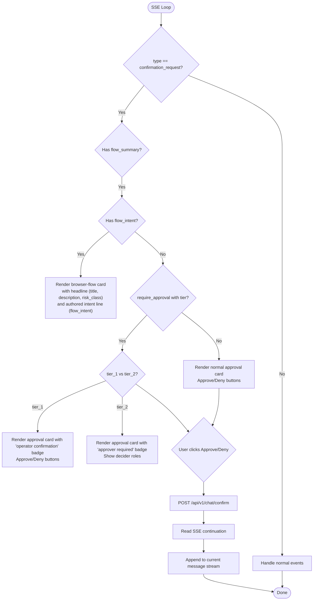
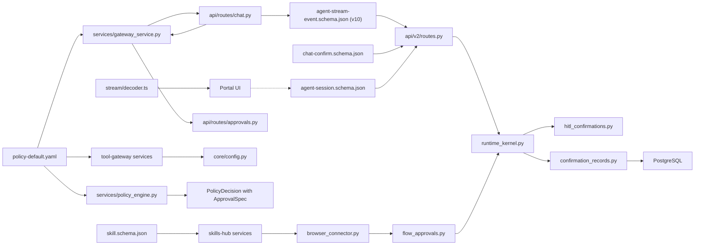

# HITL Confirmation Bridging (SPEC-020)

<cite>
**Referenced Files in This Document**
- [spec.md](file://docs/specs/SPEC-020-hitl-confirmation-bridging/spec.md)
- [plan.md](file://docs/specs/SPEC-020-hitl-confirmation-bridging/plan.md)
- [tasks.md](file://docs/specs/SPEC-020-hitl-confirmation-bridging/tasks.md)
- [release-notes.md](file://docs/agentic-aiops-platform/release-notes/2026-08-21-hitl-confirmation-bridging.md)
- [mutating-tool-name-regression.md](file://docs/agentic-aiops-platform/release-notes/2026-08-28-mutating-tool-name-regression.md)
- [multimodel-runtime-and-live-discovery.md](file://docs/agentic-aiops-platform/release-notes/2026-08-24-multimodel-runtime-and-live-discovery.md)
- [approval-inbox-persistent-confirmation.md](file://docs/agentic-aiops-platform/release-notes/2026-08-25-approval-inbox-persistent-confirmation.md)
- [confirmation-race-and-restart-sweep-patch.md](file://docs/agentic-aiops-platform/release-notes/2026-08-25-confirmation-race-and-restart-sweep-patch.md)
- [post-live-check-confirmation-card-flow-headline.md](file://docs/agentic-aiops-platform/release-notes/2026-09-05-post-live-check-confirmation-card-flow-headline.md)
- [SPEC-053 spec.md](file://docs/specs/SPEC-053-skill-declared-step-intent/spec.md)
- [SPEC-053 plan.md](file://docs/specs/SPEC-053-skill-declared-step-intent/plan.md)
- [flow_approvals.py](file://products/agent-platform/src/agent_service/services/flow_approvals.py)
- [hitl_confirmations.py](file://products/agent-platform/src/agent_service/services/hitl_confirmations.py)
- [confirmation_records.py](file://products/agent-platform/src/agent_service/services/confirmation_records.py)
- [runtime_kernel.py](file://products/agent-platform/src/agent_service/runtime_kernel.py)
- [routes.py](file://products/agent-platform/src/agent_service/api/v2/routes.py)
- [v2.py](file://products/agent-platform/src/agent_service/schemas/v2.py)
- [chat-confirm.schema.json](file://shared/shared-contracts/schemas/chat-confirm.schema.json)
- [agent-stream-event.schema.json](file://shared/shared-contracts/schemas/agent-stream-event.schema.json)
- [agent-session.schema.json](file://shared/shared-contracts/schemas/agent-session.schema.json)
- [policy-default.yaml](file://shared/shared-contracts/policies/policy-default.yaml)
- [skill.py](file://products/skills-hub/src/skills_hub/schemas/skill.py)
- [ingestion.py](file://products/skills-hub/src/skills_hub/services/ingestion.py)
- [browser_connector.py](file://products/tool-gateway/src/tool_gateway/tools/browser_connector.py)
- [chat.py](file://products/platform-gateway/src/platform_gateway/api/routes/chat.py)
- [gateway_service.py](file://products/platform-gateway/src/platform_gateway/services/gateway_service.py)
- [policy_engine.py](file://products/platform-gateway/src/platform_gateway/services/policy_engine.py)
- [approvals.py](file://products/platform-gateway/src/platform_gateway/api/routes/approvals.py)
- [ChatView.tsx](file://products/operator-portal/web-ui/app/src/chat/ChatView.tsx)
- [decoder.ts](file://products/operator-portal/web-ui/app/src/stream/decoder.ts)
- [models.ts](file://products/operator-portal/web-ui/app/src/stream/models.ts)
- [sessions.ts](file://products/operator-portal/web-ui/app/src/api/sessions.ts)
- [transcript.ts](file://products/operator-portal/web-ui/app/src/chat/transcript.ts)
- [k8s_connector.py](file://products/tool-gateway/src/tool_gateway/tools/k8s_connector.py)
- [config.py](file://products/tool-gateway/src/tool_gateway/core/config.py)
</cite>

## Update Summary
**Changes Made**
- Added SPEC-053 skill-declared step intent support with `flow_intent` field throughout the browser flow pipeline
- Enhanced confirmation cards to display plain-text decision line above technical details for browser flow approval workflows
- Updated stream contract schemas from v9 to v10 to include optional `flow_intent` field in flow_summary
- Modified skills-hub ingestion and storage to validate and persist `flow_intent` frontmatter declarations
- Enhanced operator portal components to render authored intent as prominent decision line in confirmation cards
- Updated tool gateway to carry `flow_intent` through browser flow binding to kernel confirmation frames
- Added comprehensive validation ensuring `flow_intent` requires `web_target` declaration and stays within 200 character limit

## Table of Contents
1. Introduction
2. Project Structure
3. Core Components
4. Architecture Overview
5. Detailed Component Analysis
6. Dependency Analysis
7. Performance Considerations
8. Troubleshooting Guide
9. Conclusion

## Introduction
This document explains the Human-in-the-Loop (HITL) confirmation bridging implemented under SPEC-020, enhanced with SPEC-021's bounded mutating actions, SPEC-030's require-approval tier system, SPEC-031's persistent confirmation registry, and SPEC-053's skill-declared step intent. The bridge transforms kernel ASK parking into a portal-visible approval flow with tiered governance, durable state management, and authored workflow intent: tier_1 allows operator self-confirmation for routine destructive actions, while tier_2 requires designated approvers distinct from the requester for critical destructive actions.

Key outcomes:
- Kernel ASK events become SSE confirmation_request frames with risk_level metadata and tier requirements.
- A new confirm endpoint resumes parked replies with approve/deny, enforcing tier-based approval policies.
- Platform-gateway proxies confirm requests under deny-by-default action with tier enforcement.
- Operator portal renders inline approval cards with tier badges, permission messages, and authored intent lines.
- Decisions are recorded in durable audit trail with approval rule context.
- Mutating tools require both chat:confirm approval AND tools:mutate policy authorization.
- **Tiered governance**: tier_1 permits self-approval for routine actions; tier_2 requires separate approver identity.
- **Risk-level action derivation**: Tools automatically map to policy actions based on their risk tier (read/write/admin).
- **Approval bridge**: New pending-confirmation endpoint provides authoritative state for tier enforcement decisions.
- **Persistent state**: Confirmation records survive pod restarts and replica boundaries through Postgres-backed storage.
- **Race resilience**: Concurrent approver attempts resolve to structured outcomes rather than errors.
- **Cross-session discovery**: Designated approvers can discover and act on parked confirmations across sessions via approvals inbox.
- **Owner transcript persistence**: Confirmed decisions persist in owner transcripts after re-login or pod restarts.
- **Flow summary propagation**: Browser-flow headline metadata (skill_id, origin, title, description, risk_class) preserved throughout pipeline from stream frames to final card rendering for consistent workflow framing.
- **Canonical tool name resolution**: Approved mutating tool invocations correctly resolve to gateway registry using canonical dotted names instead of sanitized model-visible names.
- **Skill-declared step intent**: Author-written `flow_intent` displayed as prominent decision line above technical details for browser flow approval workflows.

**Section sources**
- [spec.md:11-20](file://docs/specs/SPEC-020-hitl-confirmation-bridging/spec.md#L11-L20)
- [release-notes.md:3-35](file://docs/agentic-aiops-platform/release-notes/2026-08-21-hitl-confirmation-bridging.md#L3-L35)
- [mutating-tool-name-regression.md:7-58](file://docs/agentic-aiops-platform/release-notes/2026-08-28-mutating-tool-name-regression.md#L7-L58)
- [multimodel-runtime-and-live-discovery.md:126-136](file://docs/agentic-aiops-platform/release-notes/2026-08-24-multimodel-runtime-and-live-discovery.md#L126-L136)
- [approval-inbox-persistent-confirmation.md:6-51](file://docs/agentic-aiops-platform/release-notes/2026-08-25-approval-inbox-persistent-confirmation.md#L6-L51)
- [post-live-check-confirmation-card-flow-headline.md:1-56](file://docs/agentic-aiops-platform/release-notes/2026-09-05-post-live-check-confirmation-card-flow-headline.md#L1-L56)
- [SPEC-053 spec.md:19-51](file://docs/specs/SPEC-053-skill-declared-step-intent/spec.md#L19-L51)
- [spec.md:17-31](file://docs/specs/SPEC-030-require-approval-policy-semantics/spec.md#L17-L31)
- [spec.md:43-67](file://docs/specs/SPEC-031-approval-inbox-persistent-confirmation/spec.md#L43-L67)

## Project Structure
The feature spans three products plus shared contracts, enhanced with SPEC-021 capabilities, SPEC-030 tier enforcement, SPEC-031 persistent storage, SPEC-053 skill-declared intent, v0.23.1 canonical name resolution, and v0.33.1 flow summary propagation:
- Agent platform: runtime park/resume, in-memory registry with risk tracking, v2 routes, schemas, settings, and durable confirmation records store.
- Platform gateway: confirm proxy route, tiered policy enforcement, audit emission, approval validation, and approvals inbox relay.
- Tool gateway: risk-tier admission gate, mutating tool registration, tools:mutate enforcement, and browser flow binding with intent propagation.
- Skills hub: skill envelope validation, ingestion pipeline, and storage backend with flow_intent support.
- Operator portal: confirmation card rendering with tier badges, confirm handler, approvals view, and authored intent display.
- Shared contracts: stream event schema growth with risk_level, confirm request schema, policy rule with approval tiers, session schema with flow_summary support, and skill schema with flow_intent field.



**Diagram sources**
- [skill.py:15-43](file://products/skills-hub/src/skills_hub/schemas/skill.py#L15-L43)
- [ingestion.py:199-213](file://products/skills-hub/src/skills_hub/services/ingestion.py#L199-L213)
- [browser_connector.py:410-421](file://products/tool-gateway/src/tool_gateway/tools/browser_connector.py#L410-L421)
- [flow_approvals.py:54-97](file://products/agent-platform/src/agent_service/services/flow_approvals.py#L54-L97)
- [runtime_kernel.py:657-794](file://products/agent-platform/src/agent_service/runtime_kernel.py#L657-L794)
- [hitl_confirmations.py:85-208](file://products/agent-platform/src/agent_service/services/hitl_confirmations.py#L85-L208)
- [confirmation_records.py:214-565](file://products/agent-platform/src/agent_service/services/confirmation_records.py#L214-L565)
- [routes.py:156-227](file://products/agent-platform/src/agent_service/api/v2/routes.py#L156-L227)
- [v2.py:120-150](file://products/agent-platform/src/agent_service/schemas/v2.py#L120-L150)
- [chat.py:134-175](file://products/platform-gateway/src/platform_gateway/api/routes/chat.py#L134-L175)
- [gateway_service.py:336-446](file://products/platform-gateway/src/platform_gateway/services/gateway_service.py#L336-L446)
- [policy_engine.py:335-389](file://products/platform-gateway/src/platform_gateway/services/policy_engine.py#L335-389)
- [approvals.py:19-51](file://products/platform-gateway/src/platform_gateway/api/routes/approvals.py#L19-L51)
- [ChatView.tsx:370-569](file://products/operator-portal/web-ui/app/src/chat/ChatView.tsx#L370-L569)
- [decoder.ts:39-125](file://products/operator-portal/web-ui/app/src/stream/decoder.ts#L39-L125)
- [models.ts:70-92](file://products/operator-portal/web-ui/app/src/stream/models.ts#L70-L92)
- [sessions.ts:58-85](file://products/operator-portal/web-ui/app/src/api/sessions.ts#L58-L85)
- [transcript.ts:116-133](file://products/operator-portal/web-ui/app/src/chat/transcript.ts#L116-L133)

**Section sources**
- [plan.md:3-6](file://docs/specs/SPEC-020-hitl-confirmation-bridging/plan.md#L3-L6)
- [tasks.md:5-41](file://docs/specs/SPEC-020-hitl-confirmation-bridging/tasks.md#L5-L41)

## Core Components
- **Enhanced Confirmation Registry**: In-memory per-process store keyed by session_id with risk tracking and canonical name mapping; supports register, claim, resolve, expiry, and parked checks with risk tier awareness. Single pending confirmation per session with optional risk metadata and gateway name mapping.
- **Durable Confirmation Records Store**: Postgres-backed persistence layer that survives pod restarts and maintains consistency across replicas. Implements bounded storage (50 records per session, 30-day inbox history) with automatic cleanup and stale record handling. Now includes flow_summary JSONB column for browser-flow headline preservation.
- **Runtime kernel bridge**: Translates RequireUserConfirmEvent into confirmation_request frame with risk_level payload, registers pending calls with risk mapping and canonical name resolution, ends stream without message_end, and resumes via UserConfirmResultEvent on decision. Now persists confirmation lifecycle to durable store before streaming and includes flow_summary in parked records.
- **Flow Context Management**: Tracks browser flow state including skill_id, origin, title, description, risk_class, and now flow_intent for authored intent display. Provides summary() method that emits complete flow context including the new flow_intent field for card rendering.
- **Confirm route (agent platform)**: POST /api/v2/chat/confirm validates ownership, claims entry, handles expired/unknown states, streams resumed reply with confirmation_result first. **Updated**: Now uses degraded model resolution to prevent UnknownModelError exceptions and removed session ownership assertion for tier_2 approvers. **Enhanced**: Persists decision outcomes immediately at claim time for race resilience. **New**: Includes flow_summary coercion for schema compliance.
- **Pending confirmation endpoint**: GET /api/v2/chat/pending-confirmation provides authoritative parked batch metadata including owner_user_id, derived policy action, and pending_calls with risk levels for gateway tier enforcement.
- **Confirm proxy (platform gateway)**: POST /api/v1/chat/confirm enforces chat:confirm action, obtains delegated token, proxies to agent platform, emits confirmation_decided audit when kernel applies decision. **Enhanced**: Enforces tier-based approval requirements against decided_by_roles using pending confirmation data. **Updated**: Passes through structured 409 responses with detailed resolution information.
- **Approvals inbox API**: GET /api/v1/approvals/inbox provides cross-session discovery for designated approvers with metadata-only items preserving owner scoping.
- **Session detail confirmation cards**: GET /api/v2/sessions/{id} includes additive `confirmations` field with ordered records from durable store, enabling persistent card rendering in owner transcripts. **Enhanced**: Now includes flow_summary for browser-flow headline rendering.
- **Stream event normalization**: `_normalize_stream_event` passes flow_summary through defensive `_coerce_flow_summary` that keeps only contract's fields including flow_intent and degrades non-dict summaries to absent.
- **Portal decoder enhancement**: `toFlowSummary` function parses card-level browser-flow headline from stream frames, returning undefined for non-browser cards so they fall back to plain tool-action rendering. **Updated**: Now includes flowIntent field mapping from flow_intent wire format.
- **Tiered Policy Engine**: Evaluates actions with deny > require_approval > allow precedence, returns ApprovalSpec with tier information for require_approval decisions.
- **Risk-tier admission (tool gateway)**: Enforces tools:mutate policy action for write/admin tools, gates k8s.delete_pod behind GATEWAY_MUTATING_TOOLS_ENABLED flag.
- **Skill intent validation**: Validates flow_intent frontmatter declarations requiring web_target presence, enforcing 200 character limits and string type constraints.
- **Portal card**: Renders confirmation_request as inline card with tier badges ("operator confirmation" vs "approver required"), tool names, parameters, and permission message; posts to gateway confirm and continues SSE stream after decision. **Enhanced**: Supports persistent card rendering from durable records and Approvals view for designated approvers. **New**: Displays authored intent as prominent decision line above technical details when flow_intent is present.

**Section sources**
- [hitl_confirmations.py:34-208](file://products/agent-platform/src/agent_service/services/hitl_confirmations.py#L34-L208)
- [confirmation_records.py:114-565](file://products/agent-platform/src/agent_service/services/confirmation_records.py#L114-L565)
- [runtime_kernel.py:657-794](file://products/agent-platform/src/agent_service/runtime_kernel.py#L657-L794)
- [routes.py:65-227](file://products/agent-platform/src/agent_service/api/v2/routes.py#L65-L227)
- [routes.py:497-614](file://products/agent-platform/src/agent_service/api/v2/routes.py#L497-L614)
- [v2.py:120-150](file://products/agent-platform/src/agent_service/schemas/v2.py#L120-L150)
- [v2.py:210-242](file://products/agent-platform/src/agent_service/schemas/v2.py#L210-L242)
- [chat.py:134-175](file://products/platform-gateway/src/platform_gateway/api/routes/chat.py#L134-L175)
- [gateway_service.py:336-446](file://products/platform-gateway/src/platform_gateway/services/gateway_service.py#L336-L446)
- [policy_engine.py:97-148](file://products/platform-gateway/src/platform_gateway/services/policy_engine.py#L97-L148)
- [approvals.py:19-51](file://products/platform-gateway/src/platform_gateway/api/routes/approvals.py#L19-L51)
- [k8s_connector.py:439-518](file://products/tool-gateway/src/tool_gateway/tools/k8s_connector.py#L439-L518)
- [config.py:75-81](file://products/tool-gateway/src/tool_gateway/core/config.py#L75-L81)
- [decoder.ts:39-125](file://products/operator-portal/web-ui/app/src/stream/decoder.ts#L39-L125)
- [ChatView.tsx:370-569](file://products/operator-portal/web-ui/app/src/chat/ChatView.tsx#L370-L569)
- [flow_approvals.py:54-97](file://products/agent-platform/src/agent_service/services/flow_approvals.py#L54-L97)
- [skill.py:15-43](file://products/skills-hub/src/skills_hub/schemas/skill.py#L15-L43)
- [ingestion.py:199-213](file://products/skills-hub/src/skills_hub/services/ingestion.py#L199-L213)

## Architecture Overview
End-to-end flow from kernel ASK to portal decision and resumed execution, enhanced with tiered approval enforcement, resilient model resolution, persistent state management, canonical tool name resolution, flow summary propagation, and skill-declared intent display:

```mermaid
sequenceDiagram
participant Skill as "Skill Declaration"
participant Hub as "Skills Hub"
participant GW as "Tool Gateway"
participant AP as "Agent Platform"
participant RK as "Runtime Kernel"
participant Reg as "ConfirmationRegistry"
participant Store as "ConfirmationRecordStore"
participant DB as "PostgreSQL"
participant Portal as "Operator Portal"
Note over Skill : Skill declares flow_intent frontmatter
Skill->>Hub : Ingest skill with flow_intent
Hub->>Hub : Validate flow_intent requires web_target
Hub->>DB : Persist skill with flow_intent
Note over RK : Stream turn begins
RK-->>AP : RequireUserConfirmEvent + risk_levels + flow_summary
AP->>Reg : register(session, user, reply, tool_calls, timeout, risk_levels, gateway_names)
AP->>Store : save_parked(confirm_id, session_id, owner, pending_calls, action, flow_summary)
Store->>DB : INSERT confirmation_records (with flow_summary JSONB including flow_intent)
AP-->>Portal : data : {type : "confirmation_request", confirm_id, pending_calls[risk_level, canonical_tool_name], flow_summary{title, description, flow_intent}, message}
Portal->>GW : POST /api/v1/chat/confirm {session_id, confirm_id, decision}
GW->>GW : enforce_policy("chat : confirm")
alt Decision involves write/admin tool
GW->>GW : evaluate("tools : mutate") - may return require_approval
GW->>GW : check tier enforcement (decided_by_roles)
alt tier_2 self-approval attempt
GW-->>Portal : 403 Forbidden (self_approval)
else tier_1 or approved tier_2
GW->>AP : POST /api/v2/chat/confirm (delegated token)
AP->>Reg : claim(session, confirm_id, timeout)
alt Expired
AP-->>Portal : 410 Gone
else Unknown/Resolved
AP->>Store : load_record(session, confirm_id)
alt Already resolved
AP-->>Portal : 409 already_resolved (structured outcome)
else Unknown
AP-->>Portal : 404 Not Found
else Owner mismatch
AP-->>Portal : Error frame
else OK
AP->>AP : _resolve_model(None, session.model) - degrades stale pins
AP->>Store : mark_resolved(session, confirm_id, status, decider, decision) - claim-time persistence
AP->>RK : resume_confirmation(pending, decision, bearer_token, model_id)
RK-->>AP : Stream starts with confirmation_result(approved|denied)
AP->>Store : mark_resolved(session, confirm_id, status, decider, decision) - safety net
Store->>DB : UPDATE confirmation_records
AP-->>Portal : SSE continuation (tool_call/tool_result/message_*)
GW->>GW : Emit confirmation_decided audit on first confirmation_result
end
end
end
```

**Diagram sources**
- [skill.py:15-43](file://products/skills-hub/src/skills_hub/schemas/skill.py#L15-L43)
- [ingestion.py:199-213](file://products/skills-hub/src/skills_hub/services/ingestion.py#L199-L213)
- [browser_connector.py:410-421](file://products/tool-gateway/src/tool_gateway/tools/browser_connector.py#L410-L421)
- [flow_approvals.py:54-97](file://products/agent-platform/src/agent_service/services/flow_approvals.py#L54-L97)
- [runtime_kernel.py:657-794](file://products/agent-platform/src/agent_service/runtime_kernel.py#L657-L794)
- [runtime_kernel.py:1090-1125](file://products/agent-platform/src/agent_service/runtime_kernel.py#L1090-L1125)
- [confirmation_records.py:407-455](file://products/agent-platform/src/agent_service/services/confirmation_records.py#L407-L455)
- [routes.py:156-227](file://products/agent-platform/src/agent_service/api/v2/routes.py#L156-L227)
- [routes.py:497-614](file://products/agent-platform/src/agent_service/api/v2/routes.py#L497-L614)
- [routes.py:277-294](file://products/agent-platform/src/agent_service/api/v2/routes.py#L277-L294)
- [gateway_service.py:336-446](file://products/platform-gateway/src/platform_gateway/services/gateway_service.py#L336-L446)
- [chat.py:134-175](file://products/platform-gateway/src/platform_gateway/api/routes/chat.py#L134-L175)
- [policy_engine.py:335-389](file://products/platform-gateway/src/platform_gateway/services/policy_engine.py#L335-389)
- [hitl_confirmations.py:101-199](file://products/agent-platform/src/agent_service/services/hitl_confirmations.py#L101-L199)
- [decoder.ts:39-125](file://products/operator-portal/web-ui/app/src/stream/decoder.ts#L39-L125)

## Detailed Component Analysis

### Enhanced Confirmation Registry (In-Memory State with Risk Tracking and Canonical Name Mapping)
Responsibilities:
- Register pending confirmations per session with TTL awareness and risk level mapping.
- Atomic claim to prevent double-resume.
- Resolve entries after decision or expiry closure.
- Provide parked checks for new-turn rejection.
- Track risk levels per tool call for portal visualization.
- **v0.23.1 Enhancement**: Maintain gateway_names mapping between sanitized model-visible names and canonical dotted names required by gateway registry.
- **New**: Derive policy actions from risk levels using RISK_LEVEL_ACTIONS mapping.

Concurrency and safety:
- Single-flight claim via claimed flag prevents duplicate decisions.
- Expiry path uses take_for_expiry to avoid interrupting in-flight resumes.
- No persistence across restarts; parked state is lost safely.
- Risk levels captured at park time from toolkit discovery.
- **v0.23.1 Enhancement**: Canonical name mapping captured at park time ensures approved tool invocations resolve correctly at gateway registry.



**Diagram sources**
- [hitl_confirmations.py:34-208](file://products/agent-platform/src/agent_service/services/hitl_confirmations.py#L34-L208)

**Section sources**
- [hitl_confirmations.py:85-208](file://products/agent-platform/src/agent_service/services/hitl_confirmations.py#L85-L208)

### Durable Confirmation Records Store (Postgres Backing)
Responsibilities:
- Persist every parked confirmation and its resolution to PostgreSQL for restart survival and replica consistency.
- Implement bounded storage with session-scoped caps (50 records per session) and inbox history windows (30 days).
- Handle stale pending records on startup by marking them as expired since parked kernel replies cannot survive process restarts.
- Provide best-effort persistence that degrades gracefully when Postgres is unavailable.
- Support cross-session queries for approvals inbox with metadata-only exposure.
- **New**: Include flow_summary JSONB column for browser-flow headline preservation across all surfaces.

Storage design:
- Uses same Postgres posture as SPEC-016 session store with shared database connection management.
- Implements opportunistic sweep patterns similar to other stores for efficient cleanup.
- Maintains separation between hot-path in-memory registry and durable record store.
- **Enhanced**: Startup sweep now uses configurable TTL scoping via AGENT_HITL_CONFIRM_TIMEOUT for precise stale record identification.
- **New**: flow_summary column migration handled automatically at startup for backward compatibility.



**Diagram sources**
- [confirmation_records.py:407-455](file://products/agent-platform/src/agent_service/services/confirmation_records.py#L407-L455)
- [confirmation_records.py:233-317](file://products/agent-platform/src/agent_service/services/confirmation_records.py#L233-L317)
- [confirmation_records.py:279-285](file://products/agent-platform/src/agent_service/services/confirmation_records.py#L279-L285)
- [confirmation_records.py:415-431](file://products/agent-platform/src/agent_service/services/confirmation_records.py#L415-L431)

**Section sources**
- [confirmation_records.py:114-565](file://products/agent-platform/src/agent_service/services/confirmation_records.py#L114-L565)

### Flow Context Management (Browser Flow Intent Tracking)
Responsibilities:
- Track browser flow state including skill_id, origin, title, description, risk_class, and flow_intent for authored intent display.
- Record flow context from gateway bind_flow results with defensive field coercion.
- Provide summary() method that emits complete flow context including flow_intent for card rendering.
- Maintain flow identity (skill_id, origin) for authority scoping and deviation detection.
- Support flow approval tracking with TTL-based authority expiration.

Flow context structure:
- FlowContext dataclass captures all flow metadata including the new flow_intent field.
- record() method reads flow_intent from gateway flow dict with safe string coercion.
- summary() method includes flow_intent in emitted payload for confirmation frames.
- FlowApprovalStore tracks authorizations scoped to flow identity with TTL enforcement.



**Diagram sources**
- [flow_approvals.py:54-97](file://products/agent-platform/src/agent_service/services/flow_approvals.py#L54-L97)
- [flow_approvals.py:112-131](file://products/agent-platform/src/agent_service/services/flow_approvals.py#L112-L131)

**Section sources**
- [flow_approvals.py:54-97](file://products/agent-platform/src/agent_service/services/flow_approvals.py#L54-L97)
- [flow_approvals.py:112-131](file://products/agent-platform/src/agent_service/services/flow_approvals.py#L112-L131)

### Runtime Kernel Bridge (Park and Resume with Risk Mapping, Canonical Name Resolution, and Flow Summary Propagation)
Behavior:
- On RequireUserConfirmEvent, builds confirmation_request frame with risk_level payload, registers pending calls with risk mapping and canonical name resolution, yields frame, and ends stream without message_end.
- **Enhanced**: Persists confirmation lifecycle to durable store before streaming confirmation_request frame to client.
- **New**: Includes flow_summary in parked records and confirmation_request frames for browser-flow headline preservation.
- resume_confirmation sets delegated token, emits confirmation_result first, then streams resumed reply through normalization/evidence pipeline.
- **Enhanced**: Records resolution outcome to durable store after confirmation_result flows through.
- Handles chained parks: resumed turns can trigger another ASK, emitting a fresh confirmation_request.
- Filters mutating tools when HITL bridging is disabled to maintain honest posture.
- **v0.23.1 Enhancement**: Captures gateway_tool_name mapping from toolkit to ensure canonical names flow through signed execution envelopes.



**Diagram sources**
- [runtime_kernel.py:555-644](file://products/agent-platform/src/agent_service/runtime_kernel.py#L555-L644)
- [runtime_kernel.py:657-794](file://products/agent-platform/src/agent_service/runtime_kernel.py#L657-L794)
- [runtime_kernel.py:1090-1125](file://products/agent-platform/src/agent_service/runtime_kernel.py#L1090-L1125)
- [runtime_kernel.py:1328-1344](file://products/agent-platform/src/agent_service/runtime_kernel.py#L1328-L1344)

**Section sources**
- [runtime_kernel.py:657-794](file://products/agent-platform/src/agent_service/runtime_kernel.py#L657-L794)
- [runtime_kernel.py:1090-1125](file://products/agent-platform/src/agent_service/runtime_kernel.py#L1090-L1125)
- [runtime_kernel.py:1328-1344](file://products/agent-platform/src/agent_service/runtime_kernel.py#L1328-L1344)

### Stream Event Normalization (Flow Summary Coercion)
Responsibilities:
- Translate kernel stream chunks into contract-conformant events with defensive field validation.
- **New**: Include flow_summary field in AgentStreamEvent schema (v9 → v10) for confirmation_request frames carrying bound browser-flow headlines including flow_intent.
- **New**: Implement `_coerce_flow_summary` function that keeps only contract's fields including flow_intent and degrades non-dict summaries to absent.
- Ensure malformed flow summaries never fail frame's additionalProperties:false validation.
- Maintain backward compatibility for non-browser cards where flow_summary is absent.

Schema evolution:
- Stream contract bumped from v9 to v10 to declare optional flow_intent field in flow_summary.
- Defensive coercion ensures only valid string fields survive transformation.
- Non-dict flow summaries degrade to None, allowing fallback to plain tool-action rendering.


**Diagram sources**
- [routes.py:497-614](file://products/agent-platform/src/agent_service/api/v2/routes.py#L497-L614)
- [v2.py:120-150](file://products/agent-platform/src/agent_service/schemas/v2.py#L120-L150)

**Section sources**
- [routes.py:497-614](file://products/agent-platform/src/agent_service/api/v2/routes.py#L497-L614)
- [v2.py:120-150](file://products/agent-platform/src/agent_service/schemas/v2.py#L120-L150)

### Skill Intent Validation and Storage
Responsibilities:
- Validate flow_intent frontmatter declarations in skill documents.
- Enforce flow_intent requires web_target declaration (mirroring risk_class validation).
- Limit flow_intent to 200 characters maximum length.
- Persist flow_intent through both in-memory and Postgres skill stores.
- Return flow_intent in full-record responses while maintaining list/search summary shapes.

Validation rules:
- flow_intent must be a non-empty string when present.
- flow_intent requires web_target to be declared in the same skill.
- flow_intent is validated through existing validation framework with precise rejection reasons.
- Both store backends must round-trip flow_intent values without loss.



**Diagram sources**
- [skill.py:15-43](file://products/skills-hub/src/skills_hub/schemas/skill.py#L15-L43)
- [ingestion.py:199-213](file://products/skills-hub/src/skills_hub/services/ingestion.py#L199-L213)

**Section sources**
- [skill.py:15-43](file://products/skills-hub/src/skills_hub/schemas/skill.py#L15-L43)
- [ingestion.py:199-213](file://products/skills-hub/src/skills_hub/services/ingestion.py#L199-L213)

### Tiered Policy Engine (SPEC-030 Implementation)
Responsibilities:
- Evaluate actions with deny > require_approval > allow precedence.
- Parse and validate require_approval rules with approval tiers (tier_1, tier_2).
- Return ApprovalSpec with tier information and decided_by_roles for require_approval decisions.
- Enforce tier constraints: tier_1 allows self-approval by default, tier_2 forbids it.
- Validate policy bundles at load time, rejecting malformed approval configurations.



**Diagram sources**
- [policy_engine.py:335-389](file://products/platform-gateway/src/platform_gateway/services/policy_engine.py#L335-389)

**Section sources**
- [policy_engine.py:97-148](file://products/platform-gateway/src/platform_gateway/services/policy_engine.py#L97-L148)
- [policy_engine.py:183-220](file://products/platform-gateway/src/platform_gateway/services/policy_engine.py#L183-L220)
- [policy_engine.py:335-389](file://products/platform-gateway/src/platform_gateway/services/policy_engine.py#L335-389)

### Agent Platform Confirm Route
Responsibilities:
- Validate session ownership via existing session lookup.
- Claim registry entry before streaming headers to prevent duplicates.
- Map errors: unknown/resolved -> 404, expired -> 410, owner mismatch -> error frame mid-stream.
- Reject new turns on parked sessions with 409 until resolved or expired.
- **Updated**: Uses degraded model resolution to handle evicted session pins gracefully and removed session ownership assertion for tier_2 approvers.
- **Enhanced**: Returns structured 409 already_resolved response with winner's outcome for concurrent approver races.
- **Critical Enhancement**: Persists decision outcomes immediately at claim time, ensuring racing approvers receive structured 409 responses with detailed resolution information while the winning approver's stream continues uninterrupted.

```mermaid
sequenceDiagram
participant Client as "Gateway"
participant Route as "POST /api/v2/chat/confirm"
participant Reg as "ConfirmationRegistry"
participant Store as "ConfirmationRecordStore"
participant Kernel as "RuntimeKernel"
Client->>Route : {session_id, confirm_id, decision}
Route->>Route : get_session(owner check relaxed for tier_2)
Route->>Route : _resolve_model(None, session.model) - degrades stale pins
Route->>Reg : claim(session_id, confirm_id, timeout)
alt Expired
Route->>Kernel : expire_confirmation
Route-->>Client : 410 Gone
else Unknown/Resolved
Route->>Store : load_record(session, confirm_id)
alt Already resolved
Route-->>Client : 409 already_resolved (structured outcome)
else Unknown
Route-->>Client : 404 Not Found
else OK
Route->>Store : mark_resolved(session, confirm_id, status, decider, decision) - claim-time persistence
Route->>Kernel : resume_confirmation(pending, decision, bearer_token, model_id)
Kernel-->>Route : confirmation_result + SSE stream
Route-->>Client : StreamingResponse
end
```

**Diagram sources**
- [routes.py:65-227](file://products/agent-platform/src/agent_service/api/v2/routes.py#L65-L227)
- [routes.py:277-294](file://products/agent-platform/src/agent_service/api/v2/routes.py#L277-L294)
- [hitl_confirmations.py:101-199](file://products/agent-platform/src/agent_service/services/hitl_confirmations.py#L101-L199)
- [runtime_kernel.py:708-794](file://products/agent-platform/src/agent_service/runtime_kernel.py#L708-L794)

**Section sources**
- [routes.py:65-227](file://products/agent-platform/src/agent_service/api/v2/routes.py#L65-L227)

### Platform Gateway Confirm Proxy and Tier Enforcement
Responsibilities:
- Enforce policy action chat:confirm (deny-by-default).
- Obtain delegated token and proxy SSE to agent platform.
- **Enhanced**: Evaluate parked call's tool action against bundle for require_approval decisions.
- **Enhanced**: Enforce tier-based approval requirements against decided_by_roles.
- Emit confirmation_decided audit only when kernel-applied confirmation_result flows through.
- Map upstream 4xx passthrough; transport failures map to 502.
- **Updated**: Passes through structured 409 responses with detailed resolution information including reason, status, decider identity, and timestamps.

```mermaid
sequenceDiagram
participant Portal as "Operator Portal"
participant GW as "Platform Gateway"
participant Policy as "Policy Engine"
participant AP as "Agent Platform"
Portal->>GW : POST /api/v1/chat/confirm
GW->>Policy : enforce_policy("chat : confirm")
Policy-->>GW : allow/deny/require_approval
alt Deny
GW-->>Portal : 403 Forbidden
else Allow or require_approval
GW->>Policy : evaluate("tools : mutate")
Policy-->>GW : require_approval with ApprovalSpec
alt require_approval with tier_2
GW->>GW : check if confirmer == session_owner
alt Self-approval attempt
GW-->>Portal : 403 Forbidden (self_approval)
else Approved tier_2 or tier_1
GW->>AP : POST /api/v2/chat/confirm (delegated token)
AP-->>GW : SSE stream starting with confirmation_result
GW->>GW : emit_audit_event("confirmation_decided")
GW-->>Portal : Stream passthrough (including structured 409 responses)
end
end
```

**Diagram sources**
- [chat.py:134-175](file://products/platform-gateway/src/platform_gateway/api/routes/chat.py#L134-L175)
- [gateway_service.py:336-446](file://products/platform-gateway/src/platform_gateway/services/gateway_service.py#L336-L446)
- [policy_engine.py:335-389](file://products/platform-gateway/src/platform_gateway/services/policy_engine.py#L335-389)
- [policy-default.yaml:113-135](file://shared/shared-contracts/policies/policy-default.yaml#L113-L135)

**Section sources**
- [chat.py:134-175](file://products/platform-gateway/src/platform_gateway/api/routes/chat.py#L134-L175)
- [gateway_service.py:336-446](file://products/platform-gateway/src/platform_gateway/services/gateway_service.py#L336-L446)

### Tool Gateway Risk-Tier Admission and Browser Flow Binding
Responsibilities:
- Enforce tools:mutate policy action for write/admin tools.
- Gate k8s.delete_pod registration behind GATEWAY_MUTATING_TOOLS_ENABLED.
- Return structured 403 responses with risk_level metadata for denied mutations.
- Maintain backward compatibility with read-only tool surface.
- **New**: Carry flow_intent through browser flow binding to kernel confirmation frames.

Browser flow binding:
- bind_flow method populates FlowState with skill metadata including flow_intent.
- FlowState.to_dict() includes flow_intent in data["flow"] for kernel consumption.
- Deviation guard behavior remains unchanged whether flow_intent is present or absent.



**Diagram sources**
- [gateway_service.py:222-263](file://products/tool-gateway/src/tool_gateway/services/gateway_service.py#L222-L263)
- [config.py:75-81](file://products/tool-gateway/src/tool_gateway/core/config.py#L75-L81)
- [browser_connector.py:410-421](file://products/tool-gateway/src/tool_gateway/tools/browser_connector.py#L410-L421)

**Section sources**
- [k8s_connector.py:439-518](file://products/tool-gateway/src/tool_gateway/tools/k8s_connector.py#L439-L518)
- [config.py:75-81](file://products/tool-gateway/src/tool_gateway/core/config.py#L75-L81)
- [browser_connector.py:410-421](file://products/tool-gateway/src/tool_gateway/tools/browser_connector.py#L410-L421)

### Enhanced Operator Portal Confirmation Card and Approvals View
Responsibilities:
- Render confirmation_request as inline card with tier badges and tool names, parameters, and permission message.
- Hide Approve/Deny buttons for roles without chat:confirm (client-side convenience; server re-enforces).
- Post decision to gateway confirm endpoint and continue SSE stream into same message area.
- Lock card status on confirmation_result or error; handle 410 as expired.
- Display tier badges: "operator confirmation" for tier_1, "approver required" for tier_2 with decider roles.
- **Enhanced**: Support persistent card rendering from durable records and Approvals view for designated approvers.
- **New**: Display authored intent as prominent decision line when flow_intent is present, showing skill intent above technical details.
- **New**: Approvals view for designated approvers with pending/history listing, badge count, and decision panel.

Flow summary rendering:
- `toFlowSummary` function parses card-level browser-flow headline from stream frames.
- Returns undefined for non-browser cards, allowing fallback to plain tool-action rendering.
- Converts snake_case fields to camelCase for portal consumption (skill_id → skillId, etc.).
- Preserves all flow context fields including flow_intent → flowIntent.
- **Updated**: Now maps flow_intent wire field to flowIntent view model for rendered decision line.



**Diagram sources**
- [decoder.ts:39-125](file://products/operator-portal/web-ui/app/src/stream/decoder.ts#L39-L125)
- [ChatView.tsx:370-569](file://products/operator-portal/web-ui/app/src/chat/ChatView.tsx#L370-L569)

**Section sources**
- [decoder.ts:39-125](file://products/operator-portal/web-ui/app/src/stream/decoder.ts#L39-L125)
- [ChatView.tsx:370-569](file://products/operator-portal/web-ui/app/src/chat/ChatView.tsx#L370-L569)

## Dependency Analysis
- Contracts:
  - Stream event schema v6 adds confirmation_request and confirmation_result types, confirm_id, pending_calls with optional risk_level, and optional data field on tool_result.
  - Confirm request schema binds session_id, confirm_id, decision.
  - Policy bundle adds tools:mutate action granted to platform-admin and operator roles; observer excluded.
  - **Enhanced**: Policy engine adds require_approval outcome with ApprovalSpec containing tier, decided_by_roles, and allow_self_approval.
  - **New**: Session schema includes additive `confirmations` field for persistent card rendering with flow_summary support.
  - **New**: Stream event schema v9 → v10 adds optional flow_intent on flow_summary for browser-flow headline preservation.
  - **New**: Skill schema adds optional flow_intent field requiring web_target declaration.
- Services:
  - Agent platform depends on runtime kernel and registry for park/resume semantics with risk tracking and canonical name resolution.
  - **Enhanced**: Agent platform now depends on durable confirmation records store for persistence with best-effort degradation.
  - Platform gateway depends on policy engine, delegation client, and agent client for proxying and audit.
  - **New**: Platform gateway includes approvals inbox route with `approvals:list` policy enforcement.
  - Tool gateway depends on policy engine for tools:mutate enforcement and configuration management.
  - Portal depends on SSE parser and styles for card rendering with tier badges.
  - **New**: Portal includes ApprovalsView component for designated approvers and flow summary decoding.
  - **New**: Skills hub depends on validation framework for flow_intent frontmatter processing.



**Diagram sources**
- [agent-stream-event.schema.json:1-121](file://shared/shared-contracts/schemas/agent-stream-event.schema.json#L1-L121)
- [chat-confirm.schema.json:1-27](file://shared/shared-contracts/schemas/chat-confirm.schema.json#L1-L27)
- [agent-session.schema.json:127-138](file://shared/shared-contracts/schemas/agent-session.schema.json#L127-L138)
- [skill.py:15-43](file://products/skills-hub/src/skills_hub/schemas/skill.py#L15-L43)
- [policy-default.yaml:42-54](file://shared/shared-contracts/policies/policy-default.yaml#L42-L54)
- [policy-default.yaml:113-135](file://shared/shared-contracts/policies/policy-default.yaml#L113-L135)
- [routes.py:230-320](file://products/agent-platform/src/agent_service/api/v2/routes.py#L230-L320)
- [gateway_service.py:336-446](file://products/platform-gateway/src/platform_gateway/services/gateway_service.py#L336-L446)
- [chat.py:134-175](file://products/platform-gateway/src/platform_gateway/api/routes/chat.py#L134-L175)
- [approvals.py:19-51](file://products/platform-gateway/src/platform_gateway/api/routes/approvals.py#L19-L51)
- [runtime_kernel.py:657-794](file://products/agent-platform/src/agent_service/runtime_kernel.py#L657-L794)
- [hitl_confirmations.py:85-208](file://products/agent-platform/src/agent_service/services/hitl_confirmations.py#L85-L208)
- [confirmation_records.py:214-565](file://products/agent-platform/src/agent_service/services/confirmation_records.py#L214-L565)
- [config.py:75-81](file://products/tool-gateway/src/tool_gateway/core/config.py#L75-L81)
- [policy_engine.py:97-148](file://products/platform-gateway/src/platform_gateway/services/policy_engine.py#L97-L148)
- [decoder.ts:39-125](file://products/operator-portal/web-ui/app/src/stream/decoder.ts#L39-L125)

**Section sources**
- [agent-stream-event.schema.json:1-121](file://shared/shared-contracts/schemas/agent-stream-event.schema.json#L1-L121)
- [chat-confirm.schema.json:1-27](file://shared/shared-contracts/schemas/chat-confirm.schema.json#L1-L27)
- [agent-session.schema.json:127-138](file://shared/shared-contracts/schemas/agent-session.schema.json#L127-L138)
- [skill.py:15-43](file://products/skills-hub/src/skills_hub/schemas/skill.py#L15-L43)
- [policy-default.yaml:42-54](file://shared/shared-contracts/policies/policy-default.yaml#L42-L54)
- [policy-default.yaml:113-135](file://shared/shared-contracts/policies/policy-default.yaml#L113-L135)

## Performance Considerations
- In-memory registry avoids persistent overhead but means parked confirmations do not survive process restarts; this is intentional and safe.
- Claim-based single-flight prevents duplicate resumption and reduces contention.
- SSE passthrough minimizes transformation cost; only first confirmation_result triggers audit emission.
- Tool evidence data is bounded by middleware caps to keep streams responsive.
- Risk-level mapping is computed once at toolkit construction and cached per token.
- Mutating tool gating prevents unnecessary policy evaluation for read operations.
- **Model resolution caching**: Degraded model resolution happens once per confirm request, avoiding repeated catalog lookups.
- **Policy evaluation caching**: Policy bundle is loaded once and cached per configuration path, reducing evaluation overhead.
- **Tier validation**: Approval tier validation occurs at bundle load time, not per-request, minimizing runtime overhead.
- **Dual-store pattern**: In-memory registry remains hot path for performance-critical claim/resume operations, while Postgres store provides durability with best-effort persistence that doesn't block core flows.
- **Bounded storage**: Confirmation records use session-scoped caps (50 per session) and time-window based inbox history (30 days) to prevent unbounded growth.
- **Opportunistic cleanup**: Stale record cleanup and old resolved record sweeping piggyback on write operations to minimize background overhead.
- **Metadata-only inbox**: Cross-session discovery exposes only metadata fields, preserving owner privacy and reducing data transfer costs.
- **Claim-time persistence**: Immediate outcome persistence at claim time eliminates race conditions while maintaining high performance through best-effort degradation.
- **v0.23.1 Enhancement**: Canonical name mapping is captured once at park time from toolkit, avoiding repeated lookups during confirmation processing.
- **v0.33.1 Enhancement**: Flow summary coercion is lightweight, filtering only five string fields and degrading non-dict values efficiently.
- **SPEC-053 Enhancement**: Flow intent validation occurs during skill ingestion, not per-request, minimizing runtime overhead for confirmation processing.
- **SPEC-053 Enhancement**: Flow intent is stored as simple string field in JSONB, avoiding complex parsing during confirmation rendering.

## Troubleshooting Guide
Common issues and resolutions:
- 409 Conflict on new chat turns: Indicates a parked confirmation exists; answer or wait for expiry before sending a new message.
- 410 Gone on confirm: Confirmation expired; close parked calls and retry with a new turn.
- 404 Not Found: Unknown or already-resolved confirm_id; verify session and confirm_id match.
- 403 Forbidden: Missing chat:confirm role; ensure identity has required role per policy.
- Mid-stream error frame: Owner mismatch between registry and session; re-authenticate and retry.
- Mutating tool absent from discovery: Verify GATEWAY_MUTATING_TOOLS_ENABLED is set to true and RBAC permissions are configured.
- 403 on mutating tool invocation: Ensure tools:mutate policy action is granted to the user's role.
- No confirmation card appears: Check AGENT_HITL_CONFIRM_TIMEOUT setting; when 0, mutating tools are excluded from toolkit entirely.
- **Stuck confirmation with evicted model pin**: If a session had a pinned model that was later evicted by discovery refresh or key revocation, the confirm route now automatically degrades to the catalog default instead of raising UnknownModelError mid-stream.
- **Self-approval blocked**: When tier_2 approval is required, operators cannot approve their own parked calls; use an approver or platform-admin identity.
- **Invalid policy bundle**: Check for malformed require_approval rules; tier_2 cannot have allow_self_approval=true, and require_approval must be on bridged actions only.
- **Missing pending confirmation**: Use GET /api/v2/chat/pending-confirmation to inspect parked batch metadata including owner_user_id and derived policy action for troubleshooting tier enforcement issues.
- **Persistent confirmation not visible**: Check if Postgres backend is available; confirmation records fall back to in-memory when Postgres is unreachable.
- **Concurrent approver conflicts**: Multiple approvers attempting the same confirmation will receive structured "already_resolved" responses instead of errors.
- **Expired cards appearing**: Stale pending records are marked as expired on startup since parked kernel replies cannot survive process restarts.
- **Approvals inbox not accessible**: Verify user has `approvals:list` permission; only `approver` and `platform-admin` roles can access the inbox.
- **Owner transcript missing cards**: Check if session detail includes `confirmations` field; cards should appear even after re-login or pod restarts.
- **Race condition confusion**: Structured 409 responses include winner's outcome; losing approvers can see who decided and when.
- **Startup sweep issues**: Verify AGENT_HITL_CONFIRM_TIMEOUT is properly configured; startup sweep uses this value to identify stale pending records for closure.
- **Postgres initialization failures**: Check AGENT_STATE_STORE_BACKEND and AGENT_STATE_DB_URL configuration; service falls back to in-memory store when Postgres is unavailable.
- **v0.23.1 Fix**: TOOL_NOT_FOUND errors for approved mutating tool invocations are now resolved by using canonical dotted names (e.g., `k8s.delete_pod`) instead of sanitized model-visible names (e.g., `k8s_delete_pod`) in the signed execution envelope.
- **v0.33.1 Issue**: Live operator confirmation card missing browser-flow description while approver inbox shows it; check that flow_summary is properly propagated through stream normalization and that AgentStreamEvent schema includes flow_summary field.
- **Flow summary not rendering**: Verify that flow_summary coercion is working correctly and that only the five contract fields (skill_id, origin, title, description, risk_class) are being passed through.
- **SPEC-053 Issues**: 
  - **Flow intent not displaying**: Check that skill declares flow_intent frontmatter and that web_target is also declared.
  - **Flow intent validation errors**: Verify flow_intent is a non-empty string ≤ 200 characters and skill has web_target declared.
  - **Browser flow card missing intent**: Ensure flow_intent is carried through browser flow binding and kernel confirmation frames.
  - **Portal not showing intent line**: Check that decoder maps flow_intent to flowIntent and ChatView renders the authored intent line.

Operational checks:
- Verify AGENT_HITL_CONFIRM_TIMEOUT > 0 to enable bridging; set to 0 to restore legacy silent-park behavior.
- Confirm policy bundle includes allow-chat-confirm and allow-operators-tools-mutate rules for intended roles.
- Inspect audit trail for confirmation_decided events to validate applied decisions.
- Check tool discovery endpoints to verify mutating tools are registered when enabled.
- Verify GATEWAY_MUTATING_TOOLS_ENABLED configuration in tool-gateway deployment.
- **Monitor model catalog health**: Ensure discovery refreshes don't leave sessions with invalid pinned models; the system should automatically degrade to defaults.
- **Validate policy bundle**: Use make validate-policy to ensure require_approval rules are properly configured.
- **Check tier enforcement**: Verify that tier_2 approvals require separate approver identities in production environments.
- **Use pending confirmation endpoint**: Leverage GET /api/v2/chat/pending-confirmation to debug tier enforcement issues by examining parked batch metadata and derived policy actions.
- **Verify Postgres connectivity**: Check AGENT_STATE_STORE_BACKEND and AGENT_STATE_DB_URL configuration for confirmation record persistence.
- **Monitor confirmation record store**: Use confirmation record store is_ready() method to verify Postgres availability.
- **Check for stale pending records**: After pod restarts, verify that any orphaned pending records were properly marked as expired.
- **Test approvals inbox**: Verify GET /api/v1/approvals/inbox returns metadata-only items for authorized approvers.
- **Validate owner transcript cards**: Check GET /api/v2/sessions/{id} includes confirmations field with persistent card data.
- **Verify startup sweep configuration**: Ensure AGENT_HITL_CONFIRM_TIMEOUT is properly set for accurate stale record identification during startup.
- **Monitor structured 409 responses**: Check that concurrent approver attempts receive detailed resolution information including decider identity and timestamps.
- **v0.23.1 Verification**: Verify that approved mutating tool invocations execute successfully by checking that the signed execution envelope contains canonical dotted tool names (e.g., `k8s.delete_pod`) rather than sanitized names (e.g., `k8s_delete_pod`).
- **v0.33.1 Verification**: Verify that flow_summary is properly included in confirmation_request frames and that the portal decoder correctly parses browser-flow headlines for consistent workflow framing.
- **SPEC-053 Verification**: Verify that skills with flow_intent declarations validate successfully and that browser flow cards display the authored intent line prominently above technical details.

**Section sources**
- [routes.py:65-94](file://products/agent-platform/src/agent_service/api/v2/routes.py#L65-L94)
- [routes.py:156-227](file://products/agent-platform/src/agent_service/api/v2/routes.py#L156-L227)
- [routes.py:277-294](file://products/agent-platform/src/agent_service/api/v2/routes.py#L277-L294)
- [routes.py:497-614](file://products/agent-platform/src/agent_service/api/v2/routes.py#L497-L614)
- [routes.py:578-601](file://products/agent-platform/src/agent_service/api/v2/routes.py#L578-L601)
- [gateway_service.py:336-396](file://products/platform-gateway/src/platform_gateway/services/gateway_service.py#L336-L396)
- [approvals.py:19-51](file://products/platform-gateway/src/platform_gateway/api/routes/approvals.py#L19-L51)
- [policy-default.yaml:42-54](file://shared/shared-contracts/policies/policy-default.yaml#L42-L54)
- [policy-default.yaml:113-135](file://shared/shared-contracts/policies/policy-default.yaml#L113-L135)
- [config.py:75-81](file://products/tool-gateway/src/tool_gateway/core/config.py#L75-L81)
- [multimodel-runtime-and-live-discovery.md:126-136](file://docs/agentic-aiops-platform/release-notes/2026-08-24-multimodel-runtime-and-live-discovery.md#L126-L136)
- [policy_engine.py:211-215](file://products/platform-gateway/src/platform_gateway/services/policy_engine.py#L211-L215)
- [confirmation_records.py:399-405](file://products/agent-platform/src/agent_service/services/confirmation_records.py#L399-L405)
- [confirmation_records.py:415-431](file://products/agent-platform/src/agent_service/services/confirmation_records.py#L415-L431)
- [routes.py:370-410](file://products/agent-platform/src/agent_service/api/v2/routes.py#L370-L410)
- [mutating-tool-name-regression.md:18-58](file://docs/agentic-aiops-platform/release-notes/2026-08-28-mutating-tool-name-regression.md#L18-L58)
- [post-live-check-confirmation-card-flow-headline.md:12-56](file://docs/agentic-aiops-platform/release-notes/2026-09-05-post-live-check-confirmation-card-flow-headline.md#L12-L56)
- [SPEC-053 spec.md:83-108](file://docs/specs/SPEC-053-skill-declared-step-intent/spec.md#L83-L108)
- [SPEC-053 plan.md:34-58](file://docs/specs/SPEC-053-skill-declared-step-intent/plan.md#L34-L58)

## Conclusion
SPEC-020 delivers a robust, auditable HITL bridge that transforms kernel ASK parking into a portal-driven approval workflow, enhanced with SPEC-021's bounded mutating actions, SPEC-030's require-approval tier system, SPEC-031's persistent confirmation registry, and SPEC-053's skill-declared step intent. It enforces policy at the gateway, preserves session integrity, and records decisions durably with tier context and authored workflow intent. The design keeps the kernel unchanged, relies on existing agentscope machinery, and scales to future write/mutating tools by gating them behind the same confirmation surface with risk-tier enforcement.

The integration provides a six-layer security model: deny-by-default policy bundle actions, tool risk tiers with tools:mutate admission gate, agent auto-allow list exclusion for mutating tools, mandatory HITL confirmation with tier enforcement, approval tier validation ensuring appropriate approver identities, and skill-declared intent providing clear operator understanding of what each approval actually achieves. This ensures that no mutating action can execute without explicit human approval at the correct governance level, maintaining the platform's operational safety guarantees while enabling powerful automated remediation capabilities with clear, authored intent communication.

**Critical Enhancement**: The recent SPEC-030 implementation introduces tiered approval governance where tier_1 permits operator self-confirmation for routine destructive actions (like service restarts), while tier_2 requires designated approvers distinct from the requester for critical destructive actions. This addresses the governance gap where any chat:confirm holder could previously confirm any parked mutating call, including their own. The tier system enforces separation of duties through policy configuration rather than code special cases, making approval governance flexible, auditable, and enforceable.

**Critical Enhancement**: The recent fix addresses a major wedge scenario where evicted model pins could cause UnknownModelError exceptions mid-stream, permanently stalling parked sessions. By implementing the same degraded resolution ladder used by other turns (request > pinned > default), the /chat/confirm route now gracefully handles stale session pins by falling back to catalog defaults when pinned models become unavailable due to discovery refreshes or key revocations. This ensures continuous operation even during model catalog changes.

**Critical Enhancement**: The SPEC-031 persistent confirmation registry ensures that parked calls and their resolutions survive agent-platform pod restarts and remain consistent across replicas. The dual-store architecture maintains high-performance in-memory registry for hot-path operations while providing durable Postgres-backed storage for restart recovery and cross-replica consistency. Best-effort persistence degrades gracefully when Postgres is unavailable, never blocking core confirmation flows.

**Critical Enhancement**: Race condition handling has been significantly improved with structured 409 responses instead of opaque 404 errors. When multiple approvers attempt to confirm the same parked call simultaneously, the system now provides detailed resolution information including the winner's decision, decider identity, and timestamp. This eliminates ambiguity and enables better debugging of concurrent approval scenarios.

**Critical Enhancement**: Startup sweep logic now uses configurable TTL scoping via AGENT_HITL_CONFIRM_TIMEOUT for precise identification of stale pending records. This ensures that only records that have genuinely exceeded their confirmation timeout are marked as expired, preventing premature closure of active confirmations while cleaning up truly orphaned records.

**Critical Enhancement**: Immediate outcome persistence at claim time provides better durability guarantees. The winning approver's decision is persisted to the durable store before the resumed stream begins, ensuring that racing approvers receive structured 409 responses with complete resolution details while the winner's stream continues uninterrupted.

**v0.23.1 Critical Enhancement**: The canonical tool name resolution fix resolves TOOL_NOT_FOUND errors for approved mutating tool invocations by implementing a gateway_names mapping between sanitized model-visible names (e.g., `k8s_delete_pod`) and canonical dotted names (e.g., `k8s.delete_pod`) required by the gateway registry. This ensures that the signed execution envelope carries the correct tool name that the gateway registry can resolve, fixing the regression where approved mutating calls would fail at the final invocation step despite passing all previous approval and verification gates.

**v0.33.1 Critical Enhancement**: Flow summary propagation now preserves browser-flow headline metadata (skill_id, origin, title, description, risk_class) throughout the entire pipeline from stream frames to final card rendering. This ensures consistent workflow framing across both live operator cards and durable confirmation records, addressing a live test issue where the operator's confirmation card rendered without its browser-flow description while the approver inbox card showed it correctly. The fix includes AgentStreamEvent schema updates (v9 → v10), defensive flow_summary coercion, and portal decoder enhancements to parse and display the headline consistently.

**SPEC-053 Critical Enhancement**: Skill-declared step intent adds an optional `flow_intent` frontmatter field to skills that displays as a prominent plain-text decision line above technical details in browser flow approval cards. This addresses the UX issue where operators saw raw DOM labels and technical arguments instead of authored statements describing what the gated mutation actually achieves. The implementation carries flow_intent through the entire pipeline from skill declaration → skills-hub validation → tool-gateway flow binding → kernel confirmation frames → portal card rendering, ensuring consistent display of the skill author's intent statement.

**New Capability**: The addition of the pending-confirmation endpoint, RISK_LEVEL_ACTIONS mapping, and approvals inbox enables sophisticated approval workflows where the platform gateway can make informed tier enforcement decisions based on authoritative parked batch metadata, including the original session owner and derived policy actions from tool risk levels.

**New Capability**: The approvals inbox provides cross-session discovery for designated approvers with metadata-only exposure, enabling operators to manage parked confirmations across multiple sessions without exposing owner transcript content.

**New Capability**: Persistent confirmation cards in owner transcripts survive re-login, page reloads, pod restarts, and replica boundaries, providing complete auditability of approval workflows with decider attribution and timestamps.

**New Capability**: Flow summary propagation ensures that browser-bound web-check flows carry consistent workflow context (skill intent, origin, risk class) from the initial ASK through to final card rendering, enabling operators to understand the broader workflow context beyond individual tool actions.

**New Capability**: Skill-declared step intent provides authors with a way to communicate the purpose of gated mutations to operators through authored intent statements, improving approval decision quality and reducing cognitive load when reviewing complex browser automation workflows.

[No sources needed since this section summarizes without analyzing specific files]