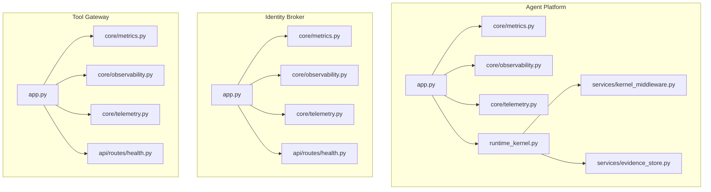
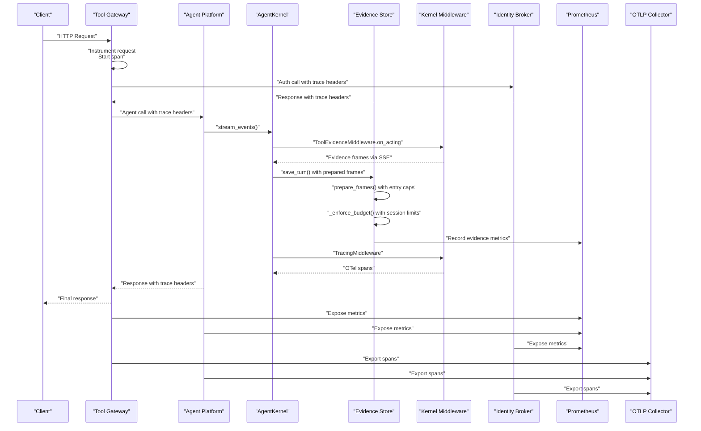
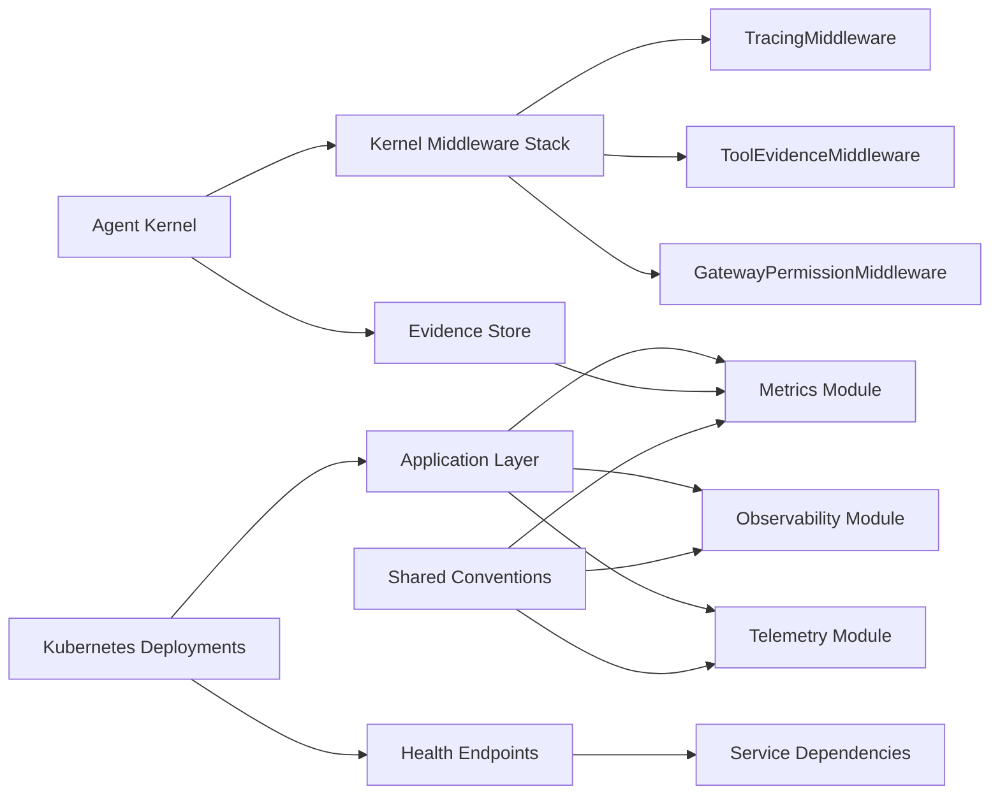

# Observability and Monitoring

<cite>
**Referenced Files in This Document**
- [observability-conventions.md](file://shared/shared-contracts/observability-conventions.md)
- [SPEC-005-observability-baseline/spec.md](file://docs/specs/SPEC-005-observability-baseline/spec.md)
- [SPEC-018-kernel-middleware-alignment/spec.md](file://docs/specs/SPEC-018-kernel-middleware-alignment/spec.md)
- [SPEC-025-evidence-persistence-in-transcripts/plan.md](file://docs/specs/SPEC-025-evidence-persistence-in-transcripts/plan.md)
- [agent-platform core metrics.py](file://products/agent-platform/src/agent_service/core/metrics.py)
- [agent-platform core observability.py](file://products/agent-platform/src/agent_service/core/observability.py)
- [agent-platform core telemetry.py](file://products/agent-platform/src/agent_service/core/telemetry.py)
- [agent-platform runtime_kernel.py](file://products/agent-platform/src/agent_service/runtime_kernel.py)
- [agent-platform kernel_middleware.py](file://products/agent-platform/src/agent_service/services/kernel_middleware.py)
- [agent-platform evidence_store.py](file://products/agent-platform/src/agent_service/services/evidence_store.py)
- [agent-platform gateway_tools.py](file://products/agent-platform/src/agent_service/tools/gateway_tools.py)
- [agent-platform runtime_settings.py](file://products/agent-platform/src/agent_service/runtime_settings.py)
- [agent-platform app.py](file://products/agent-platform/src/agent_service/app.py)
- [agent-platform main.py](file://products/agent-platform/src/agent_service/main.py)
- [identity-broker core metrics.py](file://products/identity-broker/src/identity_service/core/metrics.py)
- [identity-broker core observability.py](file://products/identity-broker/src/identity_service/core/observability.py)
- [identity-broker core telemetry.py](file://products/identity-broker/src/identity_service/core/telemetry.py)
- [identity-broker app.py](file://products/identity-broker/src/identity_service/app.py)
- [identity-broker health route](file://products/identity-broker/src/identity_service/api/routes/health.py)
- [tool-gateway core metrics.py](file://products/tool-gateway/src/api_gateway/core/metrics.py)
- [tool-gateway core observability.py](file://products/tool-gateway/src/api_gateway/core/observability.py)
- [tool-gateway core telemetry.py](file://products/tool-gateway/src/api_gateway/core/telemetry.py)
- [tool-gateway app.py](file://products/tool-gateway/src/api_gateway/app.py)
- [tool-gateway health route](file://products/tool-gateway/src/api_gateway/api/routes/health.py)
- [dev-k8s agent-service deployment](file://shared/platform-ops/gitops/dev-k8s/base/agent-platform/agent-service-deployment.yaml)
- [dev-k8s identity-service deployment](file://shared/platform-ops/gitops/dev-k8s/base/identity-broker/identity-service-deployment.yaml)
- [dev-k8s api-gateway deployment](file://shared/platform-ops/gitops/dev-k8s/base/tool-gateway/api-gateway-deployment.yaml)
- [dev-k8s shared observability env](file://shared/platform-ops/gitops/dev-k8s/base/shared/observability.env)
</cite>

## Update Summary
**Changes Made**
- Added comprehensive documentation for evidence-specific metrics including counters for evidence store writes, frames persisted, and truncation events
- Documented the two types of truncation reasons: entry_cap (per-entry size limits) and session_budget (per-session storage budgets)
- Enhanced monitoring dashboard guidance with evidence store performance metrics
- Updated troubleshooting section with evidence persistence debugging steps
- Added detailed coverage of evidence frame preparation and budget enforcement mechanisms

## Table of Contents
1. Introduction
2. Project Structure
3. Core Components
4. Architecture Overview
5. Detailed Component Analysis
6. Dependency Analysis
7. Performance Considerations
8. Troubleshooting Guide
9. Conclusion
10. Appendices

## Introduction
This document explains the observability and monitoring capabilities across the agent platform services, focusing on:
- Metrics collection and Prometheus exposure
- Structured logging standards and correlation
- Distributed tracing implementation using AgentScope's TracingMiddleware and cross-service correlation
- Evidence emission via ToolEvidenceMiddleware and SSE frames from gateway results
- **New**: Evidence store metrics tracking write operations, frame persistence, and truncation events
- Health endpoints for readiness and liveness probes
- Dashboarding and alerting guidance
- Performance monitoring, bottleneck identification, and capacity planning

The platform implements consistent observability patterns across Agent Platform, Identity Broker, and Tool Gateway to enable unified monitoring, debugging, and reliability operations.

## Project Structure
Observability is implemented consistently in each service with a common pattern:
- A core module exposing metrics, observability (logging/tracing), and telemetry utilities
- An application entrypoint wiring these components into the HTTP server
- Kubernetes manifests configuring probes and environment variables for observability backends
- Agent-specific middleware stack for kernel-level observability
- **New**: Evidence store with dedicated metrics for persistence operations and size cap enforcement

**Diagram sources**
- [agent-platform app.py](file://products/agent-platform/src/agent_service/app.py)
- [agent-platform core metrics.py](file://products/agent-platform/src/agent_service/core/metrics.py)
- [agent-platform core observability.py](file://products/agent-platform/src/agent_service/core/observability.py)
- [agent-platform core telemetry.py](file://products/agent-platform/src/agent_service/core/telemetry.py)
- [agent-platform runtime_kernel.py](file://products/agent-platform/src/agent_service/runtime_kernel.py)
- [agent-platform kernel_middleware.py](file://products/agent-platform/src/agent_service/services/kernel_middleware.py)
- [agent-platform evidence_store.py](file://products/agent-platform/src/agent_service/services/evidence_store.py)
- [identity-broker app.py](file://products/identity-broker/src/identity_service/app.py)
- [identity-broker core metrics.py](file://products/identity-broker/src/identity_service/core/metrics.py)
- [identity-broker core observability.py](file://products/identity-broker/src/identity_service/core/observability.py)
- [identity-broker core telemetry.py](file://products/identity-broker/src/identity_service/core/telemetry.py)
- [identity-broker health route](file://products/identity-broker/src/identity_service/api/routes/health.py)
- [tool-gateway app.py](file://products/tool-gateway/src/api_gateway/app.py)
- [tool-gateway core metrics.py](file://products/tool-gateway/src/api_gateway/core/metrics.py)
- [tool-gateway core observability.py](file://products/tool-gateway/src/api_gateway/core/observability.py)
- [tool-gateway core telemetry.py](file://products/tool-gateway/src/api_gateway/core/telemetry.py)
- [tool-gateway health route](file://products/tool-gateway/src/api_gateway/api/routes/health.py)

**Section sources**
- [agent-platform app.py](file://products/agent-platform/src/agent_service/app.py)
- [identity-broker app.py](file://products/identity-broker/src/identity_service/app.py)
- [tool-gateway app.py](file://products/tool-gateway/src/api_gateway/app.py)

## Core Components
Each service exposes three primary observability primitives:
- Metrics: counters, histograms, gauges, and Prometheus exposition
- Observability: structured logs and trace context propagation
- Telemetry: instrumentation helpers for spans, events, and attributes
- Kernel Middleware: AgentScope-based middleware for tool execution tracing and evidence emission
- **New**: Evidence Store: Dedicated metrics for persistence operations, frame counting, and truncation tracking

Key responsibilities:
- Initialize and configure metrics collectors and exporters
- Inject request/response lifecycle hooks for metrics and traces
- Enforce structured log formats with correlation IDs
- Expose health endpoints for readiness and liveness checks
- Propagate distributed trace headers across service boundaries
- Implement kernel-level tracing via AgentScope's TracingMiddleware
- Emit evidence frames through ToolEvidenceMiddleware for tool executions
- **New**: Track evidence store write success/failure rates and frame persistence counts
- **New**: Monitor evidence frame truncation events with specific reasons (entry_cap vs session_budget)

**Updated** Added evidence store metrics components for comprehensive persistence monitoring

**Section sources**
- [agent-platform core metrics.py](file://products/agent-platform/src/agent_service/core/metrics.py)
- [agent-platform core observability.py](file://products/agent-platform/src/agent_service/core/observability.py)
- [agent-platform core telemetry.py](file://products/agent-platform/src/agent_service/core/telemetry.py)
- [agent-platform kernel_middleware.py](file://products/agent-platform/src/agent_service/services/kernel_middleware.py)
- [agent-platform evidence_store.py](file://products/agent-platform/src/agent_service/services/evidence_store.py)
- [identity-broker core metrics.py](file://products/identity-broker/src/identity_service/core/metrics.py)
- [identity-broker core observability.py](file://products/identity-broker/src/identity_service/core/observability.py)
- [identity-broker core telemetry.py](file://products/identity-broker/src/identity_service/core/telemetry.py)
- [tool-gateway core metrics.py](file://products/tool-gateway/src/api_gateway/core/metrics.py)
- [tool-gateway core observability.py](file://products/tool-gateway/src/api_gateway/core/observability.py)
- [tool-gateway core telemetry.py](file://products/tool-gateway/src/api_gateway/core/telemetry.py)

## Architecture Overview
The observability architecture follows a consistent pattern across services with enhanced kernel-level tracing and evidence persistence monitoring:
- Application layer wires middleware that records metrics and emits spans
- Core modules provide reusable metrics definitions and logging/tracing utilities
- Agent kernel uses AgentScope middleware stack for tool execution observability
- **New**: Evidence store tracks persistence operations with detailed metrics for write success/failure, frames persisted, and truncation events
- Kubernetes deployments expose /metrics and health endpoints and configure probes
- Shared conventions define metric names, labels, and log schemas

**Updated** Enhanced sequence diagram to show evidence store integration and metrics recording flow

**Diagram sources**
- [tool-gateway app.py](file://products/tool-gateway/src/api_gateway/app.py)
- [agent-platform app.py](file://products/agent-platform/src/agent_service/app.py)
- [identity-broker app.py](file://products/identity-broker/src/identity_service/app.py)
- [agent-platform runtime_kernel.py](file://products/agent-platform/src/agent_service/runtime_kernel.py)
- [agent-platform kernel_middleware.py](file://products/agent-platform/src/agent_service/services/kernel_middleware.py)
- [agent-platform evidence_store.py](file://products/agent-platform/src/agent_service/services/evidence_store.py)
- [agent-platform core metrics.py](file://products/agent-platform/src/agent_service/core/metrics.py)
- [tool-gateway core metrics.py](file://products/tool-gateway/src/api_gateway/core/metrics.py)
- [identity-broker core metrics.py](file://products/identity-broker/src/identity_service/core/metrics.py)
- [tool-gateway core telemetry.py](file://products/tool-gateway/src/api_gateway/core/telemetry.py)
- [agent-platform core telemetry.py](file://products/agent-platform/src/agent_service/core/telemetry.py)
- [identity-broker core telemetry.py](file://products/identity-broker/src/identity_service/core/telemetry.py)

## Detailed Component Analysis

### Metrics Collection and Prometheus Exposure
- Each service defines metrics in its core/metrics.py module
- Counters track request counts, errors, and business events
- Histograms capture latency distributions for key operations
- Gauges reflect current state such as active sessions or queue sizes
- Prometheus exposition endpoint is enabled via configuration and exposed by the HTTP server

**New Evidence Store Metrics:**
- `evidence_store_writes_total {result=ok|error}`: Tracks evidence persistence attempts and outcomes
- `evidence_frames_persisted_total`: Counts total frames successfully persisted for session replay
- `evidence_frames_truncated_total {reason=entry_cap|session_budget}`: Monitors frame truncation events with specific reasons

Typical usage patterns:
- Increment counters on request start and completion
- Record latencies using histogram observe calls around I/O
- Update gauges for resource utilization and concurrency limits
- **New**: Track evidence store write success/failure rates for reliability monitoring
- **New**: Monitor frame persistence counts to validate evidence storage throughput
- **New**: Alert on excessive truncation events indicating potential data loss

Prometheus scraping targets are configured through service ports and selectors in Kubernetes manifests.

**Section sources**
- [agent-platform core metrics.py](file://products/agent-platform/src/agent_service/core/metrics.py)
- [identity-broker core metrics.py](file://products/identity-broker/src/identity_service/core/metrics.py)
- [tool-gateway core metrics.py](file://products/tool-gateway/src/api_gateway/core/metrics.py)

### Structured Logging and Trace Correlation
- Logs follow a structured JSON schema defined by shared conventions
- Every log includes correlation identifiers (request ID, trace ID, span ID)
- Log levels are standardized across services
- Context propagation ensures correlation IDs flow through all downstream calls

Best practices:
- Use structured fields instead of free-form messages
- Include operation names, status codes, and error codes
- Avoid sensitive data in logs; redact secrets and tokens

**Section sources**
- [observability-conventions.md](file://shared/shared-contracts/observability-conventions.md)
- [agent-platform core observability.py](file://products/agent-platform/src/agent_service/core/observability.py)
- [identity-broker core observability.py](file://products/identity-broker/src/identity_service/core/observability.py)
- [tool-gateway core observability.py](file://products/tool-gateway/src/api_gateway/core/observability.py)

### Distributed Tracing Implementation
- Traces are created at request boundaries and propagated via standard headers
- Spans represent logical operations like HTTP requests, tool invocations, and database calls
- Trace context is attached to outgoing requests to maintain correlation
- Telemetry modules export spans to an OTLP-compatible backend

**Updated** Enhanced with AgentScope kernel tracing capabilities

Trace correlation across services:
- Incoming requests extract trace context from headers
- Outgoing calls inject trace context into headers
- Errors propagate up the call stack with full trace context
- AgentScope's TracingMiddleware provides kernel-level tracing when enabled via AGENTSCOPE_KERNEL_TRACING setting

**Section sources**
- [agent-platform core telemetry.py](file://products/agent-platform/src/agent_service/core/telemetry.py)
- [agent-platform runtime_settings.py](file://products/agent-platform/src/agent_service/runtime_settings.py)
- [identity-broker core telemetry.py](file://products/identity-broker/src/identity_service/core/telemetry.py)
- [tool-gateway core telemetry.py](file://products/tool-gateway/src/api_gateway/core/telemetry.py)

### Kernel Middleware and Evidence Emission
**New Section** The agent platform now leverages AgentScope's middleware system for enhanced observability:

- **ToolEvidenceMiddleware**: Emits tool_call and tool_result evidence frames for streamed turns, replacing per-request asyncio.Queue plumbing
- **TracingMiddleware**: Provides kernel-level OpenTelemetry tracing when AGENTSCOPE_KERNEL_TRACING is enabled
- **GatewayPermissionMiddleware**: Pre-answers permission gates for headless SSE runtime

Evidence emission flow:
- ToolEvidenceMiddleware.on_acting intercepts tool executions
- Extracts gateway result metadata from ToolChunk/ToolResponse objects
- Emits structured evidence frames via request-scoped sink (ContextVar)
- SSE frames are consumed by stream_events and forwarded to clients

Configuration:
- Evidence emission is always active for gateway-backed tools
- Kernel tracing is opt-in via AGENTSCOPE_KERNEL_TRACING environment variable
- Reply token budget control is available via ReplyBudgetControlMiddleware

**Section sources**
- [agent-platform kernel_middleware.py](file://products/agent-platform/src/agent_service/services/kernel_middleware.py)
- [agent-platform runtime_kernel.py](file://products/agent-platform/src/agent_service/runtime_kernel.py)
- [agent-platform gateway_tools.py](file://products/agent-platform/src/agent_service/tools/gateway_tools.py)
- [agent-platform runtime_settings.py](file://products/agent-platform/src/agent_service/runtime_settings.py)

### Evidence Store Persistence and Metrics
**New Section** The evidence store provides comprehensive metrics for monitoring evidence persistence operations:

**Metrics Implementation:**
- `record_evidence_write(result)`: Tracks successful and failed evidence persistence attempts
- `record_evidence_frames_persisted(count)`: Counts total frames persisted for session replay
- `record_evidence_frame_truncated(reason)`: Monitors truncation events with specific reasons

**Size Cap Enforcement:**
- **Entry Cap**: Per-entry size limits (default 128 KiB) truncate oversized payloads with `truncated.reason = "entry_cap"`
- **Session Budget**: Per-session storage limits (default 4 MiB) evict oldest result payloads with `truncated.reason = "session_budget"`

**Persistence Flow:**
1. Frames are prepared with entry cap enforcement before storage
2. Evidence store persists frames and enforces session budget limits
3. Metrics are recorded for each persistence operation and truncation event
4. Failed persistence attempts are logged but don't fail the turn

**Section sources**
- [agent-platform evidence_store.py](file://products/agent-platform/src/agent_service/services/evidence_store.py)
- [agent-platform core metrics.py](file://products/agent-platform/src/agent_service/core/metrics.py)
- [agent-platform runtime_kernel.py](file://products/agent-platform/src/agent_service/runtime_kernel.py)

### Health Check Endpoints and Probes
- Readiness probes verify dependencies are available and service can accept traffic
- Liveness probes detect if the process is alive and responsive
- Health endpoints return structured responses indicating component status

Configuration in Kubernetes:
- Probes are defined in deployment manifests with appropriate thresholds
- Health endpoints should respond quickly without heavy operations
- Dependencies like Redis or external APIs are checked during readiness

**Section sources**
- [identity-broker health route](file://products/identity-broker/src/identity_service/api/routes/health.py)
- [tool-gateway health route](file://products/tool-gateway/src/api_gateway/api/routes/health.py)
- [dev-k8s agent-service deployment](file://shared/platform-ops/gitops/dev-k8s/base/agent-platform/agent-service-deployment.yaml)
- [dev-k8s identity-service deployment](file://shared/platform-ops/gitops/dev-k8s/base/identity-broker/identity-service-deployment.yaml)
- [dev-k8s api-gateway deployment](file://shared/platform-ops/gitops/dev-k8s/base/tool-gateway/api-gateway-deployment.yaml)

### Application Wiring and Entry Points
- Application modules initialize observability components during startup
- Middleware is registered to capture metrics and traces for all requests
- Configuration is loaded from environment variables and config files
- Graceful shutdown ensures metrics and traces are flushed before termination

**Updated** Enhanced with kernel middleware composition and evidence store integration

**Section sources**
- [agent-platform app.py](file://products/agent-platform/src/agent_service/app.py)
- [agent-platform runtime_kernel.py](file://products/agent-platform/src/agent_service/runtime_kernel.py)
- [identity-broker app.py](file://products/identity-broker/src/identity_service/app.py)
- [tool-gateway app.py](file://products/tool-gateway/src/api_gateway/app.py)
- [agent-platform main.py](file://products/agent-platform/src/agent_service/main.py)

## Dependency Analysis
Observability components have clear dependency relationships:
- Application layers depend on core metrics, observability, and telemetry modules
- Agent kernel depends on AgentScope middleware stack for tool execution observability
- **New**: Evidence store depends on metrics module for persistence operation tracking
- Health endpoints may depend on service-specific dependencies (databases, caches)
- Kubernetes deployments configure network exposure and probe behavior
- Shared conventions ensure consistency across services

**Updated** Added evidence store dependency relationships and metrics integration

**Diagram sources**
- [agent-platform app.py](file://products/agent-platform/src/agent_service/app.py)
- [agent-platform runtime_kernel.py](file://products/agent-platform/src/agent_service/runtime_kernel.py)
- [agent-platform kernel_middleware.py](file://products/agent-platform/src/agent_service/services/kernel_middleware.py)
- [agent-platform evidence_store.py](file://products/agent-platform/src/agent_service/services/evidence_store.py)
- [agent-platform core metrics.py](file://products/agent-platform/src/agent_service/core/metrics.py)
- [identity-broker app.py](file://products/identity-broker/src/identity_service/app.py)
- [tool-gateway app.py](file://products/tool-gateway/src/api_gateway/app.py)
- [observability-conventions.md](file://shared/shared-contracts/observability-conventions.md)

**Section sources**
- [agent-platform app.py](file://products/agent-platform/src/agent_service/app.py)
- [agent-platform runtime_kernel.py](file://products/agent-platform/src/agent_service/runtime_kernel.py)
- [agent-platform evidence_store.py](file://products/agent-platform/src/agent_service/services/evidence_store.py)
- [identity-broker app.py](file://products/identity-broker/src/identity_service/app.py)
- [tool-gateway app.py](file://products/tool-gateway/src/api_gateway/app.py)
- [observability-conventions.md](file://shared/shared-contracts/observability-conventions.md)

## Performance Considerations
- Metrics overhead: Use appropriate bucket sizes for histograms and avoid excessive cardinality in labels
- Logging volume: Implement sampling for high-frequency logs and use structured fields efficiently
- Trace sampling: Configure sampling rates based on performance requirements and cost constraints
- Health checks: Keep health endpoints lightweight and avoid blocking operations
- Resource monitoring: Track CPU, memory, and I/O metrics to identify bottlenecks
- **Updated** Kernel middleware overhead: TracingMiddleware and ToolEvidenceMiddleware add minimal overhead but should be monitored
- **New**: Evidence store performance: Monitor persistence latency and truncation rates to optimize storage efficiency

**Evidence Store Performance Guidelines:**
- Track `evidence_store_writes_total` error rate to identify persistence failures
- Monitor `evidence_frames_truncated_total` to detect excessive data loss
- Use `evidence_frames_persisted_total` to validate storage throughput
- Adjust entry caps and session budgets based on observed truncation patterns
- Profile evidence store operations during high-volume tool usage scenarios

Capacity planning guidance:
- Monitor request throughput and latency percentiles
- Track error rates and degradation patterns
- Plan scaling based on resource utilization trends
- Set up alerts for critical thresholds and anomalies
- Monitor evidence frame emission rates for high-volume tool usage
- **New**: Plan evidence storage capacity based on session growth and retention policies

[No sources needed since this section provides general guidance]

## Troubleshooting Guide
Common issues and resolution steps:
- Missing metrics: Verify Prometheus scraping configuration and port exposure
- Incomplete traces: Check trace header propagation and sampling configuration
- High log volume: Adjust log levels and implement structured logging best practices
- Health check failures: Investigate dependency availability and probe configurations
- Performance degradation: Analyze latency histograms and identify slow operations
- **Updated** Kernel tracing issues: Verify AGENTSCOPE_KERNEL_TRACING setting and middleware registration
- **Updated** Evidence frame problems: Check TOOL_EVIDENCE_SINK contextvar and gateway result metadata

**New Evidence Store Troubleshooting:**
- **High truncation rates**: Review entry cap settings (`AGENT_EVIDENCE_ENTRY_MAX_CHARS`) and session budget limits (`AGENT_EVIDENCE_SESSION_MAX_BYTES`)
- **Evidence persistence failures**: Check `evidence_store_writes_total{result="error"}` counter and investigate underlying storage connectivity
- **Excessive session budget evictions**: Monitor `evidence_frames_truncated_total{reason="session_budget"}` and adjust session storage limits
- **Missing evidence in replay**: Verify evidence store backend availability and check for connection errors

Debugging workflow:
1. Check service health endpoints for component status
2. Review structured logs with correlation IDs for request flows
3. Examine distributed traces for latency hotspots and errors
4. Analyze metrics for anomalies and trend analysis
5. Scale resources based on observed patterns
6. **Updated** For kernel-level issues, inspect middleware stack composition and evidence frame emission
7. **New**: For evidence store issues, analyze persistence metrics and truncation patterns

**Updated** Enhanced troubleshooting guidance for kernel middleware and evidence store operations

**Section sources**
- [dev-k8s shared observability env](file://shared/platform-ops/gitops/dev-k8s/base/shared/observability.env)
- [agent-platform core observability.py](file://products/agent-platform/src/agent_service/core/observability.py)
- [agent-platform kernel_middleware.py](file://products/agent-platform/src/agent_service/services/kernel_middleware.py)
- [agent-platform evidence_store.py](file://products/agent-platform/src/agent_service/services/evidence_store.py)
- [agent-platform core metrics.py](file://products/agent-platform/src/agent_service/core/metrics.py)
- [agent-platform runtime_kernel.py](file://products/agent-platform/src/agent_service/runtime_kernel.py)
- [identity-broker core observability.py](file://products/identity-broker/src/identity_service/core/observability.py)
- [tool-gateway core observability.py](file://products/tool-gateway/src/api_gateway/core/observability.py)

## Conclusion
The agent platform implements comprehensive observability across all services with consistent patterns for metrics, logging, and tracing. The recent enhancement with AgentScope's TracingMiddleware and ToolEvidenceMiddleware provides robust kernel-level observability while maintaining backward compatibility. **The new evidence store metrics provide critical insights into persistence operations, enabling better monitoring of evidence storage reliability and performance.** The shared conventions ensure interoperability while individual service implementations provide domain-specific insights. Proper configuration of health checks, dashboards, and alerts enables effective monitoring and troubleshooting of the platform.

**Updated** Enhanced conclusion to reflect new kernel middleware capabilities and evidence store monitoring features

[No sources needed since this section summarizes without analyzing specific files]

## Appendices

### Monitoring Dashboard Setup
Recommended dashboard panels:
- Request rate and latency percentiles per service
- Error rates and failure modes
- Resource utilization (CPU, memory, disk I/O)
- Distributed trace topology and latency breakdowns
- Health check success rates and dependency status
- **Updated** Kernel middleware activity and evidence frame emission rates
- **New**: Evidence store persistence metrics including write success rates, frame counts, and truncation events

**Evidence Store Dashboard Panels:**
- `evidence_store_writes_total` by result type (ok/error) for persistence reliability
- `evidence_frames_persisted_total` for storage throughput monitoring
- `evidence_frames_truncated_total` by reason (entry_cap/session_budget) for data loss detection
- Evidence store backend availability and error rates

Dashboard organization:
- Service-level dashboards for individual components
- Platform-wide dashboards for cross-service visibility
- Alert-focused dashboards for incident response
- **Updated** Kernel observability dashboards for tool execution tracking
- **New**: Evidence persistence dashboards for storage reliability monitoring

### Alerting Rules Configuration
Critical alerts:
- High error rates (>5% over 5 minutes)
- Latency SLO violations (p99 > threshold)
- Service unavailability (health check failures)
- Resource exhaustion warnings (memory > 80%)
- Queue depth anomalies
- **Updated** Evidence frame emission failures and kernel tracing errors
- **New**: Evidence store persistence failures (`evidence_store_writes_total{result="error"} > 0`)
- **New**: Excessive evidence truncation rates (high `evidence_frames_truncated_total` values)

Alert routing:
- PagerDuty integration for critical alerts
- Slack notifications for informational alerts
- Escalation policies based on severity and duration

### Debugging Agent Execution Flows
Step-by-step debugging approach:
1. Enable debug logging for specific components
2. Extract correlation IDs from request logs
3. Follow trace spans through the entire execution path
4. Identify bottlenecks using latency histograms
5. Validate data integrity with structured log fields
6. **Updated** Inspect kernel middleware stack and evidence frame emission
7. **New**: Analyze evidence store metrics for persistence issues

**Evidence Store Debugging Steps:**
1. Check `evidence_store_writes_total{result="error"}` for persistence failures
2. Monitor `evidence_frames_truncated_total` to identify data loss patterns
3. Verify evidence store backend connectivity and performance
4. Review entry cap and session budget configurations
5. Analyze truncation reasons to optimize storage settings

Performance profiling:
- Use built-in profilers for CPU and memory analysis
- Profile database queries and external API calls
- Monitor garbage collection and memory allocation patterns
- **Updated** Monitor kernel middleware overhead and evidence frame processing
- **New**: Profile evidence store persistence operations and storage performance

**Updated** Enhanced debugging guidance for kernel middleware and evidence store operations

**Section sources**
- [SPEC-005-observability-baseline/spec.md](file://docs/specs/SPEC-005-observability-baseline/spec.md)
- [SPEC-018-kernel-middleware-alignment/spec.md](file://docs/specs/SPEC-018-kernel-middleware-alignment/spec.md)
- [SPEC-025-evidence-persistence-in-transcripts/plan.md](file://docs/specs/SPEC-025-evidence-persistence-in-transcripts/plan.md)
- [observability-conventions.md](file://shared/shared-contracts/observability-conventions.md)
- [agent-platform kernel_middleware.py](file://products/agent-platform/src/agent_service/services/kernel_middleware.py)
- [agent-platform evidence_store.py](file://products/agent-platform/src/agent_service/services/evidence_store.py)
- [agent-platform core metrics.py](file://products/agent-platform/src/agent_service/core/metrics.py)
- [agent-platform runtime_kernel.py](file://products/agent-platform/src/agent_service/runtime_kernel.py)