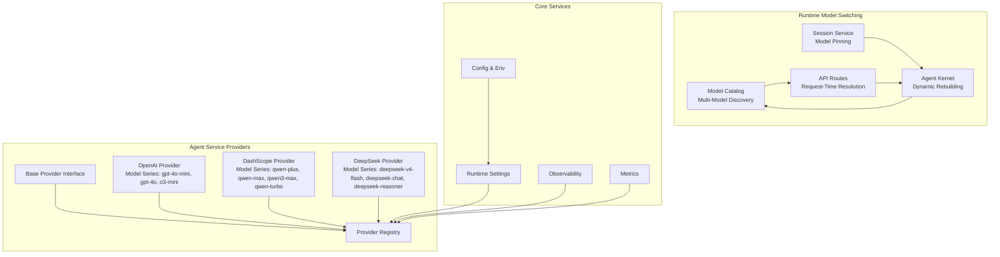
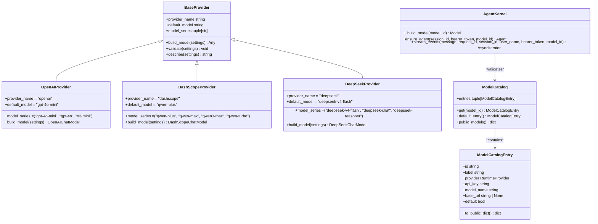
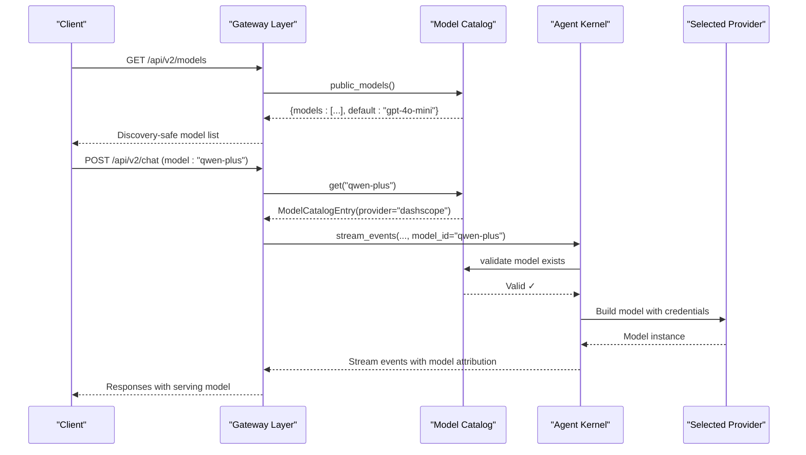
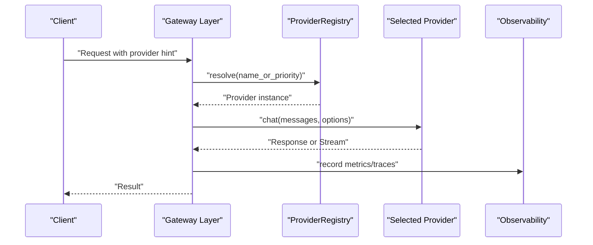
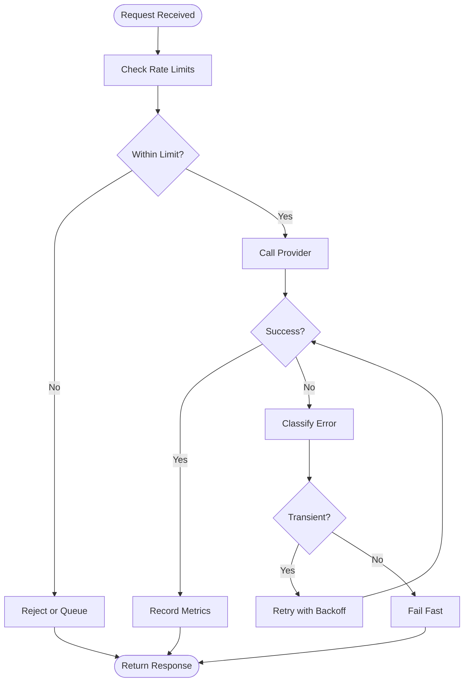
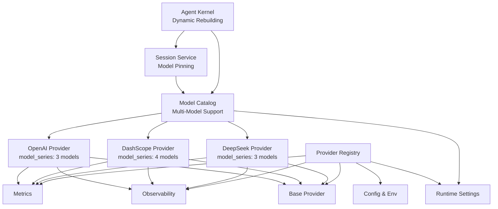

# Provider Registry and Multi-Provider Support

<cite>
**Referenced Files in This Document**
- [base.py](file://products/agent-platform/src/agent_service/providers/base.py)
- [registry.py](file://products/agent-platform/src/agent_service/providers/registry.py)
- [openai.py](file://products/agent-platform/src/agent_service/providers/openai.py)
- [dashscope.py](file://products/agent-platform/src/agent_service/providers/dashscope.py)
- [deepseek.py](file://products/agent-platform/src/agent_service/providers/deepseek.py)
- [runtime_settings.py](file://products/agent-platform/src/agent_service/runtime_settings.py)
- [config.py](file://products/agent-platform/src/agent_service/core/config.py)
- [env.py](file://products/agent-platform/src/agent_service/core/env.py)
- [metrics.py](file://products/agent-platform/src/agent_service/core/metrics.py)
- [observability.py](file://products/agent-platform/src/agent_service/core/observability.py)
- [model_catalog.py](file://products/agent-platform/src/agent_service/services/model_catalog.py)
- [session_service.py](file://products/agent-platform/src/agent_service/services/session_service.py)
- [runtime_kernel.py](file://products/agent-platform/src/agent_service/runtime_kernel.py)
- [routes.py](file://products/agent-platform/src/agent_service/api/v2/routes.py)
- [test_model_switching.py](file://products/agent-platform/tests/test_model_switching.py)
- [test_runtime_providers.py](file://products/agent-platform/tests/test_runtime_providers.py)
</cite>

## Update Summary
**Changes Made**
- Updated model catalog system to support multiple models per provider instead of one entry per provider
- Enhanced provider adapters with `model_series` property exposing complete model lineup
- Added credential-based gating and model override capabilities via environment variables
- Implemented per-session model pinning with fail-open degradation
- Enhanced runtime model switching with request-time resolution and kernel rebuilding
- Updated architecture diagrams to reflect new multi-model provider support

## Table of Contents
1. Introduction
2. Project Structure
3. Core Components
4. Architecture Overview
5. Detailed Component Analysis
6. Runtime Model Switching System
7. Dependency Analysis
8. Performance Considerations
9. Troubleshooting Guide
10. Conclusion

## Introduction
This document explains the provider registry and multi-provider support system used by the agent platform to abstract and orchestrate calls to multiple LLM backends. The system has been significantly enhanced with a comprehensive model catalog system that supports multiple models per provider, credential-gated discovery, per-session model pinning, and dynamic provider selection without service restarts. It covers the abstract base provider interface, the registration mechanism, dynamic loading strategies, built-in providers (OpenAI, DashScope, DeepSeek), configuration and authentication differences, custom provider implementation patterns, selection and fallback strategies, rate limiting and retry policies, error handling, health monitoring, circuit breaker patterns, and performance benchmarking guidance.

## Project Structure
The provider subsystem lives under the agent platform service with enhanced runtime model switching capabilities:
- Abstract base and registry: products/agent-platform/src/agent_service/providers/base.py, registry.py
- Built-in providers: openai.py, dashscope.py, deepseek.py
- Runtime model switching: services/model_catalog.py, services/session_service.py
- Configuration and environment: core/config.py, core/env.py, runtime_settings.py
- API routes with model switching: api/v2/routes.py
- Kernel integration: runtime_kernel.py
- Observability and metrics: core/observability.py, core/metrics.py
- Tests for provider behavior and model switching: tests/test_runtime_providers.py, tests/test_model_switching.py

**Diagram sources**
- [base.py](file://products/agent-platform/src/agent_service/providers/base.py)
- [registry.py](file://products/agent-platform/src/agent_service/providers/registry.py)
- [model_catalog.py](file://products/agent-platform/src/agent_service/services/model_catalog.py)
- [session_service.py](file://products/agent-platform/src/agent_service/services/session_service.py)
- [runtime_kernel.py](file://products/agent-platform/src/agent_service/runtime_kernel.py)
- [routes.py](file://products/agent-platform/src/agent_service/api/v2/routes.py)

**Section sources**
- [base.py](file://products/agent-platform/src/agent_service/providers/base.py)
- [registry.py](file://products/agent-platform/src/agent_service/providers/registry.py)
- [model_catalog.py](file://products/agent-platform/src/agent_service/services/model_catalog.py)
- [session_service.py](file://products/agent-platform/src/agent_service/services/session_service.py)
- [runtime_kernel.py](file://products/agent-platform/src/agent_service/runtime_kernel.py)
- [routes.py](file://products/agent-platform/src/agent_service/api/v2/routes.py)

## Core Components
- Abstract base provider: Defines the contract all providers must implement, including chat completion, streaming, model listing, and health checks. It also centralizes common behaviors like retries, timeouts, and telemetry hooks.
- Provider registry: A centralized lookup that registers available providers, resolves them by name or priority, and supports dynamic loading based on runtime settings.
- **Enhanced**: Built-in providers with model series: Concrete implementations for OpenAI, DashScope, and DeepSeek, each exposing their complete model lineup through the `model_series` property.
- **Enhanced**: Runtime model catalog: Credential-gated discovery of available models at startup, providing safe model enumeration without exposing credentials. Supports multiple models per provider with unique model IDs across the entire catalog.
- **Enhanced**: Per-session model pinning: Sessions can be pinned to specific models, enabling dynamic provider switching without service restarts with fail-open degradation.
- **Enhanced**: Dynamic model resolution: Request-time model selection with fallback mechanisms and fail-closed validation.
- Configuration and environment: Centralized config and env loaders provide credentials, endpoints, and per-provider options. Runtime settings select active providers and policies.
- Observability and metrics: Standardized instrumentation for latency, throughput, errors, and provider-specific metrics.

Key responsibilities:
- Uniform API surface across providers
- Safe credential management and secret injection
- Configurable retry/backoff and rate limiting
- Health checks and readiness signals
- Metrics and tracing for observability
- **New**: Multi-model provider support with credential safety
- **New**: Session-based model affinity and persistence
- **New**: Request-time model switching with kernel rebuilding

**Section sources**
- [base.py](file://products/agent-platform/src/agent_service/providers/base.py)
- [registry.py](file://products/agent-platform/src/agent_service/providers/registry.py)
- [model_catalog.py](file://products/agent-platform/src/agent_service/services/model_catalog.py)
- [session_service.py](file://products/agent-platform/src/agent_service/services/session_service.py)
- [runtime_kernel.py](file://products/agent-platform/src/agent_service/runtime_kernel.py)
- [routes.py](file://products/agent-platform/src/agent_service/api/v2/routes.py)

## Architecture Overview
The provider architecture follows a clear separation between abstraction, registry, and concrete implementations, now enhanced with multi-model support and runtime switching capabilities:

**Diagram sources**
- [base.py](file://products/agent-platform/src/agent_service/providers/base.py)
- [model_catalog.py](file://products/agent-platform/src/agent_service/services/model_catalog.py)
- [runtime_kernel.py](file://products/agent-platform/src/agent_service/runtime_kernel.py)
- [openai.py](file://products/agent-platform/src/agent_service/providers/openai.py)
- [dashscope.py](file://products/agent-platform/src/agent_service/providers/dashscope.py)
- [deepseek.py](file://products/agent-platform/src/agent_service/providers/deepseek.py)

## Detailed Component Analysis

### Abstract Base Provider
The base provider defines the canonical interface for all LLM integrations with enhanced multi-model support:
- Chat completion and streaming
- Model enumeration through `model_series` property
- Health checks
- Configuration binding
- Retry policy application
- Rate limit enforcement
- Telemetry hooks for metrics and traces

Implementation expectations:
- Each provider implements the same method signatures to ensure interchangeability
- Common logic such as request normalization, response parsing, and error translation is centralized where possible
- Health checks return structured status with latency and availability indicators
- **Enhanced**: `model_series` property exposes curated list of supported models for the provider

**Section sources**
- [base.py](file://products/agent-platform/src/agent_service/providers/base.py)

### Provider Registry
The registry manages provider lifecycle and resolution:
- Registration of provider classes by name
- Dynamic loading from runtime settings
- Resolution by explicit name or priority-based selection
- Aggregated health summary across providers
- Reload capability when configuration changes at runtime

Resolution strategy:
- If a specific provider name is configured, resolve directly
- Otherwise, iterate registered providers by priority and pick the first healthy one
- Fallback chain can be enforced via ordered lists in runtime settings

**Section sources**
- [registry.py](file://products/agent-platform/src/agent_service/providers/registry.py)
- [runtime_settings.py](file://products/agent-platform/src/agent_service/runtime_settings.py)

### Built-in Providers with Multi-Model Support

#### OpenAI Provider
- Authentication: API key via environment or config; supports bearer token patterns
- Endpoint: Uses OpenAI-compatible base URL if configured; otherwise defaults to official endpoint
- Features: Chat completions, streaming responses, model listing
- **Enhanced**: Model series: `("gpt-4o-mini", "gpt-4o", "o3-mini")` - default model first
- Differences: Follows OpenAI schema strictly; maps tool-use and function-calling fields accordingly

Configuration highlights:
- API key source
- Base URL override
- Model aliasing and default model selection
- Request timeout and retry parameters

**Section sources**
- [openai.py](file://products/agent-platform/src/agent_service/providers/openai.py)
- [config.py](file://products/agent-platform/src/agent_service/core/config.py)
- [env.py](file://products/agent-platform/src/agent_service/core/env.py)

#### DashScope Provider
- Authentication: API key via environment or config; may include project-level headers
- Endpoint: DashScope API endpoint; supports region-specific routing
- Features: Chat completions, streaming, model listing; may differ in payload shape
- **Enhanced**: Model series: `("qwen-plus", "qwen-max", "qwen3-max", "qwen-turbo")` - default model first
- Differences: Payload structure and field names vary from OpenAI; provider normalizes inputs and outputs

Configuration highlights:
- API key and optional project ID
- Region or endpoint override
- Streaming chunk handling specifics

**Section sources**
- [dashscope.py](file://products/agent-platform/src/agent_service/providers/dashscope.py)
- [config.py](file://products/agent-platform/src/agent_service/core/config.py)
- [env.py](file://products/agent-platform/src/agent_service/core/env.py)

#### DeepSeek Provider
- Authentication: API key via environment or config; uses compatible client library
- Endpoint: DeepSeek API endpoint; supports custom base URL if needed
- Features: Chat completions, streaming, model listing; aligns closely with OpenAI-like contracts
- **Enhanced**: Model series: `("deepseek-v4-flash", "deepseek-chat", "deepseek-reasoner")` - default model first
- Differences: Minor variations in response fields and error codes; normalized by provider layer

Configuration highlights:
- API key and optional organization/project identifiers
- Model aliases and default model
- Timeout and retry tuning

**Section sources**
- [deepseek.py](file://products/agent-platform/src/agent_service/providers/deepseek.py)
- [config.py](file://products/agent-platform/src/agent_service/core/config.py)
- [env.py](file://products/agent-platform/src/agent_service/core/env.py)

### Runtime Model Switching System

#### Enhanced Multi-Model Catalog Discovery
The model catalog provides secure discovery of available models at runtime without exposing credentials, now supporting multiple models per provider:

- **Startup Discovery**: Models are discovered at service startup based on environment variables and provider `model_series` properties
- **Credential Safety**: Only safe metadata (id, label, provider, default) is exposed via API
- **Fail-Closed Validation**: Unknown model IDs are rejected before any processing occurs
- **Public API**: `/api/v2/models` endpoint returns discovery-safe model information
- **Multi-Model Support**: Each provider contributes its complete model lineup through the `model_series` property
- **Unique Model IDs**: Model names must be unique across the entire catalog to prevent conflicts

**Diagram sources**
- [model_catalog.py](file://products/agent-platform/src/agent_service/services/model_catalog.py)
- [routes.py](file://products/agent-platform/src/agent_service/api/v2/routes.py)
- [runtime_kernel.py](file://products/agent-platform/src/agent_service/runtime_kernel.py)

#### Per-Session Model Pinning with Fail-Open Degradation
Sessions maintain model affinity through persistent storage with robust error handling:

- **Session Storage**: Model preferences stored per session in Redis/PostgreSQL
- **Latest Wins**: Newer model selections override previous pins
- **Fail-Open**: Store failures don't block chat operations - degraded gracefully
- **Graceful Degradation**: Revoked credentials automatically fall back to default
- **Cross-Backend Support**: Works consistently across InMemory, Redis, and Postgres stores

#### Dynamic Provider Selection Without Service Restarts
The system enables runtime model switching through several mechanisms:

- **Request-Time Resolution**: `request > pinned > default` priority order
- **Kernel Rebuilding**: Agents are rebuilt when model switches occur to maintain conversation history
- **State Preservation**: Conversation history maintained across model switches through state restoration
- **Validation**: All model IDs validated against credential-gated catalog
- **Model Attribution**: Serving model tracked through message_end events for audit trails

**Updated** Enhanced with comprehensive multi-model support including credential-gated model catalog discovery, per-session model pinning, and dynamic provider selection without service restarts

**Section sources**
- [model_catalog.py](file://products/agent-platform/src/agent_service/services/model_catalog.py)
- [session_service.py](file://products/agent-platform/src/agent_service/services/session_service.py)
- [runtime_kernel.py](file://products/agent-platform/src/agent_service/runtime_kernel.py)
- [routes.py](file://products/agent-platform/src/agent_service/api/v2/routes.py)

### Dynamic Provider Loading
Dynamic loading enables runtime selection without code changes:
- Runtime settings define active provider names and priorities
- Registry reloads providers based on current configuration
- Health checks gate selection; unhealthy providers are skipped until recovered

Flow overview:
- On startup, load settings and register providers
- For each request, resolve provider by name or priority
- If no provider is healthy, fail fast with a clear error
- Periodically refresh health status and re-evaluate selection

**Diagram sources**
- [registry.py](file://products/agent-platform/src/agent_service/providers/registry.py)
- [runtime_settings.py](file://products/agent-platform/src/agent_service/runtime_settings.py)
- [observability.py](file://products/agent-platform/src/agent_service/core/observability.py)

**Section sources**
- [registry.py](file://products/agent-platform/src/agent_service/providers/registry.py)
- [runtime_settings.py](file://products/agent-platform/src/agent_service/runtime_settings.py)

### Custom Provider Implementation
To add a new provider with multi-model support:
- Implement the base provider interface methods
- Define `model_series` property with curated list of supported models (default model first)
- Configure authentication and endpoint details
- Register the provider in the registry during initialization
- Provide configuration keys for secrets and runtime options

Best practices:
- Normalize requests and responses to the base contract
- Handle provider-specific error codes and map to standardized exceptions
- Emit metrics and traces consistently
- Implement robust health checks
- **Enhanced**: Ensure `model_series` contains unique model names across all providers

Example steps:
- Create a new file under providers directory
- Extend the base provider class
- Define `model_series` with supported models
- Add registration in the registry initialization
- Update runtime settings to include the new provider

**Section sources**
- [base.py](file://products/agent-platform/src/agent_service/providers/base.py)
- [registry.py](file://products/agent-platform/src/agent_service/providers/registry.py)

### Provider Selection Strategies and Fallback Mechanisms
Selection strategies:
- Explicit name resolution: Choose a specific provider by configured name
- Priority-based selection: Order providers by preference; pick the first healthy one
- Weighted round-robin: Distribute traffic across multiple providers proportionally

Fallback mechanisms:
- Automatic failover to next provider in priority list upon failure
- Circuit breaker to temporarily exclude failing providers
- Graceful degradation by switching to a cheaper or more reliable provider
- **Enhanced**: Model-level fallback within provider when specific models become unavailable

Operational considerations:
- Monitor health and error rates to adjust priorities dynamically
- Use feature flags to enable/disable providers per tenant or region
- Ensure idempotency and consistent retries across providers
- **Enhanced**: Monitor model-specific performance for optimal routing decisions

**Section sources**
- [registry.py](file://products/agent-platform/src/agent_service/providers/registry.py)
- [runtime_settings.py](file://products/agent-platform/src/agent_service/runtime_settings.py)

### Rate Limiting, Retry Policies, and Error Handling
Rate limiting:
- Enforce per-provider quotas and global limits
- Backpressure signaling when approaching thresholds
- Queueing or dropping requests based on policy

Retry policies:
- Exponential backoff with jitter for transient errors
- Idempotent request retries only
- Maximum retry attempts and timeouts

Error handling:
- Normalize provider-specific errors into unified exceptions
- Distinguish between client errors (bad input) and server errors (transient)
- Surface actionable diagnostics for debugging
- **Enhanced**: Model-specific error handling with appropriate fallback strategies

**Diagram sources**
- [base.py](file://products/agent-platform/src/agent_service/providers/base.py)
- [metrics.py](file://products/agent-platform/src/agent_service/core/metrics.py)

**Section sources**
- [base.py](file://products/agent-platform/src/agent_service/providers/base.py)
- [metrics.py](file://products/agent-platform/src/agent_service/core/metrics.py)

### Health Monitoring and Circuit Breaker Patterns
Health monitoring:
- Periodic health checks for each provider
- Track latency percentiles and error rates
- Aggregate health summaries for operational dashboards
- **Enhanced**: Model-level health tracking for granular insights

Circuit breaker:
- States: Closed (normal), Open (failing), Half-Open (testing recovery)
- Thresholds: Error rate, latency, minimum sample size
- Recovery: Gradual traffic resumption when health improves

Integration points:
- Registry consults circuit breaker state before selecting a provider
- Observability emits events for state transitions and failures
- **Enhanced**: Model-specific circuit breaking for fine-grained control

**Section sources**
- [registry.py](file://products/agent-platform/src/agent_service/providers/registry.py)
- [observability.py](file://products/agent-platform/src/agent_service/core/observability.py)

### Performance Benchmarking
Benchmarking guidelines:
- Measure latency distributions (p50, p95, p99) per provider and per model
- Track throughput under sustained load
- Compare cost-per-token and success rates across models
- Validate streaming vs non-streaming performance
- **Enhanced**: Model-specific performance profiling for optimal selection

Recommended approach:
- Use synthetic workloads mimicking real traffic patterns
- Instrument metrics consistently across providers and models
- Run benchmarks in isolated environments to avoid noise
- Report results in a standardized format for comparison
- **Enhanced**: Track model switching overhead and cache effectiveness

[No sources needed since this section provides general guidance]

## Dependency Analysis
Provider dependencies and relationships:
- Base provider defines the contract; concrete providers depend on it
- Registry depends on runtime settings and configuration
- Observability and metrics are used by providers and registry for instrumentation
- **Enhanced**: Model catalog depends on runtime settings and provider adapters with `model_series` support
- **Enhanced**: Session service integrates with store backends for model persistence with fail-open degradation
- **Enhanced**: Kernel coordinates model switching and agent rebuilding with state preservation

**Diagram sources**
- [base.py](file://products/agent-platform/src/agent_service/providers/base.py)
- [registry.py](file://products/agent-platform/src/agent_service/providers/registry.py)
- [model_catalog.py](file://products/agent-platform/src/agent_service/services/model_catalog.py)
- [session_service.py](file://products/agent-platform/src/agent_service/services/session_service.py)
- [runtime_kernel.py](file://products/agent-platform/src/agent_service/runtime_kernel.py)
- [openai.py](file://products/agent-platform/src/agent_service/providers/openai.py)
- [dashscope.py](file://products/agent-platform/src/agent_service/providers/dashscope.py)
- [deepseek.py](file://products/agent-platform/src/agent_service/providers/deepseek.py)

**Section sources**
- [base.py](file://products/agent-platform/src/agent_service/providers/base.py)
- [registry.py](file://products/agent-platform/src/agent_service/providers/registry.py)
- [model_catalog.py](file://products/agent-platform/src/agent_service/services/model_catalog.py)
- [session_service.py](file://products/agent-platform/src/agent_service/services/session_service.py)
- [runtime_kernel.py](file://products/agent-platform/src/agent_service/runtime_kernel.py)

## Performance Considerations
- Prefer streaming for large responses to reduce memory usage and improve perceived latency
- Tune timeouts and retries per provider and per model based on observed SLAs
- Cache model listings and static configurations where safe
- Avoid unnecessary serialization overhead by reusing objects
- Monitor resource utilization and scale horizontally under load
- **Enhanced**: Minimize agent rebuilds by caching sessions effectively and optimizing model switching
- **Enhanced**: Optimize model catalog lookups for high-throughput scenarios with proper indexing
- **Enhanced**: Monitor model-specific performance to inform routing decisions

[No sources needed since this section provides general guidance]

## Troubleshooting Guide
Common issues and resolutions:
- Authentication failures: Verify API keys and endpoints; check environment variable injection
- Rate limit errors: Adjust quotas and implement backpressure; monitor usage trends
- Provider unavailability: Inspect health checks and circuit breaker states; switch to fallback provider
- Inconsistent responses: Validate normalization layers; compare provider schemas
- High latency: Analyze metrics and traces; identify bottlenecks in network or provider side
- **Enhanced**: Model switching failures: Check credential-gated catalog validity and session pinning
- **Enhanced**: Session affinity issues: Verify store backend connectivity and model persistence
- **Enhanced**: Model conflicts: Resolve duplicate model IDs across different providers

Debugging tips:
- Enable detailed logging for provider interactions
- Use health summary endpoints to assess provider status
- Correlate metrics with deployment changes and configuration updates
- **Enhanced**: Monitor model catalog discovery logs for credential issues and model series validation
- **Enhanced**: Track session model pinning operations for debugging affinity problems
- **Enhanced**: Use model attribution in message_end events to verify serving model selection

**Section sources**
- [test_runtime_providers.py](file://products/agent-platform/tests/test_runtime_providers.py)
- [test_model_switching.py](file://products/agent-platform/tests/test_model_switching.py)

## Conclusion
The provider registry and multi-provider support system provide a robust, extensible foundation for integrating multiple LLM backends. The enhanced runtime model switching capabilities with multi-model support add significant flexibility, allowing dynamic provider selection without service restarts while maintaining security through credential-gated discovery and session-based model affinity. Each provider now exposes its complete model lineup through the `model_series` property, enabling fine-grained model selection and optimization. By standardizing interfaces, centralizing configuration, enforcing health-aware selection, and implementing comprehensive runtime model switching with multi-model support, the system ensures reliability, flexibility, and observability across diverse providers. Following the guidance in this document will help you implement custom providers, optimize performance, and maintain high availability in production environments.