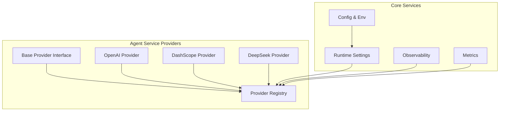
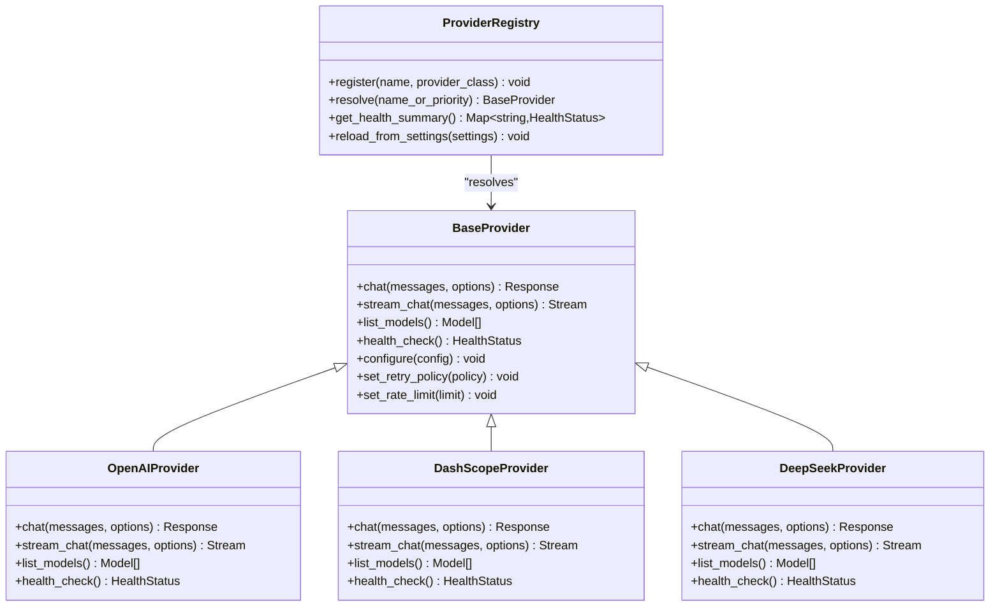
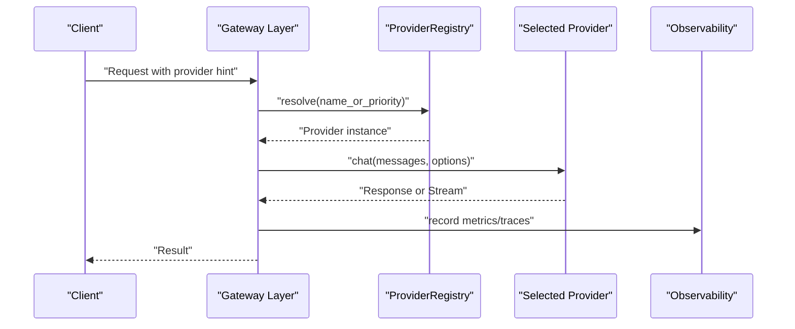
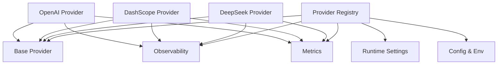

# Provider Registry and Multi-Provider Support

<cite>
**Referenced Files in This Document**
- [base.py](file://products/agent-platform/src/agent_service/providers/base.py)
- [registry.py](file://products/agent-platform/src/agent_service/providers/registry.py)
- [openai.py](file://products/agent-platform/src/agent_service/providers/openai.py)
- [dashscope.py](file://products/agent-platform/src/agent_service/providers/dashscope.py)
- [deepseek.py](file://products/agent-platform/src/agent_service/providers/deepseek.py)
- [runtime_settings.py](file://products/agent-platform/src/agent_service/runtime_settings.py)
- [config.py](file://products/agent-platform/src/agent_service/core/config.py)
- [env.py](file://products/agent-platform/src/agent_service/core/env.py)
- [metrics.py](file://products/agent-platform/src/agent_service/core/metrics.py)
- [observability.py](file://products/agent-platform/src/agent_service/core/observability.py)
- [test_runtime_providers.py](file://products/agent-platform/tests/test_runtime_providers.py)
</cite>

## Table of Contents
1. Introduction
2. Project Structure
3. Core Components
4. Architecture Overview
5. Detailed Component Analysis
6. Dependency Analysis
7. Performance Considerations
8. Troubleshooting Guide
9. Conclusion

## Introduction
This document explains the provider registry and multi-provider support system used by the agent platform to abstract and orchestrate calls to multiple LLM backends. It covers the abstract base provider interface, the registration mechanism, dynamic loading strategies, built-in providers (OpenAI, DashScope, DeepSeek), configuration and authentication differences, custom provider implementation patterns, selection and fallback strategies, rate limiting and retry policies, error handling, health monitoring, circuit breaker patterns, and performance benchmarking guidance.

## Project Structure
The provider subsystem lives under the agent platform service:
- Abstract base and registry: products/agent-platform/src/agent_service/providers/base.py, registry.py
- Built-in providers: openai.py, dashscope.py, deepseek.py
- Configuration and environment: core/config.py, core/env.py, runtime_settings.py
- Observability and metrics: core/observability.py, core/metrics.py
- Tests for provider behavior: tests/test_runtime_providers.py

**Diagram sources**
- [base.py](file://products/agent-platform/src/agent_service/providers/base.py)
- [registry.py](file://products/agent-platform/src/agent_service/providers/registry.py)
- [openai.py](file://products/agent-platform/src/agent_service/providers/openai.py)
- [dashscope.py](file://products/agent-platform/src/agent_service/providers/dashscope.py)
- [deepseek.py](file://products/agent-platform/src/agent_service/providers/deepseek.py)
- [config.py](file://products/agent-platform/src/agent_service/core/config.py)
- [env.py](file://products/agent-platform/src/agent_service/core/env.py)
- [metrics.py](file://products/agent-platform/src/agent_service/core/metrics.py)
- [observability.py](file://products/agent-platform/src/agent_service/core/observability.py)
- [runtime_settings.py](file://products/agent-platform/src/agent_service/runtime_settings.py)

**Section sources**
- [base.py](file://products/agent-platform/src/agent_service/providers/base.py)
- [registry.py](file://products/agent-platform/src/agent_service/providers/registry.py)
- [openai.py](file://products/agent-platform/src/agent_service/providers/openai.py)
- [dashscope.py](file://products/agent-platform/src/agent_service/providers/dashscope.py)
- [deepseek.py](file://products/agent-platform/src/agent_service/providers/deepseek.py)
- [config.py](file://products/agent-platform/src/agent_service/core/config.py)
- [env.py](file://products/agent-platform/src/agent_service/core/env.py)
- [metrics.py](file://products/agent-platform/src/agent_service/core/metrics.py)
- [observability.py](file://products/agent-platform/src/agent_service/core/observability.py)
- [runtime_settings.py](file://products/agent-platform/src/agent_service/runtime_settings.py)

## Core Components
- Abstract base provider: Defines the contract all providers must implement, including chat completion, streaming, model listing, and health checks. It also centralizes common behaviors like retries, timeouts, and telemetry hooks.
- Provider registry: A centralized lookup that registers available providers, resolves them by name or priority, and supports dynamic loading based on runtime settings.
- Built-in providers: Concrete implementations for OpenAI, DashScope, and DeepSeek, each mapping the abstract interface to their respective SDKs and APIs.
- Configuration and environment: Centralized config and env loaders provide credentials, endpoints, and per-provider options. Runtime settings select active providers and policies.
- Observability and metrics: Standardized instrumentation for latency, throughput, errors, and provider-specific metrics.

Key responsibilities:
- Uniform API surface across providers
- Safe credential management and secret injection
- Configurable retry/backoff and rate limiting
- Health checks and readiness signals
- Metrics and tracing for observability

**Section sources**
- [base.py](file://products/agent-platform/src/agent_service/providers/base.py)
- [registry.py](file://products/agent-platform/src/agent_service/providers/registry.py)
- [openai.py](file://products/agent-platform/src/agent_service/providers/openai.py)
- [dashscope.py](file://products/agent-platform/src/agent_service/providers/dashscope.py)
- [deepseek.py](file://products/agent-platform/src/agent_service/providers/deepseek.py)
- [config.py](file://products/agent-platform/src/agent_service/core/config.py)
- [env.py](file://products/agent-platform/src/agent_service/core/env.py)
- [runtime_settings.py](file://products/agent-platform/src/agent_service/runtime_settings.py)
- [metrics.py](file://products/agent-platform/src/agent_service/core/metrics.py)
- [observability.py](file://products/agent-platform/src/agent_service/core/observability.py)

## Architecture Overview
The provider architecture follows a clear separation between abstraction, registry, and concrete implementations:

**Diagram sources**
- [base.py](file://products/agent-platform/src/agent_service/providers/base.py)
- [openai.py](file://products/agent-platform/src/agent_service/providers/openai.py)
- [dashscope.py](file://products/agent-platform/src/agent_service/providers/dashscope.py)
- [deepseek.py](file://products/agent-platform/src/agent_service/providers/deepseek.py)
- [registry.py](file://products/agent-platform/src/agent_service/providers/registry.py)

## Detailed Component Analysis

### Abstract Base Provider
The base provider defines the canonical interface for all LLM integrations. It standardizes:
- Chat completion and streaming
- Model enumeration
- Health checks
- Configuration binding
- Retry policy application
- Rate limit enforcement
- Telemetry hooks for metrics and traces

Implementation expectations:
- Each provider implements the same method signatures to ensure interchangeability
- Common logic such as request normalization, response parsing, and error translation is centralized where possible
- Health checks return structured status with latency and availability indicators

**Section sources**
- [base.py](file://products/agent-platform/src/agent_service/providers/base.py)

### Provider Registry
The registry manages provider lifecycle and resolution:
- Registration of provider classes by name
- Dynamic loading from runtime settings
- Resolution by explicit name or priority-based selection
- Aggregated health summary across providers
- Reload capability when configuration changes at runtime

Resolution strategy:
- If a specific provider name is configured, resolve directly
- Otherwise, iterate registered providers by priority and pick the first healthy one
- Fallback chain can be enforced via ordered lists in runtime settings

**Section sources**
- [registry.py](file://products/agent-platform/src/agent_service/providers/registry.py)
- [runtime_settings.py](file://products/agent-platform/src/agent_service/runtime_settings.py)

### Built-in Providers

#### OpenAI Provider
- Authentication: API key via environment or config; supports bearer token patterns
- Endpoint: Uses OpenAI-compatible base URL if configured; otherwise defaults to official endpoint
- Features: Chat completions, streaming responses, model listing
- Differences: Follows OpenAI schema strictly; maps tool-use and function-calling fields accordingly

Configuration highlights:
- API key source
- Base URL override
- Model aliasing and default model selection
- Request timeout and retry parameters

**Section sources**
- [openai.py](file://products/agent-platform/src/agent_service/providers/openai.py)
- [config.py](file://products/agent-platform/src/agent_service/core/config.py)
- [env.py](file://products/agent-platform/src/agent_service/core/env.py)

#### DashScope Provider
- Authentication: API key via environment or config; may include project-level headers
- Endpoint: DashScope API endpoint; supports region-specific routing
- Features: Chat completions, streaming, model listing; may differ in payload shape
- Differences: Payload structure and field names vary from OpenAI; provider normalizes inputs and outputs

Configuration highlights:
- API key and optional project ID
- Region or endpoint override
- Streaming chunk handling specifics

**Section sources**
- [dashscope.py](file://products/agent-platform/src/agent_service/providers/dashscope.py)
- [config.py](file://products/agent-platform/src/agent_service/core/config.py)
- [env.py](file://products/agent-platform/src/agent_service/core/env.py)

#### DeepSeek Provider
- Authentication: API key via environment or config; uses compatible client library
- Endpoint: DeepSeek API endpoint; supports custom base URL if needed
- Features: Chat completions, streaming, model listing; aligns closely with OpenAI-like contracts
- Differences: Minor variations in response fields and error codes; normalized by provider layer

Configuration highlights:
- API key and optional organization/project identifiers
- Model aliases and default model
- Timeout and retry tuning

**Section sources**
- [deepseek.py](file://products/agent-platform/src/agent_service/providers/deepseek.py)
- [config.py](file://products/agent-platform/src/agent_service/core/config.py)
- [env.py](file://products/agent-platform/src/agent_service/core/env.py)

### Dynamic Provider Loading
Dynamic loading enables runtime selection without code changes:
- Runtime settings define active provider names and priorities
- Registry reloads providers based on current configuration
- Health checks gate selection; unhealthy providers are skipped until recovered

Flow overview:
- On startup, load settings and register providers
- For each request, resolve provider by name or priority
- If no provider is healthy, fail fast with a clear error
- Periodically refresh health status and re-evaluate selection

**Diagram sources**
- [registry.py](file://products/agent-platform/src/agent_service/providers/registry.py)
- [runtime_settings.py](file://products/agent-platform/src/agent_service/runtime_settings.py)
- [observability.py](file://products/agent-platform/src/agent_service/core/observability.py)

**Section sources**
- [registry.py](file://products/agent-platform/src/agent_service/providers/registry.py)
- [runtime_settings.py](file://products/agent-platform/src/agent_service/runtime_settings.py)

### Custom Provider Implementation
To add a new provider:
- Implement the base provider interface methods
- Configure authentication and endpoint details
- Register the provider in the registry during initialization
- Provide configuration keys for secrets and runtime options

Best practices:
- Normalize requests and responses to the base contract
- Handle provider-specific error codes and map to standardized exceptions
- Emit metrics and traces consistently
- Implement robust health checks

Example steps:
- Create a new file under providers directory
- Extend the base provider class
- Add registration in the registry initialization
- Update runtime settings to include the new provider

**Section sources**
- [base.py](file://products/agent-platform/src/agent_service/providers/base.py)
- [registry.py](file://products/agent-platform/src/agent_service/providers/registry.py)

### Provider Selection Strategies and Fallback Mechanisms
Selection strategies:
- Explicit name resolution: Choose a specific provider by configured name
- Priority-based selection: Order providers by preference; pick the first healthy one
- Weighted round-robin: Distribute traffic across multiple providers proportionally

Fallback mechanisms:
- Automatic failover to next provider in priority list upon failure
- Circuit breaker to temporarily exclude failing providers
- Graceful degradation by switching to a cheaper or more reliable provider

Operational considerations:
- Monitor health and error rates to adjust priorities dynamically
- Use feature flags to enable/disable providers per tenant or region
- Ensure idempotency and consistent retries across providers

**Section sources**
- [registry.py](file://products/agent-platform/src/agent_service/providers/registry.py)
- [runtime_settings.py](file://products/agent-platform/src/agent_service/runtime_settings.py)

### Rate Limiting, Retry Policies, and Error Handling
Rate limiting:
- Enforce per-provider quotas and global limits
- Backpressure signaling when approaching thresholds
- Queueing or dropping requests based on policy

Retry policies:
- Exponential backoff with jitter for transient errors
- Idempotent request retries only
- Maximum retry attempts and timeouts

Error handling:
- Normalize provider-specific errors into unified exceptions
- Distinguish between client errors (bad input) and server errors (transient)
- Surface actionable diagnostics for debugging

**Diagram sources**
- [base.py](file://products/agent-platform/src/agent_service/providers/base.py)
- [metrics.py](file://products/agent-platform/src/agent_service/core/metrics.py)

**Section sources**
- [base.py](file://products/agent-platform/src/agent_service/providers/base.py)
- [metrics.py](file://products/agent-platform/src/agent_service/core/metrics.py)

### Health Monitoring and Circuit Breaker Patterns
Health monitoring:
- Periodic health checks for each provider
- Track latency percentiles and error rates
- Aggregate health summaries for operational dashboards

Circuit breaker:
- States: Closed (normal), Open (failing), Half-Open (testing recovery)
- Thresholds: Error rate, latency, minimum sample size
- Recovery: Gradual traffic resumption when health improves

Integration points:
- Registry consults circuit breaker state before selecting a provider
- Observability emits events for state transitions and failures

**Section sources**
- [registry.py](file://products/agent-platform/src/agent_service/providers/registry.py)
- [observability.py](file://products/agent-platform/src/agent_service/core/observability.py)

### Performance Benchmarking
Benchmarking guidelines:
- Measure latency distributions (p50, p95, p99) per provider
- Track throughput under sustained load
- Compare cost-per-token and success rates
- Validate streaming vs non-streaming performance

Recommended approach:
- Use synthetic workloads mimicking real traffic patterns
- Instrument metrics consistently across providers
- Run benchmarks in isolated environments to avoid noise
- Report results in a standardized format for comparison

[No sources needed since this section provides general guidance]

## Dependency Analysis
Provider dependencies and relationships:
- Base provider defines the contract; concrete providers depend on it
- Registry depends on runtime settings and configuration
- Observability and metrics are used by providers and registry for instrumentation

**Diagram sources**
- [base.py](file://products/agent-platform/src/agent_service/providers/base.py)
- [registry.py](file://products/agent-platform/src/agent_service/providers/registry.py)
- [openai.py](file://products/agent-platform/src/agent_service/providers/openai.py)
- [dashscope.py](file://products/agent-platform/src/agent_service/providers/dashscope.py)
- [deepseek.py](file://products/agent-platform/src/agent_service/providers/deepseek.py)
- [config.py](file://products/agent-platform/src/agent_service/core/config.py)
- [env.py](file://products/agent-platform/src/agent_service/core/env.py)
- [runtime_settings.py](file://products/agent-platform/src/agent_service/runtime_settings.py)
- [observability.py](file://products/agent-platform/src/agent_service/core/observability.py)
- [metrics.py](file://products/agent-platform/src/agent_service/core/metrics.py)

**Section sources**
- [base.py](file://products/agent-platform/src/agent_service/providers/base.py)
- [registry.py](file://products/agent-platform/src/agent_service/providers/registry.py)
- [openai.py](file://products/agent-platform/src/agent_service/providers/openai.py)
- [dashscope.py](file://products/agent-platform/src/agent_service/providers/dashscope.py)
- [deepseek.py](file://products/agent-platform/src/agent_service/providers/deepseek.py)
- [config.py](file://products/agent-platform/src/agent_service/core/config.py)
- [env.py](file://products/agent-platform/src/agent_service/core/env.py)
- [runtime_settings.py](file://products/agent-platform/src/agent_service/runtime_settings.py)
- [observability.py](file://products/agent-platform/src/agent_service/core/observability.py)
- [metrics.py](file://products/agent-platform/src/agent_service/core/metrics.py)

## Performance Considerations
- Prefer streaming for large responses to reduce memory usage and improve perceived latency
- Tune timeouts and retries per provider based on observed SLAs
- Cache model listings and static configurations where safe
- Avoid unnecessary serialization overhead by reusing objects
- Monitor resource utilization and scale horizontally under load

[No sources needed since this section provides general guidance]

## Troubleshooting Guide
Common issues and resolutions:
- Authentication failures: Verify API keys and endpoints; check environment variable injection
- Rate limit errors: Adjust quotas and implement backpressure; monitor usage trends
- Provider unavailability: Inspect health checks and circuit breaker states; switch to fallback provider
- Inconsistent responses: Validate normalization layers; compare provider schemas
- High latency: Analyze metrics and traces; identify bottlenecks in network or provider side

Debugging tips:
- Enable detailed logging for provider interactions
- Use health summary endpoints to assess provider status
- Correlate metrics with deployment changes and configuration updates

**Section sources**
- [test_runtime_providers.py](file://products/agent-platform/tests/test_runtime_providers.py)

## Conclusion
The provider registry and multi-provider support system provide a robust, extensible foundation for integrating multiple LLM backends. By standardizing interfaces, centralizing configuration, and enforcing health-aware selection, the system ensures reliability, flexibility, and observability across diverse providers. Following the guidance in this document will help you implement custom providers, optimize performance, and maintain high availability in production environments.