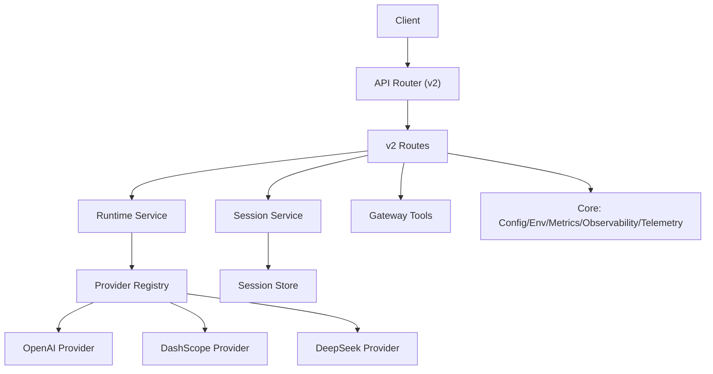
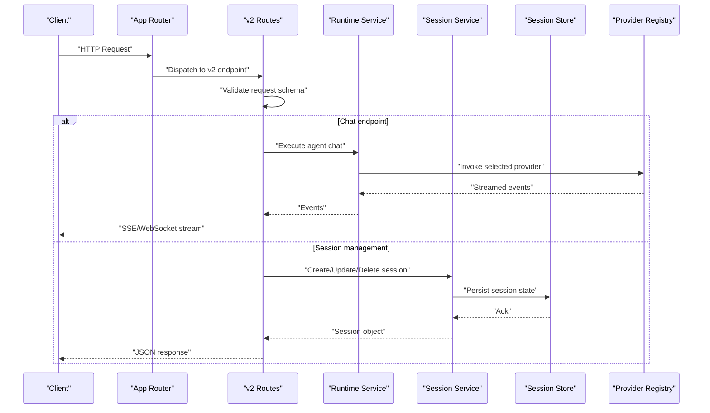
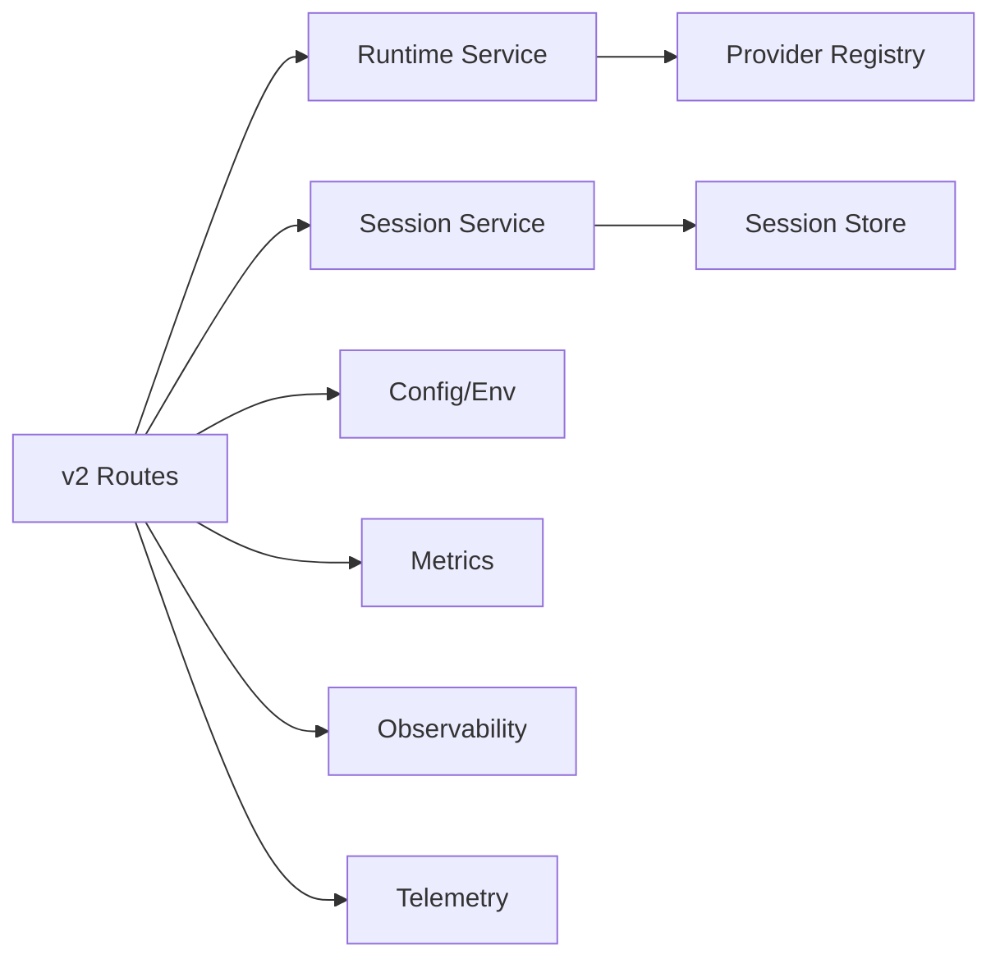

# REST API Endpoints and Integration

<cite>
**Referenced Files in This Document**
- [routes.py](file://products/agent-platform/src/agent_service/api/v2/routes.py)
- [v2.py](file://products/agent-platform/src/agent_service/schemas/v2.py)
- [api.py](file://products/agent-platform/src/agent_service/schemas/api.py)
- [app.py](file://products/agent-platform/src/agent_service/app.py)
- [main.py](file://products/agent-platform/src/agent_service/main.py)
- [runtime_service.py](file://products/agent-platform/src/agent_service/services/runtime_service.py)
- [session_service.py](file://products/agent-platform/src/agent_service/services/session_service.py)
- [session_store.py](file://products/agent-platform/src/agent_service/services/session_store.py)
- [config.py](file://products/agent-platform/src/agent_service/core/config.py)
- [env.py](file://products/agent-platform/src/agent_service/core/env.py)
- [metrics.py](file://products/agent-platform/src/agent_service/core/metrics.py)
- [observability.py](file://products/agent-platform/src/agent_service/core/observability.py)
- [telemetry.py](file://products/agent-platform/src/agent_service/core/telemetry.py)
- [request_context.py](file://products/agent-platform/src/agent_service/core/request_context.py)
- [registry.py](file://products/agent-platform/src/agent_service/providers/registry.py)
- [base.py](file://products/agent-platform/src/agent_service/providers/base.py)
- [openai.py](file://products/agent-platform/src/agent_service/providers/openai.py)
- [dashscope.py](file://products/agent-platform/src/agent_service/providers/dashscope.py)
- [deepseek.py](file://products/agent-platform/src/agent_service/providers/deepseek.py)
- [gateway_tools.py](file://products/agent-platform/src/agent_service/tools/gateway_tools.py)
- [agent_app.py](file://products/agent-platform/src/agent_service/agent_app.py)
- [native_service.py](file://products/agent-platform/src/agent_service/native_service.py)
- [runtime_kernel.py](file://products/agent-platform/src/agent_service/runtime_kernel.py)
- [runtime_settings.py](file://products/agent-platform/src/agent_service/runtime_settings.py)
- [chat-request.schema.json](file://shared/shared-contracts/schemas/chat-request.schema.json)
- [chat-response.schema.json](file://shared/shared-contracts/schemas/chat-response.schema.json)
- [stream-event.schema.json](file://shared/shared-contracts/schemas/stream-event.schema.json)
- [agent-chat-request.schema.json](file://shared/shared-contracts/schemas/agent-chat-request.schema.json)
- [agent-chat-response.schema.json](file://shared/shared-contracts/schemas/agent-chat-response.schema.json)
- [agent-session.schema.json](file://shared/shared-contracts/schemas/agent-session.schema.json)
- [policy-default.yaml](file://shared/shared-contracts/policies/policy-default.yaml)
</cite>

## Table of Contents
1. [Introduction](#introduction)
2. [Project Structure](#project-structure)
3. [Core Components](#core-components)
4. [Architecture Overview](#architecture-overview)
5. [Detailed Component Analysis](#detailed-component-analysis)
6. [Dependency Analysis](#dependency-analysis)
7. [Performance Considerations](#performance-considerations)
8. [Troubleshooting Guide](#troubleshooting-guide)
9. [Conclusion](#conclusion)
10. [Appendices](#appendices)

## Introduction
This document provides comprehensive API documentation for the Agent Platform v2 REST endpoints, including HTTP methods, URL patterns, request/response schemas, authentication requirements, and WebSocket streaming support. It also covers session management operations, provider configuration endpoints, error response formats, status codes, rate limiting considerations, input validation, and security best practices for API consumers.

## Project Structure
The Agent Platform service exposes its v2 API under a dedicated routes module and uses shared schema contracts for consistent request/response payloads. Core runtime services handle agent execution, sessions, and provider integrations. Observability, metrics, and telemetry are integrated at the core layer.

**Diagram sources**
- [routes.py](file://products/agent-platform/src/agent_service/api/v2/routes.py)
- [runtime_service.py](file://products/agent-platform/src/agent_service/services/runtime_service.py)
- [session_service.py](file://products/agent-platform/src/agent_service/services/session_service.py)
- [registry.py](file://products/agent-platform/src/agent_service/providers/registry.py)
- [openai.py](file://products/agent-platform/src/agent_service/providers/openai.py)
- [dashscope.py](file://products/agent-platform/src/agent_service/providers/dashscope.py)
- [deepseek.py](file://products/agent-platform/src/agent_service/providers/deepseek.py)
- [session_store.py](file://products/agent-platform/src/agent_service/services/session_store.py)
- [gateway_tools.py](file://products/agent-platform/src/agent_service/tools/gateway_tools.py)
- [config.py](file://products/agent-platform/src/agent_service/core/config.py)
- [metrics.py](file://products/agent-platform/src/agent_service/core/metrics.py)
- [observability.py](file://products/agent-platform/src/agent_service/core/observability.py)
- [telemetry.py](file://products/agent-platform/src/agent_service/core/telemetry.py)

**Section sources**
- [app.py](file://products/agent-platform/src/agent_service/app.py)
- [main.py](file://products/agent-platform/src/agent_service/main.py)
- [routes.py](file://products/agent-platform/src/agent_service/api/v2/routes.py)

## Core Components
- v2 API routes define all REST endpoints for chat, sessions, providers, and tooling.
- Schemas enforce strict request/response structures using shared JSON schemas.
- Runtime service orchestrates agent execution and integrates with providers.
- Session service manages lifecycle and persistence via a session store.
- Provider registry abstracts multiple LLM backends.
- Core modules provide configuration, environment variables, metrics, observability, and telemetry.

Key responsibilities:
- Input validation against schemas before processing requests.
- Authentication and authorization checks where applicable.
- Streaming responses over SSE or WebSocket for real-time updates.
- Error handling with standardized error payloads.

**Section sources**
- [routes.py](file://products/agent-platform/src/agent_service/api/v2/routes.py)
- [v2.py](file://products/agent-platform/src/agent_service/schemas/v2.py)
- [api.py](file://products/agent-platform/src/agent_service/schemas/api.py)
- [runtime_service.py](file://products/agent-platform/src/agent_service/services/runtime_service.py)
- [session_service.py](file://products/agent-platform/src/agent_service/services/session_service.py)
- [session_store.py](file://products/agent-platform/src/agent_service/services/session_store.py)
- [registry.py](file://products/agent-platform/src/agent_service/providers/registry.py)
- [config.py](file://products/agent-platform/src/agent_service/core/config.py)
- [metrics.py](file://products/agent-platform/src/agent_service/core/metrics.py)
- [observability.py](file://products/agent-platform/src/agent_service/core/observability.py)
- [telemetry.py](file://products/agent-platform/src/agent_service/core/telemetry.py)

## Architecture Overview
The v2 API is exposed through an application router that mounts the v2 routes. Requests flow from the client to the route handlers, which validate inputs, interact with runtime and session services, and return structured responses. Streaming endpoints emit events to clients in real time.

**Diagram sources**
- [routes.py](file://products/agent-platform/src/agent_service/api/v2/routes.py)
- [runtime_service.py](file://products/agent-platform/src/agent_service/services/runtime_service.py)
- [session_service.py](file://products/agent-platform/src/agent_service/services/session_service.py)
- [session_store.py](file://products/agent-platform/src/agent_service/services/session_store.py)
- [registry.py](file://products/agent-platform/src/agent_service/providers/registry.py)

## Detailed Component Analysis

### v2 REST Endpoints
Endpoints are defined in the v2 routes module. Typical categories include:
- Agent chat interactions: POST /v2/chat
- Session management: CRUD operations on /v2/sessions
- Provider configuration: GET/POST /v2/providers
- Tool invocation: POST /v2/tools

Authentication:
- Most endpoints require an authenticated context; tokens are validated by middleware or dependency injection.
- Some health or metadata endpoints may be public.

Request/Response Schemas:
- Chat requests conform to shared schemas for chat payloads.
- Responses follow standardized JSON structures, including streaming event types.

Streaming:
- Chat endpoints support server-sent events (SSE) or WebSocket streams for incremental updates.
- Clients must handle partial messages and final completion markers.

Error Handling:
- Errors return standardized JSON bodies with status codes indicating failure reasons.
- Validation errors, unauthorized access, and internal failures are distinguished.

Rate Limiting:
- Rate limits may be enforced at the gateway or application level; consult configuration for limits and headers.

Input Validation:
- Strict schema validation ensures required fields and types are present.
- Invalid inputs result in 400-level responses with detailed error messages.

Security Best Practices:
- Use HTTPS for all endpoints.
- Validate and sanitize inputs.
- Enforce least privilege for service accounts and tokens.
- Rotate secrets and credentials regularly.

Example flows:
- Agent chat interaction: Client sends a chat request; server validates, executes agent, streams events, and returns final result.
- Session management: Client creates a session, receives a session ID, then interacts with the agent within that session context.
- Provider configuration: Client retrieves available providers and configures credentials securely.

**Section sources**
- [routes.py](file://products/agent-platform/src/agent_service/api/v2/routes.py)
- [v2.py](file://products/agent-platform/src/agent_service/schemas/v2.py)
- [api.py](file://products/agent-platform/src/agent_service/schemas/api.py)
- [chat-request.schema.json](file://shared/shared-contracts/schemas/chat-request.schema.json)
- [chat-response.schema.json](file://shared/shared-contracts/schemas/chat-response.schema.json)
- [stream-event.schema.json](file://shared/shared-contracts/schemas/stream-event.schema.json)
- [agent-chat-request.schema.json](file://shared/shared-contracts/schemas/agent-chat-request.schema.json)
- [agent-chat-response.schema.json](file://shared/shared-contracts/schemas/agent-chat-response.schema.json)
- [agent-session.schema.json](file://shared/shared-contracts/schemas/agent-session.schema.json)

### Session Management Operations
Session endpoints manage lifecycle and state:
- Create session: Initialize a new session and return a session identifier.
- Update session: Modify session parameters or context.
- Retrieve session: Fetch current session details.
- Delete session: Terminate and remove session data.

Persistence:
- Sessions are stored via a session store abstraction, enabling durable storage across restarts.

State transitions:
- Sessions transition through states such as created, active, paused, and terminated.

**Section sources**
- [session_service.py](file://products/agent-platform/src/agent_service/services/session_service.py)
- [session_store.py](file://products/agent-platform/src/agent_service/services/session_store.py)
- [agent-session.schema.json](file://shared/shared-contracts/schemas/agent-session.schema.json)

### Provider Configuration Endpoints
Provider endpoints allow listing and configuring supported LLM backends:
- List providers: Return available providers and their capabilities.
- Configure provider: Set credentials and options for a specific provider.
- Validate provider: Test connectivity and permissions.

Provider registry:
- Centralized registry manages provider implementations and selection logic.

Supported providers:
- OpenAI, DashScope, DeepSeek are implemented as concrete providers.

**Section sources**
- [registry.py](file://products/agent-platform/src/agent_service/providers/registry.py)
- [base.py](file://products/agent-platform/src/agent_service/providers/base.py)
- [openai.py](file://products/agent-platform/src/agent_service/providers/openai.py)
- [dashscope.py](file://products/agent-platform/src/agent_service/providers/dashscope.py)
- [deepseek.py](file://products/agent-platform/src/agent_service/providers/deepseek.py)

### WebSocket Support and Streaming
Streaming endpoints deliver real-time updates:
- Server-Sent Events (SSE): For simple streaming scenarios.
- WebSocket: For bidirectional communication and advanced use cases.

Event handling:
- Clients subscribe to event streams and process incremental messages.
- Final completion events indicate end-of-stream.

Connection lifecycle:
- Establish connection, send initial request, receive streamed events, close gracefully.

**Section sources**
- [routes.py](file://products/agent-platform/src/agent_service/api/v2/routes.py)
- [stream-event.schema.json](file://shared/shared-contracts/schemas/stream-event.schema.json)

### Tool Invocation
Tool endpoints enable invoking external tools through the platform:
- POST /v2/tools: Execute a tool with provided parameters.
- Responses include tool results and status information.

Integration:
- Tools are registered and discovered via a registry mechanism.

**Section sources**
- [gateway_tools.py](file://products/agent-platform/src/agent_service/tools/gateway_tools.py)

## Dependency Analysis
The v2 routes depend on runtime and session services, which in turn rely on provider registries and session stores. Core modules provide cross-cutting concerns like configuration, metrics, and observability.

**Diagram sources**
- [routes.py](file://products/agent-platform/src/agent_service/api/v2/routes.py)
- [runtime_service.py](file://products/agent-platform/src/agent_service/services/runtime_service.py)
- [session_service.py](file://products/agent-platform/src/agent_service/services/session_service.py)
- [registry.py](file://products/agent-platform/src/agent_service/providers/registry.py)
- [session_store.py](file://products/agent-platform/src/agent_service/services/session_store.py)
- [config.py](file://products/agent-platform/src/agent_service/core/config.py)
- [metrics.py](file://products/agent-platform/src/agent_service/core/metrics.py)
- [observability.py](file://products/agent-platform/src/agent_service/core/observability.py)
- [telemetry.py](file://products/agent-platform/src/agent_service/core/telemetry.py)

**Section sources**
- [routes.py](file://products/agent-platform/src/agent_service/api/v2/routes.py)
- [runtime_service.py](file://products/agent-platform/src/agent_service/services/runtime_service.py)
- [session_service.py](file://products/agent-platform/src/agent_service/services/session_service.py)
- [registry.py](file://products/agent-platform/src/agent_service/providers/registry.py)
- [session_store.py](file://products/agent-platform/src/agent_service/services/session_store.py)
- [config.py](file://products/agent-platform/src/agent_service/core/config.py)
- [metrics.py](file://products/agent-platform/src/agent_service/core/metrics.py)
- [observability.py](file://products/agent-platform/src/agent_service/core/observability.py)
- [telemetry.py](file://products/agent-platform/src/agent_service/core/telemetry.py)

## Performance Considerations
- Use streaming for long-running operations to reduce latency and improve user experience.
- Cache frequently accessed provider configurations and session metadata where appropriate.
- Monitor metrics and telemetry to identify bottlenecks and optimize resource usage.
- Implement pagination for list endpoints to avoid large payloads.
- Tune concurrency settings based on workload characteristics.

[No sources needed since this section provides general guidance]

## Troubleshooting Guide
Common issues and resolutions:
- Authentication failures: Verify token validity and scopes; ensure HTTPS and correct headers.
- Validation errors: Check request payload against schema definitions; ensure required fields are present.
- Provider errors: Confirm credentials and network connectivity; inspect provider logs.
- Session errors: Validate session IDs and state; check persistence backend availability.
- Rate limiting: Review rate limit headers and adjust client retry strategies.

Error response format:
- Standardized JSON body with error code, message, and optional details.
- HTTP status codes indicate category of error (client vs server).

Diagnostic steps:
- Enable detailed logging and observability.
- Inspect metrics for anomalies.
- Reproduce with minimal payloads to isolate issues.

**Section sources**
- [api.py](file://products/agent-platform/src/agent_service/schemas/api.py)
- [metrics.py](file://products/agent-platform/src/agent_service/core/metrics.py)
- [observability.py](file://products/agent-platform/src/agent_service/core/observability.py)
- [telemetry.py](file://products/agent-platform/src/agent_service/core/telemetry.py)

## Conclusion
The Agent Platform v2 API provides robust REST endpoints for agent chat, session management, provider configuration, and tool invocation. With strong schema validation, streaming support, and comprehensive observability, it enables secure and efficient integration for diverse use cases. Consumers should adhere to authentication, validation, and security best practices to ensure reliable operation.

[No sources needed since this section summarizes without analyzing specific files]

## Appendices

### Authentication and Authorization
- Tokens are validated per request; ensure proper scope assignment.
- Use service accounts with least privilege.
- Rotate credentials regularly and store secrets securely.

### Rate Limiting and Throttling
- Limits may be enforced at gateway or application layers.
- Respect retry-after headers and implement exponential backoff.

### Security Best Practices
- Enforce HTTPS everywhere.
- Validate and sanitize all inputs.
- Avoid logging sensitive data.
- Monitor for anomalous activity.

### Example Usage Patterns
- Agent chat: Send a chat request, handle streaming events, and process final result.
- Session management: Create a session, perform interactions, and terminate when done.
- Provider configuration: List providers, configure credentials, and validate connectivity.

**Section sources**
- [policy-default.yaml](file://shared/shared-contracts/policies/policy-default.yaml)
- [chat-request.schema.json](file://shared/shared-contracts/schemas/chat-request.schema.json)
- [chat-response.schema.json](file://shared/shared-contracts/schemas/chat-response.schema.json)
- [stream-event.schema.json](file://shared/shared-contracts/schemas/stream-event.schema.json)
- [agent-chat-request.schema.json](file://shared/shared-contracts/schemas/agent-chat-request.schema.json)
- [agent-chat-response.schema.json](file://shared/shared-contracts/schemas/agent-chat-response.schema.json)
- [agent-session.schema.json](file://shared/shared-contracts/schemas/agent-session.schema.json)