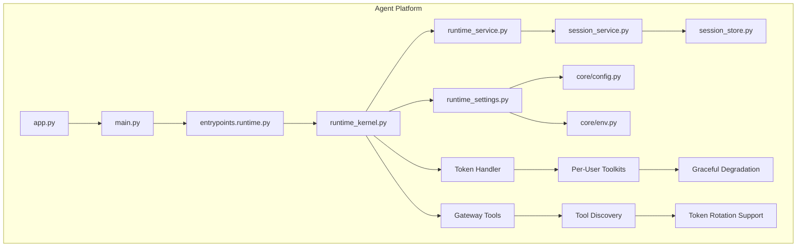
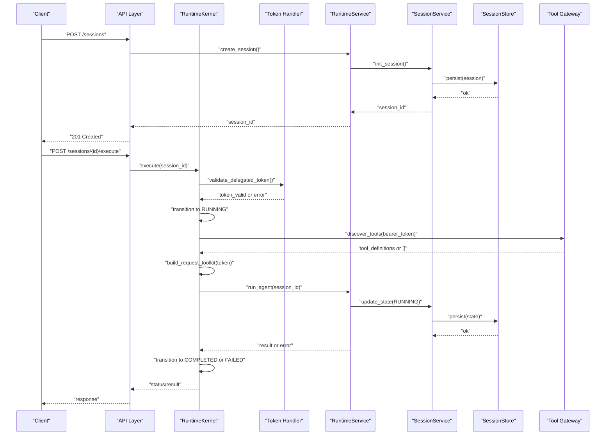
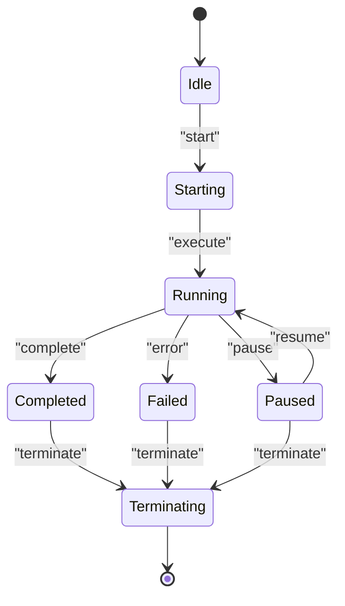
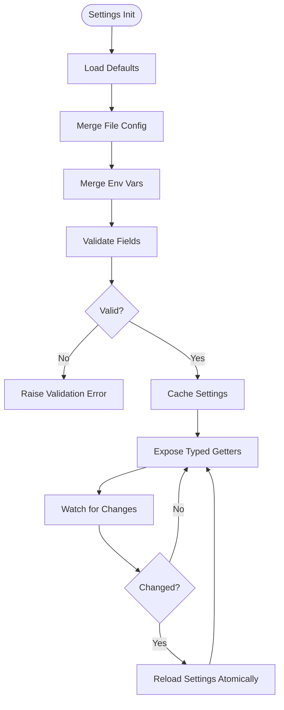
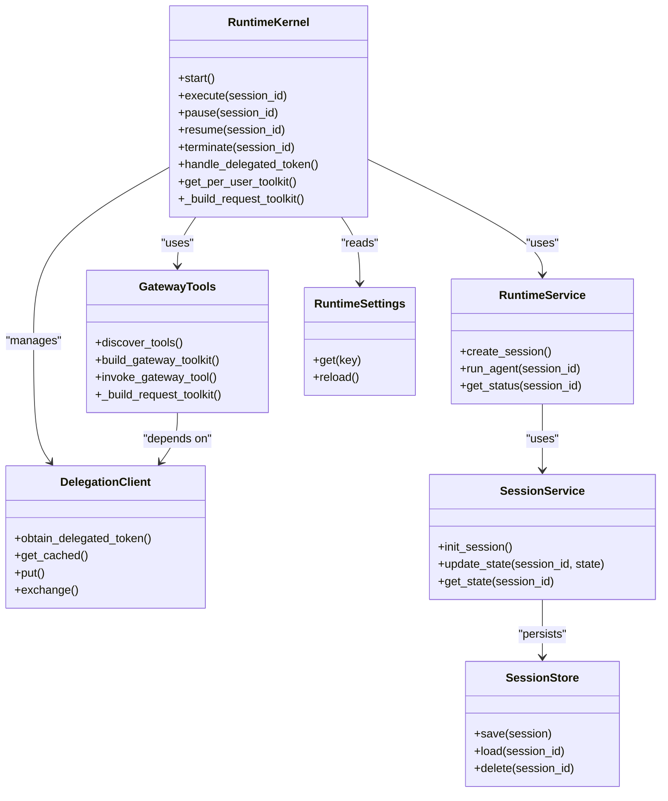

# Runtime Kernel and Agent Lifecycle

<cite>
**Referenced Files in This Document**
- [runtime_kernel.py](file://products/agent-platform/src/agent_service/runtime_kernel.py)
- [gateway_tools.py](file://products/agent-platform/src/agent_service/tools/gateway_tools.py)
- [runtime_settings.py](file://products/agent-platform/src/agent_service/runtime_settings.py)
- [delegation_client.py](file://products/platform-gateway/src/platform_gateway/services/delegation_client.py)
- [test_runtime_kernel.py](file://products/agent-platform/tests/test_runtime_kernel.py)
- [test_gateway_tools.py](file://products/agent-platform/tests/test_gateway_tools.py)
</cite>

## Update Summary
**Changes Made**
- Enhanced tool discovery mechanism with proper delegated token rotation handling
- Implemented token-aware tool discovery that handles dynamic token rotation during long-running sessions
- Added cache-miss discovery using current bearer token to prevent 'no-tools' notices after portal token refresh
- Prevented empty result cache poisoning with improved error handling for failed tool discovery
- Implemented robust retry mechanisms for token lifecycle events
- Updated per-request toolkit rebuilding to support token rotation scenarios

## Table of Contents
1. [Introduction](#introduction)
2. [Project Structure](#project-structure)
3. [Core Components](#core-components)
4. [Architecture Overview](#architecture-overview)
5. [Detailed Component Analysis](#detailed-component-analysis)
6. [Dependency Analysis](#dependency-analysis)
7. [Performance Considerations](#performance-considerations)
8. [Troubleshooting Guide](#troubleshooting-guide)
9. [Conclusion](#conclusion)

## Introduction
This document explains the runtime kernel and agent lifecycle management within the agent platform. It covers how the execution engine initializes, manages agent states, processes runtime settings and environment variables, supports dynamic configuration updates, and handles errors, resource cleanup, and graceful shutdown. The system now includes enhanced delegated token handling for secure tool execution, per-user toolkit closures, and graceful degradation mechanisms that ensure robust operation even when authentication tokens are unavailable. **Updated**: The runtime kernel now implements sophisticated token-aware tool discovery that handles dynamic token rotation during long-running sessions, preventing 'no-tools' notices after portal token refresh through cache-miss discovery using current bearer tokens and robust retry mechanisms.

## Project Structure
The runtime kernel and lifecycle are implemented primarily under the agent platform product. Key modules include:
- Runtime kernel: orchestrates agent lifecycle events and state transitions with enhanced token handling
- Tool gateway integration: provides token-aware tool discovery and execution with rotation support
- Runtime settings: loads and validates configuration from files and environment variables
- Services: runtime service for orchestration, session service for durable state, and session store for persistence
- Entrypoints and application bootstrap: initialize services and start the server

**Diagram sources**
- [runtime_kernel.py](file://products/agent-platform/src/agent_service/runtime_kernel.py)
- [gateway_tools.py](file://products/agent-platform/src/agent_service/tools/gateway_tools.py)
- [runtime_service.py](file://products/agent-platform/src/agent_platform/services/runtime_service.py)
- [session_service.py](file://products/agent-platform/src/agent_platform/services/session_service.py)
- [session_store.py](file://products/agent-platform/src/agent_platform/services/session_store.py)
- [runtime_settings.py](file://products/agent-platform/src/agent_service/runtime_settings.py)

**Section sources**
- [runtime_kernel.py](file://products/agent-platform/src/agent_service/runtime_kernel.py)
- [gateway_tools.py](file://products/agent-platform/src/agent_service/tools/gateway_tools.py)
- [runtime_settings.py](file://products/agent-platform/src/agent_service/runtime_settings.py)

## Core Components
- Runtime Kernel: Central coordinator for agent lifecycle events (start, execute, pause, resume, terminate), maintaining per-agent state, coordinating with services, and managing delegated token handling for secure tool execution.
- Gateway Tools Integration: Provides token-aware tool discovery and execution with support for dynamic token rotation during long-running sessions.
- Runtime Settings: Configuration loader that merges defaults, file-based settings, and environment variables; exposes typed accessors and supports reloads.
- Environment and Config Utilities: Provide strongly-typed access to runtime settings and environment variables, with validation and fallbacks.
- Runtime Service: Orchestrates high-level operations such as creating sessions, invoking agents, and managing long-running tasks.
- Session Service and Store: Manage durable session state, including persistence and retrieval, ensuring consistency across restarts.
- Token Handler: Manages delegated token lifecycle and validation for secure tool execution with rotation support.
- Per-User Toolkits: Provides isolated tool execution contexts based on user identity and permissions with token rotation awareness.
- Graceful Degradation: Ensures system continues operating with limited functionality when authentication tokens are unavailable.

Key responsibilities:
- Initialization: Load settings, validate environment, create dependencies, boot services, and initialize token handlers.
- Lifecycle Management: Handle agent state transitions and event-driven execution with token-aware tool execution and rotation support.
- Configuration: Support dynamic updates without restarting the process where feasible.
- Error Handling: Robust error propagation, retries, safe cleanup, and graceful degradation when tokens are missing or rotated.
- Performance: Concurrency control, resource pooling, efficient memory usage, and optimized token validation with rotation handling.

**Section sources**
- [runtime_kernel.py](file://products/agent-platform/src/agent_service/runtime_kernel.py)
- [gateway_tools.py](file://products/agent-platform/src/agent_service/tools/gateway_tools.py)
- [runtime_settings.py](file://products/agent-platform/src/agent_service/runtime_settings.py)

## Architecture Overview
The runtime architecture centers around a kernel that coordinates lifecycle events through services and persists state via sessions. Configuration is loaded at startup and can be refreshed dynamically. The enhanced architecture now includes token delegation for secure tool execution with rotation support and graceful degradation mechanisms.

**Diagram sources**
- [runtime_kernel.py](file://products/agent-platform/src/agent_service/runtime_kernel.py)
- [gateway_tools.py](file://products/agent-platform/src/agent_service/tools/gateway_tools.py)
- [runtime_service.py](file://products/agent-platform/src/agent_platform/services/runtime_service.py)
- [session_service.py](file://products/agent-platform/src/agent_platform/services/session_service.py)
- [session_store.py](file://products/agent-platform/src/agent_platform/services/session_store.py)

## Detailed Component Analysis

### Runtime Kernel
The runtime kernel manages agent lifecycle events and enforces state transitions. It coordinates with the runtime service to perform work, uses the session service to persist state changes, and now includes enhanced delegated token handling for secure tool execution with rotation support.

Lifecycle events and typical transitions:
- Start: Initialize resources, load settings, prepare context, and set up token handlers.
- Execute: Transition to running, validate delegated tokens, invoke agent logic with per-user toolkits, handle results or errors.
- Pause: Suspend execution, save checkpoint, transition to paused.
- Resume: Restore checkpoint, re-validate tokens if needed, transition back to running.
- Terminate: Clean up resources, finalize state, revoke tokens, transition to terminated.

Enhanced token handling features:
- Delegated token validation and caching for performance
- Per-user toolkit closures that isolate tool execution contexts
- Graceful degradation to empty Toolkit with structured errors when tokens are unavailable
- Automatic retry and fallback mechanisms for token validation failures
- **Updated**: Token-aware tool discovery that handles dynamic token rotation during long-running sessions
- **Updated**: Cache-miss discovery using current bearer token to prevent 'no-tools' notices after portal token refresh
- **Updated**: Prevention of empty result cache poisoning with improved error handling
- **Updated**: Robust retry mechanisms for token lifecycle events

Key behaviors:
- Event-driven transitions with guards to prevent invalid state changes.
- Integration with session persistence to ensure durability across restarts.
- Error handling that captures exceptions, logs context, marks sessions appropriately, and implements graceful degradation.
- Resource cleanup on termination to avoid leaks, including token revocation.
- Token-aware execution that falls back to limited functionality when authentication fails.
- **Updated**: Per-request toolkit rebuilding that discovers tools with current bearer token on cache miss to handle token rotation.

**Section sources**
- [runtime_kernel.py](file://products/agent-platform/src/agent_service/runtime_kernel.py)
- [test_runtime_kernel.py](file://products/agent-platform/tests/test_runtime_kernel.py)

### Gateway Tools Integration
The gateway tools module provides token-aware tool discovery and execution capabilities with comprehensive support for dynamic token rotation during long-running sessions.

Key features:
- **Updated**: Token-aware tool discovery that fetches available tools from the gateway using current bearer tokens
- **Updated**: Per-request toolkit rebuilding that handles token rotation by discovering tools with new tokens on cache miss
- **Updated**: Prevention of empty result cache poisoning - failed discoveries don't poison the cache, allowing retry on next attempt
- **Updated**: Improved error handling for failed tool discovery with graceful degradation to empty toolkit
- **Updated**: Robust retry mechanisms for token lifecycle events during long-running sessions

Implementation details:
- `discover_tools()`: Fetches tool definitions from gateway with bearer token authentication
- `_build_request_toolkit()`: Builds fresh toolkit with current token, handling cache misses for token rotation
- `build_gateway_toolkit()`: Creates AgentScope toolkit from discovered tool definitions
- `invoke_gateway_tool()`: Executes tools through gateway with proper token forwarding

**Section sources**
- [gateway_tools.py](file://products/agent-platform/src/agent_service/tools/gateway_tools.py)
- [test_gateway_tools.py](file://products/agent-platform/tests/test_gateway_tools.py)

### Runtime Settings and Configuration
Runtime settings encapsulate configuration loading, validation, and access. It supports merging defaults, file-based configs, and environment variables. Dynamic updates can be applied without full restarts.

Configuration flow:
- Load defaults from code.
- Merge overrides from configuration files.
- Apply environment variable overrides.
- Validate required fields and types.
- Expose typed getters for runtime components.

Dynamic update strategy:
- Detect changes in configuration sources.
- Reload settings atomically.
- Propagate updates to dependent services safely.

**Section sources**
- [runtime_settings.py](file://products/agent-platform/src/agent_service/runtime_settings.py)

### Delegation Client and Token Rotation
The delegation client manages delegated token lifecycle with sophisticated rotation handling to support long-running sessions.

Key features:
- Per-user delegated token caching with automatic refresh before expiry
- Support for workload token rotation from Kubernetes projected volumes
- Graceful fallback to static credentials when workload tokens are unavailable
- Non-fatal delegation failures that allow chat requests to succeed without tools

Token rotation mechanism:
- Tokens are cached per user subject with refresh timing based on TTL fraction
- Workload tokens are re-read on every exchange to handle file rotation
- Fallback to static credentials with warning logging when workload tokens unavailable
- Exchange failures are logged and swallowed to maintain service availability

**Section sources**
- [delegation_client.py](file://products/platform-gateway/src/platform_gateway/services/delegation_client.py)

### Application Bootstrap and Entrypoints
The application bootstrap wires together configuration, services, and the runtime kernel. Entrypoints expose APIs and start the server. The bootstrap now includes initialization of token handlers and graceful degradation mechanisms.

Bootstrap steps:
- Load runtime settings and environment.
- Initialize dependencies (e.g., stores, clients).
- Create the runtime kernel, services, and token handlers.
- Register routes and start the HTTP server with degraded mode support.

Entrypoints:
- Native entrypoint for direct execution.
- Runtime entrypoint for containerized deployments.

**Section sources**
- [runtime_kernel.py](file://products/agent-platform/src/agent_service/runtime_kernel.py)

## Dependency Analysis
The runtime kernel depends on configuration, services, persistence layers, and token handling components. The following diagram shows key relationships including the new token delegation architecture with rotation support:

**Diagram sources**
- [runtime_kernel.py](file://products/agent-platform/src/agent_service/runtime_kernel.py)
- [gateway_tools.py](file://products/agent-platform/src/agent_service/tools/gateway_tools.py)
- [delegation_client.py](file://products/platform-gateway/src/platform_gateway/services/delegation_client.py)
- [runtime_service.py](file://products/agent-platform/src/agent_platform/services/runtime_service.py)
- [session_service.py](file://products/agent-platform/src/agent_platform/services/session_service.py)
- [session_store.py](file://products/agent-platform/src/agent_platform/services/session_store.py)
- [runtime_settings.py](file://products/agent-platform/src/agent_service/runtime_settings.py)

**Section sources**
- [runtime_kernel.py](file://products/agent-platform/src/agent_service/runtime_kernel.py)
- [gateway_tools.py](file://products/agent-platform/src/agent_service/tools/gateway_tools.py)
- [delegation_client.py](file://products/platform-gateway/src/platform_gateway/services/delegation_client.py)

## Performance Considerations
- Concurrency Control: Use bounded worker pools for agent execution to prevent resource exhaustion.
- Memory Management: Avoid holding large payloads in memory; stream data where possible and release references promptly.
- Persistence Efficiency: Batch writes to session store and use optimistic locking to reduce contention.
- Configuration Reload: Perform atomic swaps of settings to minimize downtime and avoid partial reads.
- Token Validation Optimization: Cache validated tokens and implement efficient lookup mechanisms.
- **Updated**: Token Rotation Optimization: Implement cache-miss discovery patterns to handle token rotation efficiently without unnecessary network calls.
- **Updated**: Empty Result Cache Poisoning Prevention: Ensure failed tool discoveries don't poison caches, allowing retry mechanisms to function properly.
- Graceful Degradation: Minimize performance impact when falling back to empty Toolkit by using lazy initialization and caching.
- Observability: Emit metrics and traces for lifecycle events, latency, error rates, and token validation performance.

## Troubleshooting Guide
Common issues and strategies:
- Invalid State Transitions: Ensure guards prevent illegal transitions; log detailed context when blocked.
- Configuration Errors: Validate required environment variables and config keys early; surface clear messages.
- Session Persistence Failures: Retry with backoff, mark sessions as failed, and alert operators.
- Graceful Shutdown: Drain in-flight requests, flush pending writes, and close connections cleanly.
- Resource Leaks: Track open handles and enforce timeouts; implement finalizers to guarantee cleanup.
- Token Validation Failures: Implement proper error handling, logging, and fallback mechanisms.
- **Updated**: Token Rotation Issues: Monitor token rotation events and ensure per-request toolkit rebuilding functions correctly during long-running sessions.
- **Updated**: Tool Discovery Failures: Investigate gateway connectivity issues and verify bearer token validity when tool discovery fails.
- **Updated**: Cache Poisoning Prevention: Verify that empty discovery results are not being cached and that retry mechanisms are functioning properly.
- Graceful Degradation Issues: Monitor system behavior when tokens are unavailable and ensure limited functionality continues.

Operational checks:
- Health endpoints to verify readiness and liveness.
- Metrics dashboards for throughput, latency, error rates, and token validation success rates.
- Logs correlation using request IDs and session IDs.
- Token validation failure tracking and alerting.
- **Updated**: Token rotation monitoring: Track token refresh events and tool discovery success rates during token rotation.

**Section sources**
- [runtime_kernel.py](file://products/agent-platform/src/agent_service/runtime_kernel.py)
- [gateway_tools.py](file://products/agent-platform/src/agent_service/tools/gateway_tools.py)
- [delegation_client.py](file://products/platform-gateway/src/platform_gateway/services/delegation_client.py)

## Conclusion
The runtime kernel and agent lifecycle management provide a robust foundation for executing agents with durable state, configurable behavior, resilient operations, and enhanced security through delegated token handling with rotation support. By combining clear state transitions, strong configuration management, careful resource handling, and sophisticated token management with graceful degradation, the system supports scalable and maintainable agent execution in production environments while maintaining security and reliability even when authentication tokens are unavailable or rotated during long-running sessions. **Updated**: The enhanced tool discovery mechanism with proper delegated token rotation handling ensures that long-running sessions continue to function correctly even when portal tokens are refreshed, preventing 'no-tools' notices and maintaining seamless user experience through cache-miss discovery patterns and robust retry mechanisms.