# Runtime Kernel and Agent Lifecycle

<cite>
**Referenced Files in This Document**
- [runtime_kernel.py](file://products/agent-platform/src/agent_service/runtime_kernel.py)
- [prose_redaction.py](file://products/agent-platform/src/agent_service/services/prose_redaction.py)
- [kernel_middleware.py](file://products/agent-platform/src/agent_service/services/kernel_middleware.py)
- [gateway_tools.py](file://products/agent-platform/src/agent_service/tools/gateway_tools.py)
- [runtime_settings.py](file://products/agent-platform/src/agent_service/runtime_settings.py)
- [delegation_client.py](file://products/platform-gateway/src/platform_gateway/services/delegation_client.py)
- [test_runtime_kernel.py](file://products/agent-platform/tests/test_runtime_kernel.py)
- [test_gateway_tools.py](file://products/agent-platform/tests/test_gateway_tools.py)
- [test_kernel_middleware.py](file://products/agent-platform/tests/test_kernel_middleware.py)
- [agent_state_store.py](file://products/agent-platform/src/agent_service/services/agent_state_store.py)
- [metrics.py](file://products/agent-platform/src/agent_service/core/metrics.py)
- [routes.py](file://products/agent-platform/src/agent_service/api/v2/routes.py)
- [v2.py](file://products/agent-platform/src/agent_service/schemas/v2.py)
- [session_service.py](file://products/agent-platform/src/agent_service/services/session_service.py)
- [hitl_confirmations.py](file://products/agent-platform/src/agent_service/services/hitl_confirmations.py)
- [test_hitl_confirmations.py](file://products/agent-platform/tests/test_hitl_confirmations.py)
- [evidence_store.py](file://products/agent-platform/src/agent_service/services/evidence_store.py)
- [model_catalog.py](file://products/agent-platform/src/agent_service/services/model_catalog.py)
- [session_store.py](file://products/agent-platform/src/agent_service/services/session_store.py)
- [test_model_switching.py](file://products/agent-platform/tests/test_model_switching.py)
- [runtime.py](file://products/agent-platform/src/agent_service/entrypoints/runtime.py)
- [execution_signing.py](file://products/agent-platform/src/agent_service/services/execution_signing.py)
- [execution_records.py](file://products/agent-platform/src/agent_service/services/execution_records.py)
- [confirmation_records.py](file://products/agent-platform/src/agent_service/services/confirmation_records.py)
- [audit_emitter.py](file://products/agent-platform/src/agent_service/services/audit_emitter.py)
- [flow_approvals.py](file://products/agent-platform/src/agent_service/services/flow_approvals.py)
- [secret_params.py](file://products/agent-platform/src/agent_service/services/secret_params.py)
- [authoring_trace.py](file://products/agent-platform/src/agent_service/services/authoring_trace.py)
- [test_authoring_trace.py](file://products/agent-platform/tests/test_authoring_trace.py)
- [test_prose_redaction.py](file://products/agent-platform/tests/test_prose_redaction.py)
</cite>

## Update Summary
**Changes Made**
- Fixed critical rendering bug in prose redaction system where held-back text segments were incorrectly sequenced relative to tool call frames, causing corrupted paragraph breaks in streamed responses
- Updated stream_events and resume_confirmation methods to ensure proper sequencing of trace events before yielding tool frames
- Added comprehensive test coverage (212 lines) for prose redaction timing issues including sophisticated InterleavedAgent class that simulates exact scenarios where text streams, tool evidence frames, and more text interleave in problematic order
- Tests verify held tails are released before following tool frames and flushed tails still properly mask credentials while preceding tool frames
- Enhanced documentation to reflect the critical ordering invariant between prose redaction flushes and tool frame emissions

## Table of Contents
1. [Introduction](#introduction)
2. [Project Structure](#project-structure)
3. [Core Components](#core-components)
4. [Architecture Overview](#architecture-overview)
5. [Detailed Component Analysis](#detailed-component-analysis)
6. [Dependency Analysis](#dependency-analysis)
7. [Performance Considerations](#performance-considerations)
8. [Troubleshooting Guide](#troubleshooting-guide)
9. [Conclusion](#conclusion)

## Introduction
This document explains the runtime kernel and agent lifecycle management within the agent platform. It covers how the execution engine initializes, manages agent states, processes runtime settings and environment variables, supports dynamic configuration updates, and handles errors, resource cleanup, and graceful shutdown. The system now includes sophisticated AgentScope 2.0.6 middleware integration with OpenTelemetry tracing, reply token budget control, enhanced toolkit management with contextvar-based token delegation, per-user toolkit closures, graceful degradation mechanisms, comprehensive state persistence capabilities, **newly added** Human-in-the-Loop (HITL) confirmation bridging that enables operator approval workflows for sensitive tool executions, **newly added** comprehensive evidence capture and persistence functionality for tool call and result evidence during streaming operations, and **newly added** runtime model resolution logic with credential-gated catalog validation and session-level model persistence. **Updated**: The runtime kernel now integrates with AgentScope 2.0.6 middleware system, supporting OpenTelemetry tracing via TracingMiddleware, reply budget control, enhanced toolkit management with contextvar-based token delegation, HITL confirmation bridging for human approval workflows, evidence capture and persistence for streaming tool calls, runtime model switching with fail-closed validation, and session-level model affinity tracking while maintaining robust operation even when authentication tokens are unavailable or state persistence fails. **Enhanced**: The model resolution system now includes a `_normalize_model_id()` method that supports both legacy provider names and new model names, ensuring backward compatibility while providing better error handling for unknown model identifiers. **Updated**: Provider error attribution has been enhanced with model-aware error messaging that intelligently detects the actual provider that failed during fallback scenarios, improving diagnostic accuracy in multi-provider environments. **NEW**: The execution pipeline now features comprehensive signing integration with HMAC-SHA256 signatures for tamper-evident execution requests, durable execution record persistence, result observation with receipt building, and complete audit event emission throughout the mutation approval workflow. **UPDATED**: The HITL confirmation system now includes explicit `approval_kind` discrimination between flow-based and action-based approvals, browser-write detection logic for proper card rendering, improved confirmation card message persistence for consistent user experience across live streams and replay surfaces, **newly added** comprehensive secret redaction logic for action cards that prevents plaintext secret exposure in display and persistence layers while maintaining the integrity of the signed execution path, and **enhanced** owner attribution for re-parked cards in tier_2 approval scenarios. **NEW**: The runtime kernel now includes comprehensive authoring-trace capture capabilities that ensure mixed sessions graduate as coherent ordered traces rather than fragmented half-traces, capturing approved mutating steps from both per-action approval cards and flow-unlocked browser writes. **ENHANCED**: The expire_confirmation() method now accepts an optional model_id parameter to ensure expired confirmations are processed by the original agent instance that parked the reply rather than a rebuilt agent, preventing scenarios where expired confirmations leave turns in indeterminate states with no completion signal due to model resolution mismatches between bare provider names and concrete session pins. **NEW**: Comprehensive credential masking for chat prose through the new prose_redaction module integration, providing four-layer protection against credential leakage in both user-authored text and assistant responses, with streaming support for real-time delta processing and cross-turn echo prevention. **CRITICAL FIX**: Fixed critical rendering bug where held-back text segments from prose redaction were incorrectly sequenced relative to tool call frames, causing corrupted paragraph breaks in streamed responses. The fix ensures proper sequencing of trace events before yielding tool frames and maintains consistency across both stream_events and resume_confirmation methods.

## Project Structure
The runtime kernel and lifecycle are implemented primarily under the agent platform product. Key modules include:
- Runtime kernel: orchestrates agent lifecycle events and state transitions with enhanced token handling, state persistence, HITL confirmation bridging, **newly added** evidence capture and persistence for streaming operations with credential leakage prevention, **enhanced** runtime model resolution with legacy name normalization, improved error handling, **updated** intelligent provider error attribution, **newly added** comprehensive signing integration for mutation approvals with explicit approval kind discrimination and **newly added** secret redaction logic for action cards that ensures display and persistence layers never expose plaintext secrets while maintaining the integrity of the signed execution path. **Enhanced**: Now supports tier_2 approval scenarios with proper owner attribution for re-parked cards. **Updated**: Integrated secret redaction logic at critical confirmation workflow points to prevent plaintext secret exposure in display and persistence layers while maintaining the integrity of the signed execution path. **New**: Comprehensive authoring-trace capture at both per-action card path and flow-unlock path to ensure mixed sessions graduate as coherent ordered traces. **Enhanced**: The expire_confirmation() method now properly handles model_id parameters to process expired confirmations on the correct agent instance. **NEW**: Integrated comprehensive credential masking for chat prose through StreamingProseRedactor instances, with _user_text_literals harvesting and flush_prose_frames buffer management for streaming protection. **CRITICAL FIX**: Fixed critical ordering bug where held-back text segments from prose redaction were incorrectly sequenced relative to tool call frames, causing corrupted paragraph breaks in streamed responses.
- Middleware system: AgentScope 2.0.6 middleware stack with permission control, evidence emission with credential leakage prevention, tracing, and budget management
- State persistence layer: pluggable AgentStateStore protocol with memory and Postgres backends supporting TTL-based cleanup
- Evidence persistence layer: dedicated evidence store with in-memory and Postgres backends for capturing tool call and result evidence during streaming, **newly enhanced** with credential leakage prevention through parameter redaction
- **NEW** Authoring trace persistence layer: dedicated authoring trace store with in-memory and Postgres backends for capturing approved mutating steps for skill graduation
- HITL confirmation system: ConfirmationRegistry for managing pending confirmations with TTL expiration and single-flight decision processing, **enhanced** with explicit approval kind discrimination, browser-write detection, **newly added** comprehensive secret redaction for action card parameters, and **enhanced** owner attribution for re-parked cards
- **NEW** Execution signing system: HMAC-SHA256 signature generation and verification for tamper-evident execution requests and receipts
- **NEW** Execution record persistence: Durable storage of execution lifecycle (request → receipt) with retention policies and best-effort failure handling
- Model catalog system: credential-gated model discovery with provider-specific configuration, public API endpoints, and legacy alias support for backward compatibility
- Session model persistence: session-level model affinity tracking through pin_session_model() for consistent model routing across turns and service restarts
- Tool gateway integration: provides token-aware tool discovery and execution with rotation support using contextvar-based delegation
- Audit event emission: fire-and-forget audit service integration for comprehensive execution trail correlation
- Runtime settings: loads and validates configuration from files and environment variables, including HITL confirmation timeout settings, **newly added** evidence persistence configuration, **newly added** execution signing key configuration, **newly added** secret redaction vocabulary configuration, and **newly added** authoring trace configuration
- Services: runtime service for orchestration, session service for durable state, and session store for persistence
- Metrics and observability: comprehensive monitoring for agent state operations, system health, HITL confirmation metrics, **newly added** evidence store performance metrics, **enhanced** model switching metrics with legacy alias tracking, **newly added** execution signing metrics, **newly added** secret redaction metrics, and **newly added** authoring trace metrics

```mermaid
graph TB
subgraph "Agent Platform"
A["app.py"] --> B["main.py"]
B --> C["entrypoints.runtime.py"]
C --> D["runtime_kernel.py"]
D --> E["runtime_service.py"]
E --> F["session_service.py"]
F --> G["session_store.py"]
D --> H["runtime_settings.py"]
H --> I["core/config.py"]
H --> J["core/env.py"]
D --> K["Kernel Middleware Stack"]
K --> L["GatewayPermissionMiddleware"]
K --> M["ToolEvidenceMiddleware"]
M --> N["redact_evidence_parameters"]
N --> O["Credential Leakage Prevention"]
K --> P["TracingMiddleware (opt-in)"]
K --> Q["ReplyBudgetControlMiddleware (opt-in)"]
D --> R["Token Handler"]
R --> S["Per-User Toolkits"]
S --> T["ContextVar Delegation"]
T --> U["Graceful Degradation"]
D --> V["Gateway Tools"]
V --> W["Tool Discovery"]
W --> X["Token Rotation Support"]
D --> Y["AgentStateStore"]
Y --> Z["InMemory Backend"]
Y --> AA["Postgres Backend"]
AA --> BB["TTL Cleanup"]
D --> CC["HITL Confirmation System"]
CC --> DD["ConfirmationRegistry"]
DD --> EE["PendingConfirmation Management"]
EE --> FF["TTL Expiration"]
FF --> GG["Single-Flight Decisions"]
GG --> HH["Approval Kind Discrimination"]
HH --> II["Flow vs Action Approval"]
II --> JJ["Browser-Write Detection"]
JJ --> KK["Owner Attribution"]
KK --> LL["Tier_2 Approval Support"]
LL --> MM["Secret Redaction Logic"]
MM --> NN["Fail-Closed Masking"]
NN --> OO["Display Layer Protection"]
NN --> PP["Persistence Layer Protection"]
D --> QQ["Evidence Persistence"]
QQ --> RR["Evidence Store"]
RR --> SS["InMemory Evidence Store"]
RR --> TT["Postgres Evidence Store"]
TT --> UU["Session Evidence Table"]
D --> VV["Authoring Trace Capture"]
VV --> WW["AuthoringTraceStore"]
WW --> XX["InMemory Trace Store"]
XX --> YY["Postgres Trace Store"]
YY --> ZZ["Authoring Trace Table"]
D --> AAA["Model Catalog System"]
AAA --> BBB["Credential-Gated Discovery"]
BBB --> CCC["Provider Configuration"]
CCC --> DDD["Public API Endpoints"]
AAA --> EEE["Legacy Alias Support"]
EEE --> FFF["Backward Compatibility"]
D --> GGG["Session Model Persistence"]
GGG --> HHH["pin_session_model()"]
HHH --> III["Normalized Model ID Tracking"]
D --> JJJ["Execution Signing System"]
JJJ --> KKK["build_requests()"]
KKK --> LLL["HMAC-SHA256 Signatures"]
LLL --> MMM["Tamper Evidence"]
D --> NNN["Execution Record Persistence"]
NNN --> OOO["Request/Receipt Lifecycle"]
OOO --> PPP["Retention Policies"]
D --> QQQ["Audit Event Emission"]
QQQ -> RRR["execution_requested"]
QQQ -> SSS["execution_completed"]
QQQ -> TTT["execution_rejected"]
D --> UUU["Prose Redaction System"]
UUU --> VVV["StreamingProseRedactor"]
VVV --> WWW["_user_text_literals()"]
WWW --> XXX["credential_literals()"]
XXX --> YYY["Four-Layer Detection"]
YYY --> ZZZ["Heuristic Literal Harvesting"]
UUU --> AAAA["flush_prose_frames()"]
AAAA --> BBBB["Buffer Management"]
DDD[->] EEEE["V2 Chat Endpoints"]
EEEE -> FFFF["Structured Output"]
EEEE -> GGGG["Health Checks"]
EEEE -> HHHH["HITL Confirm Endpoint"]
EEEE -> IIII["Model Catalog Endpoint"]
end
```

**Diagram sources**
- [runtime_kernel.py](file://products/agent-platform/src/agent_service/runtime_kernel.py)
- [prose_redaction.py](file://products/agent-platform/src/agent_service/services/prose_redaction.py)
- [kernel_middleware.py](file://products/agent-platform/src/agent_service/services/kernel_middleware.py)
- [agent_state_store.py](file://products/agent-platform/src/agent_service/services/agent_state_store.py)
- [hitl_confirmations.py](file://products/agent-platform/src/agent_service/services/hitl_confirmations.py)
- [evidence_store.py](file://products/agent-platform/src/agent_service/services/evidence_store.py)
- [authoring_trace.py](file://products/agent-platform/src/agent_service/services/authoring_trace.py)
- [model_catalog.py](file://products/agent-platform/src/agent_service/services/model_catalog.py)
- [session_store.py](file://products/agent-platform/src/agent_service/services/session_store.py)
- [metrics.py](file://products/agent-platform/src/agent_service/core/metrics.py)
- [routes.py](file://products/agent-platform/src/agent_service/api/v2/routes.py)
- [session_service.py](file://products/agent-platform/src/agent_service/services/session_service.py)
- [execution_signing.py](file://products/agent-platform/src/agent_service/services/execution_signing.py)
- [execution_records.py](file://products/agent-platform/src/agent_service/services/execution_records.py)
- [audit_emitter.py](file://products/agent-platform/src/agent_service/services/audit_emitter.py)
- [flow_approvals.py](file://products/agent-platform/src/agent_service/services/flow_approvals.py)
- [secret_params.py](file://products/agent-platform/src/agent_service/services/secret_params.py)

**Section sources**
- [runtime_kernel.py](file://products/agent-platform/src/agent_service/runtime_kernel.py)
- [prose_redaction.py](file://products/agent-platform/src/agent_service/services/prose_redaction.py)
- [kernel_middleware.py](file://products/agent-platform/src/agent_service/services/kernel_middleware.py)
- [agent_state_store.py](file://products/agent-platform/src/agent_service/services/agent_state_store.py)
- [hitl_confirmations.py](file://products/agent-platform/src/agent_service/services/hitl_confirmations.py)
- [evidence_store.py](file://products/agent-platform/src/agent_service/services/evidence_store.py)
- [authoring_trace.py](file://products/agent-platform/src/agent_service/services/authoring_trace.py)
- [model_catalog.py](file://products/agent-platform/src/agent_service/services/model_catalog.py)
- [session_store.py](file://products/agent-platform/src/agent_service/services/session_store.py)
- [metrics.py](file://products/agent-platform/src/agent_service/core/metrics.py)

## Core Components
- Runtime Kernel: Central coordinator for agent lifecycle events (start, execute, pause, resume, terminate), maintaining per-agent state, coordinating with services, managing delegated token handling for secure tool execution, implementing state persistence through the AgentStateStore protocol, **newly added** HITL confirmation bridging for human approval workflows, **newly added** evidence capture and persistence for streaming tool calls with credential leakage prevention, **enhanced** runtime model resolution with legacy name normalization, improved error handling, **updated** intelligent provider error attribution, and **newly added** comprehensive signing integration for mutation approvals with fail-closed security posture and explicit approval kind discrimination. **Enhanced**: Now supports tier_2 approval scenarios with proper owner attribution for re-parked cards. **Updated**: Integrated secret redaction logic at critical confirmation workflow points to prevent plaintext secret exposure in display and persistence layers while maintaining the integrity of the signed execution path. **New**: Comprehensive authoring-trace capture at both per-action card path and flow-unlock path to ensure mixed sessions graduate as coherent ordered traces rather than fragmented half-traces. **Enhanced**: The expire_confirmation() method now properly handles model_id parameters to ensure expired confirmations are processed by the original agent instance that parked the reply, preventing indeterminate turn states. **NEW**: Integrated comprehensive credential masking for chat prose through StreamingProseRedactor instances, with _user_text_literals harvesting from user messages and flush_prose_frames buffer management for streaming protection. **CRITICAL FIX**: Fixed critical ordering bug where held-back text segments from prose redaction were incorrectly sequenced relative to tool call frames, causing corrupted paragraph breaks in streamed responses.
- AgentScope Middleware System: Sophisticated middleware stack including GatewayPermissionMiddleware for headless stream permission control, ToolEvidenceMiddleware for evidence frame emission with credential leakage prevention, optional TracingMiddleware for OpenTelemetry tracing, and ReplyBudgetControlMiddleware for token budget management.
- **NEW** Prose Redaction System: Comprehensive credential masking for chat prose through the prose_redaction module, providing four-layer protection against credential leakage in both user-authored text and assistant responses. Includes StreamingProseRedactor for incremental streaming redaction, _user_text_literals harvesting from agent context, and flush_prose_frames buffer management at stream exit points. **CRITICAL FIX**: Fixed critical rendering bug where held-back text segments were incorrectly sequenced relative to tool call frames, causing corrupted paragraph breaks in streamed responses.
- **NEW** Authoring Trace Store: Durable dual-backend store for capturing approved mutating steps as replay-oriented traces, with in-memory backend for development/testing and Postgres backend for production deployments, featuring lifecycle-bound retention, per-session step caps, and idle-GC for draft traces.
- **NEW** Execution Signing System: Complete signing infrastructure with HMAC-SHA256 signatures for tamper-evident execution requests and receipts, canonical JSON serialization, digest computation, and cryptographic verification throughout the mutation approval workflow.
- **NEW** Execution Record Persistence: Durable storage system for execution lifecycle tracking with request/receipt patterns, retention policies, best-effort failure handling, and session-scoped query capabilities.
- **NEW** Audit Event Emission: Fire-and-forget audit service integration for comprehensive execution trail correlation with `execution_requested`, `execution_completed`, and `execution_rejected` events.
- **NEW** Result Observation: Automatic detection and processing of tool results to close execution lifecycles with receipt building and status mapping.
- **ENHANCED** HITL Confirmation System: Complete Human-in-the-Loop confirmation framework with ConfirmationRegistry for managing pending confirmations, TTL-based expiration, single-flight decision processing, seamless integration with AgentScope's RequireUserConfirmEvent handling, **newly added** signing integration for approved mutations, **newly added** explicit approval kind discrimination between flow and action approvals, **newly added** browser-write detection logic for proper card rendering, **newly added** improved confirmation card message persistence for consistent user experience, **newly added** comprehensive secret redaction logic for action card parameters that applies fail-closed masking to prevent plaintext secret exposure, and **enhanced** owner attribution for tier_2 approval scenarios where approver differs from session owner. **Enhanced**: The expire_confirmation() method now accepts an optional model_id parameter to ensure expired confirmations are processed by the original agent instance that parked the reply rather than a rebuilt agent, preventing scenarios where expired confirmations leave turns in indeterminate states with no completion signal due to model resolution mismatches between bare provider names and concrete session pins.
- **NEW** Fail-Closed Security: Missing execution signing keys reject entire mutation batches with proper audit trails, preventing unauthorized mutations even when HITL is enabled.
- **ENHANCED** Model Catalog System: Credential-gated model discovery with provider-specific configuration, public API endpoints for model listing, fail-closed validation for unknown model IDs, and **enhanced** legacy alias support for backward compatibility with pre-SPEC-026 sessions.
- **ENHANCED** Session Model Persistence: Session-level model affinity tracking through pin_session_model() for consistent model routing across turns and service restarts, with **enhanced** normalized model ID tracking.
- AgentStateStore Protocol: Pluggable state persistence interface supporting multiple backends (in-memory and Postgres) with TTL-based cleanup and graceful degradation when backends fail.
- ContextVar-Based Token Delegation: Enhanced toolkit management using DELEGATED_TOKEN contextvar for per-request token scoping, enabling cached toolkits to work across portal token refresh.
- Gateway Tools Integration: Provides token-aware tool discovery and execution with support for dynamic token rotation during long-running sessions.
- Runtime Settings: Configuration loader that merges defaults, file-based settings, and environment variables; exposes typed accessors and supports reloads, including HITL confirmation timeout settings, **newly added** evidence persistence configuration, **newly added** execution signing key configuration, **newly added** secret redaction vocabulary configuration, and **newly added** authoring trace configuration.
- Environment and Config Utilities: Provide strongly-typed access to runtime settings and environment variables, with validation and fallbacks.
- Runtime Service: Orchestrates high-level operations such as creating sessions, invoking agents, and managing long-running tasks.
- Session Service and Store: Manage durable session state, including persistence and retrieval, ensuring consistency across restarts and coordinating with agent state cleanup, **newly added** session-level model persistence with **enhanced** normalized model ID tracking, and **newly added** authoring trace cleanup during session deletion.
- Token Handler: Manages delegated token lifecycle and validation for secure tool execution with rotation support.
- Per-User Toolkits: Provides isolated tool execution contexts based on user identity and permissions with token rotation awareness.
- Graceful Degradation: Ensures system continues operating with limited functionality when authentication tokens are unavailable or state persistence fails.
- Metrics and Observability: Comprehensive monitoring for agent state operations, backend selection, error rates, system health indicators, **newly added** HITL confirmation metrics, **newly added** evidence store performance metrics, **enhanced** model switching metrics with legacy alias tracking, **newly added** execution signing metrics, **newly added** secret redaction metrics, and **newly added** authoring trace metrics.

Key responsibilities:
- Initialization: Load settings, validate environment, create dependencies, boot services, initialize token handlers, configure state persistence backends, set up middleware stack, **newly added** initialize HITL confirmation registry, **newly added** configure evidence persistence, **newly added** initialize execution signing system, **newly added** initialize authoring trace store, and **enhanced** build model catalog with legacy alias support.
- Lifecycle Management: Handle agent state transitions and event-driven execution with token-aware tool execution, rotation support, persistent state management, middleware processing, **newly added** HITL confirmation bridging for human approval workflows, **newly added** evidence capture during streaming operations with credential leakage prevention, **enhanced** runtime model resolution with legacy name normalization, improved error handling, **updated** intelligent provider error attribution, **newly added** signing-integrated mutation approvals with fail-closed security, explicit approval kind discrimination, **newly added** secret redaction logic for action cards, **newly added** authoring-trace capture for approved mutations, and **enhanced** owner attribution for tier_2 approval scenarios. **Enhanced**: The expire_confirmation() method now properly handles model_id parameters to ensure expired confirmations are processed by the original agent instance that parked the reply. **NEW**: Integrated comprehensive credential masking for chat prose through StreamingProseRedactor instances, with _user_text_literals harvesting from user messages and flush_prose_frames buffer management at stream exit points. **CRITICAL FIX**: Fixed critical ordering bug where held-back text segments from prose redaction were incorrectly sequenced relative to tool call frames, causing corrupted paragraph breaks in streamed responses.
- Configuration: Support dynamic updates without restarting the process where feasible, including middleware composition based on settings, HITL confirmation timeout configuration, **newly added** evidence persistence settings, **newly added** execution signing key configuration, **newly added** secret redaction vocabulary configuration, **newly added** authoring trace configuration, and **enhanced** model catalog configuration with legacy alias support.
- Error Handling: Robust error propagation, retries, safe cleanup, graceful degradation when tokens are missing, rotated, or state persistence fails, **newly added** proper handling of expired confirmations and owner mismatches, **newly added** best-effort evidence persistence failures, **enhanced** fail-closed model ID validation with legacy alias resolution, **updated** intelligent provider error attribution for accurate failure reporting, **newly added** fail-closed execution signing rejection with proper audit trails, **newly added** best-effort authoring trace capture failures, and **newly added** fail-closed secret redaction that masks all values unless positively classified as safe. **Enhanced**: Proper model resolution handling in expire_confirmation() to prevent indeterminate turn states.
- Performance: Concurrency control, resource pooling, efficient memory usage, optimized token validation with rotation handling, efficient state persistence with TTL cleanup, **newly added** efficient evidence capture with minimal overhead and credential leakage prevention, **newly added** evidence size caps and budget enforcement, **newly added** efficient signing operations with minimal cryptographic overhead, **newly added** efficient authoring trace capture with best-effort failure handling, **newly added** efficient secret redaction with constant-time lookups against allow-lists, **enhanced** model switching detection with automatic agent rebuild and legacy alias optimization. **Enhanced**: Efficient model resolution in expire_confirmation() to avoid unnecessary agent rebuilds. **NEW**: Efficient streaming prose redaction with minimal overhead through incremental feed/flush pattern and bounded hold-back buffers. **CRITICAL FIX**: Fixed critical ordering performance issue where incorrect sequencing of held-back text segments relative to tool call frames caused rendering corruption.
- State Persistence: Save and restore agent conversation state across service restarts using pluggable backends with automatic TTL-based cleanup, **newly added** session-level model persistence for model affinity tracking with **enhanced** normalized model ID storage, **newly added** durable execution record persistence with retention policies, **newly added** authoring trace persistence with lifecycle-bound retention, and **newly added** persisted confirmation records with secret-redacted parameters for action cards.
- **NEW** Execution Signing Integration: Generate HMAC-SHA256 signatures for mutation approvals, persist signed execution requests, observe tool results to build closing receipts, emit audit events for execution lifecycle, and enforce fail-closed security when signing keys are unavailable.
- **NEW** Authoring Trace Capture: Capture approved mutating steps from both per-action approval cards and flow-unlocked browser writes, ensuring mixed sessions graduate as coherent ordered traces rather than fragmented half-traces, with best-effort failure handling that degrades gracefully without affecting execution.
- **NEW** Audit Trail Correlation: Emit comprehensive audit events correlating confirmation decisions with execution outcomes, providing complete traceability from operator approval through tool invocation to final result.
- **ENHANCED** Runtime Model Resolution: Validate model IDs against credential-gated catalog with legacy alias support, resolve per-turn model selection with request > pinned > default priority, attribute serving model to streaming events with normalized IDs, automatically rebuild agents when model switches occur, and provide better error handling for unknown model identifiers. **Enhanced**: The expire_confirmation() method now properly uses the session's resolved model pin to ensure the interrupt reaches the correct agent instance.
- **UPDATED** Intelligent Provider Error Attribution: Enhanced error message generation that identifies the actual provider that failed during fallback scenarios by consulting the model catalog, preventing misattribution of failures to the wrong provider in multi-provider environments.
- **UPDATED** Explicit Approval Kind Discrimination: Added `approval_kind` field to confirmation frames and durable confirmation records to distinguish between flow-based approvals (browser flows) and action-based approvals (individual tool calls), with browser-write detection logic ensuring proper card rendering and flow headline display only for appropriate approval types. **Enhanced**: Now includes proper owner attribution for re-parked cards in tier_2 approval scenarios to prevent self-approval rule conflicts. **Updated**: Integrated comprehensive secret redaction logic that applies fail-closed masking to action card parameters while preserving the integrity of the signed execution path.
- **NEW** Secret Redaction Integration: Applied secret redaction logic at critical confirmation workflow points to ensure display and persistence layers are protected from plaintext secret exposure while maintaining the signed execution path unaffected. Includes fail-closed masking strategy, constant-time lookup against allow-lists, and comprehensive testing to verify the invariant that redaction never mutates signing inputs.
- **NEW** Prose Redaction Integration: Comprehensive credential masking for chat prose through the prose_redaction module, providing four-layer protection against credential leakage in both user-authored text and assistant responses. Includes StreamingProseRedactor for incremental streaming redaction, _user_text_literals harvesting from agent context, and flush_prose_frames buffer management at stream exit points. **CRITICAL FIX**: Fixed critical rendering bug where held-back text segments were incorrectly sequenced relative to tool call frames, causing corrupted paragraph breaks in streamed responses.

**Section sources**
- [runtime_kernel.py](file://products/agent-platform/src/agent_service/runtime_kernel.py)
- [prose_redaction.py](file://products/agent-platform/src/agent_service/services/prose_redaction.py)
- [kernel_middleware.py](file://products/agent-platform/src/agent_service/services/kernel_middleware.py)
- [agent_state_store.py](file://products/agent-platform/src/agent_service/services/agent_state_store.py)
- [hitl_confirmations.py](file://products/agent-platform/src/agent_service/services/hitl_confirmations.py)
- [evidence_store.py](file://products/agent-platform/src/agent_service/services/evidence_store.py)
- [authoring_trace.py](file://products/agent-platform/src/agent_service/services/authoring_trace.py)
- [model_catalog.py](file://products/agent-platform/src/agent_service/services/model_catalog.py)
- [session_store.py](file://products/agent-platform/src/agent_service/services/session_store.py)
- [metrics.py](file://products/agent-platform/src/agent_service/core/metrics.py)
- [execution_signing.py](file://products/agent-platform/src/agent_service/services/execution_signing.py)
- [execution_records.py](file://products/agent-platform/src/agent_service/services/execution_records.py)
- [audit_emitter.py](file://products/agent-platform/src/agent_service/services/audit_emitter.py)
- [flow_approvals.py](file://products/agent-platform/src/agent_service/services/flow_approvals.py)
- [secret_params.py](file://products/agent-platform/src/agent_service/services/secret_params.py)

## Architecture Overview
The runtime architecture centers around a kernel that coordinates lifecycle events through services and persists state via sessions with enhanced state persistence capabilities. Configuration is loaded at startup and can be refreshed dynamically. The enhanced architecture now includes AgentScope 2.0.6 middleware integration for OpenTelemetry tracing and reply budget control, contextvar-based token delegation for secure tool execution, comprehensive state persistence through the AgentStateStore protocol, TTL-based cleanup mechanisms, structured output support for v2 chat endpoints, **newly added** complete HITL confirmation bridging that enables human approval workflows for sensitive tool executions, **newly added** comprehensive evidence capture and persistence for streaming tool calls with credential leakage prevention, **enhanced** runtime model resolution with credential-gated catalog validation, legacy alias support, session-level model persistence, **updated** intelligent provider error attribution for accurate failure reporting in multi-provider environments, **newly added** comprehensive signing integration for tamper-evident mutation approvals with complete audit trail correlation, explicit approval kind discrimination, **newly added** secret redaction logic for action cards that prevents plaintext secret exposure in display and persistence layers while maintaining the integrity of the signed execution path, **newly added** comprehensive authoring-trace capture that ensures mixed sessions graduate as coherent ordered traces, and **enhanced** owner attribution for tier_2 approval scenarios. **Enhanced**: The expire_confirmation() method now properly handles model_id parameters to ensure expired confirmations are processed by the original agent instance that parked the reply, preventing indeterminate turn states. **NEW**: Comprehensive credential masking for chat prose through the prose_redaction module, providing four-layer protection against credential leakage in both user-authored text and assistant responses with streaming support for real-time delta processing. **CRITICAL FIX**: Fixed critical rendering bug where held-back text segments from prose redaction were incorrectly sequenced relative to tool call frames, causing corrupted paragraph breaks in streamed responses.


**Diagram sources**
- [runtime_kernel.py](file://products/agent-platform/src/agent_service/runtime_kernel.py)
- [prose_redaction.py](file://products/agent-platform/src/agent_service/services/prose_redaction.py)
- [kernel_middleware.py](file://products/agent-platform/src/agent_service/services/kernel_middleware.py)
- [agent_state_store.py](file://products/agent-platform/src/agent_service/services/agent_state_store.py)
- [hitl_confirmations.py](file://products/agent-platform/src/agent_service/services/hitl_confirmations.py)
- [evidence_store.py](file://products/agent-platform/src/agent_service/services/evidence_store.py)
- [authoring_trace.py](file://products/agent-platform/src/agent_service/services/authoring_trace.py)
- [model_catalog.py](file://products/agent-platform/src/agent_service/services/model_catalog.py)
- [routes.py](file://products/agent-platform/src/agent_service/api/v2/routes.py)
- [session_service.py](file://products/agent-platform/src/agent_service/services/session_service.py)
- [execution_signing.py](file://products/agent-platform/src/agent_service/services/execution_signing.py)
- [execution_records.py](file://products/agent-platform/src/agent_service/services/execution_records.py)
- [audit_emitter.py](file://products/agent-platform/src/agent_service/services/audit_emitter.py)
- [flow_approvals.py](file://products/agent-platform/src/agent_service/services/flow_approvals.py)
- [secret_params.py](file://products/agent-platform/src/agent_service/services/secret_params.py)

## Detailed Component Analysis

### Runtime Kernel with State Persistence, Middleware Integration, HITL Confirmation Bridging, Evidence Capture, Enhanced Runtime Model Resolution, Intelligent Provider Error Attribution, Comprehensive Signing Integration, Explicit Approval Kind Discrimination, Tier_2 Owner Attribution, Secret Redaction, Authoring Trace Capture, Enhanced Expired Confirmation Handling, and Prose Redaction
The runtime kernel manages agent lifecycle events and enforces state transitions with comprehensive state persistence capabilities, AgentScope 2.0.6 middleware integration, **newly added** complete HITL confirmation bridging for human approval workflows, **newly added** comprehensive evidence capture and persistence for streaming tool calls with credential leakage prevention, **enhanced** runtime model resolution with legacy name normalization and improved error handling, **updated** intelligent provider error attribution for accurate failure reporting, **newly added** comprehensive signing integration for tamper-evident mutation approvals with fail-closed security posture and explicit approval kind discrimination, **newly added** secret redaction logic for action cards that prevents plaintext secret exposure in display and persistence layers while maintaining the integrity of the signed execution path, and **newly added** comprehensive authoring-trace capture that ensures mixed sessions graduate as coherent ordered traces rather than fragmented half-traces. **Enhanced**: Now supports tier_2 approval scenarios with proper owner attribution for re-parked cards to prevent self-approval rule conflicts. It coordinates with the runtime service to perform work, uses the session service to persist state changes, integrates with the AgentStateStore protocol for conversation durability, includes enhanced delegated token handling for secure tool execution with rotation support, applies a sophisticated middleware stack for permission control, evidence emission, tracing, and budget management, **newly added** seamlessly bridges AgentScope's RequireUserConfirmEvent into operator approval workflows, **newly added** captures and persists tool call and result evidence during streaming operations with credential leakage prevention, **enhanced** resolves and validates model IDs with legacy alias support, improved error handling, **updated** generates accurate provider error messages during fallback scenarios, **newly added** integrates signing for mutation approvals with fail-closed security, explicit approval kind discrimination, **newly added** applies secret redaction logic to action card parameters, **newly added** captures authoring traces for approved mutations, and **enhanced** owner attribution for tier_2 approval scenarios. **Enhanced**: The expire_confirmation() method now properly handles model_id parameters to ensure expired confirmations are processed by the original agent instance that parked the reply, preventing scenarios where expired confirmations leave turns in indeterminate states with no completion signal due to model resolution mismatches between bare provider names and concrete session pins. **NEW**: Integrated comprehensive credential masking for chat prose through StreamingProseRedactor instances, with _user_text_literals harvesting from user messages and flush_prose_frames buffer management at stream exit points. **CRITICAL FIX**: Fixed critical ordering bug where held-back text segments from prose redaction were incorrectly sequenced relative to tool call frames, causing corrupted paragraph breaks in streamed responses.

Lifecycle events and typical transitions:
- Start: Initialize resources, load settings, prepare context, set up token handlers, configure state persistence backends, set up middleware stack, **newly added** initialize HITL confirmation registry, **newly added** configure evidence persistence, **newly added** initialize execution signing system, **newly added** initialize authoring trace store, and **enhanced** build model catalog with legacy alias support.
- Execute: Transition to running, validate delegated tokens, restore persisted state, invoke agent logic with per-user toolkits, apply middleware chain, handle results or errors, save state after completion, **newly added** capture evidence frames during streaming with credential leakage prevention, **newly added** detect and bridge RequireUserConfirmEvent for human approval, **enhanced** resolve model ID with legacy alias support and improved error handling, **updated** generate accurate provider error messages during fallback scenarios, **newly added** integrate signing for mutation approvals with fail-closed security, explicit approval kind discrimination, **newly added** apply secret redaction logic to action card parameters, **newly added** capture authoring traces for approved mutations, and **enhanced** owner attribution for tier_2 approval scenarios. **NEW**: Integrated comprehensive credential masking for chat prose through StreamingProseRedactor instances, with _user_text_literals harvesting from user messages and flush_prose_frames buffer management at stream exit points. **CRITICAL FIX**: Fixed critical ordering bug where held-back text segments from prose redaction were incorrectly sequenced relative to tool call frames, causing corrupted paragraph breaks in streamed responses.
- Pause: Suspend execution, save checkpoint, transition to paused.
- Resume: Restore checkpoint, re-validate tokens if needed, transition back to running.
- Terminate: Clean up resources, finalize state, revoke tokens, delete persisted state, transition to terminated.

Enhanced state persistence features:
- Pluggable AgentStateStore protocol supporting multiple backends (memory, Postgres)
- Automatic state restoration on agent construction for conversation continuity
- TTL-based cleanup of stale agent states with configurable expiration
- Graceful degradation when state persistence fails without affecting core functionality
- Structured output support through response_schema parameter in v2 chat endpoints
- Comprehensive metrics tracking for state operations, errors, and backend selection
- Health check endpoints reporting state store status and readiness

**Updated** AgentScope 2.0.6 middleware integration:
- **TracingMiddleware**: Optional OpenTelemetry tracing for kernel operations when AGENTSCOPE_KERNEL_TRACING is enabled
- **ReplyBudgetControlMiddleware**: Token budget control to prevent runaway turns with configurable weighted budgets
- **GatewayPermissionMiddleware**: Pre-answers permission gate for headless streams with vetted allow-list
- **ToolEvidenceMiddleware**: Emits tool_call/tool_result evidence frames for streamed turns with credential leakage prevention through parameter redaction
- Contextvar-based token delegation via DELEGATED_TOKEN for per-request token scoping
- Settings-driven middleware composition with opt-in features

**NEW** HITL Confirmation Bridging with Signing Integration, Explicit Approval Kind Discrimination, Tier_2 Owner Attribution, Secret Redaction, Authoring Trace Capture, Enhanced Expired Confirmation Handling, and Prose Redaction:
- **_build_confirmation_frame()**: Detects RequireUserConfirmEvent from AgentScope, registers pending confirmation in ConfirmationRegistry, builds confirmation_request frame with explicit `approval_kind` discriminator, ends stream without message_end, **newly added** extracts browser element map from web.snapshot results for enhanced context, and **newly added** applies secret redaction logic to action card parameters before persistence and streaming
- **resume_confirmation()**: Resumes parked reply with operator decision, creates UserConfirmResultEvent, streams resumed events, handles nested confirmations, cleans up registry entries, and **newly added** integrates signing for approved mutations with flow authority recording for browser writes. **Enhanced**: Now accepts `owner_user_name` parameter to properly attribute re-parked cards to session owner while maintaining approver as decider, preventing tier_2 self-approval rule conflicts. **New**: Captures authoring traces for approved mutations at the same seam as execution record persistence. **NEW**: Integrated comprehensive credential masking for chat prose through StreamingProseRedactor instances, with _user_text_literals harvesting from user messages and flush_prose_frames buffer management at stream exit points. **CRITICAL FIX**: Fixed critical ordering bug where held-back text segments from prose redaction were incorrectly sequenced relative to tool call frames, causing corrupted paragraph breaks in streamed responses.
- **expire_confirmation()**: Handles TTL-expired confirmations by sending UserInterruptEvent to parked reply and resolving registry entry. **Enhanced**: Now accepts an optional model_id parameter that must be the session's resolved pin, exactly as `resume_confirmation` receives it. When provided, this ensures the interrupt reaches the original agent instance that parked the reply rather than a rebuilt agent, preventing scenarios where expired confirmations leave turns in indeterminate states with no completion signal due to model resolution mismatches between bare provider names and concrete session pins. Left as None, it normalizes to `settings.provider` — a bare provider name — which never equals a session pinned to a concrete model, so `ensure_agent` evicts and rebuilds the agent before the interrupt is fed. The rebuilt agent restores persisted *memory* but not the in-flight parked reply, so the `UserInterruptEvent` lands on nothing: the parked call never receives its interrupted result and the turn is left with no closure. Expiry must not change the model a session runs on.
- **ConfirmationRegistry**: Process-wide singleton managing pending confirmations with TTL expiration, single-flight decision processing, and ownership validation
- Seamless integration with existing streaming infrastructure, preserving all middleware benefits including evidence emission and tracing
- Configurable via AGENT_HITL_CONFIRM_TIMEOUT environment variable (default 600 seconds)
- **NEW** Fail-closed signing: Missing execution signing keys reject entire mutation batches with proper audit trails
- **NEW** Browser-write detection: Uses `_tool_names_have_browser_write()` predicate to determine if batch contains browser write tools, ensuring proper approval kind assignment
- **NEW** Secret redaction integration: Applies fail-closed masking to action card parameters at critical workflow points, ensuring display and persistence layers never expose plaintext secrets while maintaining the integrity of the signed execution path
- **NEW** Authoring trace capture: Captures approved mutating steps from both per-action approval cards and flow-unlocked browser writes, ensuring mixed sessions graduate as coherent ordered traces rather than fragmented half-traces
- **ENHANCED** Tier_2 Owner Attribution: When a tier_2 approver (different from session owner) resumes a confirmation, any subsequent re-parked cards are attributed to the session owner rather than the approver, preventing self-approval rule conflicts in multi-step approval workflows

**NEW** Explicit Approval Kind Discrimination:
- **approval_kind field**: Added to confirmation_request frames and durable confirmation records to explicitly distinguish between `flow` (browser flow approvals) and `action` (individual tool call approvals)
- **Browser-write detection logic**: Shared predicate `_tool_names_have_browser_write()` ensures consistent determination of whether a batch contains browser write tools, used both for card framing and flow-unlock authority arming
- **Flow headline gating**: `flow_summary` is present only when `approval_kind == flow`, preventing flow headline leakage onto action cards
- **Card rendering guidance**: Portal renders flow headline for `flow` type and change-request layout for `action` type, with fallback to tool-level rendering when neither applies
- **Durable record persistence**: `approval_kind` persisted alongside other confirmation metadata for consistent replay behavior

**NEW** Execution Signing Integration:
- **_prepare_executions()**: Builds signed execution requests for approved mutations using HMAC-SHA256 signatures, persists them to execution records, emits audit events, and enforces fail-closed security when signing keys are unavailable
- **_persist_execution_request()**: Best-effort durable write of signed execution requests with proper error handling
- **_observe_tool_result()**: Automatically observes tool results to close execution lifecycles by building and persisting signed receipts, handling rejections, timeouts, and success cases
- **_execution_duration_ms()**: Calculates execution duration between request signing and receipt completion
- **_emit_execution_event()**: Emits comprehensive audit events for execution lifecycle (requested, completed, rejected) with proper correlation IDs
- **build_requests()**: Generates one signed execution request per parked tool call with canonical JSON serialization and HMAC-SHA256 signatures
- **build_receipt()**: Creates signed receipts to close execution lifecycles with outcome digests for tamper evidence
- **verify_envelope()**: Cryptographic verification of envelope signatures for integrity checking
- **canonical_json()**: Canonical JSON serialization ensuring deterministic signing across different implementations
- **canonical_digest()**: SHA-256 hash computation for argument binding and outcome verification

**NEW** Authoring Trace Capture:
- **_capture_authoring_step()**: Best-effort capture of approved mutating steps at the same seam as execution record persistence, ensuring trace steps exist only for mutating calls that humans authorized (per-action, SPEC-054) or admitted under flow authority (SPEC-051) and were successfully signed
- **Parameterization**: Arguments are parameterized before capture to ensure literal credentials never reach the trace store, with only execution_id and confirm_id references stored
- **Mixed Session Support**: Both per-action approval cards and flow-unlocked browser writes contribute to one session-scoped trace, ensuring mixed troubleshooting sessions graduate as coherent ordered flows rather than fragmented half-traces
- **Best-Effort Failure Handling**: Trace capture failures degrade gracefully to "no graduation candidate" without affecting the main execution flow, signed requests, or audit events
- **Lifecycle-Bound Retention**: Traces stay in draft status while steps are being captured and are closed exactly once by graduation or discard operations
- **Per-Session Step Caps**: Configurable limits prevent unbounded growth of individual session traces
- **Idle-GC**: Automatic cleanup of idle draft traces beyond configured time windows

**NEW** Execution Record Persistence:
- **Durable Storage**: Persists execution lifecycle (request → receipt) with retention policies and best-effort failure handling
- **Lifecycle States**: Tracks execution states (requested, succeeded, failed, timeout, rejected) with proper state transitions
- **Retention Management**: Implements 30-day retention window with automatic sweep operations to prevent unbounded growth
- **Session Scoping**: Provides session-scoped queries for execution history and audit trails
- **Best-Effort Durability**: Store failures degrade audit completeness but never affect the main streaming flow

**NEW** Audit Event Emission:
- **Comprehensive Coverage**: Emits `execution_requested`, `execution_completed`, and `execution_rejected` events throughout the mutation approval workflow
- **Fire-and-Forget Delivery**: Non-blocking audit service integration with proper error handling and retry logic
- **Correlation IDs**: Maintains correlation between confirmation decisions, execution requests, and final outcomes
- **Subject Tracking**: Includes decider user information for accountability and audit trails

**ENHANCED** Runtime Model Resolution:
- **_normalize_model_id()**: Canonical id bound to a turn that supports both legacy provider names and new model names, resolving bare provider names through the catalog alias map to concrete default-model entries
- **_build_model()**: Validates model_id against credential-gated catalog with legacy alias support, raises UnknownModelError for unknown IDs (fail-closed), and builds provider-specific model instances
- **ensure_agent()**: Detects model switches by comparing bound model ID with requested model ID, automatically rebuilds agent with restored state when model changes
- **stream_events()**: Attributes serving model to message_end frames with normalized model IDs for downstream telemetry and audit trails
- **UnknownModelError**: Custom exception class for failed model resolution with clear error messaging
- Fail-closed validation: Unknown model IDs are rejected before any agent work begins, preventing silent fallbacks to default models
- Provider-specific model building: Supports different providers (openai, deepseek, dashscope) with appropriate credential handling
- Legacy alias support: Backward compatibility with pre-SPEC-026 sessions that use bare provider names as model IDs

**UPDATED** Intelligent Provider Error Attribution:
- **build_provider_error_message()**: Enhanced method that intelligently detects the actual provider that failed during fallback scenarios by consulting the model catalog
- Model-aware provider detection: Uses MODEL_CATALOG.get(model_id) to retrieve the specific provider information for the model that was attempted
- Accurate attribution: Prevents misattribution of failures to the wrong provider in multi-provider environments where model switching occurs
- Fallback behavior: When model context is available, attributes errors to the specific provider and model; otherwise falls back to the default profile provider
- Improved diagnostics: Provides clearer error messages that help operators identify which provider actually failed during execution
- Test coverage: Includes comprehensive test cases verifying correct provider attribution in various scenarios including model switching and fallback situations

```mermaid
stateDiagram-v2
[*] --> Idle
Idle --> Starting : "start"
Starting --> Running : "execute"
Running --> Paused : "pause"
Paused --> Running : "resume"
Running --> Completed : "complete"
Running --> Failed : "error"
Running --> Parked : "RequireUserConfirmEvent"
Parked --> Running : "approve/deny via resume_confirmation"
Parked --> Expired : "TTL exceeded"
Expired --> Running : "interrupt via expire_confirmation(model_id)"
Completed --> Terminating : "terminate"
Failed --> Terminating : "terminate"
Paused --> Terminating : "terminate"
Terminating --> [*]
note right of Running : "Save state after each turn\nRestore state on next use\nApply middleware stack\nBridge HITL confirmations\nCapture evidence frames with credential leakage prevention\nResolve model ID with legacy aliases\nAttribute serving model\nGenerate accurate provider error messages\nIntegrate signing for mutations\nDetermine approval_kind\nHandle tier_2 owner attribution\nApply secret redaction logic\nCapture authoring traces for mutations\nApply prose redaction with StreamingProseRedactor\nCRITICAL FIX : Ensure held-back text segments released before tool frames"
note right of Parked : "Awaiting operator decision\nTTL-based expiration\nSingle-flight decisions\nPersist pre-park evidence\nPrepare signed execution requests\nExtract browser element map\nCheck browser-write detection\nAttribute re-parked cards to session owner\nRedact action card parameters\nCapture authoring traces on approval\nFlush prose redaction buffers\nCRITICAL FIX : Maintain proper ordering of flushes relative to tool frames"
note right of Expired : "Uses session's resolved model pin\nEnsures interrupt reaches original agent\nPrevents indeterminate turn states\nResolves registry entry\nRecords expiry as outcome"
note right of Completed : "Persist final state\nClean up resources\nPersist post-stream evidence\nClose execution lifecycles\nCapture authoring traces for mutations\nFlush prose redaction buffers\nCRITICAL FIX : Ensure flush_prose_frames called before tool frames"
```

Key behaviors:
- Event-driven transitions with guards to prevent invalid state changes.
- Integration with session persistence and agent state store for comprehensive durability.
- Error handling that captures exceptions, logs context, marks sessions appropriately, and implements graceful degradation when state persistence fails.
- Resource cleanup on termination to avoid leaks, including token revocation and state deletion.
- Token-aware execution that falls back to limited functionality when authentication fails.
- State restoration from persistent storage to maintain conversation continuity across service restarts.
- **Updated**: Structured output support through response_schema parameter enabling validated structured responses in v2 chat endpoints.
- **Updated**: TTL-based cleanup preventing accumulation of stale agent states with automatic sweep operations.
- **Updated**: Middleware stack application with permission control, evidence emission, optional tracing, and budget management.
- **NEW**: HITL confirmation bridging that seamlessly integrates with existing streaming infrastructure, providing operator approval workflows for sensitive tool executions while maintaining all existing functionality.
- **NEW**: Evidence capture and persistence that tracks tool call and result frames during streaming operations with size caps, budget enforcement, and best-effort failure handling that never affects the main streaming flow, **newly enhanced** with credential leakage prevention through parameter redaction.
- **NEW**: Execution signing integration that provides tamper-evident mutation approvals with fail-closed security, durable execution record persistence, and complete audit trail correlation.
- **NEW**: Authoring trace capture that ensures mixed sessions graduate as coherent ordered traces from both per-action approval cards and flow-unlocked browser writes, with best-effort failure handling that degrades gracefully without affecting execution.
- **NEW**: Explicit approval kind discrimination that distinguishes between flow-based and action-based approvals with browser-write detection logic and proper card rendering guidance.
- **NEW**: Secret redaction integration that applies fail-closed masking to action card parameters at critical workflow points, ensuring display and persistence layers never expose plaintext secrets while maintaining the integrity of the signed execution path.
- **NEW**: Prose redaction integration that provides comprehensive credential masking for chat prose through StreamingProseRedactor instances, with _user_text_literals harvesting from user messages and flush_prose_frames buffer management at stream exit points. **CRITICAL FIX**: Fixed critical ordering bug where held-back text segments from prose redaction were incorrectly sequenced relative to tool call frames, causing corrupted paragraph breaks in streamed responses.
- **ENHANCED**: Runtime model resolution with credential-gated catalog validation, legacy alias support for backward compatibility, fail-closed unknown model handling, automatic agent rebuild on model switches, and improved error handling for unknown model identifiers. **Enhanced**: The expire_confirmation() method now properly uses the session's resolved model pin to ensure interrupts reach the correct agent instance.
- **UPDATED**: Intelligent provider error attribution that accurately identifies the failing provider during fallback scenarios, improving diagnostic accuracy in multi-provider environments.
- **ENHANCED**: Tier_2 owner attribution that prevents self-approval rule conflicts by attributing re-parked cards to session owner rather than tier_2 approver.

**Section sources**
- [runtime_kernel.py:216-242](file://products/agent-platform/src/agent_service/runtime_kernel.py#L216-L242)
- [runtime_kernel.py:248-262](file://products/agent-platform/src/agent_service/runtime_kernel.py#L248-L262)
- [runtime_kernel.py:601-625](file://products/agent-platform/src/agent_service/runtime_kernel.py#L601-L625)
- [runtime_kernel.py:870-897](file://products/agent-platform/src/agent_service/runtime_kernel.py#L870-L897)
- [runtime_kernel.py:908-957](file://products/agent-platform/src/agent_service/runtime_kernel.py#L908-L957)
- [runtime_kernel.py:959-1150](file://products/agent-platform/src/agent_service/runtime_kernel.py#L959-L1150)
- [runtime_kernel.py:1086-1147](file://products/agent-platform/src/agent_service/runtime_kernel.py#L1086-L1147)
- [runtime_kernel.py:1187-1281](file://products/agent-platform/src/agent_service/runtime_kernel.py#L1187-L1281)
- [runtime_kernel.py:1280-1479](file://products/agent-platform/src/agent_service/runtime_kernel.py#L1280-L1479)
- [runtime_kernel.py:1337-1483](file://products/agent-platform/src/agent_service/runtime_kernel.py#L1337-L1483)
- [runtime_kernel.py:1584-1612](file://products/agent-platform/src/agent_service/runtime_kernel.py#L1584-L1612)
- [runtime_kernel.py:1792-1974](file://products/agent-platform/src/agent_service/runtime_kernel.py#L1792-L1974)
- [runtime_kernel.py:2190-2389](file://products/agent-platform/src/agent_service/runtime_kernel.py#L2190-L2389)
- [kernel_middleware.py](file://products/agent-platform/src/agent_service/services/kernel_middleware.py)
- [hitl_confirmations.py](file://products/agent-platform/src/agent_service/services/hitl_confirmations.py)
- [test_runtime_kernel.py](file://products/agent-platform/tests/test_runtime_kernel.py)

### AgentScope Middleware System
The AgentScope 2.0.6 middleware system provides a sophisticated stack of cross-cutting concerns for the runtime kernel. The middleware composition is settings-driven and includes both required and optional components.

**Updated** Middleware components:
- **GatewayPermissionMiddleware**: Pre-answers AgentScope's permission gate for headless streams by auto-approving vetted read-only tools and task tools, preventing stalls in SSE environments
- **ToolEvidenceMiddleware**: Emits tool_call and tool_result evidence frames for streamed turns, capturing gateway results and metadata for audit trails and evidence persistence, **newly enhanced** with credential leakage prevention through parameter redaction using `redact_evidence_parameters()`
- **TracingMiddleware**: Optional OpenTelemetry tracing middleware that creates spans for kernel operations when AGENTSCOPE_KERNEL_TRACING is enabled
- **ReplyBudgetControlMiddleware**: Optional token budget control middleware that prevents runaway turns by enforcing weighted token budgets

Key features:
- **Updated**: Settings-driven middleware composition with opt-in features
- **Updated**: Contextvar-based request scoping for evidence sinks and token delegation
- **Updated**: Safe short-circuiting when optional features are not configured
- **Updated**: Comprehensive evidence emission with data summary truncation and credential leakage prevention
- **Updated**: Permission pre-approval for vetted tools in headless environments
- **Updated**: Token budget enforcement with configurable input/output weights

Implementation details:
- `_build_middlewares()`: Composes the middleware stack based on runtime settings
- `TOOL_EVIDENCE_SINK`: Request-scoped contextvar for evidence frame collection
- `DELEGATED_TOKEN`: Contextvar for per-request token scoping in tool closures
- Auto-allow list configuration via AGENT_GATEWAY_TOOL_AUTO_ALLOW environment variable
- Data summary truncation to prevent oversized evidence payloads
- **NEW**: Credential leakage prevention through `redact_evidence_parameters()` application to tool_call frame parameters, ensuring sensitive values like passwords in URLs are masked while preserving evidence structure

**Section sources**
- [kernel_middleware.py](file://products/agent-platform/src/agent_service/services/kernel_middleware.py)
- [test_kernel_middleware.py](file://products/agent-platform/tests/test_kernel_middleware.py)

### HITL Confirmation System with Signing Integration, Explicit Approval Kind Discrimination, Tier_2 Owner Attribution, Secret Redaction, Authoring Trace Capture, Enhanced Expired Confirmation Handling, and Prose Redaction
The **newly added** HITL (Human-in-the-Loop) confirmation system provides complete operator approval workflows for sensitive tool executions. When AgentScope emits a RequireUserConfirmEvent, the system parks the active reply, surfaces a confirmation_request frame to the client, and waits for operator approval before resuming execution. **Enhanced** with comprehensive signing integration for tamper-evident mutation approvals, explicit approval kind discrimination, **newly added** secret redaction logic for action cards that prevents plaintext secret exposure, **newly added** authoring trace capture for approved mutations, and **enhanced** owner attribution for tier_2 approval scenarios. **Enhanced**: The expire_confirmation() method now properly handles model_id parameters to ensure expired confirmations are processed by the original agent instance that parked the reply, preventing indeterminate turn states. **NEW**: Integrated comprehensive credential masking for chat prose through StreamingProseRedactor instances, with _user_text_literals harvesting from user messages and flush_prose_frames buffer management at stream exit points. **CRITICAL FIX**: Fixed critical ordering bug where held-back text segments from prose redaction were incorrectly sequenced relative to tool call frames, causing corrupted paragraph breaks in streamed responses.

Key features:
- **NEW** ConfirmationRegistry: Process-wide singleton managing pending confirmations with TTL expiration, single-flight decision processing, and ownership validation
- **NEW** PendingConfirmation: Data structure holding confirmation metadata, tool calls, timestamps, and state flags, **enhanced** with browser element maps, flow summaries, and secret-redacted parameters for action cards
- **NEW** _build_confirmation_frame(): Detects RequireUserConfirmEvent, registers pending confirmation, builds confirmation_request frame with explicit `approval_kind` discriminator, ends stream without message_end, **newly added** extracts browser element map from web.snapshot results, and **newly added** applies secret redaction logic to action card parameters
- **NEW** resume_confirmation(): Resumes parked reply with operator decision, creates UserConfirmResultEvent, streams resumed events, handles nested confirmations, and **newly added** integrates signing for approved mutations with flow authority recording. **Enhanced**: Now accepts `owner_user_name` parameter to properly attribute re-parked cards to session owner while maintaining approver as decider, preventing tier_2 self-approval rule conflicts. **New**: Captures authoring traces for approved mutations at the same seam as execution record persistence. **NEW**: Integrated comprehensive credential masking for chat prose through StreamingProseRedactor instances, with _user_text_literals harvesting from user messages and flush_prose_frames buffer management at stream exit points. **CRITICAL FIX**: Fixed critical ordering bug where held-back text segments from prose redaction were incorrectly sequenced relative to tool call frames, causing corrupted paragraph breaks in streamed responses.
- **NEW** expire_confirmation(): Handles TTL-expired confirmations by sending UserInterruptEvent to parked reply and resolving registry entry. **Enhanced**: Now accepts an optional model_id parameter that must be the session's resolved pin, exactly as `resume_confirmation` receives it. When provided, this ensures the interrupt reaches the original agent instance that parked the reply rather than a rebuilt agent, preventing scenarios where expired confirmations leave turns in indeterminate states with no completion signal due to model resolution mismatches between bare provider names and concrete session pins. Left as None, it normalizes to `settings.provider` — a bare provider name — which never equals a session pinned to a concrete model, so `ensure_agent` evicts and rebuilds the agent before the interrupt is fed. The rebuilt agent restores persisted *memory* but not the in-flight parked reply, so the `UserInterruptEvent` lands on nothing: the parked call never receives its interrupted result and the turn is left with no closure. Expiry must not change the model a session runs on.
- **NEW** Single-flight decision processing: Prevents duplicate confirmations and ensures atomic decision processing
- **NEW** TTL-based expiration: Configurable timeout (AGENT_HITL_CONFIRM_TIMEOUT) with automatic cleanup
- **NEW** Ownership validation: Ensures only session owners can approve their own confirmations
- **NEW** Seamless integration: Works with existing middleware stack, evidence emission, and tracing
- **NEW** Fail-closed signing: Missing execution signing keys reject entire mutation batches with proper audit trails
- **NEW** Signed execution requests: One HMAC-SHA256 signed request per approved parked call with canonical JSON serialization
- **NEW** Execution record persistence: Durable storage of execution lifecycle with retention policies
- **NEW** Audit event emission: Comprehensive audit trail correlation from confirmation decision through execution completion
- **NEW** Browser-write detection: Uses shared predicate `_tool_names_have_browser_write()` to determine if batch contains browser write tools for proper approval kind assignment
- **NEW** Flow headline gating: `flow_summary` present only when `approval_kind == flow`, preventing headline leakage
- **NEW** Secret redaction integration: Applies fail-closed masking to action card parameters at critical workflow points, ensuring display and persistence layers never expose plaintext secrets while maintaining the integrity of the signed execution path
- **NEW** Authoring trace capture: Captures approved mutating steps from both per-action approval cards and flow-unlocked browser writes, ensuring mixed sessions graduate as coherent ordered traces
- **ENHANCED** Tier_2 Owner Attribution: Properly attributes re-parked cards to session owner rather than tier_2 approver to prevent self-approval rule conflicts in multi-step approval workflows

Implementation details:
- `register()`: Creates PendingConfirmation with unique confirm_id, stores tool calls, sets creation timestamp, **enhanced** with browser element maps, flow summaries, and secret-redacted parameters for action cards
- `claim()`: Atomically claims confirmation for decision processing, prevents duplicate approvals
- `get()`: Retrieves unclaimed, unresolved confirmation with TTL validation
- `resolve()`: Marks confirmation as resolved and removes from registry
- `take_for_expiry()`: Claims confirmation for expiry processing, prevents racing with decision processing
- `is_parked()`: Checks if session has unresolved confirmation
- `peek_parked()`: Returns unresolved confirmation regardless of TTL for health checks
- `pending_calls_payload()`: Serializes tool calls for confirmation_request frames, **enhanced** with display hints for browser tools and secret-redacted parameters for action cards
- `tool_names()`: Extracts tool names for logging and UI display
- **NEW** `_prepare_executions()`: Builds signed execution requests for approved mutations with fail-closed security
- **NEW** `_observe_tool_result()`: Automatically closes execution lifecycles by building and persisting signed receipts
- **NEW** `_emit_execution_event()`: Emits comprehensive audit events for execution lifecycle correlation
- **NEW** `_tool_names_have_browser_write()`: Static method determining if tool names contain browser write tools using canonical gateway names
- **NEW** `_batch_has_browser_write()`: Determines if parked batch contains browser write tools for flow-unlock authority arming
- **NEW** `_record_flow_approval()**: Records flow authority when approved batch contains browser write, scoped to session and flow identity
- **NEW** `redact_pending_calls()`: Applies fail-closed secret redaction to action card parameters in place, ensuring display and persistence layers never expose plaintext secrets
- **ENHANCED** Tier_2 Owner Attribution: `owner_user_name or user_name` pattern ensures re-parked cards are attributed to session owner when provided, falling back to approver identity when no explicit owner is specified

**Section sources**
- [hitl_confirmations.py](file://products/agent-platform/src/agent_service/services/hitl_confirmations.py)
- [test_hitl_confirmations.py](file://products/agent-platform/tests/test_hitl_confirmations.py)
- [runtime_kernel.py:1086-1147](file://products/agent-platform/src/agent_service/runtime_kernel.py#L1086-L1147)
- [runtime_kernel.py:1187-1281](file://products/agent-platform/src/agent_service/runtime_kernel.py#L1187-L1281)
- [runtime_kernel.py:1280-1479](file://products/agent-platform/src/agent_service/runtime_kernel.py#L1280-L1479)
- [runtime_kernel.py:1584-1647](file://products/agent-platform/src/agent_service/runtime_kernel.py#L1584-L1647)
- [runtime_kernel.py:1792-1974](file://products/agent-platform/src/agent_service/runtime_kernel.py#L1792-L1974)
- [runtime_kernel.py:2190-2389](file://products/agent-platform/src/agent_service/runtime_kernel.py#L2190-L2389)
- [flow_approvals.py](file://products/agent-platform/src/agent_service/services/flow_approvals.py)
- [secret_params.py](file://products/agent-platform/src/agent_service/services/secret_params.py)

### Evidence Capture and Persistence System with Credential Leakage Prevention
The **newly added** evidence capture and persistence system provides comprehensive tracking of tool call and result frames during streaming operations with **enhanced** credential leakage prevention. This system ensures that evidence is captured consistently across both normal streaming flows and HITL confirmation resume flows, with robust size management, best-effort persistence, and protection against credential exposure in evidence panels and persistent storage.

Key features:
- **NEW** Turn Index Calculation: `_count_user_turns()` method calculates the current user message count to determine the correct turn index for evidence persistence, ensuring stable indexing across HITL park/resume operations
- **NEW** Evidence Frame Collection: Captures `tool_call` and `tool_result` frames from the ToolEvidenceMiddleware sink during streaming operations, **newly enhanced** with credential leakage prevention through parameter redaction
- **NEW** Best-Effort Persistence: `_persist_evidence()` method persists evidence frames with size caps and budget enforcement, never raising exceptions to avoid affecting turn completion
- **NEW** Size Cap Enforcement: Applies per-entry character limits to prevent oversized payloads, with truncation markers for exceeded content
- **NEW** Budget Enforcement: Enforces per-session storage budgets by evicting oldest result payloads when limits are exceeded
- **NEW** Metrics Tracking: Records evidence store write success/failure rates and frame counts for operational visibility
- **NEW** Integration Points: Evidence capture occurs in both normal streaming flow and HITL confirmation resume flow
- **NEW** Credential Leakage Prevention: ToolEvidenceMiddleware applies `redact_evidence_parameters()` to tool_call frame parameters, preventing sensitive values like passwords in URLs from appearing in evidence panels and persistent storage

**Updated** ToolEvidenceMiddleware Enhancement:
- **Credential Leakage Prevention**: The middleware now applies `redact_evidence_parameters(gateway_tool_name, self._parse_parameters(tool_call))` to tool_call frame parameters before emitting evidence frames
- **Three-Tier Masking Strategy**: Implements a specialized third masking posture specifically for evidence frames that maintains structural integrity while removing secret-bearing values
- **Preserved Evidence Utility**: Unlike change-request cards that mask wholesale, evidence frames preserve the URL structure and non-secret portions while only masking sensitive query parameters
- **Non-Mutating Operation**: The redaction function returns a fresh structure rather than mutating the original, ensuring signing inputs remain byte-identical for args_digest verification

Implementation details:
- `_count_user_turns()`: Counts user messages in agent context to determine stable turn index, with defensive fallback to zero on errors
- `_persist_evidence()`: Prepares frames with size caps, persists via EVIDENCE_STORE.save_turn(), records metrics, and handles failures gracefully
- Evidence frame collection: Uses asyncio.Queue to collect frames from TOOL_EVIDENCE_SINK during streaming, filtering for EVIDENCE_FRAME_TYPES
- Size cap application: Uses `prepare_frames()` function to truncate oversized payloads and add truncation markers
- Budget enforcement: Leverages evidence store's built-in budget enforcement to evict oldest payloads when session exceeds limits
- Metrics recording: Uses `record_evidence_write()` for success/failure tracking and evidence store metrics for frame counts
- **NEW**: Credential leakage prevention through `redact_evidence_parameters()` application in ToolEvidenceMiddleware.on_acting() method

**Section sources**
- [runtime_kernel.py:458-510](file://products/agent-platform/src/agent_service/runtime_kernel.py#L458-L510)
- [runtime_kernel.py:627-661](file://products/agent-platform/src/agent_service/runtime_kernel.py#L627-L661)
- [runtime_kernel.py:814-869](file://products/agent-platform/src/agent_service/runtime_kernel.py#L814-869)
- [runtime_kernel.py:1005-1063](file://products/agent-platform/src/agent_service/runtime_kernel.py#L1005-L1063)
- [kernel_middleware.py:337-352](file://products/agent-platform/src/agent_service/services/kernel_middleware.py#L337-L352)
- [secret_params.py:275-316](file://products/agent-platform/src/agent_service/services/secret_params.py#L275-L316)
- [evidence_store.py](file://products/agent-platform/src/agent_service/services/evidence_store.py)
- [metrics.py](file://products/agent-platform/src/agent_service/core/metrics.py)

### Prose Redaction System with Four-Layer Credential Protection
The **newly added** prose redaction system provides comprehensive credential masking for chat prose through the prose_redaction module, protecting both user-authored text and assistant responses from credential leakage. This system implements a four-layer detection approach with specialized handling for streaming deltas and cross-turn echo prevention. **CRITICAL FIX**: Fixed critical rendering bug where held-back text segments were incorrectly sequenced relative to tool call frames, causing corrupted paragraph breaks in streamed responses.

Key features:
- **NEW** Four-Layer Detection System: Implements sequential masking layers starting with most deterministic patterns (pinned shapes, URL queries, key=value pairs) followed by heuristic-based literal harvesting
- **NEW** StreamingProseRedactor: Incremental redaction for live assistant streams that holds back tails to prevent splitting credentials across delta boundaries
- **NEW** _user_text_literals: Harvests credential literals from user messages in agent context plus current message being sent, enabling cross-turn echo prevention
- **NEW** flush_prose_frames: Manages streaming redaction buffers by releasing held-back tails as final message_delta frames at stream exit points
- **NEW** Heuristic Literal Harvesting: Identifies credential-looking tokens in user text using mixed alphanumeric patterns and character class analysis
- **NEW** Cross-Turn Echo Prevention: Maintains harvested literals across turns to catch model restatements of credentials typed in earlier messages
- **NEW** Asymmetric Protection: Applies full four-layer masking to user text while using narrower protection for assistant text to avoid false positives
- **CRITICAL FIX**: Fixed critical ordering bug where held-back text segments from prose redaction were incorrectly sequenced relative to tool call frames, causing corrupted paragraph breaks in streamed responses

Implementation details:
- `StreamingProseRedactor.__init__()`: Initializes with harvested literals and calculates hold-back buffer size based on longest literal length
- `StreamingProseRedactor.feed()`: Processes incoming deltas, applying redaction while holding back potential credential fragments
- `StreamingProseRedactor.flush()`: Releases held-back tail with proper redaction applied, ensuring no credential fragments are lost
- `_user_text_literals()`: Extracts user messages from agent context and harvests credential literals using credential_literals() function
- `flush_prose_frames()`: Converts held-back redactor tail into message_delta frames for streaming delivery
- `credential_literals()`: Implements heuristic detection of credential-looking tokens in user text
- `redact_user_text()`: Applies all four masking layers to user-authored text
- `redact_assistant_text()`: Applies narrower protection to assistant text using only pinned shapes, URL queries, and exact literal matches
- **CRITICAL FIX**: Fixed critical ordering bug where held-back text segments were incorrectly sequenced relative to tool call frames, causing corrupted paragraph breaks in streamed responses

**Section sources**
- [runtime_kernel.py:182-209](file://products/agent-platform/src/agent_service/runtime_kernel.py#L182-L209)
- [runtime_kernel.py:601-625](file://products/agent-platform/src/agent_service/runtime_kernel.py#L601-L625)
- [runtime_kernel.py:870-897](file://products/agent-platform/src/agent_service/runtime_kernel.py#L870-L897)
- [runtime_kernel.py:908-957](file://products/agent-platform/src/agent_service/runtime_kernel.py#L908-L957)
- [runtime_kernel.py:959-1150](file://products/agent-platform/src/agent_service/runtime_kernel.py#L959-L1150)
- [runtime_kernel.py:2190-2389](file://products/agent-platform/src/agent_service/runtime_kernel.py#L2190-L2389)
- [prose_redaction.py:1-510](file://products/agent-platform/src/agent_service/services/prose_redaction.py#L1-L510)
- [test_prose_redaction.py:1-200](file://products/agent-platform/tests/test_prose_redaction.py#L1-L200)

### Authoring Trace Capture System
The **newly added** authoring trace capture system provides comprehensive tracking of approved mutating steps for develop-as-you-go skill graduation. This system ensures that both per-action approval cards and flow-unlocked browser writes contribute to one coherent session-scoped trace, enabling mixed troubleshooting sessions to graduate as executable flows rather than fragmented half-traces.

Key features:
- **NEW** Dual-Backend Store: In-memory backend for development/testing and Postgres backend for production deployments, sharing the same interface and field parity
- **NEW** Lifecycle-Bound Retention: Traces stay in draft status while steps are being captured and are closed exactly once by graduation or discard operations
- **NEW** Per-Session Step Caps: Configurable limits prevent unbounded growth of individual session traces
- **NEW** Idle-GC: Automatic cleanup of idle draft traces beyond configured time windows
- **NEW** Parameterization: Arguments are parameterized before capture to ensure literal credentials never reach the trace store
- **NEW** Best-Effort Failure Handling: Trace capture failures degrade gracefully without affecting execution flow, signed requests, or audit events
- **NEW** Mixed Session Support: Both per-action approval cards and flow-unlocked browser writes contribute to one session-scoped trace
- **NEW** Advisory Locking: Transaction-scoped PostgreSQL advisory locks prevent race conditions between append and close operations

Implementation details:
- `make_trace_step()`: Shapes trace steps with session_id, tool_name, parameterized args, execution_id, confirm_id, and captured_at
- `append_step()`: Appends steps with per-session ordinal assignment, enforcing step caps and never-reopen guards
- `load_for_session()`: Loads ordered trace steps for session replay and graduation
- `trace_status()`: Returns current trace status (draft, graduated, discarded)
- `close_trace()`: Closes traces with terminal status (graduated or discarded)
- `sweep_idle()`: Reclaims idle draft traces beyond configured time windows
- `delete_session()`: Deletes trace data when sessions are removed
- **NEW** Parameterization: Uses `parameterize_for_trace()` to replace literal credentials with placeholders before capture
- **NEW** Timestamp canonicalization: Ensures consistent timestamp formatting across backends
- **NEW** Deep copying: Prevents mutation of captured arguments by deep-copying parameter objects

**Section sources**
- [authoring_trace.py:1-703](file://products/agent-platform/src/agent_service/services/authoring_trace.py#L1-L703)
- [test_authoring_trace.py:1-751](file://products/agent-platform/tests/test_authoring_trace.py#L1-L751)
- [runtime_kernel.py:1280-1479](file://products/agent-platform/src/agent_service/runtime_kernel.py#L1280-L1479)
- [test_runtime_kernel.py:1951-2274](file://products/agent-platform/tests/test_runtime_kernel.py#L1951-L2274)

### ContextVar-Based Token Delegation
The enhanced toolkit management uses contextvars for per-request token scoping, enabling cached toolkits to work seamlessly across portal token refresh scenarios.

**Updated** Token delegation features:
- **DELEGATED_TOKEN ContextVar**: Request-scoped token storage that tool closures read at call time
- **Cached Toolkit Strategy**: Toolkits are cached per delegated token but closures always read current token from contextvar
- **Graceful Degradation**: Empty discovery results are intentionally not cached to allow retry on subsequent turns
- **Per-User Isolation**: Each user's toolkit is built with their specific delegated token

Implementation details:
- `_ensure_toolkit()`: Builds and caches toolkits per bearer token with concurrent access protection
- `_build_request_toolkit()`: Creates per-request toolkit instances with current token from contextvar
- `DELEGATED_TOKEN.set()` and `.reset()`: Properly scopes tokens around agent execution
- Contextvar reset in finally blocks ensures proper cleanup even on errors

**Section sources**
- [runtime_kernel.py](file://products/agent-platform/src/agent_service/runtime_kernel.py)
- [gateway_tools.py](file://products/agent-platform/src/agent_service/tools/gateway_tools.py)

### AgentStateStore Protocol and Backends
The AgentStateStore protocol provides a pluggable interface for agent state persistence with two built-in backends: in-memory for development/testing and Postgres for production deployments. The implementation includes comprehensive TTL-based cleanup, metrics tracking, and graceful degradation capabilities.

Key features:
- **Updated**: Pluggable protocol design supporting multiple storage backends
- **Updated**: In-memory backend for development and CI environments with simple key-value storage
- **Updated**: Postgres backend with production-grade durability, connection management, and SQL optimization
- **Updated**: TTL-based cleanup mechanism automatically removing stale agent states beyond configured expiration
- **Updated**: Comprehensive metrics tracking for state operations, errors, and backend selection
- **Updated**: Graceful degradation falling back to in-memory storage when Postgres is unavailable
- **Updated**: Health checking capabilities for monitoring backend availability

Implementation details:
- `save_state()`: Persists agent state JSON with automatic TTL refresh on writes
- `load_state()`: Restores agent state with TTL refresh on reads to keep active sessions alive
- `delete_state()`: Removes agent state when sessions are deleted
- `is_ready()`: Health check endpoint for monitoring backend availability
- TTL cleanup: Background sweep operations remove expired states efficiently
- Metrics integration: Tracks errors, fallbacks, and active backend selection

**Section sources**
- [agent_state_store.py](file://products/agent-platform/src/agent_service/services/agent_state_store.py)
- [test_agent_state_store.py](file://products/agent-platform/tests/test_agent_state_store.py)

### Model Catalog System and Session Model Persistence with Enhanced Legacy Support
The **newly added** model catalog system provides credential-gated model discovery with provider-specific configuration and public API endpoints. Session-level model persistence ensures consistent model routing across turns and service restarts. **Enhanced** with legacy alias support for backward compatibility with pre-SPEC-026 sessions.

Key features:
- **NEW** ModelCatalog: Immutable lookup over startup-derived catalog entries with provider-specific configuration
- **NEW** Credential-Gated Discovery: Derives selectable models from per-provider environment knobs at startup
- **NEW** Public API Endpoints: GET /api/v2/models returns discovery-safe model information without credentials
- **NEW** Session Model Persistence: pin_session_model() function persists resolved model to session record for affinity tracking
- **NEW** Fail-Closed Validation: Unknown model IDs raise HTTPException with 422 status code before any agent work begins
- **NEW** Resolution Order: Request model > pinned model > default model with graceful degradation when catalog entries are revoked
- **ENHANCED** Legacy Alias Support: Maps bare provider names to corresponding default-model entries for backward compatibility
- **ENHANCED** Normalized Model ID Tracking: All model references are normalized to concrete catalog entry IDs for consistency

Implementation details:
- `build_model_catalog()`: Scans supported providers and builds entries from environment variables
- `ModelCatalogEntry`: Dataclass representing selectable model with id, label, provider, and metadata
- `to_public_dict()`: Returns discovery-safe view without credentials or base URLs
- `pin_session_model()`: Best-effort persistence of resolved model to session store
- `_resolve_model()`: Route-level function implementing resolution order with validation and legacy alias support
- `_legacy_aliases()`: Creates mapping from bare provider names to their default-model entries
- Provider-specific configuration: Supports openai, deepseek, dashscope with appropriate environment variables
- Legacy compatibility: Pre-SPEC-026 sessions with provider-name ids continue working without data migration

**Section sources**
- [model_catalog.py:188-211](file://products/agent-platform/src/agent_service/services/model_catalog.py#L188-L211)
- [session_service.py:105-120](file://products/agent-platform/src/agent_service/services/session_service.py#L105-L120)
- [routes.py:112-131](file://products/agent-platform/src/agent_service/api/v2/routes.py#L112-L131)
- [session_store.py:71-77](file://products/agent-platform/src/agent_service/services/session_store.py#L71-L77)

### Execution Signing System with Tamper Evidence
The **newly added** execution signing system provides comprehensive cryptographic verification for mutation approvals throughout the HITL confirmation workflow. This system ensures that approved mutations cannot be tampered with and provides complete audit trails for compliance and security purposes.

Key features:
- **NEW** HMAC-SHA256 Signatures: Cryptographic signatures for execution requests and receipts ensuring tamper evidence
- **NEW** Canonical JSON Serialization: Deterministic JSON serialization for consistent signing across different implementations
- **NEW** Digest Computation: SHA-256 hashes for argument binding and outcome verification
- **NEW** Signature Verification: Constant-time verification of envelope signatures for integrity checking
- **NEW** Fail-Closed Security: Missing execution signing keys reject entire mutation batches with proper audit trails
- **NEW** Execution Record Persistence: Durable storage of execution lifecycle with retention policies and best-effort failure handling
- **NEW** Audit Event Emission: Comprehensive audit trail correlation from confirmation decision through execution completion
- **NEW** Result Observation: Automatic detection and processing of tool results to close execution lifecycles with receipt building

Implementation details:
- `build_requests()`: Generates one signed execution request per parked tool call with canonical JSON serialization and HMAC-SHA256 signatures
- `build_receipt()`: Creates signed receipts to close execution lifecycles with outcome digests for tamper evidence
- `sign_envelope()`: HMAC-SHA256 signature generation over canonical envelope excluding signature field
- `verify_envelope()`: Constant-time signature verification for integrity checking
- `canonical_json()`: Canonical JSON serialization with sorted keys and no insignificant whitespace
- `canonical_digest()`: SHA-256 hash computation for argument binding and outcome verification
- `make_execution_record()`: Shapes execution records for durable storage with proper lifecycle state management
- `save_request()`: Persists signed execution requests with idempotent write semantics
- `save_receipt()`: Closes execution lifecycles with signed receipts and first-close-wins semantics
- `mark_rejected()`: Marks executions as rejected without receipts for invocation boundary failures
- `load_for_session()`: Provides session-scoped queries for execution history and audit trails

**Section sources**
- [execution_signing.py:1-123](file://products/agent-platform/src/agent_service/services/execution_signing.py#L1-L123)
- [execution_records.py:1-494](file://products/agent-platform/src/agent_service/services/execution_records.py#L1-L494)
- [runtime_kernel.py:1086-1147](file://products/agent-platform/src/agent_service/runtime_kernel.py#L1086-L1147)
- [runtime_kernel.py:1187-1281](file://products/agent-platform/src/agent_service/runtime_kernel.py#L1187-L1281)

### Audit Event Emission System
The **newly added** audit event emission system provides comprehensive audit trail correlation throughout the mutation approval workflow. This system ensures that every step from operator approval through execution completion is properly recorded and correlated for compliance and security purposes.

Key features:
- **NEW** Comprehensive Coverage: Emits `execution_requested`, `execution_completed`, and `execution_rejected` events throughout the mutation approval workflow
- **NEW** Fire-and-Forget Delivery: Non-blocking audit service integration with proper error handling and retry logic
- **NEW** Correlation IDs: Maintains correlation between confirmation decisions, execution requests, and final outcomes
- **NEW** Subject Tracking: Includes decider user information for accountability and audit trails
- **NEW** Session Context: Associates audit events with relevant sessions for contextual analysis
- **NEW** Outcome Mapping: Maps execution outcomes to standardized categories (success, error, deny)

Implementation details:
- `build_audit_event()`: Creates audit event envelopes matching shared-contracts schema with proper field population
- `emit_audit_event()`: Fire-and-forget delivery to audit service with daemon thread execution
- `_deliver()`: HTTP delivery to audit service with timeout handling and error logging
- `_emit_execution_event()`: Kernel integration point for emitting execution-related audit events
- `record_audit_emit()`: Metrics tracking for audit service delivery success/failure rates

**Section sources**
- [audit_emitter.py:1-99](file://products/agent-platform/src/agent_service/services/audit_emitter.py#L1-L99)
- [runtime_kernel.py:1283-1308](file://products/agent-platform/src/agent_service/runtime_kernel.py#L1283-L1308)

### V2 Chat Endpoints with Structured Output, HITL Confirmation, Evidence Access, and Enhanced Model Selection
The v2 chat endpoints provide enhanced functionality including structured output support, comprehensive health checks, improved error handling, **newly added** HITL confirmation endpoints, **newly added** evidence access capabilities, **enhanced** per-turn model selection with credential-gated validation and legacy alias support, **newly added** execution signing integration for mutation approvals, **newly added** secret redaction integration for action cards, and **newly added** authoring trace integration for skill graduation. These endpoints integrate with the state persistence layer and provide better observability into system health.

Key features:
- **Updated**: Structured output support through response_schema parameter enabling validated structured responses
- **Updated**: Enhanced health check endpoints reporting agent state store status and readiness
- **Updated**: Improved error handling with detailed status information
- **Updated**: Better integration with state persistence layer for conversation durability
- **Updated**: Comprehensive metrics tracking for chat requests and state operations
- **NEW**: HITL confirmation endpoint (`/api/v2/chat/confirm`) for operator approval workflows
- **NEW**: Confirmation request/response frame types in streaming protocol
- **NEW**: TTL-based expiration handling with proper HTTP status codes (410 Gone)
- **NEW**: Owner validation ensuring only session owners can approve confirmations
- **NEW**: Evidence access endpoint for retrieving persisted tool call and result evidence
- **NEW**: Model catalog endpoint (`/api/v2/models`) for credential-gated model discovery
- **NEW**: Per-turn model selection with request > pinned > default resolution order
- **NEW**: Fail-closed validation for unknown model IDs with 422 status codes
- **ENHANCED**: Legacy alias support for backward compatibility with pre-SPEC-026 sessions
- **ENHANCED**: Normalized model ID tracking throughout the request pipeline
- **NEW**: Execution signing integration for mutation approvals with fail-closed security
- **NEW**: Explicit approval kind discrimination in confirmation frames for flow vs action discrimination
- **NEW**: Secret redaction integration for action cards that prevents plaintext secret exposure in display and persistence layers
- **NEW**: Authoring trace integration for skill graduation with best-effort failure handling
- **ENHANCED**: Tier_2 owner attribution support for proper card ownership in multi-step approval workflows

Implementation details:
- `chat()`: Handles blocking chat requests with optional structured output validation and enhanced model resolution
- `chat_stream()`: Provides streaming responses with normalized event formats, evidence capture, and model attribution
- `health()`: Reports system health including agent state store backend status and readiness
- `create_session()` and `read_session()`: Session management with state persistence integration
- `chat_confirm()`: **NEW** Handles operator approval requests, validates ownership, resumes parked replies with signing integration and **enhanced** tier_2 owner attribution
- `list_models()`: **NEW** Returns credential-gated model catalog with public-safe information
- `chat()`: **NEW** Pins resolved model to session for affinity tracking with normalized IDs
- Structured output: Validates and returns structured data when response_schema is provided
- **NEW** Confirmation flow: Registers pending confirmations, handles TTL expiration, resumes with decisions and signing integration
- **NEW** Evidence flow: Loads persisted evidence groups for session replay and audit trails
- **NEW** Model flow: Validates model IDs against catalog with legacy alias support, pins to session, attributes to streaming events
- **NEW** Execution signing flow: Integrates signing for approved mutations with fail-closed security and audit trail correlation
- **NEW** Approval kind flow: Adds explicit `approval_kind` field to confirmation frames for flow vs action discrimination
- **NEW** Secret redaction flow: Applies fail-closed masking to action card parameters at critical workflow points, ensuring display and persistence layers never expose plaintext secrets
- **NEW** Authoring trace flow: Captures approved mutations for skill graduation with best-effort failure handling
- **ENHANCED** Legacy support: Bare provider names are automatically resolved to corresponding default-model entries
- **ENHANCED** Tier_2 owner attribution: Passes `owner_user_name=session.user_id` to ensure re-parked cards are attributed to session owner

**Section sources**
- [routes.py:112-131](file://products/agent-platform/src/agent_service/api/v2/routes.py#L112-L131)
- [routes.py:136-176](file://products/agent-platform/src/agent_service/api/v2/routes.py#L136-L176)
- [routes.py:179-224](file://products/agent-platform/src/agent_service/api/v2/routes.py#L179-L224)
- [routes.py:290-389](file://products/agent-platform/src/agent_service/api/v2/routes.py#L290-L389)
- [routes.py:528-538](file://products/agent-platform/src/agent_service/api/v2/routes.py#L528-L538)
- [v2.py](file://products/agent-platform/src/agent_service/schemas/v2.py)

### Runtime Settings and Configuration
The runtime settings system has been enhanced with new configuration options for AgentScope 2.0.6 middleware integration, reply budget control, **newly added** HITL confirmation bridging, **newly added** evidence persistence configuration, **newly added** execution signing key configuration, **newly added** secret redaction vocabulary configuration, **newly added** authoring trace configuration, and **enhanced** model catalog configuration with legacy alias support.

**Updated** Configuration options:
- **AGENTSCOPE_KERNEL_TRACING**: Boolean flag to enable OpenTelemetry tracing via TracingMiddleware
- **AGENTSCOPE_REPLY_TOKEN_BUDGET**: Float value for token budget control via ReplyBudgetControlMiddleware
- **AGENTSCOPE_REPLY_INPUT_TOKEN_WEIGHT**: Float weight for input token cost calculation
- **AGENTSCOPE_REPLY_OUTPUT_TOKEN_WEIGHT**: Float weight for output token cost calculation
- **AGENTSCOPE_TASK_TOOLS_ENABLED**: Boolean flag to enable built-in task tools (TaskCreate, TaskGet, etc.)
- **NEW** **AGENT_HITL_CONFIRM_TIMEOUT**: Integer seconds for HITL confirmation expiration timeout (default 600)
- **NEW** **AGENT_EVIDENCE_ENTRY_MAX_CHARS**: Integer characters for per-entry evidence payload limit (default 131072)
- **NEW** **AGENT_EVIDENCE_SESSION_MAX_BYTES**: Integer bytes for per-session evidence storage budget (default 4194304)
- **NEW** **AGENT_EXECUTION_SIGNING_KEY**: String for HMAC-SHA256 signing key for mutation approvals (required for signed mutations)
- **NEW** **AGENT_AUTHORING_TRACE_MAX_STEPS**: Integer for per-session authoring trace step cap (default 100)
- **NEW** **AGENT_AUTHORING_TRACE_IDLE_DAYS**: Integer for idle trace reclaim window (default 180)
- **NEW** Provider-specific model configuration: OPENAI_API_KEY/MODEL_NAME/BASE_URL, DEEPSEEK_API_KEY/MODEL_NAME/BASE_URL, DASHSCOPE_API_KEY/MODEL_NAME/BASE_URL

Key features:
- **Updated**: Settings-driven middleware composition with opt-in features
- **Updated**: Validation for budget and weight parameters with clear error messages
- **Updated**: Environment variable parsing with proper type conversion
- **Updated**: Default values that maintain backward compatibility
- **Updated**: Timezone validation with IANA timezone support
- **NEW**: HITL confirmation timeout validation with negative value rejection
- **NEW**: Environment variable parsing for AGENT_HITL_CONFIRM_TIMEOUT with default 600 seconds
- **NEW**: Evidence persistence configuration with sensible defaults and validation
- **NEW**: Execution signing key configuration with proper validation and security considerations
- **NEW**: Secret redaction vocabulary configuration with fail-closed masking strategy
- **NEW**: Authoring trace configuration with per-session step caps and idle-GC settings
- **NEW**: Model catalog configuration with provider-specific environment variables
- **ENHANCED**: Legacy alias support configuration for backward compatibility

Implementation details:
- `__post_init__()`: Validates all settings including new middleware-related configurations, HITL timeout, evidence settings, execution signing key, secret redaction vocabulary, and authoring trace configuration
- `from_env()`: Parses environment variables with proper type conversion and defaults
- Provider-specific options with validation and type safety
- Graceful fallbacks for optional features when not configured
- **NEW**: HITL confirmation timeout validation ensuring non-negative integer values
- **NEW**: Evidence persistence settings with appropriate defaults for development and production environments
- **NEW**: Execution signing key validation and security considerations
- **NEW**: Secret redaction vocabulary validation ensuring fail-closed masking strategy
- **NEW**: Authoring trace configuration validation with per-session step caps and idle-GC settings
- **NEW**: Model catalog environment variable parsing for multi-provider deployments
- **ENHANCED**: Legacy alias support for backward compatibility with pre-SPEC-026 sessions

**Section sources**
- [runtime_settings.py:145-150](file://products/agent-platform/src/agent_service/runtime_settings.py#L145-L150)
- [runtime_settings.py:332-338](file://products/agent-platform/src/agent_service/runtime_settings.py#L332-L338)

### Metrics and Observability
Comprehensive metrics tracking provides visibility into agent state operations, backend selection, error rates, system health, **newly added** HITL confirmation metrics, **newly added** evidence store performance metrics, **enhanced** model switching metrics with legacy alias tracking, **newly added** execution signing metrics, **newly added** secret redaction metrics, and **newly added** authoring trace metrics. The metrics system follows established conventions and provides both counters and gauges for different types of observations.

Key features:
- **Updated**: Agent state store metrics including backend selection, operation errors, and fallback counts
- **Updated**: Session store metrics for cross-reference with agent state operations
- **Updated**: HTTP request metrics for API performance monitoring
- **Updated**: Chat request counting for usage analytics
- **Updated**: Prometheus-compatible metrics format for easy integration with monitoring systems
- **NEW**: HITL confirmation metrics including registration, resolution, expiration, and owner mismatch counts
- **NEW**: Confirmation registry size monitoring for operational insights
- **NEW**: Confirmation approval/denial rate tracking for workflow analysis
- **NEW**: Evidence store metrics including write success/failure rates, frame counts, and truncation reasons
- **NEW**: Model switching metrics including resolution attempts, unknown model rejections, and session pinning operations
- **NEW**: Execution signing metrics including request creation, receipt building, and audit event emission
- **NEW**: Secret redaction metrics including masking operations, allow-list lookups, and redaction effectiveness
- **NEW**: Authoring trace metrics including step capture success/failure rates, trace status changes, and idle-GC operations
- **ENHANCED**: Legacy alias usage tracking for backward compatibility monitoring

Implementation details:
- `record_agent_state_backend()`: Tracks active backend selection (memory vs postgres)
- `record_agent_state_error()`: Counts failed state operations by operation type
- `record_agent_state_fallback()`: Counts instances where system fell back to in-memory storage
- `record_chat_request()`: Counts chat requests for usage analytics
- `setup_metrics()`: Configures Prometheus middleware and /metrics endpoint
- **NEW**: HITL confirmation metric recording for confirmation lifecycle events
- **NEW**: Confirmation registry monitoring for operational visibility
- **NEW**: Evidence store metrics including `record_evidence_write()`, `record_evidence_frames_persisted()`, and `record_evidence_frame_truncated()`
- **NEW**: Model catalog metrics for discovery and validation operations
- **NEW**: Execution signing metrics for request creation, receipt building, and audit event emission
- **NEW**: Secret redaction metrics for masking operations and allow-list lookups
- **NEW**: Authoring trace metrics for step capture, trace status changes, and idle-GC operations
- **ENHANCED**: Legacy alias usage metrics for backward compatibility monitoring

**Section sources**
- [metrics.py:158-186](file://products/agent-platform/src/agent_service/core/metrics.py#L158-L186)

### Session Service Integration
The session service coordinates between session management and agent state persistence, ensuring consistent cleanup when sessions are deleted and providing proper ownership validation.

Key features:
- **Updated**: Integration with AgentStateStore for coordinated state cleanup
- **Updated**: Proper error handling when state deletion fails without affecting session deletion
- **Updated**: Ownership validation ensuring users can only access their own sessions
- **Updated**: Idempotent session creation for dedicated sessions
- **NEW**: Integration with HITL confirmation system for parked session detection and cleanup
- **NEW**: Confirmation expiration handling during session operations
- **NEW**: Integration with evidence store for session cleanup
- **NEW**: Integration with execution record store for session cleanup
- **NEW**: Integration with confirmation record store for session cleanup
- **NEW**: Integration with authoring trace store for session cleanup
- **NEW**: Session-level model persistence through pin_session_model() for model affinity tracking with **enhanced** normalized model ID support

Implementation details:
- `delete_session()`: Deletes both session and associated agent state with fail-open behavior
- `ensure_session()`: Creates or retrieves sessions with proper ownership validation
- `create_named_session()`: Supports dedicated sessions for incident triage scenarios
- State cleanup: Automatically removes agent state when sessions are deleted
- **NEW**: Confirmation registry integration for parked session management
- **NEW**: Evidence store integration for deleting session evidence when sessions are removed
- **NEW**: Execution record store integration for deleting session execution records when sessions are removed
- **NEW**: Confirmation record store integration for deleting session confirmation records when sessions are removed
- **NEW**: Authoring trace store integration for deleting session traces when sessions are removed
- **NEW**: Model persistence integration for tracking resolved model per session with normalized IDs
- **ENHANCED**: Legacy alias support for backward compatibility with pre-SPEC-026 sessions

**Section sources**
- [session_service.py](file://products/agent-platform/src/agent_service/services/session_service.py)

## Dependency Analysis
The runtime kernel depends on configuration, services, persistence layers, token handling components, and the new state persistence infrastructure. The following diagram shows key relationships including the enhanced state persistence architecture with TTL cleanup, metrics tracking, AgentScope 2.0.6 middleware integration, **newly added** complete HITL confirmation bridging, **newly added** comprehensive evidence capture and persistence with credential leakage prevention, **enhanced** runtime model resolution with legacy alias support and improved error handling, **updated** intelligent provider error attribution, **newly added** comprehensive signing integration for tamper-evident mutation approvals with explicit approval kind discrimination, **newly added** secret redaction logic for action cards, **newly added** authoring trace capture for skill graduation, **enhanced** tier_2 owner attribution, and **newly added** comprehensive prose redaction integration:

```mermaid
classDiagram
class RuntimeKernel {
+start()
+execute(session_id)
+pause(session_id)
+resume(session_id)
+terminate(session_id)
+handle_delegated_token()
+get_per_user_toolkit()
+_build_request_toolkit()
+_restore_state()
-_snapshot_state()
-_build_middlewares()
+_count_user_turns()
+_persist_evidence()
+_build_confirmation_frame()
+resume_confirmation()
+expire_confirmation(model_id=None)
+_build_model(model_id)
+_normalize_model_id(model_id)
+build_provider_error_message(message, session_id, model_id)
+_prepare_executions(pending, decider, confirmed, request_id, session_id)
+_persist_execution_request(request)
+_drain_trace_queue(trace_queue, request_id, session_id, evidence_frames, execution_requests)
+_observe_tool_result(frame, execution_requests)
+_execution_duration_ms(request)
+_emit_execution_event(event_type, outcome, details, request_id, session_id, decider_user_id)
+_capture_authoring_step(envelope, parameters)
+_tool_names_have_browser_write(tool_names, gateway_names)
+_batch_has_browser_write(pending)
+_record_flow_approval(pending, decider_user_id, session_id)
+_user_text_literals(agent, message)
}
class AgentStateStore {
<<interface>>
+backend_name
+save_state()
+load_state()
+delete_state()
+is_ready()
}
class InMemoryAgentStateStore {
+backend_name = "memory"
+save_state()
+load_state()
+delete_state()
+is_ready()
}
class PostgresAgentStateStore {
+backend_name = "postgres"
+ttl_seconds
+initialize()
+save_state()
+load_state()
+delete_state()
+is_ready()
}
class EvidenceStore {
<<interface>>
+backend_name
+save_turn()
+load_turns()
+delete_session()
+is_ready()
}
class InMemoryEvidenceStore {
+backend_name = "memory"
+save_turn()
+load_turns()
+delete_session()
+is_ready()
}
class PostgresEvidenceStore {
+backend_name = "postgres"
+ttl_seconds
+initialize()
+save_turn()
+load_turns()
+delete_session()
+is_ready()
}
class AuthoringTraceStore {
<<interface>>
+backend_name
+append_step()
+load_for_session()
+trace_status()
+close_trace()
+sweep_idle()
+delete_session()
+is_ready()
}
class InMemoryAuthoringTraceStore {
+backend_name = "memory"
+append_step()
+load_for_session()
+trace_status()
+close_trace()
+sweep_idle()
+delete_session()
+is_ready()
}
class PostgresAuthoringTraceStore {
+backend_name = "postgres"
+initialize()
+append_step()
+load_for_session()
+trace_status()
+close_trace()
+sweep_idle()
+delete_session()
+is_ready()
}
class ConfirmationRegistry {
+register()
+get()
+claim()
+resolve()
+take_for_expiry()
+is_parked()
+peek_parked()
}
class PendingConfirmation {
+confirm_id
+session_id
+user_id
+reply_id
+tool_calls
+created_at
+resolved
+claimed
+is_expired()
+pending_calls_payload()
+tool_names()
+highest_action()
+flow_summary()
}
class ExecutionRecordStore {
<<interface>>
+backend_name
+save_request()
+save_receipt()
+mark_rejected()
+load_for_session()
+delete_session()
+is_ready()
}
class InMemoryExecutionRecordStore {
+backend_name = "memory"
+save_request()
+save_receipt()
+mark_rejected()
+load_for_session()
+delete_session()
+is_ready()
}
class PostgresExecutionRecordStore {
+backend_name = "postgres"
+initialize()
+save_request()
+save_receipt()
+mark_rejected()
+load_for_session()
+delete_session()
+is_ready()
}
class ConfirmationRecordStore {
<<interface>>
+backend_name
+save_parked()
+mark_resolved()
+load_for_session()
+load_record()
+load_pending_for_session()
+load_pending_inbox()
+load_inbox_history()
+delete_session()
+is_ready()
}
class ModelCatalog {
+entries
+get(model_id)
+default_entry()
+public_models()
+_legacy_aliases()
}
class ModelCatalogEntry {
+id
+label
+provider
+api_key
+model_name
+base_url
+default
+to_public_dict()
}
class SecretParams {
+KNOWN_SAFE_FIELDS
+should_mask()
+redact_parameters()
+is_secret_param()
+is_known_safe()
+redact_evidence_parameters()
}
class ProseRedaction {
+StreamingProseRedactor
+_user_text_literals()
+flush_prose_frames()
+credential_literals()
+redact_user_text()
+redact_assistant_text()
+redact_structure()
+redact_transcript()
}
class GatewayPermissionMiddleware {
+on_check_permission()
}
class ToolEvidenceMiddleware {
+on_acting()
+redact_evidence_parameters()
}
class TracingMiddleware {
+optional
}
class ReplyBudgetControlMiddleware {
+optional
}
class Metrics {
+record_agent_state_backend()
+record_agent_state_error()
+record_agent_state_fallback()
+record_chat_request()
+record_confirmation_*()
+record_evidence_write()
+record_evidence_frames_persisted()
+record_evidence_frame_truncated()
+record_audit_emit()
+record_authoring_trace_*()
}
class GatewayTools {
+discover_tools()
+build_gateway_toolkit()
+invoke_gateway_tool()
+_build_request_toolkit()
}
class DelegationClient {
+obtain_delegated_token()
+get_cached()
+put()
+exchange()
}
class RuntimeService {
+create_session()
+run_agent(session_id)
+get_status(session_id)
}
class SessionService {
+init_session()
+update_state(session_id, state)
+get_state(session_id)
+delete_session()
+pin_session_model(session_id, model)
}
class SessionStore {
+save(session)
+load(session_id)
+delete(session_id)
+set_session_model(session_id, model)
}
class RuntimeSettings {
+get(key)
+reload()
+kernel_tracing
+reply_token_budget
+task_tools_enabled
+hitl_confirm_timeout
+evidence_entry_max_chars
+evidence_session_max_bytes
+execution_signing_key
+authoring_trace_max_steps
+authoring_trace_idle_days
}
class ExecutionSigning {
+build_requests()
+build_receipt()
+sign_envelope()
+verify_envelope()
+canonical_json()
+canonical_digest()
}
class AuditEmitter {
+build_audit_event()
+emit_audit_event()
}
class FlowApprovals {
+BROWSER_WRITE_TOOLS
+FLOW_APPROVALS
+FLOW_CONTEXTS
+record()
+get()
+clear()
+clear_all()
}
RuntimeKernel --> AgentStateStore : "persists state"
RuntimeKernel --> EvidenceStore : "persists evidence"
RuntimeKernel --> AuthoringTraceStore : "captures traces"
RuntimeKernel --> ExecutionRecordStore : "persists execution records"
RuntimeKernel --> ConfirmationRecordStore : "persists confirmation records"
RuntimeKernel --> ModelCatalog : "validates model_id with legacy aliases"
RuntimeKernel --> SecretParams : "applies secret redaction"
RuntimeKernel --> ProseRedaction : "applies prose redaction"
RuntimeKernel --> Metrics : "tracks operations"
RuntimeKernel --> GatewayTools : "uses"
RuntimeKernel --> DelegationClient : "manages"
RuntimeKernel --> RuntimeService : "uses"
RuntimeKernel --> RuntimeSettings : "reads"
RuntimeKernel --> GatewayPermissionMiddleware : "applies"
RuntimeKernel --> ToolEvidenceMiddleware : "applies"
RuntimeKernel --> TracingMiddleware : "optionally applies"
RuntimeKernel --> ReplyBudgetControlMiddleware : "optionally applies"
RuntimeKernel --> ConfirmationRegistry : "manages HITL"
RuntimeKernel --> ExecutionSigning : "generates signatures"
RuntimeKernel --> AuditEmitter : "emits audit events"
RuntimeKernel --> FlowApprovals : "checks browser-write tools"
ConfirmationRegistry --> PendingConfirmation : "stores"
ExecutionSigning --> ExecutionRecordStore : "persists requests/receipts"
AuditEmitter --> RuntimeSettings : "reads config"
RuntimeService --> SessionService : "uses"
SessionService --> SessionStore : "persists"
SessionService --> AgentStateStore : "cleans up state"
SessionService --> EvidenceStore : "cleans up evidence"
SessionService --> AuthoringTraceStore : "cleans up traces"
SessionService --> ExecutionRecordStore : "cleans up execution records"
SessionService --> ConfirmationRecordStore : "cleans up confirmation records"
AgentStateStore <|-- InMemoryAgentStateStore
AgentStateStore <|-- PostgresAgentStateStore
EvidenceStore <|-- InMemoryEvidenceStore
EvidenceStore <|-- PostgresEvidenceStore
AuthoringTraceStore <|-- InMemoryAuthoringTraceStore
AuthoringTraceStore <|-- PostgresAuthoringTraceStore
ExecutionRecordStore <|-- InMemoryExecutionRecordStore
ExecutionRecordStore <|-- PostgresExecutionRecordStore
ConfirmationRecordStore <|-- InMemoryConfirmationRecordStore
ConfirmationRecordStore <|-- PostgresConfirmationRecordStore
PostgresAgentStateStore --> Metrics : "records errors/fallbacks"
PostgresEvidenceStore --> Metrics : "records truncations"
PostgresAuthoringTraceStore --> Metrics : "records operations"
PostgresExecutionRecordStore --> Metrics : "records operations"
PostgresConfirmationRecordStore --> Metrics : "records operations"
ModelCatalog --> ModelCatalogEntry : "contains"
ModelCatalog --> RuntimeSettings : "uses for legacy aliases"
SecretParams --> RuntimeSettings : "uses for vocabulary config"
ProseRedaction --> RuntimeSettings : "uses for vocabulary config"
FlowApprovals --> RuntimeSettings : "uses for TTL config"
ToolEvidenceMiddleware --> SecretParams : "applies redact_evidence_parameters"
ToolEvidenceMiddleware --> ProseRedaction : "applies prose redaction"
```



**Diagram sources**
- [runtime_kernel.py](file://products/agent-platform/src/agent_service/runtime_kernel.py)
- [prose_redaction.py](file://products/agent-platform/src/agent_service/services/prose_redaction.py)
- [kernel_middleware.py](file://products/agent-platform/src/agent_service/services/kernel_middleware.py)
- [agent_state_store.py](file://products/agent-platform/src/agent_service/services/agent_state_store.py)
- [hitl_confirmations.py](file://products/agent-platform/src/agent_service/services/hitl_confirmations.py)
- [evidence_store.py](file://products/agent-platform/src/agent_service/services/evidence_store.py)
- [authoring_trace.py](file://products/agent-platform/src/agent_service/services/authoring_trace.py)
- [model_catalog.py](file://products/agent-platform/src/agent_service/services/model_catalog.py)
- [metrics.py](file://products/agent-platform/src/agent_service/core/metrics.py)
- [session_service.py](file://products/agent-platform/src/agent_service/services/session_service.py)
- [session_store.py](file://products/agent-platform/src/agent_service/services/session_store.py)
- [execution_signing.py](file://products/agent-platform/src/agent_service/services/execution_signing.py)
- [execution_records.py](file://products/agent-platform/src/agent_service/services/execution_records.py)
- [confirmation_records.py](file://products/agent-platform/src/agent_service/services/confirmation_records.py)
- [audit_emitter.py](file://products/agent-platform/src/agent_service/services/audit_emitter.py)
- [flow_approvals.py](file://products/agent-platform/src/agent_service/services/flow_approvals.py)
- [secret_params.py](file://products/agent-platform/src/agent_service/services/secret_params.py)

**Section sources**
- [runtime_kernel.py](file://products/agent-platform/src/agent_service/runtime_kernel.py)
- [prose_redaction.py](file://products/agent-platform/src/agent_service/services/prose_redaction.py)
- [kernel_middleware.py](file://products/agent-platform/src/agent_service/services/kernel_middleware.py)
- [agent_state_store.py](file://products/agent-platform/src/agent_service/services/agent_state_store.py)
- [hitl_confirmations.py](file://products/agent-platform/src/agent_service/services/hitl_confirmations.py)
- [evidence_store.py](file://products/agent-platform/src/agent_service/services/evidence_store.py)
- [authoring_trace.py](file://products/agent-platform/src/agent_service/services/authoring_trace.py)
- [model_catalog.py](file://products/agent-platform/src/agent_service/services/model_catalog.py)
- [metrics.py](file://products/agent-platform/src/agent_service/core/metrics.py)
- [session_service.py](file://products/agent-platform/src/agent_service/services/session_service.py)
- [session_store.py](file://products/agent-platform/src/agent_service/services/session_store.py)
- [execution_signing.py](file://products/agent-platform/src/agent_service/services/execution_signing.py)
- [execution_records.py](file://products/agent-platform/src/agent_service/services/execution_records.py)
- [confirmation_records.py](file://products/agent-platform/src/agent_service/services/confirmation_records.py)
- [audit_emitter.py](file://products/agent-platform/src/agent_service/services/audit_emitter.py)
- [flow_approvals.py](file://products/agent-platform/src/agent_service/services/flow_approvals.py)
- [secret_params.py](file://products/agent-platform/src/agent_service/services/secret_params.py)

## Performance Considerations
- Concurrency Control: Use bounded worker pools for agent execution to prevent resource exhaustion.
- Memory Management: Avoid holding large payloads in memory; stream data where possible and release references promptly.
- Persistence Efficiency: Batch writes to session store and use optimistic locking to reduce contention.
- Configuration Reload: Perform atomic swaps of settings to minimize downtime and avoid partial reads.
- Token Validation Optimization: Cache validated tokens and implement efficient lookup mechanisms.
- **Updated**: State Persistence Optimization: Implement efficient state restoration and saving with minimal overhead, using TTL-based cleanup to prevent storage bloat.
- **Updated**: TTL-Based Cleanup: Automatic sweep operations remove stale agent states efficiently without impacting active sessions.
- **Updated**: Metrics Collection: Lightweight metrics recording with minimal performance impact for operational visibility.
- **Updated**: Structured Output Processing: Efficient schema validation and serialization for structured responses without blocking operations.
- **Updated**: Middleware Performance: Opt-in middleware components (TracingMiddleware, ReplyBudgetControlMiddleware) have minimal overhead when disabled.
- **Updated**: ContextVar Usage: Efficient per-request token scoping with minimal overhead compared to traditional threading approaches.
- **NEW**: HITL Confirmation Performance: Efficient confirmation registry operations with O(1) lookups, single-flight decision processing to prevent race conditions, and minimal memory footprint for pending confirmations.
- **NEW**: Confirmation TTL Management: Efficient TTL-based expiration checking with monotonic time comparisons and lazy cleanup.
- **NEW**: Streaming Integration: Minimal overhead for confirmation bridging with early exit when no RequireUserConfirmEvent is detected.
- **NEW**: Evidence Capture Performance: Efficient frame collection using asyncio.Queue with minimal overhead, selective filtering for evidence frame types, and best-effort persistence that doesn't block streaming.
- **NEW**: Evidence Size Management: Intelligent truncation of oversized payloads with minimal processing overhead, and efficient budget enforcement through targeted eviction of oldest payloads.
- **NEW**: Evidence Store Selection: Shared backend configuration with agent state store reduces database connections and improves resource utilization.
- **NEW**: Model Catalog Performance: Startup-time catalog building with immutable lookup structures, efficient model ID validation with hash map lookups, and minimal overhead for public model discovery endpoints.
- **NEW**: Session Model Persistence: Lightweight model pinning operations with fail-open semantics that don't impact turn latency.
- **NEW**: Model Switching Detection: Efficient comparison of bound model IDs with minimal overhead, and automatic agent rebuild only when model actually changes.
- **NEW**: Execution Signing Performance: Efficient HMAC-SHA256 signing operations with minimal cryptographic overhead, canonical JSON serialization with sorted keys, and best-effort execution record persistence that doesn't block streaming.
- **NEW**: Execution Record Persistence: Efficient request/receipt lifecycle management with idempotent writes, first-close-wins semantics, and retention-based cleanup operations.
- **NEW**: Audit Event Emission: Fire-and-forget audit service integration with daemon threads and short timeouts to prevent blocking the main execution path.
- **NEW**: Result Observation: Efficient tool result detection and processing with minimal overhead, automatic execution lifecycle closure, and best-effort receipt persistence.
- **NEW**: Browser-Write Detection Performance: Efficient tool name matching against BROWSER_WRITE_TOOLS set with minimal overhead, shared predicate usage prevents redundant calculations.
- **NEW**: Approval Kind Discrimination Performance: Fast boolean checks for browser-write detection and flow context validation with minimal computational overhead.
- **NEW**: Flow Authority Recording Performance: Efficient flow approval recording with TTL-based expiration and session-scoped storage with minimal memory footprint.
- **NEW**: Secret Redaction Performance: Efficient fail-closed masking with constant-time lookups against KNOWN_SAFE_FIELDS allow-list, minimal overhead for parameter traversal, and in-place modification that doesn't affect signing inputs.
- **NEW**: Authoring Trace Capture Performance: Best-effort trace capture with minimal overhead, efficient parameterization to avoid credential exposure, and lightweight store operations that don't block execution flow.
- **NEW**: Mixed Session Trace Performance: Efficient merging of per-action and flow-unlock traces with consistent ordering and minimal memory overhead.
- **NEW**: Trace Store Selection: Shared backend configuration with agent state store reduces database connections and improves resource utilization.
- **NEW**: Trace Lifecycle Management: Efficient trace status tracking with minimal overhead, and effective idle-GC operations for draft trace cleanup.
- **NEW**: Prose Redaction Performance: Efficient streaming redaction with minimal overhead through incremental feed/flush pattern, bounded hold-back buffers, and constant-time literal matching against harvested credentials. **CRITICAL FIX**: Fixed critical ordering performance issue where incorrect sequencing of held-back text segments relative to tool call frames caused rendering corruption.
- **NEW**: Literal Harvesting Performance: Efficient credential literal extraction from user messages with minimal regex overhead and caching of harvested literals for cross-turn protection.
- **NEW**: Buffer Management Performance: Efficient flush_prose_frames operations with idempotent flushing and minimal frame creation overhead. **CRITICAL FIX**: Fixed critical ordering performance issue where held-back text segments were incorrectly sequenced relative to tool call frames, causing corrupted paragraph breaks in streamed responses.
- **ENHANCED**: Tier_2 Owner Attribution Performance: Efficient owner attribution logic with minimal overhead, using simple parameter passing pattern `owner_user_name or user_name` that avoids expensive lookups.
- **ENHANCED**: Legacy Alias Performance: Efficient legacy alias resolution with minimal overhead, cached alias mappings for fast provider name lookups, and optimized backward compatibility checks.
- **UPDATED**: Provider Error Attribution Performance: Efficient model catalog lookups for provider detection with minimal overhead, cached catalog entries for fast provider resolution, and optimized error message generation for fallback scenarios.
- **ENHANCED**: Expired Confirmation Performance: Efficient model resolution in expire_confirmation() to avoid unnecessary agent rebuilds, using session's resolved model pin to ensure interrupts reach the correct agent instance.
- Graceful Degradation: Minimize performance impact when falling back to empty Toolkit or in-memory state storage by using lazy initialization and caching.
- Observability: Emit metrics and traces for lifecycle events, latency, error rates, token validation performance, state persistence operations, **newly added** HITL confirmation workflow performance, **newly added** evidence store performance metrics, **enhanced** model switching performance metrics with legacy alias tracking, **newly added** execution signing performance metrics, **newly added** secret redaction performance metrics, **newly added** authoring trace capture performance metrics, and **newly added** prose redaction performance metrics.

## Troubleshooting Guide
Common issues and strategies:
- Invalid State Transitions: Ensure guards prevent illegal transitions; log detailed context when blocked.
- Configuration Errors: Validate required environment variables and config keys early; surface clear messages.
- Session Persistence Failures: Retry with backoff, mark sessions as failed, and alert operators.
- Graceful Shutdown: Drain in-flight requests, flush pending writes, and close connections cleanly.
- Resource Leaks: Track open handles and enforce timeouts; implement finalizers to guarantee cleanup.
- Token Validation Failures: Implement proper error handling, logging, and fallback mechanisms.
- **Updated**: State Persistence Issues: Monitor agent state store health, track error rates, and verify TTL cleanup operations are functioning correctly.
- **Updated**: Backend Selection Problems: Check environment variables for correct backend configuration and verify database connectivity for Postgres backend.
- **Updated**: TTL Cleanup Issues: Monitor sweep operations and verify stale states are being cleaned up according to configured TTL values.
- **Updated**: Structured Output Validation: Verify response schemas are valid and debug validation failures when structured output is requested.
- **Updated**: Metrics Collection: Monitor agent_state_errors_total, agent_state_fallbacks_total, and agent_state_backend metrics for operational insights.
- **Updated**: Middleware Configuration: Verify AGENTSCOPE_KERNEL_TRACING and budget settings are properly configured for desired middleware behavior.
- **Updated**: ContextVar Issues: Ensure DELEGATED_TOKEN is properly set and reset around agent execution to prevent token leakage.
- **NEW**: HITL Confirmation Issues: Monitor confirmation registry size, track expiration rates, and verify owner validation is working correctly.
- **NEW**: Confirmation Timeout Issues: Verify AGENT_HITL_CONFIRM_TIMEOUT is set appropriately for your workflow requirements.
- **NEW**: Owner Mismatch Errors: Check that confirmation requests are made by the same user who owns the session.
- **NEW**: Duplicate Confirmation Prevention: Ensure clients don't send duplicate confirmation requests due to network retries.
- **NEW**: Evidence Capture Issues: Monitor evidence store write success rates and investigate any persistence failures that may affect replay capability.
- **NEW**: Evidence Size Issues: Verify evidence_entry_max_chars and evidence_session_max_bytes settings are appropriate for your workload patterns.
- **NEW**: Evidence Budget Exhaustion: Monitor evidence store truncation metrics and adjust session budgets if evidence is being evicted too aggressively.
- **NEW**: Model Resolution Issues: Check MODEL_CATALOG configuration and verify provider-specific environment variables are set correctly.
- **NEW**: Unknown Model Errors: Investigate 422 errors for unknown model IDs and verify model IDs match available catalog entries.
- **NEW**: Session Model Pinning Issues: Monitor session model persistence failures and verify session store connectivity.
- **NEW**: Model Switching Issues: Check agent rebuild logs and verify model switching triggers when expected.
- **NEW**: Execution Signing Issues: Verify AGENT_EXECUTION_SIGNING_KEY is properly configured and provisioned through deployment secrets.
- **NEW**: Signing Key Unavailability: Monitor execution_rejected events with signing_unavailable reason and ensure signing key provisioning is working correctly.
- **NEW**: Execution Record Persistence Issues: Monitor execution record store health and verify request/receipt lifecycle is completing successfully.
- **NEW**: Audit Event Emission Issues: Check audit service connectivity and monitor audit emit metrics for delivery failures.
- **NEW**: Result Observation Issues: Verify tool result frames are being processed correctly and execution lifecycles are closing properly.
- **NEW**: Browser-Write Detection Issues: Verify BROWSER_WRITE_TOOLS set contains expected tools and tool name mapping is working correctly.
- **NEW**: Approval Kind Discrimination Issues: Check that flow context is properly bound and browser-write detection predicates are functioning as expected.
- **NEW**: Flow Headline Leakage: Verify that flow_summary is only included when approval_kind is 'flow' and browser-write detection is working correctly.
- **NEW**: Flow Authority Issues: Monitor flow approval recording and verify TTL-based expiration is working for browser flow unlocks.
- **NEW**: Secret Redaction Issues: Monitor secret redaction effectiveness and verify that action card parameters are properly masked in display and persistence layers.
- **NEW**: Allow-List Misconfiguration: Verify KNOWN_SAFE_FIELDS configuration is correct and that legitimate fields are not being incorrectly masked.
- **NEW**: Signed Path Integrity: Verify that secret redaction does not affect the signed execution path and that args_digest remains byte-identical to raw parameters.
- **NEW**: Authoring Trace Capture Issues: Monitor trace capture success rates and verify that approved mutations are being captured correctly.
- **NEW**: Trace Store Connectivity: Verify authoring trace store backend configuration and database connectivity for Postgres deployments.
- **NEW**: Mixed Session Trace Issues: Check that both per-action and flow-unlock paths contribute to the same session-scoped trace.
- **NEW**: Trace Step Cap Issues: Verify AGENT_AUTHORING_TRACE_MAX_STEPS is set appropriately for complex troubleshooting sessions.
- **NEW**: Idle Trace Cleanup: Monitor idle-GC operations and verify draft traces are being reclaimed according to configured time windows.
- **NEW**: Parameterization Issues: Verify that literal credentials are properly replaced with placeholders before trace capture.
- **NEW**: Prose Redaction Issues: Monitor credential leakage in chat transcripts and verify that StreamingProseRedactor is properly initialized with harvested literals. **CRITICAL FIX**: Fixed critical rendering bug where held-back text segments were incorrectly sequenced relative to tool call frames, causing corrupted paragraph breaks in streamed responses.
- **NEW**: Streaming Delta Issues: Check that flush_prose_frames is called at all stream exit points to release held-back credential fragments.
- **NEW**: Literal Harvesting Issues: Verify that _user_text_literals is properly extracting user messages from agent context and harvesting credential literals.
- **NEW**: Cross-Turn Echo Issues: Monitor for model restatements of credentials typed in earlier turns and verify literal harvesting is working across turns.
- **NEW**: False Positive Masking: Check that heuristic literal detection is not masking ordinary words in assistant responses and verify asymmetric protection is working correctly.
- **ENHANCED**: Tier_2 Owner Attribution Issues: Verify that re-parked cards are properly attributed to session owner rather than tier_2 approver to prevent self-approval rule conflicts.
- **ENHANCED**: Legacy Alias Issues: Monitor legacy alias usage and verify backward compatibility is working correctly for pre-SPEC-026 sessions.
- **ENHANCED**: Model ID Normalization: Verify that model IDs are properly normalized throughout the request pipeline and check for any inconsistencies.
- **UPDATED**: Provider Error Attribution Issues: Monitor error messages for accurate provider attribution and verify model catalog lookups are functioning correctly in multi-provider environments.
- **UPDATED**: Fallback Scenario Diagnostics: Investigate cases where provider error messages incorrectly attribute failures to the wrong provider and verify model context is being passed correctly.
- **NEW**: Evidence Credential Leakage Issues: Monitor evidence frames for potential credential exposure and verify that `redact_evidence_parameters()` is properly masking sensitive values like passwords in URLs.
- **NEW**: ToolEvidenceMiddleware Issues: Verify that credential leakage prevention is working correctly and that evidence frames contain properly redacted parameters.
- **NEW**: Evidence Panel Security: Check that evidence panels in the portal do not display plaintext credentials and that redacted values appear as expected.
- **NEW**: Persistent Storage Security: Verify that stored evidence frames do not contain sensitive query parameters and that redaction survives persistence round-trips.
- **ENHANCED**: Expired Confirmation Issues: Monitor expire_confirmation() calls to ensure they use the session's resolved model pin rather than defaulting to bare provider names.
- **ENHANCED**: Indeterminate Turn State Prevention: Verify that expired confirmations properly interrupt parked replies and prevent turns from being left in indeterminate states with no completion signal.
- **ENHANCED**: Model Resolution Mismatches: Check for scenarios where bare provider names conflict with concrete session pins, particularly in multi-provider environments.
- Graceful Degradation Issues: Monitor system behavior when tokens are unavailable or state persistence fails and ensure limited functionality continues.

Operational checks:
- Health endpoints to verify readiness and liveness including agent state store status.
- Metrics dashboards for throughput, latency, error rates, token validation success rates, and state persistence operations.
- Logs correlation using request IDs and session IDs.
- Token validation failure tracking and alerting.
- **Updated**: State persistence monitoring: Track agent state store backend selection, error rates, and fallback occurrences.
- **Updated**: TTL cleanup verification: Monitor sweep operations and verify storage growth is controlled by TTL expiration.
- **Updated**: Structured output debugging: Log schema validation errors and response formatting issues for troubleshooting.
- **Updated**: Middleware monitoring: Track middleware composition and verify optional features are working as expected.
- **NEW**: HITL confirmation monitoring: Track confirmation registration, resolution, expiration, and owner mismatch rates.
- **NEW**: Confirmation registry health: Monitor registry size and ensure timely cleanup of resolved confirmations.
- **NEW**: Workflow analysis: Track approval/denial rates and average confirmation duration for operational insights.
- **NEW**: Evidence store monitoring: Track evidence write success/failure rates, frame counts, and truncation events for operational visibility.
- **NEW**: Evidence replay verification: Verify that persisted evidence matches live streaming output for session replay scenarios.
- **NEW**: Storage growth monitoring: Monitor evidence store storage usage and adjust budgets as needed to prevent excessive growth.
- **NEW**: Model catalog monitoring: Track model discovery operations, validation failures, and public API usage.
- **NEW**: Session model affinity monitoring: Verify model pinning operations succeed and model resolution follows expected priority order.
- **NEW**: Model switching diagnostics: Monitor agent rebuild frequency and investigate unexpected model switches.
- **NEW**: Execution signing monitoring: Track signing key availability, request creation rates, and receipt completion rates.
- **NEW**: Execution record monitoring: Monitor execution record store health, retention cleanup, and session-scoped queries.
- **NEW**: Audit event monitoring: Track audit service connectivity, event emission rates, and delivery success rates.
- **NEW**: Result observation monitoring: Verify tool result processing and execution lifecycle closure rates.
- **NEW**: Browser-write detection monitoring: Verify tool name mapping and browser-write predicate functionality.
- **NEW**: Approval kind monitoring: Track flow vs action approval distribution and verify proper card rendering.
- **NEW**: Flow authority monitoring: Monitor flow approval recording, TTL expiration, and session-scoped authority management.
- **NEW**: Secret redaction monitoring: Track masking operations, allow-list effectiveness, and verify no plaintext secrets appear in display or persistence layers.
- **NEW**: Signed path verification: Monitor args_digest integrity and verify redaction never affects signing inputs.
- **NEW**: Authoring trace monitoring: Track trace capture success rates, trace status changes, and idle-GC operations.
- **NEW**: Mixed session trace verification: Verify that both per-action and flow-unlock paths contribute to coherent ordered traces.
- **NEW**: Trace capacity monitoring: Monitor trace step counts and adjust AGENT_AUTHORING_TRACE_MAX_STEPS for complex sessions.
- **NEW**: Trace retention monitoring: Verify idle-GC operations are reclaiming old draft traces according to configured time windows.
- **NEW**: Parameterization verification: Monitor trace capture to ensure literal credentials are properly replaced with placeholders.
- **NEW**: Prose redaction monitoring: Monitor credential leakage prevention effectiveness and verify StreamingProseRedactor is properly initialized and flushed at stream exits. **CRITICAL FIX**: Fixed critical rendering bug where held-back text segments were incorrectly sequenced relative to tool call frames, causing corrupted paragraph breaks in streamed responses.
- **NEW**: Literal harvesting verification: Check that _user_text_literals is properly extracting user messages and harvesting credential literals for cross-turn protection.
- **NEW**: Streaming delta verification: Verify that flush_prose_frames is called at all stream exit points and held-back credential fragments are properly released.
- **NEW**: Cross-turn echo prevention: Monitor for model restatements of credentials typed in earlier turns and verify literal harvesting is working across turns.
- **NEW**: False positive monitoring: Check that heuristic literal detection is not masking ordinary words in assistant responses and verify asymmetric protection is working correctly.
- **ENHANCED**: Tier_2 owner attribution monitoring: Verify re-parked cards are attributed to session owner and tier_2 approvers can make decisions without self-approval conflicts.
- **ENHANCED**: Legacy alias monitoring: Track legacy alias usage and verify backward compatibility is functioning correctly.
- **ENHANCED**: Model ID normalization verification: Monitor model ID normalization throughout the request pipeline and check for any inconsistencies.
- **UPDATED**: Provider attribution monitoring: Verify error messages correctly attribute failures to the actual failing provider and monitor catalog lookup performance.
- **UPDATED**: Multi-provider environment monitoring: Track provider switching scenarios and verify accurate error attribution in complex multi-provider setups.
- **NEW**: Evidence credential leakage monitoring: Monitor evidence frames for proper credential masking and verify that sensitive values like passwords in URLs are redacted in both live streaming and persistent storage.
- **NEW**: ToolEvidenceMiddleware effectiveness monitoring: Verify that `redact_evidence_parameters()` is applied to all tool_call frames and that evidence panels display redacted values correctly.
- **NEW**: Evidence panel security monitoring: Monitor portal evidence panels to ensure they never display plaintext credentials and that redaction is working as expected across all evidence types.
- **ENHANCED**: Expired confirmation monitoring: Monitor expire_confirmation() calls to ensure they use the session's resolved model pin and verify that parked replies receive proper interruption signals.
- **ENHANCED**: Indeterminate state prevention monitoring: Track confirmation expiry events and verify that turns are properly closed with completion signals rather than being left in indeterminate states.

**Section sources**
- [runtime_kernel.py](file://products/agent-platform/src/agent_service/runtime_kernel.py)
- [prose_redaction.py](file://products/agent-platform/src/agent_service/services/prose_redaction.py)
- [kernel_middleware.py](file://products/agent-platform/src/agent_service/services/kernel_middleware.py)
- [agent_state_store.py](file://products/agent-platform/src/agent_service/services/agent_state_store.py)
- [hitl_confirmations.py](file://products/agent-platform/src/agent_service/services/hitl_confirmations.py)
- [evidence_store.py](file://products/agent-platform/src/agent_service/services/evidence_store.py)
- [authoring_trace.py](file://products/agent-platform/src/agent_service/services/authoring_trace.py)
- [model_catalog.py](file://products/agent-platform/src/agent_service/services/model_catalog.py)
- [metrics.py](file://products/agent-platform/src/agent_service/core/metrics.py)
- [routes.py](file://products/agent-platform/src/agent_service/api/v2/routes.py)
- [session_service.py](file://products/agent-platform/src/agent_service/services/session_service.py)
- [session_store.py](file://products/agent-platform/src/agent_service/services/session_store.py)
- [execution_signing.py](file://products/agent-platform/src/agent_service/services/execution_signing.py)
- [execution_records.py](file://products/agent-platform/src/agent_service/services/execution_records.py)
- [confirmation_records.py](file://products/agent-platform/src/agent_service/services/confirmation_records.py)
- [audit_emitter.py](file://products/agent-platform/src/agent_service/services/audit_emitter.py)
- [flow_approvals.py](file://products/agent-platform/src/agent_service/services/flow_approvals.py)
- [secret_params.py](file://products/agent-platform/src/agent_service/services/secret_params.py)

## Conclusion
The runtime kernel and agent lifecycle management provide a robust foundation for executing agents with durable state, configurable behavior, resilient operations, enhanced security through delegated token handling with rotation support, comprehensive state persistence capabilities, sophisticated AgentScope 2.0.6 middleware integration, **newly added** complete Human-in-the-Loop (HITL) confirmation bridging for operator approval workflows, **newly added** comprehensive evidence capture and persistence for streaming tool calls with credential leakage prevention, **enhanced** runtime model resolution with credential-gated catalog validation, legacy alias support, session-level model persistence, **updated** intelligent provider error attribution, **newly added** comprehensive signing integration for tamper-evident mutation approvals with fail-closed security posture and explicit approval kind discrimination, **newly added** secret redaction logic for action cards that prevents plaintext secret exposure in display and persistence layers while maintaining the integrity of the signed execution path, and **newly added** comprehensive authoring-trace capture that ensures mixed sessions graduate as coherent ordered traces rather than fragmented half-traces. **Enhanced**: Now supports tier_2 approval scenarios with proper owner attribution for re-parked cards to prevent self-approval rule conflicts. **NEW**: Integrated comprehensive credential masking for chat prose through the prose_redaction module, providing four-layer protection against credential leakage in both user-authored text and assistant responses with streaming support for real-time delta processing and cross-turn echo prevention. **CRITICAL FIX**: Fixed critical rendering bug where held-back text segments from prose redaction were incorrectly sequenced relative to tool call frames, causing corrupted paragraph breaks in streamed responses. By combining clear state transitions, strong configuration management, careful resource handling, sophisticated token management with graceful degradation, advanced state persistence through the AgentStateStore protocol, comprehensive middleware stack with OpenTelemetry tracing and reply budget control, **newly added** seamless HITL confirmation bridging that enables human approval workflows for sensitive tool executions, **newly added** evidence capture and persistence that ensures tool call and result evidence is reliably stored for replay and audit purposes with credential leakage prevention, **enhanced** runtime model resolution that provides flexible model selection with fail-closed validation, legacy alias support for backward compatibility, **updated** intelligent provider error attribution that accurately identifies failing providers in multi-provider environments, **newly added** comprehensive signing integration for tamper-evident mutation approvals with complete audit trail correlation, explicit approval kind discrimination, **newly added** secret redaction logic that applies fail-closed masking to action card parameters at critical workflow points, **newly added** comprehensive authoring-trace capture that ensures mixed sessions graduate as coherent ordered traces, and **enhanced** owner attribution for tier_2 approval scenarios, the system supports scalable and maintainable agent execution in production environments. **Updated**: The enhanced state persistence system ensures conversation continuity across service restarts through pluggable backends with TTL-based cleanup, while structured output support in v2 chat endpoints enables validated structured responses. The AgentScope 2.0.6 middleware integration provides OpenTelemetry tracing for comprehensive observability, reply budget control to prevent runaway turns, and sophisticated permission management for headless environments. The contextvar-based token delegation system enables seamless token rotation across cached toolkits, while the comprehensive metrics and observability framework provides deep insights into system health and performance. **NEW**: The complete HITL confirmation bridging system seamlessly integrates with existing streaming infrastructure, providing operator approval workflows for sensitive tool executions while maintaining all existing functionality. **NEW**: The comprehensive evidence capture and persistence system ensures that tool call and result evidence is reliably captured during streaming operations with credential leakage prevention, robust size management, budget enforcement, and best-effort failure handling that never affects the main streaming flow. The evidence store provides replay capability for session evidence, enabling operators to review the exact tool interactions that occurred during agent execution while protecting sensitive credentials from exposure in evidence panels and persistent storage. **NEW**: The comprehensive signing integration system provides tamper-evident mutation approvals with HMAC-SHA256 signatures, durable execution record persistence, result observation with receipt building, and complete audit trail correlation from operator approval through execution completion. The fail-closed security posture ensures that missing signing keys reject entire mutation batches with proper audit trails, preventing unauthorized mutations even when HITL is enabled. **NEW**: The explicit approval kind discrimination system provides clear distinction between flow-based approvals (browser flows) and action-based approvals (individual tool calls), with browser-write detection logic ensuring proper card rendering and flow headline display only for appropriate approval types. This eliminates the headline-leak defect class by making approval kind structural rather than inferred from ambient session state. **NEW**: The secret redaction integration system applies fail-closed masking to action card parameters at critical confirmation workflow points, ensuring display and persistence layers never expose plaintext secrets while maintaining the integrity of the signed execution path. The redaction logic operates as a pure projection that never mutates signing inputs, preserving the byte-identical nature of args_digest verification. **NEW**: The comprehensive authoring-trace capture system ensures that mixed sessions graduate as coherent ordered traces rather than fragmented half-traces, capturing approved mutating steps from both per-action approval cards and flow-unlocked browser writes. The dual-backend store provides in-memory support for development/testing and Postgres support for production deployments, with lifecycle-bound retention, per-session step caps, and idle-GC for draft traces. The best-effort failure handling ensures trace capture failures degrade gracefully without affecting the main execution flow, signed requests, or audit events. **NEW**: The comprehensive prose redaction system provides four-layer protection against credential leakage in chat prose, implementing sequential masking from most deterministic patterns (pinned shapes, URL queries, key=value pairs) to heuristic-based literal harvesting. The StreamingProseRedactor handles incremental streaming redaction with bounded hold-back buffers, while _user_text_literals harvesting enables cross-turn echo prevention by maintaining harvested literals across turns. The flush_prose_frames function ensures held-back credential fragments are properly released at stream exit points, preventing credential leakage in both live streaming and persistent storage. **CRITICAL FIX**: Fixed critical rendering bug where held-back text segments were incorrectly sequenced relative to tool call frames, causing corrupted paragraph breaks in streamed responses. **ENHANCED**: The runtime model resolution system provides flexible model selection with credential-gated catalog validation, legacy alias support for backward compatibility with pre-SPEC-026 sessions, session-level model persistence for consistent routing, fail-closed behavior for unknown model IDs, and improved error handling throughout the request pipeline. The `_normalize_model_id()` method ensures consistent model ID handling across the system, while the enhanced session management tracks normalized model IDs for better audit trails and operational visibility. **UPDATED**: The intelligent provider error attribution system enhances diagnostic accuracy by identifying the actual provider that failed during fallback scenarios through model catalog lookups, preventing misattribution of failures in multi-provider environments and providing clearer error messages for operators. **ENHANCED**: The tier_2 owner attribution system prevents self-approval rule conflicts by properly attributing re-parked cards to session owner rather than tier_2 approver, enabling multi-step approval workflows where different operators can participate in the approval process. **ENHANCED**: The expire_confirmation() method now properly handles model_id parameters to ensure expired confirmations are processed by the original agent instance that parked the reply, preventing scenarios where expired confirmations leave turns in indeterminate states with no completion signal due to model resolution mismatches between bare provider names and concrete session pins. Together, these enhancements provide a complete solution for reliable, auditable, and operator-controlled agent execution with flexible model management, accurate error attribution, tamper-evident mutation approvals, explicit approval kind discrimination, secret redaction for action cards, comprehensive authoring-trace capture for skill graduation, tier_2 approval support, backward compatibility, comprehensive security in production environments, and **enhanced** credential leakage prevention in evidence panels and persistent storage through the application of `redact_evidence_parameters()` to tool_call frames in the ToolEvidenceMiddleware, along with comprehensive prose redaction that protects both user-authored text and assistant responses from credential leakage through the integrated prose_redaction module. **CRITICAL FIX**: Fixed critical rendering bug where held-back text segments from prose redaction were incorrectly sequenced relative to tool call frames, causing corrupted paragraph breaks in streamed responses.