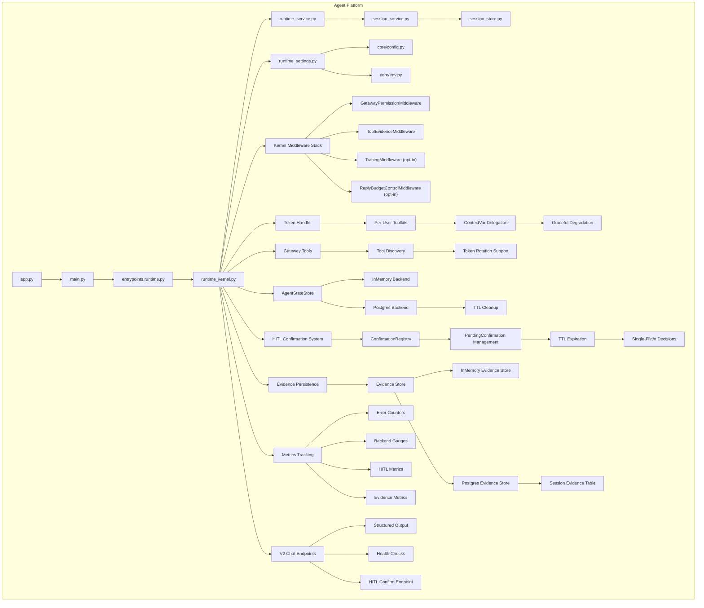
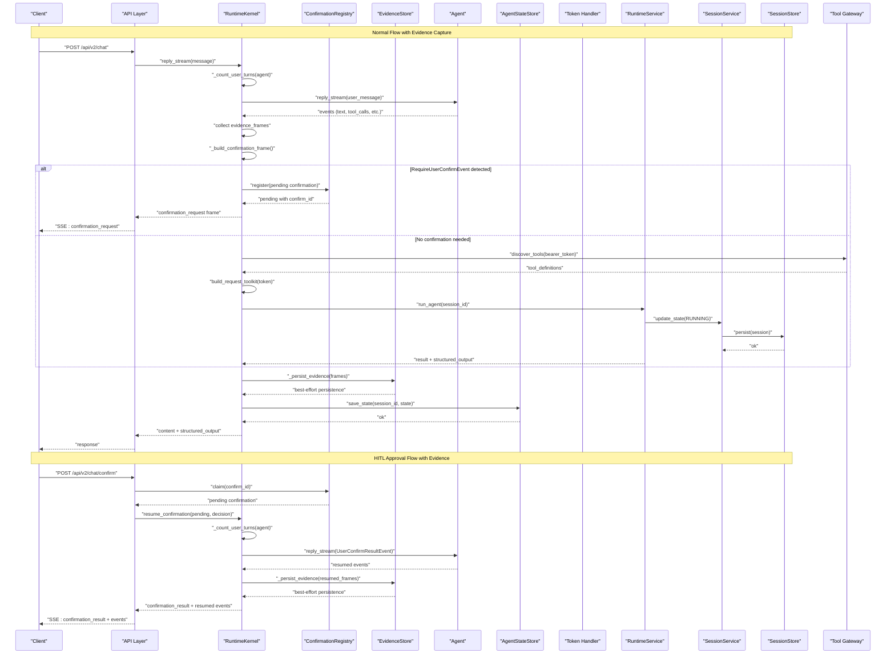
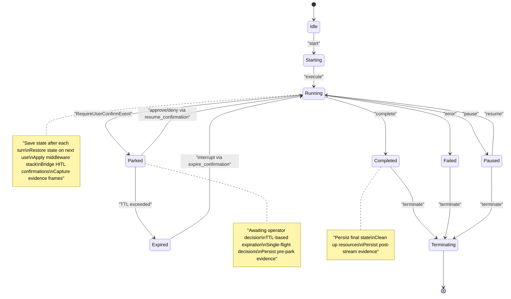
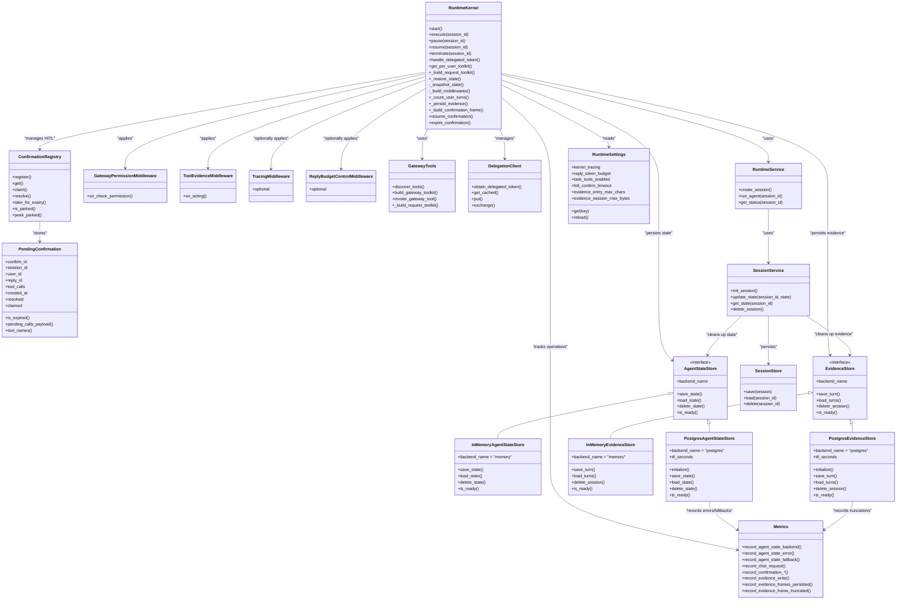

# Runtime Kernel and Agent Lifecycle

<cite>
**Referenced Files in This Document**
- [runtime_kernel.py](file://products/agent-platform/src/agent_service/runtime_kernel.py)
- [kernel_middleware.py](file://products/agent-platform/src/agent_service/services/kernel_middleware.py)
- [gateway_tools.py](file://products/agent-platform/src/agent_service/tools/gateway_tools.py)
- [runtime_settings.py](file://products/agent-platform/src/agent_service/runtime_settings.py)
- [delegation_client.py](file://products/platform-gateway/src/platform_gateway/services/delegation_client.py)
- [test_runtime_kernel.py](file://products/agent-platform/tests/test_runtime_kernel.py)
- [test_gateway_tools.py](file://products/agent-platform/tests/test_gateway_tools.py)
- [test_kernel_middleware.py](file://products/agent-platform/tests/test_kernel_middleware.py)
- [agent_state_store.py](file://products/agent-platform/src/agent_service/services/agent_state_store.py)
- [metrics.py](file://products/agent-platform/src/agent_service/core/metrics.py)
- [routes.py](file://products/agent-platform/src/agent_service/api/v2/routes.py)
- [v2.py](file://products/agent-platform/src/agent_service/schemas/v2.py)
- [session_service.py](file://products/agent-platform/src/agent_service/services/session_service.py)
- [hitl_confirmations.py](file://products/agent-platform/src/agent_service/services/hitl_confirmations.py)
- [test_hitl_confirmations.py](file://products/agent-platform/tests/test_hitl_confirmations.py)
- [evidence_store.py](file://products/agent-platform/src/agent_service/services/evidence_store.py)
</cite>

## Update Summary
**Changes Made**
- Added comprehensive evidence capture and persistence functionality for tool call and result evidence during streaming
- Implemented `_count_user_turns()` method for accurate turn index calculation based on user message count
- Implemented `_persist_evidence()` method for best-effort evidence frame persistence with size caps and budget enforcement
- Integrated evidence store with runtime kernel for capturing `tool_call` and `tool_result` frames during streaming
- Added evidence persistence hooks in both normal streaming flow and HITL confirmation resume flow
- Enhanced metrics tracking for evidence store operations including write success/failure rates
- Updated configuration to support evidence entry size limits and session storage budgets

## Table of Contents
1. [Introduction](#introduction)
2. [Project Structure](#project-structure)
3. [Core Components](#core-components)
4. [Architecture Overview](#architecture-overview)
5. [Detailed Component Analysis](#detailed-component-analysis)
6. [Dependency Analysis](#dependency-analysis)
7. [Performance Considerations](#performance-considerations)
8. [Troubleshooting Guide](#troubleshooting-guide)
9. [Conclusion](#conclusion)

## Introduction
This document explains the runtime kernel and agent lifecycle management within the agent platform. It covers how the execution engine initializes, manages agent states, processes runtime settings and environment variables, supports dynamic configuration updates, and handles errors, resource cleanup, and graceful shutdown. The system now includes sophisticated AgentScope 2.0.6 middleware integration with OpenTelemetry tracing, reply token budget control, enhanced toolkit management with contextvar-based token delegation, per-user toolkit closures, graceful degradation mechanisms, comprehensive state persistence capabilities, **newly added** Human-in-the-Loop (HITL) confirmation bridging that enables operator approval workflows for sensitive tool executions, and **newly added** comprehensive evidence capture and persistence functionality for tool call and result evidence during streaming operations. **Updated**: The runtime kernel now integrates with AgentScope 2.0.6 middleware system, supporting OpenTelemetry tracing via TracingMiddleware, reply budget control, enhanced toolkit management with contextvar-based token delegation, HITL confirmation bridging for human approval workflows, evidence capture and persistence for streaming tool calls, ensuring conversation durability across service restarts while maintaining robust operation even when authentication tokens are unavailable or state persistence fails.

## Project Structure
The runtime kernel and lifecycle are implemented primarily under the agent platform product. Key modules include:
- Runtime kernel: orchestrates agent lifecycle events and state transitions with enhanced token handling, state persistence, HITL confirmation bridging, and **newly added** evidence capture and persistence for streaming operations
- Middleware system: AgentScope 2.0.6 middleware stack with permission control, evidence emission, tracing, and budget management
- State persistence layer: pluggable AgentStateStore protocol with memory and Postgres backends supporting TTL-based cleanup
- Evidence persistence layer: dedicated evidence store with in-memory and Postgres backends for capturing tool call and result evidence during streaming
- HITL confirmation system: ConfirmationRegistry for managing pending confirmations with TTL expiration and single-flight decision processing
- Tool gateway integration: provides token-aware tool discovery and execution with rotation support using contextvar-based delegation
- Runtime settings: loads and validates configuration from files and environment variables, including HITL confirmation timeout settings and **newly added** evidence persistence configuration
- Services: runtime service for orchestration, session service for durable state, and session store for persistence
- Metrics and observability: comprehensive monitoring for agent state operations, system health, HITL confirmation metrics, and **newly added** evidence store performance metrics
- V2 API endpoints: structured output support, enhanced health checks reporting state store status, and HITL confirmation endpoints

**Diagram sources**
- [runtime_kernel.py](file://products/agent-platform/src/agent_service/runtime_kernel.py)
- [kernel_middleware.py](file://products/agent-platform/src/agent_service/services/kernel_middleware.py)
- [agent_state_store.py](file://products/agent-platform/src/agent_service/services/agent_state_store.py)
- [hitl_confirmations.py](file://products/agent-platform/src/agent_service/services/hitl_confirmations.py)
- [evidence_store.py](file://products/agent-platform/src/agent_service/services/evidence_store.py)
- [metrics.py](file://products/agent-platform/src/agent_service/core/metrics.py)
- [routes.py](file://products/agent-platform/src/agent_service/api/v2/routes.py)
- [session_service.py](file://products/agent-platform/src/agent_service/services/session_service.py)

**Section sources**
- [runtime_kernel.py](file://products/agent-platform/src/agent_service/runtime_kernel.py)
- [kernel_middleware.py](file://products/agent-platform/src/agent_service/services/kernel_middleware.py)
- [agent_state_store.py](file://products/agent-platform/src/agent_service/services/agent_state_store.py)
- [hitl_confirmations.py](file://products/agent-platform/src/agent_service/services/hitl_confirmations.py)
- [evidence_store.py](file://products/agent-platform/src/agent_service/services/evidence_store.py)
- [metrics.py](file://products/agent-platform/src/agent_service/core/metrics.py)

## Core Components
- Runtime Kernel: Central coordinator for agent lifecycle events (start, execute, pause, resume, terminate), maintaining per-agent state, coordinating with services, managing delegated token handling for secure tool execution, implementing state persistence through the AgentStateStore protocol, **newly added** HITL confirmation bridging for human approval workflows, and **newly added** evidence capture and persistence for streaming tool calls.
- AgentScope Middleware System: Sophisticated middleware stack including GatewayPermissionMiddleware for headless stream permission control, ToolEvidenceMiddleware for evidence frame emission, optional TracingMiddleware for OpenTelemetry tracing, and ReplyBudgetControlMiddleware for token budget management.
- **NEW** HITL Confirmation System: Complete Human-in-the-Loop confirmation framework with ConfirmationRegistry for managing pending confirmations, TTL-based expiration, single-flight decision processing, and seamless integration with AgentScope's RequireUserConfirmEvent handling.
- **NEW** Evidence Persistence System: Comprehensive evidence capture and persistence for tool call and result frames during streaming operations, with size caps, budget enforcement, and best-effort failure handling.
- AgentStateStore Protocol: Pluggable state persistence interface supporting multiple backends (in-memory and Postgres) with TTL-based cleanup and graceful degradation when backends fail.
- ContextVar-Based Token Delegation: Enhanced toolkit management using DELEGATED_TOKEN contextvar for per-request token scoping, enabling cached toolkits to work across portal token refresh.
- Gateway Tools Integration: Provides token-aware tool discovery and execution with support for dynamic token rotation during long-running sessions.
- Runtime Settings: Configuration loader that merges defaults, file-based settings, and environment variables; exposes typed accessors and supports reloads, including HITL confirmation timeout configuration and **newly added** evidence persistence settings.
- Environment and Config Utilities: Provide strongly-typed access to runtime settings and environment variables, with validation and fallbacks.
- Runtime Service: Orchestrates high-level operations such as creating sessions, invoking agents, and managing long-running tasks.
- Session Service and Store: Manage durable session state, including persistence and retrieval, ensuring consistency across restarts and coordinating with agent state cleanup.
- Token Handler: Manages delegated token lifecycle and validation for secure tool execution with rotation support.
- Per-User Toolkits: Provides isolated tool execution contexts based on user identity and permissions with token rotation awareness.
- Graceful Degradation: Ensures system continues operating with limited functionality when authentication tokens are unavailable or state persistence fails.
- Metrics and Observability: Comprehensive monitoring for agent state operations, backend selection, error rates, system health indicators, **newly added** HITL confirmation metrics, and **newly added** evidence store performance metrics.

Key responsibilities:
- Initialization: Load settings, validate environment, create dependencies, boot services, initialize token handlers, configure state persistence backends, set up middleware stack, **newly added** initialize HITL confirmation registry, and **newly added** configure evidence persistence.
- Lifecycle Management: Handle agent state transitions and event-driven execution with token-aware tool execution, rotation support, persistent state management, middleware processing, **newly added** HITL confirmation bridging for human approval workflows, and **newly added** evidence capture during streaming operations.
- Configuration: Support dynamic updates without restarting the process where feasible, including middleware composition based on settings, HITL confirmation timeout configuration, and **newly added** evidence persistence settings.
- Error Handling: Robust error propagation, retries, safe cleanup, graceful degradation when tokens are missing, rotated, or state persistence fails, **newly added** proper handling of expired confirmations and owner mismatches, and **newly added** best-effort evidence persistence failures.
- Performance: Concurrency control, resource pooling, efficient memory usage, optimized token validation with rotation handling, efficient state persistence with TTL cleanup, **newly added** efficient evidence capture with minimal overhead, and **newly added** evidence size caps and budget enforcement.
- State Persistence: Save and restore agent conversation state across service restarts using pluggable backends with automatic TTL-based cleanup.
- **NEW** HITL Confirmation Processing: Detect RequireUserConfirmEvent from AgentScope, park active replies, emit confirmation_request frames, manage confirmation lifecycle with TTL expiration, and resume parked replies with operator decisions.
- **NEW** Evidence Capture and Persistence: Capture tool_call and tool_result frames during streaming operations, apply size caps and budget enforcement, persist evidence best-effort without affecting turn completion, and provide replay capability for session evidence.

**Section sources**
- [runtime_kernel.py](file://products/agent-platform/src/agent_service/runtime_kernel.py)
- [kernel_middleware.py](file://products/agent-platform/src/agent_service/services/kernel_middleware.py)
- [agent_state_store.py](file://products/agent-platform/src/agent_service/services/agent_state_store.py)
- [hitl_confirmations.py](file://products/agent-platform/src/agent_service/services/hitl_confirmations.py)
- [evidence_store.py](file://products/agent-platform/src/agent_service/services/evidence_store.py)
- [metrics.py](file://products/agent-platform/src/agent_service/core/metrics.py)

## Architecture Overview
The runtime architecture centers around a kernel that coordinates lifecycle events through services and persists state via sessions with enhanced state persistence capabilities. Configuration is loaded at startup and can be refreshed dynamically. The enhanced architecture now includes AgentScope 2.0.6 middleware integration for OpenTelemetry tracing and reply budget control, contextvar-based token delegation for secure tool execution, comprehensive state persistence through the AgentStateStore protocol, TTL-based cleanup mechanisms, structured output support for v2 chat endpoints, **newly added** complete HITL confirmation bridging that enables human approval workflows for sensitive tool executions, and **newly added** comprehensive evidence capture and persistence for streaming tool calls.

**Diagram sources**
- [runtime_kernel.py](file://products/agent-platform/src/agent_service/runtime_kernel.py)
- [kernel_middleware.py](file://products/agent-platform/src/agent_service/services/kernel_middleware.py)
- [agent_state_store.py](file://products/agent-platform/src/agent_service/services/agent_state_store.py)
- [hitl_confirmations.py](file://products/agent-platform/src/agent_service/services/hitl_confirmations.py)
- [evidence_store.py](file://products/agent-platform/src/agent_service/services/evidence_store.py)
- [routes.py](file://products/agent-platform/src/agent_service/api/v2/routes.py)
- [session_service.py](file://products/agent-platform/src/agent_service/services/session_service.py)

## Detailed Component Analysis

### Runtime Kernel with State Persistence, Middleware Integration, HITL Confirmation Bridging, and Evidence Capture
The runtime kernel manages agent lifecycle events and enforces state transitions with comprehensive state persistence capabilities, AgentScope 2.0.6 middleware integration, **newly added** complete HITL confirmation bridging for human approval workflows, and **newly added** comprehensive evidence capture and persistence for streaming tool calls. It coordinates with the runtime service to perform work, uses the session service to persist state changes, integrates with the AgentStateStore protocol for conversation durability, includes enhanced delegated token handling for secure tool execution with rotation support, applies a sophisticated middleware stack for permission control, evidence emission, tracing, and budget management, **newly added** seamlessly bridges AgentScope's RequireUserConfirmEvent into operator approval workflows, and **newly added** captures and persists tool call and result evidence during streaming operations.

Lifecycle events and typical transitions:
- Start: Initialize resources, load settings, prepare context, set up token handlers, configure state persistence backends, build middleware stack, **newly added** initialize HITL confirmation registry, and **newly added** configure evidence persistence.
- Execute: Transition to running, validate delegated tokens, restore persisted state, invoke agent logic with per-user toolkits, apply middleware chain, handle results or errors, save state after completion, **newly added** capture evidence frames during streaming, and **newly added** detect and bridge RequireUserConfirmEvent for human approval.
- Pause: Suspend execution, save checkpoint, transition to paused.
- Resume: Restore checkpoint, re-validate tokens if needed, transition back to running.
- Terminate: Clean up resources, finalize state, revoke tokens, delete persisted state, transition to terminated.

Enhanced state persistence features:
- Pluggable AgentStateStore protocol supporting multiple backends (memory, Postgres)
- Automatic state restoration on agent construction for conversation continuity
- TTL-based cleanup of stale agent states with configurable expiration
- Graceful degradation when state persistence fails without affecting core functionality
- Structured output support through response_schema parameter in v2 chat endpoints
- Comprehensive metrics tracking for state operations, errors, and backend selection
- Health check endpoints reporting state store status and readiness

**Updated** AgentScope 2.0.6 middleware integration:
- **TracingMiddleware**: Optional OpenTelemetry tracing for kernel operations when AGENTSCOPE_KERNEL_TRACING is enabled
- **ReplyBudgetControlMiddleware**: Token budget control to prevent runaway turns with configurable weighted budgets
- **GatewayPermissionMiddleware**: Pre-answers permission gate for headless streams with vetted allow-list
- **ToolEvidenceMiddleware**: Emits tool_call/tool_result evidence frames for streamed turns
- Contextvar-based token delegation via DELEGATED_TOKEN for per-request token scoping
- Settings-driven middleware composition with opt-in features

**NEW** HITL Confirmation Bridging:
- **_build_confirmation_frame()**: Detects RequireUserConfirmEvent from AgentScope, registers pending confirmation in ConfirmationRegistry, builds confirmation_request frame, and ends stream without message_end
- **resume_confirmation()**: Resumes parked reply with operator decision, creates UserConfirmResultEvent, streams resumed events, handles nested confirmations, and cleans up registry entries
- **expire_confirmation()**: Handles TTL-expired confirmations by sending UserInterruptEvent to parked reply and resolving registry entry
- **ConfirmationRegistry**: Process-wide singleton managing pending confirmations with TTL expiration, single-flight decision processing, and ownership validation
- Seamless integration with existing streaming infrastructure, preserving all middleware benefits including evidence emission and tracing
- Configurable via AGENT_HITL_CONFIRM_TIMEOUT environment variable (default 600 seconds)

**NEW** Evidence Capture and Persistence:
- **_count_user_turns()**: Calculates the current user message count in the agent context to determine the correct turn index for evidence persistence, ensuring stable indexing across HITL park/resume operations
- **_persist_evidence()**: Best-effort persistence of evidence frames with size caps and budget enforcement, never raising exceptions to avoid affecting turn completion
- Evidence frame collection during streaming: Captures `tool_call` and `tool_result` frames from the ToolEvidenceMiddleware sink during both normal streaming and HITL confirmation resume flows
- Size cap enforcement: Applies per-entry character limits to prevent oversized payloads, with truncation markers for exceeded content
- Budget enforcement: Enforces per-session storage budgets by evicting oldest result payloads when limits are exceeded
- Best-effort failure handling: Evidence persistence failures are logged but never affect the main streaming flow
- Metrics tracking: Records evidence store write success/failure rates and frame counts for operational visibility

Key behaviors:
- Event-driven transitions with guards to prevent invalid state changes.
- Integration with session persistence and agent state store for comprehensive durability.
- Error handling that captures exceptions, logs context, marks sessions appropriately, and implements graceful degradation when state persistence fails.
- Resource cleanup on termination to avoid leaks, including token revocation and state deletion.
- Token-aware execution that falls back to limited functionality when authentication fails.
- State restoration from persistent storage to maintain conversation continuity across service restarts.
- **Updated**: Structured output support through response_schema parameter enabling validated structured responses in v2 chat endpoints.
- **Updated**: TTL-based cleanup preventing accumulation of stale agent states with automatic sweep operations.
- **Updated**: Middleware stack application with permission control, evidence emission, optional tracing, and budget management.
- **NEW**: HITL confirmation bridging that seamlessly integrates with existing streaming infrastructure, providing operator approval workflows for sensitive tool executions while maintaining all existing functionality.
- **NEW**: Evidence capture and persistence that tracks tool call and result frames during streaming operations with size caps, budget enforcement, and best-effort failure handling.

**Section sources**
- [runtime_kernel.py:422-472](file://products/agent-platform/src/agent_service/runtime_kernel.py#L422-L472)
- [runtime_kernel.py:688-769](file://products/agent-platform/src/agent_service/runtime_kernel.py#L688-L769)
- [runtime_kernel.py:889-953](file://products/agent-platform/src/agent_service/runtime_kernel.py#L889-L953)
- [kernel_middleware.py](file://products/agent-platform/src/agent_service/services/kernel_middleware.py)
- [hitl_confirmations.py](file://products/agent-platform/src/agent_service/services/hitl_confirmations.py)
- [test_runtime_kernel.py](file://products/agent-platform/tests/test_runtime_kernel.py)

### AgentScope Middleware System
The AgentScope 2.0.6 middleware system provides a sophisticated stack of cross-cutting concerns for the runtime kernel. The middleware composition is settings-driven and includes both required and optional components.

**Updated** Middleware components:
- **GatewayPermissionMiddleware**: Pre-answers AgentScope's permission gate for headless streams by auto-approving vetted read-only tools and task tools, preventing stalls in SSE environments
- **ToolEvidenceMiddleware**: Emits tool_call and tool_result evidence frames for streamed turns, capturing gateway results and metadata for audit trails and evidence persistence
- **TracingMiddleware**: Optional OpenTelemetry tracing middleware that creates spans for kernel operations when AGENTSCOPE_KERNEL_TRACING is enabled
- **ReplyBudgetControlMiddleware**: Optional token budget control middleware that prevents runaway turns by enforcing weighted token budgets

Key features:
- **Updated**: Settings-driven middleware composition with opt-in features
- **Updated**: Contextvar-based request scoping for evidence sinks and token delegation
- **Updated**: Safe short-circuiting when optional features are not configured
- **Updated**: Comprehensive evidence emission with data summary truncation
- **Updated**: Permission pre-approval for vetted tools in headless environments
- **Updated**: Token budget enforcement with configurable input/output weights

Implementation details:
- `_build_middlewares()`: Composes the middleware stack based on runtime settings
- `TOOL_EVIDENCE_SINK`: Request-scoped contextvar for evidence frame collection
- `DELEGATED_TOKEN`: Contextvar for per-request token scoping in tool closures
- Auto-allow list configuration via AGENT_GATEWAY_TOOL_AUTO_ALLOW environment variable
- Data summary truncation to prevent oversized evidence payloads

**Section sources**
- [kernel_middleware.py](file://products/agent-platform/src/agent_service/services/kernel_middleware.py)
- [test_kernel_middleware.py](file://products/agent-platform/tests/test_kernel_middleware.py)

### HITL Confirmation System
The **newly added** HITL (Human-in-the-Loop) confirmation system provides complete operator approval workflows for sensitive tool executions. When AgentScope emits a RequireUserConfirmEvent, the system parks the active reply, surfaces a confirmation_request frame to the client, and waits for operator approval before resuming execution.

Key features:
- **NEW** ConfirmationRegistry: Process-wide singleton managing pending confirmations with TTL expiration, single-flight decision processing, and ownership validation
- **NEW** PendingConfirmation: Data structure holding confirmation metadata, tool calls, timestamps, and state flags
- **NEW** _build_confirmation_frame(): Detects RequireUserConfirmEvent, registers pending confirmation, builds confirmation_request frame, and ends stream without message_end
- **NEW** resume_confirmation(): Resumes parked reply with operator decision, creates UserConfirmResultEvent, streams resumed events, and handles nested confirmations
- **NEW** expire_confirmation(): Handles TTL-expired confirmations by sending UserInterruptEvent to parked reply and resolving registry entry
- **NEW** Single-flight decision processing: Prevents duplicate confirmations and ensures atomic decision processing
- **NEW** TTL-based expiration: Configurable timeout (AGENT_HITL_CONFIRM_TIMEOUT) with automatic cleanup
- **NEW** Ownership validation: Ensures only session owners can approve their own confirmations
- **NEW** Seamless integration: Works with existing middleware stack, evidence emission, and tracing

Implementation details:
- `register()`: Creates PendingConfirmation with unique confirm_id, stores tool calls, sets creation timestamp
- `claim()`: Atomically claims confirmation for decision processing, prevents duplicate approvals
- `get()`: Retrieves unclaimed, unresolved confirmation with TTL validation
- `resolve()`: Marks confirmation as resolved and removes from registry
- `take_for_expiry()`: Claims confirmation for expiry processing, prevents racing with decision processing
- `is_parked()`: Checks if session has unresolved confirmation
- `peek_parked()`: Returns unresolved confirmation regardless of TTL for health checks
- `pending_calls_payload()`: Serializes tool calls for confirmation_request frames
- `tool_names()`: Extracts tool names for logging and UI display

**Section sources**
- [hitl_confirmations.py](file://products/agent-platform/src/agent_service/services/hitl_confirmations.py)
- [test_hitl_confirmations.py](file://products/agent-platform/tests/test_hitl_confirmations.py)

### Evidence Capture and Persistence System
The **newly added** evidence capture and persistence system provides comprehensive tracking of tool call and result frames during streaming operations. This system ensures that evidence is captured consistently across both normal streaming flows and HITL confirmation resume flows, with robust size management and best-effort persistence.

Key features:
- **NEW** Turn Index Calculation: `_count_user_turns()` method calculates the current user message count to determine the correct turn index for evidence persistence, ensuring stable indexing across HITL park/resume operations
- **NEW** Evidence Frame Collection: Captures `tool_call` and `tool_result` frames from the ToolEvidenceMiddleware sink during streaming operations
- **NEW** Best-Effort Persistence: `_persist_evidence()` method persists evidence frames with size caps and budget enforcement, never raising exceptions to avoid affecting turn completion
- **NEW** Size Cap Enforcement: Applies per-entry character limits to prevent oversized payloads, with truncation markers for exceeded content
- **NEW** Budget Enforcement: Enforces per-session storage budgets by evicting oldest result payloads when limits are exceeded
- **NEW** Metrics Tracking: Records evidence store write success/failure rates and frame counts for operational visibility
- **NEW** Integration Points: Evidence capture occurs in both normal streaming flow and HITL confirmation resume flow

Implementation details:
- `_count_user_turns()`: Counts user messages in agent context to determine stable turn index, with defensive fallback to zero on errors
- `_persist_evidence()`: Prepares frames with size caps, persists via EVIDENCE_STORE.save_turn(), records metrics, and handles failures gracefully
- Evidence frame collection: Uses asyncio.Queue to collect frames from TOOL_EVIDENCE_SINK during streaming, filtering for EVIDENCE_FRAME_TYPES
- Size cap application: Uses `prepare_frames()` function to truncate oversized payloads and add truncation markers
- Budget enforcement: Leverages evidence store's built-in budget enforcement to evict oldest payloads when session exceeds limits
- Metrics recording: Uses `record_evidence_write()` for success/failure tracking and evidence store metrics for frame counts

**Section sources**
- [runtime_kernel.py:422-472](file://products/agent-platform/src/agent_service/runtime_kernel.py#L422-L472)
- [runtime_kernel.py:688-769](file://products/agent-platform/src/agent_service/runtime_kernel.py#L688-L769)
- [runtime_kernel.py:889-953](file://products/agent-platform/src/agent_service/runtime_kernel.py#L889-L953)
- [evidence_store.py](file://products/agent-platform/src/agent_service/services/evidence_store.py)
- [metrics.py](file://products/agent-platform/src/agent_service/core/metrics.py)

### ContextVar-Based Token Delegation
The enhanced toolkit management uses contextvars for per-request token scoping, enabling cached toolkits to work seamlessly across portal token refresh scenarios.

**Updated** Token delegation features:
- **DELEGATED_TOKEN ContextVar**: Request-scoped token storage that tool closures read at call time
- **Cached Toolkit Strategy**: Toolkits are cached per delegated token but closures always read current token from contextvar
- **Graceful Degradation**: Empty discovery results are intentionally not cached to allow retry on subsequent turns
- **Per-User Isolation**: Each user's toolkit is built with their specific delegated token

Implementation details:
- `_ensure_toolkit()`: Builds and caches toolkits per bearer token with concurrent access protection
- `_build_request_toolkit()`: Creates per-request toolkit instances with current token from contextvar
- `DELEGATED_TOKEN.set()` and `.reset()`: Properly scopes tokens around agent execution
- Contextvar reset in finally blocks ensures proper cleanup even on errors

**Section sources**
- [runtime_kernel.py](file://products/agent-platform/src/agent_service/runtime_kernel.py)
- [gateway_tools.py](file://products/agent-platform/src/agent_service/tools/gateway_tools.py)

### AgentStateStore Protocol and Backends
The AgentStateStore protocol provides a pluggable interface for agent state persistence with two built-in backends: in-memory for development/testing and Postgres for production deployments. The implementation includes comprehensive TTL-based cleanup, metrics tracking, and graceful degradation capabilities.

Key features:
- **Updated**: Pluggable protocol design supporting multiple storage backends
- **Updated**: In-memory backend for development and CI environments with simple key-value storage
- **Updated**: Postgres backend with production-grade durability, connection management, and SQL optimization
- **Updated**: TTL-based cleanup mechanism automatically removing stale agent states beyond configured expiration
- **Updated**: Comprehensive metrics tracking for state operations, errors, and backend selection
- **Updated**: Graceful degradation falling back to in-memory storage when Postgres is unavailable
- **Updated**: Health checking capabilities for monitoring backend availability

Implementation details:
- `save_state()`: Persists agent state JSON with automatic TTL refresh on writes
- `load_state()`: Restores agent state with TTL refresh on reads to keep active sessions alive
- `delete_state()`: Removes agent state when sessions are deleted
- `is_ready()`: Health check endpoint for monitoring backend availability
- TTL cleanup: Background sweep operations remove expired states efficiently
- Metrics integration: Tracks errors, fallbacks, and active backend selection

**Section sources**
- [agent_state_store.py](file://products/agent-platform/src/agent_service/services/agent_state_store.py)
- [test_agent_state_store.py](file://products/agent-platform/tests/test_agent_state_store.py)

### V2 Chat Endpoints with Structured Output, HITL Confirmation, and Evidence Access
The v2 chat endpoints provide enhanced functionality including structured output support, comprehensive health checks, improved error handling, **newly added** HITL confirmation endpoints, and **newly added** evidence access capabilities. These endpoints integrate with the state persistence layer and provide better observability into system health.

Key features:
- **Updated**: Structured output support through response_schema parameter enabling validated structured responses
- **Updated**: Enhanced health check endpoints reporting agent state store status and readiness
- **Updated**: Improved error handling with detailed status information
- **Updated**: Better integration with state persistence layer for conversation durability
- **Updated**: Comprehensive metrics tracking for chat requests and state operations
- **NEW**: HITL confirmation endpoint (`/api/v2/chat/confirm`) for operator approval workflows
- **NEW**: Confirmation request/response frame types in streaming protocol
- **NEW**: TTL-based expiration handling with proper HTTP status codes (410 Gone)
- **NEW**: Owner validation ensuring only session owners can approve confirmations
- **NEW**: Evidence access endpoint for retrieving persisted tool call and result evidence

Implementation details:
- `chat()`: Handles blocking chat requests with optional structured output validation
- `chat_stream()`: Provides streaming responses with normalized event formats and evidence capture
- `health()`: Reports system health including agent state store backend status and readiness
- `create_session()` and `read_session()`: Session management with state persistence integration
- `chat_confirm()`: **NEW** Handles operator approval requests, validates ownership, resumes parked replies
- Structured output: Validates and returns structured data when response_schema is provided
- **NEW** Confirmation flow: Registers pending confirmations, handles TTL expiration, resumes with decisions
- **NEW** Evidence flow: Loads persisted evidence groups for session replay and audit trails

**Section sources**
- [routes.py](file://products/agent-platform/src/agent_service/api/v2/routes.py)
- [v2.py](file://products/agent-platform/src/agent_service/schemas/v2.py)

### Runtime Settings and Configuration
The runtime settings system has been enhanced with new configuration options for AgentScope 2.0.6 middleware integration, reply budget control, **newly added** HITL confirmation bridging, and **newly added** evidence persistence configuration.

**Updated** Configuration options:
- **AGENTSCOPE_KERNEL_TRACING**: Boolean flag to enable OpenTelemetry tracing via TracingMiddleware
- **AGENTSCOPE_REPLY_TOKEN_BUDGET**: Float value for token budget control via ReplyBudgetControlMiddleware
- **AGENTSCOPE_REPLY_INPUT_TOKEN_WEIGHT**: Float weight for input token cost calculation
- **AGENTSCOPE_REPLY_OUTPUT_TOKEN_WEIGHT**: Float weight for output token cost calculation
- **AGENTSCOPE_TASK_TOOLS_ENABLED**: Boolean flag to enable built-in task tools (TaskCreate, TaskGet, etc.)
- **NEW** **AGENT_HITL_CONFIRM_TIMEOUT**: Integer seconds for HITL confirmation expiration timeout (default 600)
- **NEW** **AGENT_EVIDENCE_ENTRY_MAX_CHARS**: Integer characters for per-entry evidence payload limit (default 131072)
- **NEW** **AGENT_EVIDENCE_SESSION_MAX_BYTES**: Integer bytes for per-session evidence storage budget (default 4194304)

Key features:
- **Updated**: Settings-driven middleware composition with opt-in features
- **Updated**: Validation for budget and weight parameters with clear error messages
- **Updated**: Environment variable parsing with proper type conversion
- **Updated**: Default values that maintain backward compatibility
- **Updated**: Timezone validation with IANA timezone support
- **NEW**: HITL confirmation timeout validation with negative value rejection
- **NEW**: Environment variable parsing for AGENT_HITL_CONFIRM_TIMEOUT with default 600 seconds
- **NEW**: Evidence persistence configuration with sensible defaults and validation

Implementation details:
- `__post_init__()`: Validates all settings including new middleware-related configurations, HITL timeout, and evidence settings
- `from_env()`: Parses environment variables with proper type conversion and defaults
- Provider-specific options with validation and type safety
- Graceful fallbacks for optional features when not configured
- **NEW**: HITL confirmation timeout validation ensuring non-negative integer values
- **NEW**: Evidence persistence settings with appropriate defaults for development and production environments

**Section sources**
- [runtime_settings.py:145-150](file://products/agent-platform/src/agent_service/runtime_settings.py#L145-L150)
- [runtime_settings.py:332-338](file://products/agent-platform/src/agent_service/runtime_settings.py#L332-L338)

### Metrics and Observability
Comprehensive metrics tracking provides visibility into agent state operations, backend selection, error rates, system health, **newly added** HITL confirmation metrics, and **newly added** evidence store performance metrics. The metrics system follows established conventions and provides both counters and gauges for different types of observations.

Key features:
- **Updated**: Agent state store metrics including backend selection, operation errors, and fallback counts
- **Updated**: Session store metrics for cross-reference with agent state operations
- **Updated**: HTTP request metrics for API performance monitoring
- **Updated**: Chat request counting for usage analytics
- **Updated**: Prometheus-compatible metrics format for easy integration with monitoring systems
- **NEW**: HITL confirmation metrics including registration, resolution, expiration, and owner mismatch counts
- **NEW**: Confirmation registry size monitoring for operational insights
- **NEW**: Confirmation approval/denial rate tracking for workflow analysis
- **NEW**: Evidence store metrics including write success/failure rates, frame counts, and truncation reasons

Implementation details:
- `record_agent_state_backend()`: Tracks active backend selection (memory vs postgres)
- `record_agent_state_error()`: Counts failed state operations by operation type
- `record_agent_state_fallback()`: Counts instances where system fell back to in-memory storage
- `record_chat_request()`: Counts chat requests for usage analytics
- `setup_metrics()`: Configures Prometheus middleware and /metrics endpoint
- **NEW**: HITL confirmation metric recording for confirmation lifecycle events
- **NEW**: Confirmation registry monitoring for operational visibility
- **NEW**: Evidence store metrics including `record_evidence_write()`, `record_evidence_frames_persisted()`, and `record_evidence_frame_truncated()`

**Section sources**
- [metrics.py:158-186](file://products/agent-platform/src/agent_service/core/metrics.py#L158-L186)

### Session Service Integration
The session service coordinates between session management and agent state persistence, ensuring consistent cleanup when sessions are deleted and providing proper ownership validation.

Key features:
- **Updated**: Integration with AgentStateStore for coordinated state cleanup
- **Updated**: Proper error handling when state deletion fails without affecting session deletion
- **Updated**: Ownership validation ensuring users can only access their own sessions
- **Updated**: Idempotent session creation for dedicated sessions
- **NEW**: Integration with HITL confirmation system for parked session detection and cleanup
- **NEW**: Confirmation expiration handling during session operations
- **NEW**: Integration with evidence store for session cleanup

Implementation details:
- `delete_session()`: Deletes both session and associated agent state with fail-open behavior
- `ensure_session()`: Creates or retrieves sessions with proper ownership validation
- `create_named_session()`: Supports dedicated sessions for incident triage scenarios
- State cleanup: Automatically removes agent state when sessions are deleted
- **NEW**: Confirmation registry integration for parked session management
- **NEW**: Evidence store integration for deleting session evidence when sessions are removed

**Section sources**
- [session_service.py](file://products/agent-platform/src/agent_service/services/session_service.py)

## Dependency Analysis
The runtime kernel depends on configuration, services, persistence layers, token handling components, and the new state persistence infrastructure. The following diagram shows key relationships including the enhanced state persistence architecture with TTL cleanup, metrics tracking, AgentScope 2.0.6 middleware integration, **newly added** complete HITL confirmation bridging, and **newly added** comprehensive evidence capture and persistence:

**Diagram sources**
- [runtime_kernel.py](file://products/agent-platform/src/agent_service/runtime_kernel.py)
- [kernel_middleware.py](file://products/agent-platform/src/agent_service/services/kernel_middleware.py)
- [agent_state_store.py](file://products/agent-platform/src/agent_service/services/agent_state_store.py)
- [hitl_confirmations.py](file://products/agent-platform/src/agent_service/services/hitl_confirmations.py)
- [evidence_store.py](file://products/agent-platform/src/agent_service/services/evidence_store.py)
- [metrics.py](file://products/agent-platform/src/agent_service/core/metrics.py)
- [session_service.py](file://products/agent-platform/src/agent_service/services/session_service.py)

**Section sources**
- [runtime_kernel.py](file://products/agent-platform/src/agent_service/runtime_kernel.py)
- [kernel_middleware.py](file://products/agent-platform/src/agent_service/services/kernel_middleware.py)
- [agent_state_store.py](file://products/agent-platform/src/agent_service/services/agent_state_store.py)
- [hitl_confirmations.py](file://products/agent-platform/src/agent_service/services/hitl_confirmations.py)
- [evidence_store.py](file://products/agent-platform/src/agent_service/services/evidence_store.py)
- [metrics.py](file://products/agent-platform/src/agent_service/core/metrics.py)
- [session_service.py](file://products/agent-platform/src/agent_service/services/session_service.py)

## Performance Considerations
- Concurrency Control: Use bounded worker pools for agent execution to prevent resource exhaustion.
- Memory Management: Avoid holding large payloads in memory; stream data where possible and release references promptly.
- Persistence Efficiency: Batch writes to session store and use optimistic locking to reduce contention.
- Configuration Reload: Perform atomic swaps of settings to minimize downtime and avoid partial reads.
- Token Validation Optimization: Cache validated tokens and implement efficient lookup mechanisms.
- **Updated**: State Persistence Optimization: Implement efficient state restoration and saving with minimal overhead, using TTL-based cleanup to prevent storage bloat.
- **Updated**: TTL-Based Cleanup: Automatic sweep operations remove stale agent states efficiently without impacting active sessions.
- **Updated**: Metrics Collection: Lightweight metrics recording with minimal performance impact for operational visibility.
- **Updated**: Structured Output Processing: Efficient schema validation and serialization for structured responses without blocking operations.
- **Updated**: Middleware Performance: Opt-in middleware components (TracingMiddleware, ReplyBudgetControlMiddleware) have minimal overhead when disabled.
- **Updated**: ContextVar Usage: Efficient per-request token scoping with minimal overhead compared to traditional threading approaches.
- **NEW**: HITL Confirmation Performance: Efficient confirmation registry operations with O(1) lookups, single-flight decision processing to prevent race conditions, and minimal memory footprint for pending confirmations.
- **NEW**: Confirmation TTL Management: Efficient TTL-based expiration checking with monotonic time comparisons and lazy cleanup.
- **NEW**: Streaming Integration: Minimal overhead for confirmation bridging with early exit when no RequireUserConfirmEvent is detected.
- **NEW**: Evidence Capture Performance: Efficient frame collection using asyncio.Queue with minimal overhead, selective filtering for evidence frame types, and best-effort persistence that doesn't block streaming.
- **NEW**: Evidence Size Management: Intelligent truncation of oversized payloads with minimal processing overhead, and efficient budget enforcement through targeted eviction of oldest payloads.
- **NEW**: Evidence Store Selection: Shared backend configuration with agent state store reduces database connections and improves resource utilization.
- Graceful Degradation: Minimize performance impact when falling back to empty Toolkit or in-memory state storage by using lazy initialization and caching.
- Observability: Emit metrics and traces for lifecycle events, latency, error rates, token validation performance, state persistence operations, **newly added** HITL confirmation workflow performance, and **newly added** evidence store performance metrics.

## Troubleshooting Guide
Common issues and strategies:
- Invalid State Transitions: Ensure guards prevent illegal transitions; log detailed context when blocked.
- Configuration Errors: Validate required environment variables and config keys early; surface clear messages.
- Session Persistence Failures: Retry with backoff, mark sessions as failed, and alert operators.
- Graceful Shutdown: Drain in-flight requests, flush pending writes, and close connections cleanly.
- Resource Leaks: Track open handles and enforce timeouts; implement finalizers to guarantee cleanup.
- Token Validation Failures: Implement proper error handling, logging, and fallback mechanisms.
- **Updated**: State Persistence Issues: Monitor agent state store health, track error rates, and verify TTL cleanup operations are functioning correctly.
- **Updated**: Backend Selection Problems: Check environment variables for correct backend configuration and verify database connectivity for Postgres backend.
- **Updated**: TTL Cleanup Issues: Monitor sweep operations and verify stale states are being cleaned up according to configured TTL values.
- **Updated**: Structured Output Validation: Verify response schemas are valid and debug validation failures when structured output is requested.
- **Updated**: Metrics Collection: Monitor agent_state_errors_total, agent_state_fallbacks_total, and agent_state_backend metrics for operational insights.
- **Updated**: Middleware Configuration: Verify AGENTSCOPE_KERNEL_TRACING and budget settings are properly configured for desired middleware behavior.
- **Updated**: ContextVar Issues: Ensure DELEGATED_TOKEN is properly set and reset around agent execution to prevent token leakage.
- **NEW**: HITL Confirmation Issues: Monitor confirmation registry size, track expiration rates, and verify owner validation is working correctly.
- **NEW**: Confirmation Timeout Issues: Verify AGENT_HITL_CONFIRM_TIMEOUT is set appropriately for your workflow requirements.
- **NEW**: Owner Mismatch Errors: Check that confirmation requests are made by the same user who owns the session.
- **NEW**: Duplicate Confirmation Prevention: Ensure clients don't send duplicate confirmation requests due to network retries.
- **NEW**: Evidence Capture Issues: Monitor evidence store write success rates and investigate any persistence failures that may affect replay capability.
- **NEW**: Evidence Size Issues: Verify evidence_entry_max_chars and evidence_session_max_bytes settings are appropriate for your workload patterns.
- **NEW**: Evidence Budget Exhaustion: Monitor evidence store truncation metrics and adjust session budgets if evidence is being evicted too aggressively.
- Graceful Degradation Issues: Monitor system behavior when tokens are unavailable or state persistence fails and ensure limited functionality continues.

Operational checks:
- Health endpoints to verify readiness and liveness including agent state store status.
- Metrics dashboards for throughput, latency, error rates, token validation success rates, and state persistence operations.
- Logs correlation using request IDs and session IDs.
- Token validation failure tracking and alerting.
- **Updated**: State persistence monitoring: Track agent state store backend selection, error rates, and fallback occurrences.
- **Updated**: TTL cleanup verification: Monitor sweep operations and verify storage growth is controlled by TTL expiration.
- **Updated**: Structured output debugging: Log schema validation errors and response formatting issues for troubleshooting.
- **Updated**: Middleware monitoring: Track middleware composition and verify optional features are working as expected.
- **NEW**: HITL confirmation monitoring: Track confirmation registration, resolution, expiration, and owner mismatch rates.
- **NEW**: Confirmation registry health: Monitor registry size and ensure timely cleanup of resolved confirmations.
- **NEW**: Workflow analysis: Track approval/denial rates and average confirmation duration for operational insights.
- **NEW**: Evidence store monitoring: Track evidence write success/failure rates, frame counts, and truncation events for operational visibility.
- **NEW**: Evidence replay verification: Verify that persisted evidence matches live streaming output for session replay scenarios.
- **NEW**: Storage growth monitoring: Monitor evidence store storage usage and adjust budgets as needed to prevent excessive growth.

**Section sources**
- [runtime_kernel.py](file://products/agent-platform/src/agent_service/runtime_kernel.py)
- [kernel_middleware.py](file://products/agent-platform/src/agent_service/services/kernel_middleware.py)
- [agent_state_store.py](file://products/agent-platform/src/agent_service/services/agent_state_store.py)
- [hitl_confirmations.py](file://products/agent-platform/src/agent_service/services/hitl_confirmations.py)
- [evidence_store.py](file://products/agent-platform/src/agent_service/services/evidence_store.py)
- [metrics.py](file://products/agent-platform/src/agent_service/core/metrics.py)
- [routes.py](file://products/agent-platform/src/agent_service/api/v2/routes.py)

## Conclusion
The runtime kernel and agent lifecycle management provide a robust foundation for executing agents with durable state, configurable behavior, resilient operations, enhanced security through delegated token handling with rotation support, comprehensive state persistence capabilities, sophisticated AgentScope 2.0.6 middleware integration, **newly added** complete Human-in-the-Loop (HITL) confirmation bridging for operator approval workflows, and **newly added** comprehensive evidence capture and persistence for streaming tool calls. By combining clear state transitions, strong configuration management, careful resource handling, sophisticated token management with graceful degradation, advanced state persistence through the AgentStateStore protocol, comprehensive middleware stack with OpenTelemetry tracing and reply budget control, **newly added** seamless HITL confirmation bridging that enables human approval workflows for sensitive tool executions, and **newly added** evidence capture and persistence that ensures tool call and result evidence is reliably stored for replay and audit purposes, the system supports scalable and maintainable agent execution in production environments. **Updated**: The enhanced state persistence system ensures conversation continuity across service restarts through pluggable backends with TTL-based cleanup, while structured output support in v2 chat endpoints enables validated structured responses. The AgentScope 2.0.6 middleware integration provides OpenTelemetry tracing for comprehensive observability, reply budget control to prevent runaway turns, and sophisticated permission management for headless environments. The contextvar-based token delegation system enables seamless token rotation across cached toolkits, while the comprehensive metrics and observability framework provides deep insights into system health and performance. **NEW**: The complete HITL confirmation bridging system seamlessly integrates with existing streaming infrastructure, providing operator approval workflows for sensitive tool executions while maintaining all existing functionality. **NEW**: The comprehensive evidence capture and persistence system ensures that tool call and result evidence is reliably captured during streaming operations, with robust size management, budget enforcement, and best-effort failure handling that never affects the main streaming flow. The evidence store provides replay capability for session evidence, enabling operators to review the exact tool interactions that occurred during agent execution. Together, these enhancements provide a complete solution for reliable, auditable, and operator-controlled agent execution in production environments.