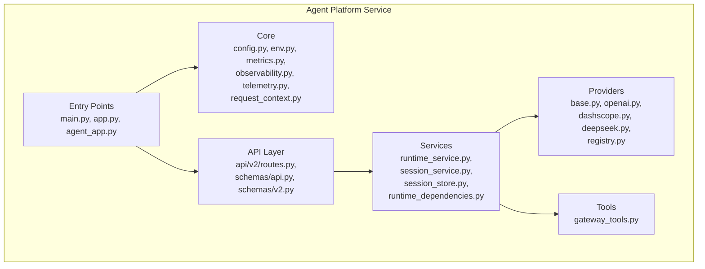
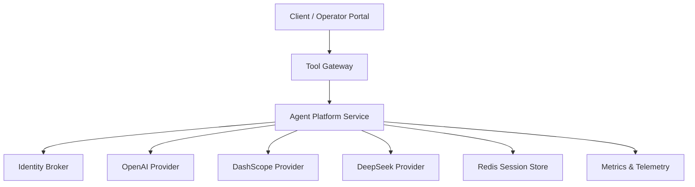
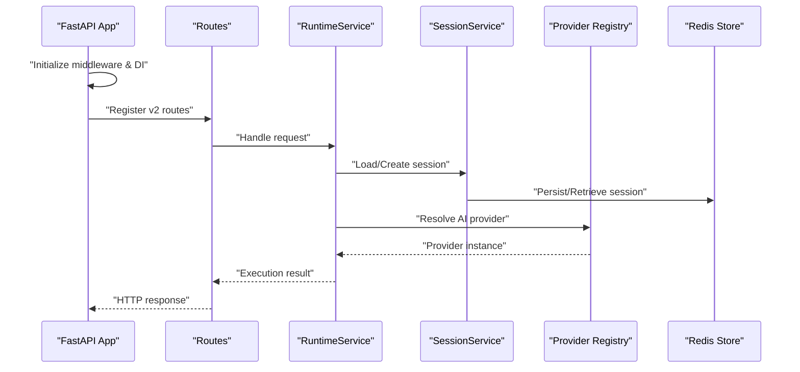
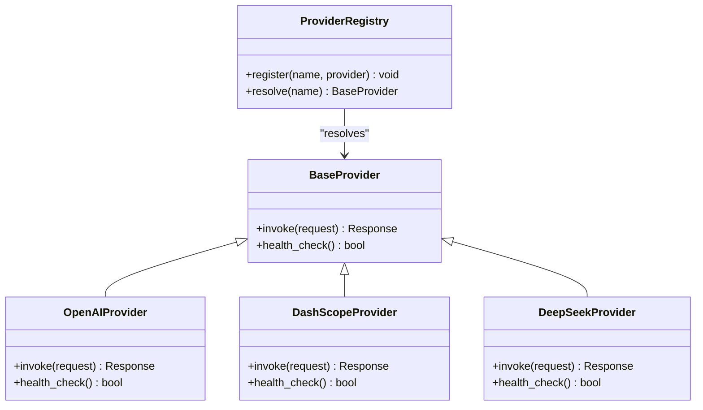
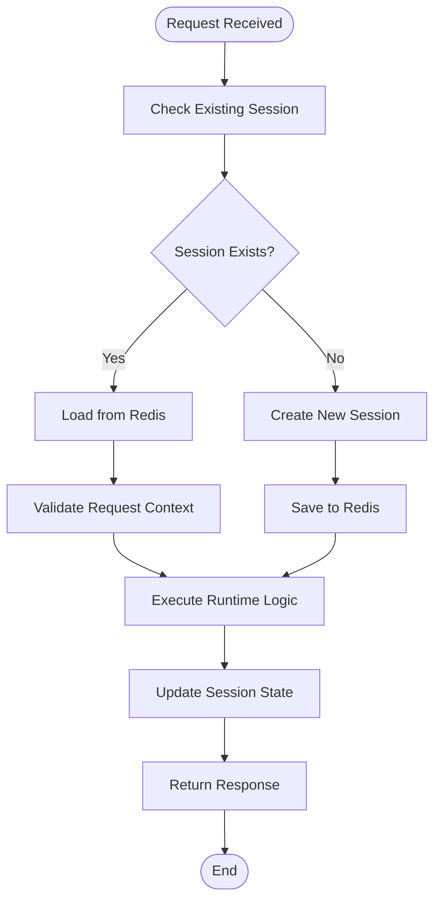
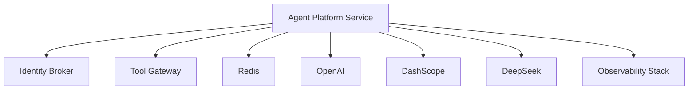
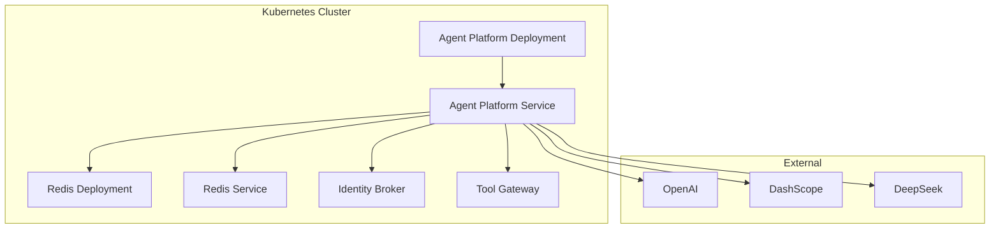

# Service Overview and Architecture

<cite>
**Referenced Files in This Document**
- [main.py](file://products/agent-platform/src/agent_service/main.py)
- [app.py](file://products/agent-platform/src/agent_service/app.py)
- [agent_app.py](file://products/agent-platform/src/agent_service/agent_app.py)
- [native_service.py](file://products/agent-platform/src/agent_service/native_service.py)
- [runtime_kernel.py](file://products/agent-platform/src/agent_service/runtime_kernel.py)
- [config.py](file://products/agent-platform/src/agent_service/core/config.py)
- [env.py](file://products/agent-platform/src/agent_service/core/env.py)
- [metrics.py](file://products/agent-platform/src/agent_service/core/metrics.py)
- [observability.py](file://products/agent-platform/src/agent_service/core/observability.py)
- [telemetry.py](file://products/agent-platform/src/agent_service/core/telemetry.py)
- [request_context.py](file://products/agent-platform/src/agent_service/core/request_context.py)
- [routes.py](file://products/agent-platform/src/agent_service/api/v2/routes.py)
- [api.py](file://products/agent-platform/src/agent_service/schemas/api.py)
- [v2.py](file://products/agent-platform/src/agent_service/schemas/v2.py)
- [runtime_service.py](file://products/agent-platform/src/agent_service/services/runtime_service.py)
- [session_service.py](file://products/agent-platform/src/agent_service/services/session_service.py)
- [session_store.py](file://products/agent-platform/src/agent_service/services/session_store.py)
- [runtime_dependencies.py](file://products/agent-platform/src/agent_service/services/runtime_dependencies.py)
- [gateway_tools.py](file://products/agent-platform/src/agent_service/tools/gateway_tools.py)
- [base.py](file://products/agent-platform/src/agent_service/providers/base.py)
- [openai.py](file://products/agent-platform/src/agent_service/providers/openai.py)
- [dashscope.py](file://products/agent-platform/src/agent_service/providers/dashscope.py)
- [deepseek.py](file://products/agent-platform/src/agent_service/providers/deepseek.py)
- [registry.py](file://products/agent-platform/src/agent_service/providers/registry.py)
- [Dockerfile](file://products/agent-platform/Dockerfile)
- [pyproject.toml](file://products/agent-platform/pyproject.toml)
- [agent-service-deployment.yaml](file://shared/platform-ops/gitops/dev-k8s/base/agent-platform/agent-service-deployment.yaml)
- [agent-service-service.yaml](file://shared/platform-ops/gitops/dev-k8s/base/agent-platform/agent-service-service.yaml)
- [runtime-config.env](file://shared/platform-ops/gitops/dev-k8s/base/agent-platform/runtime-config.env)
- [identity-service-deployment.yaml](file://shared/platform-ops/gitops/dev-k8s/base/identity-broker/identity-service-deployment.yaml)
- [identity-service-service.yaml](file://shared/platform-ops/gitops/dev-k8s/base/identity-broker/identity-service-service.yaml)
- [api-gateway-deployment.yaml](file://shared/platform-ops/gitops/dev-k8s/base/tool-gateway/api-gateway-deployment.yaml)
- [api-gateway-service.yaml](file://shared/platform-ops/gitops/dev-k8s/base/tool-gateway/api-gateway-service.yaml)
- [redis-deployment.yaml](file://shared/platform-ops/gitops/dev-k8s/base/infra/redis-deployment.yaml)
- [redis-service.yaml](file://shared/platform-ops/gitops/dev-k8s/base/infra/redis-service.yaml)
</cite>

## Table of Contents
1. [Introduction](#introduction)
2. [Project Structure](#project-structure)
3. [Core Components](#core-components)
4. [Architecture Overview](#architecture-overview)
5. [Detailed Component Analysis](#detailed-component-analysis)
6. [Dependency Analysis](#dependency-analysis)
7. [Performance Considerations](#performance-considerations)
8. [Troubleshooting Guide](#troubleshooting-guide)
9. [Conclusion](#conclusion)
10. [Appendices](#appendices)

## Introduction
The Agent Platform Service is the core orchestration engine of the Luban AIOps Platform. It coordinates agent execution, manages sessions, integrates with external AI providers, and exposes a FastAPI-based API for higher-level components such as the Tool Gateway. The service follows a microservices architecture, enabling independent scaling, deployment, and lifecycle management. It integrates with the Identity Broker for authentication and authorization, the Tool Gateway for tool invocation, and external AI providers (OpenAI, DashScope, DeepSeek) for model inference.

## Project Structure
The Agent Platform Service is implemented as a FastAPI application with a clear separation of concerns:
- Entry points define how the service starts and which runtime mode it uses (native or containerized).
- Core modules provide configuration, environment handling, metrics, observability, telemetry, and request context utilities.
- API layer defines routes and schemas for v2 endpoints.
- Services encapsulate business logic for runtime orchestration and session management.
- Providers implement integrations with external AI models through a common interface.
- Tools module provides abstractions for interacting with the Tool Gateway.
- Schemas define request/response contracts used across the platform.

**Diagram sources**
- [main.py](file://products/agent-platform/src/agent_service/main.py)
- [app.py](file://products/agent-platform/src/agent_service/app.py)
- [agent_app.py](file://products/agent-platform/src/agent_service/agent_app.py)
- [config.py](file://products/agent-platform/src/agent_service/core/config.py)
- [env.py](file://products/agent-platform/src/agent_service/core/env.py)
- [metrics.py](file://products/agent-platform/src/agent_service/core/metrics.py)
- [observability.py](file://products/agent-platform/src/agent_service/core/observability.py)
- [telemetry.py](file://products/agent-platform/src/agent_service/core/telemetry.py)
- [request_context.py](file://products/agent-platform/src/agent_service/core/request_context.py)
- [routes.py](file://products/agent-platform/src/agent_service/api/v2/routes.py)
- [api.py](file://products/agent-platform/src/agent_service/schemas/api.py)
- [v2.py](file://products/agent-platform/src/agent_service/schemas/v2.py)
- [runtime_service.py](file://products/agent-platform/src/agent_service/services/runtime_service.py)
- [session_service.py](file://products/agent-platform/src/agent_service/services/session_service.py)
- [session_store.py](file://products/agent-platform/src/agent_service/services/session_store.py)
- [runtime_dependencies.py](file://products/agent-platform/src/agent_service/services/runtime_dependencies.py)
- [gateway_tools.py](file://products/agent-platform/src/agent_service/tools/gateway_tools.py)
- [base.py](file://products/agent-platform/src/agent_service/providers/base.py)
- [openai.py](file://products/agent-platform/src/agent_service/providers/openai.py)
- [dashscope.py](file://products/agent-platform/src/agent_service/providers/dashscope.py)
- [deepseek.py](file://products/agent-platform/src/agent_service/providers/deepseek.py)
- [registry.py](file://products/agent-platform/src/agent_service/providers/registry.py)

**Section sources**
- [main.py](file://products/agent-platform/src/agent_service/main.py)
- [app.py](file://products/agent-platform/src/agent_service/app.py)
- [agent_app.py](file://products/agent-platform/src/agent_service/agent_app.py)
- [config.py](file://products/agent-platform/src/agent_service/core/config.py)
- [env.py](file://products/agent-platform/src/agent_service/core/env.py)
- [metrics.py](file://products/agent-platform/src/agent_service/core/metrics.py)
- [observability.py](file://products/agent-platform/src/agent_service/core/observability.py)
- [telemetry.py](file://products/agent-platform/src/agent_service/core/telemetry.py)
- [request_context.py](file://products/agent-platform/src/agent_service/core/request_context.py)
- [routes.py](file://products/agent-platform/src/agent_service/api/v2/routes.py)
- [api.py](file://products/agent-platform/src/agent_service/schemas/api.py)
- [v2.py](file://products/agent-platform/src/agent_service/schemas/v2.py)
- [runtime_service.py](file://products/agent-platform/src/agent_service/services/runtime_service.py)
- [session_service.py](file://products/agent-platform/src/agent_service/services/session_service.py)
- [session_store.py](file://products/agent-platform/src/agent_service/services/session_store.py)
- [runtime_dependencies.py](file://products/agent-platform/src/agent_service/services/runtime_dependencies.py)
- [gateway_tools.py](file://products/agent-platform/src/agent_service/tools/gateway_tools.py)
- [base.py](file://products/agent-platform/src/agent_service/providers/base.py)
- [openai.py](file://products/agent-platform/src/agent_service/providers/openai.py)
- [dashscope.py](file://products/agent-platform/src/agent_service/providers/dashscope.py)
- [deepseek.py](file://products/agent-platform/src/agent_service/providers/deepseek.py)
- [registry.py](file://products/agent-platform/src/agent_service/providers/registry.py)

## Core Components
- Entry Points: Define application startup, dependency injection setup, and lifecycle hooks. Native and containerized modes are supported via separate entry points.
- Core Modules: Provide centralized configuration, environment variable parsing, metrics collection, observability instrumentation, telemetry export, and per-request context propagation.
- API Layer: Exposes FastAPI routes under v2 namespace with Pydantic schemas for validation and documentation.
- Services: Implement runtime orchestration, session persistence, and dependency resolution for tools and providers.
- Providers: Abstract external AI model integrations behind a common interface, allowing pluggable backends.
- Tools: Offer gateway-based tool invocation capabilities to execute platform tools securely.

Key responsibilities:
- Orchestrate agent execution flows and manage state transitions.
- Maintain durable sessions using Redis-backed storage.
- Integrate with identity and policy systems via the Tool Gateway.
- Support multiple AI provider backends with consistent interfaces.

**Section sources**
- [main.py](file://products/agent-platform/src/agent_service/main.py)
- [app.py](file://products/agent-platform/src/agent_service/app.py)
- [agent_app.py](file://products/agent-platform/src/agent_service/agent_app.py)
- [native_service.py](file://products/agent-platform/src/agent_service/native_service.py)
- [runtime_kernel.py](file://products/agent-platform/src/agent_service/runtime_kernel.py)
- [config.py](file://products/agent-platform/src/agent_service/core/config.py)
- [env.py](file://products/agent-platform/src/agent_service/core/env.py)
- [metrics.py](file://products/agent-platform/src/agent_service/core/metrics.py)
- [observability.py](file://products/agent-platform/src/agent_service/core/observability.py)
- [telemetry.py](file://products/agent-platform/src/agent_service/core/telemetry.py)
- [request_context.py](file://products/agent-platform/src/agent_service/core/request_context.py)
- [routes.py](file://products/agent-platform/src/agent_service/api/v2/routes.py)
- [api.py](file://products/agent-platform/src/agent_service/schemas/api.py)
- [v2.py](file://products/agent-platform/src/agent_service/schemas/v2.py)
- [runtime_service.py](file://products/agent-platform/src/agent_service/services/runtime_service.py)
- [session_service.py](file://products/agent-platform/src/agent_service/services/session_service.py)
- [session_store.py](file://products/agent-platform/src/agent_service/services/session_store.py)
- [runtime_dependencies.py](file://products/agent-platform/src/agent_service/services/runtime_dependencies.py)
- [gateway_tools.py](file://products/agent-platform/src/agent_service/tools/gateway_tools.py)
- [base.py](file://products/agent-platform/src/agent_service/providers/base.py)
- [openai.py](file://products/agent-platform/src/agent_service/providers/openai.py)
- [dashscope.py](file://products/agent-platform/src/agent_service/providers/dashscope.py)
- [deepseek.py](file://products/agent-platform/src/agent_service/providers/deepseek.py)
- [registry.py](file://products/agent-platform/src/agent_service/providers/registry.py)

## Architecture Overview
The Agent Platform Service acts as an orchestration hub between clients, identity services, tool gateways, and AI providers. It receives requests via FastAPI routes, validates inputs, resolves dependencies, executes runtime logic, and returns structured responses. Sessions are persisted durably, and telemetry is exported for observability.

**Diagram sources**
- [routes.py](file://products/agent-platform/src/agent_service/api/v2/routes.py)
- [runtime_service.py](file://products/agent-platform/src/agent_service/services/runtime_service.py)
- [session_service.py](file://products/agent-platform/src/agent_service/services/session_service.py)
- [session_store.py](file://products/agent-platform/src/agent_service/services/session_store.py)
- [gateway_tools.py](file://products/agent-platform/src/agent_service/tools/gateway_tools.py)
- [openai.py](file://products/agent-platform/src/agent_service/providers/openai.py)
- [dashscope.py](file://products/agent-platform/src/agent_service/providers/dashscope.py)
- [deepseek.py](file://products/agent-platform/src/agent_service/providers/deepseek.py)
- [metrics.py](file://products/agent-platform/src/agent_service/core/metrics.py)
- [telemetry.py](file://products/agent-platform/src/agent_service/core/telemetry.py)

## Detailed Component Analysis

### FastAPI Application Lifecycle and Dependency Injection
The FastAPI application initializes middleware, registers routers, and sets up dependency injection for services and providers. Startup events configure observability and metrics, while shutdown events ensure graceful teardown of resources like Redis connections and telemetry exporters.

**Diagram sources**
- [app.py](file://products/agent-platform/src/agent_service/app.py)
- [routes.py](file://products/agent-platform/src/agent_service/api/v2/routes.py)
- [runtime_service.py](file://products/agent-platform/src/agent_service/services/runtime_service.py)
- [session_service.py](file://products/agent-platform/src/agent_service/services/session_service.py)
- [session_store.py](file://products/agent-platform/src/agent_service/services/session_store.py)
- [registry.py](file://products/agent-platform/src/agent_service/providers/registry.py)

**Section sources**
- [app.py](file://products/agent-platform/src/agent_service/app.py)
- [routes.py](file://products/agent-platform/src/agent_service/api/v2/routes.py)
- [runtime_service.py](file://products/agent-platform/src/agent_service/services/runtime_service.py)
- [session_service.py](file://products/agent-platform/src/agent_service/services/session_service.py)
- [session_store.py](file://products/agent-platform/src/agent_service/services/session_store.py)
- [registry.py](file://products/agent-platform/src/agent_service/providers/registry.py)

### Provider Abstraction and Pluggable Backends
Providers implement a common interface for AI model interactions. The registry selects the appropriate provider based on configuration, enabling seamless switching between OpenAI, DashScope, and DeepSeek without changing client code.

**Diagram sources**
- [base.py](file://products/agent-platform/src/agent_service/providers/base.py)
- [openai.py](file://products/agent-platform/src/agent_service/providers/openai.py)
- [dashscope.py](file://products/agent-platform/src/agent_service/providers/dashscope.py)
- [deepseek.py](file://products/agent-platform/src/agent_service/providers/deepseek.py)
- [registry.py](file://products/agent-platform/src/agent_service/providers/registry.py)

**Section sources**
- [base.py](file://products/agent-platform/src/agent_service/providers/base.py)
- [openai.py](file://products/agent-platform/src/agent_service/providers/openai.py)
- [dashscope.py](file://products/agent-platform/src/agent_service/providers/dashscope.py)
- [deepseek.py](file://products/agent-platform/src/agent_service/providers/deepseek.py)
- [registry.py](file://products/agent-platform/src/agent_service/providers/registry.py)

### Session Management and Persistence
Sessions are managed through a service layer that abstracts Redis operations. The session store handles serialization, TTL management, and error recovery. The runtime service coordinates session lifecycle during agent execution.

**Diagram sources**
- [session_service.py](file://products/agent-platform/src/agent_service/services/session_service.py)
- [session_store.py](file://products/agent-platform/src/agent_service/services/session_store.py)
- [runtime_service.py](file://products/agent-platform/src/agent_service/services/runtime_service.py)

**Section sources**
- [session_service.py](file://products/agent-platform/src/agent_service/services/session_service.py)
- [session_store.py](file://products/agent-platform/src/agent_service/services/session_store.py)
- [runtime_service.py](file://products/agent-platform/src/agent_service/services/runtime_service.py)

### Tool Integration via Gateway
The tools module provides a gateway abstraction for invoking platform tools. It handles authentication, policy enforcement, and result transformation. The runtime service uses this abstraction to execute tools within the agent workflow.

**Section sources**
- [gateway_tools.py](file://products/agent-platform/src/agent_service/tools/gateway_tools.py)
- [runtime_service.py](file://products/agent-platform/src/agent_service/services/runtime_service.py)

## Dependency Analysis
The Agent Platform Service has well-defined dependencies:
- External services: Identity Broker for authentication, Tool Gateway for tool execution, Redis for session persistence.
- AI providers: OpenAI, DashScope, DeepSeek via pluggable interfaces.
- Internal modules: Configuration, observability, metrics, and telemetry are shared across components.

**Diagram sources**
- [config.py](file://products/agent-platform/src/agent_service/core/config.py)
- [env.py](file://products/agent-platform/src/agent_service/core/env.py)
- [observability.py](file://products/agent-platform/src/agent_service/core/observability.py)
- [telemetry.py](file://products/agent-platform/src/agent_service/core/telemetry.py)
- [gateway_tools.py](file://products/agent-platform/src/agent_service/tools/gateway_tools.py)
- [openai.py](file://products/agent-platform/src/agent_service/providers/openai.py)
- [dashscope.py](file://products/agent-platform/src/agent_service/providers/dashscope.py)
- [deepseek.py](file://products/agent-platform/src/agent_service/providers/deepseek.py)

**Section sources**
- [config.py](file://products/agent-platform/src/agent_service/core/config.py)
- [env.py](file://products/agent-platform/src/agent_service/core/env.py)
- [observability.py](file://products/agent-platform/src/agent_service/core/observability.py)
- [telemetry.py](file://products/agent-platform/src/agent_service/core/telemetry.py)
- [gateway_tools.py](file://products/agent-platform/src/agent_service/tools/gateway_tools.py)
- [openai.py](file://products/agent-platform/src/agent_service/providers/openai.py)
- [dashscope.py](file://products/agent-platform/src/agent_service/providers/dashscope.py)
- [deepseek.py](file://products/agent-platform/src/agent_service/providers/deepseek.py)

## Performance Considerations
- Connection pooling: Use connection pools for Redis and HTTP clients to reduce latency.
- Async I/O: Leverage FastAPI's async capabilities for non-blocking operations.
- Caching: Implement caching for frequently accessed data and provider configurations.
- Scaling: Horizontal scaling is supported through stateless design and external session storage.
- Resource limits: Configure CPU and memory limits in Kubernetes deployments.

## Troubleshooting Guide
Common issues and resolutions:
- Connection failures: Verify network policies and service discovery for Redis, Identity Broker, and Tool Gateway.
- Authentication errors: Check token validity and identity broker connectivity.
- Provider timeouts: Monitor provider health endpoints and adjust timeout configurations.
- Session loss: Ensure Redis availability and proper TTL settings.
- Observability gaps: Verify telemetry exporter configuration and metrics endpoint accessibility.

**Section sources**
- [metrics.py](file://products/agent-platform/src/agent_service/core/metrics.py)
- [observability.py](file://products/agent-platform/src/agent_service/core/observability.py)
- [telemetry.py](file://products/agent-platform/src/agent_service/core/telemetry.py)
- [session_store.py](file://products/agent-platform/src/agent_service/services/session_store.py)

## Conclusion
The Agent Platform Service serves as the central orchestration component in the Luban AIOps Platform, providing robust session management, provider abstraction, and tool integration capabilities. Its microservices architecture enables independent scaling and deployment, while its FastAPI foundation ensures high performance and maintainability. The service integrates seamlessly with identity, policy, and external AI providers to deliver comprehensive agentic AI capabilities.

## Appendices

### Deployment Topology
The service is deployed as a Kubernetes deployment with associated services and configuration. Redis is used for session persistence, and the service communicates with Identity Broker and Tool Gateway via internal networking.

**Diagram sources**
- [agent-service-deployment.yaml](file://shared/platform-ops/gitops/dev-k8s/base/agent-platform/agent-service-deployment.yaml)
- [agent-service-service.yaml](file://shared/platform-ops/gitops/dev-k8s/base/agent-platform/agent-service-service.yaml)
- [redis-deployment.yaml](file://shared/platform-ops/gitops/dev-k8s/base/infra/redis-deployment.yaml)
- [redis-service.yaml](file://shared/platform-ops/gitops/dev-k8s/base/infra/redis-service.yaml)
- [identity-service-deployment.yaml](file://shared/platform-ops/gitops/dev-k8s/base/identity-broker/identity-service-deployment.yaml)
- [api-gateway-deployment.yaml](file://shared/platform-ops/gitops/dev-k8s/base/tool-gateway/api-gateway-deployment.yaml)

### Containerization Strategy
The service uses a multi-stage Docker build process optimized for Python applications. Dependencies are cached separately from application code to improve build performance. The final image includes only runtime dependencies and application code.

**Section sources**
- [Dockerfile](file://products/agent-platform/Dockerfile)
- [pyproject.toml](file://products/agent-platform/pyproject.toml)

### Configuration Management
Configuration is managed through environment variables and configuration files. The service supports different runtime profiles for various AI providers and deployment environments.

**Section sources**
- [config.py](file://products/agent-platform/src/agent_service/core/config.py)
- [env.py](file://products/agent-platform/src/agent_service/core/env.py)
- [runtime-config.env](file://shared/platform-ops/gitops/dev-k8s/base/agent-platform/runtime-config.env)