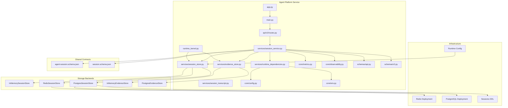
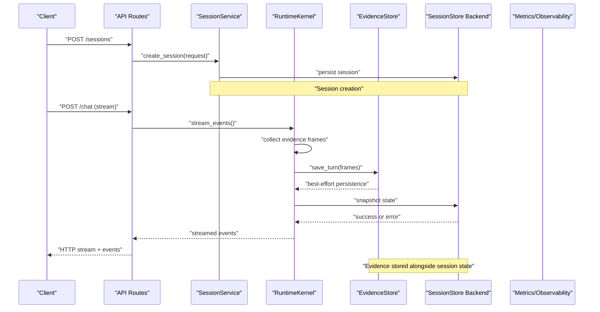
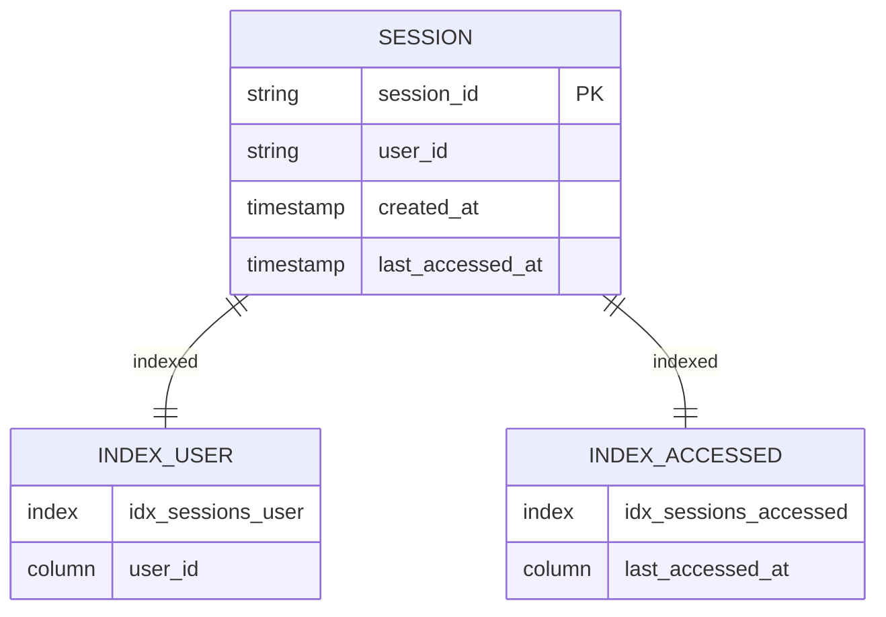
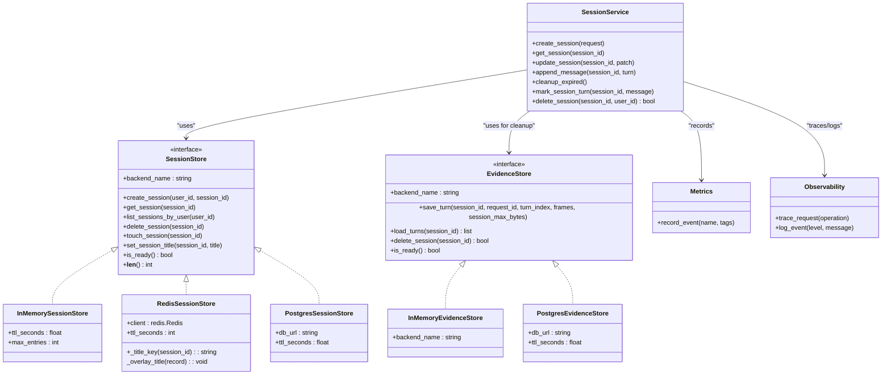

# Session Management and State Persistence

<cite>
**Referenced Files in This Document**
- [session_service.py](file://products/agent-platform/src/agent_service/services/session_service.py)
- [session_store.py](file://products/agent-platform/src/agent_service/services/session_store.py)
- [evidence_store.py](file://products/agent-platform/src/agent_service/services/evidence_store.py)
- [session_transcript.py](file://products/agent-platform/src/agent_service/services/session_transcript.py)
- [runtime_kernel.py](file://products/agent-platform/src/agent_service/runtime_kernel.py)
- [test_redis_session_store.py](file://products/agent-platform/tests/test_redis_session_store.py)
- [test_postgres_session_store.py](file://products/agent-platform/tests/test_postgres_session_store.py)
- [test_session_service.py](file://products/agent-platform/tests/test_session_service.py)
- [test_evidence_store.py](file://products/agent-platform/tests/test_evidence_store.py)
- [runtime_dependencies.py](file://products/agent-platform/src/agent_service/services/runtime_dependencies.py)
- [config.py](file://products/agent-platform/src/agent_service/core/config.py)
- [env.py](file://products/agent-platform/src/agent_service/core/env.py)
- [metrics.py](file://products/agent-platform/src/agent_service/core/metrics.py)
- [observability.py](file://products/agent-platform/src/agent_service/core/observability.py)
- [api.py](file://products/agent-platform/src/agent_service/schemas/api.py)
- [v2.py](file://products/agent-platform/src/agent_service/schemas/v2.py)
- [routes.py](file://products/agent-platform/src/agent_service/api/v2/routes.py)
- [app.py](file://products/agent-platform/src/agent_service/app.py)
- [main.py](file://products/agent-platform/src/agent_service/main.py)
- [runtime_settings.py](file://products/agent-platform/src/agent_service/runtime_settings.py)
- [agent-session.schema.json](file://shared/shared-contracts/schemas/agent-session.schema.json)
- [session.schema.json](file://shared/shared-contracts/schemas/session.schema.json)
- [redis-deployment.yaml](file://shared/platform-ops/gitops/dev-k8s/base/infra/redis-deployment.yaml)
- [redis-service.yaml](file://shared/platform-ops/gitops/dev-k8s/base/infra/redis-service.yaml)
- [postgres-statefulset.yaml](file://shared/platform-ops/gitops/dev-k8s/base/infra/postgres-statefulset.yaml)
- [postgres-service.yaml](file://shared/platform-ops/gitops/dev-k8s/base/infra/postgres-service.yaml)
- [create-sessions-db.sql](file://shared/platform-ops/gitops/dev-k8s/base/infra/create-sessions-db.sql)
- [sync-sessions-db.sh](file://shared/platform-ops/gitops/sync-sessions-db.sh)
- [runtime-config.env](file://shared/platform-ops/gitops/dev-k8s/base/agent-platform/runtime-config.env)
</cite>

## Update Summary
**Changes Made**
- Added comprehensive evidence persistence system for tool call/reasoning frames with SPEC-025 compliance
- Integrated evidence store service with session lifecycle for complete conversation replay capability
- Implemented size-bounded evidence storage with per-entry caps and per-session budgets
- Enhanced session deletion to cascade cleanup of agent state and evidence data
- Added evidence turn loading and reconstruction for session resume functionality
- Updated runtime kernel to persist evidence frames alongside conversation snapshots
- Added monitoring and metrics for evidence persistence operations

## Table of Contents
1. [Introduction](#introduction)
2. [Project Structure](#project-structure)
3. [Core Components](#core-components)
4. [Architecture Overview](#architecture-overview)
5. [Detailed Component Analysis](#detailed-component-analysis)
6. [Dependency Analysis](#dependency-analysis)
7. [Performance Considerations](#performance-considerations)
8. [Troubleshooting Guide](#troubleshooting-guide)
9. [Conclusion](#conclusion)
10. [Appendices](#appendices)

## Introduction
This document explains session management and state persistence for the Agent Platform, focusing on how sessions are created, updated, retrieved, and cleaned up across multiple storage backends. The platform now supports three pluggable session stores: in-memory (development), Redis (legacy deployments), and Postgres (production). It covers the unified interface abstraction, serialization formats, data models, security measures, performance considerations for large conversations, migration strategies between backends, and disaster recovery procedures. The goal is to provide both a conceptual overview and code-level insights to help developers operate and extend session functionality safely and efficiently.

**Updated** Enhanced with comprehensive evidence persistence capabilities that store tool call and reasoning frames for complete conversation replay, ensuring that reopened sessions can reconstruct the exact same evidence cards that were rendered during live streaming.

## Project Structure
Session-related logic resides primarily in the agent-platform service with a unified interface supporting multiple backends:
- Services layer implements session orchestration, evidence persistence, and storage abstraction with pluggable backends
- Schemas define API contracts and request/response shapes
- Tests validate behavior for all session services, evidence stores, and storage backends
- Kubernetes manifests deploy Redis and Postgres infrastructure with runtime configuration
- Shared schemas define canonical session data models



**Diagram sources**
- [session_store.py:47-66](file://products/agent-platform/src/agent_service/services/session_store.py#L47-L66)
- [evidence_store.py:87-106](file://products/agent-platform/src/agent_service/services/evidence_store.py#L87-L106)
- [runtime_kernel.py:439-473](file://products/agent-platform/src/agent_service/runtime_kernel.py#L439-L473)

**Section sources**
- [session_store.py:1-770](file://products/agent-platform/src/agent_service/services/session_store.py#L1-L770)
- [evidence_store.py:1-551](file://products/agent-platform/src/agent_service/services/evidence_store.py#L1-L551)
- [runtime-config.env:1-18](file://shared/platform-ops/gitops/dev-k8s/base/agent-platform/runtime-config.env#L1-L18)

## Core Components
- **SessionService**: Orchestrates session lifecycle operations such as creation, retrieval, update, append messages, and cleanup. It integrates with metrics and observability, validates payloads against schemas, and delegates persistence to the session store through a unified interface. Now includes cascading cleanup of agent state and evidence data on session deletion.
- **EvidenceStore**: New component that persists tool call and reasoning frames for each streamed turn, enabling complete conversation replay when sessions are reopened. Supports both in-memory and Postgres backends with size-bounded storage.
- **SessionStore Protocol**: Defines a consistent interface for all storage backends including `create_session`, `get_session`, `list_sessions_by_user`, `delete_session`, `is_ready`, and `__len__` methods, plus new `touch_session` and `set_session_title` methods for workspace bookkeeping.
- **Multi-Backend Support**: Three implementations available:
  - `InMemorySessionStore`: For development and CI with TTL and max-entry eviction
  - `RedisSessionStore`: For legacy deployments with JSON blob storage, native EXPIRE, and atomic title storage
  - `PostgresSessionStore`: For production with relational storage and idle-TTL refresh
- **Factory Pattern**: `build_session_store()` function selects backend based on `SESSION_STORE_BACKEND` environment variable with fail-open fallback behavior
- **Configuration**: Environment-driven settings for connection parameters, TTL policies, and feature flags

Key responsibilities:
- Enforce schema validation for inputs and outputs
- Manage TTL and eviction policies across all backends
- Provide consistent error handling and observability
- Support idempotent operations where applicable
- Implement fail-open fallback when primary backend is unavailable
- Handle atomic title minting and workspace bookkeeping operations
- **Enhanced**: Cascade cleanup of agent state and evidence data when sessions are deleted

**Updated** Evidence persistence system ensures complete conversation replay capability by storing tool call and reasoning frames with size-bounded storage and automatic cleanup.

**Section sources**
- [session_store.py:47-66](file://products/agent-platform/src/agent_service/services/session_store.py#L47-L66)
- [session_store.py:536-615](file://products/agent-platform/src/agent_service/services/session_store.py#L536-L615)
- [session_service.py:1-130](file://products/agent-platform/src/agent_service/services/session_service.py#L1-L130)
- [evidence_store.py:87-106](file://products/agent-platform/src/agent_service/services/evidence_store.py#L87-L106)

## Architecture Overview
The session architecture follows a layered design with pluggable storage backends and integrated evidence persistence:
- API routes expose endpoints for session operations
- SessionService handles business logic, validation, and cascading cleanup
- EvidenceStore manages tool call and reasoning frame persistence with size bounds
- SessionStore protocol abstracts persistence with multiple implementations
- Factory pattern provides backend selection with fail-open fallback
- Runtime kernel integrates evidence collection during streaming turns
- Configuration and environment drive connection parameters and feature flags
- Observability and metrics capture performance and errors across all backends



**Diagram sources**
- [runtime_kernel.py:662-773](file://products/agent-platform/src/agent_service/runtime_kernel.py#L662-L773)
- [evidence_store.py:118-148](file://products/agent-platform/src/agent_service/services/evidence_store.py#L118-L148)
- [session_store.py:536-615](file://products/agent-platform/src/agent_service/services/session_store.py#L536-L615)

## Detailed Component Analysis

### Session Lifecycle
- Creation: Validates input, generates unique identifiers, initializes metadata, persists to selected backend with TTL, returns normalized response
- Retrieval: Reads from configured backend by ID, handles missing sessions, enriches with metadata if needed
- Update: Applies partial updates atomically, validates changes, preserves integrity constraints
- Append Messages: Efficiently appends conversation turns while maintaining order and size limits
- Cleanup: Uses TTL-based expiration; Postgres backend includes bounded sweep mechanism for expired row cleanup
- **Enhanced Title Management**: Server-minted titles are stored in separate Redis keys with atomic set-once semantics, preventing overwrites once established
- **Enhanced Cascading Cleanup**: Session deletion now cascades to delete associated agent state and evidence data

```mermaid
flowchart TD
Start(["Function Entry"]) --> Validate["Validate Input"]
Validate --> Valid{"Valid?"}
Valid --> |No| ReturnError["Return Validation Error"]
Valid --> |Yes| SelectBackend["Select Backend via Factory"]
SelectBackend --> BackendType{"Backend Type"}
BackendType --> |Memory| MemoryPersist["InMemory Storage"]
BackendType --> |Redis| RedisPersist["Redis Storage with Atomic Titles"]
BackendType --> |Postgres| PostgresPersist["Postgres Storage"]
MemoryPersist --> Success{"Persist Success?"}
RedisPersist --> Success
PostgresPersist --> Success
Success --> |No| Fallback["Fallback to InMemory"]
Success --> |Yes| ReturnResult["Return Session Response"]
Fallback --> ReturnResult
ReturnResult --> End(["Exit"])
ReturnError --> End
Note at End: "On delete: cascade cleanup of state + evidence"
```

**Diagram sources**
- [session_store.py:536-615](file://products/agent-platform/src/agent_service/services/session_store.py#L536-L615)
- [session_service.py:105-130](file://products/agent-platform/src/agent_service/services/session_service.py#L105-L130)

**Section sources**
- [session_service.py:1-130](file://products/agent-platform/src/agent_service/services/session_service.py#L1-L130)
- [session_store.py:536-615](file://products/agent-platform/src/agent_service/services/session_store.py#L536-L615)

### Evidence Persistence System
The new evidence persistence system captures tool call and reasoning frames for complete conversation replay:

- **Frame Types**: Persists only `tool_call` and `tool_result` frames, excluding diagnostic and future frames
- **Size Bounds**: Two-level enforcement - per-entry cap replaces oversized data with truncated preview, per-session budget evicts oldest result payloads
- **Backends**: Mirrors SPEC-017 agent state store pattern with in-memory (default) and Postgres backends
- **Integration**: Captured during streaming turns via ToolEvidenceMiddleware, persisted best-effort after stream completion
- **Replay Support**: Enables reopening sessions to reconstruct same evidence cards that were rendered live
- **Cleanup**: Cascades with session deletion to prevent orphaned evidence data

Key features:
- Automatic truncation of oversized payloads with visible markers
- Budget enforcement that preserves metadata while nulling data payloads
- TTL refresh on reads to keep active sessions alive
- Bounded sweep mechanism for expired row cleanup
- Fail-open degradation to live-only evidence when persistence fails

**Section sources**
- [evidence_store.py:1-551](file://products/agent-platform/src/agent_service/services/evidence_store.py#L1-L551)
- [runtime_kernel.py:439-473](file://products/agent-platform/src/agent_service/runtime_kernel.py#L439-L473)

### Multi-Backend Storage Architecture
The platform now supports three distinct storage backends, each optimized for different use cases:

#### InMemorySessionStore
- Single-replica, non-persistent storage for development and CI
- TTL-based expiration with configurable max entries
- Automatic eviction of oldest sessions when capacity exceeded
- Ideal for testing and temporary workloads

#### RedisSessionStore  
- JSON blob storage with Redis-native EXPIRE for TTL
- Sorted sets for user-scoped session listing
- Native atomic operations and high throughput
- **Enhanced**: Dedicated title storage with atomic set-once semantics using `SET ... NX` operations
- Suitable for legacy deployments and high-performance scenarios

#### PostgresSessionStore (SPEC-016)
- Relational storage with structured schema and indexes
- Idle-TTL refresh mechanism: reads automatically update `last_accessed_at`
- Bounded sweep mechanism: opportunistic cleanup of expired rows without long-running sweeper
- Conflict-safe inserts with ON CONFLICT handling
- Production-ready with proper indexing and query optimization



**Diagram sources**
- [session_store.py:277-288](file://products/agent-platform/src/agent_service/services/session_store.py#L277-L288)

**Section sources**
- [session_store.py:73-150](file://products/agent-platform/src/agent_service/services/session_store.py#L73-L150)
- [session_store.py:157-270](file://products/agent-platform/src/agent_service/services/session_store.py#L157-L270)
- [session_store.py:349-495](file://products/agent-platform/src/agent_service/services/session_store.py#L349-L495)

### Evidence Store Implementation Details
The evidence store implements SPEC-025 requirements with sophisticated size management:

- **Per-Entry Caps**: Oversized `tool_result` data payloads are replaced with truncated previews plus visible markers
- **Per-Session Budgets**: Evicts oldest result payloads when session exceeds storage budget, preserving metadata
- **TTL Refresh**: Reads automatically update timestamps to keep active sessions alive
- **Bounded Sweep**: Opportunistic cleanup of expired rows during write operations with 100-row limit
- **Conflict-Safe Inserts**: Uses PostgreSQL's `ON CONFLICT DO UPDATE` clause for concurrent safety
- **Parameterized Queries**: All SQL statements use parameter binding to prevent injection
- **Connection Management**: Opens connections per operation for low-volume patterns
- **Fail-Open Design**: Persistence failures degrade to live-only evidence without failing turns

**Section sources**
- [evidence_store.py:118-148](file://products/agent-platform/src/agent_service/services/evidence_store.py#L118-L148)
- [evidence_store.py:150-164](file://products/agent-platform/src/agent_service/services/evidence_store.py#L150-L164)
- [evidence_store.py:409-427](file://products/agent-platform/src/agent_service/services/evidence_store.py#L409-L427)

### Security Measures and Access Control
- Authentication: Sessions are scoped to authenticated users/tenants; IDs are non-guessable
- Authorization: Access checks ensure only authorized principals can read/write sessions
- Encryption: Secrets and sensitive fields are encrypted at rest and in transit; TLS enforced for database connections
- Auditability: Operations emit structured logs and metrics for compliance and monitoring
- Fail-Open Security: When primary backend fails, service falls back to in-memory storage with warning logs and metrics
- **Enhanced**: Title integrity protection ensures server-minted titles cannot be tampered with through normal session operations
- **Enhanced**: Evidence data inherits redaction from tool-gateway choke point, preventing credential leakage

**Section sources**
- [session_store.py:564-572](file://products/agent-platform/src/agent_service/services/session_store.py#L564-572)
- [session_store.py:604-610](file://products/agent-platform/src/agent_service/services/session_store.py#L604-610)
- [evidence_store.py:46-70](file://products/agent-platform/src/agent_service/services/evidence_store.py#L46-L70)

### Examples of Operations
- Create session: POST with validated payload; returns new session with metadata and TTL
- Retrieve session: GET by ID; returns full session state or not found
- Update session: PATCH with allowed fields; returns updated state
- Append message: POST to append a turn; enforces ordering and size limits
- **Enhanced**: Title management: First user turn mints a server-side title with atomic set-once semantics using Redis NX operations
- **Enhanced**: Evidence persistence: Tool calls and results captured during streaming turns and persisted best-effort
- Cleanup: TTL-based expiration; Postgres backend includes automatic sweep mechanism
- **Workspace Bookkeeping**: Touch operations update last active timestamps without affecting title integrity
- **Enhanced**: Cascading deletion: Session deletion removes session, agent state, and evidence data

**Section sources**
- [routes.py:1-200](file://products/agent-platform/src/agent_service/api/v2/routes.py#L1-L200)
- [session_service.py:1-130](file://products/agent-platform/src/agent_service/services/session_service.py#L1-L130)
- [runtime_kernel.py:662-773](file://products/agent-platform/src/agent_service/runtime_kernel.py#L662-L773)

### Performance Considerations for Large Conversations
- Chunked storage: Split large conversation histories into separate keys to avoid oversized values
- Pagination: Implement cursors for retrieving turns beyond thresholds
- Compression: Compress payloads when storing large text blocks
- Caching: Cache frequently accessed session metadata near the application layer
- Backpressure: Rate-limit writes and reads during high load; use queues for batch updates
- Backend Selection: Choose appropriate backend based on workload characteristics
- **Enhanced**: Separate title storage reduces session blob size and improves cache efficiency
- **Enhanced**: Evidence size bounds prevent unbounded growth with automatic eviction of oldest payloads
- **Enhanced**: Best-effort evidence persistence ensures streaming performance is not impacted by storage failures

**Section sources**
- [session_store.py:73-150](file://products/agent-platform/src/agent_service/services/session_store.py#L73-L150)
- [session_store.py:157-270](file://products/agent-platform/src/agent_service/services/session_store.py#L157-L270)
- [session_store.py:349-495](file://products/agent-platform/src/agent_service/services/session_store.py#L349-L495)
- [evidence_store.py:150-164](file://products/agent-platform/src/agent_service/services/evidence_store.py#L150-L164)

### Migration Between Storage Backends
- Abstraction: SessionStore and EvidenceStore protocols define consistent interfaces allowing pluggable backends
- Migration strategy: Dual-write during transition, verify parity, then switch reads
- Schema evolution: Versioned keys and backward-compatible field additions
- Rollback plan: Maintain old backend until validation completes; revert quickly if issues arise
- Fail-open behavior: Automatic fallback to in-memory storage when primary backend is unavailable

**Section sources**
- [session_store.py:47-66](file://products/agent-platform/src/agent_service/services/session_store.py#L47-L66)
- [session_store.py:536-615](file://products/agent-platform/src/agent_service/services/session_store.py#L536-L615)
- [evidence_store.py:504-546](file://products/agent-platform/src/agent_service/services/evidence_store.py#L504-L546)

### Disaster Recovery Procedures
- Backup: Regular snapshots of Postgres datasets; export session tables periodically
- Restore: Rehydrate from backups with table prefix filtering to avoid collisions
- Consistency checks: Validate counts and checksums post-restore
- Failover: Multi-region Postgres clusters with replication; route traffic to healthy nodes
- Health monitoring: Backend readiness checks with automatic fallback to in-memory storage
- **Enhanced**: Evidence data backup and restore follows same patterns as session data

**Section sources**
- [create-sessions-db.sql:1-6](file://shared/platform-ops/gitops/dev-k8s/base/infra/create-sessions-db.sql#L1-L6)
- [sync-sessions-db.sh:1-36](file://shared/platform-ops/gitops/sync-sessions-db.sh#L1-L36)

## Dependency Analysis
SessionService depends on:
- Schemas for validation
- Metrics and observability for telemetry
- RuntimeDependencies for configuration
- SessionStore protocol for persistence abstraction
- **Enhanced**: EvidenceStore for cascading cleanup operations

EvidenceStore depends on:
- RuntimeSettings for size configuration
- Metrics for operational visibility
- AgentStateStore patterns for shared infrastructure

SessionStore factory depends on:
- Environment variables for backend selection
- Connection configuration for each backend
- Metrics recording for operational visibility



**Diagram sources**
- [session_store.py:47-66](file://products/agent-platform/src/agent_service/services/session_store.py#L47-L66)
- [evidence_store.py:87-106](file://products/agent-platform/src/agent_service/services/evidence_store.py#L87-L106)
- [session_service.py:105-130](file://products/agent-platform/src/agent_service/services/session_service.py#L105-L130)

**Section sources**
- [session_service.py:1-130](file://products/agent-platform/src/agent_service/services/session_service.py#L1-L130)
- [session_store.py:47-770](file://products/agent-platform/src/agent_service/services/session_store.py#L47-L770)
- [evidence_store.py:87-551](file://products/agent-platform/src/agent_service/services/evidence_store.py#L87-L551)

## Performance Considerations
- Connection pooling: Ensure Redis clients use pooled connections to reduce latency
- Batch operations: Group multiple writes into pipelines to minimize round trips
- TTL tuning: Adjust TTL based on expected conversation lifetimes to balance memory usage and durability
- Monitoring: Track latency percentiles, error rates, and backend utilization
- Scaling: Horizontal scaling of application instances behind a load balancer; choose appropriate backend for workload
- Backend Selection: Use Postgres for production workloads, Redis for high-throughput scenarios, in-memory for development
- **Enhanced**: Separate title storage improves cache hit ratios and reduces session blob sizes
- **Enhanced**: Evidence size bounds prevent performance degradation from unbounded growth
- **Enhanced**: Best-effort evidence persistence ensures streaming performance is maintained even when storage fails

## Troubleshooting Guide
Common issues and resolutions:
- Backend connectivity failures: Check network policies, TLS settings, and credentials in environment variables
- TTL misconfiguration: Verify TTL values and ensure they align with session lifetime expectations
- Schema validation errors: Inspect request payloads against schemas; ensure required fields are present
- High memory usage: Identify oversized sessions; implement chunking and compression
- Data inconsistency: Review atomic update patterns and rollback strategies
- Postgres-specific issues: Check database connectivity, table existence, and index health
- **Enhanced**: Title consistency issues: Verify atomic title minting and overlay behavior in Redis backend, check for orphaned title keys
- **Enhanced**: Evidence persistence issues: Check evidence store backend availability, review size configuration, monitor truncation metrics

Operational checks:
- Health endpoints for all backends and session service
- Metrics dashboards for latency and error rates
- Logs for failed validations and storage errors
- Backend selection verification through startup logs
- **New**: Evidence store health checks and size monitoring
- **New**: Title key validation: Ensure `session:title:*` keys are properly created and deleted

**Section sources**
- [test_postgres_session_store.py:206-227](file://products/agent-platform/tests/test_postgres_session_store.py#L206-L227)
- [test_redis_session_store.py:1-274](file://products/agent-platform/tests/test_redis_session_store.py#L1-L274)
- [test_evidence_store.py:1-386](file://products/agent-platform/tests/test_evidence_store.py#L1-L386)
- [session_store.py:564-572](file://products/agent-platform/src/agent_service/services/session_store.py#L564-572)

## Conclusion
The session management system now provides robust, multi-backend support with fail-open resilience, enabling flexible deployment strategies across development, staging, and production environments. The unified interface abstracts storage complexity while maintaining performance and reliability guarantees. By adhering to shared schemas, implementing clear lifecycle operations, and following performance and disaster recovery best practices, the platform ensures reliable session handling across diverse workloads and storage backends.

**Updated** The enhanced system now includes comprehensive evidence persistence that captures tool calls and reasoning frames for complete conversation replay, ensuring that reopened sessions can reconstruct the exact same evidence cards that were rendered during live streaming. This provides operators with full audit trails and debugging capabilities while maintaining performance through size-bounded storage and best-effort persistence patterns.

## Appendices

### Configuration and Environment
- Backend selection: `SESSION_STORE_BACKEND` accepts `memory`, `redis`, or `postgres`
- Postgres configuration: `SESSION_DB_URL` supplies the Postgres DSN (required for postgres backend)
- TTL policies: `SESSION_TTL_SECONDS` controls TTL for all backends (default 3600)
- Redis configuration: `SESSION_REDIS_HOST`, `SESSION_REDIS_PORT`, `SESSION_REDIS_DB` for Redis backend
- Feature flags: Enable/disable chunking, compression, and advanced cleanup
- **Enhanced**: Evidence configuration: `AGENT_STATE_STORE_BACKEND`, `AGENT_STATE_DB_URL`, `AGENT_STATE_TTL_SECONDS` for evidence persistence
- **Enhanced**: Evidence size bounds: `AGENT_EVIDENCE_ENTRY_MAX_CHARS`, `AGENT_EVIDENCE_SESSION_MAX_BYTES` control storage limits

**Section sources**
- [runtime-config.env:10-13](file://shared/platform-ops/gitops/dev-k8s/base/agent-platform/runtime-config.env#L10-L13)
- [session_store.py:536-551](file://products/agent-platform/src/agent_service/services/session_store.py#L536-L551)
- [runtime_settings.py:145-150](file://products/agent-platform/src/agent_service/runtime_settings.py#L145-L150)

### Infrastructure Deployment
- Postgres deployment and service definitions for production sessions
- Redis deployment and service definitions for kernel and legacy support
- Database initialization scripts for sessions database creation
- Namespace isolation and resource quotas
- Monitoring and alerting configurations
- **Enhanced**: Evidence store shares the same Postgres instance as agent state store with dedicated tables

**Section sources**
- [create-sessions-db.sql:1-6](file://shared/platform-ops/gitops/dev-k8s/base/infra/create-sessions-db.sql#L1-L6)
- [postgres-statefulset.yaml:1-100](file://shared/platform-ops/gitops/dev-k8s/base/infra/postgres-statefulset.yaml#L1-L100)
- [postgres-service.yaml:1-50](file://shared/platform-ops/gitops/dev-k8s/base/infra/postgres-service.yaml#L1-L50)
- [redis-deployment.yaml:1-100](file://shared/platform-ops/gitops/dev-k8s/base/infra/redis-deployment.yaml#L1-L100)
- [redis-service.yaml:1-50](file://shared/platform-ops/gitops/dev-k8s/base/infra/redis-service.yaml#L1-L50)

### Testing and Validation
- Comprehensive test coverage for all three backends
- Fake driver patterns for Postgres testing
- Mock Redis client for isolated testing
- Integration tests for backend selection and fallback behavior
- Performance benchmarking across different backends
- **Enhanced**: Evidence store tests validating size bounds, eviction behavior, and backend selection
- **Enhanced**: Integration tests for cascading cleanup and evidence persistence during streaming

**Section sources**
- [test_postgres_session_store.py:1-286](file://products/agent-platform/tests/test_postgres_session_store.py#L1-L286)
- [test_redis_session_store.py:1-274](file://products/agent-platform/tests/test_redis_session_store.py#L1-L274)
- [test_session_workspace.py:284-311](file://products/agent-platform/tests/test_session_workspace.py#L284-L311)
- [test_evidence_store.py:1-386](file://products/agent-platform/tests/test_evidence_store.py#L1-L386)