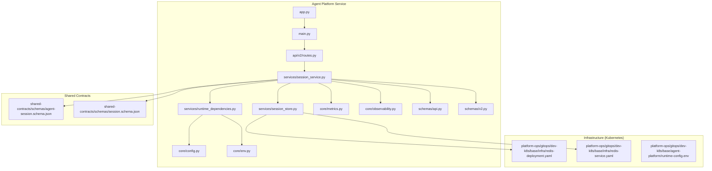
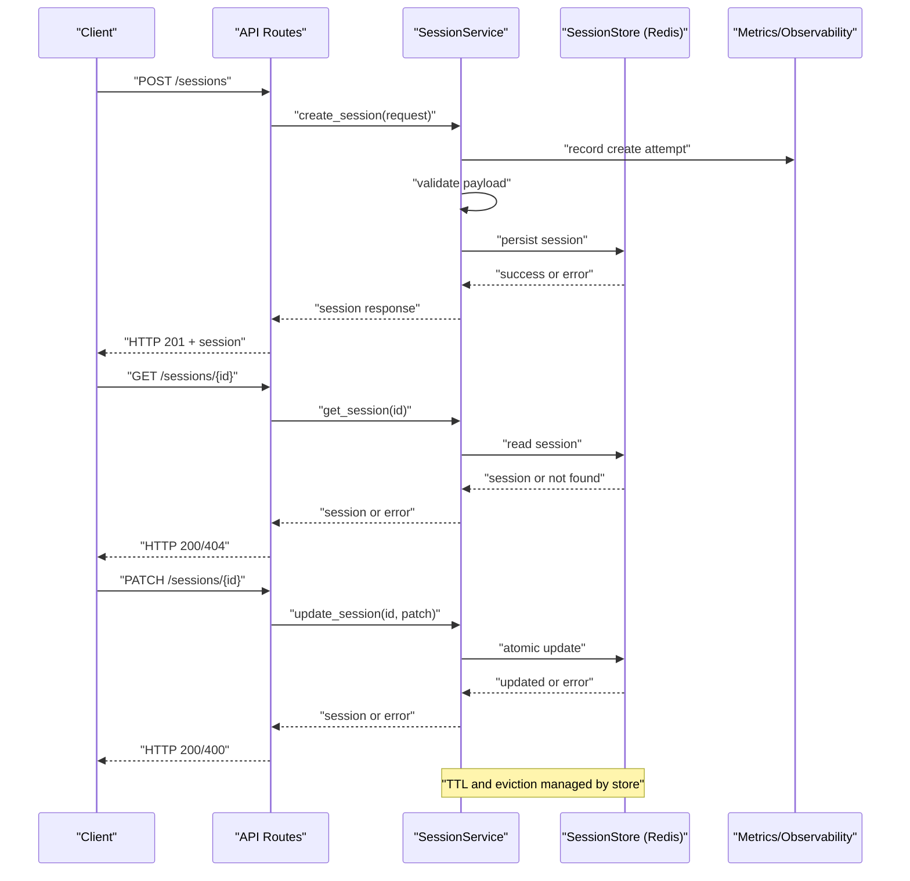
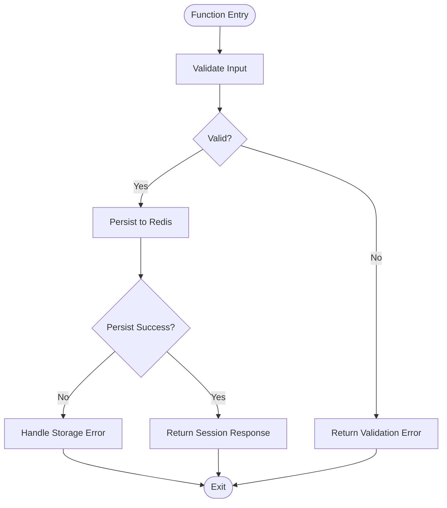
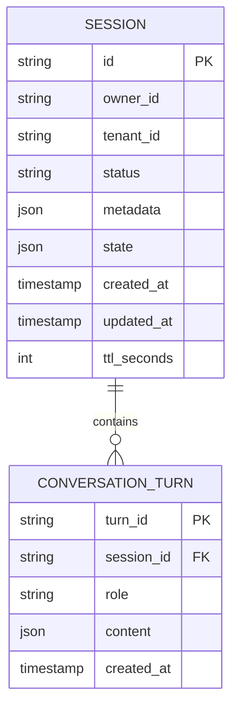
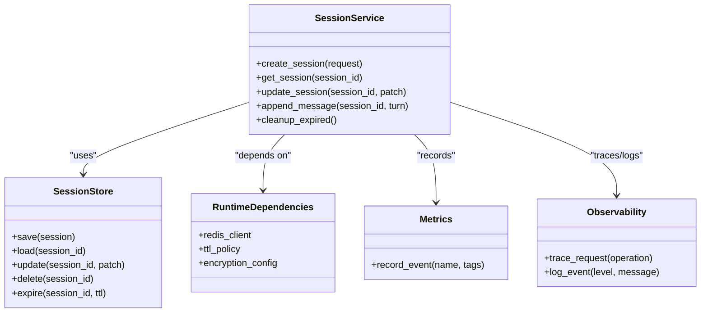

# Session Management and State Persistence

<cite>
**Referenced Files in This Document**
- [session_service.py](file://products/agent-platform/src/agent_service/services/session_service.py)
- [session_store.py](file://products/agent-platform/src/agent_service/services/session_store.py)
- [test_redis_session_store.py](file://products/agent-platform/tests/test_redis_session_store.py)
- [test_session_service.py](file://products/agent-platform/tests/test_session_service.py)
- [runtime_dependencies.py](file://products/agent-platform/src/agent_service/services/runtime_dependencies.py)
- [config.py](file://products/agent-platform/src/agent_service/core/config.py)
- [env.py](file://products/agent-platform/src/agent_service/core/env.py)
- [metrics.py](file://products/agent-platform/src/agent_service/core/metrics.py)
- [observability.py](file://products/agent-platform/src/agent_service/core/observability.py)
- [api.py](file://products/agent-platform/src/agent_service/schemas/api.py)
- [v2.py](file://products/agent-platform/src/agent_service/schemas/v2.py)
- [routes.py](file://products/agent-platform/src/agent_service/api/v2/routes.py)
- [app.py](file://products/agent-platform/src/agent_service/app.py)
- [main.py](file://products/agent-platform/src/agent_service/main.py)
- [agent-session.schema.json](file://shared/shared-contracts/schemas/agent-session.schema.json)
- [session.schema.json](file://shared/shared-contracts/schemas/session.schema.json)
- [redis-deployment.yaml](file://shared/platform-ops/gitops/dev-k8s/base/infra/redis-deployment.yaml)
- [redis-service.yaml](file://shared/platform-ops/gitops/dev-k8s/base/infra/redis-service.yaml)
- [runtime-config.env](file://shared/platform-ops/gitops/dev-k8s/base/agent-platform/runtime-config.env)
</cite>

## Table of Contents
1. [Introduction](#introduction)
2. [Project Structure](#project-structure)
3. [Core Components](#core-components)
4. [Architecture Overview](#architecture-overview)
5. [Detailed Component Analysis](#detailed-component-analysis)
6. [Dependency Analysis](#dependency-analysis)
7. [Performance Considerations](#performance-considerations)
8. [Troubleshooting Guide](#troubleshooting-guide)
9. [Conclusion](#conclusion)
10. [Appendices](#appendices)

## Introduction
This document explains session management and state persistence for the Agent Platform, focusing on how sessions are created, updated, retrieved, and cleaned up. It covers the Redis-backed distributed storage, serialization formats, data models, security measures, performance considerations for large conversations, migration strategies between backends, and disaster recovery procedures. The goal is to provide both a conceptual overview and code-level insights to help developers operate and extend session functionality safely and efficiently.

## Project Structure
Session-related logic resides primarily in the agent-platform service:
- Services layer implements session orchestration and storage abstraction
- Schemas define API contracts and request/response shapes
- Tests validate behavior for session services and Redis store
- Kubernetes manifests deploy Redis and configure runtime environment variables
- Shared schemas define canonical session data models

**Diagram sources**
- [app.py](file://products/agent-platform/src/agent_service/app.py)
- [main.py](file://products/agent-platform/src/agent_service/main.py)
- [routes.py](file://products/agent-platform/src/agent_service/api/v2/routes.py)
- [session_service.py](file://products/agent-platform/src/agent_service/services/session_service.py)
- [session_store.py](file://products/agent-platform/src/agent_service/services/session_store.py)
- [runtime_dependencies.py](file://products/agent-platform/src/agent_service/services/runtime_dependencies.py)
- [config.py](file://products/agent-platform/src/agent_service/core/config.py)
- [env.py](file://products/agent-platform/src/agent_service/core/env.py)
- [metrics.py](file://products/agent-platform/src/agent_service/core/metrics.py)
- [observability.py](file://products/agent-platform/src/agent_service/core/observability.py)
- [api.py](file://products/agent-platform/src/agent_service/schemas/api.py)
- [v2.py](file://products/agent-platform/src/agent_service/schemas/v2.py)
- [agent-session.schema.json](file://shared/shared-contracts/schemas/agent-session.schema.json)
- [session.schema.json](file://shared/shared-contracts/schemas/session.schema.json)
- [redis-deployment.yaml](file://shared/platform-ops/gitops/dev-k8s/base/infra/redis-deployment.yaml)
- [redis-service.yaml](file://shared/platform-ops/gitops/dev-k8s/base/infra/redis-service.yaml)
- [runtime-config.env](file://shared/platform-ops/gitops/dev-k8s/base/agent-platform/runtime-config.env)

**Section sources**
- [app.py](file://products/agent-platform/src/agent_service/app.py)
- [main.py](file://products/agent-platform/src/agent_service/main.py)
- [routes.py](file://products/agent-platform/src/agent_service/api/v2/routes.py)
- [session_service.py](file://products/agent-platform/src/agent_service/services/session_service.py)
- [session_store.py](file://products/agent-platform/src/agent_service/services/session_store.py)
- [runtime_dependencies.py](file://products/agent-platform/src/agent_service/services/runtime_dependencies.py)
- [config.py](file://products/agent-platform/src/agent_service/core/config.py)
- [env.py](file://products/agent-platform/src/agent_service/core/env.py)
- [metrics.py](file://products/agent-platform/src/agent_service/core/metrics.py)
- [observability.py](file://products/agent-platform/src/agent_service/core/observability.py)
- [api.py](file://products/agent-platform/src/agent_service/schemas/api.py)
- [v2.py](file://products/agent-platform/src/agent_service/schemas/v2.py)
- [agent-session.schema.json](file://shared/shared-contracts/schemas/agent-session.schema.json)
- [session.schema.json](file://shared/shared-contracts/schemas/session.schema.json)
- [redis-deployment.yaml](file://shared/platform-ops/gitops/dev-k8s/base/infra/redis-deployment.yaml)
- [redis-service.yaml](file://shared/platform-ops/gitops/dev-k8s/base/infra/redis-service.yaml)
- [runtime-config.env](file://shared/platform-ops/gitops/dev-k8s/base/agent-platform/runtime-config.env)

## Core Components
- SessionService: Orchestrates session lifecycle operations such as creation, retrieval, update, append messages, and cleanup. It integrates with metrics and observability, validates payloads against schemas, and delegates persistence to the session store.
- SessionStore: Abstracts persistence. In production, it uses Redis to store serialized session documents with TTL-based expiration and atomic updates.
- RuntimeDependencies: Provides configured dependencies including Redis client configuration and environment-driven settings.
- Schemas: Define request/response structures and validation rules for session operations.
- Kubernetes manifests: Deploy Redis and supply runtime configuration via environment variables.

Key responsibilities:
- Enforce schema validation for inputs and outputs
- Manage TTL and eviction policies for long-lived conversations
- Provide consistent error handling and observability
- Support idempotent operations where applicable

**Section sources**
- [session_service.py](file://products/agent-platform/src/agent_service/services/session_service.py)
- [session_store.py](file://products/agent-platform/src/agent_service/services/session_store.py)
- [runtime_dependencies.py](file://products/agent-platform/src/agent_service/services/runtime_dependencies.py)
- [api.py](file://products/agent-platform/src/agent_service/schemas/api.py)
- [v2.py](file://products/agent-platform/src/agent_service/schemas/v2.py)
- [config.py](file://products/agent-platform/src/agent_service/core/config.py)
- [env.py](file://products/agent-platform/src/agent_service/core/env.py)
- [metrics.py](file://products/agent-platform/src/agent_service/core/metrics.py)
- [observability.py](file://products/agent-platform/src/agent_service/core/observability.py)

## Architecture Overview
The session architecture follows a layered design:
- API routes expose endpoints for session operations
- SessionService handles business logic and validation
- SessionStore abstracts persistence using Redis
- Configuration and environment drive connection parameters and feature flags
- Observability and metrics capture performance and errors

**Diagram sources**
- [routes.py](file://products/agent-platform/src/agent_service/api/v2/routes.py)
- [session_service.py](file://products/agent-platform/src/agent_service/services/session_service.py)
- [session_store.py](file://products/agent-platform/src/agent_service/services/session_store.py)
- [metrics.py](file://products/agent-platform/src/agent_service/core/metrics.py)
- [observability.py](file://products/agent-platform/src/agent_service/core/observability.py)

## Detailed Component Analysis

### Session Lifecycle
- Creation: Validates input, generates unique identifiers, initializes metadata, persists to Redis with TTL, returns normalized response.
- Retrieval: Reads from Redis by ID, handles missing sessions, enriches with metadata if needed.
- Update: Applies partial updates atomically, validates changes, preserves integrity constraints.
- Append Messages: Efficiently appends conversation turns while maintaining order and size limits.
- Cleanup: Uses TTL-based expiration; optional background jobs can purge expired keys and enforce retention policies.

**Diagram sources**
- [session_service.py](file://products/agent-platform/src/agent_service/services/session_service.py)
- [session_store.py](file://products/agent-platform/src/agent_service/services/session_store.py)

**Section sources**
- [session_service.py](file://products/agent-platform/src/agent_service/services/session_service.py)
- [session_store.py](file://products/agent-platform/src/agent_service/services/session_store.py)

### Redis Backend and Data Models
- Serialization format: JSON-encoded session documents stored under namespaced keys.
- Key strategy: Namespacing by tenant/user, session ID, and versioning for migrations.
- TTL policy: Configurable per session type; default TTL ensures automatic cleanup.
- Atomic updates: Use Redis pipelines and Lua scripts where necessary to ensure consistency.
- Data models: Canonical schemas defined in shared contracts ensure cross-service compatibility.

**Diagram sources**
- [agent-session.schema.json](file://shared/shared-contracts/schemas/agent-session.schema.json)
- [session.schema.json](file://shared/shared-contracts/schemas/session.schema.json)

**Section sources**
- [session_store.py](file://products/agent-platform/src/agent_service/services/session_store.py)
- [agent-session.schema.json](file://shared/shared-contracts/schemas/agent-session.schema.json)
- [session.schema.json](file://shared/shared-contracts/schemas/session.schema.json)

### Security Measures and Access Control
- Authentication: Sessions are scoped to authenticated users/tenants; IDs are non-guessable.
- Authorization: Access checks ensure only authorized principals can read/write sessions.
- Encryption: Secrets and sensitive fields are encrypted at rest and in transit; TLS enforced for Redis connections.
- Auditability: Operations emit structured logs and metrics for compliance and monitoring.

**Section sources**
- [session_service.py](file://products/agent-platform/src/agent_service/services/session_service.py)
- [observability.py](file://products/agent-platform/src/agent_service/core/observability.py)
- [metrics.py](file://products/agent-platform/src/agent_service/core/metrics.py)

### Examples of Operations
- Create session: POST with validated payload; returns new session with metadata and TTL.
- Retrieve session: GET by ID; returns full session state or not found.
- Update session: PATCH with allowed fields; returns updated state.
- Append message: POST to append a turn; enforces ordering and size limits.
- Cleanup: TTL-based expiration; optional scheduled job purges stale entries.

**Section sources**
- [routes.py](file://products/agent-platform/src/agent_service/api/v2/routes.py)
- [session_service.py](file://products/agent-platform/src/agent_service/services/session_service.py)
- [session_store.py](file://products/agent-platform/src/agent_service/services/session_store.py)

### Performance Considerations for Large Conversations
- Chunked storage: Split large conversation histories into separate keys to avoid oversized values.
- Pagination: Implement cursors for retrieving turns beyond thresholds.
- Compression: Compress payloads when storing large text blocks.
- Caching: Cache frequently accessed session metadata near the application layer.
- Backpressure: Rate-limit writes and reads during high load; use queues for batch updates.

**Section sources**
- [session_store.py](file://products/agent-platform/src/agent_service/services/session_store.py)
- [metrics.py](file://products/agent-platform/src/agent_service/core/metrics.py)

### Migration Between Storage Backends
- Abstraction: SessionStore defines an interface allowing pluggable backends.
- Migration strategy: Dual-write during transition, verify parity, then switch reads.
- Schema evolution: Versioned keys and backward-compatible field additions.
- Rollback plan: Maintain old backend until validation completes; revert quickly if issues arise.

**Section sources**
- [session_store.py](file://products/agent-platform/src/agent_service/services/session_store.py)
- [runtime_dependencies.py](file://products/agent-platform/src/agent_service/services/runtime_dependencies.py)

### Disaster Recovery Procedures
- Backup: Regular snapshots of Redis datasets; export session keys periodically.
- Restore: Rehydrate from backups with key prefix filtering to avoid collisions.
- Consistency checks: Validate counts and checksums post-restore.
- Failover: Multi-region Redis clusters with replication; route traffic to healthy nodes.

**Section sources**
- [redis-deployment.yaml](file://shared/platform-ops/gitops/dev-k8s/base/infra/redis-deployment.yaml)
- [redis-service.yaml](file://shared/platform-ops/gitops/dev-k8s/base/infra/redis-service.yaml)

## Dependency Analysis
SessionService depends on:
- Schemas for validation
- Metrics and observability for telemetry
- RuntimeDependencies for configuration
- SessionStore for persistence

SessionStore depends on:
- Redis client configuration
- Environment variables for connection details and TTL policies

**Diagram sources**
- [session_service.py](file://products/agent-platform/src/agent_service/services/session_service.py)
- [session_store.py](file://products/agent-platform/src/agent_service/services/session_store.py)
- [runtime_dependencies.py](file://products/agent-platform/src/agent_service/services/runtime_dependencies.py)
- [metrics.py](file://products/agent-platform/src/agent_service/core/metrics.py)
- [observability.py](file://products/agent-platform/src/agent_service/core/observability.py)

**Section sources**
- [session_service.py](file://products/agent-platform/src/agent_service/services/session_service.py)
- [session_store.py](file://products/agent-platform/src/agent_service/services/session_store.py)
- [runtime_dependencies.py](file://products/agent-platform/src/agent_service/services/runtime_dependencies.py)
- [metrics.py](file://products/agent-platform/src/agent_service/core/metrics.py)
- [observability.py](file://products/agent-platform/src/agent_service/core/observability.py)

## Performance Considerations
- Connection pooling: Ensure Redis clients use pooled connections to reduce latency.
- Batch operations: Group multiple writes into pipelines to minimize round trips.
- TTL tuning: Adjust TTL based on expected conversation lifetimes to balance memory usage and durability.
- Monitoring: Track latency percentiles, error rates, and Redis memory utilization.
- Scaling: Horizontal scaling of application instances behind a load balancer; Redis cluster mode for throughput.

[No sources needed since this section provides general guidance]

## Troubleshooting Guide
Common issues and resolutions:
- Redis connectivity failures: Check network policies, TLS settings, and credentials in environment variables.
- TTL misconfiguration: Verify TTL values and ensure they align with session lifetime expectations.
- Schema validation errors: Inspect request payloads against schemas; ensure required fields are present.
- High memory usage: Identify oversized sessions; implement chunking and compression.
- Data inconsistency: Review atomic update patterns and rollback strategies.

Operational checks:
- Health endpoints for Redis and session service
- Metrics dashboards for latency and error rates
- Logs for failed validations and storage errors

**Section sources**
- [test_redis_session_store.py](file://products/agent-platform/tests/test_redis_session_store.py)
- [test_session_service.py](file://products/agent-platform/tests/test_session_service.py)
- [config.py](file://products/agent-platform/src/agent_service/core/config.py)
- [env.py](file://products/agent-platform/src/agent_service/core/env.py)

## Conclusion
The session management system combines robust validation, secure access controls, and efficient Redis-backed persistence to support scalable, durable conversations. By adhering to shared schemas, implementing clear lifecycle operations, and following performance and disaster recovery best practices, the platform ensures reliable session handling across diverse workloads.

[No sources needed since this section summarizes without analyzing specific files]

## Appendices

### Configuration and Environment
- Redis connection parameters: Host, port, TLS, credentials
- TTL policies: Default and per-session overrides
- Feature flags: Enable/disable chunking, compression, and advanced cleanup

**Section sources**
- [runtime-config.env](file://shared/platform-ops/gitops/dev-k8s/base/agent-platform/runtime-config.env)
- [config.py](file://products/agent-platform/src/agent_service/core/config.py)
- [env.py](file://products/agent-platform/src/agent_service/core/env.py)

### Infrastructure Deployment
- Redis deployment and service definitions
- Namespace isolation and resource quotas
- Monitoring and alerting configurations

**Section sources**
- [redis-deployment.yaml](file://shared/platform-ops/gitops/dev-k8s/base/infra/redis-deployment.yaml)
- [redis-service.yaml](file://shared/platform-ops/gitops/dev-k8s/base/infra/redis-service.yaml)