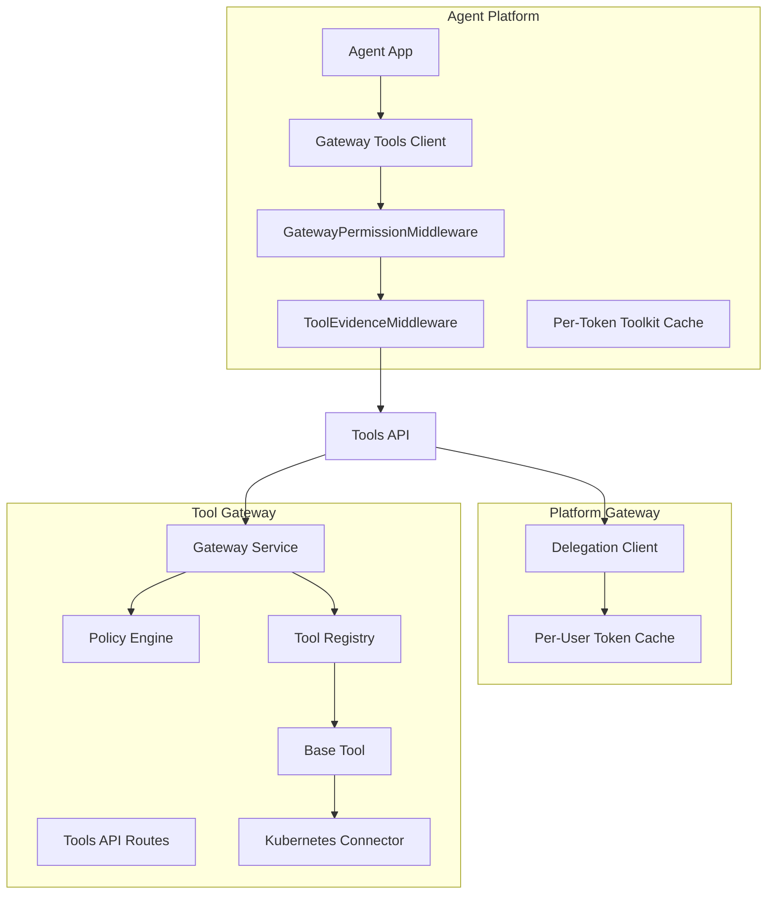
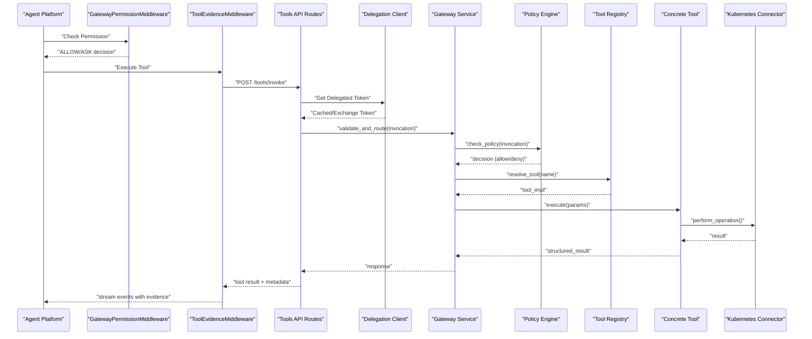
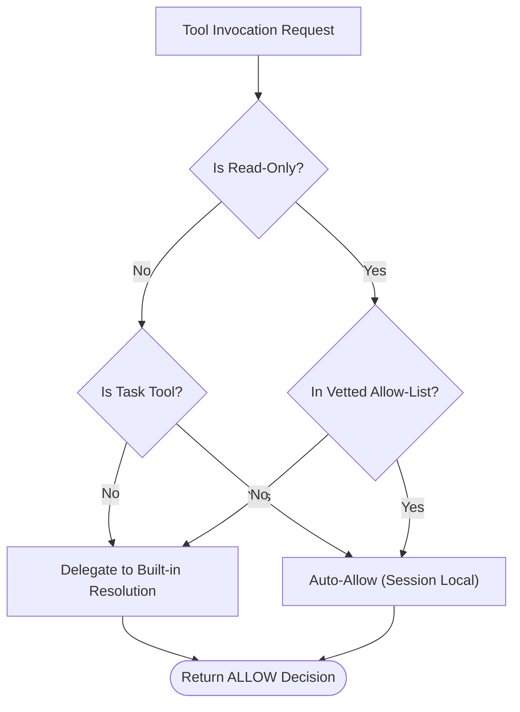
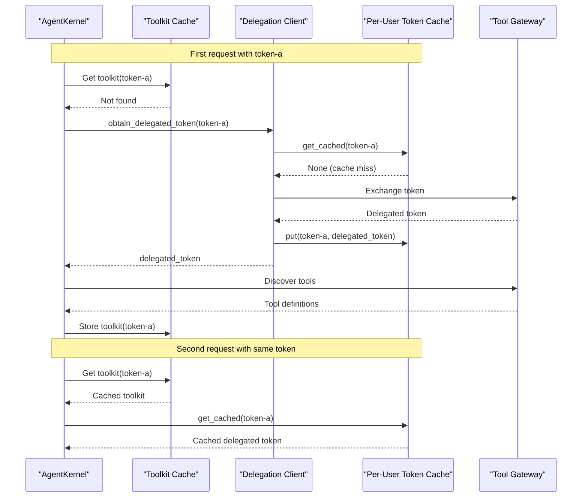
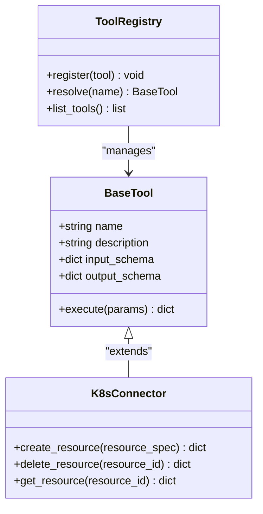
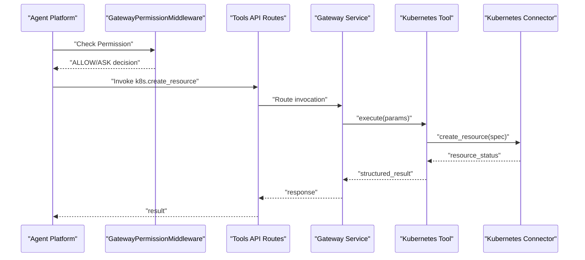
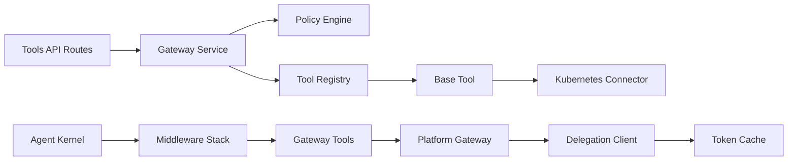

# Tool Execution Framework

<cite>
**Referenced Files in This Document**
- [SPEC-007-tool-execution-framework/spec.md](file://docs/specs/SPEC-007-tool-execution-framework/spec.md)
- [kernel_middleware.py](file://products/agent-platform/src/agent_service/services/kernel_middleware.py)
- [gateway_tools.py](file://products/agent-platform/src/agent_service/tools/gateway_tools.py)
- [runtime_kernel.py](file://products/agent-platform/src/agent_service/runtime_kernel.py)
- [delegation_client.py](file://products/platform-gateway/src/platform_gateway/services/delegation_client.py)
- [test_kernel_middleware.py](file://products/agent-platform/tests/test_kernel_middleware.py)
- [test_runtime_kernel.py](file://products/agent-platform/tests/test_runtime_kernel.py)
- [tool-invocation.schema.json](file://shared/shared-contracts/schemas/tool-invocation.schema.json)
- [tool-result.schema.json](file://shared/shared-contracts/schemas/tool-result.schema.json)
</cite>

## Update Summary
**Changes Made**
- Updated permission handling architecture from GatewayFunctionTool subclass overrides to middleware-based approach using GatewayPermissionMiddleware
- Enhanced toolkit caching with per-token isolation and context-aware token delegation support
- Improved security model with dual-layer automatic approval (read-only status AND explicit allow-list membership)
- Added comprehensive token delegation support through platform gateway with per-user caching
- Updated agent-side tool execution to use function-based tools with middleware-based permission control

## Table of Contents
1. [Introduction](#introduction)
2. [Project Structure](#project-structure)
3. [Core Components](#core-components)
4. [Architecture Overview](#architecture-overview)
5. [Detailed Component Analysis](#detailed-component-analysis)
6. [Dependency Analysis](#dependency-analysis)
7. [Performance Considerations](#performance-considerations)
8. [Troubleshooting Guide](#troubleshooting-guide)
9. [Conclusion](#conclusion)
10. [Appendices](#appendices)

## Introduction
This document explains the tool execution framework that enables agents to discover, register, and invoke tools through a centralized tool gateway. The framework has been updated to use a middleware-based architecture for permission handling, improved toolkit caching with per-token isolation, and enhanced token delegation support. It covers the end-to-end invocation protocol, parameter passing, result handling, security and policy enforcement, sandboxing considerations, audit logging, performance optimization (caching and timeouts), and practical examples for integrating with the tool gateway and executing Kubernetes operations.

The framework implements a sophisticated dual-layer security model where automatic tool approval requires both read-only status AND explicit membership in a vetted allow-list, addressing CWE-862 privilege management vulnerabilities while maintaining operational efficiency.

## Project Structure
The tool execution framework spans two primary services with an updated middleware-based architecture:
- Agent Platform: Provides agent-side tool bindings, middleware-based permission handling, and client utilities to call the tool gateway.
- Tool Gateway: Implements tool discovery, registration, policy enforcement, execution, and result serialization.



**Diagram sources**
- [kernel_middleware.py](file://products/agent-platform/src/agent_service/services/kernel_middleware.py)
- [gateway_tools.py](file://products/agent-platform/src/agent_service/tools/gateway_tools.py)
- [runtime_kernel.py](file://products/agent-platform/src/agent_service/runtime_kernel.py)
- [delegation_client.py](file://products/platform-gateway/src/platform_gateway/services/delegation_client.py)

**Section sources**
- [SPEC-007-tool-execution-framework/spec.md](file://docs/specs/SPEC-007-tool-execution-framework/spec.md)

## Core Components
- **Middleware-Based Permission Handling**: The system now uses `GatewayPermissionMiddleware` to pre-answer AgentScope's permission gate for headless streams, allowing vetted read-only tools to bypass interactive confirmation.
- **Enhanced Toolkit Caching**: Per-token toolkit caching ensures tool discovery runs once per user token while closures read current tokens at call time for token refresh support.
- **Token Delegation Support**: Platform gateway exchanges verified user tokens for short-lived delegated tokens with per-user caching for improved performance.
- **Tool Discovery and Registration**: The tool registry exposes available tools and their schemas. Agents can query capabilities before invoking.
- **Policy Enforcement**: Before execution, requests are validated against policies to ensure authorization and safety constraints.
- **Execution Layer**: Concrete tool implementations execute actions (e.g., Kubernetes operations) via connectors.
- **Result Handling**: Responses are serialized according to the shared schema and include metadata for observability.

Key responsibilities:
- Agent-side client constructs invocations using typed parameters and handles retries/timeouts.
- Middleware stack handles permissions and evidence emission without requiring tool subclass overrides.
- Gateway routes validate payloads, enforce policies, resolve tool implementations, and orchestrate execution.
- Connectors encapsulate external system interactions (e.g., Kubernetes API).

**Section sources**
- [kernel_middleware.py](file://products/agent-platform/src/agent_service/services/kernel_middleware.py)
- [gateway_tools.py](file://products/agent-platform/src/agent_service/tools/gateway_tools.py)
- [runtime_kernel.py](file://products/agent-platform/src/agent_service/runtime_kernel.py)
- [delegation_client.py](file://products/platform-gateway/src/platform_gateway/services/delegation_client.py)
- [tool-invocation.schema.json](file://shared/shared-contracts/schemas/tool-invocation.schema.json)
- [tool-result.schema.json](file://shared/shared-contracts/schemas/tool-result.schema.json)

## Architecture Overview
The tool execution flow is designed around a clear separation of concerns with middleware-based architecture:
- Agent Platform uses middleware to handle permissions and evidence, with function-based tools that delegate to the gateway.
- Platform Gateway provides token delegation with per-user caching for improved performance.
- Tool Gateway validates and enforces policies, resolves tools, executes them, and returns structured results.
- External systems are accessed via connectors, ensuring isolation and controlled access.



**Diagram sources**
- [kernel_middleware.py](file://products/agent-platform/src/agent_service/services/kernel_middleware.py)
- [gateway_tools.py](file://products/agent-platform/src/agent_service/tools/gateway_tools.py)
- [runtime_kernel.py](file://products/agent-platform/src/agent_service/runtime_kernel.py)
- [delegation_client.py](file://products/platform-gateway/src/platform_gateway/services/delegation_client.py)

## Detailed Component Analysis

### Middleware-Based Permission Handling
**Updated** Replaced GatewayFunctionTool subclass overrides with middleware-based approach

The system now uses `GatewayPermissionMiddleware` to handle permission decisions at the kernel level rather than requiring tool-specific subclass implementations. This approach provides several benefits:

1. **Centralized Permission Logic**: All permission handling is consolidated in one middleware class
2. **Headless Stream Support**: Pre-answers AgentScope's permission gate for vetted tools, preventing stalls in headless SSE streams
3. **Dual-Layer Security**: Requires both read-only status AND explicit allow-list membership for automatic approval
4. **Task Tool Bypass**: Built-in task tools (TaskCreate, TaskGet, TaskList, TaskUpdate) are always allowed as they only mutate session-local state



**Diagram sources**
- [kernel_middleware.py](file://products/agent-platform/src/agent_service/services/kernel_middleware.py)

**Section sources**
- [kernel_middleware.py](file://products/agent-platform/src/agent_service/services/kernel_middleware.py)
- [test_kernel_middleware.py](file://products/agent-platform/tests/test_kernel_middleware.py)

### Enhanced Toolkit Caching and Token Delegation
**Updated** Implemented per-token toolkit caching with context-aware token delegation

The toolkit system now features sophisticated caching and token delegation:

1. **Per-Token Toolkit Cache**: Each user's delegated token gets its own cached toolkit, preventing cross-session token leakage
2. **Context-Aware Token Reading**: Tool closures read the current token from `DELEGATED_TOKEN` context variable at call time, supporting token refresh scenarios
3. **Per-User Token Caching**: Platform gateway caches delegated tokens per user subject with automatic refresh before expiry
4. **Graceful Degradation**: Empty discovery results are not cached, allowing retry on subsequent attempts



**Diagram sources**
- [runtime_kernel.py](file://products/agent-platform/src/agent_service/runtime_kernel.py)
- [delegation_client.py](file://products/platform-gateway/src/platform_gateway/services/delegation_client.py)
- [gateway_tools.py](file://products/agent-platform/src/agent_service/tools/gateway_tools.py)

**Section sources**
- [runtime_kernel.py](file://products/agent-platform/src/agent_service/runtime_kernel.py)
- [delegation_client.py](file://products/platform-gateway/src/platform_gateway/services/delegation_client.py)
- [gateway_tools.py](file://products/agent-platform/src/agent_service/tools/gateway_tools.py)
- [test_runtime_kernel.py](file://products/agent-platform/tests/test_runtime_kernel.py)

### Tool Discovery and Registration
- The registry maintains a map of tool names to implementations and associated schemas.
- Tools are registered at startup or dynamically if supported by configuration.
- Discovery endpoints expose tool metadata (name, description, input schema, output schema).

Implementation highlights:
- Centralized registry object holds tool definitions.
- Each tool implements a common interface defined by the base class.
- Schema validation ensures consistent parameter shapes across tools.



**Diagram sources**
- [base.py](file://products/tool-gateway/src/api_gateway/tools/base.py)
- [registry.py](file://products/tool-gateway/src/api_gateway/tools/registry.py)
- [k8s_connector.py](file://products/tool-gateway/src/api_gateway/tools/k8s_connector.py)

**Section sources**
- [registry.py](file://products/tool-gateway/src/api_gateway/tools/registry.py)
- [base.py](file://products/tool-gateway/src/api_gateway/tools/base.py)

### Tool Invocation Protocol
- Agents send an invocation request containing tool name, parameters, and optional context (e.g., identity, session).
- The gateway validates the payload against the tool's input schema.
- After execution, the gateway returns a structured result including status, data, and error details when applicable.

Contract references:
- Invocation schema defines required fields and types.
- Result schema standardizes success/failure responses and metadata.


**Diagram sources**
- [tools.py](file://products/tool-gateway/src/api_gateway/api/routes/tools.py)
- [gateway_service.py](file://products/tool-gateway/src/api_gateway/services/gateway_service.py)
- [policy_engine.py](file://products/tool-gateway/src/api_gateway/services/policy_engine.py)
- [tool-invocation.schema.json](file://shared/shared-contracts/schemas/tool-invocation.schema.json)
- [tool-result.schema.json](file://shared/shared-contracts/schemas/tool-result.schema.json)

**Section sources**
- [tools.py](file://products/tool-gateway/src/api_gateway/api/routes/tools.py)
- [gateway_service.py](file://products/tool-gateway/src/api_gateway/services/gateway_service.py)
- [tool-invocation.schema.json](file://shared/shared-contracts/schemas/tool-invocation.schema.json)
- [tool-result.schema.json](file://shared/shared-contracts/schemas/tool-result.schema.json)

### Integrating With the Tool Gateway (Agent-Side)
**Updated** Enhanced with middleware-based permission handling and improved toolkit caching

The agent platform now uses function-based tools with middleware-based permission control:

1. **Function-Based Tools**: Tools are created as simple async functions wrapped in `FunctionTool` objects, eliminating the need for complex subclass implementations
2. **Middleware Stack**: `GatewayPermissionMiddleware` handles permission decisions while `ToolEvidenceMiddleware` emits evidence frames
3. **Context-Aware Token Delegation**: Tools read the current delegated token from context variables, supporting token refresh scenarios
4. **Per-Token Toolkit Caching**: Each user's toolkit is cached separately to prevent token leakage between sessions

Best practices:
- Use typed parameter builders to avoid schema mismatches.
- Configure timeouts per tool category (fast vs. long-running).
- Implement exponential backoff for transient failures.
- Leverage middleware-based permission handling for consistent security behavior.

**Section sources**
- [gateway_tools.py](file://products/agent-platform/src/agent_service/tools/gateway_tools.py)
- [kernel_middleware.py](file://products/agent-platform/src/agent_service/services/kernel_middleware.py)

### Executing Kubernetes Operations
- Kubernetes operations are implemented as concrete tools backed by a connector.
- The connector abstracts Kubernetes API calls and normalizes responses.
- Typical operations include create, delete, get, and update resources.

Security considerations:
- Use least-privilege service accounts and RBAC rules.
- Scope operations to namespaces where appropriate.
- Validate resource specs before sending to the cluster.



**Diagram sources**
- [k8s_connector.py](file://products/tool-gateway/src/api_gateway/tools/k8s_connector.py)
- [tools.py](file://products/tool-gateway/src/api_gateway/api/routes/tools.py)
- [gateway_service.py](file://products/tool-gateway/src/api_gateway/services/gateway_service.py)

**Section sources**
- [k8s_connector.py](file://products/tool-gateway/src/api_gateway/tools/k8s_connector.py)

### Handling Tool Errors
- Errors are categorized into validation errors, policy denials, execution failures, and upstream connectivity issues.
- The gateway formats errors consistently with status codes, messages, and diagnostic metadata.
- Agents should handle specific error types and implement recovery strategies (retry, fallback, alert).

Recommendations:
- Log structured error events with correlation IDs.
- Surface actionable messages to callers while avoiding sensitive details.
- Track error rates and latency for observability.

**Section sources**
- [tools.py](file://products/tool-gateway/src/api_gateway/api/routes/tools.py)
- [gateway_service.py](file://products/tool-gateway/src/api_gateway/services/gateway_service.py)

### Security Considerations and Sandboxing
**Updated** Enhanced with middleware-based permission handling and improved token delegation security

The security model implements a comprehensive multi-layered approach with middleware-based permission control:

#### Middleware-Based Permission Architecture
The new architecture replaces tool-specific subclass implementations with a centralized middleware approach:

1. **GatewayPermissionMiddleware**: Handles all permission decisions at the kernel level
2. **ToolEvidenceMiddleware**: Emits standardized evidence frames for audit and observability
3. **Default Deny Policy**: Only explicitly vetted tools receive automatic approval

#### Dual-Layer Automatic Approval System
Automatic tool approval requires BOTH conditions to be met:

1. **Read-Only Status**: Tool must have `risk_level = "read"` 
2. **Explicit Allow-List Membership**: Tool must be in the vetted allow-list

#### Default Vetted Allow-List
The system includes a hardcoded frozenset of approved read-only tools:

```python
DEFAULT_AUTO_ALLOWED_TOOLS = frozenset({
    "k8s.list_pods",
    "k8s.get_pod",
    "k8s.get_events",
    "k8s.get_pod_logs",
    "skills.search",
    "skills.get",
    "skills.list",
    "incidents.list",
    "incidents.get",
})
```

#### Deployment-Specific Customization
Organizations can override the default allow-list using the `AGENT_GATEWAY_TOOL_AUTO_ALLOW` environment variable:

```bash
# Override with custom allow-list
export AGENT_GATEWAY_TOOL_AUTO_ALLOW="k8s.list_pods,k8s.get_pod"

# Disable all automatic approvals
export AGENT_GATEWAY_TOOL_AUTO_ALLOW=""
```

#### Enhanced Token Delegation Security
The platform gateway provides secure token delegation with:

1. **Per-User Token Caching**: Delegated tokens are cached per user subject with automatic refresh
2. **Short-Lived Tokens**: Delegated tokens have limited TTL to minimize exposure
3. **Audience Binding**: Tokens are bound to specific audiences to prevent replay attacks
4. **Graceful Degradation**: Token delegation failures don't break chat functionality

#### Mitigation of CWE-862 Privilege Management Vulnerabilities
The implementation addresses privilege escalation risks by:

- **Principle of Least Privilege**: Only explicitly vetted tools receive automatic approval
- **Defense in Depth**: Multiple security layers prevent bypass attempts  
- **Audit Trail**: All tool invocations are logged with full context
- **Separation of Concerns**: Middleware-based permissions are independent from gateway policies

#### Sandboxing Recommendations
- Run tool executors in isolated processes or containers
- Limit CPU/memory quotas and network egress
- Use capability whitelisting for external system access
- Implement network segmentation for sensitive operations

#### Audit Logging
- Record invocation metadata, decisions, and outcomes
- Include identity context and policy decision details
- Ensure logs are tamper-evident and retained per compliance requirements
- Track permission check results for security analysis

**Section sources**
- [kernel_middleware.py](file://products/agent-platform/src/agent_service/services/kernel_middleware.py)
- [delegation_client.py](file://products/platform-gateway/src/platform_gateway/services/delegation_client.py)
- [test_kernel_middleware.py](file://products/agent-platform/tests/test_kernel_middleware.py)

### Performance Optimization
**Updated** Enhanced with improved toolkit caching and token delegation caching

- **Caching strategies**:
  - Per-token toolkit caching prevents redundant tool discovery
  - Per-user delegated token caching reduces authentication overhead
  - Cache invalidation based on token expiry and refresh windows
- **Timeout handling**:
  - Set per-operation timeouts; fail fast on slow dependencies.
  - Implement circuit breakers for upstream services.
- **Concurrency control**:
  - Rate-limit tool invocations to protect downstream systems.
  - Queue long-running tasks asynchronously when appropriate.

[No sources needed since this section provides general guidance]

## Dependency Analysis
The tool execution framework exhibits clear layering with middleware-based architecture:
- API routes depend on the gateway service for orchestration.
- Gateway service depends on policy engine and tool registry.
- Agent platform uses middleware stack for permissions and evidence.
- Platform gateway provides token delegation with caching.
- Tool registry manages base tool implementations.
- Concrete tools depend on connectors for external system access.



**Diagram sources**
- [tools.py](file://products/tool-gateway/src/api_gateway/api/routes/tools.py)
- [gateway_service.py](file://products/tool-gateway/src/api_gateway/services/gateway_service.py)
- [policy_engine.py](file://products/tool-gateway/src/api_gateway/services/policy_engine.py)
- [registry.py](file://products/tool-gateway/src/api_gateway/tools/registry.py)
- [base.py](file://products/tool-gateway/src/api_gateway/tools/base.py)
- [k8s_connector.py](file://products/tool-gateway/src/api_gateway/tools/k8s_connector.py)
- [kernel_middleware.py](file://products/agent-platform/src/agent_service/services/kernel_middleware.py)
- [delegation_client.py](file://products/platform-gateway/src/platform_gateway/services/delegation_client.py)

**Section sources**
- [tools.py](file://products/tool-gateway/src/api_gateway/api/routes/tools.py)
- [gateway_service.py](file://products/tool-gateway/src/api_gateway/services/gateway_service.py)
- [policy_engine.py](file://products/tool-gateway/src/api_gateway/services/policy_engine.py)
- [registry.py](file://products/tool-gateway/src/api_gateway/tools/registry.py)
- [base.py](file://products/tool-gateway/src/api_gateway/tools/base.py)
- [k8s_connector.py](file://products/tool-gateway/src/api_gateway/tools/k8s_connector.py)
- [kernel_middleware.py](file://products/agent-platform/src/agent_service/services/kernel_middleware.py)
- [delegation_client.py](file://products/platform-gateway/src/platform_gateway/services/delegation_client.py)

## Performance Considerations
- Prefer idempotent operations where possible to simplify retries.
- Batch operations when supported by downstream systems.
- Monitor p95/p99 latencies and error budgets; adjust timeouts accordingly.
- Use connection pooling for external APIs.
- Profile tool execution paths to identify hotspots.
- Leverage per-token toolkit caching to reduce discovery overhead.
- Utilize per-user token delegation caching to minimize authentication calls.

[No sources needed since this section provides general guidance]

## Troubleshooting Guide
Common issues and resolutions:
- Validation errors: Check input schema alignment and required fields.
- Policy denials: Review policy rules and identity context.
- Upstream failures: Inspect connector logs and health checks.
- Timeouts: Increase timeouts cautiously; investigate slow dependencies.
- Permission blocks: Verify tool is in vetted allow-list and marked as read-only.
- Toolkit caching issues: Check per-token cache isolation and token refresh scenarios.
- Token delegation failures: Verify platform gateway configuration and credential setup.

Debugging steps:
- Enable detailed request tracing with correlation IDs.
- Verify tool registration and availability.
- Confirm policy decisions and audit logs.
- Reproduce with minimal payloads to isolate issues.
- Check `AGENT_GATEWAY_TOOL_AUTO_ALLOW` environment variable configuration.
- Validate middleware stack composition and order.
- Inspect per-token toolkit cache entries and token delegation cache hits/misses.

**Section sources**
- [tools.py](file://products/tool-gateway/src/api_gateway/api/routes/tools.py)
- [gateway_service.py](file://products/tool-gateway/src/api_gateway/services/gateway_service.py)
- [policy_engine.py](file://products/tool-gateway/src/api_gateway/services/policy_engine.py)
- [kernel_middleware.py](file://products/agent-platform/src/agent_service/services/kernel_middleware.py)
- [delegation_client.py](file://products/platform-gateway/src/platform_gateway/services/delegation_client.py)

## Conclusion
The tool execution framework provides a robust, secure, and observable mechanism for agents to invoke tools through a centralized gateway. The updated middleware-based architecture replaces complex tool subclass implementations with a centralized permission handling approach, while enhanced toolkit caching and token delegation support improve performance and security. By implementing dual-layer security with vetted allow-lists, enforcing policies through middleware, isolating external interactions via connectors, and providing sophisticated caching mechanisms, the system ensures safe and efficient tool execution. The middleware-based approach addresses privilege management vulnerabilities while maintaining operational efficiency through intelligent automatic approval of trusted read-only operations. Proper caching, timeouts, auditing, and token delegation further enhance reliability and performance.

[No sources needed since this section summarizes without analyzing specific files]

## Appendices
- Contract schemas:
  - Tool invocation schema defines request structure and fields.
  - Tool result schema defines response structure and metadata.

**Section sources**
- [tool-invocation.schema.json](file://shared/shared-contracts/schemas/tool-invocation.schema.json)
- [tool-result.schema.json](file://shared/shared-contracts/schemas/tool-result.schema.json)