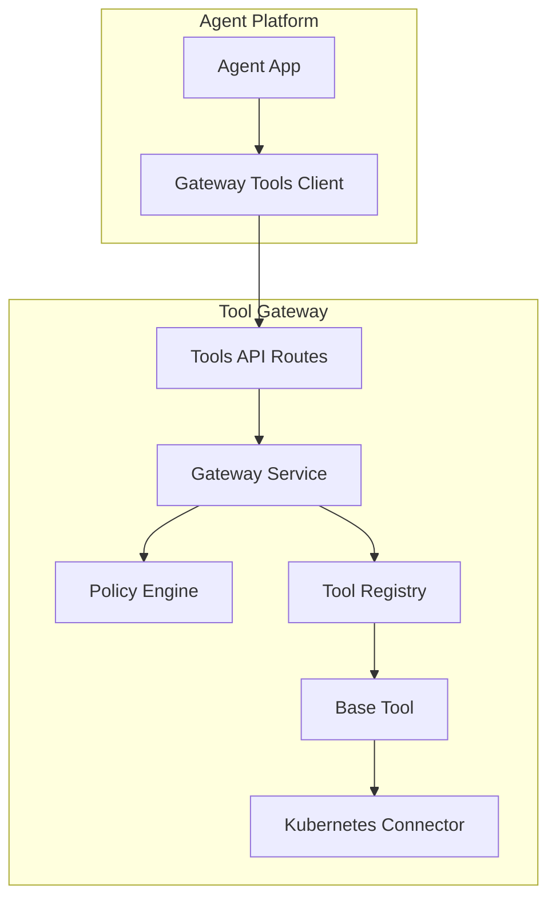
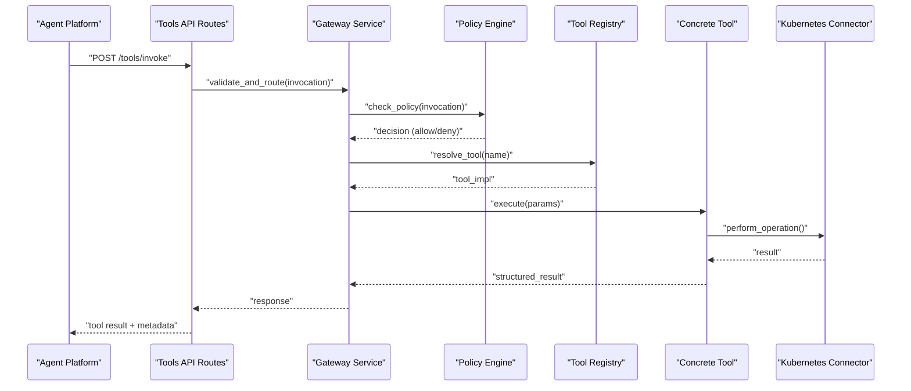
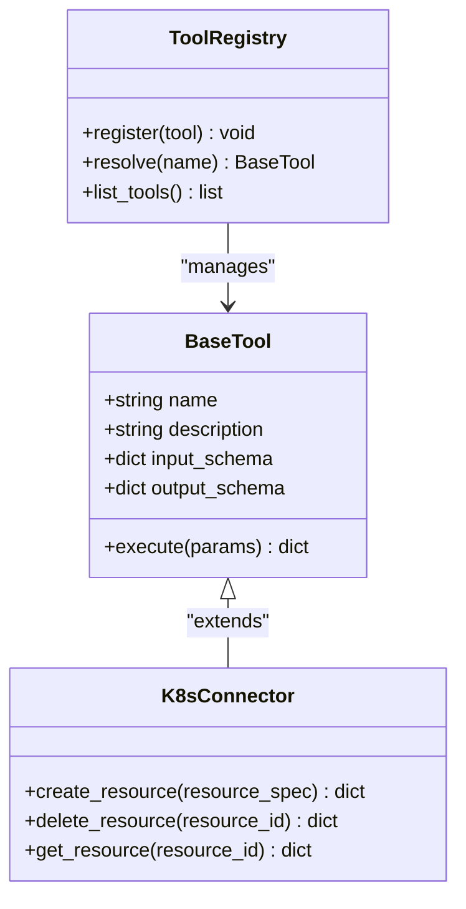
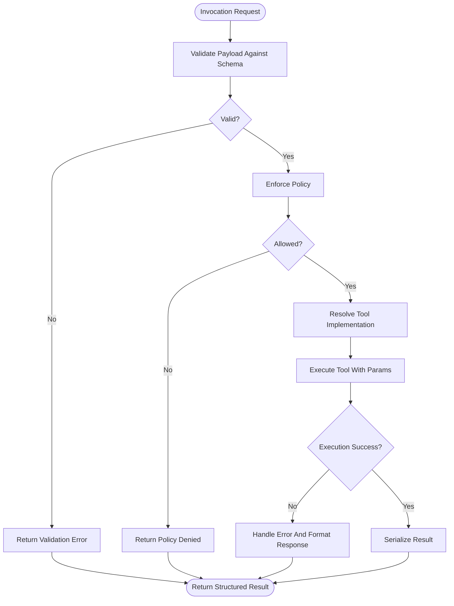
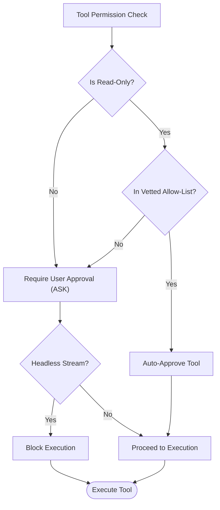
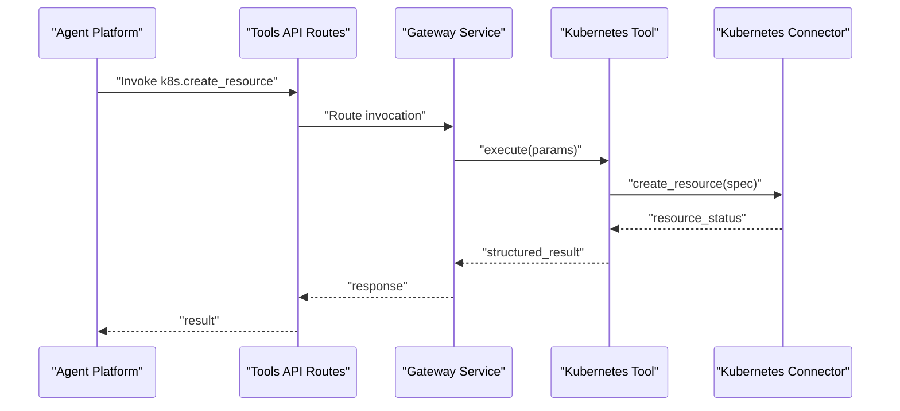
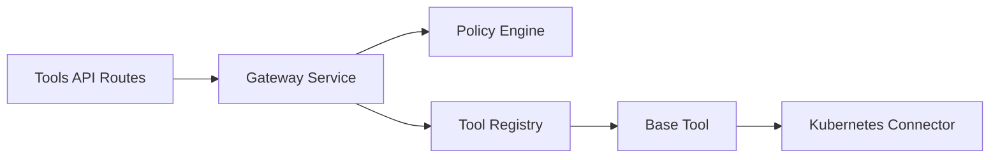

# Tool Execution Framework

<cite>
**Referenced Files in This Document**
- [SPEC-007-tool-execution-framework/spec.md](file://docs/specs/SPEC-007-tool-execution-framework/spec.md)
- [gateway_tools.py](file://products/agent-platform/src/agent_service/tools/gateway_tools.py)
- [base.py](file://products/tool-gateway/src/api_gateway/tools/base.py)
- [registry.py](file://products/tool-gateway/src/api_gateway/tools/registry.py)
- [k8s_connector.py](file://products/tool-gateway/src/api_gateway/tools/k8s_connector.py)
- [tools.py](file://products/tool-gateway/src/api_gateway/api/routes/tools.py)
- [gateway_service.py](file://products/tool-gateway/src/api_gateway/services/gateway_service.py)
- [policy_engine.py](file://products/tool-gateway/src/api_gateway/services/policy_engine.py)
- [tool-invocation.schema.json](file://shared/shared-contracts/schemas/tool-invocation.schema.json)
- [tool-result.schema.json](file://shared/shared-contracts/schemas/tool-result.schema.json)
- [policy-default.yaml](file://products/tool-gateway/src/tool_gateway/policies/policy-default.yaml)
</cite>

## Update Summary
**Changes Made**
- Enhanced Security Considerations section with vetted allow-list mechanism
- Added documentation for DEFAULT_AUTO_ALLOWED_TOOLS frozenset and AGENT_GATEWAY_TOOL_AUTO_ALLOW environment variable
- Updated security model to explain dual-layer protection (read-only status AND explicit allow-list membership)
- Added CWE-862 privilege management vulnerability mitigation details
- Updated policy enforcement flow to include automatic approval gates

## Table of Contents
1. [Introduction](#introduction)
2. [Project Structure](#project-structure)
3. [Core Components](#core-components)
4. [Architecture Overview](#architecture-overview)
5. [Detailed Component Analysis](#detailed-component-analysis)
6. [Dependency Analysis](#dependency-analysis)
7. [Performance Considerations](#performance-considerations)
8. [Troubleshooting Guide](#troubleshooting-guide)
9. [Conclusion](#conclusion)
10. [Appendices](#appendices)

## Introduction
This document explains the tool execution framework that enables agents to discover, register, and invoke tools through a centralized tool gateway. It covers the end-to-end invocation protocol, parameter passing, result handling, security and policy enforcement, sandboxing considerations, audit logging, performance optimization (caching and timeouts), and practical examples for integrating with the tool gateway and executing Kubernetes operations.

The framework implements a dual-layer security model where automatic tool approval requires both read-only status AND explicit membership in a vetted allow-list, addressing CWE-862 privilege management vulnerabilities.

## Project Structure
The tool execution framework spans two primary services:
- Agent Platform: Provides agent-side tool bindings and client utilities to call the tool gateway.
- Tool Gateway: Implements tool discovery, registration, policy enforcement, execution, and result serialization.



**Diagram sources**
- [gateway_tools.py](file://products/agent-platform/src/agent_service/tools/gateway_tools.py)
- [tools.py](file://products/tool-gateway/src/api_gateway/api/routes/tools.py)
- [gateway_service.py](file://products/tool-gateway/src/api_gateway/services/gateway_service.py)
- [policy_engine.py](file://products/tool-gateway/src/api_gateway/services/policy_engine.py)
- [registry.py](file://products/tool-gateway/src/api_gateway/tools/registry.py)
- [base.py](file://products/tool-gateway/src/api_gateway/tools/base.py)
- [k8s_connector.py](file://products/tool-gateway/src/api_gateway/tools/k8s_connector.py)

**Section sources**
- [SPEC-007-tool-execution-framework/spec.md](file://docs/specs/SPEC-007-tool-execution-framework/spec.md)

## Core Components
- Tool Discovery and Registration: The tool registry exposes available tools and their schemas. Agents can query capabilities before invoking.
- Tool Invocation Protocol: A standardized request/response contract defines how agents call tools and receive results.
- Policy Enforcement: Before execution, requests are validated against policies to ensure authorization and safety constraints.
- Execution Layer: Concrete tool implementations execute actions (e.g., Kubernetes operations) via connectors.
- Result Handling: Responses are serialized according to the shared schema and include metadata for observability.

Key responsibilities:
- Agent-side client constructs invocations using typed parameters and handles retries/timeouts.
- Gateway routes validate payloads, enforce policies, resolve tool implementations, and orchestrate execution.
- Connectors encapsulate external system interactions (e.g., Kubernetes API).

**Section sources**
- [registry.py](file://products/tool-gateway/src/api_gateway/tools/registry.py)
- [tools.py](file://products/tool-gateway/src/api_gateway/api/routes/tools.py)
- [gateway_service.py](file://products/tool-gateway/src/api_gateway/services/gateway_service.py)
- [policy_engine.py](file://products/tool-gateway/src/api_gateway/services/policy_engine.py)
- [base.py](file://products/tool-gateway/src/api_gateway/tools/base.py)
- [k8s_connector.py](file://products/tool-gateway/src/api_gateway/tools/k8s_connector.py)
- [tool-invocation.schema.json](file://shared/shared-contracts/schemas/tool-invocation.schema.json)
- [tool-result.schema.json](file://shared/shared-contracts/schemas/tool-result.schema.json)

## Architecture Overview
The tool execution flow is designed around a clear separation of concerns:
- Agent Platform uses a lightweight client to build tool invocations.
- Tool Gateway validates and enforces policies, resolves tools, executes them, and returns structured results.
- External systems are accessed via connectors, ensuring isolation and controlled access.



**Diagram sources**
- [tools.py](file://products/tool-gateway/src/api_gateway/api/routes/tools.py)
- [gateway_service.py](file://products/tool-gateway/src/api_gateway/services/gateway_service.py)
- [policy_engine.py](file://products/tool-gateway/src/api_gateway/services/policy_engine.py)
- [registry.py](file://products/tool-gateway/src/api_gateway/tools/registry.py)
- [base.py](file://products/tool-gateway/src/api_gateway/tools/base.py)
- [k8s_connector.py](file://products/tool-gateway/src/api_gateway/tools/k8s_connector.py)

## Detailed Component Analysis

### Tool Discovery and Registration
- The registry maintains a map of tool names to implementations and associated schemas.
- Tools are registered at startup or dynamically if supported by configuration.
- Discovery endpoints expose tool metadata (name, description, input schema, output schema).

Implementation highlights:
- Centralized registry object holds tool definitions.
- Each tool implements a common interface defined by the base class.
- Schema validation ensures consistent parameter shapes across tools.



**Diagram sources**
- [base.py](file://products/tool-gateway/src/api_gateway/tools/base.py)
- [registry.py](file://products/tool-gateway/src/api_gateway/tools/registry.py)
- [k8s_connector.py](file://products/tool-gateway/src/api_gateway/tools/k8s_connector.py)

**Section sources**
- [registry.py](file://products/tool-gateway/src/api_gateway/tools/registry.py)
- [base.py](file://products/tool-gateway/src/api_gateway/tools/base.py)

### Tool Invocation Protocol
- Agents send an invocation request containing tool name, parameters, and optional context (e.g., identity, session).
- The gateway validates the payload against the tool's input schema.
- After execution, the gateway returns a structured result including status, data, and error details when applicable.

Contract references:
- Invocation schema defines required fields and types.
- Result schema standardizes success/failure responses and metadata.



**Diagram sources**
- [tools.py](file://products/tool-gateway/src/api_gateway/api/routes/tools.py)
- [gateway_service.py](file://products/tool-gateway/src/api_gateway/services/gateway_service.py)
- [policy_engine.py](file://products/tool-gateway/src/api_gateway/services/policy_engine.py)
- [tool-invocation.schema.json](file://shared/shared-contracts/schemas/tool-invocation.schema.json)
- [tool-result.schema.json](file://shared/shared-contracts/schemas/tool-result.schema.json)

**Section sources**
- [tools.py](file://products/tool-gateway/src/api_gateway/api/routes/tools.py)
- [gateway_service.py](file://products/tool-gateway/src/api_gateway/services/gateway_service.py)
- [tool-invocation.schema.json](file://shared/shared-contracts/schemas/tool-invocation.schema.json)
- [tool-result.schema.json](file://shared/shared-contracts/schemas/tool-result.schema.json)

### Integrating With the Tool Gateway (Agent-Side)
- The agent platform includes a client module that constructs invocations and handles HTTP transport.
- It supports retry logic, timeout configuration, and error mapping to domain exceptions.
- Example usage patterns:
  - Discover available tools and select one based on intent.
  - Build a parameter set conforming to the tool's input schema.
  - Invoke the tool and process the structured result.

Best practices:
- Use typed parameter builders to avoid schema mismatches.
- Configure timeouts per tool category (fast vs. long-running).
- Implement exponential backoff for transient failures.

**Updated** Enhanced with vetted allow-list mechanism for automatic tool approval

The agent platform implements a sophisticated permission system that automatically approves certain read-only tools while maintaining strict security controls. The system uses a dual-layer approach:

1. **Read-Only Status Check**: Tools must be marked as read-only (`risk_level = "read"`)
2. **Explicit Allow-List Membership**: Tools must be explicitly listed in the vetted allow-list



**Diagram sources**
- [gateway_tools.py](file://products/agent-platform/src/agent_service/tools/gateway_tools.py)

**Section sources**
- [gateway_tools.py](file://products/agent-platform/src/agent_service/tools/gateway_tools.py)

### Executing Kubernetes Operations
- Kubernetes operations are implemented as concrete tools backed by a connector.
- The connector abstracts Kubernetes API calls and normalizes responses.
- Typical operations include create, delete, get, and update resources.

Security considerations:
- Use least-privilege service accounts and RBAC rules.
- Scope operations to namespaces where appropriate.
- Validate resource specs before sending to the cluster.



**Diagram sources**
- [k8s_connector.py](file://products/tool-gateway/src/api_gateway/tools/k8s_connector.py)
- [tools.py](file://products/tool-gateway/src/api_gateway/api/routes/tools.py)
- [gateway_service.py](file://products/tool-gateway/src/api_gateway/services/gateway_service.py)

**Section sources**
- [k8s_connector.py](file://products/tool-gateway/src/api_gateway/tools/k8s_connector.py)

### Handling Tool Errors
- Errors are categorized into validation errors, policy denials, execution failures, and upstream connectivity issues.
- The gateway formats errors consistently with status codes, messages, and diagnostic metadata.
- Agents should handle specific error types and implement recovery strategies (retry, fallback, alert).

Recommendations:
- Log structured error events with correlation IDs.
- Surface actionable messages to callers while avoiding sensitive details.
- Track error rates and latency for observability.

**Section sources**
- [tools.py](file://products/tool-gateway/src/api_gateway/api/routes/tools.py)
- [gateway_service.py](file://products/tool-gateway/src/api_gateway/services/gateway_service.py)

### Security Considerations and Sandboxing
**Updated** Enhanced with vetted allow-list mechanism addressing CWE-862 privilege management vulnerability

The security model implements a comprehensive multi-layered approach to prevent unauthorized tool execution:

#### Dual-Layer Automatic Approval System
Automatic tool approval requires BOTH conditions to be met:

1. **Read-Only Status**: Tool must have `risk_level = "read"` 
2. **Explicit Allow-List Membership**: Tool must be in the vetted allow-list

#### Default Vetted Allow-List
The system includes a hardcoded frozenset of approved read-only tools:

```python
DEFAULT_AUTO_ALLOWED_TOOLS = frozenset({
    "k8s.list_pods",
    "k8s.get_pod",
    "k8s.get_events",
    "k8s.get_pod_logs",
})
```

#### Deployment-Specific Customization
Organizations can override the default allow-list using the `AGENT_GATEWAY_TOOL_AUTO_ALLOW` environment variable:

```bash
# Override with custom allow-list
export AGENT_GATEWAY_TOOL_AUTO_ALLOW="k8s.list_pods,k8s.get_pod"

# Disable all automatic approvals
export AGENT_GATEWAY_TOOL_AUTO_ALLOW=""
```

#### Policy Enforcement Flow
The enhanced security model follows this evaluation order:

1. **Agent-Side Permission Check**: Verify tool is read-only AND in allow-list
2. **Gateway Admission Control**: Enforce token-based authentication
3. **Policy Engine Evaluation**: Apply organizational policies
4. **Tool Execution**: Execute with proper auditing and monitoring

#### Mitigation of CWE-862 Privilege Management Vulnerabilities
The implementation addresses privilege escalation risks by:

- **Principle of Least Privilege**: Only explicitly vetted tools receive automatic approval
- **Defense in Depth**: Multiple security layers prevent bypass attempts  
- **Audit Trail**: All tool invocations are logged with full context
- **Separation of Concerns**: Agent-side permissions are independent from gateway policies

#### Sandboxing Recommendations
- Run tool executors in isolated processes or containers
- Limit CPU/memory quotas and network egress
- Use capability whitelisting for external system access
- Implement network segmentation for sensitive operations

#### Audit Logging
- Record invocation metadata, decisions, and outcomes
- Include identity context and policy decision details
- Ensure logs are tamper-evident and retained per compliance requirements
- Track permission check results for security analysis

**Section sources**
- [gateway_tools.py](file://products/agent-platform/src/agent_service/tools/gateway_tools.py)
- [policy_engine.py](file://products/tool-gateway/src/tool_gateway/services/policy_engine.py)
- [policy-default.yaml](file://products/tool-gateway/src/tool_gateway/policies/policy-default.yaml)

### Performance Optimization
- Caching strategies:
  - Cache read-only tool results with TTL and invalidation keys.
  - Use distributed cache for cross-instance consistency.
- Timeout handling:
  - Set per-operation timeouts; fail fast on slow dependencies.
  - Implement circuit breakers for upstream services.
- Concurrency control:
  - Rate-limit tool invocations to protect downstream systems.
  - Queue long-running tasks asynchronously when appropriate.

[No sources needed since this section provides general guidance]

## Dependency Analysis
The tool execution framework exhibits clear layering:
- API routes depend on the gateway service for orchestration.
- Gateway service depends on policy engine and tool registry.
- Tool registry manages base tool implementations.
- Concrete tools depend on connectors for external system access.



**Diagram sources**
- [tools.py](file://products/tool-gateway/src/api_gateway/api/routes/tools.py)
- [gateway_service.py](file://products/tool-gateway/src/api_gateway/services/gateway_service.py)
- [policy_engine.py](file://products/tool-gateway/src/api_gateway/services/policy_engine.py)
- [registry.py](file://products/tool-gateway/src/api_gateway/tools/registry.py)
- [base.py](file://products/tool-gateway/src/api_gateway/tools/base.py)
- [k8s_connector.py](file://products/tool-gateway/src/api_gateway/tools/k8s_connector.py)

**Section sources**
- [tools.py](file://products/tool-gateway/src/api_gateway/api/routes/tools.py)
- [gateway_service.py](file://products/tool-gateway/src/api_gateway/services/gateway_service.py)
- [policy_engine.py](file://products/tool-gateway/src/api_gateway/services/policy_engine.py)
- [registry.py](file://products/tool-gateway/src/api_gateway/tools/registry.py)
- [base.py](file://products/tool-gateway/src/api_gateway/tools/base.py)
- [k8s_connector.py](file://products/tool-gateway/src/api_gateway/tools/k8s_connector.py)

## Performance Considerations
- Prefer idempotent operations where possible to simplify retries.
- Batch operations when supported by downstream systems.
- Monitor p95/p99 latencies and error budgets; adjust timeouts accordingly.
- Use connection pooling for external APIs.
- Profile tool execution paths to identify hotspots.

[No sources needed since this section provides general guidance]

## Troubleshooting Guide
Common issues and resolutions:
- Validation errors: Check input schema alignment and required fields.
- Policy denials: Review policy rules and identity context.
- Upstream failures: Inspect connector logs and health checks.
- Timeouts: Increase timeouts cautiously; investigate slow dependencies.
- Permission blocks: Verify tool is in vetted allow-list and marked as read-only.

Debugging steps:
- Enable detailed request tracing with correlation IDs.
- Verify tool registration and availability.
- Confirm policy decisions and audit logs.
- Reproduce with minimal payloads to isolate issues.
- Check `AGENT_GATEWAY_TOOL_AUTO_ALLOW` environment variable configuration.

**Section sources**
- [tools.py](file://products/tool-gateway/src/api_gateway/api/routes/tools.py)
- [gateway_service.py](file://products/tool-gateway/src/api_gateway/services/gateway_service.py)
- [policy_engine.py](file://products/tool-gateway/src/api_gateway/services/policy_engine.py)

## Conclusion
The tool execution framework provides a robust, secure, and observable mechanism for agents to invoke tools through a centralized gateway. By implementing a dual-layer security model with vetted allow-lists, enforcing policies, and isolating external interactions via connectors, the system ensures safe and efficient tool execution. The enhanced security architecture addresses privilege management vulnerabilities while maintaining operational efficiency through intelligent automatic approval of trusted read-only operations. Proper caching, timeouts, and auditing further enhance reliability and performance.

[No sources needed since this section summarizes without analyzing specific files]

## Appendices
- Contract schemas:
  - Tool invocation schema defines request structure and fields.
  - Tool result schema defines response structure and metadata.

**Section sources**
- [tool-invocation.schema.json](file://shared/shared-contracts/schemas/tool-invocation.schema.json)
- [tool-result.schema.json](file://shared/shared-contracts/schemas/tool-result.schema.json)