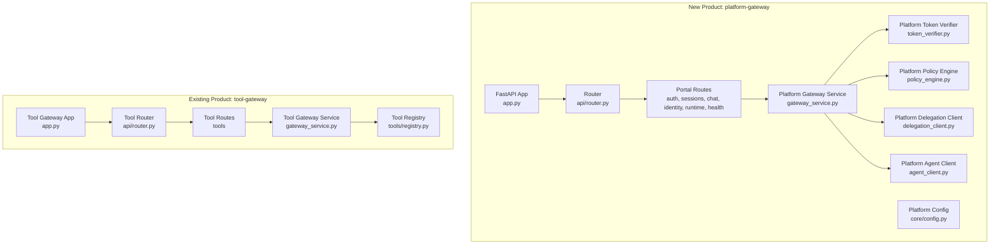
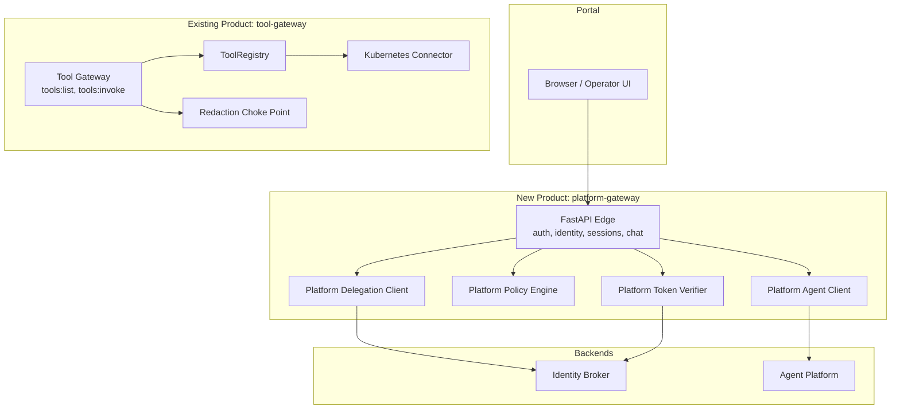
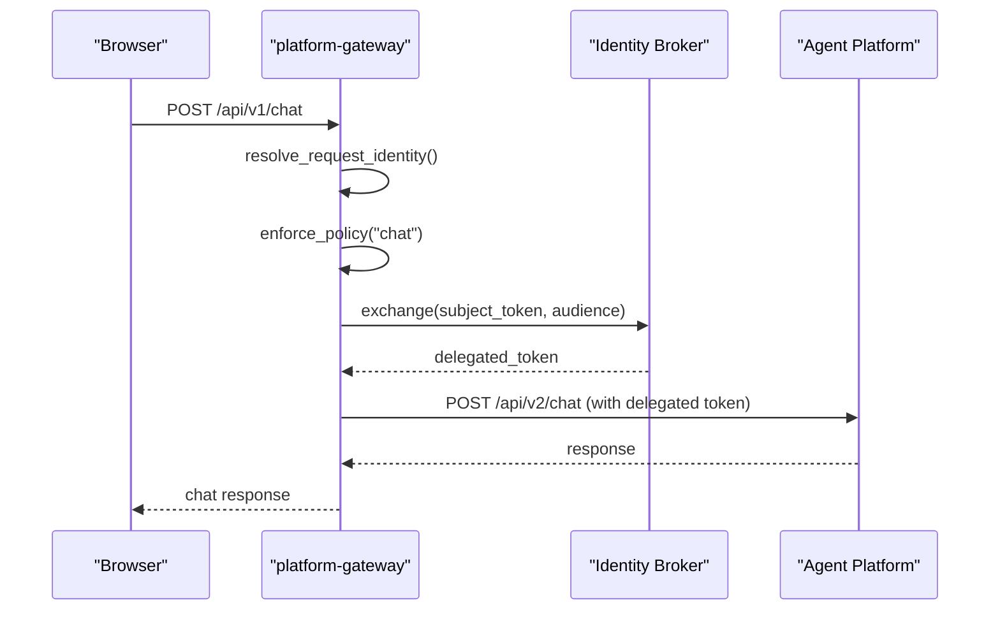
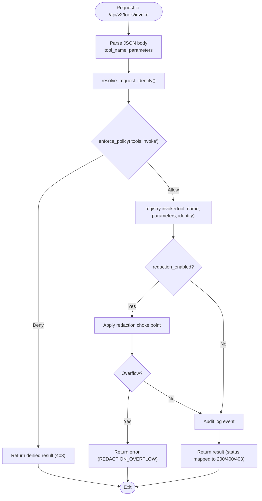
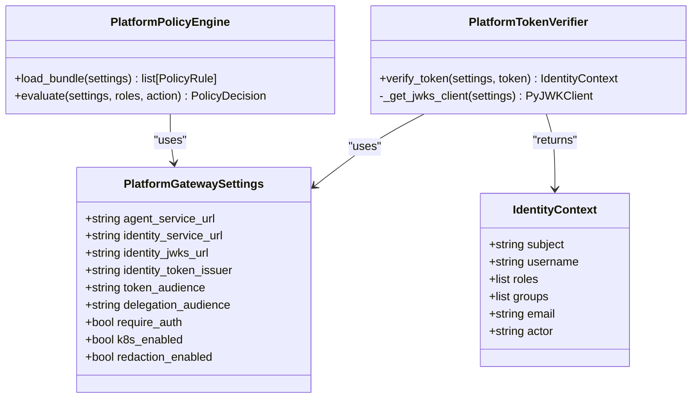
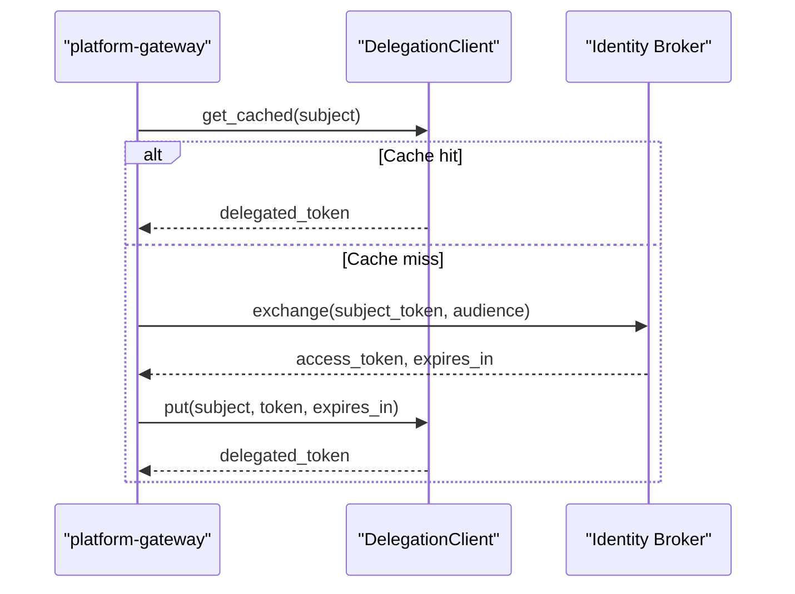
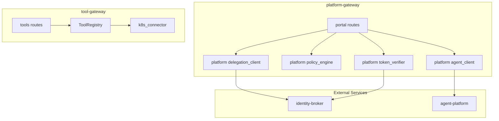

# ADR-0005: Platform Gateway Extraction

<cite>
**Referenced Files in This Document**
- [0005-platform-gateway-extraction.md](file://docs/adr/0005-platform-gateway-extraction.md)
- [spec.md](file://docs/specs/SPEC-010-platform-gateway-extraction/spec.md)
- [app.py](file://products/platform-gateway/src/platform_gateway/app.py)
- [main.py](file://products/platform-gateway/src/platform_gateway/main.py)
- [router.py](file://products/platform-gateway/src/platform_gateway/api/router.py)
- [chat.py](file://products/platform-gateway/src/platform_gateway/api/routes/chat.py)
- [sessions.py](file://products/platform-gateway/src/platform_gateway/api/routes/sessions.py)
- [auth.py](file://products/platform-gateway/src/platform_gateway/api/routes/auth.py)
- [identity.py](file://products/platform-gateway/src/platform_gateway/api/routes/identity.py)
- [runtime.py](file://products/platform-gateway/src/platform_gateway/api/routes/runtime.py)
- [health.py](file://products/platform-gateway/src/platform_gateway/api/routes/health.py)
- [tools.py](file://products/tool-gateway/src/tool_gateway/api/routes/tools.py)
- [gateway_service.py](file://products/platform-gateway/src/platform_gateway/services/gateway_service.py)
- [token_verifier.py](file://products/platform-gateway/src/platform_gateway/services/token_verifier.py)
- [policy_engine.py](file://products/platform-gateway/src/platform_gateway/services/policy_engine.py)
- [delegation_client.py](file://products/platform-gateway/src/platform_gateway/services/delegation_client.py)
- [agent_client.py](file://products/platform-gateway/src/platform_gateway/services/agent_client.py)
- [config.py](file://products/platform-gateway/src/platform_gateway/core/config.py)
- [tool_gw_app.py](file://products/tool-gateway/src/tool_gateway/app.py)
- [tool_gw_router.py](file://products/tool-gateway/src/tool_gateway/api/router.py)
- [tool_gw_gateway_service.py](file://products/tool-gateway/src/tool_gateway/services/gateway_service.py)
- [tool_registry.py](file://products/tool-gateway/src/tool_gateway/tools/registry.py)
- [platform_deployment.yaml](file://shared/platform-ops/gitops/dev-k8s/base/platform-gateway/platform-gateway-deployment.yaml)
- [tool_deployment.yaml](file://shared/platform-ops/gitops/dev-k8s/base/tool-gateway/tool-gateway-deployment.yaml)
</cite>

## Update Summary
**Changes Made**
- Updated all file references to reflect the successful extraction of platform-gateway from tool-gateway
- Revised architecture diagrams to show the new two-product structure
- Updated component analysis to reflect the split between platform-gateway and tool-gateway
- Added deployment configuration details showing both products are now separate services
- Enhanced dependency analysis to show the new service boundaries

## Table of Contents
1. [Introduction](#introduction)
2. [Project Structure](#project-structure)
3. [Core Components](#core-components)
4. [Architecture Overview](#architecture-overview)
5. [Detailed Component Analysis](#detailed-component-analysis)
6. [Dependency Analysis](#dependency-analysis)
7. [Performance Considerations](#performance-considerations)
8. [Troubleshooting Guide](#troubleshooting-guide)
9. [Conclusion](#conclusion)
10. [Appendices](#appendices)

## Introduction
This document records the architectural decision to extract the portal-facing API edge from the existing tool-gateway product into a new platform-gateway product, while retaining the tool execution framework and connectors within tool-gateway. The split aligns ownership with the workspace model, clarifies trust boundaries, and prepares the system for future portal-facing features without expanding the blast radius of security-sensitive code.

**Updated** The implementation has been completed successfully, with platform-gateway now operating as a separate product alongside tool-gateway, maintaining all original functionality while achieving clear separation of concerns.

## Project Structure
The extraction has successfully separated the monolithic tool-gateway into two distinct products:

- **platform-gateway**: Hosts the portal-facing edge (authentication, identity normalization, policy enforcement, chat/session proxying, delegation client)
- **tool-gateway**: Retains the tool execution surface (tool registry, tools:list/invoke routes, redaction choke point, Kubernetes connector)

**Diagram sources**
- [app.py:1-44](file://products/platform-gateway/src/platform_gateway/app.py#L1-L44)
- [router.py:1-12](file://products/platform-gateway/src/platform_gateway/api/router.py#L1-L12)
- [tool_gw_app.py:1-64](file://products/tool-gateway/src/tool_gateway/app.py#L1-L64)
- [tool_gw_router.py:1-8](file://products/tool-gateway/src/tool_gateway/api/router.py#L1-L8)

**Section sources**
- [app.py:1-44](file://products/platform-gateway/src/platform_gateway/app.py#L1-L44)
- [router.py:1-12](file://products/platform-gateway/src/platform_gateway/api/router.py#L1-L12)
- [tool_gw_app.py:1-64](file://products/tool-gateway/src/tool_gateway/app.py#L1-L64)
- [tool_gw_router.py:1-8](file://products/tool-gateway/src/tool_gateway/api/router.py#L1-L8)

## Core Components
The extraction has created two focused components:

### Platform Gateway Components
- FastAPI application bootstrap and middleware: initializes the app, registers portal routers, sets up metrics and telemetry
- Portal routes: auth, identity, runtime, sessions, and chat endpoints that enforce authentication and policy before proxying or delegating
- Platform gateway service: central orchestration for identity resolution, policy enforcement, session management, chat streaming, and agent communication
- Platform token verifier: local JWT verification via JWKS, extracting IdentityContext including actor information
- Platform policy engine: deny-by-default evaluation over a YAML bundle; loaded once per process and cached
- Platform delegation client: per-replica cache and exchange with identity-broker for short-lived delegated tokens, preferring workload tokens when available
- Platform agent client: HTTP client binding to agent-platform's v2 contract for sessions, chat, streaming, runtime metadata, and health
- Platform configuration: environment-driven settings controlling audiences, issuer, token caching, policy path, and feature toggles

### Tool Gateway Components
- Tool gateway application: FastAPI app focused on tool execution with ToolRegistry initialization
- Tool routes: tools:list and tools:invoke endpoints gated by policy and identity verification
- Tool gateway service: orchestrates tool invocation with policy enforcement, redaction, and audit logging
- Tool registry: in-process lookup and dispatch for registered tools
- Tool-specific configuration: environment-driven settings for tool execution and connector configuration

**Section sources**
- [app.py:1-44](file://products/platform-gateway/src/platform_gateway/app.py#L1-L44)
- [gateway_service.py:1-294](file://products/platform-gateway/src/platform_gateway/services/gateway_service.py#L1-L294)
- [tool_gw_app.py:1-64](file://products/tool-gateway/src/tool_gateway/app.py#L1-L64)
- [tool_gw_gateway_service.py:1-245](file://products/tool-gateway/src/tool_gateway/services/gateway_service.py#L1-L245)
- [tool_registry.py:1-58](file://products/tool-gateway/src/tool_gateway/tools/registry.py#L1-L58)

## Architecture Overview
The extraction successfully separates the portal-facing edge from the tool execution surface. After the split:
- platform-gateway owns inbound token verification, audience enforcement, action policy, chat/session proxying to agent-platform, broker-mediated delegation, and portal routes
- tool-gateway remains the tool/connector home: ToolRegistry, connectors, tools:list/invoke, redaction choke point, tool audit, and Kubernetes connector
- The portal continues to proxy to a single entrypoint (platform-gateway), preserving external behavior and contracts

**Diagram sources**
- [router.py:1-12](file://products/platform-gateway/src/platform_gateway/api/router.py#L1-L12)
- [chat.py:1-103](file://products/platform-gateway/src/platform_gateway/api/routes/chat.py#L1-L103)
- [tool_gw_router.py:1-8](file://products/tool-gateway/src/tool_gateway/api/router.py#L1-L8)
- [tools.py:1-51](file://products/tool-gateway/src/tool_gateway/api/routes/tools.py#L1-L51)

## Detailed Component Analysis

### Platform Gateway Implementation
The platform-gateway product successfully implements the portal-facing edge with complete separation from tool execution concerns:

- Authentication flows: login-url, login start/callback, logout-url, refresh, and me endpoint
- Identity normalization and request identity resolution using local JWT verification
- Session lifecycle: create and read sessions proxied to agent-platform
- Chat endpoints: synchronous and streaming chat with delegated token forwarding
- Policy enforcement: deny-by-default evaluation for actions like chat, session:create, session:read
- Delegation: per-user cache and broker exchange for short-lived delegated tokens

**Diagram sources**
- [chat.py:1-103](file://products/platform-gateway/src/platform_gateway/api/routes/chat.py#L1-L103)
- [gateway_service.py:1-294](file://products/platform-gateway/src/platform_gateway/services/gateway_service.py#L1-L294)
- [delegation_client.py:1-229](file://products/platform-gateway/src/platform_gateway/services/delegation_client.py#L1-L229)

**Section sources**
- [chat.py:1-103](file://products/platform-gateway/src/platform_gateway/api/routes/chat.py#L1-L103)
- [gateway_service.py:1-294](file://products/platform-gateway/src/platform_gateway/services/gateway_service.py#L1-L294)
- [delegation_client.py:1-229](file://products/platform-gateway/src/platform_gateway/services/delegation_client.py#L1-L229)

### Tool Gateway Implementation
tool-gateway retains the tool execution framework with focused responsibility:

- Tool discovery and invocation routes: tools:list and tools:invoke
- ToolRegistry and connectors (e.g., Kubernetes connector)
- Redaction choke point and audit logging for tool results
- Identity derivation strictly from bearer tokens; no body-based identity trust

**Diagram sources**
- [tools.py:1-51](file://products/tool-gateway/src/tool_gateway/api/routes/tools.py#L1-L51)
- [tool_gw_gateway_service.py:1-245](file://products/tool-gateway/src/tool_gateway/services/gateway_service.py#L1-L245)

**Section sources**
- [tools.py:1-51](file://products/tool-gateway/src/tool_gateway/api/routes/tools.py#L1-L51)
- [tool_gw_gateway_service.py:1-245](file://products/tool-gateway/src/tool_gateway/services/gateway_service.py#L1-L245)

### Identity and Policy Enforcement
Both services maintain consistent identity and policy enforcement patterns:

- Local JWT verification uses JWKS to validate tokens and extract claims, including optional act for actor attribution
- Policy engine loads a YAML bundle (default packaged or configured path), caches rules, and evaluates actions with deny-by-default semantics
- Identity resolution supports synthetic dev identity when authentication is optional, ensuring consistent policy paths

**Diagram sources**
- [config.py:1-95](file://products/platform-gateway/src/platform_gateway/core/config.py#L1-L95)
- [token_verifier.py:1-99](file://products/platform-gateway/src/platform_gateway/services/token_verifier.py#L1-L99)
- [policy_engine.py:1-198](file://products/platform-gateway/src/platform_gateway/services/policy_engine.py#L1-L198)

**Section sources**
- [token_verifier.py:1-99](file://products/platform-gateway/src/platform_gateway/services/token_verifier.py#L1-L99)
- [policy_engine.py:1-198](file://products/platform-gateway/src/platform_gateway/services/policy_engine.py#L1-L198)
- [config.py:1-95](file://products/platform-gateway/src/platform_gateway/core/config.py#L1-L95)

### Delegation Flow
The delegation flow maintains consistency across both services with platform-gateway handling user-level delegation:

Delegation client manages per-user cached delegated tokens, preferring projected workload tokens when available, otherwise falling back to static credentials. Exchange failures are non-fatal to preserve chat functionality.

**Diagram sources**
- [delegation_client.py:1-229](file://products/platform-gateway/src/platform_gateway/services/delegation_client.py#L1-L229)

**Section sources**
- [delegation_client.py:1-229](file://products/platform-gateway/src/platform_gateway/services/delegation_client.py#L1-L229)

## Dependency Analysis
The extraction successfully decouples portal-edge concerns from tool execution concerns:

- platform-gateway depends on identity-broker (for token verification and delegation) and agent-platform (for sessions/chat)
- tool-gateway depends only on its own ToolRegistry and connectors, plus identity-broker for verifying delegated tokens
- Both services share common patterns but maintain independent codebases and deployment units

**Diagram sources**
- [router.py:1-12](file://products/platform-gateway/src/platform_gateway/api/router.py#L1-L12)
- [tool_gw_router.py:1-8](file://products/tool-gateway/src/tool_gateway/api/router.py#L1-L8)
- [tools.py:1-51](file://products/tool-gateway/src/tool_gateway/api/routes/tools.py#L1-L51)

**Section sources**
- [router.py:1-12](file://products/platform-gateway/src/platform_gateway/api/router.py#L1-L12)
- [tool_gw_router.py:1-8](file://products/tool-gateway/src/tool_gateway/api/router.py#L1-L8)
- [tools.py:1-51](file://products/tool-gateway/src/tool_gateway/api/routes/tools.py#L1-L51)

## Performance Considerations
- JWKS key caching reduces repeated network calls during token verification
- Policy bundle loading is cached per process to avoid repeated YAML parsing
- Delegation client maintains a per-replica cache with refresh-ahead to minimize broker exchanges
- Streaming chat avoids buffering large responses by yielding SSE lines directly
- Redaction overflow protection prevents excessive processing on large outputs
- Separate deployments allow independent scaling of platform-gateway and tool-gateway based on load patterns

## Troubleshooting Guide
Common issues and diagnostics for both services:

### Platform Gateway Issues
- Token verification failures: check issuer, audience, expiration, and JWKS availability. Metrics record verification outcomes
- Policy denials: inspect matched rule IDs and reasons; ensure roles and actions align with policy bundle
- Delegation failures: verify workload token path or static credentials; monitor exchange success/failure metrics
- Health/readiness: use readiness endpoints to detect degraded states due to agent-service or policy load errors

### Tool Gateway Issues
- Tool invocation failures: check tool registration, parameter validation, and connector connectivity
- Redaction overflow: adjust redaction thresholds or tighten tool parameters to reduce sensitive content
- Identity verification: ensure proper bearer token format and audience validation
- Policy enforcement: verify tool-specific policies and role assignments

**Section sources**
- [gateway_service.py:1-294](file://products/platform-gateway/src/platform_gateway/services/gateway_service.py#L1-L294)
- [tool_gw_gateway_service.py:1-245](file://products/tool-gateway/src/tool_gateway/services/gateway_service.py#L1-L245)
- [delegation_client.py:1-229](file://products/platform-gateway/src/platform_gateway/services/delegation_client.py#L1-L229)

## Conclusion
Extracting the portal-facing API edge into platform-gateway has successfully clarified ownership, strengthened trust boundaries, and simplified future evolution. tool-gateway remains focused on tool execution and connectors, maintaining byte-stable contracts and secure defaults. The implementing spec (SPEC-010) has been delivered with all acceptance criteria met, establishing a clean separation between portal-facing concerns and tool execution capabilities.

**Updated** The extraction is complete and operational, with both products independently deployable and maintainable while preserving all original functionality and security guarantees.

## Appendices

### ADR Summary and Decision Rationale
- Context: tool-gateway hosted two distinct roles (portal edge and tool framework) contradicting workspace model boundaries
- Decision: Extract portal edge into platform-gateway; keep tool framework in tool-gateway
- Alternatives considered and rejected: keeping combined service, inverting split, deferring until Release 4
- Consequences: aligned ownership, reduced blast radius, one additional service hop, living-state doc updates

**Section sources**
- [0005-platform-gateway-extraction.md:1-47](file://docs/adr/0005-platform-gateway-extraction.md#L1-L47)

### Spec Requirements and Acceptance Criteria
- R-1: New platform-gateway product carrying portal edge with parity tests and contracts ✓ Delivered
- R-2: tool-gateway reduced to tool/connector home with retained routes and verification path ✓ Delivered
- R-3: Identity plumbing across boundary preserves deny-by-default and delegation model ✓ Delivered
- R-4: Overlay, build, and deployment alignment including nginx proxy and smoke path ✓ Delivered
- R-5: Living-state docs advanced to reflect two products and mandates ✓ Delivered

**Section sources**
- [spec.md:1-170](file://docs/specs/SPEC-010-platform-gateway-extraction/spec.md#L1-L170)

### Deployment Configuration
Both products are now deployed as separate Kubernetes services with independent configurations:

- platform-gateway: Full deployment with RBAC, secrets, and policy configuration
- tool-gateway: Simplified deployment focused on tool execution with shared policy configuration
- Both services support Prometheus monitoring and health checks
- Independent scaling and resource allocation for each service

**Section sources**
- [platform_deployment.yaml:1-40](file://shared/platform-ops/gitops/dev-k8s/base/platform-gateway/platform-gateway-deployment.yaml#L1-L40)
- [tool_deployment.yaml:1-37](file://shared/platform-ops/gitops/dev-k8s/base/tool-gateway/tool-gateway-deployment.yaml#L1-L37)