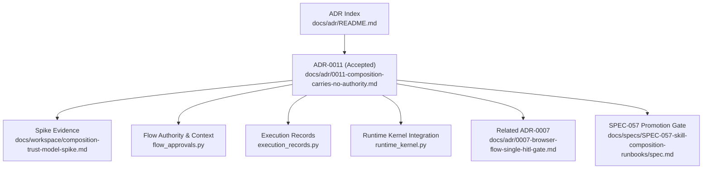
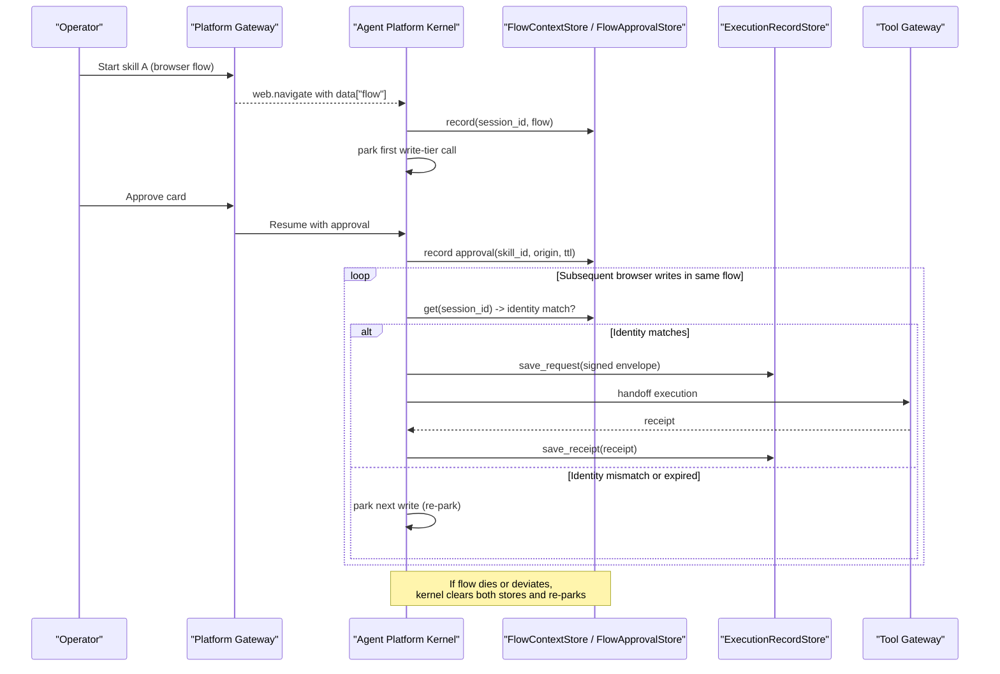
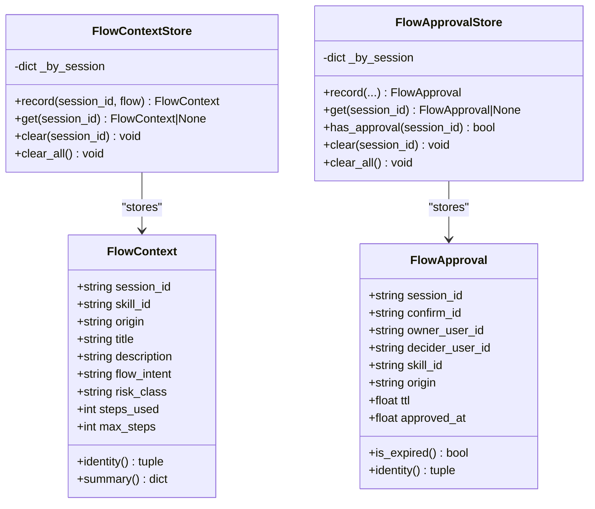
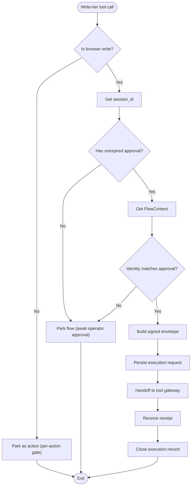
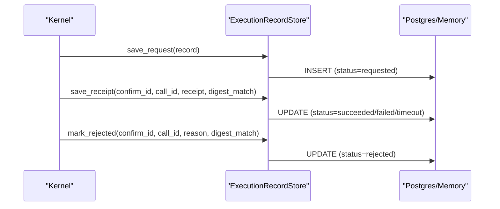
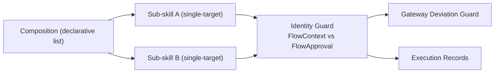

# ADR-0011: Composition Carries No Authority

<cite>
**Referenced Files in This Document**
- [0011-composition-carries-no-authority.md](file://docs/adr/0011-composition-carries-no-authority.md)
- [README.md](file://docs/adr/README.md)
- [composition-trust-model-spike.md](file://docs/workspace/composition-trust-model-spike.md)
- [authorization-matrix.md](file://docs/agentic-aiops-platform/authorization-matrix.md)
- [flow_approvals.py](file://products/agent-platform/src/agent_service/services/flow_approvals.py)
- [execution_records.py](file://products/agent-platform/src/agent_service/services/execution_records.py)
- [runtime_kernel.py](file://products/agent-platform/src/agent_service/runtime_kernel.py)
- [0007-browser-flow-single-hitl-gate.md](file://docs/adr/0007-browser-flow-single-hitl-gate.md)
- [SPEC-057 spec.md](file://docs/specs/SPEC-057-skill-composition-runbooks/spec.md)
</cite>

## Update Summary
**Changes Made**
- Updated ADR-0011 status from proposed to accepted (2026-09-16)
- Added reference to SPEC-057 promotion gate satisfaction
- Enhanced context section with acceptance date and decision details
- Flipped the ADR-0011 row in the docs/adr/README.md index from proposed to accepted, and recorded the acceptance in the composition-trust-model spike memo's Status line and Changelog; no specification file was changed by the acceptance itself

## Table of Contents
1. [Introduction](#introduction)
2. [Project Structure](#project-structure)
3. [Core Components](#core-components)
4. [Architecture Overview](#architecture-overview)
5. [Detailed Component Analysis](#detailed-component-analysis)
6. [Dependency Analysis](#dependency-analysis)
7. [Performance Considerations](#performance-considerations)
8. [Troubleshooting Guide](#troubleshooting-guide)
9. [Conclusion](#conclusion)
10. [Appendices](#appendices)

## Introduction
This Architecture Decision Record establishes that a composition (a multi-target runbook built from single-target skills) carries no authority of its own. Each referenced sub-skill retains its own gate: browser legs are gated by the existing flow identity guard, and infra legs remain per-action under the bounded mutating actions policy. The decision is grounded in shipped code that already re-parks on flow rebind, making composite-level authority unnecessary and potentially regressive.

**Updated** ADR-0011 was accepted on 2026-09-16, satisfying one of the two promotion gates required for SPEC-057 (Skill Composition — Validated Runbooks). This acceptance formalizes the architectural decision that compositions carry no authority and each sub-skill retains its own gate.

## Project Structure
The decision is documented in the ADR index and supported by a spike analysis and implementation artifacts in the agent platform service.

**Diagram sources**
- [README.md:35-50](file://docs/adr/README.md#L35-L50)
- [0011-composition-carries-no-authority.md:3-17](file://docs/adr/0011-composition-carries-no-authority.md#L3-L17)
- [composition-trust-model-spike.md:1-120](file://docs/workspace/composition-trust-model-spike.md#L1-L120)
- [flow_approvals.py:1-274](file://products/agent-platform/src/agent_service/services/flow_approvals.py#L1-L274)
- [execution_records.py:1-494](file://products/agent-platform/src/agent_service/services/execution_records.py#L1-L494)
- [runtime_kernel.py:1230-1750](file://products/agent-platform/src/agent_service/runtime_kernel.py#L1230-L1750)
- [0007-browser-flow-single-hitl-gate.md:1-144](file://docs/adr/0007-browser-flow-single-hitl-gate.md#L1-L144)
- [SPEC-057 spec.md:3-32](file://docs/specs/SPEC-057-skill-composition-runbooks/spec.md#L3-L32)

**Section sources**
- [README.md:35-50](file://docs/adr/README.md#L35-L50)
- [0011-composition-carries-no-authority.md:3-17](file://docs/adr/0011-composition-carries-no-authority.md#L3-L17)

## Core Components
- Flow context and approval stores define the session-scoped identity and authority for browser flows.
- Runtime kernel integrates flow observation, invalidation, and auto-signing of unlocked writes.
- Execution records persist signed requests and receipts to support auditability and re-entry.
- Authorization matrix provides role-based context for who may approve or execute actions.

Key responsibilities:
- FlowContextStore reflects gateway-owned flow bindings per session.
- FlowApprovalStore holds time-bounded approvals scoped to approved flow identity.
- RuntimeKernel observes navigate results, clears state on binding death, and auto-signs subsequent writes when identity matches.
- ExecutionRecordStore persists request/receipt lifecycle for durable audit trails.

**Section sources**
- [flow_approvals.py:78-164](file://products/agent-platform/src/agent_service/services/flow_approvals.py#L78-L164)
- [flow_approvals.py:167-259](file://products/agent-platform/src/agent_service/services/flow_approvals.py#L167-L259)
- [runtime_kernel.py:1564-1673](file://products/agent-platform/src/agent_service/runtime_kernel.py#L1564-L1673)
- [runtime_kernel.py:1676-1750](file://products/agent-platform/src/agent_service/runtime_kernel.py#L1676-L1750)
- [execution_records.py:41-98](file://products/agent-platform/src/agent_service/services/execution_records.py#L41-L98)
- [execution_records.py:105-179](file://products/agent-platform/src/agent_service/services/execution_records.py#L105-L179)
- [execution_records.py:311-445](file://products/agent-platform/src/agent_service/services/execution_records.py#L311-L445)
- [authorization-matrix.md:1-528](file://docs/agentic-aiops-platform/authorization-matrix.md#L1-L528)

## Architecture Overview
Composition does not introduce a new gate. Instead, it sequences single-target skills whose gates are enforced by existing mechanisms:
- Browser legs: one HITL gate per bound flow; subsequent writes auto-sign while identity matches.
- Infra legs: per-action approvals under bounded mutating actions policy.
- Rebind to a different flow invalidates authority and re-parks the next write.

**Diagram sources**
- [runtime_kernel.py:1676-1750](file://products/agent-platform/src/agent_service/runtime_kernel.py#L1676-L1750)
- [runtime_kernel.py:1564-1673](file://products/agent-platform/src/agent_service/runtime_kernel.py#L1564-L1673)
- [flow_approvals.py:124-164](file://products/agent-platform/src/agent_service/services/flow_approvals.py#L124-L164)
- [flow_approvals.py:205-259](file://products/agent-platform/src/agent_service/services/flow_approvals.py#L205-L259)
- [execution_records.py:105-179](file://products/agent-platform/src/agent_service/services/execution_records.py#L105-L179)
- [execution_records.py:311-445](file://products/agent-platform/src/agent_service/services/execution_records.py#L311-L445)

## Detailed Component Analysis

### Flow Context and Approval Stores
- FlowContextStore maintains one FlowContext per session, reflecting gateway-provided flow metadata. It supports recording, retrieval, and clearing.
- FlowApprovalStore maintains one time-bounded approval per session, keyed by session id, with identity checks against FlowContext.

**Diagram sources**
- [flow_approvals.py:78-164](file://products/agent-platform/src/agent_service/services/flow_approvals.py#L78-L164)
- [flow_approvals.py:167-259](file://products/agent-platform/src/agent_service/services/flow_approvals.py#L167-L259)

**Section sources**
- [flow_approvals.py:78-164](file://products/agent-platform/src/agent_service/services/flow_approvals.py#L78-L164)
- [flow_approvals.py:167-259](file://products/agent-platform/src/agent_service/services/flow_approvals.py#L167-L259)

### Runtime Kernel Integration
- Observes web.navigate results to update FlowContext.
- Clears FlowContext and FlowApproval on binding death or refusal codes.
- Auto-signs unlocked browser writes when identity matches and signing key is present; otherwise parks.

**Diagram sources**
- [runtime_kernel.py:1564-1673](file://products/agent-platform/src/agent_service/runtime_kernel.py#L1564-L1673)
- [runtime_kernel.py:1676-1750](file://products/agent-platform/src/agent_service/runtime_kernel.py#L1676-L1750)

**Section sources**
- [runtime_kernel.py:1564-1673](file://products/agent-platform/src/agent_service/runtime_kernel.py#L1564-L1673)
- [runtime_kernel.py:1676-1750](file://products/agent-platform/src/agent_service/runtime_kernel.py#L1676-L1750)

### Execution Records
- Persists signed execution requests and receipts per confirm_id/call_id.
- Supports in-memory and Postgres backends with retention sweeps.
- Provides load_for_session for audit and re-entry surfaces.

**Diagram sources**
- [execution_records.py:41-98](file://products/agent-platform/src/agent_service/services/execution_records.py#L41-L98)
- [execution_records.py:105-179](file://products/agent-platform/src/agent_service/services/execution_records.py#L105-L179)
- [execution_records.py:311-445](file://products/agent-platform/src/agent_service/services/execution_records.py#L311-L445)

**Section sources**
- [execution_records.py:41-98](file://products/agent-platform/src/agent_service/services/execution_records.py#L41-L98)
- [execution_records.py:105-179](file://products/agent-platform/src/agent_service/services/execution_records.py#L105-L179)
- [execution_records.py:311-445](file://products/agent-platform/src/agent_service/services/execution_records.py#L311-L445)

### Related ADR-0007: One Gate Per Mutating Browser Flow
- Establishes the baseline: one HITL gate per mutating browser flow, with subsequent writes admitted only while bound to the same flow identity.
- ADR-0011 builds on this by asserting compositions do not add an additional gate; each sub-skill's flow remains independently gated.

**Section sources**
- [0007-browser-flow-single-hitl-gate.md:14-76](file://docs/adr/0007-browser-flow-single-hitl-gate.md#L14-L76)
- [0007-browser-flow-single-hitl-gate.md:110-144](file://docs/adr/0007-browser-flow-single-hitl-gate.md#L110-L144)

## Dependency Analysis
Compositions rely on existing enforcement boundaries rather than introducing new ones:
- Identity guard (FlowContext vs FlowApproval) ensures re-park on rebind.
- Deviation guard at the gateway enforces origin allowlist, risk class, and step budget.
- Execution records provide durable audit trail independent of composition structure.

**Diagram sources**
- [flow_approvals.py:124-164](file://products/agent-platform/src/agent_service/services/flow_approvals.py#L124-L164)
- [flow_approvals.py:205-259](file://products/agent-platform/src/agent_service/services/flow_approvals.py#L205-L259)
- [execution_records.py:105-179](file://products/agent-platform/src/agent_service/services/execution_records.py#L105-L179)

**Section sources**
- [composition-trust-model-spike.md:25-60](file://docs/workspace/composition-trust-model-spike.md#L25-L60)
- [0011-composition-carries-no-authority.md:50-70](file://docs/adr/0011-composition-carries-no-authority.md#L50-L70)

## Performance Considerations
- In-memory stores for flow context/approval are per-process and non-persistent; they fail safe by re-parking on absence or expiry.
- Execution records use best-effort persistence; failures degrade audit completeness but do not block execution.
- Step budgets are per bound flow; compositions do not introduce a global bound, which is acknowledged as a trade-off deferred to future specification.

[No sources needed since this section provides general guidance]

## Troubleshooting Guide
Common issues and their diagnostics:
- Unexpected re-park after navigating to another skill: verify FlowContext identity changed; the next write will re-park until approved again.
- Missing execution records: check backend readiness and environment configuration; fallback to in-memory store occurs if Postgres is unavailable.
- Excessive approval cards: ensure browser flow is correctly bound via web.navigate and that identity matches; per-action infra calls remain separate.

**Section sources**
- [flow_approvals.py:124-164](file://products/agent-platform/src/agent_service/services/flow_approvals.py#L124-L164)
- [execution_records.py:453-489](file://products/agent-platform/src/agent_service/services/execution_records.py#L453-L489)
- [runtime_kernel.py:1676-1750](file://products/agent-platform/src/agent_service/runtime_kernel.py#L1676-L1750)

## Conclusion
ADR-0011 formalizes that compositions carry no authority beyond what each sub-skill declares and enforces through existing gates. This preserves the strong identity-bound guarantee established by ADR-0007, avoids reintroducing cross-flow posture, and leverages durable execution records for auditability and re-entry. 

**Updated** The acceptance of ADR-0011 on 2026-09-16 represents a significant milestone, satisfying one of the two promotion gates required for SPEC-057 (Skill Composition — Validated Runbooks). This decision enables the progression of multi-target workflow capabilities while maintaining the security and auditability guarantees established by the existing trust model. Future work can scope composition ingestion validation and re-entry without altering the trust model.

## Appendices
- Open questions include composite-wide step budgeting, storage shape for compositions, half-state visibility during mid-run stoppages, sample coverage gaps for certain browser tools, and volume considerations for gate counts. These are tracked in the spike and deferred to subsequent specifications.

**Section sources**
- [composition-trust-model-spike.md:147-190](file://docs/workspace/composition-trust-model-spike.md#L147-L190)
- [0011-composition-carries-no-authority.md:93-118](file://docs/adr/0011-composition-carries-no-authority.md#L93-L118)