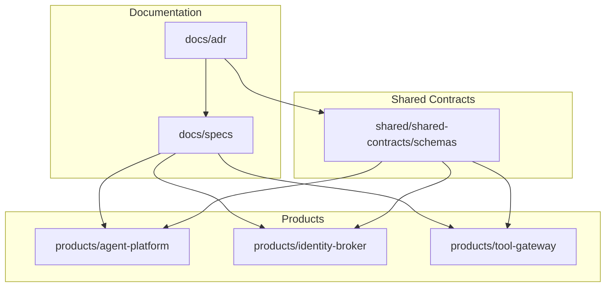
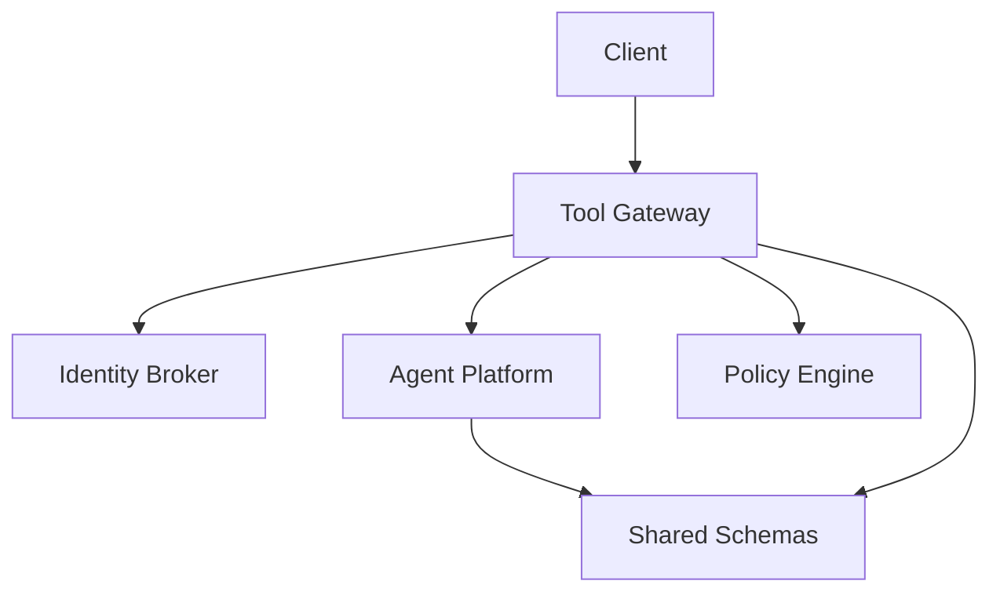
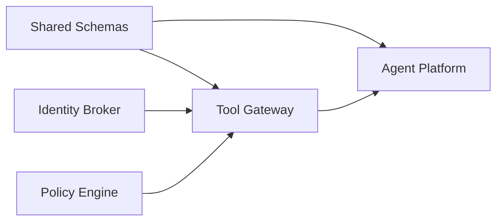

# Architecture Decision Records

<cite>
**Referenced Files in This Document**
- [README.md](file://docs/adr/README.md)
- [template.md](file://docs/adr/template.md)
- [0001-adopt-spec-driven-development.md](file://docs/adr/0001-adopt-spec-driven-development.md)
- [0002-reaffirm-agentscope-runtime-kernel.md](file://docs/adr/0002-reaffirm-agentscope-runtime-kernel.md)
- [0003-platform-owned-agent-service-contract.md](file://docs/adr/0003-platform-owned-agent-service-contract.md)
- [0004-broker-mediated-token-delegation.md](file://docs/adr/0004-broker-mediated-token-delegation.md)
- [0005-platform-gateway-extraction.md](file://docs/adr/0005-platform-gateway-extraction.md)
- [0006-contract-purpose-invariant-enforcement.md](file://docs/adr/0006-contract-purpose-invariant-enforcement.md)
- [0007-browser-flow-single-hitl-gate.md](file://docs/adr/0007-browser-flow-single-hitl-gate.md)
- [0008-spec-delivery-traceability-gate.md](file://docs/adr/0008-spec-delivery-traceability-gate.md)
- [0009-graduate-sessions-into-replayable-executable-skills.md](file://docs/adr/0009-graduate-sessions-into-replayable-executable-skills.md)
- [0010-signed-execution-envelopes-declare-authority-provenance.md](file://docs/adr/0010-signed-execution-envelopes-declare-authority-provenance.md)
- [0011-composition-carries-no-authority.md](file://docs/adr/0011-composition-carries-no-authority.md)
- [SPEC-002-agent-service-contract/spec.md](file://docs/specs/SPEC-002-agent-service-contract/spec.md)
- [SPEC-008-service-to-service-identity/spec.md](file://docs/specs/SPEC-008-service-to-service-identity/spec.md)
- [SPEC-057-skill-composition-runbooks/spec.md](file://docs/specs/SPEC-057-skill-composition-runbooks/spec.md)
- [composition-trust-model-spike.md](file://docs/workspace/composition-trust-model-spike.md)
- [agent-chat-request.schema.json](file://shared/shared-contracts/schemas/agent-chat-request.schema.json)
- [agent-chat-response.schema.json](file://shared/shared-contracts/schemas/agent-chat-response.schema.json)
- [identity-token.schema.json](file://shared/shared-contracts/schemas/identity-token.schema.json)
- [policy-decision.schema.json](file://shared/shared-contracts/schemas/policy-decision.schema.json)
- [tool-invocation.schema.json](file://shared/shared-contracts/schemas/tool-invocation.schema.json)
- [tool-result.schema.json](file://shared/shared-contracts/schemas/tool-result.schema.json)
- [api.py](file://products/agent-platform/src/agent_service/schemas/api.py)
- [v2.py](file://products/agent-platform/src/agent_service/schemas/v2.py)
- [routes.py](file://products/agent-platform/src/agent_service/api/v2/routes.py)
- [runtime_kernel.py](file://products/agent-platform/src/agent_service/runtime_kernel.py)
- [main.py](file://products/agent-platform/src/agent_service/main.py)
- [app.py](file://products/agent-platform/src/agent_service/app.py)
- [auth.py](file://products/identity-broker/src/identity_service/api/routes/auth.py)
- [identity.py](file://products/identity-broker/src/identity_service/api/routes/identity.py)
- [token_service.py](file://products/identity-broker/src/identity_service/services/token_service.py)
- [identity_service.py](file://products/identity-broker/src/identity_service/services/identity_service.py)
- [gateway_service.py](file://products/tool-gateway/src/api_gateway/services/gateway_service.py)
- [token_verifier.py](file://products/tool-gateway/src/api_gateway/services/token_verifier.py)
- [policy_engine.py](file://products/tool-gateway/src/api_gateway/services/policy_engine.py)
- [policy-default.yaml](file://products/tool-gateway/src/api_gateway/policies/policy-default.yaml)
</cite>

## Update Summary
**Changes Made**
- Added comprehensive coverage of ADR-0011: Composition carries no authority; each sub-skill keeps its own gate
- Extended ADR-0007 section to show how ADR-0011 builds upon and extends the browser flow HITL gate decision
- Updated timeline to reflect the progression from single-flow gating to multi-target composition support
- Enhanced guidance for new architectural decisions to include composition patterns
- Added detailed specification references for SPEC-057 skill composition runbooks

## Table of Contents
1. [Introduction](#introduction)
2. [Project Structure](#project-structure)
3. [Core Components](#core-components)
4. [Architecture Overview](#architecture-overview)
5. [Detailed Component Analysis](#detailed-component-analysis)
6. [Dependency Analysis](#dependency-analysis)
7. [Performance Considerations](#performance-considerations)
8. [Troubleshooting Guide](#troubleshooting-guide)
9. [Conclusion](#conclusion)
10. [Appendices](#appendices)

## Introduction
This document consolidates the Architecture Decision Records (ADRs) that shaped the Luban AIOps Platform design. It explains major decisions, their rationale, alternatives considered, and consequences across spec-driven development, runtime kernel selection, service contracts, token delegation patterns, and composition authority models. It also provides guidance for making new architectural decisions following established patterns and traces how these choices influence system behavior, extensibility, and maintenance over time.

## Project Structure
The repository organizes ADRs under docs/adr, specifications under docs/specs, shared schemas under shared/shared-contracts, and product services under products/. The ADR set includes a README and template to standardize future records.

**Diagram sources**
- [README.md](file://docs/adr/README.md)
- [template.md](file://docs/adr/template.md)

**Section sources**
- [README.md](file://docs/adr/README.md)
- [template.md](file://docs/adr/template.md)

## Core Components
- Agent Platform: Implements the agent runtime kernel, session management, provider integrations, and API routes aligned with platform-owned contracts.
- Identity Broker: Provides identity and token issuance/validation endpoints used by other services.
- Tool Gateway: Enforces policies, verifies tokens, and proxies tool invocations according to shared schemas.

These components are governed by shared JSON schemas and platform specs that define request/response shapes, streaming events, and policy decisions.

**Section sources**
- [api.py](file://products/agent-platform/src/agent_service/schemas/api.py)
- [v2.py](file://products/agent-platform/src/agent_service/schemas/v2.py)
- [routes.py](file://products/agent-platform/src/agent_service/api/v2/routes.py)
- [runtime_kernel.py](file://products/agent-platform/src/agent_service/runtime_kernel.py)
- [main.py](file://products/agent-platform/src/agent_service/main.py)
- [app.py](file://products/agent-platform/src/agent_service/app.py)
- [auth.py](file://products/identity-broker/src/identity_service/api/routes/auth.py)
- [identity.py](file://products/identity-broker/src/identity_service/api/routes/identity.py)
- [token_service.py](file://products/identity-broker/src/identity_service/services/token_service.py)
- [identity_service.py](file://products/identity-broker/src/identity_service/services/identity_service.py)
- [gateway_service.py](file://products/tool-gateway/src/api_gateway/services/gateway_service.py)
- [token_verifier.py](file://products/tool-gateway/src/api_gateway/services/token_verifier.py)
- [policy_engine.py](file://products/tool-gateway/src/api_gateway/services/policy_engine.py)
- [policy-default.yaml](file://products/tool-gateway/src/api_gateway/policies/policy-default.yaml)

## Architecture Overview
The platform follows a spec-first approach where shared schemas drive implementation across services. The Agent Platform exposes chat and session APIs; the Identity Broker issues and validates tokens; the Tool Gateway enforces policies and mediates tool access using brokered tokens.

**Diagram sources**
- [routes.py](file://products/agent-platform/src/agent_service/api/v2/routes.py)
- [auth.py](file://products/identity-broker/src/identity_service/api/routes/auth.py)
- [identity.py](file://products/identity-broker/src/identity_service/api/routes/identity.py)
- [gateway_service.py](file://products/tool-gateway/src/api_gateway/services/gateway_service.py)
- [token_verifier.py](file://products/tool-gateway/src/api_gateway/services/token_verifier.py)
- [policy_engine.py](file://products/tool-gateway/src/api_gateway/services/policy_engine.py)
- [agent-chat-request.schema.json](file://shared/shared-contracts/schemas/agent-chat-request.schema.json)
- [agent-chat-response.schema.json](file://shared/shared-contracts/schemas/agent-chat-response.schema.json)
- [identity-token.schema.json](file://shared/shared-contracts/schemas/identity-token.schema.json)
- [policy-decision.schema.json](file://shared/shared-contracts/schemas/policy-decision.schema.json)

## Detailed Component Analysis

### ADR-0001: Adopt Spec-Driven Development
Rationale:
- Ensures consistent interfaces across services and reduces integration friction.
- Enables early validation and testability via shared schemas.

Alternatives considered:
- Code-first development with post-hoc contract generation.
- Manual documentation without machine-readable schemas.

Consequences:
- Strong coupling to schema evolution; requires governance for changes.
- Faster onboarding and fewer runtime mismatches.

Timeline and evolution:
- Introduced as foundational practice before implementing agent contracts and identity flows.

Guidance for new decisions:
- Always start with a spec and schema artifacts; validate implementations against them.

**Section sources**
- [README.md](file://docs/adr/README.md)
- [template.md](file://docs/adr/template.md)
- [SPEC-002-agent-service-contract/spec.md](file://docs/specs/SPEC-002-agent-service-contract/spec.md)
- [agent-chat-request.schema.json](file://shared/shared-contracts/schemas/agent-chat-request.schema.json)
- [agent-chat-response.schema.json](file://shared/shared-contracts/schemas/agent-chat-response.schema.json)

### ADR-0002: Reaffirm AgentScope Runtime Kernel
Rationale:
- Leverages existing runtime abstractions for agent execution, sessions, and providers.
- Reduces duplication and accelerates feature delivery.

Alternatives considered:
- Building a custom runtime from scratch.
- Selecting an external runtime framework.

Consequences:
- Vendor lock-in to AgentScope capabilities and lifecycle.
- Simplified provider integration and standardized observability.

Timeline and evolution:
- Reaffirmed after evaluating alternative runtimes during platform hardening.

Guidance for new decisions:
- Prefer leveraging proven runtime kernels unless compelling reasons exist to diverge.

**Section sources**
- [0002-reaffirm-agentscope-runtime-kernel.md](file://docs/adr/0002-reaffirm-agentscope-runtime-kernel.md)
- [runtime_kernel.py](file://products/agent-platform/src/agent_service/runtime_kernel.py)
- [main.py](file://products/agent-platform/src/agent_service/main.py)
- [app.py](file://products/agent-platform/src/agent_service/app.py)

### ADR-0003: Platform-Owned Agent Service Contract
Rationale:
- Centralizes interface definitions to ensure interoperability between gateway, broker, and agent platform.
- Supports versioned APIs and stable client experiences.

Alternatives considered:
- Decentralized contracts maintained per service.
- Ad-hoc JSON payloads without formal schemas.

Consequences:
- Requires coordinated change management and backward compatibility strategies.
- Improves reliability and simplifies testing across boundaries.

Timeline and evolution:
- Formalized through SPEC-002 and implemented via shared schemas and v2 routes.

Guidance for new decisions:
- Maintain a single source of truth for contracts; evolve versions explicitly.

**Section sources**
- [0003-platform-owned-agent-service-contract.md](file://docs/adr/0003-platform-owned-agent-service-contract.md)
- [SPEC-002-agent-service-contract/spec.md](file://docs/specs/SPEC-002-agent-service-contract/spec.md)
- [api.py](file://products/agent-platform/src/agent_service/schemas/api.py)
- [v2.py](file://products/agent-platform/src/agent_service/schemas/v2.py)
- [routes.py](file://products/agent-platform/src/agent_service/api/v2/routes.py)
- [agent-chat-request.schema.json](file://shared/shared-contracts/schemas/agent-chat-request.schema.json)
- [agent-chat-response.schema.json](file://shared/shared-contracts/schemas/agent-chat-response.schema.json)

### ADR-0004: Broker-Mediated Token Delegation
Rationale:
- Centralizes identity and trust boundaries; prevents direct secret sharing.
- Enables fine-grained authorization via policy enforcement at the gateway.

Alternatives considered:
- Direct client-to-service token exchange.
- Shared secrets or static credentials.

Consequences:
- Adds latency due to broker round-trips but improves security posture.
- Requires robust token verification and policy evaluation paths.

Timeline and evolution:
- Established alongside service-to-service identity specification and gateway policy engine.

Guidance for new decisions:
- Use broker-mediated delegation for all cross-service calls; enforce via policy engine.

**Section sources**
- [0004-broker-mediated-token-delegation.md](file://docs/adr/0004-broker-mediated-token-delegation.md)
- [SPEC-008-service-to-service-identity/spec.md](file://docs/specs/SPEC-008-service-to-service-identity/spec.md)
- [identity-token.schema.json](file://shared/shared-contracts/schemas/identity-token.schema.json)
- [auth.py](file://products/identity-broker/src/identity_service/api/routes/auth.py)
- [identity.py](file://products/identity-broker/src/identity_service/api/routes/identity.py)
- [token_service.py](file://products/identity-broker/src/identity_service/services/token_service.py)
- [identity_service.py](file://products/identity-broker/src/identity_service/services/identity_service.py)
- [token_verifier.py](file://products/tool-gateway/src/api_gateway/services/token_verifier.py)
- [policy_engine.py](file://products/tool-gateway/src/api_gateway/services/policy_engine.py)
- [policy-default.yaml](file://products/tool-gateway/src/api_gateway/policies/policy-default.yaml)

### ADR-0007: Enforce One HITL Gate Per Mutating Browser Flow Platform-Side
Rationale:
- Establishes the foundation for single-point approval in browser flows to prevent operator fatigue while maintaining security.
- Ensures one operator decision per mutating flow rather than per-action approvals.

Alternatives considered:
- Per-action confirmation cards (observed behavior).
- Auto-allow list for write-tier tools.
- Collapsing the gate inside tool-gateway.

Consequences:
- Realizes SPEC-049 R-4/D-3 as shipped platform behavior.
- Eliminates cross-flow trade-offs through flow-identity scoping.
- Each unlocked write remains signed, persisted, audited, receipted, and gateway-guarded.

**Updated** This decision serves as the foundation for ADR-0011's composition model, establishing the principle that authority is scoped to specific flows rather than being transferable. The identity guard mechanism (`FlowContext.identity()` returning `(skill_id, origin)` with `FLOW_CONTEXTS` keyed by `session_id`) ensures that when a composite navigates into a different sub-skill, it automatically re-parks for approval, preventing cross-flow authority leakage.

**Section sources**
- [0007-browser-flow-single-hitl-gate.md](file://docs/adr/0007-browser-flow-single-hitl-gate.md)

### ADR-0011: A Composition Carries No Authority; Each Sub-Skill Keeps Its Own Gate
Rationale:
- Extends ADR-0007's single-flow gating principle to multi-target compositions by ensuring each sub-skill maintains its own gate rather than creating composite-level authority.
- Prevents regression against accepted decisions by avoiding multi-identity authority stores.
- Maintains operator assessability by preserving granular decision points.

Decision:
1. **A composition carries no authority of its own.** Each referenced sub-skill keeps its own gate: browser legs get one gate per binding through the existing identity guard, infra legs park per-action under SPEC-054 R-2. Gate count equals the number of distinct assessable decisions a run encounters — never one per composite.
2. **A composition is a declarative, ordered list of sub-skill references**, validated at ingestion: every reference resolves to a published skill that is single-target and declares its target, and no sub-skill appears twice.
3. **No control flow.** No branch, loop, conditional or early exit — sequencing and validation only.
4. **A composition is not a transaction.** There is no rollback. On partial failure the agent reports where it stopped and does not continue; re-entry starts from a named step, with the completed prefix derived from existing `execution_records` signed receipts rather than from new composite state.
5. **Mixed browser+infra composites are allowed**; neither leg depends on the other's gate semantics.
6. A composition's declared order is **guidance, not enforcement** — the same standing `steps[].expect` has. Enforcement remains with the gateway deviation guard and the identity guard.

Alternatives considered:
- Composite-level gate (one approval covering the whole runbook) — rejected as it would require a multi-identity authority store, reopening the cross-flow posture ADR-0007 closed.
- Prose-only runbook with no structured list — rejected as it provides nothing to validate at ingestion.
- An interpreter executing the composition — rejected as it would need loops, defeating current step budget bounds.
- Generalizing browser flow binding to infra — rejected as it would replace N self-describing cards with one carrying less information.

Consequences:
- Composition needs no new enforcement machinery: the identity guard supplies the gate boundaries for free, strengthening ADR-0007's invariant.
- Per-sub-skill signed receipts already in `execution_records` give audit trail and re-entry substrate without new storage.
- Accepted trade-off: no composite-wide write bound (deferred to SPEC-057).
- Accepted trade-off: N gates for an N-step runbook is operator cost, but collapsing them would reduce assessability.

Timeline and evolution:
- Proposed 2026-09-16 as extension of ADR-0007, building upon established single-flow gating principles.
- Related to SPEC-057 (multi-target composition), SPEC-056 (Studio skills), SPEC-055 (develop-as-you-go graduation), SPEC-054 (action-level approval), and SPEC-051 (browser flow HITL gate).

Guidance for new decisions:
- When extending existing decisions, maintain established patterns rather than introducing new authority models.
- Preserve operator assessability by keeping decision granularity aligned with assessable units.

**Section sources**
- [0011-composition-carries-no-authority.md](file://docs/adr/0011-composition-carries-no-authority.md)
- [0007-browser-flow-single-hitl-gate.md](file://docs/adr/0007-browser-flow-single-hitl-gate.md)
- [SPEC-057-skill-composition-runbooks/spec.md](file://docs/specs/SPEC-057-skill-composition-runbooks/spec.md)
- [composition-trust-model-spike.md](file://docs/workspace/composition-trust-model-spike.md)

## Dependency Analysis
The platform's dependencies align with ADRs: shared schemas govern service interactions; the identity broker supplies tokens; the gateway enforces policies and delegates tool access; the agent platform executes agents using the AgentScope kernel.

**Diagram sources**
- [agent-chat-request.schema.json](file://shared/shared-contracts/schemas/agent-chat-request.schema.json)
- [agent-chat-response.schema.json](file://shared/shared-contracts/schemas/agent-chat-response.schema.json)
- [identity-token.schema.json](file://shared/shared-contracts/schemas/identity-token.schema.json)
- [policy-decision.schema.json](file://shared/shared-contracts/schemas/policy-decision.schema.json)
- [routes.py](file://products/agent-platform/src/agent_service/api/v2/routes.py)
- [auth.py](file://products/identity-broker/src/identity_service/api/routes/auth.py)
- [identity.py](file://products/identity-broker/src/identity_service/api/routes/identity.py)
- [token_service.py](file://products/identity-broker/src/identity_service/services/token_service.py)
- [identity_service.py](file://products/identity-broker/src/identity_service/services/identity_service.py)
- [gateway_service.py](file://products/tool-gateway/src/api_gateway/services/gateway_service.py)
- [token_verifier.py](file://products/tool-gateway/src/api_gateway/services/token_verifier.py)
- [policy_engine.py](file://products/tool-gateway/src/api_gateway/services/policy_engine.py)

**Section sources**
- [policy-engine.py](file://products/tool-gateway/src/api_gateway/services/policy_engine.py)
- [token-verifier.py](file://products/tool-gateway/src/api_gateway/services/token_verifier.py)
- [gateway-service.py](file://products/tool-gateway/src/api_gateway/services/gateway_service.py)
- [routes.py](file://products/agent-platform/src/agent_service/api/v2/routes.py)

## Performance Considerations
- Spec validation adds minimal overhead but prevents costly runtime errors.
- Broker-mediated token checks introduce network latency; consider caching validated claims where safe.
- Policy evaluation should be optimized and cached for repeated rules to reduce gateway latency.
- Agent runtime kernel choice impacts concurrency and resource usage; monitor provider-specific performance characteristics.
- Composition patterns add validation overhead but maintain security boundaries without additional enforcement machinery.
- Multi-target compositions may increase gate count proportionally to sub-skill count, requiring careful operator workflow design.

## Troubleshooting Guide
Common issues and resolutions:
- Schema mismatch: Validate requests/responses against shared schemas; update specs before code changes.
- Token verification failures: Ensure correct issuer, audience, and scopes; inspect token verifier logs.
- Policy denials: Review policy rules and decision outputs; adjust policy configuration accordingly.
- Agent runtime errors: Inspect kernel initialization and provider settings; verify environment variables and secrets.
- Composition failures: Check sub-skill references resolve to published skills; verify single-target constraints; review execution_records for re-entry points.
- Multi-target composition issues: Verify each sub-skill maintains its own gate; check that identity guard properly re-parks on flow transitions; ensure no duplicate sub-skill references.

**Section sources**
- [token_verifier.py](file://products/tool-gateway/src/api_gateway/services/token_verifier.py)
- [policy_engine.py](file://products/tool-gateway/src/api_gateway/services/policy_engine.py)
- [policy-default.yaml](file://products/tool-gateway/src/api_gateway/policies/policy-default.yaml)
- [runtime_kernel.py](file://products/agent-platform/src/agent_service/runtime_kernel.py)

## Conclusion
The Luban AIOps Platform's architecture is guided by eleven core ADRs spanning spec-driven development, runtime kernel selection, service contracts, token delegation, browser flow gating, and composition authority models. These decisions collectively improve consistency, security, and maintainability while enabling extensibility through well-defined interfaces and policies. The progression from ADR-0007's single-flow gating to ADR-0011's composition model demonstrates how established patterns can be extended to support more complex scenarios while maintaining security boundaries and operator assessability. Future decisions should follow the same pattern: document rationale, evaluate alternatives, specify schemas, implement with clear error handling and observability, and build upon existing decisions rather than introducing new authority models.

## Appendices

### Decision Timeline and Evolution
- Early phase: Establish spec-driven development and shared schemas.
- Mid phase: Reaffirm AgentScope runtime kernel to accelerate delivery.
- Stabilization: Formalize platform-owned contracts and broker-mediated identity flows.
- Browser flow hardening: Implement single HITL gate per flow (ADR-0007).
- Composition support: Extend gating principles to multi-target workflows (ADR-0011).
- Ongoing: Evolve policies and schemas with backward-compatible versions.

### Guidance for New Architectural Decisions
- Start with a spec and schema artifacts.
- Document rationale, alternatives, and consequences in an ADR.
- Implement tests against schemas and policy rules.
- Provide migration paths for breaking changes.
- Monitor performance and security implications.
- Build upon existing decisions rather than introducing new authority models.
- Preserve operator assessability by maintaining decision granularity aligned with assessable units.
- When extending existing patterns, ensure they strengthen rather than weaken established security boundaries.
- For composition patterns, prefer per-sub-skill gating over composite-level authority to maintain security invariants.

### Composition Pattern Guidelines
When designing multi-target workflows:
- Each sub-skill should remain single-target and maintain its own gate
- Compositions should be declarative lists without control flow
- Avoid composite-level authority that could create cross-flow security issues
- Design for operator assessability by preserving granular decision points
- Use existing identity guards and flow contexts rather than introducing new trust mechanisms
- Consider the operator cost of multiple gates vs. the security benefits of granular approval