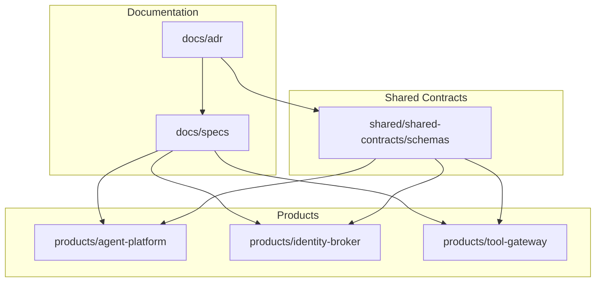
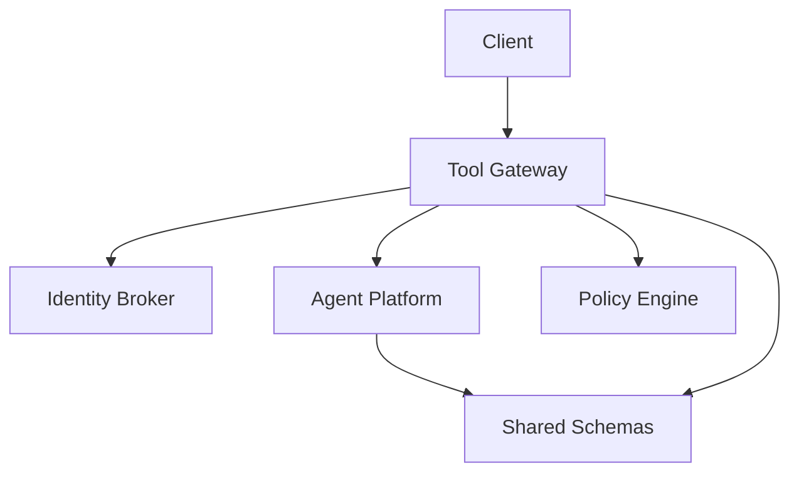
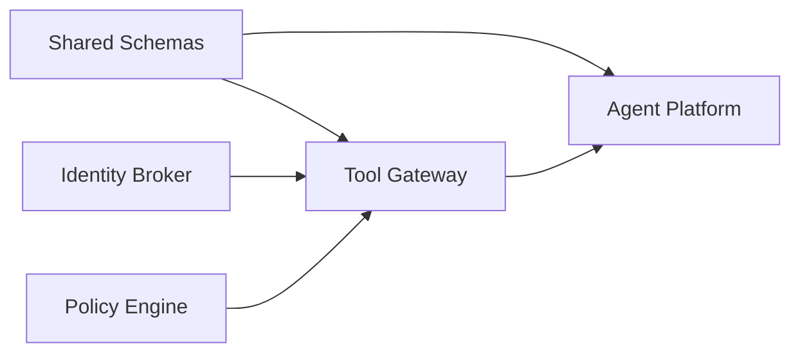

# Architecture Decision Records

<cite>
**Referenced Files in This Document**
- [README.md](file://docs/adr/README.md)
- [template.md](file://docs/adr/template.md)
- [0001-adopt-spec-driven-development.md](file://docs/adr/0001-adopt-spec-driven-development.md)
- [0002-reaffirm-agentscope-runtime-kernel.md](file://docs/adr/0002-reaffirm-agentscope-runtime-kernel.md)
- [0003-platform-owned-agent-service-contract.md](file://docs/adr/0003-platform-owned-agent-service-contract.md)
- [0004-broker-mediated-token-delegation.md](file://docs/adr/0004-broker-mediated-token-delegation.md)
- [SPEC-002-agent-service-contract/spec.md](file://docs/specs/SPEC-002-agent-service-contract/spec.md)
- [SPEC-008-service-to-service-identity/spec.md](file://docs/specs/SPEC-008-service-to-service-identity/spec.md)
- [agent-chat-request.schema.json](file://shared/shared-contracts/schemas/agent-chat-request.schema.json)
- [agent-chat-response.schema.json](file://shared/shared-contracts/schemas/agent-chat-response.schema.json)
- [identity-token.schema.json](file://shared/shared-contracts/schemas/identity-token.schema.json)
- [policy-decision.schema.json](file://shared/shared-contracts/schemas/policy-decision.schema.json)
- [tool-invocation.schema.json](file://shared/shared-contracts/schemas/tool-invocation.schema.json)
- [tool-result.schema.json](file://shared/shared-contracts/schemas/tool-result.schema.json)
- [api.py](file://products/agent-platform/src/agent_service/schemas/api.py)
- [v2.py](file://products/agent-platform/src/agent_service/schemas/v2.py)
- [routes.py](file://products/agent-platform/src/agent_service/api/v2/routes.py)
- [runtime_kernel.py](file://products/agent-platform/src/agent_service/runtime_kernel.py)
- [main.py](file://products/agent-platform/src/agent_service/main.py)
- [app.py](file://products/agent-platform/src/agent_service/app.py)
- [auth.py](file://products/identity-broker/src/identity_service/api/routes/auth.py)
- [identity.py](file://products/identity-broker/src/identity_service/api/routes/identity.py)
- [token_service.py](file://products/identity-broker/src/identity_service/services/token_service.py)
- [identity_service.py](file://products/identity-broker/src/identity_service/services/identity_service.py)
- [gateway_service.py](file://products/tool-gateway/src/api_gateway/services/gateway_service.py)
- [token_verifier.py](file://products/tool-gateway/src/api_gateway/services/token_verifier.py)
- [policy_engine.py](file://products/tool-gateway/src/api_gateway/services/policy_engine.py)
- [policy-default.yaml](file://products/tool-gateway/src/api_gateway/policies/policy-default.yaml)
</cite>

## Table of Contents
1. [Introduction](#introduction)
2. [Project Structure](#project-structure)
3. [Core Components](#core-components)
4. [Architecture Overview](#architecture-overview)
5. [Detailed Component Analysis](#detailed-component-analysis)
6. [Dependency Analysis](#dependency-analysis)
7. [Performance Considerations](#performance-considerations)
8. [Troubleshooting Guide](#troubleshooting-guide)
9. [Conclusion](#conclusion)
10. [Appendices](#appendices)

## Introduction
This document consolidates the Architecture Decision Records (ADRs) that shaped the Luban AIOps Platform design. It explains major decisions, their rationale, alternatives considered, and consequences across spec-driven development, runtime kernel selection, service contracts, and token delegation patterns. It also provides guidance for making new architectural decisions following established patterns and traces how these choices influence system behavior, extensibility, and maintenance over time.

## Project Structure
The repository organizes ADRs under docs/adr, specifications under docs/specs, shared schemas under shared/shared-contracts, and product services under products/. The ADR set includes a README and template to standardize future records.

**Diagram sources**
- [README.md](file://docs/adr/README.md)
- [template.md](file://docs/adr/template.md)

**Section sources**
- [README.md](file://docs/adr/README.md)
- [template.md](file://docs/adr/template.md)

## Core Components
- Agent Platform: Implements the agent runtime kernel, session management, provider integrations, and API routes aligned with platform-owned contracts.
- Identity Broker: Provides identity and token issuance/validation endpoints used by other services.
- Tool Gateway: Enforces policies, verifies tokens, and proxies tool invocations according to shared schemas.

These components are governed by shared JSON schemas and platform specs that define request/response shapes, streaming events, and policy decisions.

**Section sources**
- [api.py](file://products/agent-platform/src/agent_service/schemas/api.py)
- [v2.py](file://products/agent-platform/src/agent_service/schemas/v2.py)
- [routes.py](file://products/agent-platform/src/agent_service/api/v2/routes.py)
- [runtime_kernel.py](file://products/agent-platform/src/agent_service/runtime_kernel.py)
- [main.py](file://products/agent-platform/src/agent_service/main.py)
- [app.py](file://products/agent-platform/src/agent_service/app.py)
- [auth.py](file://products/identity-broker/src/identity_service/api/routes/auth.py)
- [identity.py](file://products/identity-broker/src/identity_service/api/routes/identity.py)
- [token_service.py](file://products/identity-broker/src/identity_service/services/token_service.py)
- [identity_service.py](file://products/identity-broker/src/identity_service/services/identity_service.py)
- [gateway_service.py](file://products/tool-gateway/src/api_gateway/services/gateway_service.py)
- [token_verifier.py](file://products/tool-gateway/src/api_gateway/services/token_verifier.py)
- [policy_engine.py](file://products/tool-gateway/src/api_gateway/services/policy_engine.py)
- [policy-default.yaml](file://products/tool-gateway/src/api_gateway/policies/policy-default.yaml)

## Architecture Overview
The platform follows a spec-first approach where shared schemas drive implementation across services. The Agent Platform exposes chat and session APIs; the Identity Broker issues and validates tokens; the Tool Gateway enforces policies and mediates tool access using brokered tokens.

**Diagram sources**
- [routes.py](file://products/agent-platform/src/agent_service/api/v2/routes.py)
- [auth.py](file://products/identity-broker/src/identity_service/api/routes/auth.py)
- [identity.py](file://products/identity-broker/src/identity_service/api/routes/identity.py)
- [gateway_service.py](file://products/tool-gateway/src/api_gateway/services/gateway_service.py)
- [token_verifier.py](file://products/tool-gateway/src/api_gateway/services/token_verifier.py)
- [policy_engine.py](file://products/tool-gateway/src/api_gateway/services/policy_engine.py)
- [agent-chat-request.schema.json](file://shared/shared-contracts/schemas/agent-chat-request.schema.json)
- [agent-chat-response.schema.json](file://shared/shared-contracts/schemas/agent-chat-response.schema.json)
- [identity-token.schema.json](file://shared/shared-contracts/schemas/identity-token.schema.json)
- [policy-decision.schema.json](file://shared/shared-contracts/schemas/policy-decision.schema.json)

## Detailed Component Analysis

### ADR-0001: Adopt Spec-Driven Development
Rationale:
- Ensures consistent interfaces across services and reduces integration friction.
- Enables early validation and testability via shared schemas.

Alternatives considered:
- Code-first development with post-hoc contract generation.
- Manual documentation without machine-readable schemas.

Consequences:
- Strong coupling to schema evolution; requires governance for changes.
- Faster onboarding and fewer runtime mismatches.

Timeline and evolution:
- Introduced as foundational practice before implementing agent contracts and identity flows.

Guidance for new decisions:
- Always start with a spec and schema artifacts; validate implementations against them.

**Section sources**
- [README.md](file://docs/adr/README.md)
- [template.md](file://docs/adr/template.md)
- [SPEC-002-agent-service-contract/spec.md](file://docs/specs/SPEC-002-agent-service-contract/spec.md)
- [agent-chat-request.schema.json](file://shared/shared-contracts/schemas/agent-chat-request.schema.json)
- [agent-chat-response.schema.json](file://shared/shared-contracts/schemas/agent-chat-response.schema.json)

### ADR-0002: Reaffirm AgentScope Runtime Kernel
Rationale:
- Leverages existing runtime abstractions for agent execution, sessions, and providers.
- Reduces duplication and accelerates feature delivery.

Alternatives considered:
- Building a custom runtime from scratch.
- Selecting an external runtime framework.

Consequences:
- Vendor lock-in to AgentScope capabilities and lifecycle.
- Simplified provider integration and standardized observability.

Timeline and evolution:
- Reaffirmed after evaluating alternative runtimes during platform hardening.

Guidance for new decisions:
- Prefer leveraging proven runtime kernels unless compelling reasons exist to diverge.

**Section sources**
- [0002-reaffirm-agentscope-runtime-kernel.md](file://docs/adr/0002-reaffirm-agentscope-runtime-kernel.md)
- [runtime_kernel.py](file://products/agent-platform/src/agent_service/runtime_kernel.py)
- [main.py](file://products/agent-platform/src/agent_service/main.py)
- [app.py](file://products/agent-platform/src/agent_service/app.py)

### ADR-0003: Platform-Owned Agent Service Contract
Rationale:
- Centralizes interface definitions to ensure interoperability between gateway, broker, and agent platform.
- Supports versioned APIs and stable client experiences.

Alternatives considered:
- Decentralized contracts maintained per service.
- Ad-hoc JSON payloads without formal schemas.

Consequences:
- Requires coordinated change management and backward compatibility strategies.
- Improves reliability and simplifies testing across boundaries.

Timeline and evolution:
- Formalized through SPEC-002 and implemented via shared schemas and v2 routes.

Guidance for new decisions:
- Maintain a single source of truth for contracts; evolve versions explicitly.

**Section sources**
- [0003-platform-owned-agent-service-contract.md](file://docs/adr/0003-platform-owned-agent-service-contract.md)
- [SPEC-002-agent-service-contract/spec.md](file://docs/specs/SPEC-002-agent-service-contract/spec.md)
- [api.py](file://products/agent-platform/src/agent_service/schemas/api.py)
- [v2.py](file://products/agent-platform/src/agent_service/schemas/v2.py)
- [routes.py](file://products/agent-platform/src/agent_service/api/v2/routes.py)
- [agent-chat-request.schema.json](file://shared/shared-contracts/schemas/agent-chat-request.schema.json)
- [agent-chat-response.schema.json](file://shared/shared-contracts/schemas/agent-chat-response.schema.json)

### ADR-0004: Broker-Mediated Token Delegation
Rationale:
- Centralizes identity and trust boundaries; prevents direct secret sharing.
- Enables fine-grained authorization via policy enforcement at the gateway.

Alternatives considered:
- Direct client-to-service token exchange.
- Shared secrets or static credentials.

Consequences:
- Adds latency due to broker round-trips but improves security posture.
- Requires robust token verification and policy evaluation paths.

Timeline and evolution:
- Established alongside service-to-service identity specification and gateway policy engine.

Guidance for new decisions:
- Use broker-mediated delegation for all cross-service calls; enforce via policy engine.

**Section sources**
- [0004-broker-mediated-token-delegation.md](file://docs/adr/0004-broker-mediated-token-delegation.md)
- [SPEC-008-service-to-service-identity/spec.md](file://docs/specs/SPEC-008-service-to-service-identity/spec.md)
- [identity-token.schema.json](file://shared/shared-contracts/schemas/identity-token.schema.json)
- [auth.py](file://products/identity-broker/src/identity_service/api/routes/auth.py)
- [identity.py](file://products/identity-broker/src/identity_service/api/routes/identity.py)
- [token_service.py](file://products/identity-broker/src/identity_service/services/token_service.py)
- [identity_service.py](file://products/identity-broker/src/identity_service/services/identity_service.py)
- [token_verifier.py](file://products/tool-gateway/src/api_gateway/services/token_verifier.py)
- [policy_engine.py](file://products/tool-gateway/src/api_gateway/services/policy_engine.py)
- [policy-default.yaml](file://products/tool-gateway/src/api_gateway/policies/policy-default.yaml)

## Dependency Analysis
The platform’s dependencies align with ADRs: shared schemas govern service interactions; the identity broker supplies tokens; the gateway enforces policies and delegates tool access; the agent platform executes agents using the AgentScope kernel.

**Diagram sources**
- [agent-chat-request.schema.json](file://shared/shared-contracts/schemas/agent-chat-request.schema.json)
- [agent-chat-response.schema.json](file://shared/shared-contracts/schemas/agent-chat-response.schema.json)
- [identity-token.schema.json](file://shared/shared-contracts/schemas/identity-token.schema.json)
- [policy-decision.schema.json](file://shared/shared-contracts/schemas/policy-decision.schema.json)
- [routes.py](file://products/agent-platform/src/agent_service/api/v2/routes.py)
- [auth.py](file://products/identity-broker/src/identity_service/api/routes/auth.py)
- [identity.py](file://products/identity-broker/src/identity_service/api/routes/identity.py)
- [token_service.py](file://products/identity-broker/src/identity_service/services/token_service.py)
- [identity_service.py](file://products/identity-broker/src/identity_service/services/identity_service.py)
- [gateway_service.py](file://products/tool-gateway/src/api_gateway/services/gateway_service.py)
- [token_verifier.py](file://products/tool-gateway/src/api_gateway/services/token_verifier.py)
- [policy_engine.py](file://products/tool-gateway/src/api_gateway/services/policy_engine.py)

**Section sources**
- [policy-engine.py](file://products/tool-gateway/src/api_gateway/services/policy_engine.py)
- [token-verifier.py](file://products/tool-gateway/src/api_gateway/services/token_verifier.py)
- [gateway-service.py](file://products/tool-gateway/src/api_gateway/services/gateway_service.py)
- [routes.py](file://products/agent-platform/src/agent_service/api/v2/routes.py)

## Performance Considerations
- Spec validation adds minimal overhead but prevents costly runtime errors.
- Broker-mediated token checks introduce network latency; consider caching validated claims where safe.
- Policy evaluation should be optimized and cached for repeated rules to reduce gateway latency.
- Agent runtime kernel choice impacts concurrency and resource usage; monitor provider-specific performance characteristics.

[No sources needed since this section provides general guidance]

## Troubleshooting Guide
Common issues and resolutions:
- Schema mismatch: Validate requests/responses against shared schemas; update specs before code changes.
- Token verification failures: Ensure correct issuer, audience, and scopes; inspect token verifier logs.
- Policy denials: Review policy rules and decision outputs; adjust policy configuration accordingly.
- Agent runtime errors: Inspect kernel initialization and provider settings; verify environment variables and secrets.

**Section sources**
- [token_verifier.py](file://products/tool-gateway/src/api_gateway/services/token_verifier.py)
- [policy_engine.py](file://products/tool-gateway/src/api_gateway/services/policy_engine.py)
- [policy-default.yaml](file://products/tool-gateway/src/api_gateway/policies/policy-default.yaml)
- [runtime_kernel.py](file://products/agent-platform/src/agent_service/runtime_kernel.py)

## Conclusion
The Luban AIOps Platform’s architecture is guided by four core ADRs: spec-driven development, reaffirmation of the AgentScope runtime kernel, platform-owned service contracts, and broker-mediated token delegation. These decisions collectively improve consistency, security, and maintainability while enabling extensibility through well-defined interfaces and policies. Future decisions should follow the same pattern: document rationale, evaluate alternatives, specify schemas, and implement with clear error handling and observability.

[No sources needed since this section summarizes without analyzing specific files]

## Appendices

### Decision Timeline and Evolution
- Early phase: Establish spec-driven development and shared schemas.
- Mid phase: Reaffirm AgentScope runtime kernel to accelerate delivery.
- Stabilization: Formalize platform-owned contracts and broker-mediated identity flows.
- Ongoing: Evolve policies and schemas with backward-compatible versions.

[No sources needed since this section provides general guidance]

### Guidance for New Architectural Decisions
- Start with a spec and schema artifacts.
- Document rationale, alternatives, and consequences in an ADR.
- Implement tests against schemas and policy rules.
- Provide migration paths for breaking changes.
- Monitor performance and security implications.

[No sources needed since this section provides general guidance]