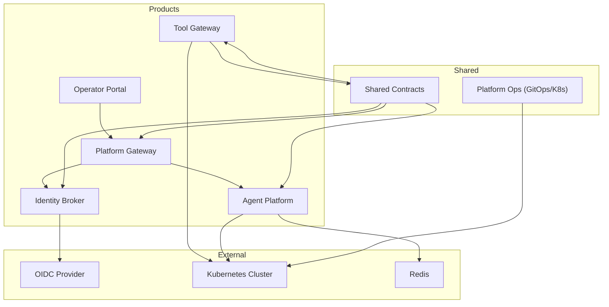
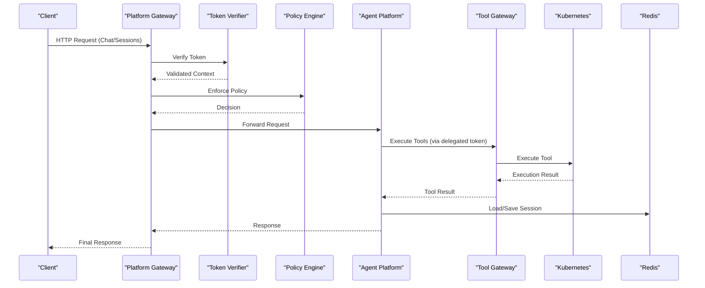
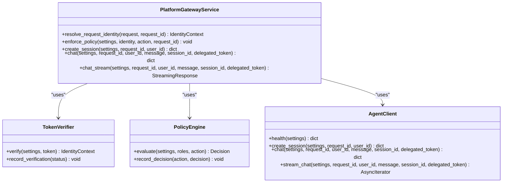
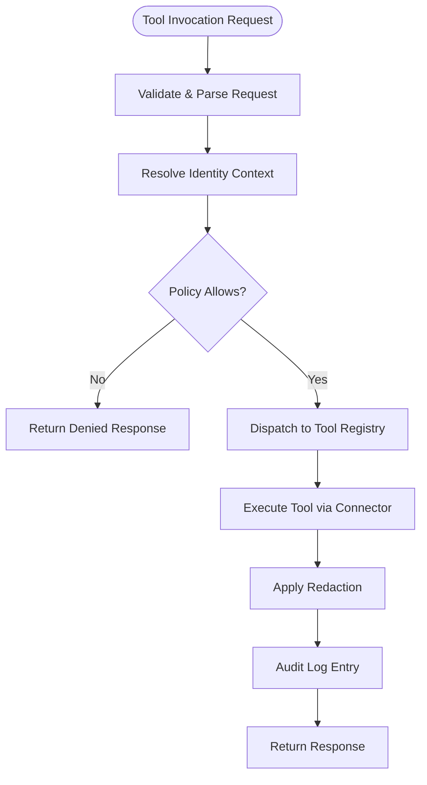
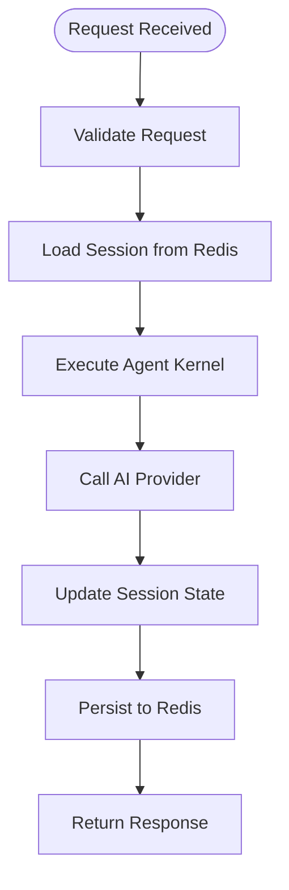
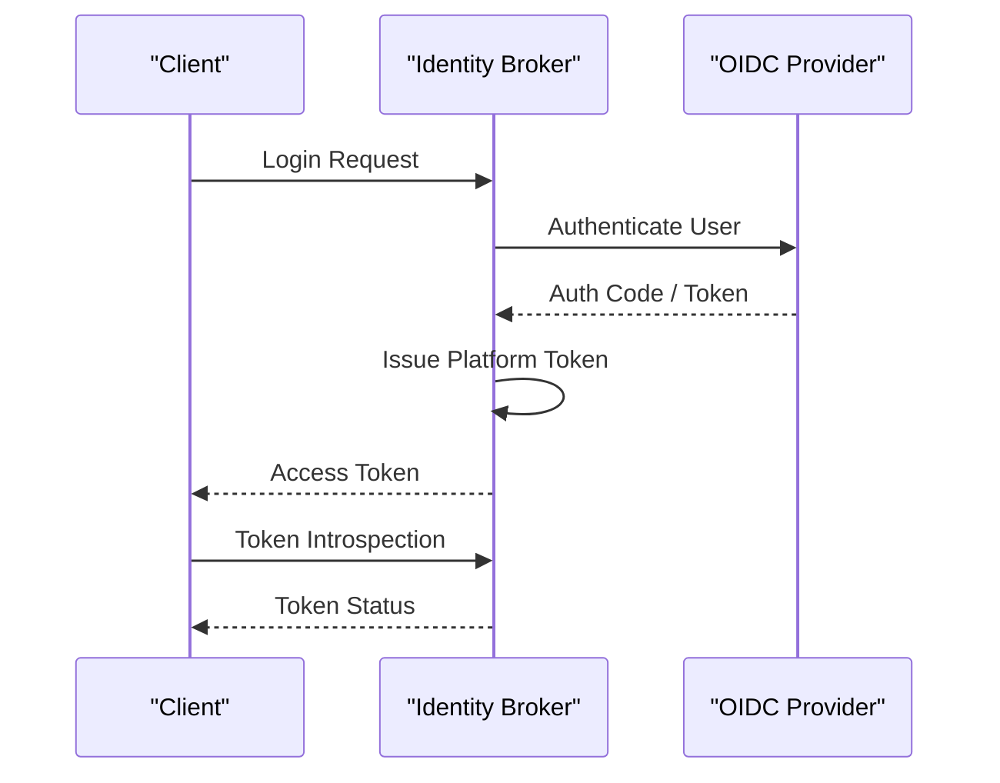
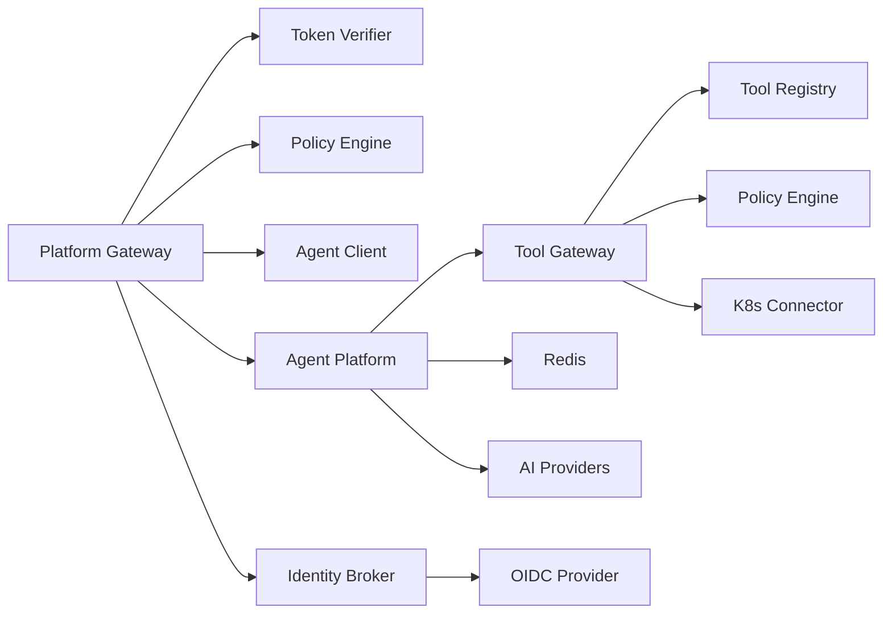
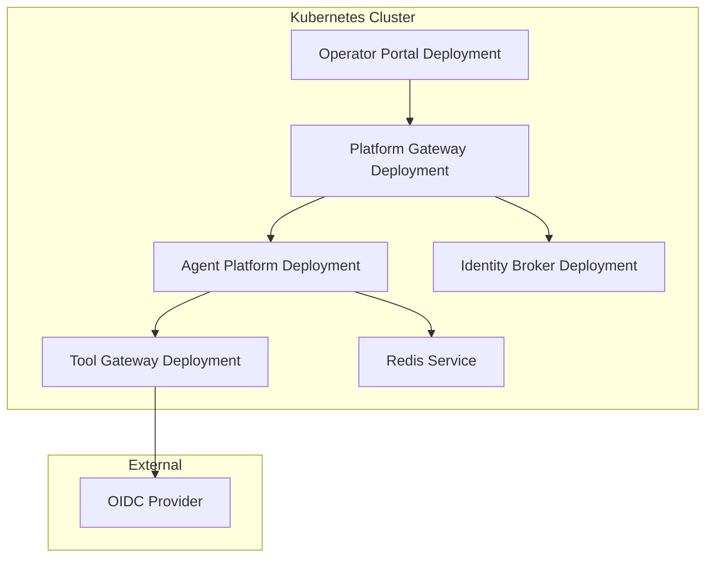

# Architecture Documentation

<cite>
**Referenced Files in This Document**
- [README.md](file://README.md)
- [adr/0001-adopt-spec-driven-development.md](file://docs/adr/0001-adopt-spec-driven-development.md)
- [adr/0002-reaffirm-agentscope-runtime-kernel.md](file://docs/adr/0002-reaffirm-agentscope-runtime-kernel.md)
- [adr/0003-platform-owned-agent-service-contract.md](file://docs/adr/0003-platform-owned-agent-service-contract.md)
- [adr/0004-broker-mediated-token-delegation.md](file://docs/adr/0004-broker-mediated-token-delegation.md)
- [adr/0005-platform-gateway-extraction.md](file://docs/adr/0005-platform-gateway-extraction.md)
- [adr/README.md](file://docs/adr/README.md)
- [part-2-reference-architecture.md](file://docs/agentic-aiops-platform/part-2-reference-architecture.md)
- [identity-and-authorization-design.md](file://docs/agentic-aiops-platform/identity-and-authorization-design.md)
- [agent-platform-runtime-options.md](file://docs/agentic-aiops-platform/agent-platform-runtime-options.md)
- [policy-specification.md](file://docs/agentic-aiops-platform/policy-specification.md)
- [main.py](file://products/platform-gateway/src/platform_gateway/main.py)
- [app.py](file://products/platform-gateway/src/platform_gateway/app.py)
- [router.py](file://products/platform-gateway/src/platform_gateway/api/router.py)
- [gateway_service.py](file://products/platform-gateway/src/platform_gateway/services/gateway_service.py)
- [token_verifier.py](file://products/platform-gateway/src/platform_gateway/services/token_verifier.py)
- [policy_engine.py](file://products/platform-gateway/src/platform_gateway/services/policy_engine.py)
- [main.py](file://products/tool-gateway/src/tool_gateway/main.py)
- [app.py](file://products/tool-gateway/src/tool_gateway/app.py)
- [router.py](file://products/tool-gateway/src/tool_gateway/api/router.py)
- [gateway_service.py](file://products/tool-gateway/src/tool_gateway/services/gateway_service.py)
- [token_verifier.py](file://products/tool-gateway/src/tool_gateway/services/token_verifier.py)
- [policy_engine.py](file://products/tool-gateway/src/tool_gateway/services/policy_engine.py)
- [k8s_connector.py](file://products/tool-gateway/src/tool_gateway/tools/k8s_connector.py)
- [main.py](file://products/agent-platform/src/agent_service/main.py)
- [app.py](file://products/agent-platform/src/agent_service/app.py)
- [runtime_kernel.py](file://products/agent-platform/src/agent_service/runtime_kernel.py)
- [session_service.py](file://products/agent-platform/src/agent_service/services/session_service.py)
- [session_store.py](file://products/agent-platform/src/agent_service/services/session_store.py)
- [config.py](file://products/agent-platform/src/agent_service/core/config.py)
- [observability.py](file://products/agent-platform/src/agent_service/core/observability.py)
- [metrics.py](file://products/agent-platform/src/agent_service/core/metrics.py)
- [main.py](file://products/identity-broker/src/identity_service/main.py)
- [app.py](file://products/identity-broker/src/identity_service/app.py)
- [auth.py](file://products/identity-broker/src/identity_service/api/routes/auth.py)
- [identity_service.py](file://products/identity-broker/src/identity_service/services/identity_service.py)
- [token_service.py](file://products/identity-broker/src/identity_service/services/token_service.py)
- [redis-deployment.yaml](file://shared/platform-ops/gitops/dev-k8s/base/infra/redis-deployment.yaml)
- [redis-service.yaml](file://shared/platform-ops/gitops/dev-k8s/base/infra/redis-service.yaml)
- [platform-gateway-deployment.yaml](file://shared/platform-ops/gitops/dev-k8s/base/platform-gateway/platform-gateway-deployment.yaml)
- [platform-gateway-service.yaml](file://shared/platform-ops/gitops/dev-k8s/base/platform-gateway/platform-gateway-service.yaml)
- [rbac.yaml](file://shared/platform-ops/gitops/dev-k8s/base/platform-gateway/rbac.yaml)
- [tool-gateway-deployment.yaml](file://shared/platform-ops/gitops/dev-k8s/base/tool-gateway/tool-gateway-deployment.yaml)
- [tool-gateway-service.yaml](file://shared/platform-ops/gitops/dev-k8s/base/tool-gateway/tool-gateway-service.yaml)
- [rbac.yaml](file://shared/platform-ops/gitops/dev-k8s/base/tool-gateway/rbac.yaml)
- [agent-service-deployment.yaml](file://shared/platform-ops/gitops/dev-k8s/base/agent-platform/agent-service-deployment.yaml)
- [agent-service-service.yaml](file://shared/platform-ops/gitops/dev-k8s/base/agent-platform/agent-service-service.yaml)
- [identity-service-deployment.yaml](file://shared/platform-ops/gitops/dev-k8s/base/identity-broker/identity-service-deployment.yaml)
- [identity-service-service.yaml](file://shared/platform-ops/gitops/dev-k8s/base/identity-broker/identity-service-service.yaml)
- [web-ui-deployment.yaml](file://shared/platform-ops/gitops/dev-k8s/base/operator-portal/web-ui-deployment.yaml)
- [web-ui-service.yaml](file://shared/platform-ops/gitops/dev-k8s/base/operator-portal/web-ui-service.yaml)
- [kustomization.yaml](file://shared/platform-ops/gitops/dev-k8s/base/kustomization.yaml)
- [deploy.sh](file://shared/platform-ops/gitops/dev-k8s/deploy.sh)
</cite>

## Update Summary
**Changes Made**
- Updated architecture overview to reflect the split of monolithic API gateway into two specialized services
- Added detailed documentation for platform-gateway service responsible for portal-facing operations
- Updated tool-gateway service documentation to focus exclusively on tool execution and connector management
- Revised component analysis sections to document both gateway services separately
- Updated deployment topology diagrams to show the new dual-gateway architecture
- Enhanced dependency analysis to reflect the new service boundaries and communication patterns

## Table of Contents
1. [Introduction](#introduction)
2. [Project Structure](#project-structure)
3. [Core Components](#core-components)
4. [Architecture Overview](#architecture-overview)
5. [Detailed Component Analysis](#detailed-component-analysis)
6. [Dependency Analysis](#dependency-analysis)
7. [Performance Considerations](#performance-considerations)
8. [Troubleshooting Guide](#troubleshooting-guide)
9. [Conclusion](#conclusion)
10. [Appendices](#appendices)

## Introduction
This document provides a comprehensive architectural overview of the Luban AIOps Platform. It describes the microservices-based design, service boundaries, data flows, and integration points. The platform has undergone a major architectural evolution with the split of the monolithic API gateway into two specialized services: **platform-gateway** for portal-facing operations and **tool-gateway** for tool execution. It also documents key architectural decisions captured in Architectural Decision Records (ADRs), technology stack choices (FastAPI, Redis, Kubernetes, OIDC), system context diagrams, scalability considerations, deployment topology, infrastructure requirements, and cross-cutting concerns such as security, monitoring, logging, and error handling.

## Project Structure
The repository is organized into product services, shared contracts, platform operations, and documentation:
- Products:
  - **platform-gateway**: Portal-facing API edge with token verification, policy enforcement, chat/session proxying, and identity delegation.
  - **tool-gateway**: Tool execution framework with registry, connectors, redaction, and audit capabilities.
  - agent-platform: Agent runtime kernel, session management, provider integrations, and observability.
  - identity-broker: Identity and token services for OIDC integration and service-to-service trust.
  - operator-portal: Web UI for operators.
- Shared:
  - platform-ops: GitOps overlays and Kubernetes manifests for dev environment.
  - shared-contracts: JSON schemas and policy definitions used across services.
  - shared-sdk: SDK reference (placeholder).
- Docs:
  - adr: Architectural Decision Records.
  - agentic-aiops-platform: Reference architecture, identity/authorization design, policy specification, and runtime options.
  - specs: Feature specifications and plans.

**Diagram sources**
- [platform-gateway-deployment.yaml](file://shared/platform-ops/gitops/dev-k8s/base/platform-gateway/platform-gateway-deployment.yaml)
- [tool-gateway-deployment.yaml](file://shared/platform-ops/gitops/dev-k8s/base/tool-gateway/tool-gateway-deployment.yaml)
- [agent-service-deployment.yaml](file://shared/platform-ops/gitops/dev-k8s/base/agent-platform/agent-service-deployment.yaml)
- [identity-service-deployment.yaml](file://shared/platform-ops/gitops/dev-k8s/base/identity-broker/identity-service-deployment.yaml)
- [redis-deployment.yaml](file://shared/platform-ops/gitops/dev-k8s/base/infra/redis-deployment.yaml)

**Section sources**
- [README.md](file://README.md)
- [adr/README.md](file://docs/adr/README.md)
- [part-2-reference-architecture.md](file://docs/agentic-aiops-platform/part-2-reference-architecture.md)

## Core Components
The platform now features two specialized gateway services that replaced the original monolithic API gateway:

### Platform Gateway (Portal-Facing Edge)
- **Responsibilities**: Token verification, deny-by-default policy enforcement, chat and session proxying to agent-platform, broker-mediated token delegation, and portal-facing routes (chat, sessions, auth, identity, runtime, health/metrics).
- **Key Features**: Audience-bound JWT validation, action policy enforcement, streaming chat responses, and synthetic development identities.

### Tool Gateway (Tool Execution Framework)
- **Responsibilities**: Tool registry management, connector standardization, tools:list/invoke endpoints, deterministic redaction, tool audit, and Kubernetes connector integration.
- **Key Features**: Tool execution isolation, security-focused redaction choke point, and service-to-service trust via delegated tokens.

### Other Core Services
- **Agent Platform**: Hosts the agent runtime kernel, manages sessions, integrates with AI providers, and exposes APIs for chat and session lifecycle. Uses Redis for durable sessions.
- **Identity Broker**: Handles OIDC flows, issues tokens, and validates identities for both user and service-to-service contexts.
- **Operator Portal**: Web interface for operators to manage platform resources and configurations.

**Section sources**
- [main.py](file://products/platform-gateway/src/platform_gateway/main.py)
- [app.py](file://products/platform-gateway/src/platform_gateway/app.py)
- [router.py](file://products/platform-gateway/src/platform_gateway/api/router.py)
- [gateway_service.py](file://products/platform-gateway/src/platform_gateway/services/gateway_service.py)
- [token_verifier.py](file://products/platform-gateway/src/platform_gateway/services/token_verifier.py)
- [policy_engine.py](file://products/platform-gateway/src/platform_gateway/services/policy_engine.py)
- [main.py](file://products/tool-gateway/src/tool_gateway/main.py)
- [app.py](file://products/tool-gateway/src/tool_gateway/app.py)
- [router.py](file://products/tool-gateway/src/tool_gateway/api/router.py)
- [gateway_service.py](file://products/tool-gateway/src/tool_gateway/services/gateway_service.py)
- [token_verifier.py](file://products/tool-gateway/src/tool_gateway/services/token_verifier.py)
- [policy_engine.py](file://products/tool-gateway/src/tool_gateway/services/policy_engine.py)
- [k8s_connector.py](file://products/tool-gateway/src/tool_gateway/tools/k8s_connector.py)

## Architecture Overview
The platform follows a microservices architecture with a **dual-gateway pattern**. Clients interact with the **platform-gateway** for portal-facing operations, which enforces policies and verifies tokens before delegating to the Agent Platform. The **tool-gateway** handles internal tool execution requests from agent services. The Agent Platform manages agent sessions and interacts with external AI providers and Kubernetes for tool execution. Identity Broker centralizes OIDC flows and token management. Redis provides session durability and caching.

**Diagram sources**
- [gateway_service.py](file://products/platform-gateway/src/platform_gateway/services/gateway_service.py)
- [gateway_service.py](file://products/tool-gateway/src/tool_gateway/services/gateway_service.py)
- [token_verifier.py](file://products/platform-gateway/src/platform_gateway/services/token_verifier.py)
- [policy_engine.py](file://products/platform-gateway/src/platform_gateway/services/policy_engine.py)
- [session_service.py](file://products/agent-platform/src/agent_service/services/session_service.py)
- [session_store.py](file://products/agent-platform/src/agent_service/services/session_store.py)
- [k8s_connector.py](file://products/tool-gateway/src/tool_gateway/tools/k8s_connector.py)

**Section sources**
- [part-2-reference-architecture.md](file://docs/agentic-aiops-platform/part-2-reference-architecture.md)
- [identity-and-authorization-design.md](file://docs/agentic-aiops-platform/identity-and-authorization-design.md)
- [adr/0005-platform-gateway-extraction.md](file://docs/adr/0005-platform-gateway-extraction.md)

## Detailed Component Analysis

### Platform Gateway (Portal-Facing Edge)
**Updated** - New specialized service for portal-facing operations

**Responsibilities:**
- Exposes REST endpoints for chat, sessions, auth, identity, and runtime operations.
- Validates and transforms requests using shared schemas.
- Verifies audience-bound tokens and enforces deny-by-default policies.
- Proxies requests to Agent Platform with proper identity delegation.
- Manages streaming chat responses and session lifecycle.

**Key modules:**
- API router with routes for auth, chat, identity, sessions, runtime, and health.
- Services: gateway service with token verification, policy enforcement, and agent client.
- Delegation client for broker-mediated token exchange.

**Diagram sources**
- [gateway_service.py](file://products/platform-gateway/src/platform_gateway/services/gateway_service.py)
- [token_verifier.py](file://products/platform-gateway/src/platform_gateway/services/token_verifier.py)
- [policy_engine.py](file://products/platform-gateway/src/platform_gateway/services/policy_engine.py)

**Section sources**
- [router.py](file://products/platform-gateway/src/platform_gateway/api/router.py)
- [gateway_service.py](file://products/platform-gateway/src/platform_gateway/services/gateway_service.py)
- [token_verifier.py](file://products/platform-gateway/src/platform_gateway/services/token_verifier.py)
- [policy_engine.py](file://products/platform-gateway/src/platform_gateway/services/policy_engine.py)

### Tool Gateway (Tool Execution Framework)
**Updated** - Now focused exclusively on tool execution and connector management

**Responsibilities:**
- Manages tool registry and connector implementations.
- Provides tools:list and tools:invoke endpoints with strict policy enforcement.
- Implements deterministic redaction choke point for security-sensitive outputs.
- Orchestrates tool execution via Kubernetes connector with proper audit trails.

**Key modules:**
- API router with health and tools endpoints only.
- Services: gateway service with tool invocation orchestration, policy enforcement, and redaction.
- Tools: registry, base classes, Kubernetes connector, and redaction utilities.

**Diagram sources**
- [gateway_service.py](file://products/tool-gateway/src/tool_gateway/services/gateway_service.py)
- [registry.py](file://products/tool-gateway/src/tool_gateway/tools/registry.py)
- [redaction.py](file://products/tool-gateway/src/tool_gateway/tools/redaction.py)

**Section sources**
- [router.py](file://products/tool-gateway/src/tool_gateway/api/router.py)
- [gateway_service.py](file://products/tool-gateway/src/tool_gateway/services/gateway_service.py)
- [token_verifier.py](file://products/tool-gateway/src/tool_gateway/services/token_verifier.py)
- [policy_engine.py](file://products/tool-gateway/src/tool_gateway/services/policy_engine.py)
- [k8s_connector.py](file://products/tool-gateway/src/tool_gateway/tools/k8s_connector.py)

### Agent Platform
**Responsibilities:**
- Implements the agent runtime kernel and session management.
- Integrates with multiple AI providers through a registry.
- Persists sessions durably using Redis.
- Provides observability and metrics.

**Key modules:**
- Runtime kernel for agent lifecycle and execution.
- Session service and store for state management.
- Configuration and observability utilities.

**Diagram sources**
- [runtime_kernel.py](file://products/agent-platform/src/agent_service/runtime_kernel.py)
- [session_service.py](file://products/agent-platform/src/agent_service/services/session_service.py)
- [session_store.py](file://products/agent-platform/src/agent_service/services/session_store.py)
- [config.py](file://products/agent-platform/src/agent_service/core/config.py)

**Section sources**
- [main.py](file://products/agent-platform/src/agent_service/main.py)
- [app.py](file://products/agent-platform/src/agent_service/app.py)
- [runtime_kernel.py](file://products/agent-platform/src/agent_service/runtime_kernel.py)
- [session_service.py](file://products/agent-platform/src/agent_service/services/session_service.py)
- [session_store.py](file://products/agent-platform/src/agent_service/services/session_store.py)
- [config.py](file://products/agent-platform/src/agent_service/core/config.py)
- [observability.py](file://products/agent-platform/src/agent_service/core/observability.py)
- [metrics.py](file://products/agent-platform/src/agent_service/core/metrics.py)

### Identity Broker
**Responsibilities:**
- Manages OIDC authentication flows.
- Issues and validates tokens for users and services.
- Provides identity context for downstream services.

**Key modules:**
- Auth routes for login, token exchange, and introspection.
- Identity and token services for core logic.

**Diagram sources**
- [auth.py](file://products/identity-broker/src/identity_service/api/routes/auth.py)
- [identity_service.py](file://products/identity-broker/src/identity_service/services/identity_service.py)
- [token_service.py](file://products/identity-broker/src/identity_service/services/token_service.py)

**Section sources**
- [main.py](file://products/identity-broker/src/identity_service/main.py)
- [app.py](file://products/identity-broker/src/identity_service/app.py)
- [auth.py](file://products/identity-broker/src/identity_service/api/routes/auth.py)
- [identity_service.py](file://products/identity-broker/src/identity_service/services/identity_service.py)
- [token_service.py](file://products/identity-broker/src/identity_service/services/token_service.py)

## Dependency Analysis
**Updated** - Reflects the new dual-gateway architecture with clear separation of concerns

The platform exhibits clear separation of concerns with well-defined interfaces:
- **Platform Gateway** depends on Token Verifier, Policy Engine, and Agent Client for portal operations.
- **Tool Gateway** depends on Tool Registry, Policy Engine, and Kubernetes Connector for tool execution.
- Agent Platform depends on Session Store (Redis) and AI Providers.
- Identity Broker depends on OIDC Provider.
- All services share common schemas and observability conventions.

**Diagram sources**
- [gateway_service.py](file://products/platform-gateway/src/platform_gateway/services/gateway_service.py)
- [gateway_service.py](file://products/tool-gateway/src/tool_gateway/services/gateway_service.py)
- [token_verifier.py](file://products/platform-gateway/src/platform_gateway/services/token_verifier.py)
- [policy_engine.py](file://products/platform-gateway/src/platform_gateway/services/policy_engine.py)
- [k8s_connector.py](file://products/tool-gateway/src/tool_gateway/tools/k8s_connector.py)
- [session_store.py](file://products/agent-platform/src/agent_service/services/session_store.py)
- [auth.py](file://products/identity-broker/src/identity_service/api/routes/auth.py)

**Section sources**
- [part-2-reference-architecture.md](file://docs/agentic-aiops-platform/part-2-reference-architecture.md)
- [identity-and-authorization-design.md](file://docs/agentic-aiops-platform/identity-and-authorization-design.md)

## Performance Considerations
- **Dual-gateway architecture** enables independent scaling of portal-facing and tool execution workloads.
- Stateless services enable horizontal scaling behind load balancers.
- Redis provides fast session access and caching; consider clustering for high availability.
- Kubernetes deployments allow auto-scaling based on CPU/memory or custom metrics.
- Observability and metrics are integrated to monitor performance and identify bottlenecks.
- Policy evaluation should be optimized to minimize latency; consider caching decisions when appropriate.
- Tool execution isolation prevents resource contention between different tool types.

## Troubleshooting Guide
Common issues and strategies:
- **Authentication failures**: verify OIDC configuration and token formats for both gateways.
- **Policy denials**: inspect policy rules and context passed to the policy engines.
- **Session loss**: check Redis connectivity and persistence settings.
- **Tool execution errors**: review Kubernetes RBAC and tool specifications.
- **Gateway routing issues**: verify platform-gateway proxies to correct endpoints.
- **Observability gaps**: ensure metrics and logs are emitted consistently across both gateways.

**Section sources**
- [observability.py](file://products/agent-platform/src/agent_service/core/observability.py)
- [metrics.py](file://products/agent-platform/src/agent_service/core/metrics.py)
- [rbac.yaml](file://shared/platform-ops/gitops/dev-k8s/base/platform-gateway/rbac.yaml)
- [rbac.yaml](file://shared/platform-ops/gitops/dev-k8s/base/tool-gateway/rbac.yaml)

## Conclusion
The Luban AIOps Platform has evolved to a robust microservices architecture centered around a **dual-gateway pattern**. The **platform-gateway** serves as the portal-facing edge with authentication, authorization, and agent interaction capabilities, while the **tool-gateway** specializes in secure tool execution and connector management. This architectural split improves security boundaries, ownership clarity, and scalability. The use of Redis for session durability, Kubernetes for orchestration, and OIDC for secure authentication ensures scalability, reliability, and security. Clear ADRs guide architectural evolution, while shared contracts and observability conventions promote consistency across services.

## Appendices

### Deployment Topology and Infrastructure Requirements
**Updated** - Reflects the new dual-gateway deployment architecture

- Kubernetes cluster with RBAC enabled.
- Redis instance or cluster for session storage.
- OIDC provider configured for identity broker.
- GitOps overlays for consistent deployments across environments.
- Separate ServiceAccounts and RBAC policies for each gateway service.

**Diagram sources**
- [platform-gateway-deployment.yaml](file://shared/platform-ops/gitops/dev-k8s/base/platform-gateway/platform-gateway-deployment.yaml)
- [tool-gateway-deployment.yaml](file://shared/platform-ops/gitops/dev-k8s/base/tool-gateway/tool-gateway-deployment.yaml)
- [agent-service-deployment.yaml](file://shared/platform-ops/gitops/dev-k8s/base/agent-platform/agent-service-deployment.yaml)
- [identity-service-deployment.yaml](file://shared/platform-ops/gitops/dev-k8s/base/identity-broker/identity-service-deployment.yaml)
- [web-ui-deployment.yaml](file://shared/platform-ops/gitops/dev-k8s/base/operator-portal/web-ui-deployment.yaml)
- [redis-service.yaml](file://shared/platform-ops/gitops/dev-k8s/base/infra/redis-service.yaml)

**Section sources**
- [deploy.sh](file://shared/platform-ops/gitops/dev-k8s/deploy.sh)
- [kustomization.yaml](file://shared/platform-ops/gitops/dev-k8s/base/kustomization.yaml)

### Architectural Decision Records (ADRs) Summary
**Updated** - Includes the new platform gateway extraction ADR

- Spec-driven development ensures contracts are defined before implementation.
- Agentscope runtime kernel reaffirmed for agent execution stability.
- Platform-owned agent service contract standardizes interfaces.
- Broker-mediated token delegation enhances security and trust.
- **New**: Platform gateway extraction separates portal-facing operations from tool execution for improved security and maintainability.

**Section sources**
- [adr/0001-adopt-spec-driven-development.md](file://docs/adr/0001-adopt-spec-driven-development.md)
- [adr/0002-reaffirm-agentscope-runtime-kernel.md](file://docs/adr/0002-reaffirm-agentscope-runtime-kernel.md)
- [adr/0003-platform-owned-agent-service-contract.md](file://docs/adr/0003-platform-owned-agent-service-contract.md)
- [adr/0004-broker-mediated-token-delegation.md](file://docs/adr/0004-broker-mediated-token-delegation.md)
- [adr/0005-platform-gateway-extraction.md](file://docs/adr/0005-platform-gateway-extraction.md)

### Technology Stack Rationale
- FastAPI: High-performance async web framework suitable for microservices.
- Redis: Low-latency session storage and caching.
- Kubernetes: Container orchestration with scaling and self-healing capabilities.
- OIDC: Standardized identity and authorization flow.

**Section sources**
- [agent-platform-runtime-options.md](file://docs/agentic-aiops-platform/agent-platform-runtime-options.md)
- [policy-specification.md](file://docs/agentic-aiops-platform/policy-specification.md)