# Architecture Documentation

<cite>
**Referenced Files in This Document**
- [README.md](file://README.md)
- [adr/0001-adopt-spec-driven-development.md](file://docs/adr/0001-adopt-spec-driven-development.md)
- [adr/0002-reaffirm-agentscope-runtime-kernel.md](file://docs/adr/0002-reaffirm-agentscope-runtime-kernel.md)
- [adr/0003-platform-owned-agent-service-contract.md](file://docs/adr/0003-platform-owned-agent-service-contract.md)
- [adr/0004-broker-mediated-token-delegation.md](file://docs/adr/0004-broker-mediated-token-delegation.md)
- [adr/0005-platform-gateway-extraction.md](file://docs/adr/0005-platform-gateway-extraction.md)
- [adr/README.md](file://docs/adr/README.md)
- [part-2-reference-architecture.md](file://docs/agentic-aiops-platform/part-2-reference-architecture.md)
- [identity-and-authorization-design.md](file://docs/agentic-aiops-platform/identity-and-authorization-design.md)
- [agent-platform-runtime-options.md](file://docs/agentic-aiops-platform/agent-platform-runtime-options.md)
- [policy-specification.md](file://docs/agentic-aiops-platform/policy-specification.md)
- [delivery-roadmap.md](file://docs/agentic-aiops-platform/delivery-roadmap.md)
- [SPEC-038-isolated-execution-worker/spec.md](file://docs/specs/SPEC-038-isolated-execution-worker/spec.md)
- [SPEC-048-policy-testing-rollout-controls/spec.md](file://docs/specs/SPEC-048-policy-testing-rollout-controls/spec.md)
- [SPEC-049-browser-web-check-tools/spec.md](file://docs/specs/SPEC-049-browser-web-check-tools/spec.md)
- [browser_connector.py](file://products/tool-gateway/src/tool_gateway/tools/browser_connector.py)
- [browser_sessions.py](file://products/tool-gateway/src/tool_gateway/tools/browser_sessions.py)
- [config.py](file://products/tool-gateway/src/tool_gateway/core/config.py)
- [credential_sets.py](file://products/tool-gateway/src/tool_gateway/tools/credential_sets.py)
- [tool-gateway-browser-sidecar.yaml](file://shared/platform-ops/gitops/runtime-profiles/browser-dev/tool-gateway-browser-sidecar.yaml)
- [browser-sidecar-network-policy.yaml](file://shared/platform-ops/gitops/runtime-profiles/browser-dev/browser-sidecar-network-policy.yaml)
- [browser.env](file://shared/platform-ops/gitops/runtime-profiles/browser-dev/browser.env)
- [browser-check-target-deployment.yaml](file://shared/platform-ops/gitops/runtime-profiles/browser-dev/browser-check-target-deployment.yaml)
- [browser-check-target-pages.yaml](file://shared/platform-ops/gitops/runtime-profiles/browser-dev/browser-check-target-pages.yaml)
- [main.py](file://products/platform-gateway/src/platform_gateway/main.py)
- [app.py](file://products/platform-gateway/src/platform_gateway/app.py)
- [router.py](file://products/platform-gateway/src/platform_gateway/api/router.py)
- [gateway_service.py](file://products/platform-gateway/src/platform_gateway/services/gateway_service.py)
- [token_verifier.py](file://products/platform-gateway/src/platform_gateway/services/token_verifier.py)
- [policy_engine.py](file://products/platform-gateway/src/platform_gateway/services/policy_engine.py)
- [metadata.py](file://products/platform-gateway/src/platform_gateway/metadata.py)
- [policy-default.yaml](file://products/platform-gateway/src/platform_gateway/policies/policy-default.yaml)
- [main.py](file://products/tool-gateway/src/tool_gateway/main.py)
- [app.py](file://products/tool-gateway/src/tool_gateway/app.py)
- [router.py](file://products/tool-gateway/src/tool_gateway/api/router.py)
- [k8s_connector.py](file://products/tool-gateway/src/tool_gateway/tools/k8s_connector.py)
- [incidents_connector.py](file://products/tool-gateway/src/tool_gateway/tools/incidents_connector.py)
- [main.py](file://products/execution-runtime/src/execution_runtime/main.py)
- [app.py](file://products/execution-runtime/src/execution_runtime/app.py)
- [handoff.py](file://products/execution-runtime/src/execution_runtime/api/routes/handoff.py)
- [executor.py](file://products/execution-runtime/src/execution_runtime/services/executor.py)
- [single_flight.py](file://products/execution-runtime/src/execution_runtime/services/single_flight.py)
- [config.py](file://products/execution-runtime/src/execution_runtime/core/config.py)
- [metadata.py](file://products/execution-runtime/src/execution_runtime/metadata.py)
- [main.py](file://products/identity-broker/src/identity_service/main.py)
- [app.py](file://products/identity-broker/src/identity_service/app.py)
- [auth.py](file://products/identity-broker/src/identity_service/api/routes/auth.py)
- [identity_service.py](file://products/identity-broker/src/identity_service/services/identity_service.py)
- [token_service.py](file://products/identity-broker/src/identity_service/services/token_service.py)
- [config.py](file://products/identity-broker/src/identity_service/core/config.py)
- [redis-deployment.yaml](file://shared/platform-ops/gitops/dev-k8s/base/infra/redis-deployment.yaml)
- [redis-service.yaml](file://shared/platform-ops/gitops/dev-k8s/base/infra/redis-service.yaml)
- [platform-gateway-deployment.yaml](file://shared/platform-ops/gitops/dev-k8s/base/platform-gateway/platform-gateway-deployment.yaml)
- [platform-gateway-service.yaml](file://shared/platform-ops/gitops/dev-k8s/base/platform-gateway/platform-gateway-service.yaml)
- [rbac.yaml](file://shared/platform-ops/gitops/dev-k8s/base/platform-gateway/rbac.yaml)
- [tool-gateway-deployment.yaml](file://shared/platform-ops/gitops/dev-k8s/base/tool-gateway/tool-gateway-deployment.yaml)
- [tool-gateway-service.yaml](file://shared/platform-ops/gitops/dev-k8s/base/tool-gateway/tool-gateway-service.yaml)
- [rbac.yaml](file://shared/platform-ops/gitops/dev-k8s/base/tool-gateway/rbac.yaml)
- [agent-service-deployment.yaml](file://shared/platform-ops/gitops/dev-k8s/base/agent-platform/agent-service-deployment.yaml)
- [agent-service-service.yaml](file://shared/platform-ops/gitops/dev-k8s/base/agent-platform/agent-service-service.yaml)
- [identity-service-deployment.yaml](file://shared/platform-ops/gitops/dev-k8s/base/identity-broker/identity-service-deployment.yaml)
- [identity-service-service.yaml](file://shared/platform-ops/gitops/dev-k8s/base/identity-broker/identity-service-service.yaml)
- [web-ui-deployment.yaml](file://shared/platform-ops/gitops/dev-k8s/base/operator-portal/web-ui-deployment.yaml)
- [web-ui-service.yaml](file://shared/platform-ops/gitops/dev-k8s/base/operator-portal/web-ui-service.yaml)
- [web-ui-httproute.yaml](file://shared/platform-ops/gitops/dev-k8s/base/operator-portal/web-ui-httproute.yaml)
- [runtime-config.env](file://shared/platform-ops/gitops/dev-k8s/base/identity-broker/runtime-config.env)
- [execution-runtime-deployment.yaml](file://shared/platform-ops/gitops/dev-k8s/base/execution-runtime/execution-runtime-deployment.yaml)
- [execution-runtime-service.yaml](file://shared/platform-ops/gitops/dev-k8s/base/execution-runtime/execution-runtime-service.yaml)
- [kustomization.yaml](file://shared/platform-ops/gitops/dev-k8s/base/kustomization.yaml)
- [deploy.sh](file://shared/platform-ops/gitops/dev-k8s/deploy.sh)
- [architecture-overview.md](file://docs/guides/architecture-overview.md)
- [getting-started.md](file://docs/guides/getting-started.md)
- [configuration-reference.md](file://docs/guides/configuration-reference.md)
- [dev-k8s README.md](file://shared/platform-ops/gitops/dev-k8s/README.md)
- [DocumentsView.tsx](file://products/operator-portal/web-ui/app/src/views/workspace/DocumentsView.tsx)
- [DocumentsView.test.tsx](file://products/operator-portal/web-ui/app/src/views/workspace/__tests__/DocumentsView.test.tsx)
- [__init__.py](file://products/audit-service/src/audit_service/__init__.py)
</cite>

## Update Summary
**Changes Made**
- Enhanced browser connector security model with NetworkPolicy-based defense-in-depth to prevent cross-pod CDP access
- Updated CDP port binding to loopback address (127.0.0.1:9222) for improved isolation
- Improved origin validation for read-tier captures with live origin re-checking before snapshots and screenshots
- Added comprehensive NetworkPolicy configuration to deny ingress on CDP port from other pods
- Enhanced browser session security with flow deviation guards and origin mismatch detection
- Updated deployment topology to reflect enhanced security boundaries and network policies

## Table of Contents
1. [Introduction](#introduction)
2. [Project Structure](#project-structure)
3. [Core Components](#core-components)
4. [Architecture Overview](#architecture-overview)
5. [Detailed Component Analysis](#detailed-component-analysis)
6. [Policy Configuration and Enforcement](#policy-configuration-and-enforcement)
7. [Tool Gateway Connectors](#tool-gateway-connectors)
8. [Browser Connector Architecture](#browser-connector-architecture)
9. [Security Model and Defense-in-Depth](#security-model-and-defense-in-depth)
10. [Dependency Analysis](#dependency-analysis)
11. [Performance Considerations](#performance-considerations)
12. [Troubleshooting Guide](#troubleshooting-guide)
13. [Conclusion](#conclusion)
14. [Appendices](#appendices)

## Introduction
This document provides a comprehensive architectural overview of the Luban AIOps Platform. It describes the microservices-based design, service boundaries, data flows, and integration points. The platform has undergone significant architectural evolution with the introduction of an **isolated execution worker service** that fundamentally changes how approved mutating actions are executed, shifting from in-process to isolated worker execution model. This change enhances security boundaries, reduces blast radius, and improves operational reliability. The platform now features a dual-gateway pattern (platform-gateway for portal-facing operations and tool-gateway for tool execution) combined with a dedicated execution-runtime worker for secure mutation execution. Key architectural decisions are captured in Architectural Decision Records (ADRs), technology stack choices include FastAPI, Redis, Kubernetes, OIDC integration, and **Playwright/Chromium headless browser automation** for web application health checks and browser-based tool execution. The platform uses a canonical hostname strategy with `https://aiops.luban.metasync.cc` as the primary entry point and `https://aiops.luban.k8s.orb.local` as a fallback, with OIDC callbacks pinned to the canonical hostname for reliable authentication flows.

**Updated** - Version 0.25.2 brings refined portal rendering capabilities with single-sourced bounded pane heights and improved overflow detection, ensuring consistent user experience across different content types while maintaining the core architectural integrity established in previous releases. The platform now includes enhanced policy configuration with provenance fingerprinting, expanded tool-gateway capabilities including browser-based web application checks, and comprehensive browser automation support for web application health monitoring and troubleshooting. **Enhanced Security**: The browser connector now implements a robust defense-in-depth security model with NetworkPolicy-based restrictions, loopback-only CDP binding, and improved origin validation to prevent unauthorized access and ensure secure browser automation.

## Project Structure
The repository is organized into product services, shared contracts, platform operations, and documentation:
- Products:
  - **platform-gateway**: Portal-facing API edge with token verification, policy enforcement, chat/session proxying, and identity delegation.
  - **tool-gateway**: Tool execution framework with registry, connectors, redaction, audit capabilities, and **enhanced browser automation support with security hardening**.
  - **execution-runtime**: Isolated worker service for secure execution of approved mutating actions with signature verification and single-flight idempotency.
  - agent-platform: Agent runtime kernel, session management, provider integrations, and observability with execution worker client integration.
  - identity-broker: Identity and token services for OIDC integration and service-to-service trust.
  - operator-portal: Web UI for operators with enhanced bounded pane rendering and improved UX.
  - audit-service: Durable audit trail with authenticated event ingest, retention-bounded store, and permission-scoped query API.
- Shared:
  - platform-ops: GitOps overlays and Kubernetes manifests for dev environment including execution-runtime deployment and **enhanced browser sidecar configuration with NetworkPolicy**.
  - shared-contracts: JSON schemas and policy definitions used across services.
  - shared-sdk: SDK reference (placeholder).
- Docs:
  - adr: Architectural Decision Records.
  - agentic-aiops-platform: Reference architecture, identity/authorization design, policy specification, and runtime options.
  - specs: Feature specifications and plans including SPEC-038 for isolated execution worker and **SPEC-049 for browser web-check tools with enhanced security**.

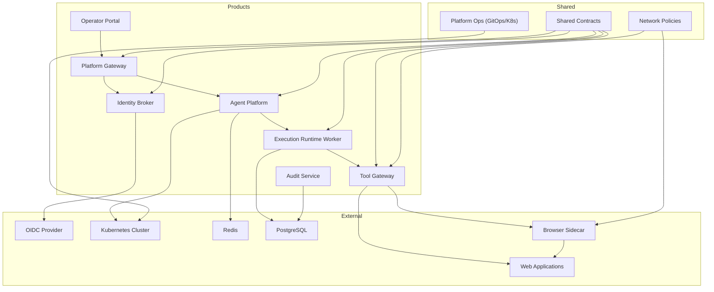

**Diagram sources**
- [execution-runtime-deployment.yaml](file://shared/platform-ops/gitops/dev-k8s/base/execution-runtime/execution-runtime-deployment.yaml)
- [platform-gateway-deployment.yaml](file://shared/platform-ops/gitops/dev-k8s/base/platform-gateway/platform-gateway-deployment.yaml)
- [tool-gateway-deployment.yaml](file://shared/platform-ops/gitops/dev-k8s/base/tool-gateway/tool-gateway-deployment.yaml)
- [agent-service-deployment.yaml](file://shared/platform-ops/gitops/dev-k8s/base/agent-platform/agent-service-deployment.yaml)
- [identity-service-deployment.yaml](file://shared/platform-ops/gitops/dev-k8s/base/identity-broker/identity-service-deployment.yaml)
- [redis-deployment.yaml](file://shared/platform-ops/gitops/dev-k8s/base/infra/redis-deployment.yaml)
- [tool-gateway-browser-sidecar.yaml](file://shared/platform-ops/gitops/runtime-profiles/browser-dev/tool-gateway-browser-sidecar.yaml)
- [browser-sidecar-network-policy.yaml](file://shared/platform-ops/gitops/runtime-profiles/browser-dev/browser-sidecar-network-policy.yaml)

**Section sources**
- [README.md](file://README.md)
- [adr/README.md](file://docs/adr/README.md)
- [part-2-reference-architecture.md](file://docs/agentic-aiops-platform/part-2-reference-architecture.md)

## Core Components
The platform now features three specialized services that replaced the original monolithic approach:

### Platform Gateway (Portal-Facing Edge)
- **Responsibilities**: Token verification, deny-by-default policy enforcement, chat and session proxying to agent-platform, broker-mediated token delegation, and portal-facing routes (chat, sessions, auth, identity, runtime, health/metrics).
- **Key Features**: Audience-bound JWT validation, action policy enforcement, streaming chat responses, and synthetic development identities.
- **Version**: 0.25.2

### Tool Gateway (Tool Execution Framework)
- **Responsibilities**: Tool registry management, connector standardization, tools:list/invoke endpoints, deterministic redaction, tool audit, Kubernetes connector integration, and **enhanced browser automation capabilities with security hardening**.
- **Key Features**: Tool execution isolation, security-focused redaction choke point, service-to-service trust via delegated tokens, and **stateful browser session management with Chromium headless automation and NetworkPolicy protection**.
- **Version**: 0.25.2

### Execution Runtime Worker (Isolated Mutation Executor)
- **Responsibilities**: Secure execution of approved mutating actions through authenticated handoff, signature verification, single-flight idempotency, and receipt authorship.
- **Key Features**: Fail-closed verification, HMAC-signed execution requests/receipts, bounded timeout handling, and infrastructure-enforced isolation.
- **Version**: 0.25.2

### Other Core Services
- **Agent Platform**: Hosts the agent runtime kernel, manages sessions, integrates with AI providers, exposes APIs for chat and session lifecycle, and includes execution worker client for handing off approved mutations. Uses Redis for durable sessions.
- **Identity Broker**: Handles OIDC flows, issues tokens, and validates identities for both user and service-to-service contexts. Configured with canonical hostname callback pinning and extra redirect URIs for reachability.
- **Operator Portal**: Web interface for operators to manage platform resources and configurations with enhanced bounded pane rendering and improved UX. Routes configured for both canonical and fallback hostnames.
- **Audit Service**: Provides durable audit trail with authenticated event ingestion, retention-bounded storage, and permission-scoped query API.

**Section sources**
- [main.py](file://products/platform-gateway/src/platform_gateway/main.py)
- [app.py](file://products/platform-gateway/src/platform_gateway/app.py)
- [router.py](file://products/platform-gateway/src/platform_gateway/api/router.py)
- [gateway_service.py](file://products/platform-gateway/src/platform_gateway/services/gateway_service.py)
- [token_verifier.py](file://products/platform-gateway/src/platform_gateway/services/token_verifier.py)
- [policy_engine.py](file://products/platform-gateway/src/platform_gateway/services/policy_engine.py)
- [metadata.py](file://products/platform-gateway/src/platform_gateway/metadata.py)
- [main.py](file://products/tool-gateway/src/tool_gateway/main.py)
- [app.py](file://products/tool-gateway/src/tool_gateway/app.py)
- [router.py](file://products/tool-gateway/src/tool_gateway/api/router.py)
- [k8s_connector.py](file://products/tool-gateway/src/tool_gateway/tools/k8s_connector.py)
- [main.py](file://products/execution-runtime/src/execution_runtime/main.py)
- [app.py](file://products/execution-runtime/src/execution_runtime/app.py)
- [handoff.py](file://products/execution-runtime/src/execution_runtime/api/routes/handoff.py)
- [executor.py](file://products/execution-runtime/src/execution_runtime/services/executor.py)
- [single_flight.py](file://products/execution-runtime/src/execution_runtime/services/single_flight.py)
- [config.py](file://products/execution-runtime/src/execution_runtime/core/config.py)
- [metadata.py](file://products/execution-runtime/src/execution_runtime/metadata.py)
- [main.py](file://products/identity-broker/src/identity_service/main.py)
- [app.py](file://products/identity-broker/src/identity_service/app.py)
- [auth.py](file://products/identity-broker/src/identity_service/api/routes/auth.py)
- [identity_service.py](file://products/identity-broker/src/identity_service/services/identity_service.py)
- [token_service.py](file://products/identity-broker/src/identity_service/services/token_service.py)
- [config.py](file://products/identity-broker/src/identity_service/core/config.py)
- [runtime-config.env](file://shared/platform-ops/gitops/dev-k8s/base/identity-broker/runtime-config.env)
- [__init__.py](file://products/audit-service/src/audit_service/__init__.py)

## Architecture Overview
The platform follows a microservices architecture with a **triple-layer execution model**. Clients interact with the **platform-gateway** for portal-facing operations, which enforces policies and verifies tokens before delegating to the Agent Platform. The **execution-runtime worker** handles secure execution of approved mutating actions through an authenticated handoff mechanism, while the **tool-gateway** handles internal tool execution requests from agent services. The Agent Platform manages agent sessions and interacts with external AI providers and Kubernetes for tool execution. Identity Broker centralizes OIDC flows and token management. Redis provides session durability and caching, while PostgreSQL stores execution records and receipts.

**Updated** - The platform uses a canonical hostname strategy where `https://aiops.luban.metasync.cc` serves as the primary entry point with OIDC callbacks pinned to this hostname, while `https://aiops.luban.k8s.orb.local` provides fallback access. The identity broker's OIDC callback is explicitly configured to use the canonical hostname, ensuring reliable authentication flows even when users access the portal through alternative hostnames. The tool-gateway now includes **enhanced browser automation capabilities** through a chromium-headless-shell sidecar container with NetworkPolicy protection, enabling secure web application health checks and browser-based troubleshooting workflows with defense-in-depth security measures.

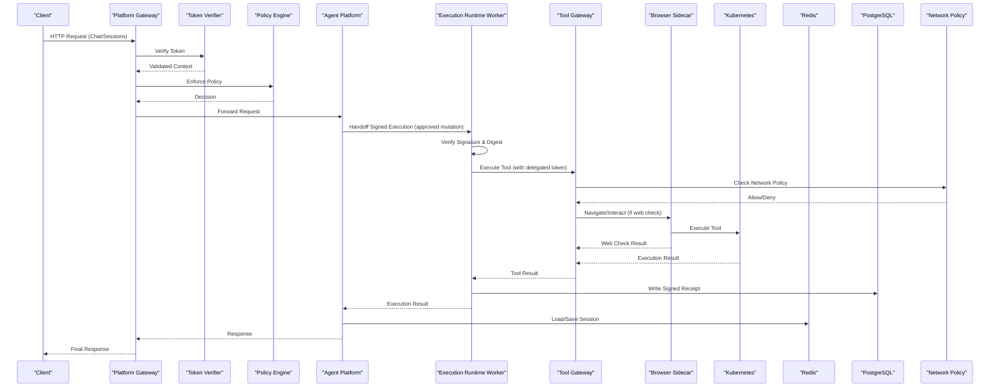

**Diagram sources**
- [handoff.py](file://products/execution-runtime/src/execution_runtime/api/routes/handoff.py)
- [executor.py](file://products/execution-runtime/src/execution_runtime/services/executor.py)
- [execution_worker_client.py](file://products/agent-platform/src/agent_service/services/execution_worker_client.py)
- [gateway_service.py](file://products/platform-gateway/src/platform_gateway/services/gateway_service.py)
- [token_verifier.py](file://products/platform-gateway/src/platform_gateway/services/token_verifier.py)
- [policy_engine.py](file://products/platform-gateway/src/platform_gateway/services/policy_engine.py)
- [session_service.py](file://products/agent-platform/src/agent_service/services/session_service.py)
- [session_store.py](file://products/agent-platform/src/agent_service/services/session_store.py)
- [k8s_connector.py](file://products/tool-gateway/src/tool_gateway/tools/k8s_connector.py)
- [browser_connector.py](file://products/tool-gateway/src/tool_gateway/tools/browser_connector.py)
- [browser_sessions.py](file://products/tool-gateway/src/tool_gateway/tools/browser_sessions.py)
- [browser-sidecar-network-policy.yaml](file://shared/platform-ops/gitops/runtime-profiles/browser-dev/browser-sidecar-network-policy.yaml)

**Section sources**
- [part-2-reference-architecture.md](file://docs/agentic-aiops-platform/part-2-reference-architecture.md)
- [identity-and-authorization-design.md](file://docs/agentic-aiops-platform/identity-and-authorization-design.md)
- [adr/0005-platform-gateway-extraction.md](file://docs/adr/0005-platform-gateway-extraction.md)
- [SPEC-038-isolated-execution-worker/spec.md](file://docs/specs/SPEC-038-isolated-execution-worker/spec.md)
- [architecture-overview.md](file://docs/guides/architecture-overview.md)
- [getting-started.md](file://docs/guides/getting-started.md)
- [dev-k8s README.md](file://shared/platform-ops/gitops/dev-k8s/README.md)

## Detailed Component Analysis

### Platform Gateway (Portal-Facing Edge)
**Updated** - New specialized service for portal-facing operations with canonical hostname support

**Responsibilities:**
- Exposes REST endpoints for chat, sessions, auth, identity, and runtime operations.
- Validates and transforms requests using shared schemas.
- Verifies audience-bound tokens and enforces deny-by-default policies.
- Proxies requests to Agent Platform with proper identity delegation.
- Manages streaming chat responses and session lifecycle.

**Key modules:**
- API router with routes for auth, chat, identity, sessions, runtime, and health.
- Services: gateway service with token verification, policy enforcement, and agent client.
- Delegation client for broker-mediated token exchange.

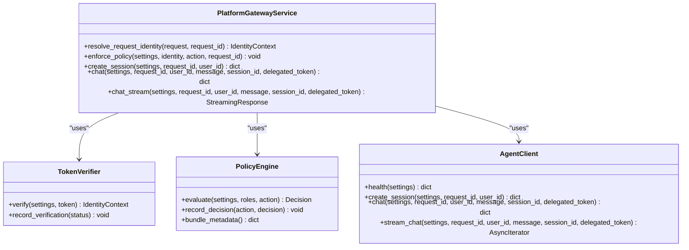

**Diagram sources**
- [gateway_service.py](file://products/platform-gateway/src/platform_gateway/services/gateway_service.py)
- [token_verifier.py](file://products/platform-gateway/src/platform_gateway/services/token_verifier.py)
- [policy_engine.py](file://products/platform-gateway/src/platform_gateway/services/policy_engine.py)

**Section sources**
- [router.py](file://products/platform-gateway/src/platform_gateway/api/router.py)
- [gateway_service.py](file://products/platform-gateway/src/platform_gateway/services/gateway_service.py)
- [token_verifier.py](file://products/platform-gateway/src/platform_gateway/services/token_verifier.py)
- [policy_engine.py](file://products/platform-gateway/src/platform_gateway/services/policy_engine.py)
- [metadata.py](file://products/platform-gateway/src/platform_gateway/metadata.py)

### Tool Gateway (Tool Execution Framework)
**Updated** - Now focused exclusively on tool execution and connector management with expanded connector types including **enhanced browser automation with security hardening**

**Responsibilities:**
- Manages tool registry and connector implementations.
- Provides tools:list and tools:invoke endpoints with strict policy enforcement.
- Implements deterministic redaction choke point for security-sensitive outputs.
- Orchestrates tool execution via Kubernetes connector with proper audit trails.
- Supports **secure browser-based web application checks with flow binding, deviation guards, credential management, and NetworkPolicy protection**.

**Key modules:**
- API router with health and tools endpoints only.
- Services: gateway service with tool invocation orchestration, policy enforcement, and redaction.
- Tools: registry, base classes, Kubernetes connector, incidents connector, **enhanced browser connector**, and redaction utilities.

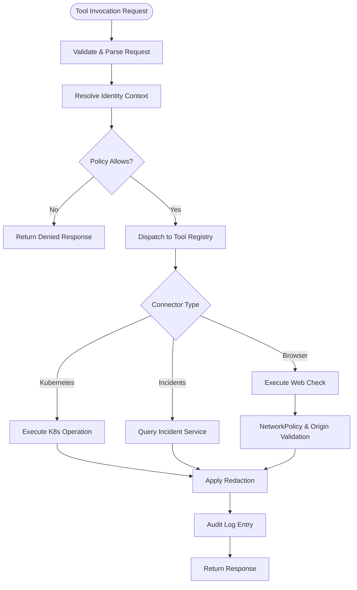

**Diagram sources**
- [gateway_service.py](file://products/tool-gateway/src/tool_gateway/services/gateway_service.py)
- [registry.py](file://products/tool-gateway/src/tool_gateway/tools/registry.py)
- [redaction.py](file://products/tool-gateway/src/tool_gateway/tools/redaction.py)
- [k8s_connector.py](file://products/tool-gateway/src/tool_gateway/tools/k8s_connector.py)
- [incidents_connector.py](file://products/tool-gateway/src/tool_gateway/tools/incidents_connector.py)
- [browser_connector.py](file://products/tool-gateway/src/tool_gateway/tools/browser_connector.py)
- [browser-sidecar-network-policy.yaml](file://shared/platform-ops/gitops/runtime-profiles/browser-dev/browser-sidecar-network-policy.yaml)

**Section sources**
- [router.py](file://products/tool-gateway/src/tool_gateway/api/router.py)
- [gateway_service.py](file://products/tool-gateway/src/tool_gateway/services/gateway_service.py)
- [token_verifier.py](file://products/tool-gateway/src/tool_gateway/services/token_verifier.py)
- [policy_engine.py](file://products/tool-gateway/src/tool_gateway/services/policy_engine.py)
- [k8s_connector.py](file://products/tool-gateway/src/tool_gateway/tools/k8s_connector.py)
- [incidents_connector.py](file://products/tool-gateway/src/tool_gateway/tools/incidents_connector.py)
- [browser_connector.py](file://products/tool-gateway/src/tool_gateway/tools/browser_connector.py)
- [metadata.py](file://products/tool-gateway/src/tool_gateway/metadata.py)

### Execution Runtime Worker (Isolated Mutation Executor)
**New** - Dedicated service for secure execution of approved mutating actions

**Responsibilities:**
- Receives signed execution envelopes through authenticated handoff endpoint.
- Performs fail-closed verification of signatures and argument digests.
- Executes tools through tool-gateway with forwarded delegated tokens.
- Maintains single-flight idempotency keyed by execution_id.
- Authors signed receipts and emits audit events for completed executions.

**Key modules:**
- Handoff route with authentication and verification logic.
- Executor service for tool invocation and result mapping.
- Single-flight registry for idempotency protection.
- Execution signing service for receipt authorship.
- Configuration management with startup validation.


**Diagram sources**
- [handoff.py](file://products/execution-runtime/src/execution_runtime/api/routes/handoff.py)
- [executor.py](file://products/execution-runtime/src/execution_runtime/services/executor.py)
- [single_flight.py](file://products/execution-runtime/src/execution_runtime/services/single_flight.py)
- [config.py](file://products/execution-runtime/src/execution_runtime/core/config.py)

**Section sources**
- [handoff.py](file://products/execution-runtime/src/execution_runtime/api/routes/handoff.py)
- [executor.py](file://products/execution-runtime/src/execution_runtime/services/executor.py)
- [single_flight.py](file://products/execution-runtime/src/execution_runtime/services/single_flight.py)
- [config.py](file://products/execution-runtime/src/execution_runtime/core/config.py)
- [app.py](file://products/execution-runtime/src/execution_runtime/app.py)
- [metadata.py](file://products/execution-runtime/src/execution_runtime/metadata.py)

### Agent Platform
**Updated** - Enhanced with execution worker client integration

**Responsibilities:**
- Implements the agent runtime kernel and session management.
- Integrates with multiple AI providers through a registry.
- Persists sessions durably using Redis.
- Provides observability and metrics.
- Hands off approved mutating actions to execution-runtime worker.

**Key modules:**
- Runtime kernel for agent lifecycle and execution.
- Session service and store for state management.
- Configuration and observability utilities.
- Execution worker client for blocking handoff with bounded timeout.
- Gateway tools integration for mutation execution routing.


**Diagram sources**
- [runtime_kernel.py](file://products/agent-platform/src/agent_service/runtime_kernel.py)
- [session_service.py](file://products/agent-platform/src/agent_service/services/session_service.py)
- [session_store.py](file://products/agent-platform/src/agent_service/services/session_store.py)
- [execution_worker_client.py](file://products/agent-platform/src/agent_service/services/execution_worker_client.py)
- [gateway_tools.py](file://products/agent-platform/src/agent_service/tools/gateway_tools.py)
- [config.py](file://products/agent-platform/src/agent_service/core/config.py)

**Section sources**
- [main.py](file://products/agent-platform/src/agent_service/main.py)
- [app.py](file://products/agent-platform/src/agent_service/app.py)
- [runtime_kernel.py](file://products/agent-platform/src/agent_service/runtime_kernel.py)
- [session_service.py](file://products/agent-platform/src/agent_service/services/session_service.py)
- [session_store.py](file://products/agent-platform/src/agent_service/services/session_store.py)
- [execution_worker_client.py](file://products/agent-platform/src/agent_service/services/execution_worker_client.py)
- [gateway_tools.py](file://products/agent-platform/src/agent_service/tools/gateway_tools.py)
- [runtime_settings.py](file://products/agent-platform/src/agent_service/runtime_settings.py)
- [config.py](file://products/agent-platform/src/agent_service/core/config.py)
- [observability.py](file://products/agent-platform/src/agent_service/core/observability.py)
- [metrics.py](file://products/agent-platform/src/agent_service/core/metrics.py)
- [metadata.py](file://products/agent-platform/src/agent_service/metadata.py)

### Identity Broker
**Updated** - Enhanced with canonical hostname OIDC callback configuration

**Responsibilities:**
- Manages OIDC authentication flows with canonical hostname callback pinning.
- Issues and validates tokens for users and services.
- Provides identity context for downstream services.
- Supports multiple redirect URIs for reachability while maintaining primary callback pinning.

**Key modules:**
- Auth routes for login, token exchange, and introspection.
- Identity and token services for core logic.
- **Updated** - Configuration supporting primary callback URI (`OIDC_REDIRECT_URI`) and extra redirect URIs (`OIDC_EXTRA_REDIRECT_URIS`) for reachability-only scenarios.

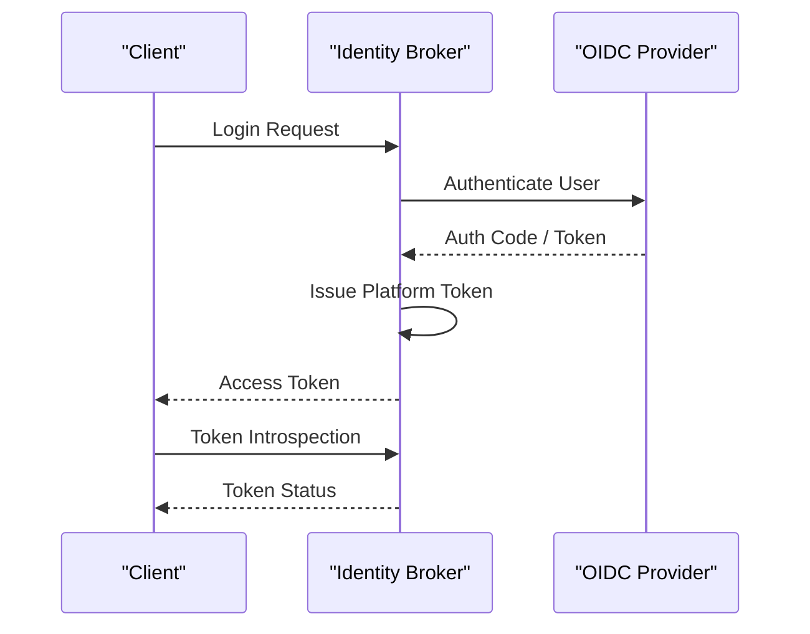

**Diagram sources**
- [auth.py](file://products/identity-broker/src/identity_service/api/routes/auth.py)
- [identity_service.py](file://products/identity-broker/src/identity_service/services/identity_service.py)
- [token_service.py](file://products/identity-broker/src/identity_service/services/token_service.py)
- [config.py](file://products/identity-broker/src/identity_service/core/config.py)

**Section sources**
- [main.py](file://products/identity-broker/src/identity_service/main.py)
- [app.py](file://products/identity-broker/src/identity_service/app.py)
- [auth.py](file://products/identity-broker/src/identity_service/api/routes/auth.py)
- [identity_service.py](file://products/identity-broker/src/identity_service/services/identity_service.py)
- [token_service.py](file://products/identity-broker/src/identity_service/services/token_service.py)
- [config.py](file://products/identity-broker/src/identity_service/core/config.py)
- [runtime-config.env](file://shared/platform-ops/gitops/dev-k8s/base/identity-broker/runtime-config.env)

## Policy Configuration and Enforcement
**New** - Comprehensive policy configuration system with provenance tracking and controlled rollout

The platform implements a sophisticated policy configuration system with a 5-step lifecycle that ensures safe and auditable policy changes:

### 5-Step Policy Lifecycle

#### Step 1: Bundle Authoring and Version Management
- Policy bundles are YAML files defining rules for action authorization
- Each bundle contains a `version` field that must be bumped on every rule change
- Bundles follow a strict schema with role-based access control rules
- Default bundled policies provide baseline security posture

#### Step 2: Bundle Loading and Validation
- Policy engines load bundles at startup with path-keyed caching
- Bundles are validated against schema constraints during loading
- Invalid bundles cause immediate startup failure (fail-fast posture)
- Both platform-gateway and tool-gateway maintain separate policy engines

#### Step 3: Provenance Fingerprinting
- SHA-256 content hash computed at load time for exact bundle text
- Hash exposed through transparency surfaces (`GET /api/v1/policy/matrix`)
- Readiness/health endpoints include bundle provenance metadata
- Enables operators to verify deployed bundle matches intended version

#### Step 4: Scenario Testing and Rollout Controls
- Scenario-expectation harness validates policy changes don't silently alter grants
- `make verify` runs scenario tests alongside existing validation
- `make policy-diff` generates impact reports comparing bundle versions
- Explicitly documented no hot-reload capability - requires pod restart

#### Step 5: Live Enforcement and Monitoring
- Loaded bundles cached per configured path for performance
- Policy evaluation happens on each request with deny-by-default semantics
- Approval tiers (tier_1, tier_2) gate sensitive operations
- Audit trails capture all policy decisions and approval workflows

### Key Security Features

**Provenance Tracking**: Every loaded bundle gets a unique SHA-256 hash computed from its exact content, enabling operators to verify which policy bundle is actually enforced at runtime.

**Controlled Rollout**: The explicit no hot-reload capability ensures policy changes go through proper review and testing processes before deployment.

**Scenario Testing**: Automated testing prevents accidental grant changes by validating expected outcomes for all role-action combinations.

**Approval Workflows**: Multi-tier approval system for sensitive operations, with tier_2 requiring designated approvers distinct from requesters.

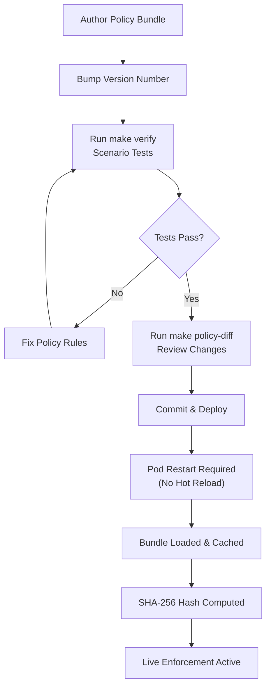

**Diagram sources**
- [policy_engine.py](file://products/platform-gateway/src/platform_gateway/services/policy_engine.py)
- [policy_engine.py](file://products/tool-gateway/src/tool_gateway/services/policy_engine.py)
- [policy-default.yaml](file://products/platform-gateway/src/platform_gateway/policies/policy-default.yaml)

**Section sources**
- [policy_engine.py](file://products/platform-gateway/src/platform_gateway/services/policy_engine.py)
- [policy_engine.py](file://products/tool-gateway/src/tool_gateway/services/policy_engine.py)
- [policy-default.yaml](file://products/platform-gateway/src/platform_gateway/policies/policy-default.yaml)
- [SPEC-048-policy-testing-rollout-controls/spec.md](file://docs/specs/SPEC-048-policy-testing-rollout-controls/spec.md)

## Tool Gateway Connectors
**New** - Expanded connector ecosystem supporting diverse external systems

The tool-gateway now supports multiple connector types, each providing specialized functionality for different external systems:

### Kubernetes Connector
- **Purpose**: Execute Kubernetes operations with RBAC enforcement
- **Risk Levels**: Read operations (list, get) vs. Mutating operations (delete, create)
- **Security**: Strict parameter validation, resource scoping, and audit logging
- **Use Cases**: Pod management, service discovery, configuration inspection

### Incidents Connector (SPEC-015)
- **Purpose**: Read-only access to incident management system
- **Tools**: `incidents.list`, `incidents.get`
- **Features**: Filtered listing by status/severity/source, detailed incident retrieval
- **Security**: Parameter validation, upstream error mapping, structured evidence
- **Integration**: Authenticates with incident-service using gateway-held credentials

### Browser Connector (SPEC-049)
- **Purpose**: Stateful browser automation for web application health checks and troubleshooting
- **Architecture**: Chromium headless shell sidecar container with CDP communication
- **Security**: Origin allowlists, flow binding, deviation guards, credential sets, **NetworkPolicy protection, and loopback-only CDP binding**
- **Tools**: 
  - Read tier: `web.navigate`, `web.snapshot`, `web.screenshot`, `web.fill_credential`
  - Write tier: `web.click`, `web.type` (require approval)
- **Flow Management**: Skill-declared flows with risk classification and step budgets
- **Evidence**: Screenshots, snapshots, and interaction logs in audit trail

### Connector Registration and Risk Management
Each connector registers its tools with the registry, specifying risk levels and categories. The platform enforces risk-tier admission controls:
- **Read tools**: Require `tools:invoke` permission
- **Write tools**: Require `tools:mutate` permission plus mutating flag enabled
- **Auto-allow exclusion**: Interaction tools cannot be auto-allowed

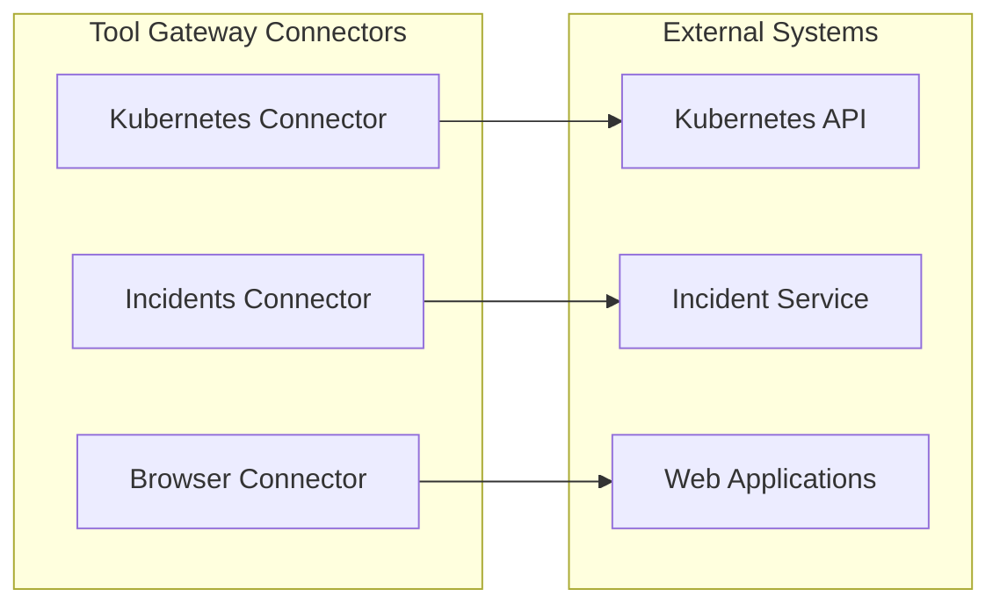

**Diagram sources**
- [k8s_connector.py](file://products/tool-gateway/src/tool_gateway/tools/k8s_connector.py)
- [incidents_connector.py](file://products/tool-gateway/src/tool_gateway/tools/incidents_connector.py)
- [browser_connector.py](file://products/tool-gateway/src/tool_gateway/tools/browser_connector.py)

**Section sources**
- [k8s_connector.py](file://products/tool-gateway/src/tool_gateway/tools/k8s_connector.py)
- [incidents_connector.py](file://products/tool-gateway/src/tool_gateway/tools/incidents_connector.py)
- [browser_connector.py](file://products/tool-gateway/src/tool_gateway/tools/browser_connector.py)
- [SPEC-049-browser-web-check-tools/spec.md](file://docs/specs/SPEC-049-browser-web-check-tools/spec.md)

## Browser Connector Architecture
**New** - Comprehensive browser automation capability for web application health checks and troubleshooting with enhanced security

The browser connector implements a sophisticated headless browser automation system built on Playwright and Chromium, designed specifically for web application health checks and troubleshooting workflows with **defense-in-depth security measures**.

### Core Architecture Components

#### Browser Session Pool
- **Purpose**: Manages stateful browser sessions with connection pooling and resource management
- **Features**: Session TTL management, idle eviction, concurrent session limits, and graceful cleanup
- **Configuration**: Configurable session TTL (default 600s), max sessions (default 4), and CDP endpoint
- **Security**: Sessions keyed by chat session ID to maintain flow continuity across identity switches

#### Flow Binding and Deviation Guards
- **Purpose**: Ensures browser interactions stay within approved skill-defined flows
- **Features**: URL origin validation, risk class enforcement, step budget limits, and deviation detection
- **Security**: Prevents unauthorized navigation and interaction outside approved contexts
- **Audit**: Complete audit trail of flow bindings, deviations, and approvals

#### Credential Management
- **Purpose**: Secure handling of web application credentials without exposing them in logs or results
- **Features**: Named credential sets from secret-mounted files, automatic masking in screenshots and snapshots
- **Security**: Credentials never appear in tool results, snapshots, evidence frames, or audit events
- **Validation**: Structured error handling for unknown credential sets and invalid field names

#### Tool Surface Design
The connector exposes a bounded set of tools organized by risk level:

**Read Tier Tools** (require `tools:invoke`):
- `web.navigate(url, skill_id?)`: Navigate to URLs with optional skill binding
- `web.snapshot()`: Generate accessibility tree snapshots with interactive element references
- `web.screenshot()`: Capture bounded JPEG screenshots with automatic compression
- `web.fill_credential(ref, credential_set, field)`: Fill forms with secure credentials

**Write Tier Tools** (require `tools:mutate` + approval):
- `web.click(ref)`: Click interactive elements within approved flows
- `web.type(ref, text)`: Type text into form fields within approved flows

### Security Model

#### Origin Allowlisting
- **Deny-by-default**: Empty allowlist denies all navigation
- **Pattern matching**: Supports domain patterns like `https://inventory.internal:8443`
- **Redirect protection**: Validates final landing origins after redirects
- **Flow binding**: Ensures interactions stay within approved flow origins

#### Flow-Based Authorization
- **Skill declarations**: Skills declare `web_target` and `risk_class` in frontmatter
- **Deviation guards**: Prevent interactions outside bound flows or beyond step budgets
- **HITL integration**: Write-class flows require operator approval through confirmation bridge
- **Step budgets**: Configurable limits prevent runaway automation loops

#### Evidence and Audit Trail
- **Screenshot capture**: Base64-encoded JPEG images with automatic size reduction
- **Snapshot generation**: Text-based accessibility trees with masked sensitive values
- **Interaction logging**: Complete audit of navigation, clicks, typing, and credential usage
- **Evidence framing**: All browser activities framed as standard tool_result payloads

### Deployment Configuration

#### Sidecar Container Pattern
- **Architecture**: Chromium headless shell runs as separate container in tool-gateway pod
- **Communication**: Chrome DevTools Protocol (CDP) over WebSocket
- **Resource isolation**: Separate CPU/memory limits and security contexts
- **Health monitoring**: Connection readiness checks and graceful degradation

#### Environment Configuration
```yaml
GATEWAY_BROWSER_ENABLED=true
GATEWAY_BROWSER_CDP_ENDPOINT=ws://localhost:9222
GATEWAY_BROWSER_ALLOW_ORIGINS=http://browser-check-target:8080
GATEWAY_BROWSER_SESSION_TTL=600
GATEWAY_BROWSER_MAX_SESSIONS=4
GATEWAY_BROWSER_FLOW_MAX_STEPS=20
GATEWAY_BROWSER_CREDENTIAL_SETS=/etc/luban/browser-credentials/credential-sets.json
GATEWAY_BROWSER_SCREENSHOT_MAX_BYTES=65536
```

#### Kubernetes Deployment
- **Sidecar container**: `chromedp/headless-shell:stable` image with security hardening
- **Volume mounts**: Secret-mounted credential sets and shared memory for browser
- **Resource limits**: CPU and memory constraints to prevent resource exhaustion
- **Network policy**: Pod-local CDP communication only (no external exposure)

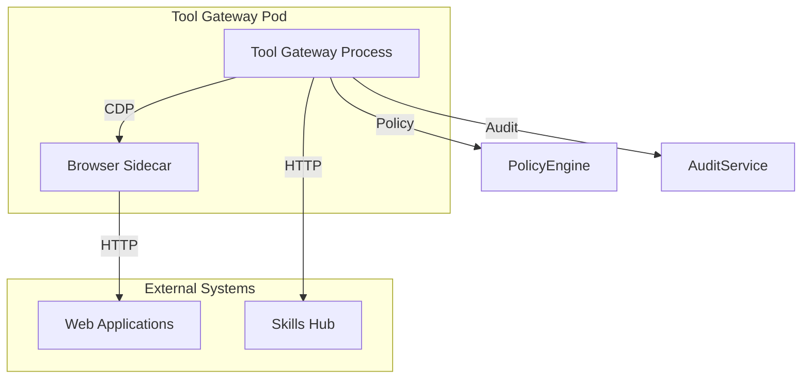

**Diagram sources**
- [browser_connector.py](file://products/tool-gateway/src/tool_gateway/tools/browser_connector.py)
- [browser_sessions.py](file://products/tool-gateway/src/tool_gateway/tools/browser_sessions.py)
- [config.py](file://products/tool-gateway/src/tool_gateway/core/config.py)
- [tool-gateway-browser-sidecar.yaml](file://shared/platform-ops/gitops/runtime-profiles/browser-dev/tool-gateway-browser-sidecar.yaml)

**Section sources**
- [browser_connector.py](file://products/tool-gateway/src/tool_gateway/tools/browser_connector.py)
- [browser_sessions.py](file://products/tool-gateway/src/tool_gateway/tools/browser_sessions.py)
- [config.py](file://products/tool-gateway/src/tool_gateway/core/config.py)
- [credential_sets.py](file://products/tool-gateway/src/tool_gateway/tools/credential_sets.py)
- [SPEC-049-browser-web-check-tools/spec.md](file://docs/specs/SPEC-049-browser-web-check-tools/spec.md)
- [tool-gateway-browser-sidecar.yaml](file://shared/platform-ops/gitops/runtime-profiles/browser-dev/tool-gateway-browser-sidecar.yaml)
- [browser.env](file://shared/platform-ops/gitops/runtime-profiles/browser-dev/browser.env)

## Security Model and Defense-in-Depth
**New** - Comprehensive security model with multiple layers of protection for browser automation

The browser connector implements a multi-layered security approach combining application-level controls with infrastructure-level protections to ensure secure browser automation.

### NetworkPolicy-Based Defense-in-Depth

#### Loopback-Only CDP Binding
- **Primary Protection**: CDP port (9222) bound exclusively to loopback address (127.0.0.1)
- **Implementation**: Explicit command-line arguments force `--remote-debugging-address=127.0.0.1`
- **Port Pinning**: Fixed port 9222 prevents drift from default stable image behavior
- **Access Control**: Only tool-gateway process can communicate via shared pod network namespace

#### NetworkPolicy Restrictions
- **Ingress Denial**: NetworkPolicy explicitly denies all ingress traffic except HTTP port 8080
- **CDP Port Blocking**: Port 9222 deliberately omitted from allowed ports list
- **Defense Layer**: Second layer of protection if loopback binding is accidentally relaxed
- **Compliance**: Works with platform-wide default-deny policies for consistent security posture

### Enhanced Origin Validation

#### Live Origin Re-checking
- **Pre-Capture Validation**: Every snapshot and screenshot validates current page origin before capture
- **Redirect Protection**: Detects and blocks client-side redirects to off-allowlist destinations
- **Flow Deviation Detection**: Ensures captures occur within approved flow boundaries
- **Automatic Remediation**: Halts pages and resets flow state when violations detected

#### Flow Binding Security
- **Skill Declaration Validation**: Confirms skill declares appropriate `web_target` and `risk_class`
- **Origin Matching**: Validates navigated URL matches skill's declared target origin
- **Path Underlying**: Ensures URL path sits under or equals declared target path
- **Step Budget Enforcement**: Limits number of interactions per flow to prevent abuse

### Credential Security

#### Secure Credential Management
- **Named Sets Only**: Credentials stored in named sets from secret-mounted files
- **Never in Logs**: Credential values never appear in tool results, snapshots, or audit events
- **Automatic Masking**: Password fields and filled values masked in visual evidence
- **Runtime Resolution**: Credentials resolved at fill time, not passed as parameters

### Application-Level Security Controls

#### Deviation Guards
- **Flow Boundary Enforcement**: Interactions only execute within bound flow context
- **Origin Mismatch Detection**: Blocks interactions when current page differs from approved origin
- **Risk Class Validation**: Prevents write-tier actions on read-only flows
- **Exhaustion Protection**: Stops interactions after step budget exceeded

#### Authentication and Authorization
- **Identity Keying**: Browser sessions keyed by chat session ID for flow continuity
- **Subject Fallback**: Falls back to verified subject when chat session ID unavailable
- **Policy Enforcement**: All browser tools subject to platform policy engine
- **Approval Workflow**: Write-tier actions require HITL approval through confirmation bridge

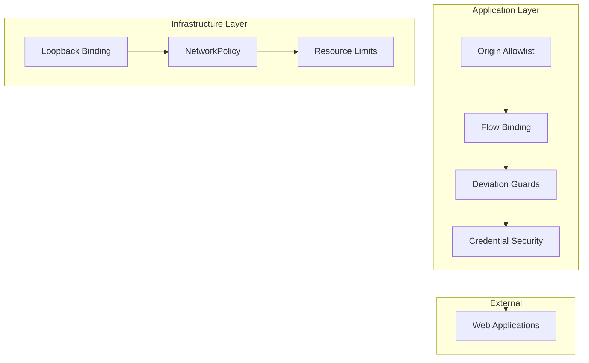

**Diagram sources**
- [browser_connector.py](file://products/tool-gateway/src/tool_gateway/tools/browser_connector.py)
- [browser_sidecar_network_policy.yaml](file://shared/platform-ops/gitops/runtime-profiles/browser-dev/browser-sidecar-network-policy.yaml)
- [tool_gateway_browser_sidecar.yaml](file://shared/platform-ops/gitops/runtime-profiles/browser-dev/tool-gateway-browser-sidecar.yaml)

**Section sources**
- [browser_connector.py](file://products/tool-gateway/src/tool_gateway/tools/browser_connector.py)
- [browser_sidecar_network_policy.yaml](file://shared/platform-ops/gitops/runtime-profiles/browser-dev/browser-sidecar-network-policy.yaml)
- [tool_gateway_browser_sidecar.yaml](file://shared/platform-ops/gitops/runtime-profiles/browser-dev/tool-gateway-browser-sidecar.yaml)
- [browser_sessions.py](file://products/tool-gateway/src/tool_gateway/tools/browser_sessions.py)

## Dependency Analysis
**Updated** - Reflects the new triple-layer architecture with execution-runtime worker, enhanced hostname routing, browser connector dependencies, and NetworkPolicy integration

The platform exhibits clear separation of concerns with well-defined interfaces:
- **Platform Gateway** depends on Token Verifier, Policy Engine, and Agent Client for portal operations.
- **Tool Gateway** depends on Tool Registry, Policy Engine, and multiple connectors (Kubernetes, Incidents, Browser) for tool execution.
- **Execution Runtime Worker** depends on Tool Gateway, Execution Signing, and PostgreSQL for record storage.
- **Agent Platform** depends on Session Store (Redis), AI Providers, and Execution Worker Client.
- **Identity Broker** depends on OIDC Provider with canonical hostname callback configuration.
- **Browser Connector** depends on Playwright, Chromium sidecar, Skills Hub, Credential Set Store, and **NetworkPolicy enforcement**.
- All services share common schemas and observability conventions.

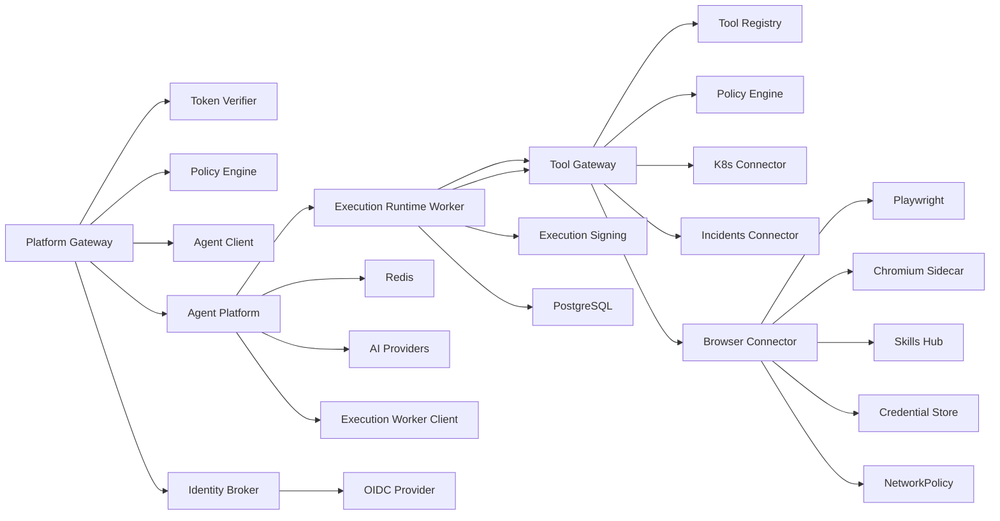

**Diagram sources**
- [gateway_service.py](file://products/platform-gateway/src/platform_gateway/services/gateway_service.py)
- [gateway_service.py](file://products/tool-gateway/src/tool_gateway/services/gateway_service.py)
- [handoff.py](file://products/execution-runtime/src/execution_runtime/api/routes/handoff.py)
- [executor.py](file://products/execution-runtime/src/execution_runtime/services/executor.py)
- [execution_worker_client.py](file://products/agent-platform/src/agent_service/services/execution_worker_client.py)
- [token_verifier.py](file://products/platform-gateway/src/platform_gateway/services/token_verifier.py)
- [policy_engine.py](file://products/platform-gateway/src/platform_gateway/services/policy_engine.py)
- [k8s_connector.py](file://products/tool-gateway/src/tool_gateway/tools/k8s_connector.py)
- [incidents_connector.py](file://products/tool-gateway/src/tool_gateway/tools/incidents_connector.py)
- [browser_connector.py](file://products/tool-gateway/src/tool_gateway/tools/browser_connector.py)
- [browser_sessions.py](file://products/tool-gateway/src/tool_gateway/tools/browser_sessions.py)
- [session_store.py](file://products/agent-platform/src/agent_service/services/session_store.py)
- [auth.py](file://products/identity-broker/src/identity_service/api/routes/auth.py)
- [config.py](file://products/identity-broker/src/identity_service/core/config.py)
- [browser-sidecar-network-policy.yaml](file://shared/platform-ops/gitops/runtime-profiles/browser-dev/browser-sidecar-network-policy.yaml)

**Section sources**
- [part-2-reference-architecture.md](file://docs/agentic-aiops-platform/part-2-reference-architecture.md)
- [identity-and-authorization-design.md](file://docs/agentic-aiops-platform/identity-and-authorization-design.md)

## Performance Considerations
- **Triple-layer architecture** enables independent scaling of portal-facing, tool execution, and mutation execution workloads.
- Stateless services enable horizontal scaling behind load balancers.
- Redis provides fast session access and caching; consider clustering for high availability.
- PostgreSQL provides durable execution record storage with first-write-wins semantics.
- Kubernetes deployments allow auto-scaling based on CPU/memory or custom metrics.
- Execution-runtime worker runs as single replica to maintain in-process single-flight idempotency.
- Observability and metrics are integrated to monitor performance and identify bottlenecks.
- Policy evaluation should be optimized to minimize latency; consider caching decisions when appropriate.
- Tool execution isolation prevents resource contention between different tool types.
- Bounded timeouts prevent resource exhaustion during worker unavailability scenarios.
- **Updated** - Canonical hostname routing ensures optimal DNS resolution and avoids unnecessary redirects, improving authentication flow performance.
- **Updated** - Bounded pane rendering optimizations reduce DOM manipulation overhead and improve portal responsiveness for large documents.
- **Updated** - Browser connector uses connection pooling and session TTL management to optimize resource usage.
- **Updated** - Policy bundle caching eliminates repeated file I/O and parsing overhead.
- **Updated** - Browser session pool implements idle eviction and maximum session limits to prevent memory leaks.
- **Updated** - Screenshot compression algorithms automatically adjust quality and clipping to meet byte limits.
- **Updated** - Chromium sidecar container shares memory with tool-gateway process for efficient inter-process communication.
- **Updated** - NetworkPolicy enforcement adds minimal overhead while providing critical security boundaries.
- **Updated** - Loopback-only CDP binding eliminates network stack overhead for cross-pod communication attempts.

## Troubleshooting Guide
Common issues and strategies:
- **Authentication failures**: verify OIDC configuration and token formats for both gateways.
- **Policy denials**: inspect policy rules and context passed to the policy engines.
- **Session loss**: check Redis connectivity and persistence settings.
- **Tool execution errors**: review Kubernetes RBAC and tool specifications.
- **Gateway routing issues**: verify platform-gateway proxies to correct endpoints.
- **Execution worker failures**: check worker availability, signature verification, and handoff token configuration.
- **Signature verification failures**: verify execution-signing-secret configuration and key consistency.
- **Single-flight conflicts**: investigate concurrent execution attempts and replay scenarios.
- **Observability gaps**: ensure metrics and logs are emitted consistently across all services.
- **Updated** - **Hostname-related issues**: Ensure canonical hostname `https://aiops.luban.metasync.cc` is properly configured in DNS and SSL certificates. If using fallback hostname `https://aiops.luban.k8s.orb.local`, note that OIDC callbacks will still redirect to the canonical hostname due to browser PKCE storage limitations.
- **Updated** - **Portal rendering issues**: Check bounded pane CSS custom properties and overflow detection. The 320px bound is now single-sourced via `--bounded-pane-max-height` custom property, eliminating drift between presentation and affordance logic.
- **Updated** - **Policy configuration issues**: Verify bundle version numbers match expectations, check provenance hashes on transparency surfaces, and ensure scenario tests pass before deployment.
- **Updated** - **Browser connector issues**: Check origin allowlist configuration, skill declarations, and credential set mounting. Verify chromium-headless-shell sidecar is running and accessible via CDP.
- **Updated** - **Browser session issues**: Monitor session TTL expiration, maximum session limits, and connection pool health. Check for orphaned browser contexts and memory usage.
- **Updated** - **Credential management issues**: Verify credential set file format, permissions, and secret mounting. Check for masked values in screenshots and snapshots.
- **Updated** - **Flow binding issues**: Ensure skills have proper `web_target` and `risk_class` declarations. Check for origin mismatches and deviation guard violations.
- **Updated** - **NetworkPolicy issues**: Verify NetworkPolicy is applied correctly and CDP port 9222 is blocked from external access. Check that tool-gateway can still communicate with browser sidecar via loopback.
- **Updated** - **CDP binding issues**: Confirm browser sidecar binds to 127.0.0.1:9222 and not 0.0.0.0:9222. Verify tool-gateway connects to ws://localhost:9222.

**Section sources**
- [observability.py](file://products/agent-platform/src/agent_service/core/observability.py)
- [metrics.py](file://products/agent-platform/src/agent_service/core/metrics.py)
- [rbac.yaml](file://shared/platform-ops/gitops/dev-k8s/base/platform-gateway/rbac.yaml)
- [rbac.yaml](file://shared/platform-ops/gitops/dev-k8s/base/tool-gateway/rbac.yaml)
- [execution-runtime-deployment.yaml](file://shared/platform-ops/gitops/dev-k8s/base/execution-runtime/execution-runtime-deployment.yaml)
- [configuration-reference.md](file://docs/guides/configuration-reference.md)
- [dev-k8s README.md](file://shared/platform-ops/gitops/dev-k8s/README.md)
- [DocumentsView.tsx](file://products/operator-portal/web-ui/app/src/views/workspace/DocumentsView.tsx)
- [browser-sidecar-network-policy.yaml](file://shared/platform-ops/gitops/runtime-profiles/browser-dev/browser-sidecar-network-policy.yaml)
- [tool-gateway-browser-sidecar.yaml](file://shared/platform-ops/gitops/runtime-profiles/browser-dev/tool-gateway-browser-sidecar.yaml)

## Conclusion
The Luban AIOps Platform has evolved to a robust microservices architecture centered around a **triple-layer execution model**. The **platform-gateway** serves as the portal-facing edge with authentication, authorization, and agent interaction capabilities, the **tool-gateway** specializes in secure tool execution and connector management, and the **execution-runtime worker** provides isolated execution of approved mutating actions with tamper-evident signatures and single-flight idempotency. This architectural evolution significantly improves security boundaries, reduces blast radius, and enhances operational reliability. The use of Redis for session durability, PostgreSQL for execution records, Kubernetes for orchestration, and OIDC for secure authentication ensures scalability, reliability, and security. Clear ADRs guide architectural evolution, while shared contracts and observability conventions promote consistency across services. **Updated** - Version 0.25.2 brings refined portal rendering capabilities with single-sourced bounded pane heights and improved overflow detection, ensuring consistent user experience across different content types while maintaining the core architectural integrity established in previous releases. The platform now includes enhanced policy configuration with provenance fingerprinting, expanded tool-gateway capabilities including browser-based web application checks, and comprehensive browser automation support for web application health monitoring and troubleshooting through Playwright/Chromium integration. **Enhanced Security**: The browser connector now implements a robust defense-in-depth security model with NetworkPolicy-based restrictions, loopback-only CDP binding, and improved origin validation to prevent unauthorized access and ensure secure browser automation.

## Appendices

### Deployment Topology and Infrastructure Requirements
**Updated** - Reflects the new triple-layer deployment architecture with execution-runtime worker, dual-hostname routing, browser sidecar integration, and enhanced NetworkPolicy security

- Kubernetes cluster with RBAC enabled.
- Redis instance or cluster for session storage.
- PostgreSQL instance for execution records and receipts.
- OIDC provider configured for identity broker with canonical hostname callback.
- GitOps overlays for consistent deployments across environments.
- Separate ServiceAccounts and RBAC policies for each service.
- Execution-runtime worker deployed as single replica with restricted security context.
- **Updated** - DNS configuration for both `aiops.luban.metasync.cc` (canonical) and `aiops.luban.k8s.orb.local` (fallback) hostnames.
- **Updated** - SSL certificates covering both hostnames for HTTPS access.
- **Updated** - Version lockstep maintained at 0.25.2 across all platform services.
- **Updated** - Optional chromium-headless-shell sidecar container for browser connector functionality.
- **Updated** - Credential set secret mounts for browser connector authentication.
- **Updated** - Network policies allowing CDP communication between tool-gateway and browser sidecar while denying external access.
- **Updated** - Loopback-only CDP binding enforced via command-line arguments and NetworkPolicy restrictions.

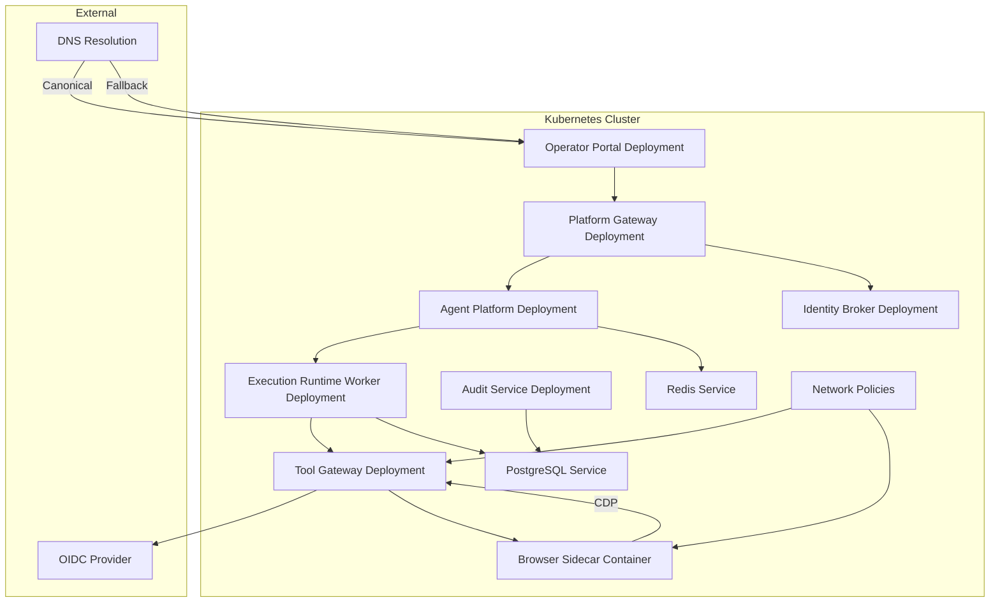

**Diagram sources**
- [execution-runtime-deployment.yaml](file://shared/platform-ops/gitops/dev-k8s/base/execution-runtime/execution-runtime-deployment.yaml)
- [execution-runtime-service.yaml](file://shared/platform-ops/gitops/dev-k8s/base/execution-runtime/execution-runtime-service.yaml)
- [platform-gateway-deployment.yaml](file://shared/platform-ops/gitops/dev-k8s/base/platform-gateway/platform-gateway-deployment.yaml)
- [tool-gateway-deployment.yaml](file://shared/platform-ops/gitops/dev-k8s/base/tool-gateway/tool-gateway-deployment.yaml)
- [agent-service-deployment.yaml](file://shared/platform-ops/gitops/dev-k8s/base/agent-platform/agent-service-deployment.yaml)
- [identity-service-deployment.yaml](file://shared/platform-ops/gitops/dev-k8s/base/identity-broker/identity-service-deployment.yaml)
- [web-ui-deployment.yaml](file://shared/platform-ops/gitops/dev-k8s/base/operator-portal/web-ui-deployment.yaml)
- [web-ui-httproute.yaml](file://shared/platform-ops/gitops/dev-k8s/base/operator-portal/web-ui-httproute.yaml)
- [redis-service.yaml](file://shared/platform-ops/gitops/dev-k8s/base/infra/redis-service.yaml)
- [tool-gateway-browser-sidecar.yaml](file://shared/platform-ops/gitops/runtime-profiles/browser-dev/tool-gateway-browser-sidecar.yaml)
- [browser-sidecar-network-policy.yaml](file://shared/platform-ops/gitops/runtime-profiles/browser-dev/browser-sidecar-network-policy.yaml)

**Section sources**
- [deploy.sh](file://shared/platform-ops/gitops/dev-k8s/deploy.sh)
- [kustomization.yaml](file://shared/platform-ops/gitops/dev-k8s/base/kustomization.yaml)
- [web-ui-httproute.yaml](file://shared/platform-ops/gitops/dev-k8s/base/operator-portal/web-ui-httproute.yaml)
- [runtime-config.env](file://shared/platform-ops/gitops/dev-k8s/base/identity-broker/runtime-config.env)
- [browser.env](file://shared/platform-ops/gitops/runtime-profiles/browser-dev/browser.env)
- [browser-sidecar-network-policy.yaml](file://shared/platform-ops/gitops/runtime-profiles/browser-dev/browser-sidecar-network-policy.yaml)

### Architectural Decision Records (ADRs) Summary
**Updated** - Includes the new execution-runtime worker, platform gateway extraction, browser automation ADRs, and enhanced security measures

- Spec-driven development ensures contracts are defined before implementation.
- Agentscope runtime kernel reaffirmed for agent execution stability.
- Platform-owned agent service contract standardizes interfaces.
- Broker-mediated token delegation enhances security and trust.
- **New**: Platform gateway extraction separates portal-facing operations from tool execution for improved security and maintainability.
- **New**: Isolated execution worker provides infrastructure-enforced isolation for approved mutating actions with tamper-evident signatures and single-flight idempotency.
- **New**: Canonical hostname strategy with OIDC callback pinning ensures reliable authentication flows while supporting fallback access patterns.
- **New**: Policy configuration system with provenance tracking and controlled rollout procedures.
- **New**: Browser automation architecture using Playwright/Chromium sidecar pattern for web application health checks and troubleshooting.
- **New**: Defense-in-depth security model with NetworkPolicy-based restrictions and loopback-only CDP binding for browser automation.

**Section sources**
- [adr/0001-adopt-spec-driven-development.md](file://docs/adr/0001-adopt-spec-driven-development.md)
- [adr/0002-reaffirm-agentscope-runtime-kernel.md](file://docs/adr/0002-reaffirm-agentscope-runtime-kernel.md)
- [adr/0003-platform-owned-agent-service-contract.md](file://docs/adr/0003-platform-owned-agent-service-contract.md)
- [adr/0004-broker-mediated-token-delegation.md](file://docs/adr/0004-broker-mediated-token-delegation.md)
- [adr/0005-platform-gateway-extraction.md](file://docs/adr/0005-platform-gateway-extraction.md)

### Technology Stack Rationale
- FastAPI: High-performance async web framework suitable for microservices.
- Redis: Low-latency session storage and caching.
- PostgreSQL: Durable execution record storage with first-write-wins semantics.
- Kubernetes: Container orchestration with scaling and self-healing capabilities.
- OIDC: Standardized identity and authorization flow with canonical hostname support.
- **New**: Playwright/Chromium: Headless browser automation for web application health checks and troubleshooting.
- **New**: Chrome DevTools Protocol (CDP): Communication protocol for browser automation.
- **New**: YAML: Policy configuration format with schema validation and provenance tracking.
- **New**: Kubernetes NetworkPolicy: Infrastructure-level security enforcement for browser automation isolation.

**Section sources**
- [agent-platform-runtime-options.md](file://docs/agentic-aiops-platform/agent-platform-runtime-options.md)
- [policy-specification.md](file://docs/agentic-aiops-platform/policy-specification.md)
- [SPEC-038-isolated-execution-worker/spec.md](file://docs/specs/SPEC-038-isolated-execution-worker/spec.md)
- [SPEC-049-browser-web-check-tools/spec.md](file://docs/specs/SPEC-049-browser-web-check-tools/spec.md)
- [delivery-roadmap.md](file://docs/agentic-aiops-platform/delivery-roadmap.md)
- [configuration-reference.md](file://docs/guides/configuration-reference.md)

### Hostname and OIDC Configuration Details
**New** - Detailed explanation of the canonical hostname strategy and OIDC callback configuration

The platform implements a dual-hostname strategy to balance production requirements with development flexibility:

**Primary Hostname**: `https://aiops.luban.metasync.cc`
- Used as the canonical entry point for all browser flows
- OIDC callback pinned to `/callback` endpoint
- Required for reliable authentication due to browser PKCE storage per-origin

**Fallback Hostname**: `https://aiops.luban.k8s.orb.local`
- Serves as reachability fallback for OrbStack environments
- Same backend service but cannot reliably complete OIDC flows
- Useful for basic API access when DNS is not available

**OIDC Callback Configuration**:
- Primary callback: `OIDC_REDIRECT_URI=https://aiops.luban.metasync.cc/callback`
- Extra callbacks: `OIDC_EXTRA_REDIRECT_URIS=https://aiops.luban.k8s.orb.local/callback,http://localhost:18080/callback`
- The broker always uses the primary redirect URI for actual authentication flows
- Extra URIs are registered with Keycloak for reachability testing only

**Browser Storage Implications**:
- Browser PKCE pending requests are stored per-origin
- Sign-in started on `orb.local` cannot round-trip back to it after Keycloak redirect
- Users must start authentication flows on the canonical hostname for successful completion
- Port-forwarding `service/web-ui` remains a valid fallback for local development

**Section sources**
- [runtime-config.env](file://shared/platform-ops/gitops/dev-k8s/base/identity-broker/runtime-config.env)
- [web-ui-httproute.yaml](file://shared/platform-ops/gitops/dev-k8s/base/operator-portal/web-ui-httproute.yaml)
- [configuration-reference.md](file://docs/guides/configuration-reference.md)
- [dev-k8s README.md](file://shared/platform-ops/gitops/dev-k8s/README.md)
- [getting-started.md](file://docs/guides/getting-started.md)

### Portal Rendering Enhancements (v0.25.1/v0.25.2)
**New** - Detailed documentation of recent portal rendering improvements

The v0.25.1/v0.25.2 releases bring significant improvements to the operator portal's document rendering capabilities:

**Bounded Pane Improvements**:
- Single-sourced height management via `BOUNDED_PANE_MAX_HEIGHT` constant (320px)
- CSS custom property `--bounded-pane-max-height` eliminates drift between presentation and affordance logic
- Pinned chrome for bounded panes keeps tab bars and collapse headers visible while content scrolls
- Post-motion re-measure fixes address antd enter-motion measurement races

**Document Type Enhancements**:
- Raw JSON tab renamed to "Digest data" for clarity
- House layout rules codified: tables for repeated records, description lists for single objects, bullets for long text, chips for identifiers
- Incident report Triage tab updated to follow layout rules consistently

**Testing and Validation**:
- Fake-timer regression test pins the first-reveal race fix
- Portal suite maintains 190 tests with green status
- TypeScript compilation clean with no emit warnings

**Section sources**
- [DocumentsView.tsx](file://products/operator-portal/web-ui/app/src/views/workspace/DocumentsView.tsx)
- [DocumentsView.test.tsx](file://products/operator-portal/web-ui/app/src/views/workspace/__tests__/DocumentsView.test.tsx)

### Browser Connector Configuration Reference
**New** - Comprehensive configuration guide for browser connector setup and tuning with enhanced security

#### Environment Variables
- `GATEWAY_BROWSER_ENABLED`: Enable/disable browser connector (default: false)
- `GATEWAY_BROWSER_CDP_ENDPOINT`: Chromium CDP endpoint URL (default: ws://localhost:9222)
- `GATEWAY_BROWSER_SESSION_TTL`: Session idle timeout in seconds (default: 600)
- `GATEWAY_BROWSER_MAX_SESSIONS`: Maximum concurrent browser sessions (default: 4)
- `GATEWAY_BROWSER_ALLOW_ORIGINS`: Comma-separated list of allowed origins
- `GATEWAY_BROWSER_FLOW_MAX_STEPS`: Maximum steps per browser flow (default: 20)
- `GATEWAY_BROWSER_CREDENTIAL_SETS`: Path to credential sets JSON file
- `GATEWAY_BROWSER_SCREENSHOT_MAX_BYTES`: Maximum screenshot size in bytes (default: 65536)

#### Credential Sets Format
```json
{
  "application-name": {
    "username": "user@example.com",
    "password": "secure-password"
  }
}
```

#### Skill Declaration Frontmatter
```yaml
---
web_target: https://app.example.com/login
risk_class: write
---
```

#### Security Best Practices
- Always configure origin allowlists explicitly
- Use named credential sets instead of inline credentials
- Set appropriate session TTL and maximum session limits
- Monitor browser memory usage and adjust resource limits accordingly
- Regularly rotate credentials and audit browser activity logs
- **New**: Verify NetworkPolicy is applied to block external CDP access
- **New**: Confirm loopback-only CDP binding is enforced via command-line arguments
- **New**: Test origin validation with client-side redirects to ensure protection works

**Section sources**
- [config.py](file://products/tool-gateway/src/tool_gateway/core/config.py)
- [browser.env](file://shared/platform-ops/gitops/runtime-profiles/browser-dev/browser.env)
- [credential_sets.py](file://products/tool-gateway/src/tool_gateway/tools/credential_sets.py)
- [SPEC-049-browser-web-check-tools/spec.md](file://docs/specs/SPEC-049-browser-web-check-tools/spec.md)
- [browser-sidecar-network-policy.yaml](file://shared/platform-ops/gitops/runtime-profiles/browser-dev/browser-sidecar-network-policy.yaml)
- [tool-gateway-browser-sidecar.yaml](file://shared/platform-ops/gitops/runtime-profiles/browser-dev/tool-gateway-browser-sidecar.yaml)