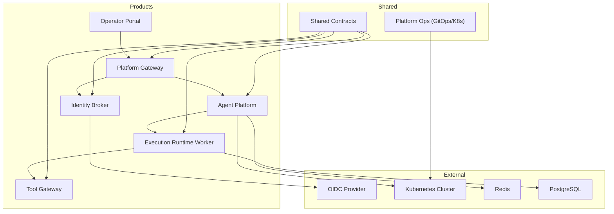
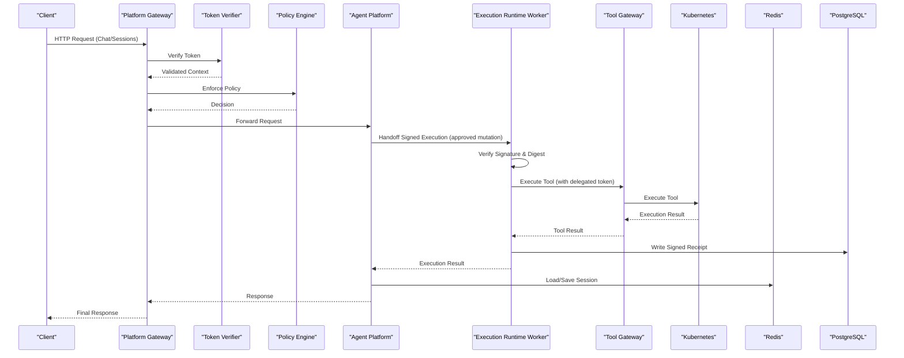
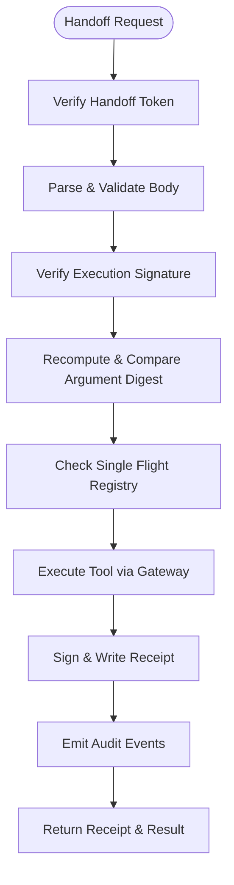
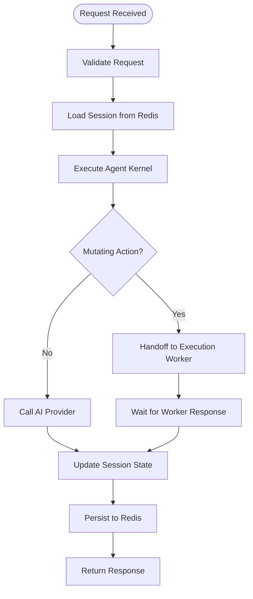
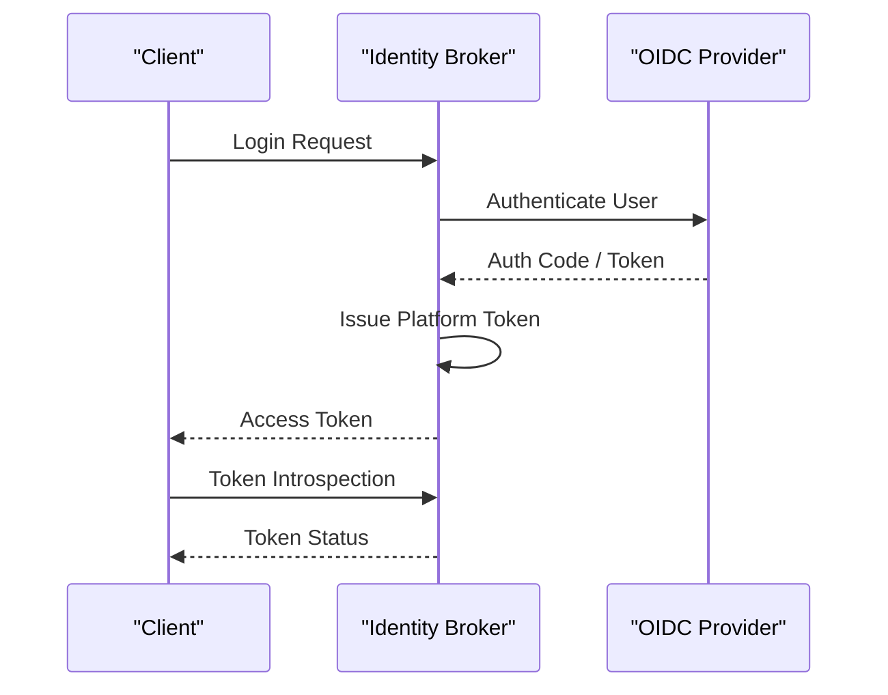
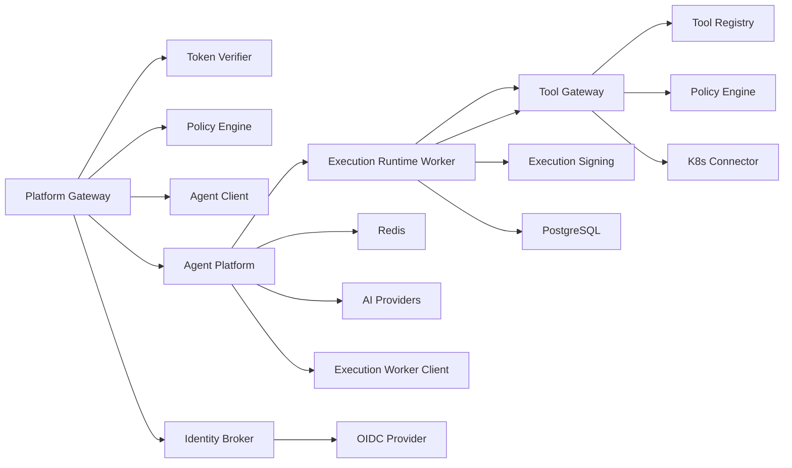
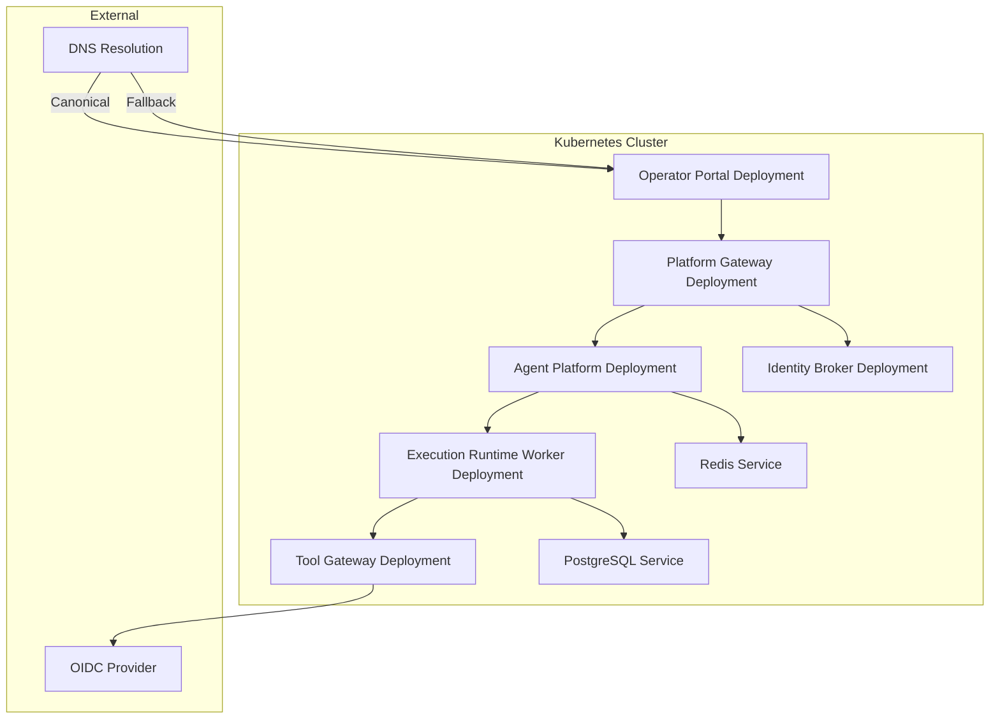

# Architecture Documentation

<cite>
**Referenced Files in This Document**
- [README.md](file://README.md)
- [adr/0001-adopt-spec-driven-development.md](file://docs/adr/0001-adopt-spec-driven-development.md)
- [adr/0002-reaffirm-agentscope-runtime-kernel.md](file://docs/adr/0002-reaffirm-agentscope-runtime-kernel.md)
- [adr/0003-platform-owned-agent-service-contract.md](file://docs/adr/0003-platform-owned-agent-service-contract.md)
- [adr/0004-broker-mediated-token-delegation.md](file://docs/adr/0004-broker-mediated-token-delegation.md)
- [adr/0005-platform-gateway-extraction.md](file://docs/adr/0005-platform-gateway-extraction.md)
- [adr/README.md](file://docs/adr/README.md)
- [part-2-reference-architecture.md](file://docs/agentic-aiops-platform/part-2-reference-architecture.md)
- [identity-and-authorization-design.md](file://docs/agentic-aiops-platform/identity-and-authorization-design.md)
- [agent-platform-runtime-options.md](file://docs/agentic-aiops-platform/agent-platform-runtime-options.md)
- [policy-specification.md](file://docs/agentic-aiops-platform/policy-specification.md)
- [delivery-roadmap.md](file://docs/agentic-aiops-platform/delivery-roadmap.md)
- [SPEC-038-isolated-execution-worker/spec.md](file://docs/specs/SPEC-038-isolated-execution-worker/spec.md)
- [main.py](file://products/platform-gateway/src/platform_gateway/main.py)
- [app.py](file://products/platform-gateway/src/platform_gateway/app.py)
- [router.py](file://products/platform-gateway/src/platform_gateway/api/router.py)
- [gateway_service.py](file://products/platform-gateway/src/platform_gateway/services/gateway_service.py)
- [token_verifier.py](file://products/platform-gateway/src/platform_gateway/services/token_verifier.py)
- [policy_engine.py](file://products/platform-gateway/src/platform_gateway/services/policy_engine.py)
- [main.py](file://products/tool-gateway/src/tool_gateway/main.py)
- [app.py](file://products/tool-gateway/src/tool_gateway/app.py)
- [router.py](file://products/tool-gateway/src/tool_gateway/api/router.py)
- [gateway_service.py](file://products/tool-gateway/src/tool_gateway/services/gateway_service.py)
- [token_verifier.py](file://products/tool-gateway/src/tool_gateway/services/token_verifier.py)
- [policy_engine.py](file://products/tool-gateway/src/tool_gateway/services/policy_engine.py)
- [k8s_connector.py](file://products/tool-gateway/src/tool_gateway/tools/k8s_connector.py)
- [main.py](file://products/agent-platform/src/agent_service/main.py)
- [app.py](file://products/agent-platform/src/agent_service/app.py)
- [runtime_kernel.py](file://products/agent-platform/src/agent_service/runtime_kernel.py)
- [session_service.py](file://products/agent-platform/src/agent_service/services/session_service.py)
- [session_store.py](file://products/agent-platform/src/agent_service/services/session_store.py)
- [config.py](file://products/agent-platform/src/agent_service/core/config.py)
- [observability.py](file://products/agent-platform/src/agent_service/core/observability.py)
- [metrics.py](file://products/agent-platform/src/agent_service/core/metrics.py)
- [execution_worker_client.py](file://products/agent-platform/src/agent_service/services/execution_worker_client.py)
- [gateway_tools.py](file://products/agent-platform/src/agent_service/tools/gateway_tools.py)
- [runtime_settings.py](file://products/agent-platform/src/agent_service/runtime_settings.py)
- [main.py](file://products/execution-runtime/src/execution_runtime/main.py)
- [app.py](file://products/execution-runtime/src/execution_runtime/app.py)
- [handoff.py](file://products/execution-runtime/src/execution_runtime/api/routes/handoff.py)
- [executor.py](file://products/execution-runtime/src/execution_runtime/services/executor.py)
- [single_flight.py](file://products/execution-runtime/src/execution_runtime/services/single_flight.py)
- [config.py](file://products/execution-runtime/src/execution_runtime/core/config.py)
- [main.py](file://products/identity-broker/src/identity_service/main.py)
- [app.py](file://products/identity-broker/src/identity_service/app.py)
- [auth.py](file://products/identity-broker/src/identity_service/api/routes/auth.py)
- [identity_service.py](file://products/identity-broker/src/identity_service/services/identity_service.py)
- [token_service.py](file://products/identity-broker/src/identity_service/services/token_service.py)
- [config.py](file://products/identity-broker/src/identity_service/core/config.py)
- [redis-deployment.yaml](file://shared/platform-ops/gitops/dev-k8s/base/infra/redis-deployment.yaml)
- [redis-service.yaml](file://shared/platform-ops/gitops/dev-k8s/base/infra/redis-service.yaml)
- [platform-gateway-deployment.yaml](file://shared/platform-ops/gitops/dev-k8s/base/platform-gateway/platform-gateway-deployment.yaml)
- [platform-gateway-service.yaml](file://shared/platform-ops/gitops/dev-k8s/base/platform-gateway/platform-gateway-service.yaml)
- [rbac.yaml](file://shared/platform-ops/gitops/dev-k8s/base/platform-gateway/rbac.yaml)
- [tool-gateway-deployment.yaml](file://shared/platform-ops/gitops/dev-k8s/base/tool-gateway/tool-gateway-deployment.yaml)
- [tool-gateway-service.yaml](file://shared/platform-ops/gitops/dev-k8s/base/tool-gateway/tool-gateway-service.yaml)
- [rbac.yaml](file://shared/platform-ops/gitops/dev-k8s/base/tool-gateway/rbac.yaml)
- [agent-service-deployment.yaml](file://shared/platform-ops/gitops/dev-k8s/base/agent-platform/agent-service-deployment.yaml)
- [agent-service-service.yaml](file://shared/platform-ops/gitops/dev-k8s/base/agent-platform/agent-service-service.yaml)
- [identity-service-deployment.yaml](file://shared/platform-ops/gitops/dev-k8s/base/identity-broker/identity-service-deployment.yaml)
- [identity-service-service.yaml](file://shared/platform-ops/gitops/dev-k8s/base/identity-broker/identity-service-service.yaml)
- [web-ui-deployment.yaml](file://shared/platform-ops/gitops/dev-k8s/base/operator-portal/web-ui-deployment.yaml)
- [web-ui-service.yaml](file://shared/platform-ops/gitops/dev-k8s/base/operator-portal/web-ui-service.yaml)
- [web-ui-httproute.yaml](file://shared/platform-ops/gitops/dev-k8s/base/operator-portal/web-ui-httproute.yaml)
- [runtime-config.env](file://shared/platform-ops/gitops/dev-k8s/base/identity-broker/runtime-config.env)
- [execution-runtime-deployment.yaml](file://shared/platform-ops/gitops/dev-k8s/base/execution-runtime/execution-runtime-deployment.yaml)
- [execution-runtime-service.yaml](file://shared/platform-ops/gitops/dev-k8s/base/execution-runtime/execution-runtime-service.yaml)
- [kustomization.yaml](file://shared/platform-ops/gitops/dev-k8s/base/kustomization.yaml)
- [deploy.sh](file://shared/platform-ops/gitops/dev-k8s/deploy.sh)
- [architecture-overview.md](file://docs/guides/architecture-overview.md)
- [getting-started.md](file://docs/guides/getting-started.md)
- [configuration-reference.md](file://docs/guides/configuration-reference.md)
- [dev-k8s README.md](file://shared/platform-ops/gitops/dev-k8s/README.md)
</cite>

## Update Summary
**Changes Made**
- Updated architecture overview to emphasize canonical hostname usage (`https://aiops.luban.metasync.cc`) while noting `orb.local` as fallback
- Clarified identity broker OIDC callback pinning configuration with primary vs extra redirect URIs
- Enhanced deployment topology section to document the dual-hostname routing strategy
- Updated configuration reference to explain the separation between primary callback and reachability-only extras
- Added detailed explanation of browser PKCE storage implications for hostname selection

## Table of Contents
1. [Introduction](#introduction)
2. [Project Structure](#project-structure)
3. [Core Components](#core-components)
4. [Architecture Overview](#architecture-overview)
5. [Detailed Component Analysis](#detailed-component-analysis)
6. [Dependency Analysis](#dependency-analysis)
7. [Performance Considerations](#performance-considerations)
8. [Troubleshooting Guide](#troubleshooting-guide)
9. [Conclusion](#conclusion)
10. [Appendices](#appendices)

## Introduction
This document provides a comprehensive architectural overview of the Luban AIOps Platform. It describes the microservices-based design, service boundaries, data flows, and integration points. The platform has undergone significant architectural evolution with the introduction of an **isolated execution worker service** that fundamentally changes how approved mutating actions are executed, shifting from in-process to isolated worker execution model. This change enhances security boundaries, reduces blast radius, and improves operational reliability. The platform now features a dual-gateway pattern (platform-gateway for portal-facing operations and tool-gateway for tool execution) combined with a dedicated execution-runtime worker for secure mutation execution. Key architectural decisions are captured in Architectural Decision Records (ADRs), technology stack choices include FastAPI, Redis, Kubernetes, and OIDC integration, along with system context diagrams showing external dependencies and internal service communication. The platform uses a canonical hostname strategy with `https://aiops.luban.metasync.cc` as the primary entry point and `https://aiops.luban.k8s.orb.local` as a fallback, with OIDC callbacks pinned to the canonical hostname for reliable authentication flows.

## Project Structure
The repository is organized into product services, shared contracts, platform operations, and documentation:
- Products:
  - **platform-gateway**: Portal-facing API edge with token verification, policy enforcement, chat/session proxying, and identity delegation.
  - **tool-gateway**: Tool execution framework with registry, connectors, redaction, and audit capabilities.
  - **execution-runtime**: Isolated worker service for secure execution of approved mutating actions with signature verification and single-flight idempotency.
  - agent-platform: Agent runtime kernel, session management, provider integrations, and observability with execution worker client integration.
  - identity-broker: Identity and token services for OIDC integration and service-to-service trust.
  - operator-portal: Web UI for operators.
- Shared:
  - platform-ops: GitOps overlays and Kubernetes manifests for dev environment including execution-runtime deployment.
  - shared-contracts: JSON schemas and policy definitions used across services.
  - shared-sdk: SDK reference (placeholder).
- Docs:
  - adr: Architectural Decision Records.
  - agentic-aiops-platform: Reference architecture, identity/authorization design, policy specification, and runtime options.
  - specs: Feature specifications and plans including SPEC-038 for isolated execution worker.

**Diagram sources**
- [execution-runtime-deployment.yaml](file://shared/platform-ops/gitops/dev-k8s/base/execution-runtime/execution-runtime-deployment.yaml)
- [platform-gateway-deployment.yaml](file://shared/platform-ops/gitops/dev-k8s/base/platform-gateway/platform-gateway-deployment.yaml)
- [tool-gateway-deployment.yaml](file://shared/platform-ops/gitops/dev-k8s/base/tool-gateway/tool-gateway-deployment.yaml)
- [agent-service-deployment.yaml](file://shared/platform-ops/gitops/dev-k8s/base/agent-platform/agent-service-deployment.yaml)
- [identity-service-deployment.yaml](file://shared/platform-ops/gitops/dev-k8s/base/identity-broker/identity-service-deployment.yaml)
- [redis-deployment.yaml](file://shared/platform-ops/gitops/dev-k8s/base/infra/redis-deployment.yaml)

**Section sources**
- [README.md](file://README.md)
- [adr/README.md](file://docs/adr/README.md)
- [part-2-reference-architecture.md](file://docs/agentic-aiops-platform/part-2-reference-architecture.md)

## Core Components
The platform now features three specialized services that replaced the original monolithic approach:

### Platform Gateway (Portal-Facing Edge)
- **Responsibilities**: Token verification, deny-by-default policy enforcement, chat and session proxying to agent-platform, broker-mediated token delegation, and portal-facing routes (chat, sessions, auth, identity, runtime, health/metrics).
- **Key Features**: Audience-bound JWT validation, action policy enforcement, streaming chat responses, and synthetic development identities.

### Tool Gateway (Tool Execution Framework)
- **Responsibilities**: Tool registry management, connector standardization, tools:list/invoke endpoints, deterministic redaction, tool audit, and Kubernetes connector integration.
- **Key Features**: Tool execution isolation, security-focused redaction choke point, and service-to-service trust via delegated tokens.

### Execution Runtime Worker (Isolated Mutation Executor)
- **Responsibilities**: Secure execution of approved mutating actions through authenticated handoff, signature verification, single-flight idempotency, and receipt authorship.
- **Key Features**: Fail-closed verification, HMAC-signed execution requests/receipts, bounded timeout handling, and infrastructure-enforced isolation.

### Other Core Services
- **Agent Platform**: Hosts the agent runtime kernel, manages sessions, integrates with AI providers, exposes APIs for chat and session lifecycle, and includes execution worker client for handing off approved mutations. Uses Redis for durable sessions.
- **Identity Broker**: Handles OIDC flows, issues tokens, and validates identities for both user and service-to-service contexts. **Updated** - Configured with canonical hostname callback pinning and extra redirect URIs for reachability.
- **Operator Portal**: Web interface for operators to manage platform resources and configurations. **Updated** - Routes configured for both canonical and fallback hostnames.

**Section sources**
- [main.py](file://products/platform-gateway/src/platform_gateway/main.py)
- [app.py](file://products/platform-gateway/src/platform_gateway/app.py)
- [router.py](file://products/platform-gateway/src/platform_gateway/api/router.py)
- [gateway_service.py](file://products/platform-gateway/src/platform_gateway/services/gateway_service.py)
- [token_verifier.py](file://products/platform-gateway/src/platform_gateway/services/token_verifier.py)
- [policy_engine.py](file://products/platform-gateway/src/platform_gateway/services/policy_engine.py)
- [main.py](file://products/tool-gateway/src/tool_gateway/main.py)
- [app.py](file://products/tool-gateway/src/tool_gateway/app.py)
- [router.py](file://products/tool-gateway/src/tool_gateway/api/router.py)
- [gateway_service.py](file://products/tool-gateway/src/tool_gateway/services/gateway_service.py)
- [token_verifier.py](file://products/tool-gateway/src/tool_gateway/services/token_verifier.py)
- [policy_engine.py](file://products/tool-gateway/src/tool_gateway/services/policy_engine.py)
- [k8s_connector.py](file://products/tool-gateway/src/tool_gateway/tools/k8s_connector.py)
- [main.py](file://products/execution-runtime/src/execution_runtime/main.py)
- [app.py](file://products/execution-runtime/src/execution_runtime/app.py)
- [handoff.py](file://products/execution-runtime/src/execution_runtime/api/routes/handoff.py)
- [executor.py](file://products/execution-runtime/src/execution_runtime/services/executor.py)
- [single_flight.py](file://products/execution-runtime/src/execution_runtime/services/single_flight.py)
- [config.py](file://products/identity-broker/src/identity_service/core/config.py)
- [runtime-config.env](file://shared/platform-ops/gitops/dev-k8s/base/identity-broker/runtime-config.env)

## Architecture Overview
The platform follows a microservices architecture with a **triple-layer execution model**. Clients interact with the **platform-gateway** for portal-facing operations, which enforces policies and verifies tokens before delegating to the Agent Platform. The **execution-runtime worker** handles secure execution of approved mutating actions through an authenticated handoff mechanism, while the **tool-gateway** handles internal tool execution requests from agent services. The Agent Platform manages agent sessions and interacts with external AI providers and Kubernetes for tool execution. Identity Broker centralizes OIDC flows and token management. Redis provides session durability and caching, while PostgreSQL stores execution records and receipts.

**Updated** - The platform uses a canonical hostname strategy where `https://aiops.luban.metasync.cc` serves as the primary entry point with OIDC callbacks pinned to this hostname, while `https://aiops.luban.k8s.orb.local` provides fallback access. The identity broker's OIDC callback is explicitly configured to use the canonical hostname, ensuring reliable authentication flows even when users access the portal through alternative hostnames.

**Diagram sources**
- [handoff.py](file://products/execution-runtime/src/execution_runtime/api/routes/handoff.py)
- [executor.py](file://products/execution-runtime/src/execution_runtime/services/executor.py)
- [execution_worker_client.py](file://products/agent-platform/src/agent_service/services/execution_worker_client.py)
- [gateway_service.py](file://products/platform-gateway/src/platform_gateway/services/gateway_service.py)
- [gateway_service.py](file://products/tool-gateway/src/tool_gateway/services/gateway_service.py)
- [token_verifier.py](file://products/platform-gateway/src/platform_gateway/services/token_verifier.py)
- [policy_engine.py](file://products/platform-gateway/src/platform_gateway/services/policy_engine.py)
- [session_service.py](file://products/agent-platform/src/agent_service/services/session_service.py)
- [session_store.py](file://products/agent-platform/src/agent_service/services/session_store.py)
- [k8s_connector.py](file://products/tool-gateway/src/tool_gateway/tools/k8s_connector.py)

**Section sources**
- [part-2-reference-architecture.md](file://docs/agentic-aiops-platform/part-2-reference-architecture.md)
- [identity-and-authorization-design.md](file://docs/agentic-aiops-platform/identity-and-authorization-design.md)
- [adr/0005-platform-gateway-extraction.md](file://docs/adr/0005-platform-gateway-extraction.md)
- [SPEC-038-isolated-execution-worker/spec.md](file://docs/specs/SPEC-038-isolated-execution-worker/spec.md)
- [architecture-overview.md](file://docs/guides/architecture-overview.md)
- [getting-started.md](file://docs/guides/getting-started.md)
- [dev-k8s README.md](file://shared/platform-ops/gitops/dev-k8s/README.md)

## Detailed Component Analysis

### Platform Gateway (Portal-Facing Edge)
**Updated** - New specialized service for portal-facing operations with canonical hostname support

**Responsibilities:**
- Exposes REST endpoints for chat, sessions, auth, identity, and runtime operations.
- Validates and transforms requests using shared schemas.
- Verifies audience-bound tokens and enforces deny-by-default policies.
- Proxies requests to Agent Platform with proper identity delegation.
- Manages streaming chat responses and session lifecycle.

**Key modules:**
- API router with routes for auth, chat, identity, sessions, runtime, and health.
- Services: gateway service with token verification, policy enforcement, and agent client.
- Delegation client for broker-mediated token exchange.

**Diagram sources**
- [gateway_service.py](file://products/platform-gateway/src/platform_gateway/services/gateway_service.py)
- [token_verifier.py](file://products/platform-gateway/src/platform_gateway/services/token_verifier.py)
- [policy_engine.py](file://products/platform-gateway/src/platform_gateway/services/policy_engine.py)

**Section sources**
- [router.py](file://products/platform-gateway/src/platform_gateway/api/router.py)
- [gateway_service.py](file://products/platform-gateway/src/platform_gateway/services/gateway_service.py)
- [token_verifier.py](file://products/platform-gateway/src/platform_gateway/services/token_verifier.py)
- [policy_engine.py](file://products/platform-gateway/src/platform_gateway/services/policy_engine.py)

### Tool Gateway (Tool Execution Framework)
**Updated** - Now focused exclusively on tool execution and connector management

**Responsibilities:**
- Manages tool registry and connector implementations.
- Provides tools:list and tools:invoke endpoints with strict policy enforcement.
- Implements deterministic redaction choke point for security-sensitive outputs.
- Orchestrates tool execution via Kubernetes connector with proper audit trails.

**Key modules:**
- API router with health and tools endpoints only.
- Services: gateway service with tool invocation orchestration, policy enforcement, and redaction.
- Tools: registry, base classes, Kubernetes connector, and redaction utilities.

**Diagram sources**
- [gateway_service.py](file://products/tool-gateway/src/tool_gateway/services/gateway_service.py)
- [registry.py](file://products/tool-gateway/src/tool_gateway/tools/registry.py)
- [redaction.py](file://products/tool-gateway/src/tool_gateway/tools/redaction.py)

**Section sources**
- [router.py](file://products/tool-gateway/src/tool_gateway/api/router.py)
- [gateway_service.py](file://products/tool-gateway/src/tool_gateway/services/gateway_service.py)
- [token_verifier.py](file://products/tool-gateway/src/tool_gateway/services/token_verifier.py)
- [policy_engine.py](file://products/tool-gateway/src/tool_gateway/services/policy_engine.py)
- [k8s_connector.py](file://products/tool-gateway/src/tool_gateway/tools/k8s_connector.py)

### Execution Runtime Worker (Isolated Mutation Executor)
**New** - Dedicated service for secure execution of approved mutating actions

**Responsibilities:**
- Receives signed execution envelopes through authenticated handoff endpoint.
- Performs fail-closed verification of signatures and argument digests.
- Executes tools through tool-gateway with forwarded delegated tokens.
- Maintains single-flight idempotency keyed by execution_id.
- Authors signed receipts and emits audit events for completed executions.

**Key modules:**
- Handoff route with authentication and verification logic.
- Executor service for tool invocation and result mapping.
- Single-flight registry for idempotency protection.
- Execution signing service for receipt authorship.
- Configuration management with startup validation.

**Diagram sources**
- [handoff.py](file://products/execution-runtime/src/execution_runtime/api/routes/handoff.py)
- [executor.py](file://products/execution-runtime/src/execution_runtime/services/executor.py)
- [single_flight.py](file://products/execution-runtime/src/execution_runtime/services/single_flight.py)
- [config.py](file://products/execution-runtime/src/execution_runtime/core/config.py)

**Section sources**
- [handoff.py](file://products/execution-runtime/src/execution_runtime/api/routes/handoff.py)
- [executor.py](file://products/execution-runtime/src/execution_runtime/services/executor.py)
- [single_flight.py](file://products/execution-runtime/src/execution_runtime/services/single_flight.py)
- [config.py](file://products/execution-runtime/src/execution_runtime/core/config.py)
- [app.py](file://products/execution-runtime/src/execution_runtime/app.py)

### Agent Platform
**Updated** - Enhanced with execution worker client integration

**Responsibilities:**
- Implements the agent runtime kernel and session management.
- Integrates with multiple AI providers through a registry.
- Persists sessions durably using Redis.
- Provides observability and metrics.
- Hands off approved mutating actions to execution-runtime worker.

**Key modules:**
- Runtime kernel for agent lifecycle and execution.
- Session service and store for state management.
- Configuration and observability utilities.
- Execution worker client for blocking handoff with bounded timeout.
- Gateway tools integration for mutation execution routing.

**Diagram sources**
- [runtime_kernel.py](file://products/agent-platform/src/agent_service/runtime_kernel.py)
- [session_service.py](file://products/agent-platform/src/agent_service/services/session_service.py)
- [session_store.py](file://products/agent-platform/src/agent_service/services/session_store.py)
- [execution_worker_client.py](file://products/agent-platform/src/agent_service/services/execution_worker_client.py)
- [gateway_tools.py](file://products/agent-platform/src/agent_service/tools/gateway_tools.py)
- [config.py](file://products/agent-platform/src/agent_service/core/config.py)

**Section sources**
- [main.py](file://products/agent-platform/src/agent_service/main.py)
- [app.py](file://products/agent-platform/src/agent_service/app.py)
- [runtime_kernel.py](file://products/agent-platform/src/agent_service/runtime_kernel.py)
- [session_service.py](file://products/agent-platform/src/agent_service/services/session_service.py)
- [session_store.py](file://products/agent-platform/src/agent_service/services/session_store.py)
- [execution_worker_client.py](file://products/agent-platform/src/agent_service/services/execution_worker_client.py)
- [gateway_tools.py](file://products/agent-platform/src/agent_service/tools/gateway_tools.py)
- [runtime_settings.py](file://products/agent-platform/src/agent_service/runtime_settings.py)
- [config.py](file://products/agent-platform/src/agent_service/core/config.py)
- [observability.py](file://products/agent-platform/src/agent_service/core/observability.py)
- [metrics.py](file://products/agent-platform/src/agent_service/core/metrics.py)

### Identity Broker
**Updated** - Enhanced with canonical hostname OIDC callback configuration

**Responsibilities:**
- Manages OIDC authentication flows with canonical hostname callback pinning.
- Issues and validates tokens for users and services.
- Provides identity context for downstream services.
- Supports multiple redirect URIs for reachability while maintaining primary callback pinning.

**Key modules:**
- Auth routes for login, token exchange, and introspection.
- Identity and token services for core logic.
- **Updated** - Configuration supporting primary callback URI (`OIDC_REDIRECT_URI`) and extra redirect URIs (`OIDC_EXTRA_REDIRECT_URIS`) for reachability-only scenarios.

**Diagram sources**
- [auth.py](file://products/identity-broker/src/identity_service/api/routes/auth.py)
- [identity_service.py](file://products/identity-broker/src/identity_service/services/identity_service.py)
- [token_service.py](file://products/identity-broker/src/identity_service/services/token_service.py)
- [config.py](file://products/identity-broker/src/identity_service/core/config.py)

**Section sources**
- [main.py](file://products/identity-broker/src/identity_service/main.py)
- [app.py](file://products/identity-broker/src/identity_service/app.py)
- [auth.py](file://products/identity-broker/src/identity_service/api/routes/auth.py)
- [identity_service.py](file://products/identity-broker/src/identity_service/services/identity_service.py)
- [token_service.py](file://products/identity-broker/src/identity_service/services/token_service.py)
- [config.py](file://products/identity-broker/src/identity_service/core/config.py)
- [runtime-config.env](file://shared/platform-ops/gitops/dev-k8s/base/identity-broker/runtime-config.env)

## Dependency Analysis
**Updated** - Reflects the new triple-layer architecture with execution-runtime worker and enhanced hostname routing

The platform exhibits clear separation of concerns with well-defined interfaces:
- **Platform Gateway** depends on Token Verifier, Policy Engine, and Agent Client for portal operations.
- **Tool Gateway** depends on Tool Registry, Policy Engine, and Kubernetes Connector for tool execution.
- **Execution Runtime Worker** depends on Tool Gateway, Execution Signing, and PostgreSQL for record storage.
- **Agent Platform** depends on Session Store (Redis), AI Providers, and Execution Worker Client.
- **Identity Broker** depends on OIDC Provider with canonical hostname callback configuration.
- All services share common schemas and observability conventions.

**Diagram sources**
- [gateway_service.py](file://products/platform-gateway/src/platform_gateway/services/gateway_service.py)
- [gateway_service.py](file://products/tool-gateway/src/tool_gateway/services/gateway_service.py)
- [handoff.py](file://products/execution-runtime/src/execution_runtime/api/routes/handoff.py)
- [executor.py](file://products/execution-runtime/src/execution_runtime/services/executor.py)
- [execution_worker_client.py](file://products/agent-platform/src/agent_service/services/execution_worker_client.py)
- [token_verifier.py](file://products/platform-gateway/src/platform_gateway/services/token_verifier.py)
- [policy_engine.py](file://products/platform-gateway/src/platform_gateway/services/policy_engine.py)
- [k8s_connector.py](file://products/tool-gateway/src/tool_gateway/tools/k8s_connector.py)
- [session_store.py](file://products/agent-platform/src/agent_service/services/session_store.py)
- [auth.py](file://products/identity-broker/src/identity_service/api/routes/auth.py)
- [config.py](file://products/identity-broker/src/identity_service/core/config.py)

**Section sources**
- [part-2-reference-architecture.md](file://docs/agentic-aiops-platform/part-2-reference-architecture.md)
- [identity-and-authorization-design.md](file://docs/agentic-aiops-platform/identity-and-authorization-design.md)

## Performance Considerations
- **Triple-layer architecture** enables independent scaling of portal-facing, tool execution, and mutation execution workloads.
- Stateless services enable horizontal scaling behind load balancers.
- Redis provides fast session access and caching; consider clustering for high availability.
- PostgreSQL provides durable execution record storage with first-write-wins semantics.
- Kubernetes deployments allow auto-scaling based on CPU/memory or custom metrics.
- Execution-runtime worker runs as single replica to maintain in-process single-flight idempotency.
- Observability and metrics are integrated to monitor performance and identify bottlenecks.
- Policy evaluation should be optimized to minimize latency; consider caching decisions when appropriate.
- Tool execution isolation prevents resource contention between different tool types.
- Bounded timeouts prevent resource exhaustion during worker unavailability scenarios.
- **Updated** - Canonical hostname routing ensures optimal DNS resolution and avoids unnecessary redirects, improving authentication flow performance.

## Troubleshooting Guide
Common issues and strategies:
- **Authentication failures**: verify OIDC configuration and token formats for both gateways.
- **Policy denials**: inspect policy rules and context passed to the policy engines.
- **Session loss**: check Redis connectivity and persistence settings.
- **Tool execution errors**: review Kubernetes RBAC and tool specifications.
- **Gateway routing issues**: verify platform-gateway proxies to correct endpoints.
- **Execution worker failures**: check worker availability, signature verification, and handoff token configuration.
- **Signature verification failures**: verify execution-signing-secret configuration and key consistency.
- **Single-flight conflicts**: investigate concurrent execution attempts and replay scenarios.
- **Observability gaps**: ensure metrics and logs are emitted consistently across all services.
- **Updated** - **Hostname-related issues**: Ensure canonical hostname `https://aiops.luban.metasync.cc` is properly configured in DNS and SSL certificates. If using fallback hostname `https://aiops.luban.k8s.orb.local`, note that OIDC callbacks will still redirect to the canonical hostname due to browser PKCE storage limitations.

**Section sources**
- [observability.py](file://products/agent-platform/src/agent_service/core/observability.py)
- [metrics.py](file://products/agent-platform/src/agent_service/core/metrics.py)
- [rbac.yaml](file://shared/platform-ops/gitops/dev-k8s/base/platform-gateway/rbac.yaml)
- [rbac.yaml](file://shared/platform-ops/gitops/dev-k8s/base/tool-gateway/rbac.yaml)
- [execution-runtime-deployment.yaml](file://shared/platform-ops/gitops/dev-k8s/base/execution-runtime/execution-runtime-deployment.yaml)
- [configuration-reference.md](file://docs/guides/configuration-reference.md)
- [dev-k8s README.md](file://shared/platform-ops/gitops/dev-k8s/README.md)

## Conclusion
The Luban AIOps Platform has evolved to a robust microservices architecture centered around a **triple-layer execution model**. The **platform-gateway** serves as the portal-facing edge with authentication, authorization, and agent interaction capabilities, the **tool-gateway** specializes in secure tool execution and connector management, and the **execution-runtime worker** provides isolated execution of approved mutating actions with tamper-evident signatures and single-flight idempotency. This architectural evolution significantly improves security boundaries, reduces blast radius, and enhances operational reliability. The use of Redis for session durability, PostgreSQL for execution records, Kubernetes for orchestration, and OIDC for secure authentication ensures scalability, reliability, and security. Clear ADRs guide architectural evolution, while shared contracts and observability conventions promote consistency across services. **Updated** - The platform's hostname strategy with canonical hostname pinning and fallback support ensures reliable authentication flows while providing flexibility for different deployment environments.

## Appendices

### Deployment Topology and Infrastructure Requirements
**Updated** - Reflects the new triple-layer deployment architecture with execution-runtime worker and dual-hostname routing

- Kubernetes cluster with RBAC enabled.
- Redis instance or cluster for session storage.
- PostgreSQL instance for execution records and receipts.
- OIDC provider configured for identity broker with canonical hostname callback.
- GitOps overlays for consistent deployments across environments.
- Separate ServiceAccounts and RBAC policies for each service.
- Execution-runtime worker deployed as single replica with restricted security context.
- **Updated** - DNS configuration for both `aiops.luban.metasync.cc` (canonical) and `aiops.luban.k8s.orb.local` (fallback) hostnames.
- **Updated** - SSL certificates covering both hostnames for HTTPS access.

**Diagram sources**
- [execution-runtime-deployment.yaml](file://shared/platform-ops/gitops/dev-k8s/base/execution-runtime/execution-runtime-deployment.yaml)
- [execution-runtime-service.yaml](file://shared/platform-ops/gitops/dev-k8s/base/execution-runtime/execution-runtime-service.yaml)
- [platform-gateway-deployment.yaml](file://shared/platform-ops/gitops/dev-k8s/base/platform-gateway/platform-gateway-deployment.yaml)
- [tool-gateway-deployment.yaml](file://shared/platform-ops/gitops/dev-k8s/base/tool-gateway/tool-gateway-deployment.yaml)
- [agent-service-deployment.yaml](file://shared/platform-ops/gitops/dev-k8s/base/agent-platform/agent-service-deployment.yaml)
- [identity-service-deployment.yaml](file://shared/platform-ops/gitops/dev-k8s/base/identity-broker/identity-service-deployment.yaml)
- [web-ui-deployment.yaml](file://shared/platform-ops/gitops/dev-k8s/base/operator-portal/web-ui-deployment.yaml)
- [web-ui-httproute.yaml](file://shared/platform-ops/gitops/dev-k8s/base/operator-portal/web-ui-httproute.yaml)
- [redis-service.yaml](file://shared/platform-ops/gitops/dev-k8s/base/infra/redis-service.yaml)

**Section sources**
- [deploy.sh](file://shared/platform-ops/gitops/dev-k8s/deploy.sh)
- [kustomization.yaml](file://shared/platform-ops/gitops/dev-k8s/base/kustomization.yaml)
- [web-ui-httproute.yaml](file://shared/platform-ops/gitops/dev-k8s/base/operator-portal/web-ui-httproute.yaml)
- [runtime-config.env](file://shared/platform-ops/gitops/dev-k8s/base/identity-broker/runtime-config.env)

### Architectural Decision Records (ADRs) Summary
**Updated** - Includes the new execution-runtime worker and platform gateway extraction ADRs

- Spec-driven development ensures contracts are defined before implementation.
- Agentscope runtime kernel reaffirmed for agent execution stability.
- Platform-owned agent service contract standardizes interfaces.
- Broker-mediated token delegation enhances security and trust.
- **New**: Platform gateway extraction separates portal-facing operations from tool execution for improved security and maintainability.
- **New**: Isolated execution worker provides infrastructure-enforced isolation for approved mutating actions with tamper-evident signatures and single-flight idempotency.
- **New**: Canonical hostname strategy with OIDC callback pinning ensures reliable authentication flows while supporting fallback access patterns.

**Section sources**
- [adr/0001-adopt-spec-driven-development.md](file://docs/adr/0001-adopt-spec-driven-development.md)
- [adr/0002-reaffirm-agentscope-runtime-kernel.md](file://docs/adr/0002-reaffirm-agentscope-runtime-kernel.md)
- [adr/0003-platform-owned-agent-service-contract.md](file://docs/adr/0003-platform-owned-agent-service-contract.md)
- [adr/0004-broker-mediated-token-delegation.md](file://docs/adr/0004-broker-mediated-token-delegation.md)
- [adr/0005-platform-gateway-extraction.md](file://docs/adr/0005-platform-gateway-extraction.md)

### Technology Stack Rationale
- FastAPI: High-performance async web framework suitable for microservices.
- Redis: Low-latency session storage and caching.
- PostgreSQL: Durable execution record storage with first-write-wins semantics.
- Kubernetes: Container orchestration with scaling and self-healing capabilities.
- OIDC: Standardized identity and authorization flow with canonical hostname support.

**Section sources**
- [agent-platform-runtime-options.md](file://docs/agentic-aiops-platform/agent-platform-runtime-options.md)
- [policy-specification.md](file://docs/agentic-aiops-platform/policy-specification.md)
- [SPEC-038-isolated-execution-worker/spec.md](file://docs/specs/SPEC-038-isolated-execution-worker/spec.md)
- [delivery-roadmap.md](file://docs/agentic-aiops-platform/delivery-roadmap.md)
- [configuration-reference.md](file://docs/guides/configuration-reference.md)

### Hostname and OIDC Configuration Details
**New** - Detailed explanation of the canonical hostname strategy and OIDC callback configuration

The platform implements a dual-hostname strategy to balance production requirements with development flexibility:

**Primary Hostname**: `https://aiops.luban.metasync.cc`
- Used as the canonical entry point for all browser flows
- OIDC callback pinned to `/callback` endpoint
- Required for reliable authentication due to browser PKCE storage per-origin

**Fallback Hostname**: `https://aiops.luban.k8s.orb.local`
- Serves as reachability fallback for OrbStack environments
- Same backend service but cannot reliably complete OIDC flows
- Useful for basic API access when DNS is not available

**OIDC Callback Configuration**:
- Primary callback: `OIDC_REDIRECT_URI=https://aiops.luban.metasync.cc/callback`
- Extra callbacks: `OIDC_EXTRA_REDIRECT_URIS=https://aiops.luban.k8s.orb.local/callback,http://localhost:18080/callback`
- The broker always uses the primary redirect URI for actual authentication flows
- Extra URIs are registered with Keycloak for reachability testing only

**Browser Storage Implications**:
- Browser PKCE pending requests are stored per-origin
- Sign-in started on `orb.local` cannot round-trip back to it after Keycloak redirect
- Users must start authentication flows on the canonical hostname for successful completion
- Port-forwarding `service/web-ui` remains a valid fallback for local development

**Section sources**
- [runtime-config.env](file://shared/platform-ops/gitops/dev-k8s/base/identity-broker/runtime-config.env)
- [web-ui-httproute.yaml](file://shared/platform-ops/gitops/dev-k8s/base/operator-portal/web-ui-httproute.yaml)
- [configuration-reference.md](file://docs/guides/configuration-reference.md)
- [dev-k8s README.md](file://shared/platform-ops/gitops/dev-k8s/README.md)
- [getting-started.md](file://docs/guides/getting-started.md)