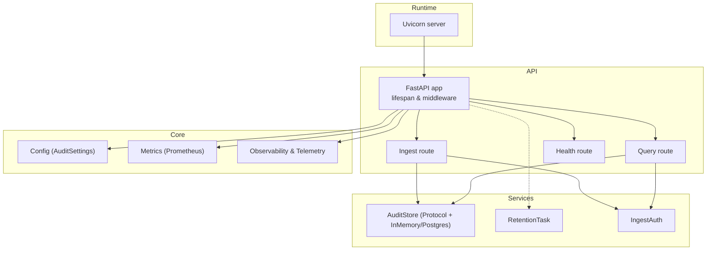
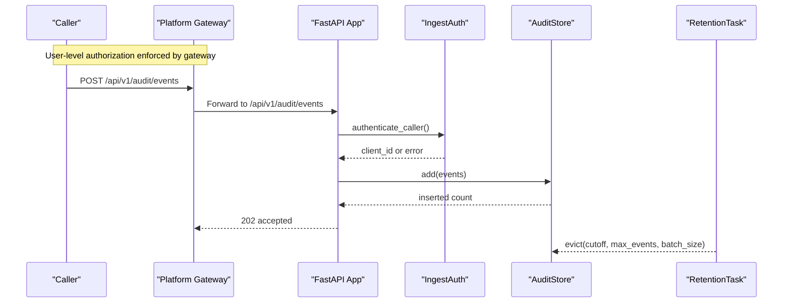
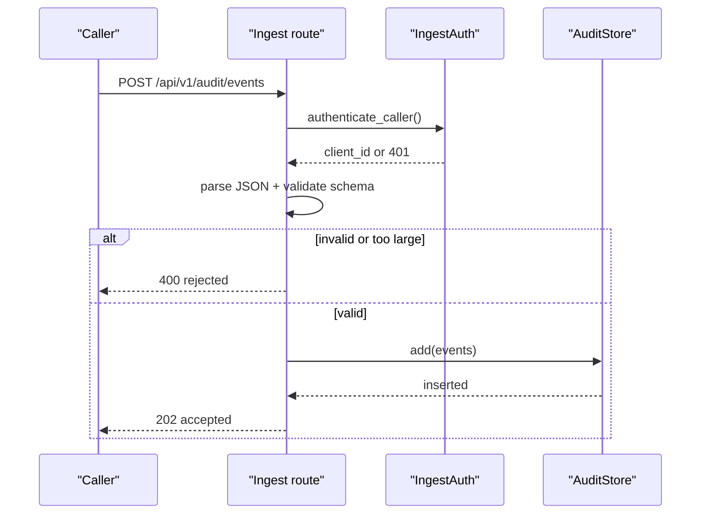
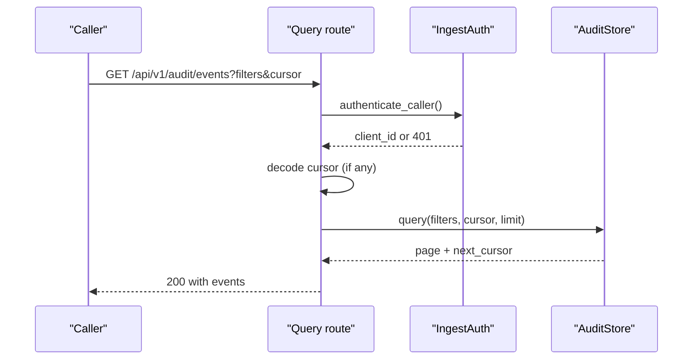
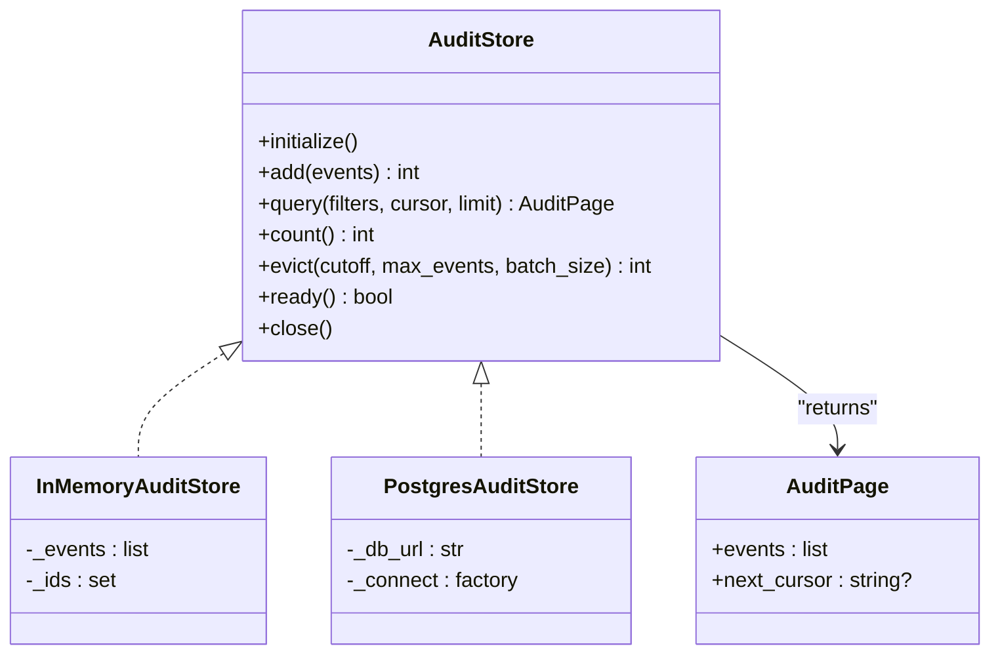
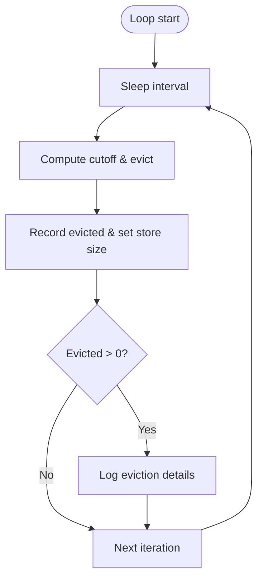
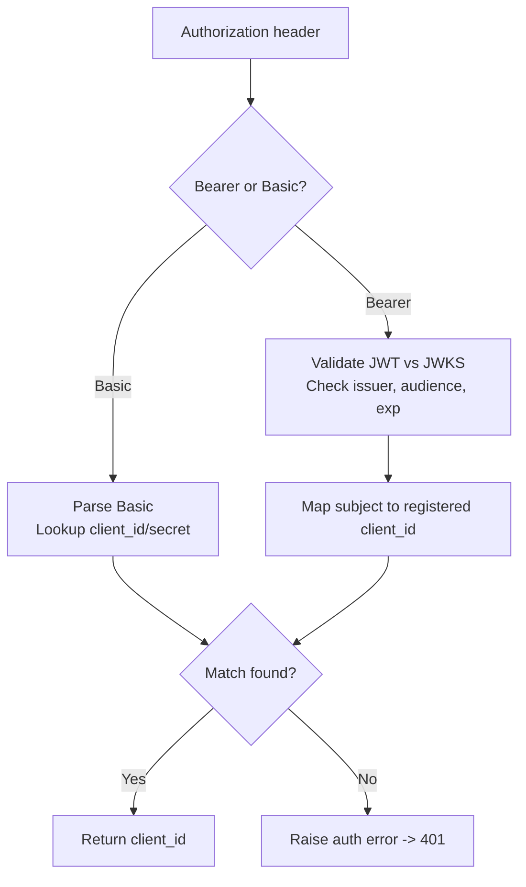
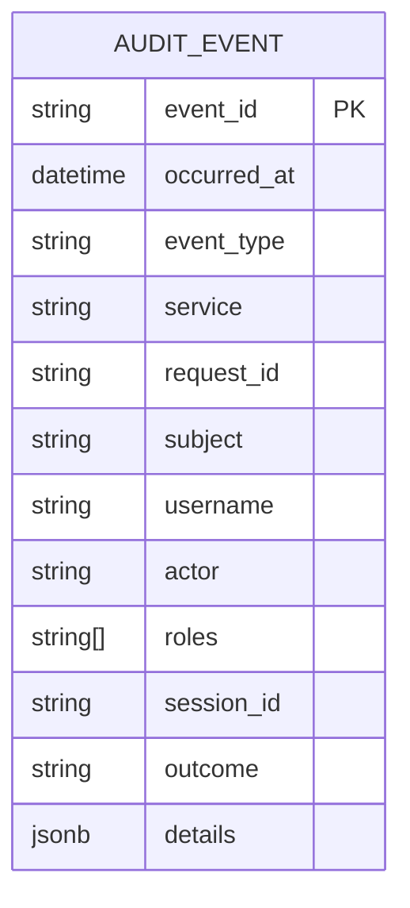
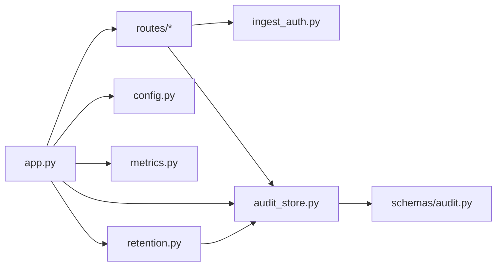

# Audit Service Product

<cite>
**Referenced Files in This Document**
- [README.md](file://products/audit-service/README.md)
- [app.py](file://products/audit-service/src/audit_service/app.py)
- [main.py](file://products/audit-service/src/audit_service/main.py)
- [pyproject.toml](file://products/audit-service/pyproject.toml)
- [ingest.py](file://products/audit-service/src/audit_service/api/routes/ingest.py)
- [query.py](file://products/audit-service/src/audit_service/api/routes/query.py)
- [health.py](file://products/audit-service/src/audit_service/api/routes/health.py)
- [audit_store.py](file://products/audit-service/src/audit_service/services/audit_store.py)
- [retention.py](file://products/audit-service/src/audit_service/services/retention.py)
- [ingest_auth.py](file://products/audit-service/src/audit_service/services/ingest_auth.py)
- [audit.py](file://products/audit-service/src/audit_service/schemas/audit.py)
- [config.py](file://products/audit-service/src/audit_service/core/config.py)
- [metrics.py](file://products/audit-service/src/audit_service/core/metrics.py)
</cite>

## Table of Contents
1. [Introduction](#introduction)
2. [Project Structure](#project-structure)
3. [Core Components](#core-components)
4. [Architecture Overview](#architecture-overview)
5. [Detailed Component Analysis](#detailed-component-analysis)
6. [Dependency Analysis](#dependency-analysis)
7. [Performance Considerations](#performance-considerations)
8. [Troubleshooting Guide](#troubleshooting-guide)
9. [Conclusion](#conclusion)

## Introduction
The Audit Service is the durable home for the platform audit trail. It ingests structured audit events from platform services, retains them within a retention-bounded store (in-memory for tests/dev and PostgreSQL for production), and exposes an authenticated query API that is proxied by the platform gateway under policy control. The service focuses exclusively on audit ingestion and querying; it does not authorize business actions or perform redaction.

Key capabilities:
- Authenticated batch ingest with strict validation and bounded batch size
- Filtered, newest-first cursor-paginated queries
- Health/readiness endpoints backed by store readiness checks
- Prometheus metrics and OpenTelemetry telemetry
- Background retention task enforcing time-window and hard-cap eviction without blocking ingest

**Section sources**
- [README.md:1-31](file://products/audit-service/README.md#L1-L31)

## Project Structure
The product follows a clean separation between HTTP routes, services, schemas, and core infrastructure:
- API routes define the external surface (ingest, query, health)
- Services implement storage, authentication, and retention
- Schemas define event envelopes and request filters
- Core provides configuration, metrics, observability, and runtime wiring

**Diagram sources**
- [app.py:20-70](file://products/audit-service/src/audit_service/app.py#L20-L70)
- [ingest.py:33-82](file://products/audit-service/src/audit_service/api/routes/ingest.py#L33-L82)
- [query.py:35-92](file://products/audit-service/src/audit_service/api/routes/query.py#L35-L92)
- [health.py:14-35](file://products/audit-service/src/audit_service/api/routes/health.py#L14-L35)
- [audit_store.py:33-52](file://products/audit-service/src/audit_service/services/audit_store.py#L33-L52)
- [retention.py:27-75](file://products/audit-service/src/audit_service/services/retention.py#L27-L75)
- [ingest_auth.py:105-117](file://products/audit-service/src/audit_service/services/ingest_auth.py#L105-L117)
- [config.py:52-97](file://products/audit-service/src/audit_service/core/config.py#L52-L97)
- [metrics.py:75-96](file://products/audit-service/src/audit_service/core/metrics.py#L75-L96)

**Section sources**
- [app.py:20-70](file://products/audit-service/src/audit_service/app.py#L20-L70)
- [main.py:6-8](file://products/audit-service/src/audit_service/main.py#L6-L8)
- [pyproject.toml:1-33](file://products/audit-service/pyproject.toml#L1-L33)

## Core Components
- FastAPI application lifecycle initializes the audit store and starts the retention background task
- Ingest route authenticates callers, validates batches, persists events, and records metrics
- Query route authenticates callers, decodes cursors, applies filters, and returns paginated results
- Audit store implements a strategy pattern with in-memory and PostgreSQL backends
- Retention task enforces retention window and hard-cap eviction on a schedule
- Authentication supports static credentials and workload identity via OIDC/JWKS
- Metrics expose RED counters/histograms and domain-specific counters/gauges

**Section sources**
- [app.py:20-70](file://products/audit-service/src/audit_service/app.py#L20-L70)
- [ingest.py:33-82](file://products/audit-service/src/audit_service/api/routes/ingest.py#L33-L82)
- [query.py:35-92](file://products/audit-service/src/audit_service/api/routes/query.py#L35-L92)
- [audit_store.py:33-52](file://products/audit-service/src/audit_service/services/audit_store.py#L33-L52)
- [retention.py:27-75](file://products/audit-service/src/audit_service/services/retention.py#L27-L75)
- [ingest_auth.py:105-117](file://products/audit-service/src/audit_service/services/ingest_auth.py#L105-L117)
- [metrics.py:75-96](file://products/audit-service/src/audit_service/core/metrics.py#L75-L96)

## Architecture Overview
The service runs as a FastAPI application behind Uvicorn. On startup, it builds and initializes the configured store (in-memory or PostgreSQL) and starts a retention task. Routes authenticate callers, validate payloads, interact with the store, and emit metrics/logs. Queries support keyset pagination using encoded cursors.

**Diagram sources**
- [ingest.py:33-82](file://products/audit-service/src/audit_service/api/routes/ingest.py#L33-L82)
- [ingest_auth.py:105-117](file://products/audit-service/src/audit_service/services/ingest_auth.py#L105-L117)
- [audit_store.py:261-288](file://products/audit-service/src/audit_service/services/audit_store.py#L261-L288)
- [retention.py:45-75](file://products/audit-service/src/audit_service/services/retention.py#L45-L75)

## Detailed Component Analysis

### Application Lifecycle and Middleware
- Lifespan initializes the store and starts retention
- HTTP middleware logs requests with duration and request ID
- Metrics and telemetry are attached at startup

**Diagram sources**
- [app.py:20-70](file://products/audit-service/src/audit_service/app.py#L20-L70)

**Section sources**
- [app.py:20-70](file://products/audit-service/src/audit_service/app.py#L20-L70)

### Ingest Endpoint
- Authenticates caller via static Basic or workload Bearer token
- Validates JSON body and schema; rejects malformed or oversized batches
- Persists events atomically per call and records metrics and logs
- Returns 202 Accepted with counts

**Diagram sources**
- [ingest.py:33-82](file://products/audit-service/src/audit_service/api/routes/ingest.py#L33-L82)
- [ingest_auth.py:105-117](file://products/audit-service/src/audit_service/services/ingest_auth.py#L105-L117)

**Section sources**
- [ingest.py:33-82](file://products/audit-service/src/audit_service/api/routes/ingest.py#L33-L82)

### Query Endpoint
- Authenticates caller similarly to ingest
- Decodes cursor if provided; validates filter parameters
- Applies filters and keyset pagination; returns newest-first pages
- Records metrics and logs

**Diagram sources**
- [query.py:35-92](file://products/audit-service/src/audit_service/api/routes/query.py#L35-L92)
- [ingest_auth.py:105-117](file://products/audit-service/src/audit_service/services/ingest_auth.py#L105-L117)
- [audit_store.py:290-341](file://products/audit-service/src/audit_service/services/audit_store.py#L290-L341)

**Section sources**
- [query.py:35-92](file://products/audit-service/src/audit_service/api/routes/query.py#L35-L92)

### Audit Store Strategy
- Protocol defines initialize, add, query, count, evict, ready, close
- In-memory store for dev/test with bounded list and idempotent deduplication
- PostgreSQL store with DDL, parameterized inserts, filtered queries, and batched eviction
- Cursor encoding uses base64 of timestamp|event_id for stable ordering

**Diagram sources**
- [audit_store.py:23-52](file://products/audit-service/src/audit_service/services/audit_store.py#L23-L52)
- [audit_store.py:82-141](file://products/audit-service/src/audit_service/services/audit_store.py#L82-L141)
- [audit_store.py:228-398](file://products/audit-service/src/audit_service/services/audit_store.py#L228-L398)

**Section sources**
- [audit_store.py:23-52](file://products/audit-service/src/audit_service/services/audit_store.py#L23-L52)
- [audit_store.py:82-141](file://products/audit-service/src/audit_service/services/audit_store.py#L82-L141)
- [audit_store.py:164-398](file://products/audit-service/src/audit_service/services/audit_store.py#L164-L398)

### Retention Task
- Runs periodically, computes cutoff based on retention days
- Calls store.evict with batched deletes to enforce time window and hard cap
- Updates metrics and reconciles store size gauge

**Diagram sources**
- [retention.py:45-75](file://products/audit-service/src/audit_service/services/retention.py#L45-L75)
- [audit_store.py:350-385](file://products/audit-service/src/audit_service/services/audit_store.py#L350-L385)

**Section sources**
- [retention.py:45-75](file://products/audit-service/src/audit_service/services/retention.py#L45-L75)

### Authentication for Ingest and Query
- Supports two paths:
  - Static: HTTP Basic against a registry of client_id/secret pairs
  - Workload: Bearer token validated against cluster OIDC issuer JWKS, audience and subject mapping
- Centralized caller resolution used by both routes

**Diagram sources**
- [ingest_auth.py:34-43](file://products/audit-service/src/audit_service/services/ingest_auth.py#L34-L43)
- [ingest_auth.py:69-93](file://products/audit-service/src/audit_service/services/ingest_auth.py#L69-L93)
- [ingest_auth.py:105-117](file://products/audit-service/src/audit_service/services/ingest_auth.py#L105-L117)

**Section sources**
- [ingest_auth.py:34-43](file://products/audit-service/src/audit_service/services/ingest_auth.py#L34-L43)
- [ingest_auth.py:69-93](file://products/audit-service/src/audit_service/services/ingest_auth.py#L69-L93)
- [ingest_auth.py:105-117](file://products/audit-service/src/audit_service/services/ingest_auth.py#L105-L117)

### Schemas and Data Model
- Event envelope includes identifiers, timestamps, actor context, outcome, and details
- IngestRequest wraps a non-empty list of events
- AuditQuery defines optional filters for queries

**Diagram sources**
- [audit.py:26-59](file://products/audit-service/src/audit_service/schemas/audit.py#L26-L59)

**Section sources**
- [audit.py:26-59](file://products/audit-service/src/audit_service/schemas/audit.py#L26-L59)

### Configuration and Runtime
- Settings loaded from environment variables with defaults
- Parsed registries for static clients and workload subject-to-client mappings
- Runtime entrypoint binds host/port from settings

**Section sources**
- [config.py:52-97](file://products/audit-service/src/audit_service/core/config.py#L52-L97)
- [main.py:6-8](file://products/audit-service/src/audit_service/main.py#L6-L8)

### Health Endpoints
- Live endpoint returns service identity and version
- Ready endpoint probes store readiness and reports retention and capacity settings

**Section sources**
- [health.py:14-35](file://products/audit-service/src/audit_service/api/routes/health.py#L14-L35)

## Dependency Analysis
- FastAPI application depends on routers, config, metrics, observability, store builder, and retention
- Routes depend on authentication and store abstractions
- Store implementations depend on Pydantic models and database drivers
- Retention depends on store and metrics
- Authentication depends on httpx and jwt libraries

**Diagram sources**
- [app.py:20-70](file://products/audit-service/src/audit_service/app.py#L20-L70)
- [ingest.py:33-82](file://products/audit-service/src/audit_service/api/routes/ingest.py#L33-L82)
- [query.py:35-92](file://products/audit-service/src/audit_service/api/routes/query.py#L35-L92)
- [audit_store.py:33-52](file://products/audit-service/src/audit_service/services/audit_store.py#L33-L52)
- [retention.py:27-75](file://products/audit-service/src/audit_service/services/retention.py#L27-L75)
- [ingest_auth.py:105-117](file://products/audit-service/src/audit_service/services/ingest_auth.py#L105-L117)
- [audit.py:26-59](file://products/audit-service/src/audit_service/schemas/audit.py#L26-L59)

**Section sources**
- [app.py:20-70](file://products/audit-service/src/audit_service/app.py#L20-L70)
- [pyproject.toml:6-19](file://products/audit-service/pyproject.toml#L6-L19)

## Performance Considerations
- Ingest path avoids partial writes by validating and rejecting entire batches early
- PostgreSQL insert uses ON CONFLICT DO NOTHING to handle duplicates efficiently
- Query uses keyset pagination to avoid offset-based scans and reduce load
- Retention performs batched deletions to minimize lock contention and long-running transactions
- Metrics are lightweight counters/gauges with bounded cardinality labels

[No sources needed since this section provides general guidance]

## Troubleshooting Guide
Common issues and signals:
- 401 Unauthorized: Missing or invalid credentials; check Basic or Bearer token configuration and issuer/audience settings
- 400 Bad Request: Malformed JSON or invalid event schema; verify payload structure and batch size limits
- Degraded readiness: Store backend unreachable; check database connectivity and credentials
- High rejection rate: Inspect metrics for reasons such as auth failures or malformed batches
- Stale store size: Retention reconciles exact size each sweep; monitor eviction metrics and logs

Operational tips:
- Use /health/live and /health/ready to validate service state and store readiness
- Expose /metrics to track ingestion, rejections, queries, evictions, and store errors
- Validate environment variables for store backend, DB URL, retention window, and client registries

**Section sources**
- [ingest.py:33-82](file://products/audit-service/src/audit_service/api/routes/ingest.py#L33-L82)
- [query.py:35-92](file://products/audit-service/src/audit_service/api/routes/query.py#L35-L92)
- [health.py:14-35](file://products/audit-service/src/audit_service/api/routes/health.py#L14-L35)
- [metrics.py:75-96](file://products/audit-service/src/audit_service/core/metrics.py#L75-L96)
- [retention.py:45-75](file://products/audit-service/src/audit_service/services/retention.py#L45-L75)

## Conclusion
The Audit Service provides a robust, extensible foundation for durable audit trails across the platform. Its clear boundaries, authenticated APIs, pluggable storage backends, and bounded retention make it suitable for both development and production use. Integration points with the platform gateway and other services are minimal and well-defined, enabling reliable operation and straightforward troubleshooting.

[No sources needed since this section summarizes without analyzing specific files]