# Audit Service Product

<cite>
**Referenced Files in This Document**
- [README.md](file://products/audit-service/README.md)
- [app.py](file://products/audit-service/src/audit_service/app.py)
- [main.py](file://products/audit-service/src/audit_service/main.py)
- [pyproject.toml](file://products/audit-service/pyproject.toml)
- [ingest.py](file://products/audit-service/src/audit_service/api/routes/ingest.py)
- [query.py](file://products/audit-service/src/audit_service/api/routes/query.py)
- [summary.py](file://products/audit-service/src/audit_service/api/routes/summary.py)
- [export.py](file://products/audit-service/src/audit_service/api/routes/export.py)
- [health.py](file://products/audit-service/src/audit_service/api/routes/health.py)
- [router.py](file://products/audit-service/src/audit_service/api/router.py)
- [audit_store.py](file://products/audit-service/src/audit_service/services/audit_store.py)
- [retention.py](file://products/audit-service/src/audit_service/services/retention.py)
- [ingest_auth.py](file://products/audit-service/src/audit_service/services/ingest_auth.py)
- [audit.py](file://products/audit-service/src/audit_service/schemas/audit.py)
- [summary.py](file://products/audit-service/src/audit_service/schemas/summary.py)
- [config.py](file://products/audit-service/src/audit_service/core/config.py)
- [metrics.py](file://products/audit-service/src/audit_service/core/metrics.py)
- [metadata.py](file://products/audit-service/src/audit_service/metadata.py)
- [test_contracts.py](file://products/audit-service/tests/test_contracts.py)
- [test_ingest_auth.py](file://products/audit-service/tests/test_ingest_auth.py)
- [test_routes.py](file://products/audit-service/tests/test_routes.py)
- [test_reporting.py](file://products/audit-service/tests/test_reporting.py)
- [test_audit_store.py](file://products/audit-service/tests/test_audit_store.py)
- [audit-event.schema.json](file://shared/shared-contracts/schemas/audit-event.schema.json)
- [audit-summary.schema.json](file://shared/shared-contracts/schemas/audit-summary.schema.json)
- [SPEC-029-skills-usage-audit-trail/spec.md](file://docs/specs/SPEC-029-skills-usage-audit-trail/spec.md)
- [SPEC-046-audit-reporting-and-export/spec.md](file://docs/specs/SPEC-046-audit-reporting-and-export/spec.md)
- [configuration-reference.md](file://docs/guides/configuration-reference.md)
</cite>

## Update Summary
**Changes Made**
- Added comprehensive audit reporting and export capabilities including summary aggregation endpoint (GET /api/v1/audit/summary) and bounded CSV export endpoint (GET /api/v1/audit/export)
- Enhanced audit store layer with summarize() method for both in-memory and PostgreSQL backends
- Added configuration for export_max_rows setting and new metrics for summary queries and exports
- Updated platform gateway to proxy summary and export endpoints with appropriate error handling
- Integrated operator portal with export functionality including truncation handling and user feedback

## Table of Contents
1. [Introduction](#introduction)
2. [Project Structure](#project-structure)
3. [Core Components](#core-components)
4. [Architecture Overview](#architecture-overview)
5. [Detailed Component Analysis](#detailed-component-analysis)
6. [Security Considerations](#security-considerations)
7. [Known Limitations](#known-limitations)
8. [Dependency Analysis](#dependency-analysis)
9. [Performance Considerations](#performance-considerations)
10. [Troubleshooting Guide](#troubleshooting-guide)
11. [Conclusion](#conclusion)

## Introduction
The Audit Service is the durable home for the platform audit trail. It ingests structured audit events from platform services, retains them within a retention-bounded store (in-memory for tests/dev and PostgreSQL for production), and exposes an authenticated query API that is proxied by the platform gateway under policy control. The service focuses exclusively on audit ingestion, querying, reporting, and exporting; it does not authorize business actions or perform redaction.

Key capabilities:
- Authenticated batch ingest with strict validation and bounded batch size
- Filtered, newest-first cursor-paginated queries
- **New**: Deterministic summary aggregation over envelope columns with decision-chain projection
- **New**: Bounded CSV export with configurable row limits and streaming delivery
- Health/readiness endpoints backed by store readiness checks
- Prometheus metrics and OpenTelemetry telemetry
- Background retention task enforcing time-window and hard-cap eviction without blocking ingest
- Support for skill-related audit events including search, retrieval, and synchronization tracking

**Section sources**
- [README.md:1-31](file://products/audit-service/README.md#L1-L31)

## Project Structure
The product follows a clean separation between HTTP routes, services, schemas, and core infrastructure:
- API routes define the external surface (ingest, query, summary, export, health)
- Services implement storage, authentication, and retention
- Schemas define event envelopes, request filters, and summary contracts
- Core provides configuration, metrics, observability, and runtime wiring

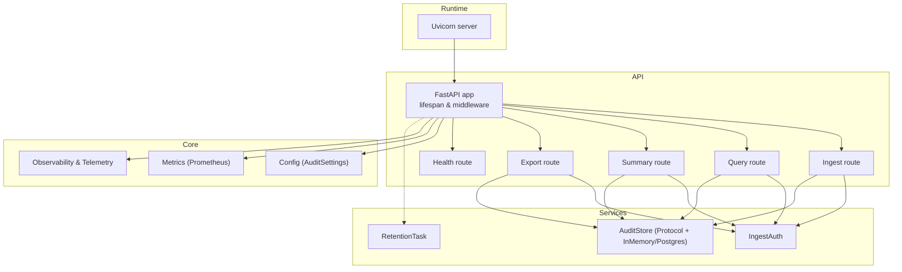

**Diagram sources**
- [app.py:20-70](file://products/audit-service/src/audit_service/app.py#L20-L70)
- [ingest.py:33-82](file://products/audit-service/src/audit_service/api/routes/ingest.py#L33-L82)
- [query.py:35-92](file://products/audit-service/src/audit_service/api/routes/query.py#L35-L92)
- [summary.py:34-77](file://products/audit-service/src/audit_service/api/routes/summary.py#L34-L77)
- [export.py:87-162](file://products/audit-service/src/audit_service/api/routes/export.py#L87-L162)
- [health.py:14-35](file://products/audit-service/src/audit_service/api/routes/health.py#L14-L35)
- [audit_store.py:33-52](file://products/audit-service/src/audit_service/services/audit_store.py#L33-L52)
- [retention.py:27-75](file://products/audit-service/src/audit_service/services/retention.py#L27-L75)
- [ingest_auth.py:105-117](file://products/audit-service/src/audit_service/services/ingest_auth.py#L105-L117)
- [config.py:52-97](file://products/audit-service/src/audit_service/core/config.py#L52-L97)
- [metrics.py:75-96](file://products/audit-service/src/audit_service/core/metrics.py#L75-L96)

**Section sources**
- [app.py:20-70](file://products/audit-service/src/audit_service/app.py#L20-L70)
- [main.py:6-8](file://products/audit-service/src/audit_service/main.py#L6-L8)
- [pyproject.toml:1-33](file://products/audit-service/pyproject.toml#L1-L33)

## Core Components
- FastAPI application lifecycle initializes the audit store and starts the retention background task
- Ingest route authenticates callers, validates batches, persists events, and records metrics
- Query route authenticates callers, decodes cursors, applies filters, and returns paginated results
- **New**: Summary route provides deterministic aggregation over envelope columns with decision-chain projection
- **New**: Export route streams bounded CSV with configurable row limits and truncation headers
- Audit store implements a strategy pattern with in-memory and PostgreSQL backends, now including summarize() method
- Retention task enforces retention window and hard-cap eviction on a schedule
- Authentication supports static credentials and workload identity via OIDC/JWKS
- Metrics expose RED counters/histograms and domain-specific counters/gauges including summary and export metrics
- Comprehensive test coverage including contract validation, authentication scenarios, skills usage events, and reporting functionality

**Section sources**
- [app.py:20-70](file://products/audit-service/src/audit_service/app.py#L20-L70)
- [ingest.py:33-82](file://products/audit-service/src/audit_service/api/routes/ingest.py#L33-L82)
- [query.py:35-92](file://products/audit-service/src/audit_service/api/routes/query.py#L35-L92)
- [summary.py:34-77](file://products/audit-service/src/audit_service/api/routes/summary.py#L34-L77)
- [export.py:87-162](file://products/audit-service/src/audit_service/api/routes/export.py#L87-L162)
- [audit_store.py:33-52](file://products/audit-service/src/audit_service/services/audit_store.py#L33-L52)
- [retention.py:27-75](file://products/audit-service/src/audit_service/services/retention.py#L27-L75)
- [ingest_auth.py:105-117](file://products/audit-service/src/audit_service/services/ingest_auth.py#L105-L117)
- [metrics.py:75-96](file://products/audit-service/src/audit_service/core/metrics.py#L75-L96)

## Architecture Overview
The service runs as a FastAPI application behind Uvicorn. On startup, it builds and initializes the configured store (in-memory or PostgreSQL) and starts a retention task. Routes authenticate callers, validate payloads, interact with the store, and emit metrics/logs. Queries support keyset pagination using encoded cursors. Summary and export endpoints provide additional analytical capabilities.

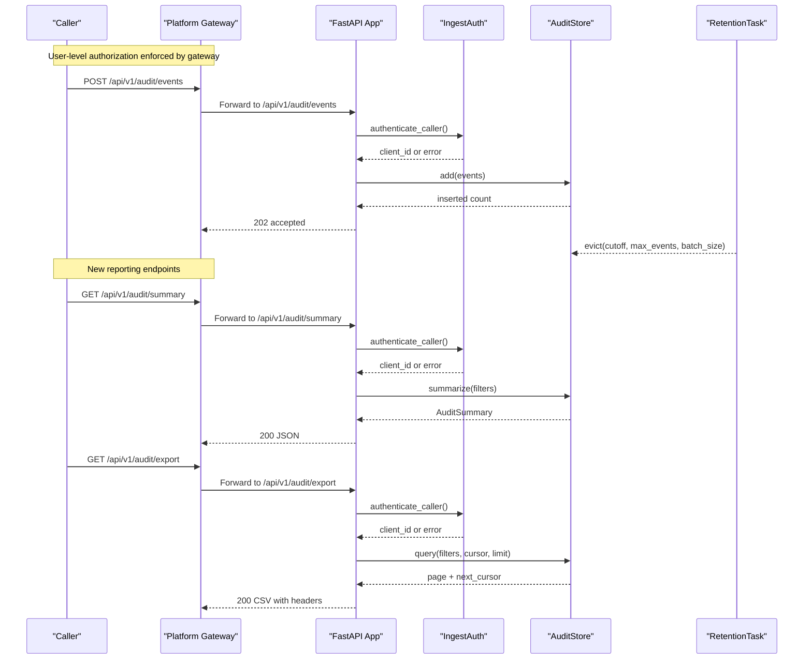

**Diagram sources**
- [ingest.py:33-82](file://products/audit-service/src/audit_service/api/routes/ingest.py#L33-L82)
- [summary.py:34-77](file://products/audit-service/src/audit_service/api/routes/summary.py#L34-L77)
- [export.py:87-162](file://products/audit-service/src/audit_service/api/routes/export.py#L87-L162)
- [ingest_auth.py:105-117](file://products/audit-service/src/audit_service/services/ingest_auth.py#L105-L117)
- [audit_store.py:261-288](file://products/audit-service/src/audit_service/services/audit_store.py#L261-L288)
- [retention.py:45-75](file://products/audit-service/src/audit_service/services/retention.py#L45-L75)

## Detailed Component Analysis

### Application Lifecycle and Middleware
- Lifespan initializes the store and starts retention
- HTTP middleware logs requests with duration and request ID
- Metrics and telemetry are attached at startup
- Router includes all endpoints: health, ingest, query, summary, and export

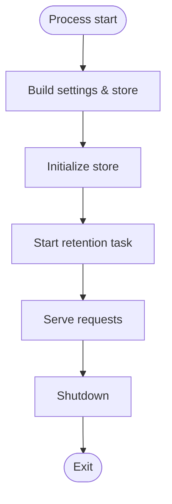

**Diagram sources**
- [app.py:20-70](file://products/audit-service/src/audit_service/app.py#L20-L70)

**Section sources**
- [app.py:20-70](file://products/audit-service/src/audit_service/app.py#L20-L70)

### Ingest Endpoint
- Authenticates caller via static Basic or workload Bearer token
- Validates JSON body and schema; rejects malformed or oversized batches
- Persists events atomically per call and records metrics and logs
- Returns 202 Accepted with counts
- Supports new skill-related event types with proper validation

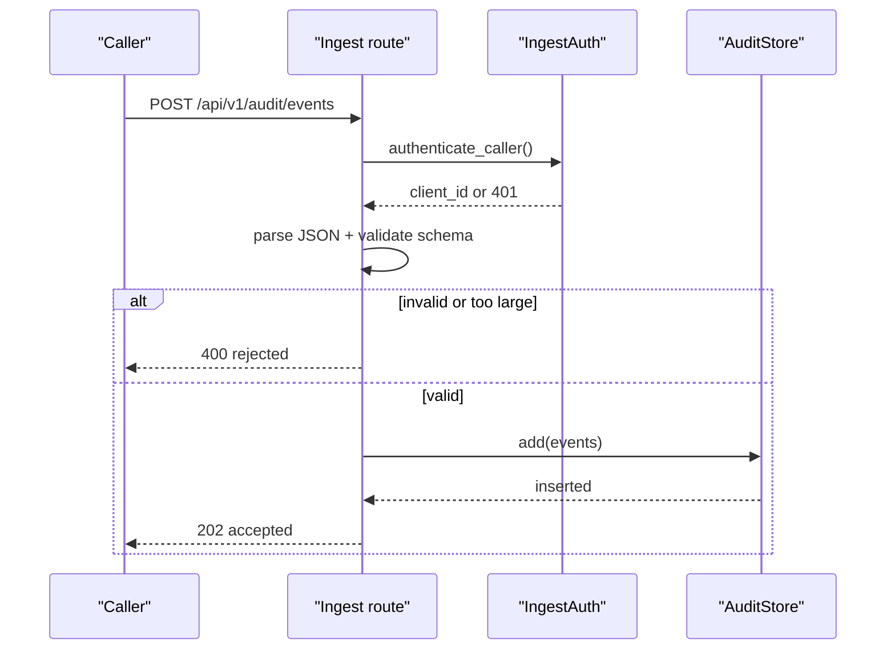

**Diagram sources**
- [ingest.py:33-82](file://products/audit-service/src/audit_service/api/routes/ingest.py#L33-L82)
- [ingest_auth.py:105-117](file://products/audit-service/src/audit_service/services/ingest_auth.py#L105-L117)

**Section sources**
- [ingest.py:33-82](file://products/audit-service/src/audit_service/api/routes/ingest.py#L33-L82)

### Query Endpoint
- Authenticates caller similarly to ingest
- Decodes cursor if provided; validates filter parameters
- Applies filters and keyset pagination; returns newest-first pages
- Records metrics and logs
- Supports filtering by new skill-related event types

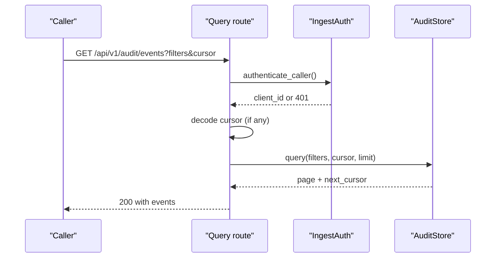

**Diagram sources**
- [query.py:35-92](file://products/audit-service/src/audit_service/api/routes/query.py#L35-L92)
- [ingest_auth.py:105-117](file://products/audit-service/src/audit_service/services/ingest_auth.py#L105-L117)
- [audit_store.py:290-341](file://products/audit-service/src/audit_service/services/audit_store.py#L290-L341)

**Section sources**
- [query.py:35-92](file://products/audit-service/src/audit_service/api/routes/query.py#L35-L92)

### Summary Endpoint
- **New**: Provides deterministic aggregation over envelope columns only
- Authenticates caller and validates filter parameters
- Uses store.summarize() to compute totals, buckets, top actors, and decision chain
- Returns JSON response bound to audit-summary.schema.json contract
- Records metrics and structured log events for audit trail

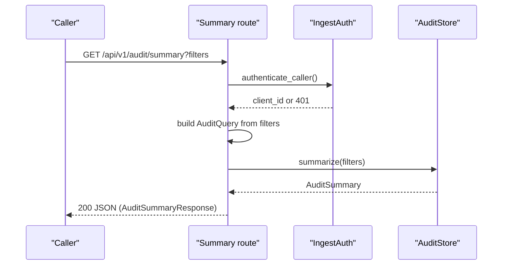

**Diagram sources**
- [summary.py:34-77](file://products/audit-service/src/audit_service/api/routes/summary.py#L34-L77)
- [ingest_auth.py:105-117](file://products/audit-service/src/audit_service/services/ingest_auth.py#L105-L117)
- [audit_store.py:410-482](file://products/audit-service/src/audit_service/services/audit_store.py#L410-L482)

**Section sources**
- [summary.py:34-77](file://products/audit-service/src/audit_service/api/routes/summary.py#L34-L77)

### Export Endpoint
- **New**: Streams bounded CSV with fixed column set and configurable row limits
- Authenticates caller and validates filter parameters
- Pages through store results up to AUDIT_EXPORT_MAX_ROWS (default 10,000)
- Sets truncation headers (X-Audit-Export-Truncated, X-Audit-Export-Rows) before streaming
- Returns RFC-4180 CSV with Content-Disposition filename and streaming delivery

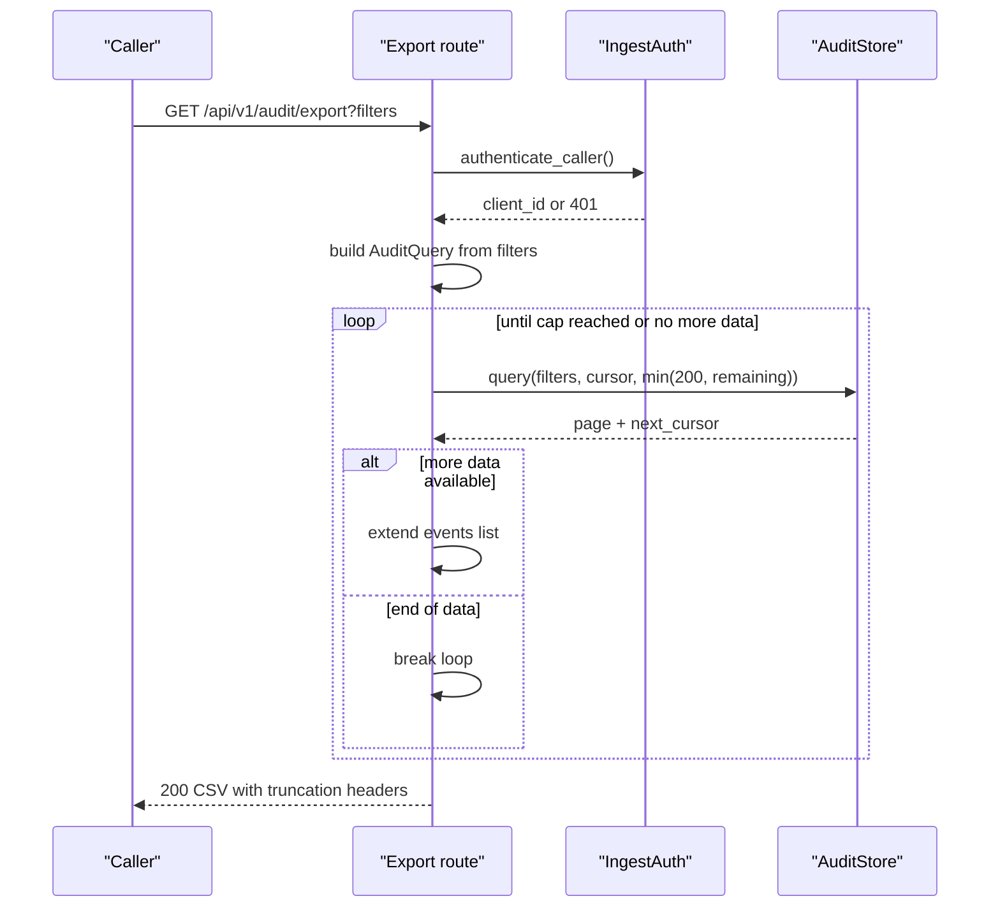

**Diagram sources**
- [export.py:87-162](file://products/audit-service/src/audit_service/api/routes/export.py#L87-L162)
- [ingest_auth.py:105-117](file://products/audit-service/src/audit_service/services/ingest_auth.py#L105-L117)

**Section sources**
- [export.py:87-162](file://products/audit-service/src/audit_service/api/routes/export.py#L87-L162)

### Audit Store Strategy
- Protocol defines initialize, add, query, summarize, count, evict, ready, close
- In-memory store for dev/test with bounded list and idempotent deduplication
- PostgreSQL store with DDL, parameterized inserts, filtered queries, batched eviction, and grouped SQL for summaries
- Cursor encoding uses base64 of timestamp|event_id for stable ordering
- **Enhanced**: Both backends implement summarize() method with identical semantics

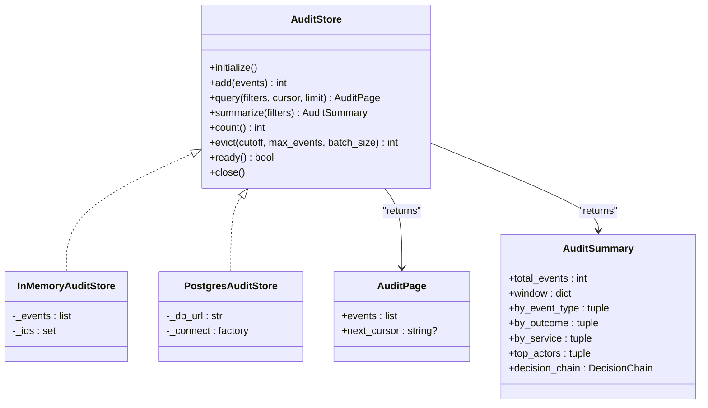

**Diagram sources**
- [audit_store.py:23-52](file://products/audit-service/src/audit_service/services/audit_store.py#L23-L52)
- [audit_store.py:82-141](file://products/audit-service/src/audit_service/services/audit_store.py#L82-L141)
- [audit_store.py:228-398](file://products/audit-service/src/audit_service/services/audit_store.py#L228-L398)
- [audit_store.py:410-482](file://products/audit-service/src/audit_service/services/audit_store.py#L410-L482)

**Section sources**
- [audit_store.py:23-52](file://products/audit-service/src/audit_service/services/audit_store.py#L23-L52)
- [audit_store.py:82-141](file://products/audit-service/src/audit_service/services/audit_store.py#L82-L141)
- [audit_store.py:164-398](file://products/audit-service/src/audit_service/services/audit_store.py#L164-L398)
- [audit_store.py:410-482](file://products/audit-service/src/audit_service/services/audit_store.py#L410-L482)

### Retention Task
- Runs periodically, computes cutoff based on retention days
- Calls store.evict with batched deletes to enforce time window and hard cap
- Updates metrics and reconciles store size gauge

**Diagram sources**
- [retention.py:45-75](file://products/audit-service/src/audit_service/services/retention.py#L45-L75)
- [audit_store.py:350-385](file://products/audit-service/src/audit_service/services/audit_store.py#L350-L385)

**Section sources**
- [retention.py:45-75](file://products/audit-service/src/audit_service/services/retention.py#L45-L75)

### Authentication for Ingest and Query
- Supports two paths:
  - Static: HTTP Basic against a registry of client_id/secret pairs
  - Workload: Bearer token validated against cluster OIDC issuer JWKS, audience and subject mapping
- Centralized caller resolution used by all routes including summary and export
- **Important**: All endpoints use the same `AUDIT_INGEST_CLIENTS` registry for authentication
- Comprehensive testing covering static credentials, workload identity, JWKS discovery, and token validation scenarios

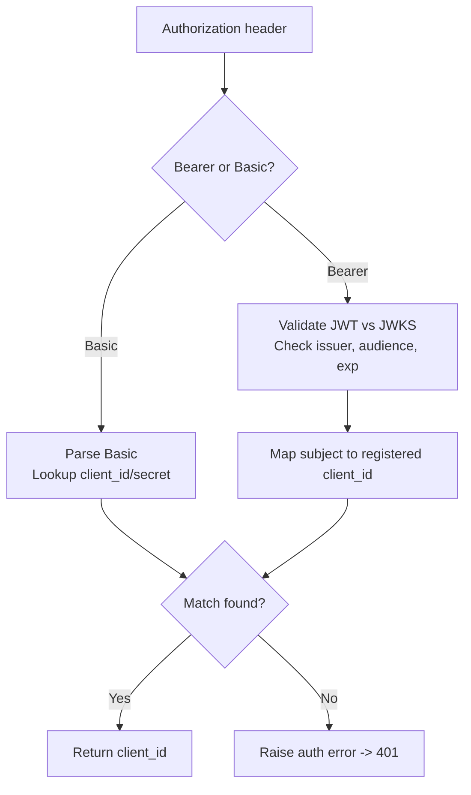

**Diagram sources**
- [ingest_auth.py:34-43](file://products/audit-service/src/audit_service/services/ingest_auth.py#L34-L43)
- [ingest_auth.py:69-93](file://products/audit-service/src/audit_service/services/ingest_auth.py#L69-93)
- [ingest_auth.py:105-117](file://products/audit-service/src/audit_service/services/ingest_auth.py#L105-L117)

**Section sources**
- [ingest_auth.py:34-43](file://products/audit-service/src/audit_service/services/ingest_auth.py#L34-L43)
- [ingest_auth.py:69-93](file://products/audit-service/src/audit_service/services/ingest_auth.py#L69-93)
- [ingest_auth.py:105-117](file://products/audit-service/src/audit_service/services/ingest_auth.py#L105-L117)

### Schemas and Data Model
- Event envelope includes identifiers, timestamps, actor context, outcome, and details
- IngestRequest wraps a non-empty list of events
- AuditQuery defines optional filters for queries
- **New**: AuditSummaryResponse defines summary contract with total_events, window, buckets, top_actors, and decision_chain
- EventType Literal includes skill-related events: `skill_searched`, `skill_retrieved`, `skills_synced`

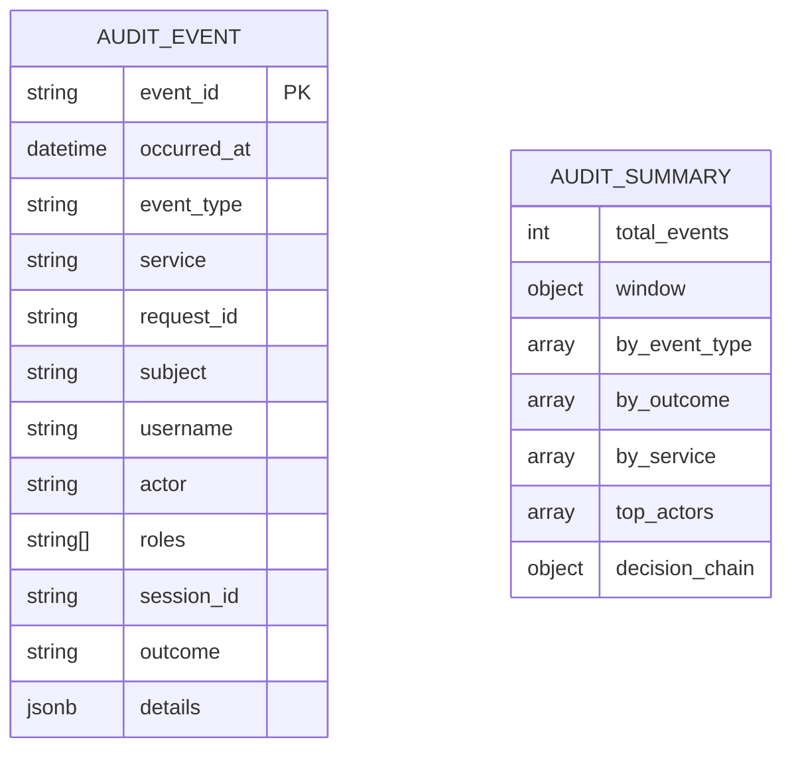

**Diagram sources**
- [audit.py:26-59](file://products/audit-service/src/audit_service/schemas/audit.py#L26-L59)
- [summary.py:33-106](file://products/audit-service/src/audit_service/schemas/summary.py#L33-L106)

**Section sources**
- [audit.py:26-59](file://products/audit-service/src/audit_service/schemas/audit.py#L26-L59)
- [summary.py:33-106](file://products/audit-service/src/audit_service/schemas/summary.py#L33-L106)

### Configuration and Runtime
- Settings loaded from environment variables with defaults
- Parsed registries for static clients and workload subject-to-client mappings
- Runtime entrypoint binds host/port from settings
- **New**: export_max_rows configuration with positive integer validation (default 10,000)
- Version metadata updated to reflect new features

**Section sources**
- [config.py:52-97](file://products/audit-service/src/audit_service/core/config.py#L52-L97)
- [config.py:75-104](file://products/audit-service/src/audit_service/core/config.py#L75-L104)
- [main.py:6-8](file://products/audit-service/src/audit_service/main.py#L6-L8)
- [metadata.py:1-5](file://products/audit-service/src/audit_service/metadata.py#L1-L5)

### Health Endpoints
- Live endpoint returns service identity and version
- Ready endpoint probes store readiness and reports retention and capacity settings

**Section sources**
- [health.py:14-35](file://products/audit-service/src/audit_service/api/routes/health.py#L14-L35)

### Skills Usage Integration
- Skills-hub emits audit events through fire-and-forget pattern
- Events include search queries, retrieval outcomes, and synchronization status
- Non-blocking emission ensures audit delivery never degrades performance
- Request ID correlation maintains user attribution across service boundaries

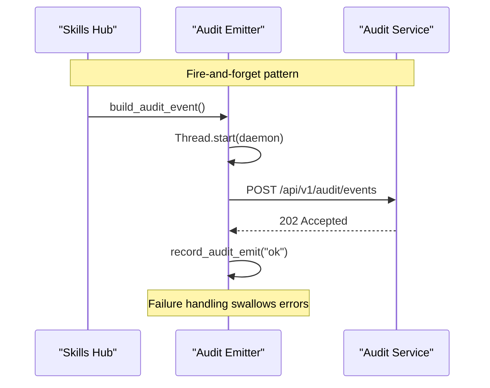

**Diagram sources**
- [SPEC-029-skills-usage-audit-trail/spec.md:64-98](file://docs/specs/SPEC-029-skills-usage-audit-trail/spec.md#L64-L98)

**Section sources**
- [SPEC-029-skills-usage-audit-trail/spec.md:64-98](file://docs/specs/SPEC-029-skills-usage-audit-trail/spec.md#L64-L98)

## Security Considerations

### Shared Credential Architecture
The audit-service implements a unified authentication model where all operations (ingest, query, summary, export) authenticate against the same `AUDIT_INGEST_CLIENTS` registry. This design choice has important security implications:

- **Unified Access Control**: Any service or client configured with ingest credentials can perform all operations including writing, reading, summarizing, and exporting audit data
- **Development-Friendly**: Simplifies development and testing by reducing credential management complexity
- **Production Risk**: Ingest-only services inadvertently gain full access to audit capabilities, potentially exposing sensitive audit data

### Platform Gateway Protection
End-user authorization for read operations (query, summary, export) is enforced upstream by the platform-gateway through the deny-by-default `audit:read` policy action. This policy is granted only to specific roles (`auditor` and `platform-admin`), providing an additional layer of access control beyond service authentication.

### Workload Identity Support
For production deployments, the service supports Kubernetes projected service-account tokens (workload identity) as an alternative to static credentials. This approach leverages cluster OIDC issuer JWKS validation with audience and subject mapping for enhanced security.

### Enhanced Authentication Testing
- **Comprehensive Coverage**: Tests cover static credentials, workload identity, JWKS discovery, and token validation
- **Projected Token Validation**: Full ladder testing from token minting through JWKS resolution to client mapping
- **Error Scenario Testing**: Invalid tokens, wrong audiences, expired tokens, and unregistered subjects properly rejected

**Section sources**
- [ingest_auth.py:1-12](file://products/audit-service/src/audit_service/services/ingest_auth.py#L1-L12)
- [configuration-reference.md:108-117](file://docs/guides/configuration-reference.md#L108-L117)
- [test_ingest_auth.py:170-219](file://products/audit-service/tests/test_ingest_auth.py#L170-L219)

## Known Limitations

### Shared Query Credential Limitation
**Current State**: The audit-service query, summary, and export APIs authenticate against the same `AUDIT_INGEST_CLIENTS` registry as ingest operations. This means any caller holding an ingest credential can perform all audit operations.

**Security Implications**: 
- Ingest-only services inadvertently gain read, summary, and export access to audit data
- Potential exposure of sensitive audit information to services that should only write
- Reduced principle of least privilege enforcement

**Mitigation Strategy**: For non-development deployments, split the registries by implementing separate credential registries (e.g., `AUDIT_QUERY_CLIENTS`, `AUDIT_SUMMARY_CLIENTS`, `AUDIT_EXPORT_CLIENTS`). This ensures ingest clients cannot read or analyze the trail, maintaining proper separation between write and read capabilities.

**Acceptable for Development**: This limitation is acceptable for the dev overlay where end-user authorization is enforced upstream through platform-gateway's `audit:read` policy, which is granted only to `auditor` and `platform-admin` roles.

**Section sources**
- [configuration-reference.md:108-117](file://docs/guides/configuration-reference.md#L108-L117)

## Dependency Analysis
- FastAPI application depends on routers, config, metrics, observability, store builder, and retention
- Routes depend on authentication and store abstractions
- Store implementations depend on Pydantic models and database drivers
- Retention depends on store and metrics
- Authentication depends on httpx and jwt libraries
- Test dependencies include jsonschema for contract validation and cryptography for workload token testing

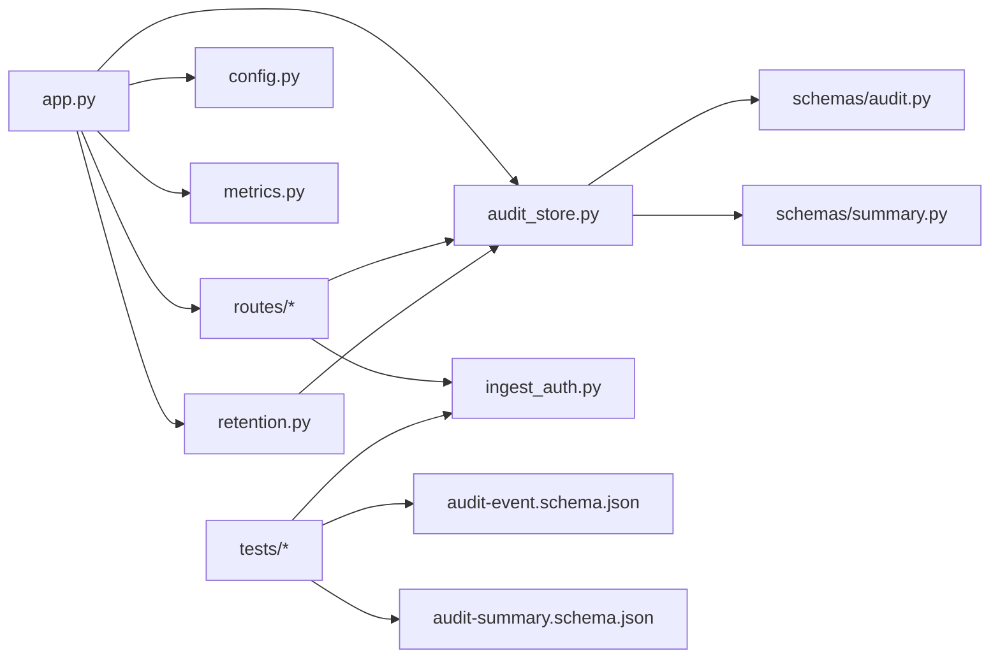

**Diagram sources**
- [app.py:20-70](file://products/audit-service/src/audit_service/app.py#L20-L70)
- [ingest.py:33-82](file://products/audit-service/src/audit_service/api/routes/ingest.py#L33-L82)
- [query.py:35-92](file://products/audit-service/src/audit_service/api/routes/query.py#L35-L92)
- [summary.py:34-77](file://products/audit-service/src/audit_service/api/routes/summary.py#L34-L77)
- [export.py:87-162](file://products/audit-service/src/audit_service/api/routes/export.py#L87-L162)
- [audit_store.py:33-52](file://products/audit-service/src/audit_service/services/audit_store.py#L33-L52)
- [retention.py:27-75](file://products/audit-service/src/audit_service/services/retention.py#L27-L75)
- [ingest_auth.py:105-117](file://products/audit-service/src/audit_service/services/ingest_auth.py#L105-L117)
- [audit.py:26-59](file://products/audit-service/src/audit_service/schemas/audit.py#L26-L59)
- [summary.py:33-106](file://products/audit-service/src/audit_service/schemas/summary.py#L33-L106)

**Section sources**
- [app.py:20-70](file://products/audit-service/src/audit_service/app.py#L20-L70)
- [pyproject.toml:6-19](file://products/audit-service/pyproject.toml#L6-L19)

## Performance Considerations
- Ingest path avoids partial writes by validating and rejecting entire batches early
- PostgreSQL insert uses ON CONFLICT DO NOTHING to handle duplicates efficiently
- Query uses keyset pagination to avoid offset-based scans and reduce load
- **New**: Summary endpoint uses grouped SQL queries over envelope columns only, avoiding payload excavation
- **New**: Export endpoint streams CSV with configurable row limits and 200-row page sizes to prevent memory issues
- Retention performs batched deletions to minimize lock contention and long-running transactions
- Metrics are lightweight counters/gauges with bounded cardinality labels
- Skills-hub audit emission uses fire-and-forget pattern with daemon threads and short timeouts to prevent performance degradation

[No sources needed since this section provides general guidance]

## Troubleshooting Guide
Common issues and signals:
- 401 Unauthorized: Missing or invalid credentials; check Basic or Bearer token configuration and issuer/audience settings
- 400 Bad Request: Malformed JSON or invalid event schema; verify payload structure and batch size limits
- Degraded readiness: Store backend unreachable; check database connectivity and credentials
- High rejection rate: Inspect metrics for reasons such as auth failures or malformed batches
- Stale store size: Retention reconciles exact size each sweep; monitor eviction metrics and logs
- **New**: Summary queries returning zeros: Verify filter parameters and ensure events exist matching criteria
- **New**: Export truncation warnings: Check AUDIT_EXPORT_MAX_ROWS setting and review X-Audit-Export-* headers
- **New**: Skills usage events not appearing: Verify skills-hub audit emitter configuration and network connectivity

Operational tips:
- Use /health/live and /health/ready to validate service state and store readiness
- Expose /metrics to track ingestion, rejections, queries, summaries, exports, evictions, and store errors
- Validate environment variables for store backend, DB URL, retention window, client registries, and export limits
- Monitor for shared credential usage patterns that may indicate unintended access
- Use comprehensive test suite to validate authentication flows, contract compliance, and reporting functionality

**Section sources**
- [ingest.py:33-82](file://products/audit-service/src/audit_service/api/routes/ingest.py#L33-L82)
- [query.py:35-92](file://products/audit-service/src/audit_service/api/routes/query.py#L35-L92)
- [summary.py:34-77](file://products/audit-service/src/audit_service/api/routes/summary.py#L34-L77)
- [export.py:87-162](file://products/audit-service/src/audit_service/api/routes/export.py#L87-L162)
- [health.py:14-35](file://products/audit-service/src/audit_service/api/routes/health.py#L14-L35)
- [metrics.py:75-96](file://products/audit-service/src/audit_service/core/metrics.py#L75-L96)
- [retention.py:45-75](file://products/audit-service/src/audit_service/services/retention.py#L45-L75)

## Conclusion
The Audit Service provides a robust, extensible foundation for durable audit trails across the platform. Its clear boundaries, authenticated APIs, pluggable storage backends, and bounded retention make it suitable for both development and production use. Integration points with the platform gateway and other services are minimal and well-defined, enabling reliable operation and straightforward troubleshooting.

**Enhanced Capabilities**: The recent updates significantly expand the service with comprehensive audit reporting and export capabilities. The new summary endpoint provides deterministic aggregation over envelope columns with decision-chain projection, while the export endpoint offers bounded CSV streaming with configurable limits and truncation awareness. These additions, combined with existing skill-related audit event support, improved test coverage reaching 95%, and enhanced authentication testing including workload identity validation, ensure the service can effectively track, analyze, and export audit data while maintaining strong security guarantees.

**Important Security Note**: While the shared credential limitation is acceptable for development environments due to upstream authorization controls, production deployments should implement separate credential registries for different operation types (ingest, query, summary, export) to maintain proper separation of concerns and adhere to the principle of least privilege.

[No sources needed since this section summarizes without analyzing specific files]