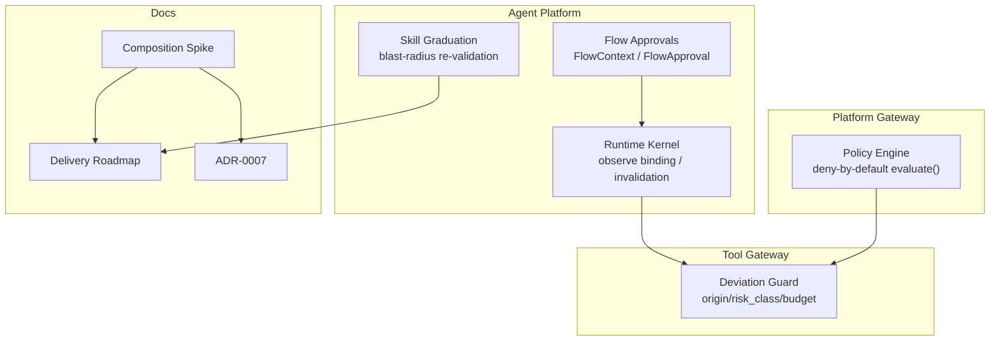
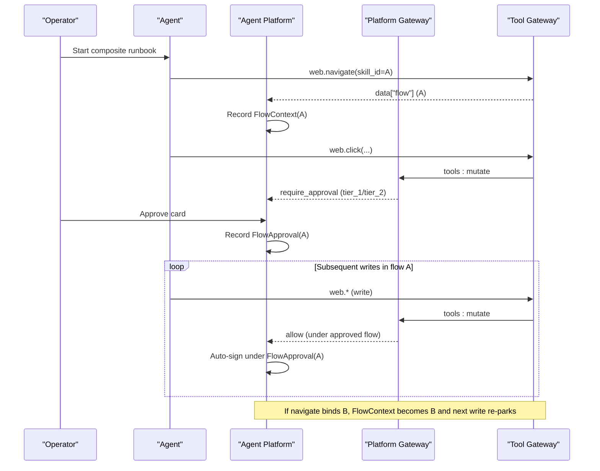
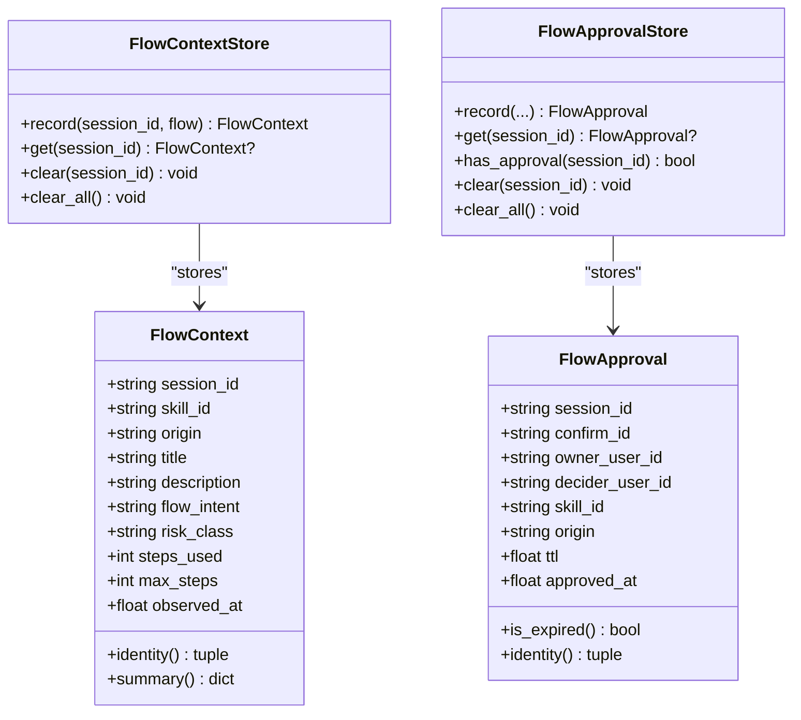
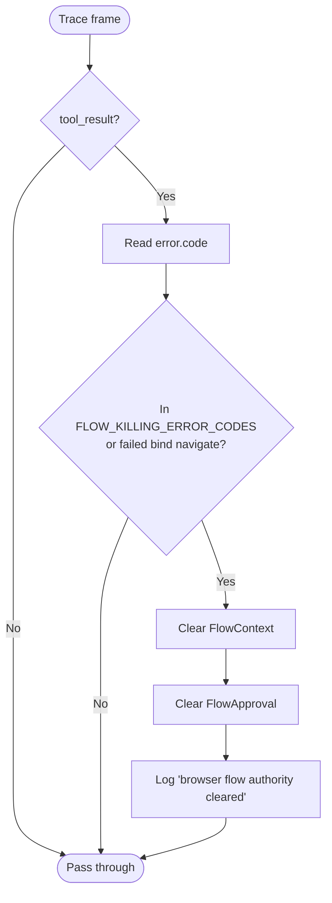
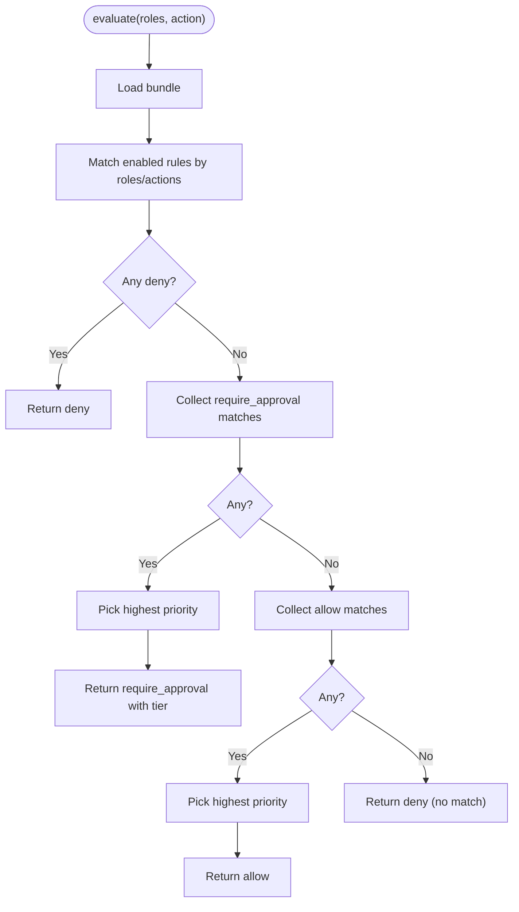
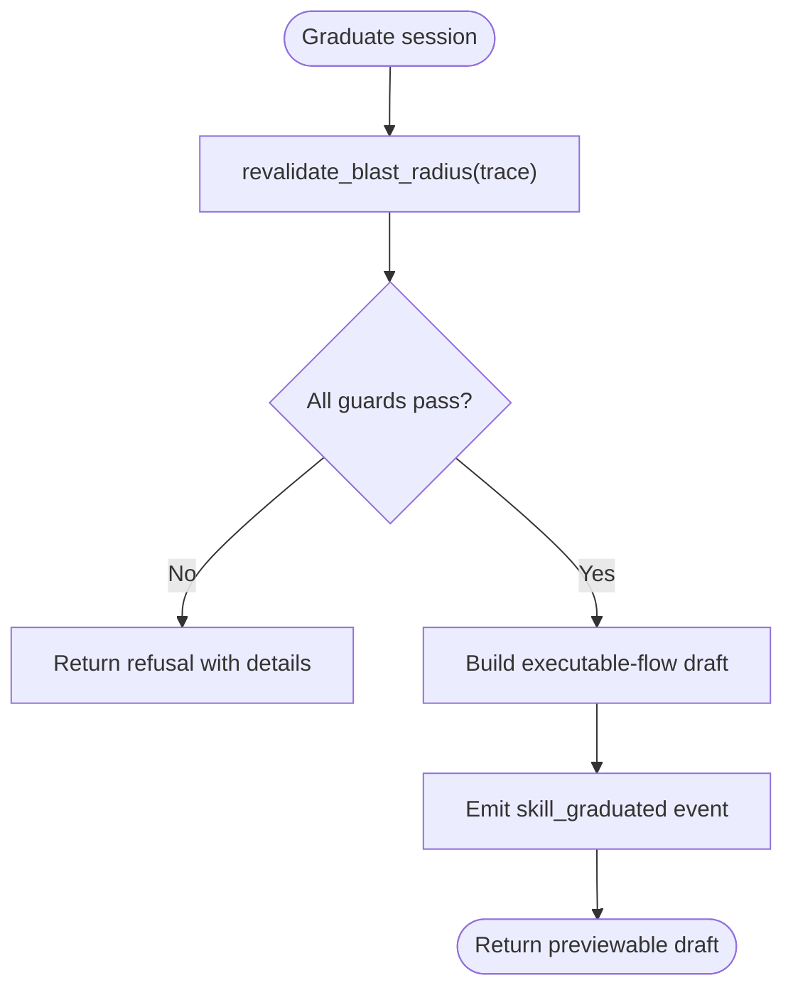
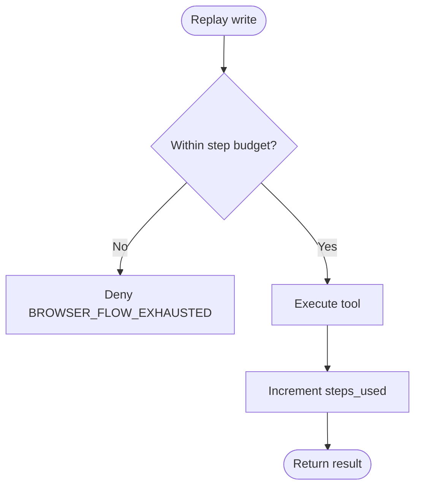
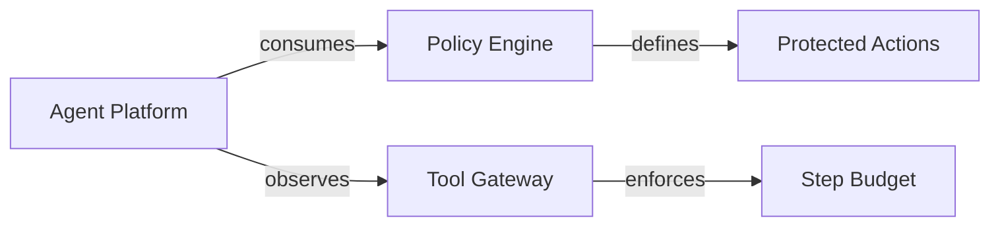

# Composition Trust Model Spike

<cite>
**Referenced Files in This Document**
- [composition-trust-model-spike.md](file://docs/workspace/composition-trust-model-spike.md)
- [0007-browser-flow-single-hitl-gate.md](file://docs/adr/0007-browser-flow-single-hitl-gate.md)
- [flow_approvals.py](file://products/agent-platform/src/agent_service/services/flow_approvals.py)
- [runtime_kernel.py](file://products/agent-platform/src/agent_service/runtime_kernel.py)
- [policy_engine.py](file://products/platform-gateway/src/platform_gateway/services/policy_engine.py)
- [delivery-roadmap.md](file://docs/agentic-aiops-platform/delivery-roadmap.md)
- [skill_graduation.py](file://products/agent-platform/src/agent_service/services/skill_graduation.py)
- [test_browser_connector.py](file://products/tool-gateway/tests/test_browser_connector.py)
</cite>

## Table of Contents
1. [Introduction](#introduction)
2. [Project Structure](#project-structure)
3. [Core Components](#core-components)
4. [Architecture Overview](#architecture-overview)
5. [Detailed Component Analysis](#detailed-component-analysis)
6. [Dependency Analysis](#dependency-analysis)
7. [Performance Considerations](#performance-considerations)
8. [Troubleshooting Guide](#troubleshooting-guide)
9. [Conclusion](#conclusion)
10. [Appendices](#appendices)

## Introduction
This document records the findings and decisions from the Composition Trust Model spike for multi-target workflows composed of single-target skills. It answers whether a composite runbook needs its own approval gate or whether each sub-skill keeps its own gate, and it defines the shape of a composition construct that sequences single-target skills without introducing control flow or a new authority model.

The spike concludes that:
- A composite does not carry its own gate; each sub-skill retains its own gate through the existing identity guard.
- A composition is a validated, ordered list of sub-skill references with no interpreter and no control flow.
- The main open boundary is a composite-wide step budget to avoid unbounded write budgets across multiple sub-skills.

**Section sources**
- [composition-trust-model-spike.md:8-23](file://docs/workspace/composition-trust-model-spike.md#L8-L23)
- [delivery-roadmap.md:346-347](file://docs/agentic-aiops-platform/delivery-roadmap.md#L346-L347)

## Project Structure
The composition trust model spans several platform services and documents:
- Agent Platform: session-scoped flow context and approvals, kernel observation of binding/invalidation, and graduation validation.
- Platform Gateway: policy evaluation and action authorization boundaries.
- Tool Gateway: deviation guard enforcement and replay behavior under step budgets.
- Workspace and Specs: roadmap rows, ADRs, and spec artifacts that define the trust model and delivery path.

**Diagram sources**
- [flow_approvals.py:78-165](file://products/agent-platform/src/agent_service/services/flow_approvals.py#L78-L165)
- [runtime_kernel.py:1690-1755](file://products/agent-platform/src/agent_service/runtime_kernel.py#L1690-L1755)
- [policy_engine.py:390-444](file://products/platform-gateway/src/platform_gateway/services/policy_engine.py#L390-L444)
- [delivery-roadmap.md:346-347](file://docs/agentic-aiops-platform/delivery-roadmap.md#L346-L347)
- [0007-browser-flow-single-hitl-gate.md:45-76](file://docs/adr/0007-browser-flow-single-hitl-gate.md#L45-L76)

**Section sources**
- [delivery-roadmap.md:346-347](file://docs/agentic-aiops-platform/delivery-roadmap.md#L346-L347)
- [0007-browser-flow-single-hitl-gate.md:45-76](file://docs/adr/0007-browser-flow-single-hitl-gate.md#L45-L76)

## Core Components
- Flow Context and Approval Stores: per-session reflection of gateway-owned flow bindings and operator-granted auto-sign authority scoped to skill_id + origin.
- Runtime Kernel Observation: updates FlowContext on successful navigation and clears both stores on flow-killing errors or failed bind attempts.
- Policy Engine: deny-by-default evaluation with require_approval tiers bridged for mutating actions.
- Skill Graduation: deterministic draft generation and blast-radius re-validation against declared target and observed origins.
- Tool Gateway Deviation Guard: enforces origin allowlist, risk class, and step budget at replay time.

Key behaviors relevant to composition:
- Rebinding to a different flow overwrites the context and fails the identity match, causing the next write to re-park — no new composition code required.
- Infra legs remain per-action under SPEC-054 R-2; mixed browser+infra composites are allowed.
- There is no interpreter today; a composition is declarative sequencing only.

**Section sources**
- [flow_approvals.py:15-33](file://products/agent-platform/src/agent_service/services/flow_approvals.py#L15-L33)
- [flow_approvals.py:78-165](file://products/agent-platform/src/agent_service/services/flow_approvals.py#L78-L165)
- [runtime_kernel.py:1690-1755](file://products/agent-platform/src/agent_service/runtime_kernel.py#L1690-L1755)
- [policy_engine.py:390-444](file://products/platform-gateway/src/platform_gateway/services/policy_engine.py#L390-L444)
- [skill_graduation.py:74-94](file://products/agent-platform/src/agent_service/services/skill_graduation.py#L74-L94)

## Architecture Overview
The composition trust model relies on existing per-flow gates rather than a new composite-level authority. A composite sequence triggers multiple flows; each flow binds, parks one card on first write, and auto-signs subsequent writes until the flow ends or is invalidated.

**Diagram sources**
- [runtime_kernel.py:1690-1755](file://products/agent-platform/src/agent_service/runtime_kernel.py#L1690-L1755)
- [flow_approvals.py:78-165](file://products/agent-platform/src/agent_service/services/flow_approvals.py#L78-L165)
- [policy_engine.py:390-444](file://products/platform-gateway/src/platform_gateway/services/policy_engine.py#L390-L444)

## Detailed Component Analysis

### Flow Context and Approval Store
- FlowContext captures skill_id, origin, title, description, flow_intent, risk_class, steps_used, max_steps, and observed_at. Identity is (skill_id, origin).
- FlowApprovalStore records an operator-approved authority keyed by session_id with TTL; get() returns None if expired or absent, failing safe.
- FLOW_CONTEXTS and FLOW_APPROVALS are process-wide singletons cleared on session or flow lifecycle events.

**Diagram sources**
- [flow_approvals.py:78-165](file://products/agent-platform/src/agent_service/services/flow_approvals.py#L78-L165)
- [flow_approvals.py:167-259](file://products/agent-platform/src/agent_service/services/flow_approvals.py#L167-L259)

**Section sources**
- [flow_approvals.py:78-165](file://products/agent-platform/src/agent_service/services/flow_approvals.py#L78-L165)
- [flow_approvals.py:167-259](file://products/agent-platform/src/agent_service/services/flow_approvals.py#L167-L259)

### Runtime Kernel Observation and Invalidation
- On successful web.navigate results carrying data["flow"], the kernel records FlowContext for the session.
- On flow-killing error codes or a failed web.navigate that attempted to bind a flow, the kernel clears both FlowContext and FlowApproval for the session.
- This ensures the auto-sign authority never outlives the binding and prevents cross-flow reuse.

**Diagram sources**
- [runtime_kernel.py:1701-1755](file://products/agent-platform/src/agent_service/runtime_kernel.py#L1701-L1755)

**Section sources**
- [runtime_kernel.py:1690-1755](file://products/agent-platform/src/agent_service/runtime_kernel.py#L1690-L1755)

### Policy Evaluation and Bridging
- Deny-by-default evaluation with three outcomes: deny, require_approval, allow.
- require_approval is bridged for mutating tool actions; highest priority rule wins within outcome classes.
- Bundle metadata exposes version, source, and SHA-256 fingerprint for transparency.

**Diagram sources**
- [policy_engine.py:390-444](file://products/platform-gateway/src/platform_gateway/services/policy_engine.py#L390-L444)

**Section sources**
- [policy_engine.py:390-444](file://products/platform-gateway/src/platform_gateway/services/policy_engine.py#L390-L444)

### Skill Graduation and Blast-Radius Validation
- Graduation builds a deterministic executable-flow draft from the trace and runs revalidate_blast_radius before producing output.
- Guards include step budget, observed origins inside declared target, consistent risk_class, resolved credentials, and secret-like literal detection.
- Defaults mirror gateway budgets to keep replay behavior predictable.

**Diagram sources**
- [skill_graduation.py:74-94](file://products/agent-platform/src/agent_service/services/skill_graduation.py#L74-L94)

**Section sources**
- [skill_graduation.py:74-94](file://products/agent-platform/src/agent_service/services/skill_graduation.py#L74-L94)

### Tool Gateway Deviation Guard and Replay Behavior
- Replay respects GATEWAY_BROWSER_FLOW_MAX_STEPS; exceeding budget denies with BROWSER_FLOW_EXHAUSTED.
- The deviation guard bounds both ad-hoc and replayed flows identically.

**Diagram sources**
- [test_browser_connector.py:2498-2530](file://products/tool-gateway/tests/test_browser_connector.py#L2498-L2530)

**Section sources**
- [test_browser_connector.py:2498-2530](file://products/tool-gateway/tests/test_browser_connector.py#L2498-L2530)

## Dependency Analysis
- Agent Platform depends on gateway-provided flow binding data to maintain FlowContext and on policy outcomes to bridge approvals for mutating actions.
- Platform Gateway policy engine is independent but consumed by agent-platform routes and tool-gateway enforcement surfaces.
- Tool Gateway enforces the deviation guard and step budget independently of agent-platform state.

**Diagram sources**
- [policy_engine.py:30-127](file://products/platform-gateway/src/platform_gateway/services/policy_engine.py#L30-L127)
- [runtime_kernel.py:1690-1755](file://products/agent-platform/src/agent_service/runtime_kernel.py#L1690-L1755)
- [test_browser_connector.py:2498-2530](file://products/tool-gateway/tests/test_browser_connector.py#L2498-L2530)

**Section sources**
- [policy_engine.py:30-127](file://products/platform-gateway/src/platform_gateway/services/policy_engine.py#L30-L127)
- [runtime_kernel.py:1690-1755](file://products/agent-platform/src/agent_service/runtime_kernel.py#L1690-L1755)
- [test_browser_connector.py:2498-2530](file://products/tool-gateway/tests/test_browser_connector.py#L2498-L2530)

## Performance Considerations
- Per-session in-memory stores for FlowContext and FlowApproval minimize overhead and align with restart semantics.
- Policy evaluation loads bundles once per configured path and caches results; bundle metadata includes content fingerprints for transparency checks.
- Step budget enforcement occurs at the gateway boundary, avoiding repeated kernel-side budget tracking beyond mirrored observability fields.

[No sources needed since this section provides general guidance]

## Troubleshooting Guide
Common issues and their signals:
- Cross-flow reuse prevented: If a session navigates to a different skill/origin, the next write re-parks because FlowContext identity no longer matches FlowApproval identity.
- Authority cleared unexpectedly: Flow-killing error codes or a failed bind navigate clear both stores; inspect logs for "browser flow authority cleared."
- Replay exceeds budget: BROWSER_FLOW_EXHAUSTED indicates replay exceeded GATEWAY_BROWSER_FLOW_MAX_STEPS; adjust budgets or reduce steps.
- Graduation refusal: Blast-radius validation failures return explicit reasons; fix credential resolution, origin scope, or step count.

**Section sources**
- [flow_approvals.py:15-33](file://products/agent-platform/src/agent_service/services/flow_approvals.py#L15-L33)
- [runtime_kernel.py:1701-1755](file://products/agent-platform/src/agent_service/runtime_kernel.py#L1701-L1755)
- [test_browser_connector.py:2498-2530](file://products/tool-gateway/tests/test_browser_connector.py#L2498-L2530)
- [skill_graduation.py:74-94](file://products/agent-platform/src/agent_service/services/skill_graduation.py#L74-L94)

## Conclusion
The composition trust model spike recommends Option B: a composite is a validated, ordered list of single-target skills with no interpreter and no composite-level gate. Each sub-skill keeps its own gate via the existing identity guard. The primary open boundary is OQ-1: establishing a composite-wide step budget to prevent unbounded write budgets across multiple sub-skills. Phase 1 focuses on the composition construct, ingestion validation, and per-step re-entry; spawn bridges and assisted trace extraction are deferred.

**Section sources**
- [composition-trust-model-spike.md:94-145](file://docs/workspace/composition-trust-model-spike.md#L94-L145)
- [delivery-roadmap.md:346-347](file://docs/agentic-aiops-platform/delivery-roadmap.md#L346-L347)

## Appendices
- ADR-0007 establishes the one-HITL-gate-per-mutating-browser-flow decision and the durable flow-identity scoping that makes composition-safe without a composite gate.
- Delivery roadmap rows 346–347 anchor the composition spike and the future infra executable-flow binding work.

**Section sources**
- [0007-browser-flow-single-hitl-gate.md:45-76](file://docs/adr/0007-browser-flow-single-hitl-gate.md#L45-L76)
- [delivery-roadmap.md:346-347](file://docs/agentic-aiops-platform/delivery-roadmap.md#L346-L347)