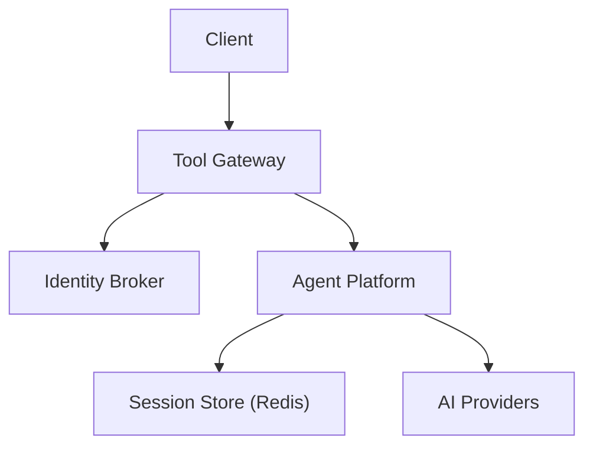
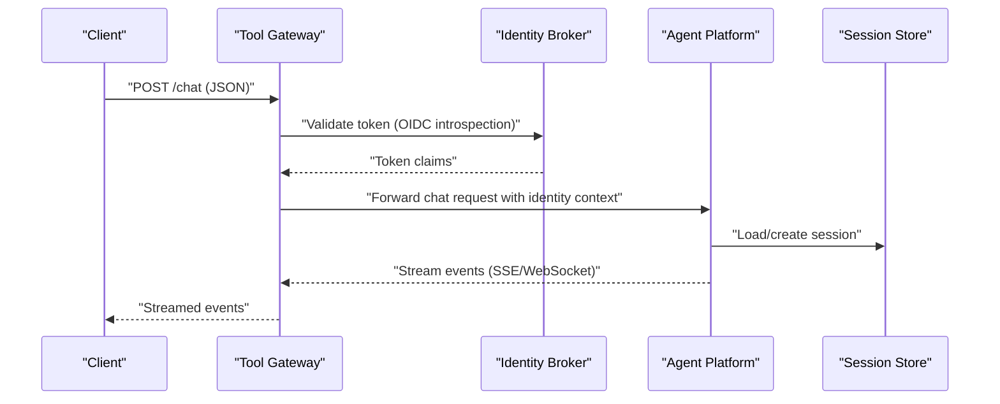
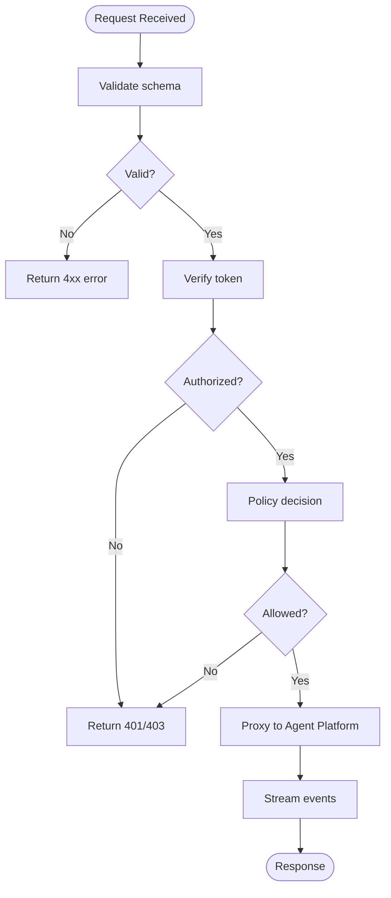
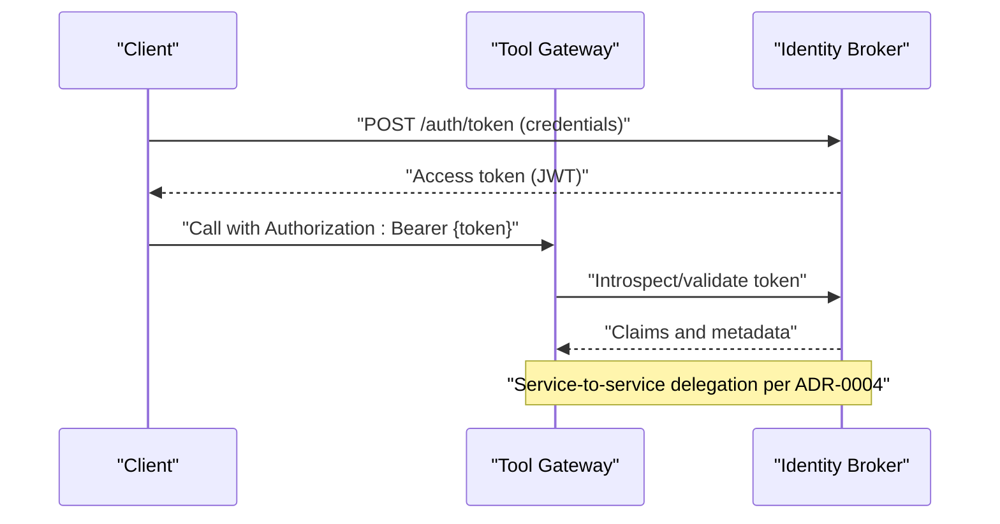
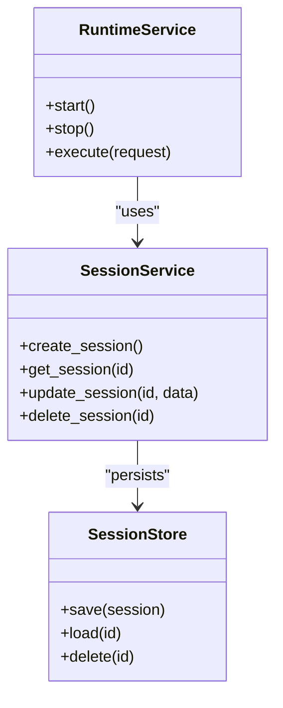
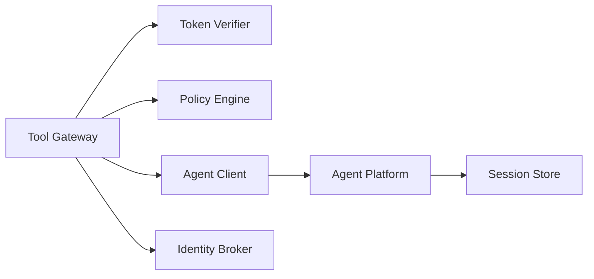

# Data Flow & Communication Patterns

<cite>
**Referenced Files in This Document**
- [README.md](file://README.md)
- [agent-chat-request.schema.json](file://shared/shared-contracts/schemas/agent-chat-request.schema.json)
- [agent-chat-response.schema.json](file://shared/shared-contracts/schemas/agent-chat-response.schema.json)
- [agent-stream-event.schema.json](file://shared/shared-contracts/schemas/agent-stream-event.schema.json)
- [chat-request.schema.json](file://shared/shared-contracts/schemas/chat-request.schema.json)
- [chat-response.schema.json](file://shared/shared-contracts/schemas/chat-response.schema.json)
- [stream-event.schema.json](file://shared/shared-contracts/schemas/stream-event.schema.json)
- [identity-token.schema.json](file://shared/shared-contracts/schemas/identity-token.schema.json)
- [identity-context.schema.json](file://shared/shared-contracts/schemas/identity-context.schema.json)
- [session.schema.json](file://shared/shared-contracts/schemas/session.schema.json)
- [agent-session.schema.json](file://shared/shared-contracts/schemas/agent-session.schema.json)
- [tool-invocation.schema.json](file://shared/shared-contracts/schemas/tool-invocation.schema.json)
- [tool-result.schema.json](file://shared/shared-contracts/schemas/tool-result.schema.json)
- [policy-decision.schema.json](file://shared/shared-contracts/schemas/policy-decision.schema.json)
- [policy-rule.schema.json](file://shared/shared-contracts/schemas/policy-rule.schema.json)
- [health-response.schema.json](file://shared/shared-contracts/schemas/health-response.schema.json)
- [agent-runtime-metadata.schema.json](file://shared/shared-contracts/schemas/agent-runtime-metadata.schema.json)
- [routes.py](file://products/agent-platform/src/agent_service/api/v2/routes.py)
- [api.py](file://products/agent-platform/src/agent_service/schemas/api.py)
- [v2.py](file://products/agent-platform/src/agent_service/schemas/v2.py)
- [runtime_service.py](file://products/agent-platform/src/agent_service/services/runtime_service.py)
- [session_service.py](file://products/agent-platform/src/agent_service/services/session_service.py)
- [session_store.py](file://products/agent-platform/src/agent_service/services/session_store.py)
- [auth.py](file://products/identity-broker/src/identity_service/api/routes/auth.py)
- [identity.py](file://products/identity-broker/src/identity_service/api/routes/identity.py)
- [token_service.py](file://products/identity-broker/src/identity_service/services/token_service.py)
- [identity_service.py](file://products/identity-broker/src/identity_service/services/identity_service.py)
- [router.py](file://products/identity-broker/src/identity_service/api/router.py)
- [gateway_service.py](file://products/tool-gateway/src/api_gateway/services/gateway_service.py)
- [agent_client.py](file://products/tool-gateway/src/api_gateway/services/agent_client.py)
- [token_verifier.py](file://products/tool-gateway/src/api_gateway/services/token_verifier.py)
- [policy_engine.py](file://products/tool-gateway/src/api_gateway/services/policy_engine.py)
- [routes.py](file://products/tool-gateway/src/api_gateway/api/routes/chat.py)
- [routes.py](file://products/tool-gateway/src/api_gateway/api/routes/sessions.py)
- [routes.py](file://products/tool-gateway/src/api_gateway/api/routes/auth.py)
- [routes.py](file://products/tool-gateway/src/api_gateway/api/routes/identity.py)
- [routes.py](file://products/tool-gateway/src/api_gateway/api/routes/runtime.py)
- [routes.py](file://products/tool-gateway/src/api_gateway/api/routes/tools.py)
- [observability-conventions.md](file://shared/shared-contracts/observability-conventions.md)
- [0004-broker-mediated-token-delegation.md](file://docs/adr/0004-broker-mediated-token-delegation.md)
- [SPEC-006-session-durability/spec.md](file://docs/specs/SPEC-006-session-durability/spec.md)
- [SPEC-008-service-to-service-identity/spec.md](file://docs/specs/SPEC-008-service-to-service-identity/spec.md)
</cite>

## Table of Contents
1. Introduction
2. Project Structure
3. Core Components
4. Architecture Overview
5. Detailed Component Analysis
6. Dependency Analysis
7. Performance Considerations
8. Troubleshooting Guide
9. Conclusion

## Introduction
This document explains the data flow patterns and communication protocols across the Luban AIOps Platform, focusing on:
- REST API communication between services
- WebSocket streaming for real-time responses
- Internal service-to-service messaging
- Shared request/response schemas and protocol versions
- OIDC-based authentication token flow
- Session state management across distributed components
- Error handling patterns, retry mechanisms, and circuit breaker strategies
- Data serialization formats and backward compatibility strategies

The platform is composed of three primary runtime services:
- Tool Gateway (API gateway and policy enforcement)
- Identity Broker (OIDC identity and token services)
- Agent Platform (Agent runtime and session management)

These services communicate over HTTP/REST with JSON payloads and use shared JSON Schema contracts to ensure interoperability. Real-time agent interactions are streamed via Server-Sent Events (SSE) or WebSocket-like event streams as defined by shared stream schemas.

## Project Structure
At a high level:
- The Tool Gateway exposes public APIs, enforces policies, verifies tokens, and proxies requests to the Agent Platform.
- The Identity Broker provides OIDC endpoints for authentication and issues tokens used across the platform.
- The Agent Platform implements agent runtime logic, manages sessions, and interacts with external AI providers through providers.

[No sources needed since this diagram shows conceptual workflow, not actual code structure]

## Core Components
- Tool Gateway: Central entrypoint for clients; handles authentication, authorization, routing, rate limiting, observability, and proxying to downstream services. It also enforces policies and mediates tool invocations.
- Identity Broker: Implements OIDC flows, validates tokens, and issues short-lived tokens for service-to-service delegation when required.
- Agent Platform: Hosts agent runtime, manages sessions, executes tools, and streams events back to clients via SSE/WebSocket.

Key responsibilities:
- Request validation against shared schemas
- Token verification and context propagation
- Policy decisions before invoking agents or tools
- Streaming responses for long-running operations
- Durable session persistence

**Section sources**
- [README.md](file://README.md)

## Architecture Overview
The platform follows a layered architecture:
- Edge: Tool Gateway
- Identity: Identity Broker
- Runtime: Agent Platform
- Storage: Redis-backed session store
- External: AI provider SDKs

**Diagram sources**
- [routes.py](file://products/tool-gateway/src/api_gateway/api/routes/chat.py)
- [auth.py](file://products/identity-broker/src/identity_service/api/routes/auth.py)
- [runtime_service.py](file://products/agent-platform/src/agent_service/services/runtime_service.py)
- [session_service.py](file://products/agent-platform/src/agent_service/services/session_service.py)
- [session_store.py](file://products/agent-platform/src/agent_service/services/session_store.py)

**Section sources**
- [routes.py](file://products/tool-gateway/src/api_gateway/api/routes/chat.py)
- [auth.py](file://products/identity-broker/src/identity_service/api/routes/auth.py)
- [runtime_service.py](file://products/agent-platform/src/agent_service/services/runtime_service.py)
- [session_service.py](file://products/agent-platform/src/agent_service/services/session_service.py)
- [session_store.py](file://products/agent-platform/src/agent_service/services/session_store.py)

## Detailed Component Analysis

### Tool Gateway: Public API and Proxying
- Exposes REST endpoints for chat, sessions, auth, identity, runtime, and tools.
- Validates incoming requests against shared schemas.
- Verifies tokens using the token verifier service.
- Enforces policies via the policy engine.
- Proxies requests to the Agent Platform client service.
- Streams responses using SSE/WebSocket-compatible event frames.

**Diagram sources**
- [gateway_service.py](file://products/tool-gateway/src/api_gateway/services/gateway_service.py)
- [token_verifier.py](file://products/tool-gateway/src/api_gateway/services/token_verifier.py)
- [policy_engine.py](file://products/tool-gateway/src/api_gateway/services/policy_engine.py)
- [agent_client.py](file://products/tool-gateway/src/api_gateway/services/agent_client.py)

**Section sources**
- [routes.py](file://products/tool-gateway/src/api_gateway/api/routes/chat.py)
- [routes.py](file://products/tool-gateway/src/api_gateway/api/routes/sessions.py)
- [routes.py](file://products/tool-gateway/src/api_gateway/api/routes/auth.py)
- [routes.py](file://products/tool-gateway/src/api_gateway/api/routes/identity.py)
- [routes.py](file://products/tool-gateway/src/api_gateway/api/routes/runtime.py)
- [routes.py](file://products/tool-gateway/src/api_gateway/api/routes/tools.py)
- [gateway_service.py](file://products/tool-gateway/src/api_gateway/services/gateway_service.py)
- [token_verifier.py](file://products/tool-gateway/src/api_gateway/services/token_verifier.py)
- [policy_engine.py](file://products/tool-gateway/src/api_gateway/services/policy_engine.py)
- [agent_client.py](file://products/tool-gateway/src/api_gateway/services/agent_client.py)

### Identity Broker: OIDC Authentication and Token Management
- Provides OIDC endpoints for authentication and token issuance.
- Issues tokens conforming to shared identity token schema.
- Supports broker-mediated token delegation for service-to-service calls.
- Validates tokens via introspection or signature verification.

**Diagram sources**
- [auth.py](file://products/identity-broker/src/identity_service/api/routes/auth.py)
- [identity.py](file://products/identity-broker/src/identity_service/api/routes/identity.py)
- [token_service.py](file://products/identity-broker/src/identity_service/services/token_service.py)
- [identity_service.py](file://products/identity-broker/src/identity_service/services/identity_service.py)
- [router.py](file://products/identity-broker/src/identity_service/api/router.py)

**Section sources**
- [auth.py](file://products/identity-broker/src/identity_service/api/routes/auth.py)
- [identity.py](file://products/identity-broker/src/identity_service/api/routes/identity.py)
- [token_service.py](file://products/identity-broker/src/identity_service/services/token_service.py)
- [identity_service.py](file://products/identity-broker/src/identity_service/services/identity_service.py)
- [router.py](file://products/identity-broker/src/identity_service/api/router.py)

### Agent Platform: Runtime, Sessions, and Streaming
- Manages agent runtime lifecycle and settings.
- Handles session creation, persistence, and retrieval.
- Streams events back to clients using SSE/WebSocket-compatible frames.
- Interacts with external AI providers via provider registry.

**Diagram sources**
- [runtime_service.py](file://products/agent-platform/src/agent_service/services/runtime_service.py)
- [session_service.py](file://products/agent-platform/src/agent_service/services/session_service.py)
- [session_store.py](file://products/agent-platform/src/agent_service/services/session_store.py)

**Section sources**
- [runtime_service.py](file://products/agent-platform/src/agent_service/services/runtime_service.py)
- [session_service.py](file://products/agent-platform/src/agent_service/services/session_service.py)
- [session_store.py](file://products/agent-platform/src/agent_service/services/session_store.py)

### Shared Contracts and Schemas
All inter-service messages adhere to shared JSON Schema definitions under shared/shared-contracts/schemas. Key schemas include:
- Chat requests/responses: chat-request.schema.json, chat-response.schema.json
- Agent-specific chat: agent-chat-request.schema.json, agent-chat-response.schema.json
- Streaming events: stream-event.schema.json, agent-stream-event.schema.json
- Identity and tokens: identity-token.schema.json, identity-context.schema.json
- Sessions: session.schema.json, agent-session.schema.json
- Tools: tool-invocation.schema.json, tool-result.schema.json
- Policies: policy-decision.schema.json, policy-rule.schema.json
- Health and metadata: health-response.schema.json, agent-runtime-metadata.schema.json

Versioning and compatibility:
- Versioned routes (e.g., v2) indicate API evolution while maintaining backward compatibility.
- Schemas define strict typing and constraints to ensure forward/backward compatibility.
- Observability conventions standardize metrics and tracing across services.

**Section sources**
- [chat-request.schema.json](file://shared/shared-contracts/schemas/chat-request.schema.json)
- [chat-response.schema.json](file://shared/shared-contracts/schemas/chat-response.schema.json)
- [agent-chat-request.schema.json](file://shared/shared-contracts/schemas/agent-chat-request.schema.json)
- [agent-chat-response.schema.json](file://shared/shared-contracts/schemas/agent-chat-response.schema.json)
- [stream-event.schema.json](file://shared/shared-contracts/schemas/stream-event.schema.json)
- [agent-stream-event.schema.json](file://shared/shared-contracts/schemas/agent-stream-event.schema.json)
- [identity-token.schema.json](file://shared/shared-contracts/schemas/identity-token.schema.json)
- [identity-context.schema.json](file://shared/shared-contracts/schemas/identity-context.schema.json)
- [session.schema.json](file://shared/shared-contracts/schemas/session.schema.json)
- [agent-session.schema.json](file://shared/shared-contracts/schemas/agent-session.schema.json)
- [tool-invocation.schema.json](file://shared/shared-contracts/schemas/tool-invocation.schema.json)
- [tool-result.schema.json](file://shared/shared-contracts/schemas/tool-result.schema.json)
- [policy-decision.schema.json](file://shared/shared-contracts/schemas/policy-decision.schema.json)
- [policy-rule.schema.json](file://shared/shared-contracts/schemas/policy-rule.schema.json)
- [health-response.schema.json](file://shared/shared-contracts/schemas/health-response.schema.json)
- [agent-runtime-metadata.schema.json](file://shared/shared-contracts/schemas/agent-runtime-metadata.schema.json)
- [observability-conventions.md](file://shared/shared-contracts/observability-conventions.md)

### Protocol Versions and Backward Compatibility
- API versioning is implemented via route prefixes (e.g., v2).
- Schemas enforce strict field presence and types to avoid breaking changes.
- Deprecation strategy involves maintaining older routes alongside new ones until migration completes.

**Section sources**
- [routes.py](file://products/agent-platform/src/agent_service/api/v2/routes.py)
- [api.py](file://products/agent-platform/src/agent_service/schemas/api.py)
- [v2.py](file://products/agent-platform/src/agent_service/schemas/v2.py)

### Authentication Token Flow Through OIDC
- Clients authenticate with Identity Broker to obtain access tokens.
- Tool Gateway validates tokens via introspection or signature checks.
- Service-to-service delegation uses broker-mediated token delegation per ADR-0004.

**Section sources**
- [auth.py](file://products/identity-broker/src/identity_service/api/routes/auth.py)
- [token_service.py](file://products/identity-broker/src/identity_service/services/token_service.py)
- [0004-broker-mediated-token-delegation.md](file://docs/adr/0004-broker-mediated-token-delegation.md)

### Session State Management Across Distributed Components
- Sessions are created and managed by the Agent Platform’s session service.
- Persistence is handled by a session store (typically Redis-backed).
- Durability guarantees and recovery strategies are specified in SPEC-006.

**Section sources**
- [session_service.py](file://products/agent-platform/src/agent_service/services/session_service.py)
- [session_store.py](file://products/agent-platform/src/agent_service/services/session_store.py)
- [SPEC-006-session-durability/spec.md](file://docs/specs/SPEC-006-session-durability/spec.md)

### Error Handling Patterns, Retry Mechanisms, and Circuit Breakers
- Tool Gateway centralizes error handling and returns standardized error responses.
- Retry mechanisms are applied for transient failures when calling downstream services.
- Circuit breakers prevent cascading failures by failing fast when downstream services are unhealthy.
- Observability conventions ensure consistent error logging and metrics.

[No sources needed since this section provides general guidance]

### Data Serialization Formats and Protocol Versions
- All payloads are JSON serialized according to shared schemas.
- Protocols are versioned at the API layer to maintain compatibility.
- Streaming uses event frames defined by stream schemas.

**Section sources**
- [stream-event.schema.json](file://shared/shared-contracts/schemas/stream-event.schema.json)
- [agent-stream-event.schema.json](file://shared/shared-contracts/schemas/agent-stream-event.schema.json)

## Dependency Analysis
The following diagram illustrates dependencies among core services and their roles:

**Diagram sources**
- [gateway_service.py](file://products/tool-gateway/src/api_gateway/services/gateway_service.py)
- [token_verifier.py](file://products/tool-gateway/src/api_gateway/services/token_verifier.py)
- [policy_engine.py](file://products/tool-gateway/src/api_gateway/services/policy_engine.py)
- [agent_client.py](file://products/tool-gateway/src/api_gateway/services/agent_client.py)
- [runtime_service.py](file://products/agent-platform/src/agent_service/services/runtime_service.py)
- [session_store.py](file://products/agent-platform/src/agent_service/services/session_store.py)
- [auth.py](file://products/identity-broker/src/identity_service/api/routes/auth.py)

**Section sources**
- [gateway_service.py](file://products/tool-gateway/src/api_gateway/services/gateway_service.py)
- [token_verifier.py](file://products/tool-gateway/src/api_gateway/services/token_verifier.py)
- [policy_engine.py](file://products/tool-gateway/src/api_gateway/services/policy_engine.py)
- [agent_client.py](file://products/tool-gateway/src/api_gateway/services/agent_client.py)
- [runtime_service.py](file://products/agent-platform/src/agent_service/services/runtime_service.py)
- [session_store.py](file://products/agent-platform/src/agent_service/services/session_store.py)
- [auth.py](file://products/identity-broker/src/identity_service/api/routes/auth.py)

## Performance Considerations
- Use connection pooling for HTTP clients to reduce latency.
- Cache frequently accessed identity claims where appropriate.
- Stream large responses incrementally to minimize memory usage.
- Monitor and tune session store throughput.
- Implement backpressure in streaming pipelines.

[No sources needed since this section provides general guidance]

## Troubleshooting Guide
Common issues and resolutions:
- Authentication failures: Verify OIDC configuration and token validity.
- Policy denials: Inspect policy rules and input context.
- Session errors: Check session store connectivity and durability settings.
- Streaming interruptions: Ensure network stability and proper event framing.

**Section sources**
- [auth.py](file://products/identity-broker/src/identity_service/api/routes/auth.py)
- [policy_engine.py](file://products/tool-gateway/src/api_gateway/services/policy_engine.py)
- [session_store.py](file://products/agent-platform/src/agent_service/services/session_store.py)

## Conclusion
The Luban AIOps Platform employs a robust, schema-driven architecture with clear separation of concerns across gateway, identity, and runtime layers. Shared contracts ensure interoperability, while OIDC-based authentication and durable session management provide security and reliability. Streaming support enables real-time interactions, and centralized error handling with retry and circuit breaker patterns enhances resilience.

[No sources needed since this section summarizes without analyzing specific files]