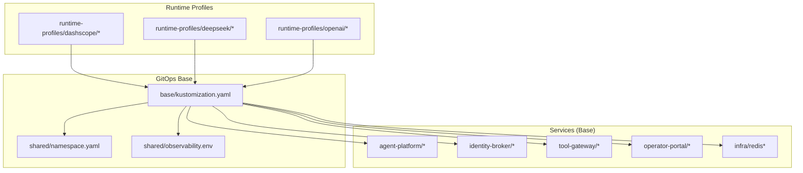
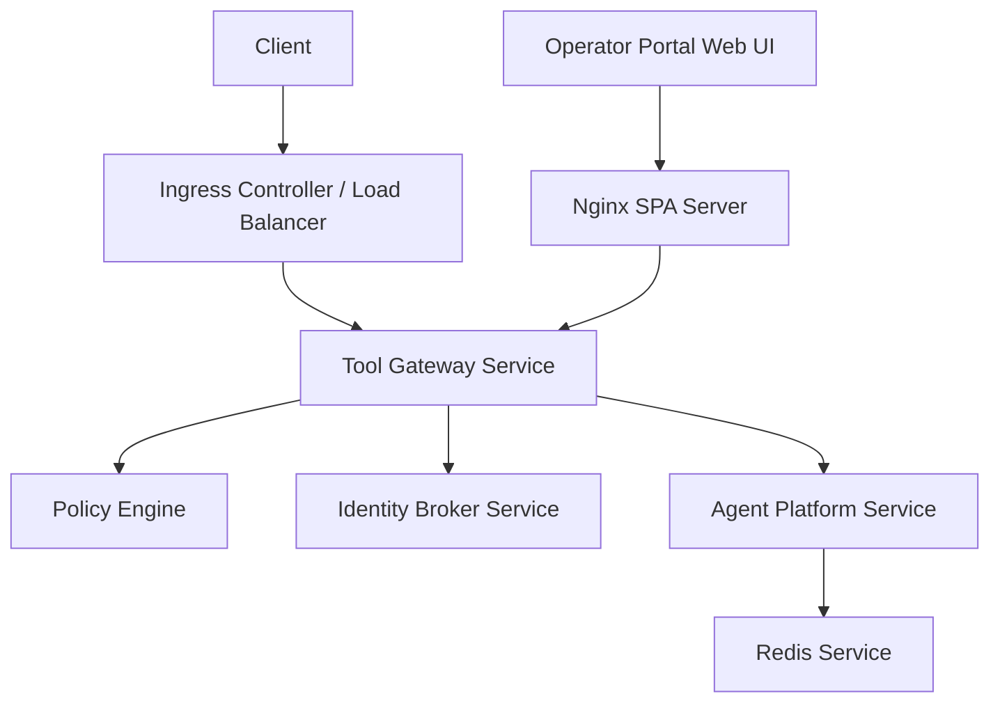
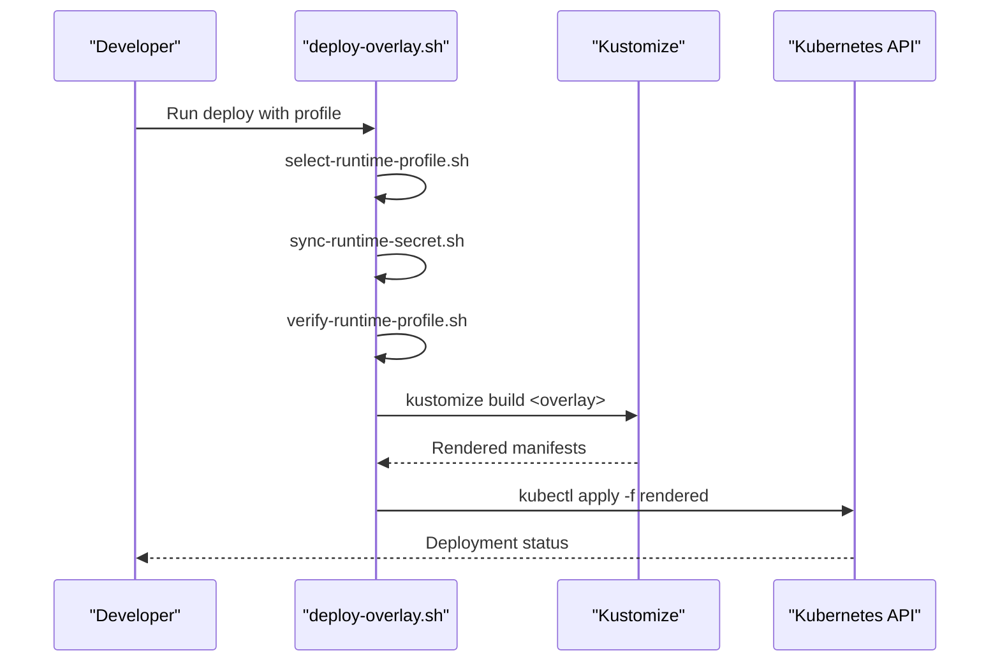
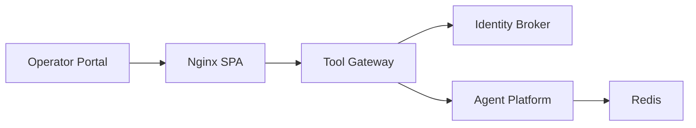

# Deployment Topology & Infrastructure

<cite>
**Referenced Files in This Document**
- [kustomization.yaml](file://shared/platform-ops/gitops/dev-k8s/kustomization.yaml)
- [base/kustomization.yaml](file://shared/platform-ops/gitops/dev-k8s/base/kustomization.yaml)
- [namespace.yaml](file://shared/platform-ops/gitops/dev-k8s/base/shared/namespace.yaml)
- [observability.env](file://shared/platform-ops/gitops/dev-k8s/base/shared/observability.env)
- [agent-service-deployment.yaml](file://shared/platform-ops/gitops/dev-k8s/base/agent-platform/agent-service-deployment.yaml)
- [agent-service-service.yaml](file://shared/platform-ops/gitops/dev-k8s/base/agent-platform/agent-service-service.yaml)
- [runtime-config.env](file://shared/platform-ops/gitops/dev-k8s/base/agent-platform/runtime-config.env)
- [identity-service-deployment.yaml](file://shared/platform-ops/gitops/dev-k8s/base/identity-broker/identity-service-deployment.yaml)
- [identity-service-service.yaml](file://shared/platform-ops/gitops/dev-k8s/base/identity-broker/identity-service-service.yaml)
- [runtime-config.env](file://shared/platform-ops/gitops/dev-k8s/base/identity-broker/runtime-config.env)
- [redis-deployment.yaml](file://shared/platform-ops/gitops/dev-k8s/base/infra/redis-deployment.yaml)
- [redis-service.yaml](file://shared/platform-ops/gitops/dev-k8s/base/infra/redis-service.yaml)
- [web-ui-deployment.yaml](file://shared/platform-ops/gitops/dev-k8s/base/operator-portal/web-ui-deployment.yaml)
- [web-ui-service.yaml](file://shared/platform-ops/gitops/dev-k8s/base/operator-portal/web-ui-service.yaml)
- [nginx.conf](file://products/operator-portal/nginx.conf)
- [Dockerfile](file://products/operator-portal/Dockerfile)
- [vite.config.ts](file://products/operator-portal/web-ui/app/vite.config.ts)
- [api-gateway-deployment.yaml](file://shared/platform-ops/gitops/dev-k8s/base/tool-gateway/api-gateway-deployment.yaml)
- [api-gateway-service.yaml](file://shared/platform-ops/gitops/dev-k8s/base/tool-gateway/api-gateway-service.yaml)
- [policy.yaml](file://shared/platform-ops/gitops/dev-k8s/base/tool-gateway/policy.yaml)
- [rbac.yaml](file://shared/platform-ops/gitops/dev-k8s/base/tool-gateway/rbac.yaml)
- [runtime-config.env](file://shared/platform-ops/gitops/dev-k8s/base/tool-gateway/runtime-config.env)
- [deploy-overlay.sh](file://shared/platform-ops/gitops/deploy-overlay.sh)
- [select-runtime-profile.sh](file://shared/platform-ops/gitops/select-runtime-profile.sh)
- [sync-runtime-secret.sh](file://shared/platform-ops/gitops/sync-runtime-secret.sh)
- [verify-runtime-profile.sh](file://shared/platform-ops/gitops/verify-runtime-profile.sh)
- [dashscope/configmap.yaml](file://shared/platform-ops/gitops/runtime-profiles/dashscope/configmap.yaml)
- [dashscope/kustomization.yaml](file://shared/platform-ops/gitops/runtime-profiles/dashscope/kustomization.yaml)
- [deepseek/configmap.yaml](file://shared/platform-ops/gitops/runtime-profiles/deepseek/configmap.yaml)
- [deepseek/kustomization.yaml](file://shared/platform-ops/gitops/runtime-profiles/deepseek/kustomization.yaml)
- [openai/configmap.yaml](file://shared/platform-ops/gitops/runtime-profiles/openai/configmap.yaml)
- [openai/kustomization.yaml](file://shared/platform-ops/gitops/runtime-profiles/openai/kustomization.yaml)
- [README.md](file://shared/platform-ops/gitops/runtime-profiles/README.md)
- [Makefile](file://Makefile)
- [image.mk](file://mk/image.mk)
- [python.mk](file://mk/python.mk)
- [Dockerfile](file://products/agent-platform/Dockerfile)
- [Dockerfile](file://products/identity-broker/Dockerfile)
- [Dockerfile](file://products/tool-gateway/Dockerfile)
- [pyproject.toml](file://products/agent-platform/pyproject.toml)
- [pyproject.toml](file://products/identity-broker/pyproject.toml)
- [pyproject.toml](file://products/tool-gateway/pyproject.toml)
- [app.py](file://products/agent-platform/src/agent_platform/app.py)
- [config.py](file://products/agent-platform/src/agent_platform/core/config.py)
- [main.py](file://products/agent-platform/src/agent_platform/main.py)
- [app.py](file://products/identity-broker/src/identity_service/app.py)
- [config.py](file://products/identity-broker/src/identity_service/core/config.py)
- [main.py](file://products/identity-broker/src/identity_service/main.py)
- [app.py](file://products/tool-gateway/src/api_gateway/app.py)
- [config.py](file://products/tool-gateway/src/api_gateway/core/config.py)
- [main.py](file://products/tool-gateway/src/api_gateway/main.py)
</cite>

## Update Summary
**Changes Made**
- Updated Operator Portal section to reflect simplified nginx configuration for serving SPA at root path
- Removed references to legacy coexistence routing logic
- Added details about content-hashed asset caching strategy
- Updated deployment architecture diagram to show simplified SPA serving pattern

## Table of Contents
1. [Introduction](#introduction)
2. [Project Structure](#project-structure)
3. [Core Components](#core-components)
4. [Architecture Overview](#architecture-overview)
5. [Detailed Component Analysis](#detailed-component-analysis)
6. [Dependency Analysis](#dependency-analysis)
7. [Performance Considerations](#performance-considerations)
8. [Troubleshooting Guide](#troubleshooting-guide)
9. [Conclusion](#conclusion)
10. [Appendices](#appendices)

## Introduction
This document describes the deployment topology and infrastructure requirements for the Luban AIOps Platform. It focuses on Kubernetes cluster configuration, namespace isolation, resource allocation strategies, GitOps workflows using Kustomize overlays, container image strategies, secret and configuration management, scaling policies, load balancing, high availability, monitoring, logging, and backup/restore procedures suitable for production environments.

## Project Structure
The platform is organized into product services and shared platform operations:
- Products: agent-platform, identity-broker, operator-portal, tool-gateway
- Shared platform ops: GitOps definitions under shared/platform-ops/gitops with base manifests and runtime profiles
- Build and packaging: Makefiles and Dockerfiles per product; shared build helpers under mk

**Diagram sources**
- [base/kustomization.yaml](file://shared/platform-ops/gitops/dev-k8s/base/kustomization.yaml)
- [namespace.yaml](file://shared/platform-ops/gitops/dev-k8s/base/shared/namespace.yaml)
- [observability.env](file://shared/platform-ops/gitops/dev-k8s/base/shared/observability.env)
- [agent-service-deployment.yaml](file://shared/platform-ops/gitops/dev-k8s/base/agent-platform/agent-service-deployment.yaml)
- [identity-service-deployment.yaml](file://shared/platform-ops/gitops/dev-k8s/base/identity-broker/identity-service-deployment.yaml)
- [api-gateway-deployment.yaml](file://shared/platform-ops/gitops/dev-k8s/base/tool-gateway/api-gateway-deployment.yaml)
- [web-ui-deployment.yaml](file://shared/platform-ops/gitops/dev-k8s/base/operator-portal/web-ui-deployment.yaml)
- [redis-deployment.yaml](file://shared/platform-ops/gitops/dev-k8s/base/infra/redis-deployment.yaml)
- [dashscope/kustomization.yaml](file://shared/platform-ops/gitops/runtime-profiles/dashscope/kustomization.yaml)
- [deepseek/kustomization.yaml](file://shared/platform-ops/gitops/runtime-profiles/deepseek/kustomization.yaml)
- [openai/kustomization.yaml](file://shared/platform-ops/gitops/runtime-profiles/openai/kustomization.yaml)

**Section sources**
- [kustomization.yaml](file://shared/platform-ops/gitops/dev-k8s/kustomization.yaml)
- [base/kustomization.yaml](file://shared/platform-ops/gitops/dev-k8s/base/kustomization.yaml)
- [namespace.yaml](file://shared/platform-ops/gitops/dev-k8s/base/shared/namespace.yaml)
- [observability.env](file://shared/platform-ops/gitops/dev-k8s/base/shared/observability.env)

## Core Components
The platform comprises four primary services and a shared Redis cache:
- Agent Platform Service: orchestrates agent runtime sessions and provider integrations
- Identity Broker: issues and validates tokens and manages identity context
- Tool Gateway: API gateway enforcing policies and routing to agents
- Operator Portal: web UI for operators serving a modern SPA via nginx
- Redis: session/state store used by services

Each service exposes a Kubernetes Service and Deployment defined in the base layer, with environment-specific overlays applied via Kustomize.

**Section sources**
- [agent-service-deployment.yaml](file://shared/platform-ops/gitops/dev-k8s/base/agent-platform/agent-service-deployment.yaml)
- [agent-service-service.yaml](file://shared/platform-ops/gitops/dev-k8s/base/agent-platform/agent-service-service.yaml)
- [identity-service-deployment.yaml](file://shared/platform-ops/gitops/dev-k8s/base/identity-broker/identity-service-deployment.yaml)
- [identity-service-service.yaml](file://shared/platform-ops/gitops/dev-k8s/base/identity-broker/identity-service-service.yaml)
- [api-gateway-deployment.yaml](file://shared/platform-ops/gitops/dev-k8s/base/tool-gateway/api-gateway-deployment.yaml)
- [api-gateway-service.yaml](file://shared/platform-ops/gitops/dev-k8s/base/tool-gateway/api-gateway-service.yaml)
- [web-ui-deployment.yaml](file://shared/platform-ops/gitops/dev-k8s/base/operator-portal/web-ui-deployment.yaml)
- [web-ui-service.yaml](file://shared/platform-ops/gitops/dev-k8s/base/operator-portal/web-ui-service.yaml)
- [redis-deployment.yaml](file://shared/platform-ops/gitops/dev-k8s/base/infra/redis-deployment.yaml)
- [redis-service.yaml](file://shared/platform-ops/gitops/dev-k8s/base/infra/redis-service.yaml)

## Architecture Overview
The runtime architecture uses an API Gateway that authenticates requests, enforces policies, and routes to the Agent Platform. The Identity Broker provides token issuance and validation. Redis stores sessions and state. The Operator Portal serves a modern React SPA via nginx with simplified routing logic.

**Diagram sources**
- [api-gateway-service.yaml](file://shared/platform-ops/gitops/dev-k8s/base/tool-gateway/api-gateway-service.yaml)
- [policy.yaml](file://shared/platform-ops/gitops/dev-k8s/base/tool-gateway/policy.yaml)
- [identity-service-service.yaml](file://shared/platform-ops/gitops/dev-k8s/base/identity-broker/identity-service-service.yaml)
- [agent-service-service.yaml](file://shared/platform-ops/gitops/dev-k8s/base/agent-platform/agent-service-service.yaml)
- [redis-service.yaml](file://shared/platform-ops/gitops/dev-k8s/base/infra/redis-service.yaml)
- [web-ui-service.yaml](file://shared/platform-ops/gitops/dev-k8s/base/operator-portal/web-ui-service.yaml)
- [nginx.conf](file://products/operator-portal/nginx.conf)

## Detailed Component Analysis

### Kubernetes Cluster Configuration and Namespace Isolation
- Namespace: A dedicated namespace is created via a manifest to isolate platform resources.
- Base Kustomization: Aggregates all base components and shared configuration.
- Environment overlays: Apply environment-specific patches and variables.

Key practices:
- Use a single namespace per environment for isolation.
- Keep base manifests immutable and environment-specific overrides in overlays.
- Centralize observability settings via a shared env file.

**Section sources**
- [namespace.yaml](file://shared/platform-ops/gitops/dev-k8s/base/shared/namespace.yaml)
- [base/kustomization.yaml](file://shared/platform-ops/gitops/dev-k8s/base/kustomization.yaml)
- [observability.env](file://shared/platform-ops/gitops/dev-k8s/base/shared/observability.env)

### Resource Allocation Strategies
- Deployments define CPU/memory requests and limits per component.
- HPA can be enabled via overlays for autoscaling based on metrics.
- Node selectors or tolerations can be added in overlays for specialized nodes.

Recommendations:
- Set requests to guarantee baseline capacity and limits to cap usage.
- Use separate resource classes for compute-intensive vs. I/O-bound services.
- Monitor utilization and adjust requests/limits iteratively.

**Section sources**
- [agent-service-deployment.yaml](file://shared/platform-ops/gitops/dev-k8s/base/agent-platform/agent-service-deployment.yaml)
- [identity-service-deployment.yaml](file://shared/platform-ops/gitops/dev-k8s/base/identity-broker/identity-service-deployment.yaml)
- [api-gateway-deployment.yaml](file://shared/platform-ops/gitops/dev-k8s/base/tool-gateway/api-gateway-deployment.yaml)
- [web-ui-deployment.yaml](file://shared/platform-ops/gitops/dev-k8s/base/operator-portal/web-ui-deployment.yaml)
- [redis-deployment.yaml](file://shared/platform-ops/gitops/dev-k8s/base/infra/redis-deployment.yaml)

### GitOps Workflow Using Kustomize Overlays
- Base layer defines canonical desired state.
- Runtime profiles overlay model configurations for different LLM providers.
- Scripts orchestrate profile selection, secret sync, verification, and deployment.

Workflow steps:
1. Select a runtime profile (e.g., dashscope, deepseek, openai).
2. Sync runtime secrets into the target namespace.
3. Verify profile consistency.
4. Build and apply Kustomize overlay to deploy.

**Diagram sources**
- [deploy-overlay.sh](file://shared/platform-ops/gitops/deploy-overlay.sh)
- [select-runtime-profile.sh](file://shared/platform-ops/gitops/select-runtime-profile.sh)
- [sync-runtime-secret.sh](file://shared/platform-ops/gitops/sync-runtime-secret.sh)
- [verify-runtime-profile.sh](file://shared/platform-ops/gitops/verify-runtime-profile.sh)
- [dashscope/kustomization.yaml](file://shared/platform-ops/gitops/runtime-profiles/dashscope/kustomization.yaml)
- [deepseek/kustomization.yaml](file://shared/platform-ops/gitops/runtime-profiles/deepseek/kustomization.yaml)
- [openai/kustomization.yaml](file://shared/platform-ops/gitops/runtime-profiles/openai/kustomization.yaml)

**Section sources**
- [deploy-overlay.sh](file://shared/platform-ops/gitops/deploy-overlay.sh)
- [select-runtime-profile.sh](file://shared/platform-ops/gitops/select-runtime-profile.sh)
- [sync-runtime-secret.sh](file://shared/platform-ops/gitops/sync-runtime-secret.sh)
- [verify-runtime-profile.sh](file://shared/platform-ops/gitops/verify-runtime-profile.sh)
- [README.md](file://shared/platform-ops/gitops/runtime-profiles/README.md)

### Container Image Strategy
- Each product has its own Dockerfile defining the runtime image.
- Python dependencies are managed via pyproject.toml and lock files.
- Shared build helpers standardize image tagging and multi-stage builds.
- Operator Portal uses a multi-stage build with Vite compilation and nginx runtime.

Best practices:
- Pin base images and dependency versions.
- Use non-root users in containers.
- Minimize image size by multi-stage builds and pruning dev dependencies.
- Content-hashed assets enable immutable caching for optimal performance.

**Section sources**
- [Dockerfile](file://products/agent-platform/Dockerfile)
- [Dockerfile](file://products/identity-broker/Dockerfile)
- [Dockerfile](file://products/operator-portal/Dockerfile)
- [Dockerfile](file://products/tool-gateway/Dockerfile)
- [pyproject.toml](file://products/agent-platform/pyproject.toml)
- [pyproject.toml](file://products/identity-broker/pyproject.toml)
- [pyproject.toml](file://products/tool-gateway/pyproject.toml)
- [image.mk](file://mk/image.mk)
- [python.mk](file://mk/python.mk)
- [Makefile](file://Makefile)

### Secret Management and Configuration Management
- Secrets: Runtime secrets are synced via script to the target namespace before deployment.
- ConfigMaps and Env files: Environment variables and configs are provided through env files and configmaps.
- Policy: Policy engine configuration is declared in YAML and mounted into the gateway.

Guidelines:
- Store sensitive values in a secure secret manager and sync to Kubernetes secrets.
- Use Kustomize generators or external secret controllers for automated rotation.
- Separate runtime configuration from code via env files and configmaps.

**Section sources**
- [sync-runtime-secret.sh](file://shared/platform-ops/gitops/sync-runtime-secret.sh)
- [runtime-config.env](file://shared/platform-ops/gitops/dev-k8s/base/agent-platform/runtime-config.env)
- [runtime-config.env](file://shared/platform-ops/gitops/dev-k8s/base/identity-broker/runtime-config.env)
- [runtime-config.env](file://shared/platform-ops/gitops/dev-k8s/base/tool-gateway/runtime-config.env)
- [policy.yaml](file://shared/platform-ops/gitops/dev-k8s/base/tool-gateway/policy.yaml)
- [dashscope/configmap.yaml](file://shared/platform-ops/gitops/runtime-profiles/dashscope/configmap.yaml)
- [deepseek/configmap.yaml](file://shared/platform-ops/gitops/runtime-profiles/deepseek/configmap.yaml)
- [openai/configmap.yaml](file://shared/platform-ops/gitops/runtime-profiles/openai/configmap.yaml)

### Scaling Policies and High Availability
- Replicas: Set minimum replicas for HA across zones.
- HPA: Enable horizontal pod autoscaling based on CPU/memory or custom metrics.
- PodDisruptionBudgets: Define budgets to ensure availability during voluntary disruptions.
- Multi-replica deployments: Ensure stateless design where possible; use Redis for shared state.

Recommendations:
- Configure readiness/liveness probes for reliable rollouts and traffic routing.
- Spread pods across nodes/zones using topology spread constraints.
- Tune HPA thresholds to avoid flapping under bursty workloads.

**Section sources**
- [agent-service-deployment.yaml](file://shared/platform-ops/gitops/dev-k8s/base/agent-platform/agent-service-deployment.yaml)
- [identity-service-deployment.yaml](file://shared/platform-ops/gitops/dev-k8s/base/identity-broker/identity-service-deployment.yaml)
- [api-gateway-deployment.yaml](file://shared/platform-ops/gitops/dev-k8s/base/tool-gateway/api-gateway-deployment.yaml)
- [web-ui-deployment.yaml](file://shared/platform-ops/gitops/dev-k8s/base/operator-portal/web-ui-deployment.yaml)
- [redis-deployment.yaml](file://shared/platform-ops/gitops/dev-k8s/base/infra/redis-deployment.yaml)

### Load Balancing and Networking
- Services expose internal endpoints within the cluster.
- An Ingress controller or external load balancer fronts the Tool Gateway and Operator Portal.
- Health checks should be configured at both Service and Ingress levels.
- Operator Portal uses nginx to serve SPA content with optimized caching strategies.

Considerations:
- Use sticky sessions only if required by application state.
- Configure timeouts and rate limiting at the ingress layer.
- Route traffic by path or host to isolate services.
- SPA assets benefit from content hashing and immutable caching headers.

**Section sources**
- [api-gateway-service.yaml](file://shared/platform-ops/gitops/dev-k8s/base/tool-gateway/api-gateway-service.yaml)
- [web-ui-service.yaml](file://shared/platform-ops/gitops/dev-k8s/base/operator-portal/web-ui-service.yaml)
- [agent-service-service.yaml](file://shared/platform-ops/gitops/dev-k8s/base/agent-platform/agent-service-service.yaml)
- [identity-service-service.yaml](file://shared/platform-ops/gitops/dev-k8s/base/identity-broker/identity-service-service.yaml)
- [redis-service.yaml](file://shared/platform-ops/gitops/dev-k8s/base/infra/redis-service.yaml)
- [nginx.conf](file://products/operator-portal/nginx.conf)

### Monitoring Infrastructure and Logging Aggregation
- Observability env file centralizes metrics and tracing flags.
- Application modules expose metrics and telemetry hooks.
- Logs should be emitted in structured JSON format for aggregation.

Implementation notes:
- Collect metrics via Prometheus scraping of service endpoints.
- Aggregate logs with a centralized logging stack (e.g., Fluent Bit + Loki/Elasticsearch).
- Use distributed tracing headers propagated across services.

**Section sources**
- [observability.env](file://shared/platform-ops/gitops/dev-k8s/base/shared/observability.env)
- [config.py](file://products/agent-platform/src/agent_platform/core/config.py)
- [config.py](file://products/identity-broker/src/identity_service/core/config.py)
- [config.py](file://products/tool-gateway/src/api_gateway/core/config.py)

### Backup and Restore Procedures
- Redis data persistence: Enable snapshots and offload backups to object storage.
- ConfigMaps and Secrets: Export and version-control configuration; back up secrets separately.
- Stateful data: For any additional stateful components, implement periodic snapshots and test restores.

Operational steps:
- Schedule periodic backups of Redis dumps and configuration.
- Encrypt backups at rest and in transit.
- Validate restore procedures regularly in staging.

**Section sources**
- [redis-deployment.yaml](file://shared/platform-ops/gitops/dev-k8s/base/infra/redis-deployment.yaml)
- [policy.yaml](file://shared/platform-ops/gitops/dev-k8s/base/tool-gateway/policy.yaml)

### Operator Portal SPA Serving Configuration
**Updated** The Operator Portal now uses a simplified nginx configuration to serve a modern React SPA at the root path without legacy coexistence routing logic.

Key features:
- **Root Path Serving**: The SPA is served at `/` with proper client-side routing support via `try_files $uri $uri/ /index.html`
- **Content-Hashed Assets**: Static assets under `/assets/` are served with immutable caching headers (`max-age=31536000, immutable`) for optimal performance
- **API Proxying**: All `/api/` requests are proxied to the platform gateway with appropriate headers for authentication and request tracking
- **Cache Control**: `index.html` is served with `no-store` headers to ensure immediate deployment rollouts while maintaining SPA routing integrity
- **Multi-stage Build**: Vite compiles the React SPA during build time, producing content-hashed bundles for optimal caching

Deployment characteristics:
- Nginx runs as non-root user (UID 101) for security
- Exposes port 8080 internally within the cluster
- Serves built artifacts from `/usr/share/nginx/html`
- Proxies API calls to `platform-gateway:8000` with streaming support for long-running operations

**Section sources**
- [nginx.conf](file://products/operator-portal/nginx.conf)
- [Dockerfile](file://products/operator-portal/Dockerfile)
- [web-ui-deployment.yaml](file://shared/platform-ops/gitops/dev-k8s/base/operator-portal/web-ui-deployment.yaml)
- [vite.config.ts](file://products/operator-portal/web-ui/app/vite.config.ts)

## Dependency Analysis
The following diagram shows how services depend on each other and shared infrastructure.

**Diagram sources**
- [api-gateway-deployment.yaml](file://shared/platform-ops/gitops/dev-k8s/base/tool-gateway/api-gateway-deployment.yaml)
- [identity-service-deployment.yaml](file://shared/platform-ops/gitops/dev-k8s/base/identity-broker/identity-service-deployment.yaml)
- [agent-service-deployment.yaml](file://shared/platform-ops/gitops/dev-k8s/base/agent-platform/agent-service-deployment.yaml)
- [redis-deployment.yaml](file://shared/platform-ops/gitops/dev-k8s/base/infra/redis-deployment.yaml)
- [web-ui-deployment.yaml](file://shared/platform-ops/gitops/dev-k8s/base/operator-portal/web-ui-deployment.yaml)
- [nginx.conf](file://products/operator-portal/nginx.conf)

**Section sources**
- [base/kustomization.yaml](file://shared/platform-ops/gitops/dev-k8s/base/kustomization.yaml)
- [kustomization.yaml](file://shared/platform-ops/gitops/dev-k8s/kustomization.yaml)

## Performance Considerations
- Right-size CPU/memory requests and limits based on profiling.
- Enable connection pooling for Redis and external APIs.
- Use HTTP keep-alive and appropriate timeouts at the gateway.
- Prefer async I/O patterns in services where applicable.
- Cache responses judiciously and invalidate caches on updates.
- **SPA Asset Caching**: Content-hashed assets enable browser caching for improved performance while ensuring fresh index.html loads for deployments.

## Troubleshooting Guide
Common issues and resolutions:
- Deployment failures: Inspect events and pod logs; validate resource quotas and RBAC.
- Secret mounting errors: Ensure secrets exist and keys match expected names.
- Policy enforcement blocks: Review policy rules and request payloads.
- Redis connectivity: Check network policies, service endpoints, and credentials.
- **SPA Routing Issues**: Verify nginx configuration for proper SPA fallback routing and check browser console for JavaScript errors.

Debugging aids:
- Use kubectl describe and logs commands.
- Enable verbose logging temporarily in overlays.
- Validate Kustomize overlays locally before applying.
- **SPA Debugging**: Check nginx access/error logs and verify asset loading in browser developer tools.

**Section sources**
- [policy.yaml](file://shared/platform-ops/gitops/dev-k8s/base/tool-gateway/policy.yaml)
- [rbac.yaml](file://shared/platform-ops/gitops/dev-k8s/base/tool-gateway/rbac.yaml)
- [sync-runtime-secret.sh](file://shared/platform-ops/gitops/sync-runtime-secret.sh)
- [nginx.conf](file://products/operator-portal/nginx.conf)

## Conclusion
The Luban AIOps Platform leverages a clear separation between base manifests and environment overlays, enabling consistent deployments across environments. By adopting robust container image strategies, centralized configuration and secret management, scalable networking patterns, and optimized SPA serving with nginx, the platform supports production-grade reliability and performance. The simplified nginx configuration for the Operator Portal eliminates legacy routing complexity while providing optimal caching and performance characteristics. Continuous improvement of monitoring, logging, and backup processes ensures operational resilience.

## Appendices

### Application Entry Points and Configuration
- Agent Platform: entrypoints and configuration modules initialize the service and read environment settings.
- Identity Broker: app initialization and configuration loading for identity and token services.
- Tool Gateway: app bootstrap, configuration, and policy engine integration.
- Operator Portal: nginx configuration for SPA serving with optimized caching and API proxying.

**Section sources**
- [main.py](file://products/agent-platform/src/agent_platform/main.py)
- [app.py](file://products/agent-platform/src/agent_platform/app.py)
- [config.py](file://products/agent-platform/src/agent_platform/core/config.py)
- [main.py](file://products/identity-broker/src/identity_service/main.py)
- [app.py](file://products/identity-broker/src/identity_service/app.py)
- [config.py](file://products/identity-broker/src/identity_service/core/config.py)
- [main.py](file://products/tool-gateway/src/api_gateway/main.py)
- [app.py](file://products/tool-gateway/src/api_gateway/app.py)
- [config.py](file://products/tool-gateway/src/api_gateway/core/config.py)
- [nginx.conf](file://products/operator-portal/nginx.conf)