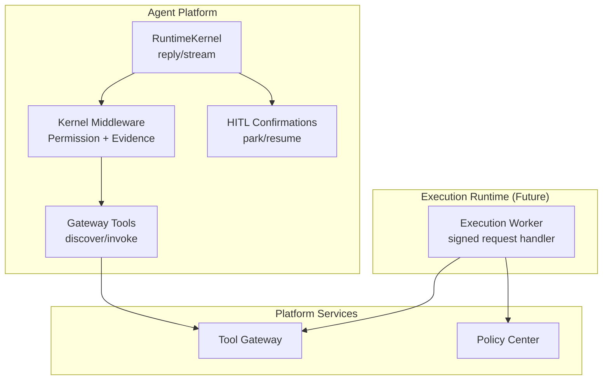
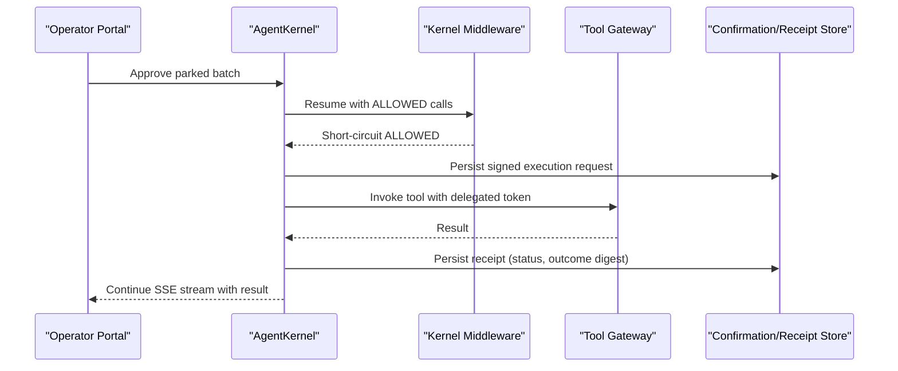
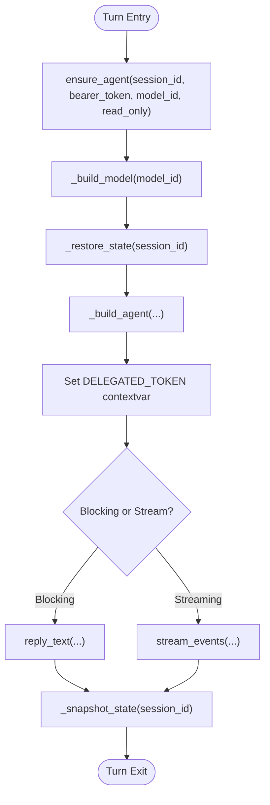
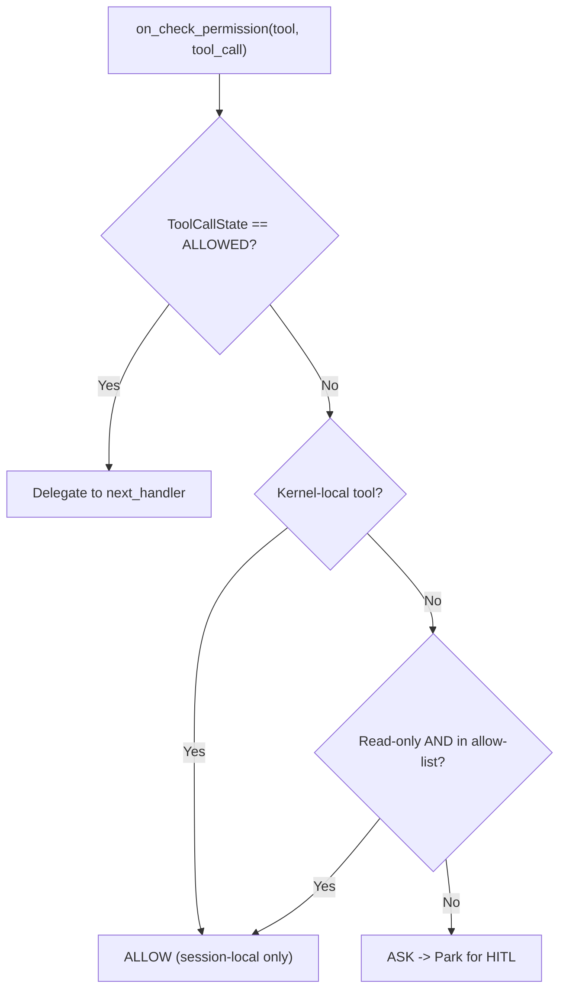
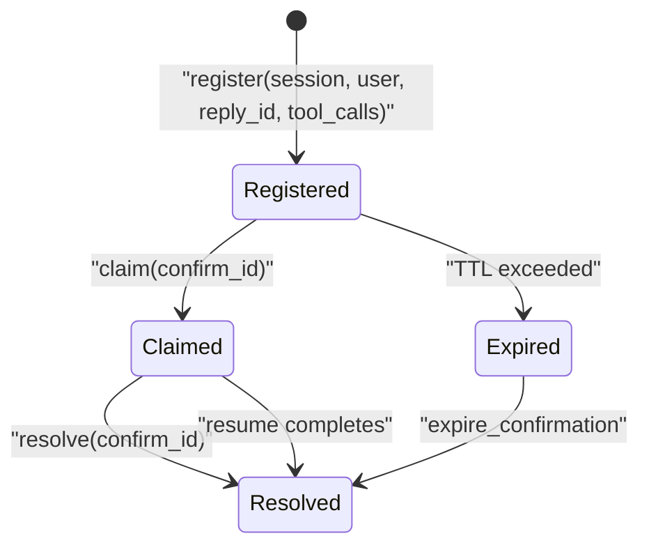
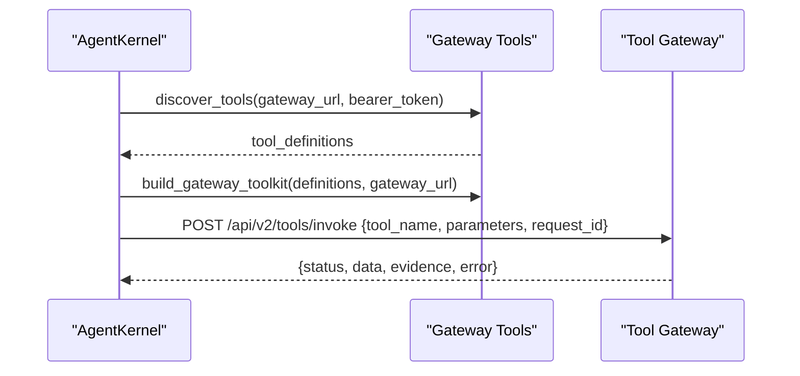
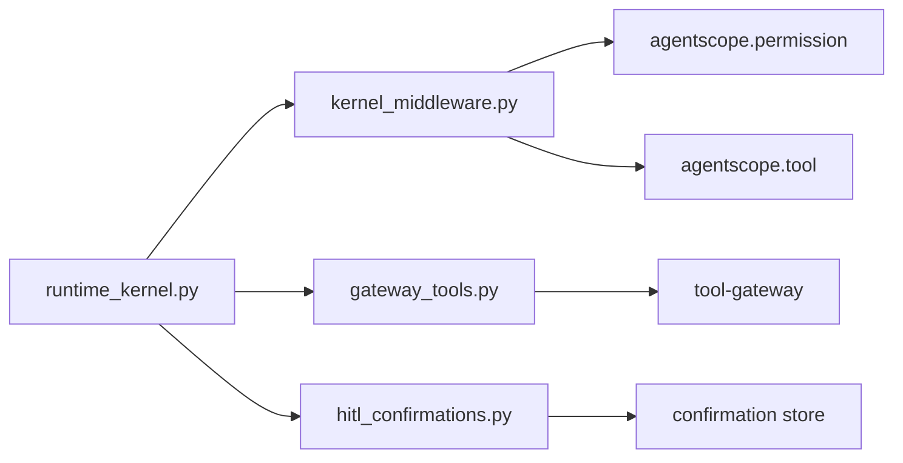

# Execution Runtime Spike

<cite>
**Referenced Files in This Document**
- [execution-runtime-spike.md](file://docs/workspace/execution-runtime-spike.md)
- [README.md](file://products/execution-runtime/README.md)
- [runtime_kernel.py](file://products/agent-platform/src/agent_service/runtime_kernel.py)
- [runtime_service.py](file://products/agent-platform/src/agent_service/services/runtime_service.py)
- [kernel_middleware.py](file://products/agent-platform/src/agent_service/services/kernel_middleware.py)
- [gateway_tools.py](file://products/agent-platform/src/agent_service/tools/gateway_tools.py)
- [hitl_confirmations.py](file://products/agent-platform/src/agent_service/services/hitl_confirmations.py)
</cite>

## Table of Contents
1. [Introduction](#introduction)
2. [Project Structure](#project-structure)
3. [Core Components](#core-components)
4. [Architecture Overview](#architecture-overview)
5. [Detailed Component Analysis](#detailed-component-analysis)
6. [Dependency Analysis](#dependency-analysis)
7. [Performance Considerations](#performance-considerations)
8. [Troubleshooting Guide](#troubleshooting-guide)
9. [Conclusion](#conclusion)
10. [Appendices](#appendices)

## Introduction
This document synthesizes the Execution Runtime Spike for the platform’s approval-gated, bounded execution path. It explains how approved actions currently execute in-process within the agent service and proposes a phased plan to introduce isolated execution workers and signed execution requests without rebuilding delivered substrate. The spike validates current behavior against SPEC-020 through SPEC-036 and outlines Phase 1 (signed execution requests and receipts) and Phase 2 (isolated worker service).

## Project Structure
The spike centers on the agent-platform runtime kernel and its middleware/tooling that drive tool invocations through the tool-gateway. A placeholder product boundary exists under products/execution-runtime defining the future isolated worker scope.

**Diagram sources**
- [runtime_kernel.py:562-674](file://products/agent-platform/src/agent_service/runtime_kernel.py#L562-L674)
- [kernel_middleware.py:129-209](file://products/agent-platform/src/agent_service/services/kernel_middleware.py#L129-L209)
- [gateway_tools.py:52-109](file://products/agent-platform/src/agent_service/tools/gateway_tools.py#L52-L109)
- [hitl_confirmations.py:121-255](file://products/agent-platform/src/agent_service/services/hitl_confirmations.py#L121-L255)
- [README.md:1-40](file://products/execution-runtime/README.md#L1-L40)

**Section sources**
- [execution-runtime-spike.md:22-54](file://docs/workspace/execution-runtime-spike.md#L22-L54)
- [README.md:1-40](file://products/execution-runtime/README.md#L1-L40)

## Core Components
- AgentKernel orchestrates model turns, toolkit building, middleware composition, state persistence, and evidence capture. It sets per-turn delegated tokens and caches toolkits per token to support portal token refresh.
- Kernel middleware enforces platform policy at the permission gate (auto-allow read-only tools from a vetted list), parks non-vetted calls via ASK for HITL confirmation, and emits structured evidence frames for streamed turns.
- Gateway tools discover available tools from the tool-gateway and invoke them with the current delegated token; results are returned as ToolChunks carrying metadata for evidence emission.
- HITL confirmations manage parked batches, single-flight claim/resolve semantics, TTL expiry handling, and risk-level mapping to policy actions.

**Section sources**
- [runtime_kernel.py:138-161](file://products/agent-platform/src/agent_service/runtime_kernel.py#L138-L161)
- [runtime_kernel.py:266-329](file://products/agent-platform/src/agent_service/runtime_kernel.py#L266-L329)
- [runtime_kernel.py:388-422](file://products/agent-platform/src/agent_service/runtime_kernel.py#L388-L422)
- [kernel_middleware.py:129-209](file://products/agent-platform/src/agent_service/services/kernel_middleware.py#L129-L209)
- [kernel_middleware.py:212-322](file://products/agent-platform/src/agent_service/services/kernel_middleware.py#L212-L322)
- [gateway_tools.py:52-109](file://products/agent-platform/src/agent_service/tools/gateway_tools.py#L52-L109)
- [gateway_tools.py:127-213](file://products/agent-platform/src/agent_service/tools/gateway_tools.py#L127-L213)
- [hitl_confirmations.py:30-100](file://products/agent-platform/src/agent_service/services/hitl_confirmations.py#L30-L100)
- [hitl_confirmations.py:121-255](file://products/agent-platform/src/agent_service/services/hitl_confirmations.py#L121-L255)

## Architecture Overview
Current execution is in-process: when an operator approves a parked batch, the resumed turn re-traverses the middleware chain with ToolCallState.ALLOWED and executes the tool-gateway call inline under the confirmer’s delegated token. There is no durable “execution request” artifact beyond confirmation records and tool_invoked audit events.

The spike recommends:
- Phase 1: Sign-and-record only. Construct a signed execution request before invoking the tool-gateway; persist a receipt after completion. Add additive schemas and audit events. No new deployment surface.
- Phase 2: Isolated worker. A separate execution-runtime service receives signed requests, verifies signatures, performs the tool-gateway call with forwarded delegation, writes receipts, and returns outcomes. Resume stream awaits completion with bounded timeout.

**Diagram sources**
- [runtime_kernel.py:562-674](file://products/agent-platform/src/agent_service/runtime_kernel.py#L562-L674)
- [kernel_middleware.py:154-169](file://products/agent-platform/src/agent_service/services/kernel_middleware.py#L154-L169)
- [gateway_tools.py:76-109](file://products/agent-platform/src/agent_service/tools/gateway_tools.py#L76-L109)
- [execution-runtime-spike.md:66-95](file://docs/workspace/execution-runtime-spike.md#L66-L95)

## Detailed Component Analysis

### AgentKernel and Toolkit Caching
- Ensures one agent per session, with LRU-bounded cache keyed by session and read-only mode.
- Builds models via catalog entries; supports model switching with state restoration.
- Composes middlewares for permission gating and evidence emission; configures tracing and reply budget controls based on settings.
- Persists agent state snapshots best-effort after turns; captures evidence frames per turn.

**Diagram sources**
- [runtime_kernel.py:599-674](file://products/agent-platform/src/agent_service/runtime_kernel.py#L599-L674)
- [runtime_kernel.py:219-249](file://products/agent-platform/src/agent_service/runtime_kernel.py#L219-L249)
- [runtime_kernel.py:465-507](file://products/agent-platform/src/agent_service/runtime_kernel.py#L465-L507)
- [runtime_kernel.py:730-791](file://products/agent-platform/src/agent_service/runtime_kernel.py#L730-L791)

**Section sources**
- [runtime_kernel.py:138-161](file://products/agent-platform/src/agent_service/runtime_kernel.py#L138-L161)
- [runtime_kernel.py:219-249](file://products/agent-platform/src/agent_service/runtime_kernel.py#L219-L249)
- [runtime_kernel.py:266-329](file://products/agent-platform/src/agent_service/runtime_kernel.py#L266-L329)
- [runtime_kernel.py:388-422](file://products/agent-platform/src/agent_service/runtime_kernel.py#L388-L422)
- [runtime_kernel.py:465-507](file://products/agent-platform/src/agent_service/runtime_kernel.py#L465-L507)
- [runtime_kernel.py:599-674](file://products/agent-platform/src/agent_service/runtime_kernel.py#L599-L674)
- [runtime_kernel.py:730-791](file://products/agent-platform/src/agent_service/runtime_kernel.py#L730-L791)

### Permission Gate and Evidence Emission
- GatewayPermissionMiddleware auto-approves vetted read-only tools and kernel-local task tools; all other tools trigger ASK to park for HITL confirmation.
- On resume, ALLOWED calls traverse middleware but short-circuit to avoid re-parking.
- ToolEvidenceMiddleware emits tool_call and tool_result frames for gateway-backed tools during streaming, bounding data sizes and preserving full payloads when possible.

**Diagram sources**
- [kernel_middleware.py:129-209](file://products/agent-platform/src/agent_service/services/kernel_middleware.py#L129-L209)

**Section sources**
- [kernel_middleware.py:129-209](file://products/agent-platform/src/agent_service/services/kernel_middleware.py#L129-L209)
- [kernel_middleware.py:212-322](file://products/agent-platform/src/agent_service/services/kernel_middleware.py#L212-L322)

### HITL Confirmation Registry
- In-memory registry per process manages parked batches with single-flight claim/resolve, TTL expiry, and highest-action derivation for policy routing.
- claim() prevents double-resume; resolve() clears entry after decision; take_for_expiry() ensures cleanup without interrupting in-flight resumes.

**Diagram sources**
- [hitl_confirmations.py:121-255](file://products/agent-platform/src/agent_service/services/hitl_confirmations.py#L121-L255)

**Section sources**
- [hitl_confirmations.py:30-100](file://products/agent-platform/src/agent_service/services/hitl_confirmations.py#L30-L100)
- [hitl_confirmations.py:121-255](file://products/agent-platform/src/agent_service/services/hitl_confirmations.py#L121-L255)

### Gateway Tools Invocation
- Discovers tools from tool-gateway using delegated token; builds FunctionTools with normalized schemas and risk levels.
- Invokes tool-gateway POST /api/v2/tools/invoke with request-scoped delegated token; returns ToolChunk with metadata for evidence emission.

**Diagram sources**
- [gateway_tools.py:52-109](file://products/agent-platform/src/agent_service/tools/gateway_tools.py#L52-L109)
- [gateway_tools.py:127-213](file://products/agent-platform/src/agent_service/tools/gateway_tools.py#L127-L213)

**Section sources**
- [gateway_tools.py:52-109](file://products/agent-platform/src/agent_service/tools/gateway_tools.py#L52-L109)
- [gateway_tools.py:127-213](file://products/agent-platform/src/agent_service/tools/gateway_tools.py#L127-L213)

### Execution Runtime Placeholder Boundary
- Defines purpose, ownership, scope, integration points, and strict boundary: does not decide allowance and must never bypass policy or approval controls.

**Section sources**
- [README.md:1-40](file://products/execution-runtime/README.md#L1-L40)

## Dependency Analysis
- AgentKernel depends on RuntimeSettings, provider registry, model catalog, and services for sessions, evidence, and confirmations.
- Kernel middleware depends on agentscope permission and tool abstractions; evidence emission relies on request-scoped sink set by streaming paths.
- Gateway tools depend on HTTP client to tool-gateway; identity flows via DELEGATED_TOKEN contextvar.
- HITL confirmations provide single-flight guarantees and risk-to-action mapping used by the confirmation bridge.

**Diagram sources**
- [runtime_kernel.py:138-161](file://products/agent-platform/src/agent_service/runtime_kernel.py#L138-L161)
- [kernel_middleware.py:129-209](file://products/agent-platform/src/agent_service/services/kernel_middleware.py#L129-L209)
- [gateway_tools.py:52-109](file://products/agent-platform/src/agent_service/tools/gateway_tools.py#L52-L109)
- [hitl_confirmations.py:121-255](file://products/agent-platform/src/agent_service/services/hitl_confirmations.py#L121-L255)

**Section sources**
- [runtime_kernel.py:138-161](file://products/agent-platform/src/agent_service/runtime_kernel.py#L138-L161)
- [kernel_middleware.py:129-209](file://products/agent-platform/src/agent_service/services/kernel_middleware.py#L129-L209)
- [gateway_tools.py:52-109](file://products/agent-platform/src/agent_service/tools/gateway_tools.py#L52-L109)
- [hitl_confirmations.py:121-255](file://products/agent-platform/src/agent_service/services/hitl_confirmations.py#L121-L255)

## Performance Considerations
- Toolkit caching per delegated token avoids repeated discovery and reduces latency across token refresh cycles.
- Evidence frames bound payload sizes to prevent large traces; full payloads omitted when exceeding thresholds.
- Streaming vs blocking paths differ in evidence emission; blocking turns do not emit trace frames.
- Model switching triggers agent rebuilds with restored state; ensure minimal churn by stable model selection per session.

[No sources needed since this section provides general guidance]

## Troubleshooting Guide
- If mutating tools appear in auto-allow list, they will still park for HITL due to read-only construction; check configuration logs for warnings about excluded mutating tools.
- If tool discovery fails, toolkit falls back to task tools only; verify tool-gateway reachability and delegated token presence.
- For stalled parked confirmations, ensure claim/resolve paths complete; expired entries require explicit closure to avoid wedging the agent.
- Evidence write failures degrade observability but do not block turns; monitor metrics for evidence write errors.

**Section sources**
- [gateway_tools.py:232-257](file://products/agent-platform/src/agent_service/tools/gateway_tools.py#L232-L257)
- [runtime_kernel.py:331-354](file://products/agent-platform/src/agent_service/runtime_kernel.py#L331-L354)
- [hitl_confirmations.py:157-219](file://products/agent-platform/src/agent_service/services/hitl_confirmations.py#L157-L219)
- [runtime_kernel.py:527-560](file://products/agent-platform/src/agent_service/runtime_kernel.py#L527-L560)

## Conclusion
The spike confirms that approval decisions are durable and attributed, while execution remains coupled to the agent reply stream. Phase 1 introduces signed execution requests and receipts to bind approvals to executed arguments audibly and tamper-evidently, with zero new deployment surface. Phase 2 targets process isolation via an execution-runtime worker, preserving the operator’s real-time experience through bounded await semantics. Promotion to a SPEC-037 draft is recommended upon operator sign-off for Phase 1 scope.

[No sources needed since this section summarizes without analyzing specific files]

## Appendices
- Open questions for spec: internal API trust posture, resume-stream timeout strategy, and receipt exposure boundaries.
- Audit correlation: execution request/receipt pair can link confirmation_decided → execution → tool_invoked without new audit dimensions.

**Section sources**
- [execution-runtime-spike.md:114-131](file://docs/workspace/execution-runtime-spike.md#L114-L131)