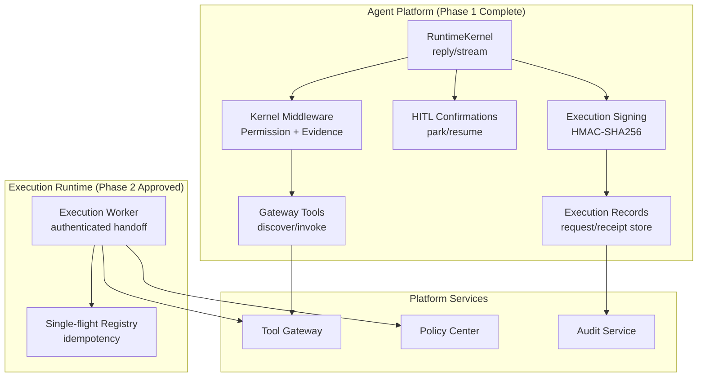
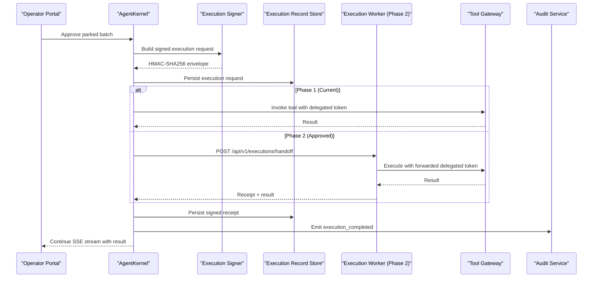
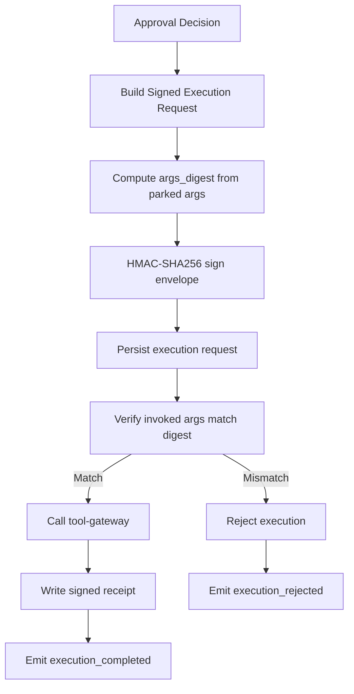
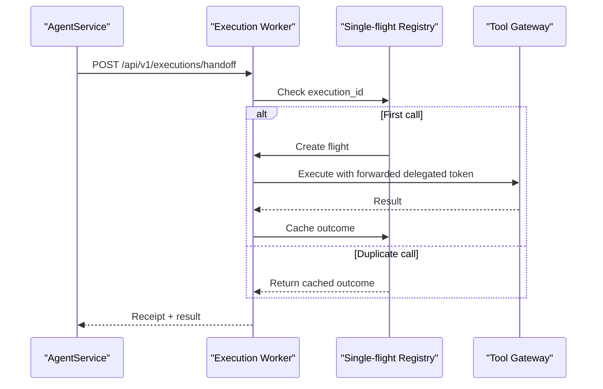
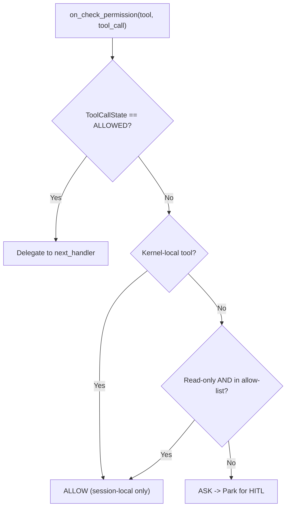
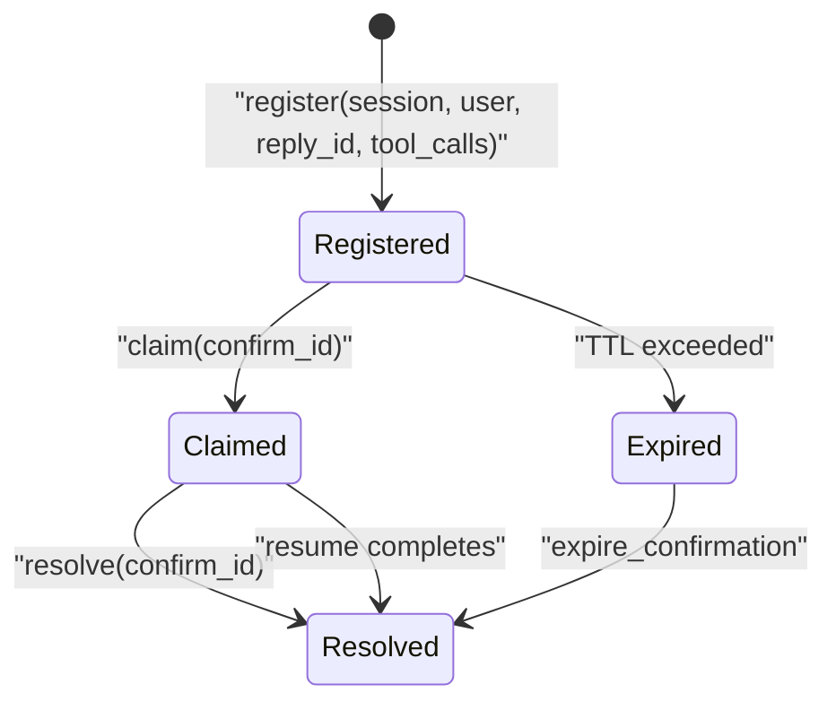
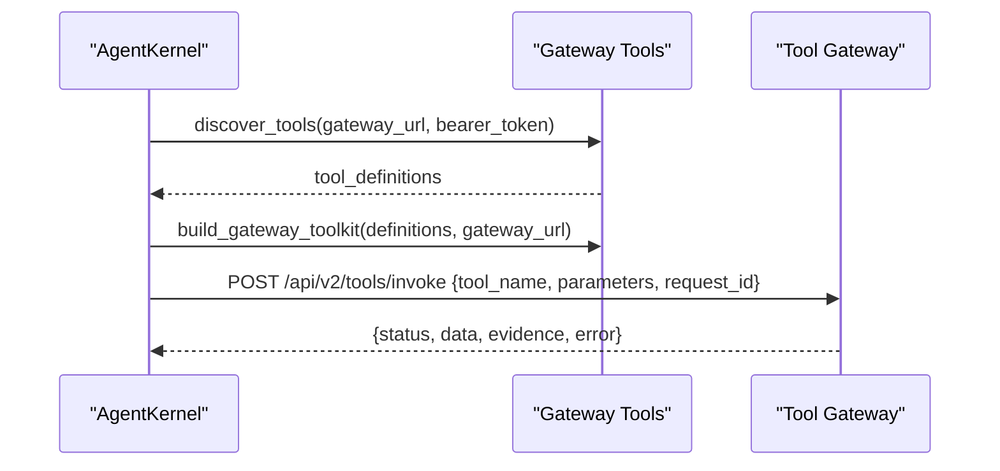
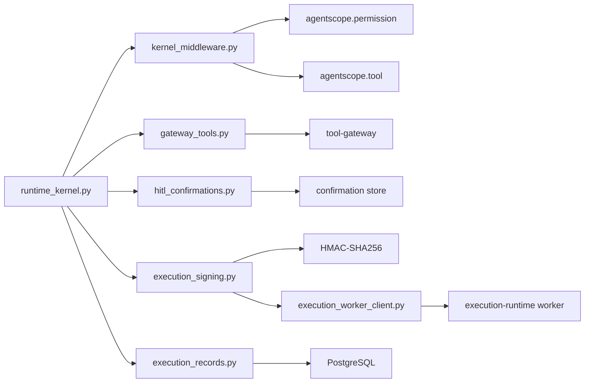

# Execution Runtime Spike

<cite>
**Referenced Files in This Document**
- [execution-runtime-spike.md](file://docs/workspace/execution-runtime-spike.md)
- [plan.md](file://docs/specs/SPEC-037-signed-execution-requests/plan.md)
- [spec.md](file://docs/specs/SPEC-037-signed-execution-requests/spec.md)
- [tasks.md](file://docs/specs/SPEC-037-signed-execution-requests/tasks.md)
- [README.md](file://products/execution-runtime/README.md)
- [runtime_kernel.py](file://products/agent-platform/src/agent_service/runtime_kernel.py)
- [runtime_service.py](file://products/agent-platform/src/agent_service/services/runtime_service.py)
- [kernel_middleware.py](file://products/agent-platform/src/agent_service/services/kernel_middleware.py)
- [gateway_tools.py](file://products/agent-platform/src/agent_service/tools/gateway_tools.py)
- [hitl_confirmations.py](file://products/agent-platform/src/agent_service/services/hitl_confirmations.py)
- [execution_signing.py](file://products/agent-platform/src/agent_service/services/execution_signing.py)
- [execution_records.py](file://products/agent-platform/src/agent_service/services/execution_records.py)
- [execution-request.schema.json](file://shared/shared-contracts/schemas/execution-request.schema.json)
- [execution-receipt.schema.json](file://shared/shared-contracts/schemas/execution-receipt.schema.json)
</cite>

## Update Summary
**Changes Made**
- Updated Introduction to reflect Phase 1 delivery status in v0.19.0 and Phase 2 promotion to SPEC-038 (approved)
- Revised Architecture Overview to show completed signed execution request flow with receipt persistence and Phase 2 isolated worker handoff
- Enhanced Signed Execution Request Implementation section with actual HMAC-SHA256 signing, verification, and audit emission details
- Added new Isolated Execution Worker section documenting Phase 2 approved spec with authenticated handoff and process isolation
- Updated Conclusion to reflect delivered Phase 1 scope and approved Phase 2 development path
- Enhanced diagrams to show complete signed execution workflow including signature generation, verification, and Phase 2 worker handoff

## Table of Contents
1. [Introduction](#introduction)
2. [Project Structure](#project-structure)
3. [Core Components](#core-components)
4. [Architecture Overview](#architecture-overview)
5. [Signed Execution Request Implementation](#signed-execution-request-implementation)
6. [Isolated Execution Worker](#isolated-execution-worker)
7. [Detailed Component Analysis](#detailed-component-analysis)
8. [Dependency Analysis](#dependency-analysis)
9. [Performance Considerations](#performance-considerations)
10. [Troubleshooting Guide](#troubleshooting-guide)
11. [Conclusion](#conclusion)
12. [Appendices](#appendices)

## Introduction
This document synthesizes the Execution Runtime Spike for the platform's approval-gated, bounded execution path. **Phase 1 of signed execution requests has been delivered in v0.19.0**, transforming the spike from planning to production with actual signed request generation, receipt persistence, and audit event emission. Phase 2 (isolated worker service) has been promoted to SPEC-038 and approved, resolving open questions about worker service identity and resume-stream timeout configuration.

The implementation delivers HMAC-SHA256 signed execution envelopes bound to parked arguments, invocation-time digest verification, durable request/receipt records, and execution audit events — all within the existing agent-service deployment without introducing new services. Phase 2 will provide process isolation while preserving the operator's real-time experience through an authenticated internal handoff API.

## Project Structure
The spike centers on the agent-platform runtime kernel and its middleware/tooling that drive tool invocations through the tool-gateway. Phase 1 implementation adds execution signing capabilities directly into the agent-service, with Phase 2 establishing a separate `execution-runtime` product for process isolation.

**Diagram sources**
- [runtime_kernel.py:562-674](file://products/agent-platform/src/agent_service/runtime_kernel.py#L562-L674)
- [kernel_middleware.py:129-209](file://products/agent-platform/src/agent_service/services/kernel_middleware.py#L129-L209)
- [gateway_tools.py:52-109](file://products/agent-platform/src/agent_service/tools/gateway_tools.py#L52-L109)
- [hitl_confirmations.py:121-255](file://products/agent-platform/src/agent_service/services/hitl_confirmations.py#L121-L255)
- [execution_signing.py:1-123](file://products/agent-platform/src/agent_service/services/execution_signing.py#L1-L123)
- [execution_records.py:1-494](file://products/agent-platform/src/agent_service/services/execution_records.py#L1-L494)
- [plan.md:1-140](file://docs/specs/SPEC-037-signed-execution-requests/plan.md#L1-L140)

**Section sources**
- [execution-runtime-spike.md:22-54](file://docs/workspace/execution-runtime-spike.md#L22-L54)
- [README.md:1-40](file://products/execution-runtime/README.md#L1-L40)
- [plan.md:1-140](file://docs/specs/SPEC-037-signed-execution-requests/plan.md#L1-L140)

## Core Components
- AgentKernel orchestrates model turns, toolkit building, middleware composition, state persistence, and evidence capture. It sets per-turn delegated tokens and caches toolkits per token to support portal token refresh.
- Kernel middleware enforces platform policy at the permission gate (auto-allow read-only tools from a vetted list), parks non-vetted calls via ASK for HITL confirmation, and emits structured evidence frames for streamed turns.
- Gateway tools discover available tools from the tool-gateway and invoke them with the current delegated token; results are returned as ToolChunks carrying metadata for evidence emission.
- HITL confirmations manage parked batches, single-flight claim/resolve semantics, TTL expiry handling, and risk-level mapping to policy actions.
- **Execution signing** provides HMAC-SHA256 signing of execution envelopes with canonical JSON serialization, argument digest computation, and tamper-evident binding between approved arguments and executed calls.
- **Execution records** persist signed requests and receipts with best-effort durability, supporting startup sweep retention and session-detail exposure.
- **Phase 2 isolated worker** provides process isolation through an authenticated handoff API with single-flight idempotency and independent resource boundaries.

**Section sources**
- [runtime_kernel.py:138-161](file://products/agent-platform/src/agent_service/runtime_kernel.py#L138-L161)
- [runtime_kernel.py:266-329](file://products/agent-platform/src/agent_service/runtime_kernel.py#L266-L329)
- [runtime_kernel.py:388-422](file://products/agent-platform/src/agent_service/runtime_kernel.py#L388-L422)
- [kernel_middleware.py:129-209](file://products/agent-platform/src/agent_service/services/kernel_middleware.py#L129-L209)
- [kernel_middleware.py:212-322](file://products/agent-platform/src/agent_service/services/kernel_middleware.py#L212-L322)
- [gateway_tools.py:52-109](file://products/agent-platform/src/agent_service/tools/gateway_tools.py#L52-L109)
- [gateway_tools.py:127-213](file://products/agent-platform/src/agent_service/tools/gateway_tools.py#L127-L213)
- [hitl_confirmations.py:30-100](file://products/agent-platform/src/agent_service/services/hitl_confirmations.py#L30-L100)
- [hitl_confirmations.py:121-255](file://products/agent-platform/src/agent_service/services/hitl_confirmations.py#L121-L255)
- [execution_signing.py:1-123](file://products/agent-platform/src/agent_service/services/execution_signing.py#L1-L123)
- [execution_records.py:1-494](file://products/agent-platform/src/agent_service/services/execution_records.py#L1-L494)
- [spec.md:50-140](file://docs/specs/SPEC-037-signed-execution-requests/spec.md#L50-L140)

## Architecture Overview
Phase 1 implementation completes the signed execution request flow: when an operator approves a parked batch, the resumed turn constructs HMAC-SHA256 signed execution requests before invoking tools, persists these requests durably, verifies argument digests at invocation time, and writes signed receipts after tool completion. Audit events correlate the complete chain from confirmation decision through execution completion.

Phase 2 introduces an isolated worker service that receives signed execution requests over an authenticated internal handoff API, providing process isolation while maintaining the same operator experience through blocking handoff with bounded timeout.

**Diagram sources**
- [runtime_kernel.py:562-674](file://products/agent-platform/src/agent_service/runtime_kernel.py#L562-L674)
- [kernel_middleware.py:154-169](file://products/agent-platform/src/agent_service/services/kernel_middleware.py#L154-L169)
- [gateway_tools.py:76-109](file://products/agent-platform/src/agent_service/tools/gateway_tools.py#L76-L109)
- [execution_signing.py:69-97](file://products/agent-platform/src/agent_service/services/execution_signing.py#L69-L97)
- [execution_records.py:355-376](file://products/agent-platform/src/agent_service/services/execution_records.py#L355-L376)
- [spec.md:69-140](file://docs/specs/SPEC-037-signed-execution-requests/spec.md#L69-L140)

## Signed Execution Request Implementation
Phase 1 delivers a complete signed execution request system that binds approvals to executed arguments through cryptographic signatures. The implementation follows the SPEC-037 requirements with additive contracts and zero new deployment surface.

### HMAC-SHA256 Signing Envelope
The execution signer creates tamper-evident envelopes using HMAC-SHA256 over canonical JSON serialization. Each envelope contains the tool name, SHA-256 digest of parked arguments, confirmation ID, decider user ID, session ID, and timestamp. The signature is computed excluding itself from the canonical form, ensuring deterministic output regardless of key ordering or whitespace variations.

### Argument Digest Verification
At the gateway invocation boundary, mutating tool calls verify their argument digests against the signed envelope before proceeding. The invoked arguments' digest is recomputed and compared with the signed envelope — any mismatch audits `execution_rejected` with reason `args_digest_mismatch` and blocks the invocation. Read-only tools skip this check entirely, maintaining backward compatibility.

### Durable Execution Records
Execution requests and receipts are persisted using the same Postgres posture as confirmation records, with memory backend support for tests. Requests are written at resume time (best-effort durable), and receipts are written after tool completion with status mapping (`succeeded` / `failed` / `timeout`). A startup sweep maintains retention using TTL-scoped cleanup, preventing unbounded growth.

### Audit Event Emission
Three additive audit event types extend the existing audit schema: `execution_requested` (envelope metadata), `execution_completed` (status, duration, request correlation), and `execution_rejected` (reason). Events are emitted through the canonical fire-and-forget emitter with `confirm_id` and forwarded `x-request-id`, correlating the complete chain from `confirmation_decided` → `execution_requested` → `tool_invoked` → `execution_completed`.

**Diagram sources**
- [spec.md:69-140](file://docs/specs/SPEC-037-signed-execution-requests/spec.md#L69-L140)
- [plan.md:21-81](file://docs/specs/SPEC-037-signed-execution-requests/plan.md#L21-L81)

**Section sources**
- [spec.md:50-140](file://docs/specs/SPEC-037-signed-execution-requests/spec.md#L50-L140)
- [plan.md:10-81](file://docs/specs/SPEC-037-signed-execution-requests/plan.md#L10-L81)
- [tasks.md:5-33](file://docs/specs/SPEC-037-signed-execution-requests/tasks.md#L5-L33)
- [execution_signing.py:53-66](file://products/agent-platform/src/agent_service/services/execution_signing.py#L53-L66)
- [execution_records.py:355-420](file://products/agent-platform/src/agent_service/services/execution_records.py#L355-L420)

## Isolated Execution Worker
Phase 2 (SPEC-038) promotes the isolated worker concept to an approved specification, providing process isolation while inheriting the SPEC-037 signed execution contract verbatim.

### Authenticated Handoff API
The worker exposes a single internal endpoint accepting the signed execution request envelope, parked arguments, and confirmer's delegated token. Authentication uses a dedicated static handoff credential (SPEC-008 R-3 posture) provisioned by the deploy chain, rejecting unauthenticated cluster-local trust.

### Process Isolation and Idempotency
The worker executes each `execution_id` at most once through an in-process single-flight registry keyed by execution ID. Concurrent duplicates join onto the same future, and completed executions cache their outcomes for replay without re-execution. The deployment runs a single replica, keeping the in-process registry authoritative.

### Blocking Handoff with Bounded Timeout
Agent-service hands off approved mutating invocations to the worker instead of calling the tool-gateway inline. The resumed stream blocks on the worker response with a dedicated `AGENT_EXECUTION_WORKER_TIMEOUT_SECONDS` knob (default 60s), so operators still watch results arrive in the same turn. Read-only tools remain untouched and execute in-process.

### Infrastructure-Level Isolation
The worker ships as its own dev-k8s deployment behind ClusterIP only, with no HTTPRoute, platform-gateway route, or portal surface references. Its only inbound path is the authenticated handoff from agent-service, enforcing isolation at the infrastructure layer.

**Diagram sources**
- [spec.md:79-118](file://docs/specs/SPEC-038-isolated-execution-worker/spec.md#L79-L118)
- [plan.md:39-66](file://docs/specs/SPEC-038-isolated-execution-worker/plan.md#L39-L66)

**Section sources**
- [spec.md:79-118](file://docs/specs/SPEC-038-isolated-execution-worker/spec.md#L79-L118)
- [plan.md:39-66](file://docs/specs/SPEC-038-isolated-execution-worker/plan.md#L39-L66)
- [spec.md:149-185](file://docs/specs/SPEC-038-isolated-execution-worker/spec.md#L149-L185)
- [plan.md:95-122](file://docs/specs/SPEC-038-isolated-execution-worker/plan.md#L95-L122)

## Detailed Component Analysis

### AgentKernel and Toolkit Caching
- Ensures one agent per session, with LRU-bounded cache keyed by session and read-only mode.
- Builds models via catalog entries; supports model switching with state restoration.
- Composes middlewares for permission gating and evidence emission; configures tracing and reply budget controls based on settings.
- Persists agent state snapshots best-effort after turns; captures evidence frames per turn.

**Diagram sources**
- [runtime_kernel.py:599-674](file://products/agent-platform/src/agent_service/runtime_kernel.py#L599-L674)
- [runtime_kernel.py:219-249](file://products/agent-platform/src/agent_service/runtime_kernel.py#L219-L249)
- [runtime_kernel.py:465-507](file://products/agent-platform/src/agent_service/runtime_kernel.py#L465-L507)
- [runtime_kernel.py:730-791](file://products/agent-platform/src/agent_service/runtime_kernel.py#L730-L791)

**Section sources**
- [runtime_kernel.py:138-161](file://products/agent-platform/src/agent_service/runtime_kernel.py#L138-L161)
- [runtime_kernel.py:219-249](file://products/agent-platform/src/agent_service/runtime_kernel.py#L219-L249)
- [runtime_kernel.py:266-329](file://products/agent-platform/src/agent_service/runtime_kernel.py#L266-L329)
- [runtime_kernel.py:388-422](file://products/agent-platform/src/agent_service/runtime_kernel.py#L388-L422)
- [runtime_kernel.py:465-507](file://products/agent-platform/src/agent_service/runtime_kernel.py#L465-L507)
- [runtime_kernel.py:599-674](file://products/agent-platform/src/agent_service/runtime_kernel.py#L599-L674)
- [runtime_kernel.py:730-791](file://products/agent-platform/src/agent_service/runtime_kernel.py#L730-L791)

### Permission Gate and Evidence Emission
- GatewayPermissionMiddleware auto-approves vetted read-only tools and kernel-local task tools; all other tools trigger ASK to park for HITL confirmation.
- On resume, ALLOWED calls traverse middleware but short-circuit to avoid re-parking.
- ToolEvidenceMiddleware emits tool_call and tool_result frames for gateway-backed tools during streaming, bounding data sizes and preserving full payloads when possible.

**Diagram sources**
- [kernel_middleware.py:129-209](file://products/agent-platform/src/agent_service/services/kernel_middleware.py#L129-L209)

**Section sources**
- [kernel_middleware.py:129-209](file://products/agent-platform/src/agent_service/services/kernel_middleware.py#L129-L209)
- [kernel_middleware.py:212-322](file://products/agent-platform/src/agent_service/services/kernel_middleware.py#L212-L322)

### HITL Confirmation Registry
- In-memory registry per process manages parked batches with single-flight claim/resolve, TTL expiry, and highest-action derivation for policy routing.
- claim() prevents double-resume; resolve() clears entry after decision; take_for_expiry() ensures cleanup without interrupting in-flight resumes.

**Diagram sources**
- [hitl_confirmations.py:121-255](file://products/agent-platform/src/agent_service/services/hitl_confirmations.py#L121-L255)

**Section sources**
- [hitl_confirmations.py:30-100](file://products/agent-platform/src/agent_service/services/hitl_confirmations.py#L30-L100)
- [hitl_confirmations.py:121-255](file://products/agent-platform/src/agent_service/services/hitl_confirmations.py#L121-L255)

### Gateway Tools Invocation
- Discovers tools from tool-gateway using delegated token; builds FunctionTools with normalized schemas and risk levels.
- Invokes tool-gateway POST /api/v2/tools/invoke with request-scoped delegated token; returns ToolChunk with metadata for evidence emission.

**Diagram sources**
- [gateway_tools.py:52-109](file://products/agent-platform/src/agent_service/tools/gateway_tools.py#L52-L109)
- [gateway_tools.py:127-213](file://products/agent-platform/src/agent_service/tools/gateway_tools.py#L127-L213)

**Section sources**
- [gateway_tools.py:52-109](file://products/agent-platform/src/agent_service/tools/gateway_tools.py#L52-L109)
- [gateway_tools.py:127-213](file://products/agent-platform/src/agent_service/tools/gateway_tools.py#L127-L213)

### Execution Runtime Placeholder Boundary
- Defines purpose, ownership, scope, integration points, and strict boundary: does not decide allowance and must never bypass policy or approval controls.

**Section sources**
- [README.md:1-40](file://products/execution-runtime/README.md#L1-L40)

## Dependency Analysis
- AgentKernel depends on RuntimeSettings, provider registry, model catalog, and services for sessions, evidence, and confirmations.
- Kernel middleware depends on agentscope permission and tool abstractions; evidence emission relies on request-scoped sink set by streaming paths.
- Gateway tools depend on HTTP client to tool-gateway; identity flows via DELEGATED_TOKEN contextvar.
- HITL confirmations provide single-flight guarantees and risk-to-action mapping used by the confirmation bridge.
- **Execution signing depends on HMAC-SHA256 cryptography, canonical JSON serialization, and configuration-driven signing keys.**
- **Execution records depend on the same Postgres infrastructure as confirmation records, with memory backend support for testing.**
- **Phase 2 worker depends on authenticated handoff credentials, single-flight registry, and inherits SPEC-037 envelope contract verbatim.**

**Diagram sources**
- [runtime_kernel.py:138-161](file://products/agent-platform/src/agent_service/runtime_kernel.py#L138-L161)
- [kernel_middleware.py:129-209](file://products/agent-platform/src/agent_service/services/kernel_middleware.py#L129-L209)
- [gateway_tools.py:52-109](file://products/agent-platform/src/agent_service/tools/gateway_tools.py#L52-L109)
- [hitl_confirmations.py:121-255](file://products/agent-platform/src/agent_service/services/hitl_confirmations.py#L121-L255)
- [execution_signing.py:1-123](file://products/agent-platform/src/agent_service/services/execution_signing.py#L1-L123)
- [execution_records.py:1-494](file://products/agent-platform/src/agent_service/services/execution_records.py#L1-L494)
- [spec.md:50-140](file://docs/specs/SPEC-037-signed-execution-requests/spec.md#L50-L140)

**Section sources**
- [runtime_kernel.py:138-161](file://products/agent-platform/src/agent_service/runtime_kernel.py#L138-L161)
- [kernel_middleware.py:129-209](file://products/agent-platform/src/agent_service/services/kernel_middleware.py#L129-L209)
- [gateway_tools.py:52-109](file://products/agent-platform/src/agent_service/tools/gateway_tools.py#L52-L109)
- [hitl_confirmations.py:121-255](file://products/agent-platform/src/agent_service/services/hitl_confirmations.py#L121-L255)
- [execution_signing.py:1-123](file://products/agent-platform/src/agent_service/services/execution_signing.py#L1-L123)
- [execution_records.py:1-494](file://products/agent-platform/src/agent_service/services/execution_records.py#L1-L494)
- [spec.md:50-140](file://docs/specs/SPEC-037-signed-execution-requests/spec.md#L50-L140)

## Performance Considerations
- Toolkit caching per delegated token avoids repeated discovery and reduces latency across token refresh cycles.
- Evidence frames bound payload sizes to prevent large traces; full payloads omitted when exceeding thresholds.
- Streaming vs blocking paths differ in evidence emission; blocking turns do not emit trace frames.
- Model switching triggers agent rebuilds with restored state; ensure minimal churn by stable model selection per session.
- **HMAC-SHA256 signing adds minimal overhead — canonical JSON serialization and cryptographic hashing are lightweight operations that occur once per approved call.**
- **Argument digest verification is O(n) where n is the size of the arguments object, performed only for mutating calls with valid execution requests.**
- **Best-effort record persistence ensures storage failures degrade gracefully without blocking the chat stream.**
- **Phase 2 worker handoff adds network latency but provides process isolation; default 60s timeout balances responsiveness with reliability.**

## Troubleshooting Guide
- If mutating tools appear in auto-allow list, they will still park for HITL due to read-only construction; check configuration logs for warnings about excluded mutating tools.
- If tool discovery fails, toolkit falls back to task tools only; verify tool-gateway reachability and delegated token presence.
- For stalled parked confirmations, ensure claim/resolve paths complete; expired entries require explicit closure to avoid wedging the agent.
- Evidence write failures degrade observability but do not block turns; monitor metrics for evidence write errors.
- **If execution signing fails, verify the AGENT_EXECUTION_SIGNING_KEY environment variable is properly provisioned; missing keys cause fail-closed rejection of mutating executions.**
- **For argument digest mismatches, check that the parked arguments exactly match the invoked arguments; any drift indicates potential tampering or logic errors.**
- **If execution records fail to persist, monitor audit completeness metrics; the system continues operating but with reduced audit trail coverage.**
- **Phase 2 troubleshooting**: Verify worker URL and handoff token configuration; check worker health endpoint; monitor single-flight registry for stuck executions; use recovery queries correlating `confirm_id` against `tool_invoked` events for crash scenarios.

**Section sources**
- [gateway_tools.py:232-257](file://products/agent-platform/src/agent_service/tools/gateway_tools.py#L232-L257)
- [runtime_kernel.py:331-354](file://products/agent-platform/src/agent_service/runtime_kernel.py#L331-L354)
- [hitl_confirmations.py:157-219](file://products/agent-platform/src/agent_service/services/hitl_confirmations.py#L157-L219)
- [runtime_kernel.py:527-560](file://products/agent-platform/src/agent_service/runtime_kernel.py#L527-L560)
- [execution_signing.py:28-32](file://products/agent-platform/src/agent_service/services/execution_signing.py#L28-L32)
- [execution_records.py:355-420](file://products/agent-platform/src/agent_service/services/execution_records.py#L355-L420)
- [spec.md:69-140](file://docs/specs/SPEC-037-signed-execution-requests/spec.md#L69-L140)

## Conclusion
Phase 1 of signed execution requests has been successfully delivered in v0.19.0, providing the core R4 deliverable of tamper-evident execution binding without introducing new deployment surface. The implementation provides HMAC-SHA256 signed execution envelopes bound to parked arguments, invocation-time digest verification, durable request/receipt records, and correlated audit events — all within the existing agent-service architecture.

Phase 2 (SPEC-038) has been promoted to approved status, establishing the path toward complete process isolation through an authenticated internal handoff API. The worker service will inherit the SPEC-037 envelope contract verbatim while providing independent resource boundaries, single-flight idempotency, and infrastructure-level isolation enforcement.

The completed phases establish a proven foundation for secure, auditable execution that scales from in-process execution to fully isolated workers while maintaining the operator's real-time experience throughout the transition.

## Appendices
- Open questions for spec: All resolved — worker service identity (Q-1) addressed by SPEC-038 R-2 with dedicated static handoff credential, resume-stream timeout (Q-2) addressed by SPEC-038 R-4 with dedicated `AGENT_EXECUTION_WORKER_TIMEOUT_SECONDS` knob, and receipt exposure (Q-3) resolved by SPEC-037 R-6 staying owner-visible on session surface.
- Audit correlation: execution request/receipt pair can link confirmation_decided → execution → tool_invoked without new audit dimensions.
- **Phase 1 completion signals**: All acceptance criteria from SPEC-037 spec.md verified, including schema validation, signing round-trips, invocation verification, record persistence, audit emission, and portal badge rendering — delivered in v0.19.0.
- **Phase 2 approved scope**: Isolated worker service with authenticated handoff, single-flight idempotency, and infrastructure-level isolation — ready for implementation following the approved spec.
- **Next steps**: Phase 2 implementation following SPEC-038 approved spec, operator training on receipt interpretation, monitoring setup for execution audit trails, and gradual rollout from in-process to isolated execution.

**Section sources**
- [execution-runtime-spike.md:114-131](file://docs/workspace/execution-runtime-spike.md#L114-L131)
- [spec.md:194-206](file://docs/specs/SPEC-037-signed-execution-requests/spec.md#L194-L206)
- [tasks.md:45-53](file://docs/specs/SPEC-037-signed-execution-requests/tasks.md#L45-L53)
- [spec.md:285-292](file://docs/specs/SPEC-038-isolated-execution-worker/spec.md#L285-L292)
- [execution-runtime-spike.md:143-151](file://docs/workspace/execution-runtime-spike.md#L143-L151)