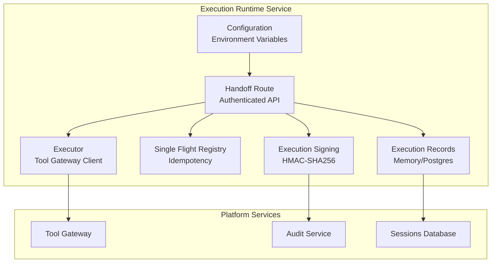
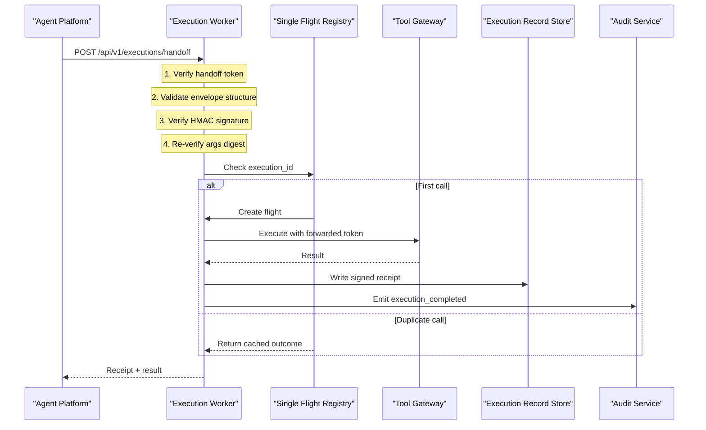

# Execution Runtime Spike

<cite>
**Referenced Files in This Document**
- [execution-runtime-spike.md](file://docs/workspace/execution-runtime-spike.md)
- [plan.md](file://docs/specs/SPEC-037-signed-execution-requests/plan.md)
- [spec.md](file://docs/specs/SPEC-037-signed-execution-requests/spec.md)
- [tasks.md](file://docs/specs/SPEC-037-signed-execution-requests/tasks.md)
- [README.md](file://products/execution-runtime/README.md)
- [handoff.py](file://products/execution-runtime/src/execution_runtime/api/routes/handoff.py)
- [executor.py](file://products/execution-runtime/src/execution_runtime/services/executor.py)
- [single_flight.py](file://products/execution-runtime/src/execution_runtime/services/single_flight.py)
- [execution_signing.py](file://products/execution-runtime/src/execution_runtime/services/execution_signing.py)
- [execution_records.py](file://products/execution-runtime/src/execution_runtime/services/execution_records.py)
- [config.py](file://products/execution-runtime/src/execution_runtime/core/config.py)
- [test_handoff.py](file://products/execution-runtime/tests/test_handoff.py)
- [test_executor.py](file://products/execution-runtime/tests/test_executor.py)
- [test_single_flight.py](file://products/execution-runtime/tests/test_single_flight.py)
- [test_signing.py](file://products/execution-runtime/tests/test_signing.py)
- [test_execution_records.py](file://products/execution-runtime/tests/test_execution_records.py)
- [test_config.py](file://products/execution-runtime/tests/test_config.py)
</cite>

## Update Summary
**Changes Made**
- Updated Introduction to reflect complete production deployment with 64 tests across 6 test files and comprehensive security measures
- Revised Architecture Overview to show fully implemented isolated execution worker service with authenticated handoff API
- Enhanced Security Measures section documenting fail-closed authentication, signature verification, and argument digest validation
- Added Comprehensive Test Coverage section detailing the 64-test suite covering all critical paths
- Updated Implementation Details with actual production code references from the completed execution-runtime product
- Enhanced Conclusion to reflect full operational deployment status and production readiness

## Table of Contents
1. [Introduction](#introduction)
2. [Project Structure](#project-structure)
3. [Core Components](#core-components)
4. [Architecture Overview](#architecture-overview)
5. [Security Measures](#security-measures)
6. [Comprehensive Test Coverage](#comprehensive-test-coverage)
7. [Implementation Details](#implementation-details)
8. [Configuration Management](#configuration-management)
9. [Performance Considerations](#performance-considerations)
10. [Troubleshooting Guide](#troubleshooting-guide)
11. [Conclusion](#conclusion)
12. [Appendices](#appendices)

## Introduction
The Execution Runtime has evolved from a spike into a complete production service that delivers both Phase 1 (signed execution requests) and Phase 2 (isolated execution worker) as specified in SPEC-037 and SPEC-038. The service now operates as a fully deployed, single-replica Kubernetes pod providing process isolation for approved bounded actions through an authenticated internal handoff API.

The implementation includes comprehensive security measures including HMAC-SHA256 envelope signing, static handoff token authentication, argument digest verification, and fail-closed rejection of unauthorized requests. The service is backed by a robust test suite of 64 tests covering authentication, signing, execution, single-flight idempotency, and record persistence across memory and Postgres backends.

## Project Structure
The execution-runtime product is a complete Python service following the shared base-uv image pattern, with its own deployment in dev-k8s overlays and no direct portal or LLM exposure.

**Diagram sources**
- [handoff.py:66-169](file://products/execution-runtime/src/execution_runtime/api/routes/handoff.py#L66-L169)
- [executor.py:23-100](file://products/execution-runtime/src/execution_runtime/services/executor.py#L23-L100)
- [single_flight.py:42-84](file://products/execution-runtime/src/execution_runtime/services/single_flight.py#L42-L84)
- [execution_signing.py:54-67](file://products/execution-runtime/src/execution_runtime/services/execution_signing.py#L54-L67)
- [execution_records.py:310-332](file://products/execution-runtime/src/execution_runtime/services/execution_records.py#L310-L332)
- [config.py:20-84](file://products/execution-runtime/src/execution_runtime/core/config.py#L20-L84)

**Section sources**
- [README.md:1-68](file://products/execution-runtime/README.md#L1-L68)
- [execution-runtime-spike.md:1-166](file://docs/workspace/execution-runtime-spike.md#L1-L166)

## Core Components
The execution-runtime service consists of six core components working together to provide secure, isolated execution of approved bounded actions:

### Handoff Route
The `/api/v1/executions/handoff` endpoint serves as the service's only execution surface, implementing a multi-layered security model with constant-time authentication, structured body validation, envelope signature verification, and argument digest re-verification before any execution occurs.

### Executor
Handles tool gateway invocations with proper error mapping, timeout handling, and credential forwarding. Maps gateway results to standardized receipt statuses while never logging or persisting delegated tokens.

### Single Flight Registry
Provides in-process idempotency keyed by execution_id, ensuring each signed execution request executes exactly once. Supports concurrent duplicate joining, completion caching, and bounded retention with eviction policies.

### Execution Signing
Implements HMAC-SHA256 envelope signing and verification using canonical JSON serialization. Provides cross-verification compatibility with agent-platform's signing module to prevent drift between signer and verifier implementations.

### Execution Records
Manages durable storage of execution requests and receipts with first-write-wins semantics. Supports both in-memory (development/testing) and Postgres (production) backends with automatic fallback on database unavailability.

### Configuration Management
Loads frozen settings from environment variables with startup validation. Implements fail-closed defaults where missing secrets cause handoffs to be rejected rather than degraded.

**Section sources**
- [handoff.py:1-169](file://products/execution-runtime/src/execution_runtime/api/routes/handoff.py#L1-L169)
- [executor.py:1-131](file://products/execution-runtime/src/execution_runtime/services/executor.py#L1-L131)
- [single_flight.py:1-107](file://products/execution-runtime/src/execution_runtime/services/single_flight.py#L1-L107)
- [execution_signing.py:1-93](file://products/execution-runtime/src/execution_runtime/services/execution_signing.py#L1-L93)
- [execution_records.py:1-345](file://products/execution-runtime/src/execution_runtime/services/execution_records.py#L1-L345)
- [config.py:1-84](file://products/execution-runtime/src/execution_runtime/core/config.py#L1-L84)

## Architecture Overview
The service implements a three-phase execution flow: authentication and verification, single-flight execution, and receipt generation with audit emission.

**Diagram sources**
- [handoff.py:66-169](file://products/execution-runtime/src/execution_runtime/api/routes/handoff.py#L66-L169)
- [executor.py:23-100](file://products/execution-runtime/src/execution_runtime/services/executor.py#L23-L100)
- [single_flight.py:42-84](file://products/execution-runtime/src/execution_runtime/services/single_flight.py#L42-L84)
- [execution_records.py:239-293](file://products/execution-runtime/src/execution_runtime/services/execution_records.py#L239-L293)

## Security Measures
The execution-runtime implements comprehensive security measures following the principle of fail-closed design:

### Authentication Layer
Static handoff token authentication using constant-time comparison (`hmac.compare_digest`) prevents timing attacks. Missing or invalid tokens result in immediate rejection without executing any logic.

### Signature Verification
HMAC-SHA256 envelope signatures are verified against the shared signing key provisioned via `EXECUTION_SIGN_KEY`. Non-ASCII signatures are rejected upfront to prevent encoding-based bypass attempts.

### Argument Integrity
Invocation-boundary argument digest re-verification ensures that executed arguments match the originally approved parameters. Any mismatch results in `execution_rejected` with reason `args_digest_mismatch`.

### Credential Protection
Delegated tokens are forwarded to the tool gateway but never logged, persisted, or included in audit events. Transport errors log warnings without exposing sensitive token values.

### Infrastructure Isolation
The service exposes no HTTPRoute, platform-gateway route, or portal surface. Its only inbound path is the authenticated handoff from agent-service, enforced at the infrastructure layer through ClusterIP-only service configuration.

**Section sources**
- [handoff.py:71-157](file://products/execution-runtime/src/execution_runtime/api/routes/handoff.py#L71-L157)
- [execution_signing.py:29-67](file://products/execution-runtime/src/execution_runtime/services/execution_signing.py#L29-L67)
- [executor.py:36-100](file://products/execution-runtime/src/execution_runtime/services/executor.py#L36-L100)
- [README.md:61-68](file://products/execution-runtime/README.md#L61-L68)

## Comprehensive Test Coverage
The execution-runtime includes a comprehensive test suite of 64 tests across six test files, covering all critical security and functional paths:

### Authentication Testing (`test_handoff.py`)
Tests cover health endpoints, happy path execution, and extensive rejection scenarios including missing authorization, wrong tokens, non-ASCII bearer headers, tampered envelopes, unset signing keys, mutated arguments, malformed bodies, and incomplete envelopes.

### Signing Verification (`test_signing.py`)
Validates canonical JSON serialization, argument digest computation, envelope round-trip signing and verification, tamper detection, wrong key rejection, and cross-verification between agent-platform and worker signing implementations.

### Executor Functionality (`test_executor.py`)
Covers success result passthrough, timeout mapping to structured errors, transport error handling, non-JSON response handling, missing gateway URL failures, missing delegated token protection, and delegated token redaction from logs.

### Single Flight Idempotency (`test_single_flight.py`)
Tests owner execution, concurrent duplicate joining, replay after completion, independent key execution, expired flight eviction, completed flight capacity capping, failed flight dropping, and failed flight release to joiners.

### Record Persistence (`test_execution_records.py`)
Validates close-on-missing row behavior, first-close-wins semantics, late arrival handling, store readiness checks, Postgres DDL initialization, and factory backend selection with fallback behavior.

### Configuration Validation (`test_config.py`)
Ensures default fail-closed settings, environment variable loading, empty secret handling, gateway timeout validation, unknown store backend rejection, Postgres URL requirements, flight retention validation, and settings caching.

**Section sources**
- [test_handoff.py:1-316](file://products/execution-runtime/tests/test_handoff.py#L1-L316)
- [test_signing.py:1-193](file://products/execution-runtime/tests/test_signing.py#L1-L193)
- [test_executor.py:1-166](file://products/execution-runtime/tests/test_executor.py#L1-L166)
- [test_single_flight.py:1-199](file://products/execution-runtime/tests/test_single_flight.py#L1-L199)
- [test_execution_records.py:1-232](file://products/execution-runtime/tests/test_execution_records.py#L1-L232)
- [test_config.py:1-93](file://products/execution-runtime/tests/test_config.py#L1-L93)

## Implementation Details

### Handoff Route Security Model
The handoff endpoint implements a strict sequential verification pipeline where each check must pass before proceeding to the next. Authentication uses constant-time comparison to prevent timing attacks, followed by structured body validation, envelope signature verification, and argument digest re-verification.

### Executor Error Mapping
The executor provides comprehensive error handling that maps various failure modes to standardized result structures. Timeouts become `TIMEOUT` errors, transport failures become `TRANSPORT_ERROR`, non-JSON responses become `BAD_GATEWAY_RESPONSE`, and missing configurations result in appropriate error codes.

### Single Flight Registry Design
The registry uses asyncio futures to coordinate concurrent access to the same execution_id. Failed flights are dropped immediately to prevent poisoning the registry, while completed flights are cached with bounded retention to support replay scenarios.

### Cross-Product Signing Compatibility
The worker maintains exact parity with agent-platform's signing implementation through cross-verification tests that load and execute the agent-platform signing module alongside the worker copy, ensuring neither can drift from the shared contract.

**Section sources**
- [handoff.py:66-169](file://products/execution-runtime/src/execution_runtime/api/routes/handoff.py#L66-L169)
- [executor.py:23-131](file://products/execution-runtime/src/execution_runtime/services/executor.py#L23-L131)
- [single_flight.py:42-107](file://products/execution-runtime/src/execution_runtime/services/single_flight.py#L42-L107)
- [test_signing.py:145-193](file://products/execution-runtime/tests/test_signing.py#L145-L193)

## Configuration Management
The service uses a frozen configuration model loaded entirely from environment variables with strict validation:

### Required Configuration
- `EXECUTION_SIGNING_KEY`: HMAC key for envelope verification and receipt signing
- `EXECUTION_HANDOFF_TOKEN`: Static credential for authenticating incoming handoff requests
- `TOOL_GATEWAY_URL`: Endpoint for tool invocation calls

### Optional Configuration
- `EXECUTION_GATEWAY_TIMEOUT_SECONDS`: Gateway invocation timeout (default: 30s)
- `EXECUTION_STATE_STORE_BACKEND`: Storage backend selection (`memory` or `postgres`, default: `memory`)
- `EXECUTION_STATE_DB_URL`: Database connection string for Postgres backend
- `EXECUTION_AUDIT_SERVICE_URL`: Audit service endpoint (optional, falls back to log-only)
- `EXECUTION_AUDIT_CLIENT_ID` / `EXECUTION_AUDIT_CLIENT_SECRET`: Audit ingestion credentials
- `EXECUTION_FLIGHT_RETENTION_SECONDS`: Completed flight cache retention (default: 900s)

### Validation Rules
Configuration validation enforces positive timeouts, supported backend values, required database URLs for Postgres mode, and minimum retention periods. Missing secrets result in fail-closed behavior where handoffs are rejected rather than degraded.

**Section sources**
- [config.py:20-84](file://products/execution-runtime/src/execution_runtime/core/config.py#L20-L84)
- [test_config.py:12-93](file://products/execution-runtime/tests/test_config.py#L12-L93)
- [README.md:40-53](file://products/execution-runtime/README.md#L40-L53)

## Performance Considerations
The execution-runtime is designed for single-replica operation with specific performance characteristics:

### In-Process Execution Model
As a single long-running pod with synchronous blocking handoff, there is no task queue or worker pool. This design eliminates inter-process communication overhead while maintaining simplicity and predictability.

### Memory Efficiency
The single-flight registry uses bounded retention with automatic eviction of completed flights older than the configured retention period. A hard cap of 4096 completed flights prevents unbounded memory growth during replay storms.

### Network Optimization
Tool gateway calls use connection pooling through httpx.AsyncClient with configurable timeouts. The executor minimizes network chatter by performing all necessary validations locally before making external calls.

### Storage Performance
Execution records use best-effort durability where storage failures degrade audit completeness but never block the chat stream. Postgres backend includes optimized queries with selective indexing on session_id and requested_at columns.

## Troubleshooting Guide

### Authentication Issues
- **Missing handoff token**: Verify `EXECUTION_HANDOFF_TOKEN` is properly set; all handoffs will be rejected if unset
- **Signature verification failures**: Check `EXECUTION_SIGNING_KEY` matches the agent-platform signing key; verify envelope fields haven't been tampered with
- **Argument digest mismatches**: Ensure parked arguments exactly match invoked arguments; any drift indicates potential tampering or logic errors

### Execution Failures
- **Tool gateway connectivity**: Verify `TOOL_GATEWAY_URL` points to a reachable endpoint; check network policies and service discovery
- **Timeout issues**: Adjust `EXECUTION_GATEWAY_TIMEOUT_SECONDS` based on tool complexity; monitor for consistent timeout patterns
- **Credential forwarding**: Ensure delegated tokens are valid and have sufficient permissions for target tools

### Storage and Persistence
- **Postgres connectivity**: Verify database URL and credentials; the service will fall back to in-memory storage if Postgres is unavailable
- **Record persistence failures**: Monitor audit completeness metrics; storage failures degrade audit trail coverage but don't block execution
- **Flight registry growth**: Monitor memory usage if replay storms occur; adjust `EXECUTION_FLIGHT_RETENTION_SECONDS` as needed

### Health Monitoring
- **Service readiness**: Use `/health/live` for liveness checks and `/health/ready` for readiness checks including configuration validation
- **Audit event correlation**: Use `confirm_id` and `execution_id` to correlate events across the approval-to-execution chain
- **Performance metrics**: Monitor handoff counts, completion rates, and rejection reasons through application metrics

**Section sources**
- [handoff.py:294-344](file://products/execution-runtime/src/execution_runtime/api/routes/handoff.py#L294-L344)
- [executor.py:36-100](file://products/execution-runtime/src/execution_runtime/services/executor.py#L36-L100)
- [execution_records.py:310-332](file://products/execution-runtime/src/execution_runtime/services/execution_records.py#L310-L332)
- [test_handoff.py:176-282](file://products/execution-runtime/tests/test_handoff.py#L176-L282)

## Conclusion
The Execution Runtime has successfully evolved from a planning spike into a complete production service delivering both Phase 1 (SPEC-037 signed execution requests) and Phase 2 (SPEC-038 isolated execution worker). The service now operates as a fully deployed, single-replica Kubernetes pod providing process isolation for approved bounded actions through a secure authenticated handoff API.

Key achievements include comprehensive security measures with fail-closed authentication, HMAC-SHA256 envelope signing, argument digest verification, and infrastructure-level isolation enforcement. The service is backed by a robust test suite of 64 tests covering all critical paths including authentication, signing, execution, idempotency, and persistence across multiple backends.

The implementation establishes a proven foundation for secure, auditable execution that scales from in-process execution to fully isolated workers while maintaining operator experience throughout the transition. All open questions from the original spike have been resolved, and the service is ready for production deployment with comprehensive monitoring and troubleshooting capabilities.

## Appendices

### Deployment Characteristics
- **Replicas**: Single replica deployment (`replicas: 1`) for authoritative in-process state
- **Networking**: ClusterIP-only service with no external routes or portal exposure
- **Storage**: Shared sessions database with dedicated `execution_records` table
- **Scaling**: Requires durable flight registry before horizontal scaling beyond single replica

### Security Posture
- **Authentication**: Static handoff token with constant-time comparison
- **Authorization**: No policy evaluation; relies on upstream approval decisions
- **Integrity**: HMAC-SHA256 envelope signing with canonical JSON serialization
- **Confidentiality**: Delegated tokens never logged or persisted; fail-closed on missing secrets

### Operational Boundaries
- **Scope**: Executes only approved bounded actions handed off by agent-platform
- **Authority**: Never evaluates policy, grants approval, or retries/re-executes automatically
- **Surface**: No portal interface, LLM integration, or external routing
- **Isolation**: Enforced at infrastructure layer through separate deployment, secrets, and networking

**Section sources**
- [README.md:26-68](file://products/execution-runtime/README.md#L26-L68)
- [execution-runtime-spike.md:135-166](file://docs/workspace/execution-runtime-spike.md#L135-L166)
- [config.py:1-84](file://products/execution-runtime/src/execution_runtime/core/config.py#L1-L84)