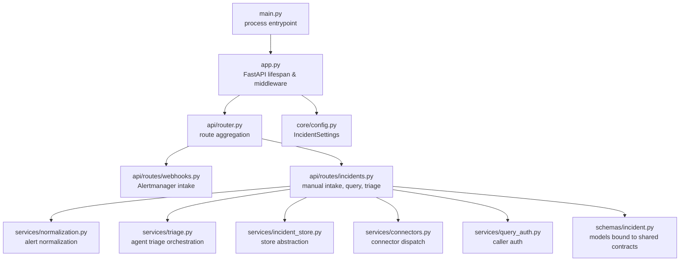
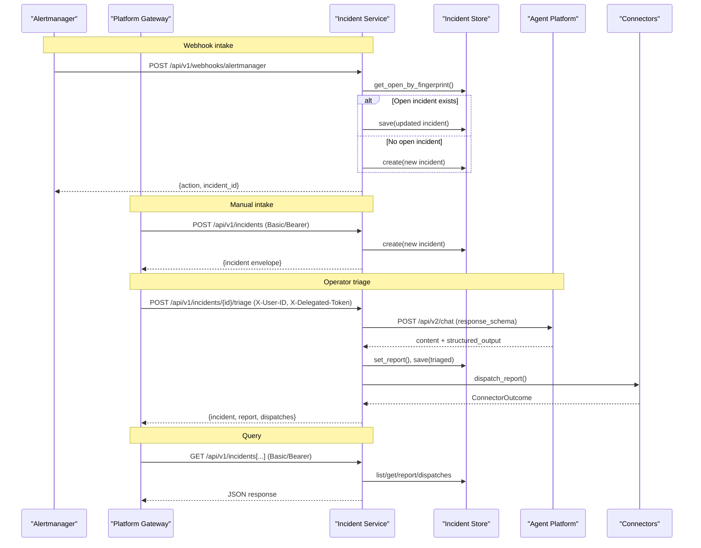
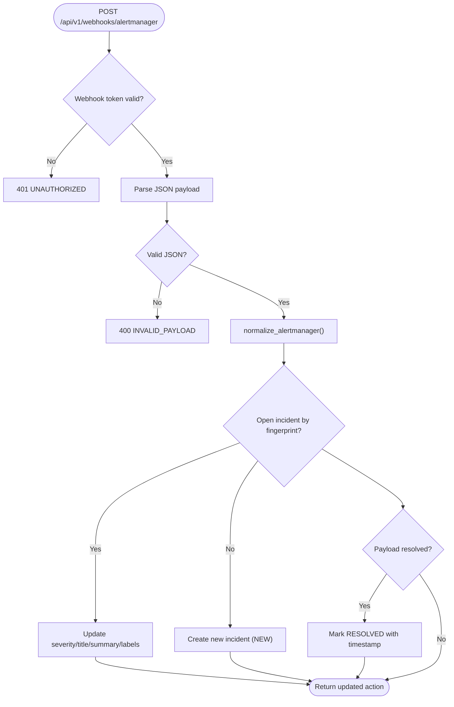
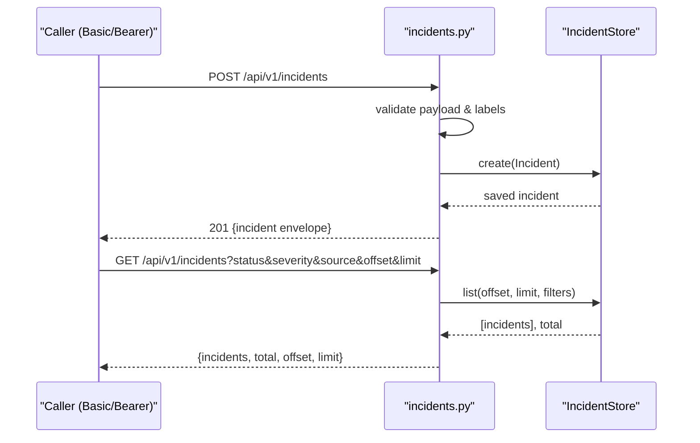
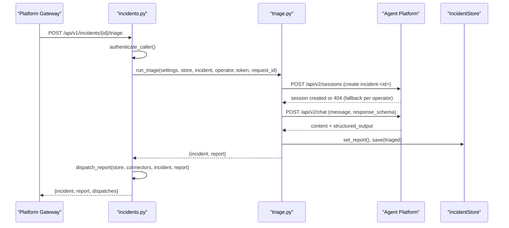
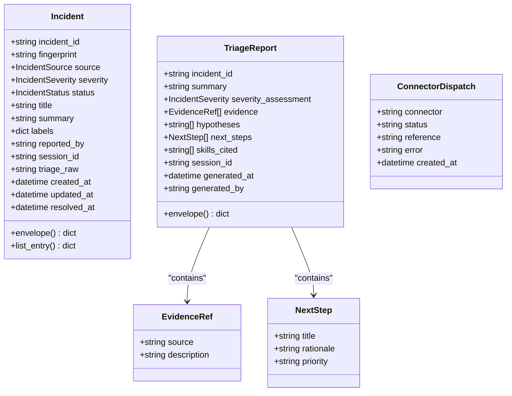
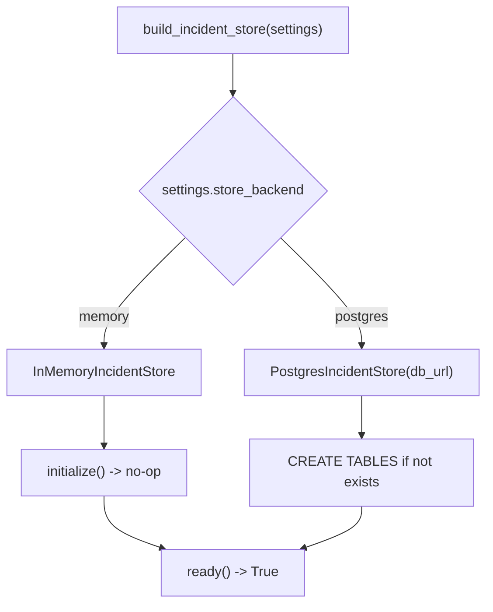
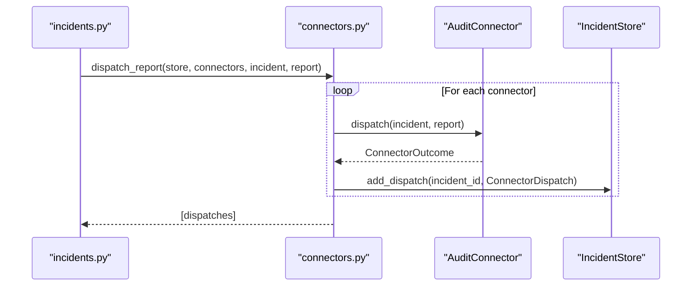
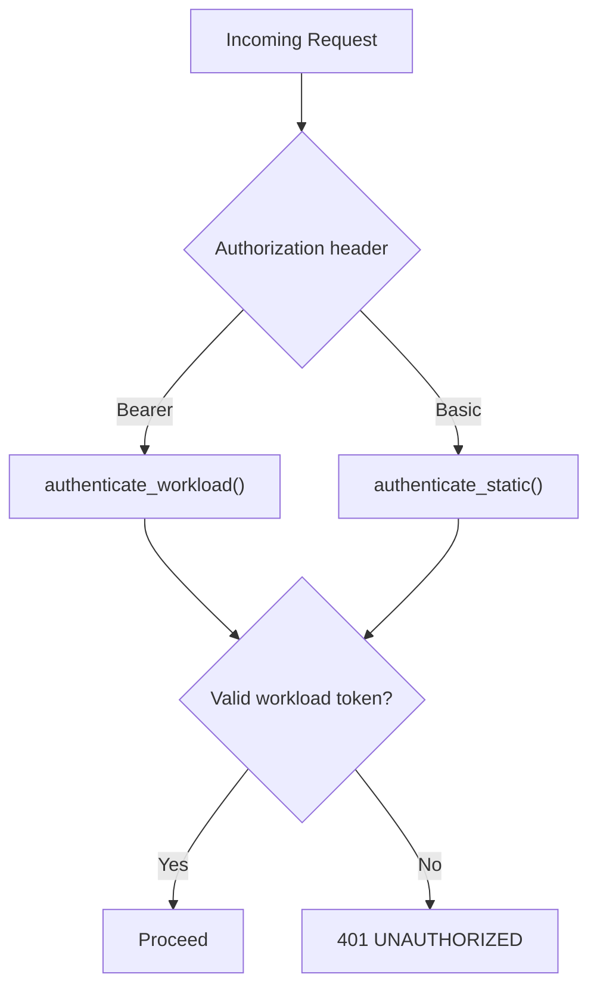
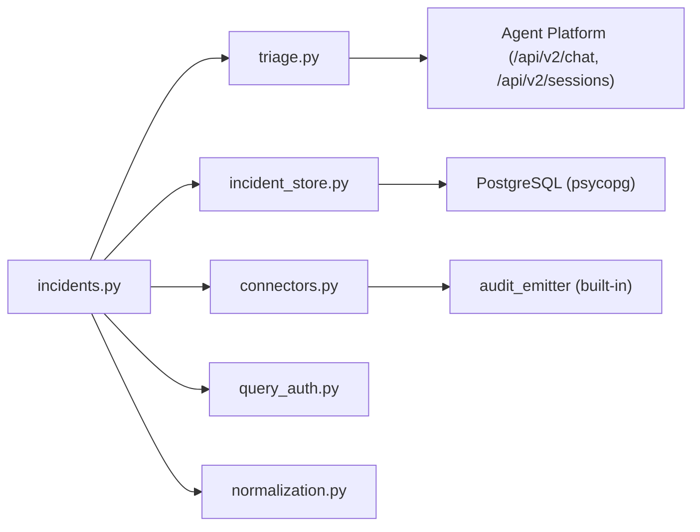

# Incident Service Product

<cite>
**Referenced Files in This Document**
- [README.md](file://products/incident-service/README.md)
- [main.py](file://products/incident-service/src/incident_service/main.py)
- [app.py](file://products/incident-service/src/incident_service/app.py)
- [router.py](file://products/incident-service/src/incident_service/api/router.py)
- [incidents.py](file://products/incident-service/src/incident_service/api/routes/incidents.py)
- [webhooks.py](file://products/incident-service/src/incident_service/api/routes/webhooks.py)
- [incident.py](file://products/incident-service/src/incident_service/schemas/incident.py)
- [config.py](file://products/incident-service/src/incident_service/core/config.py)
- [normalization.py](file://products/incident-service/src/incident_service/services/normalization.py)
- [incident_store.py](file://products/incident-service/src/incident_service/services/incident_store.py)
- [triage.py](file://products/incident-service/src/incident_service/services/triage.py)
- [connectors.py](file://products/incident-service/src/incident_service/services/connectors.py)
- [query_auth.py](file://products/incident-service/src/incident_service/services/query_auth.py)
- [incident.schema.json](file://shared/shared-contracts/schemas/incident.schema.json)
- [triage-report.schema.json](file://shared/shared-contracts/schemas/triage-report.schema.json)
</cite>

## Table of Contents
1. Introduction
2. Project Structure
3. Core Components
4. Architecture Overview
5. Detailed Component Analysis
6. Dependency Analysis
7. Performance Considerations
8. Troubleshooting Guide
9. Conclusion

## Introduction
The Incident Service turns alert noise and operator reports into tracked incidents, runs agent-driven triage on them, and dispatches outcomes through a pluggable connector framework. It supports dual intake (Alertmanager webhook and manual report), fingerprint-based deduplication, operator-initiated triage via the Agent Platform, and a query API for portal and tool integrations. The service is designed to be read-only from the tooling perspective and does not execute operational actions; next steps are advisory.

Key responsibilities:
- Normalize and ingest alerts and manual reports into a canonical incident model
- Deduplicate by fingerprint and manage lifecycle status transitions
- Run a single agent turn per incident to produce a validated triage report
- Dispatch validated reports to configured connectors (audit sink built-in)
- Expose secure query endpoints behind platform-caller authentication

**Section sources**
- [README.md:3-14](file://products/incident-service/README.md#L3-L14)
- [README.md:21-41](file://products/incident-service/README.md#L21-L41)

## Project Structure
The product follows a layered FastAPI application with clear separation between entrypoints, routing, services, schemas, and configuration.

**Diagram sources**
- [main.py:1-9](file://products/incident-service/src/incident_service/main.py#L1-L9)
- [app.py:20-69](file://products/incident-service/src/incident_service/app.py#L20-L69)
- [router.py:1-9](file://products/incident-service/src/incident_service/api/router.py#L1-L9)
- [webhooks.py:69-102](file://products/incident-service/src/incident_service/api/routes/webhooks.py#L69-L102)
- [incidents.py:74-283](file://products/incident-service/src/incident_service/api/routes/incidents.py#L74-L283)
- [normalization.py:68-109](file://products/incident-service/src/incident_service/services/normalization.py#L68-L109)
- [triage.py:186-363](file://products/incident-service/src/incident_service/services/triage.py#L186-L363)
- [incident_store.py:30-66](file://products/incident-service/src/incident_service/services/incident_store.py#L30-L66)
- [connectors.py:73-127](file://products/incident-service/src/incident_service/services/connectors.py#L73-L127)
- [query_auth.py:104-117](file://products/incident-service/src/incident_service/services/query_auth.py#L104-L117)
- [config.py:72-126](file://products/incident-service/src/incident_service/core/config.py#L72-L126)
- [incident.py:37-116](file://products/incident-service/src/incident_service/schemas/incident.py#L37-L116)

**Section sources**
- [main.py:1-9](file://products/incident-service/src/incident_service/main.py#L1-L9)
- [app.py:20-69](file://products/incident-service/src/incident_service/app.py#L20-L69)
- [router.py:1-9](file://products/incident-service/src/incident_service/api/router.py#L1-L9)

## Core Components
- Application lifecycle and middleware: initializes store and connectors, logs requests, sets up metrics and telemetry.
- Routing: aggregates health, webhooks, and incidents routes under /api/v1.
- Intake:
  - Alertmanager webhook: authenticates via bearer token, normalizes payload, creates or updates incidents by fingerprint, resolves open incidents.
  - Manual report: authenticated via platform-caller credentials, creates new incidents with unique fingerprints.
- Triage: orchestrates a single agent turn in a dedicated session, validates output against the triage report schema, persists report and updates incident status.
- Storage: abstracted via IncidentStore protocol with in-memory and PostgreSQL backends; stores incidents, reports, and connector dispatch records.
- Connectors: pluggable dispatchers that push validated reports to collaboration surfaces; failures are recorded but do not fail triage.
- Authentication: supports static Basic credentials and projected workload tokens for query endpoints.

**Section sources**
- [app.py:20-69](file://products/incident-service/src/incident_service/app.py#L20-L69)
- [webhooks.py:69-206](file://products/incident-service/src/incident_service/api/routes/webhooks.py#L69-L206)
- [incidents.py:74-283](file://products/incident-service/src/incident_service/api/routes/incidents.py#L74-L283)
- [triage.py:186-363](file://products/incident-service/src/incident_service/services/triage.py#L186-L363)
- [incident_store.py:30-66](file://products/incident-service/src/incident_service/services/incident_store.py#L30-L66)
- [connectors.py:73-127](file://products/incident-service/src/incident_service/services/connectors.py#L73-L127)
- [query_auth.py:104-117](file://products/incident-service/src/incident_service/services/query_auth.py#L104-L117)

## Architecture Overview
High-level flow across components for intake, triage, and query.

**Diagram sources**
- [webhooks.py:69-206](file://products/incident-service/src/incident_service/api/routes/webhooks.py#L69-L206)
- [incidents.py:74-283](file://products/incident-service/src/incident_service/api/routes/incidents.py#L74-L283)
- [triage.py:186-363](file://products/incident-service/src/incident_service/services/triage.py#L186-L363)
- [incident_store.py:30-66](file://products/incident-service/src/incident_service/services/incident_store.py#L30-L66)
- [connectors.py:87-127](file://products/incident-service/src/incident_service/services/connectors.py#L87-L127)

## Detailed Component Analysis

### Webhook Intake (Alertmanager)
- Authenticates using a shared bearer token; fails closed when unconfigured.
- Normalizes Alertmanager v4 payloads into a canonical input with stable fingerprinting.
- Creates new incidents for unknown fingerprints; updates existing open incidents for firing events; resolves open incidents for resolved events.

**Diagram sources**
- [webhooks.py:69-206](file://products/incident-service/src/incident_service/api/routes/webhooks.py#L69-L206)
- [normalization.py:68-109](file://products/incident-service/src/incident_service/services/normalization.py#L68-L109)

**Section sources**
- [webhooks.py:69-206](file://products/incident-service/src/incident_service/api/routes/webhooks.py#L69-L206)
- [normalization.py:68-109](file://products/incident-service/src/incident_service/services/normalization.py#L68-L109)

### Manual Intake and Query API
- Manual creation requires platform-caller authentication (Basic or workload token).
- Enforces label limits and length constraints during validation.
- Query endpoints support filtering by status, severity, source with capped pagination.

**Diagram sources**
- [incidents.py:74-176](file://products/incident-service/src/incident_service/api/routes/incidents.py#L74-L176)
- [incident_store.py:43-50](file://products/incident-service/src/incident_service/services/incident_store.py#L43-L50)

**Section sources**
- [incidents.py:74-176](file://products/incident-service/src/incident_service/api/routes/incidents.py#L74-L176)

### Triage Orchestration
- Establishes a dedicated agent session per incident, with per-operator fallback to handle re-triage by different operators.
- Calls Agent Platform chat endpoint with a structured output schema; prefers kernel-validated structured output, falls back to fenced block parsing.
- Forces server-minted attribution fields to prevent spoofing; validates against the triage report schema.
- Persists report and updates incident status; records metrics and observability events.

**Diagram sources**
- [incidents.py:235-283](file://products/incident-service/src/incident_service/api/routes/incidents.py#L235-L283)
- [triage.py:186-363](file://products/incident-service/src/incident_service/services/triage.py#L186-L363)

**Section sources**
- [triage.py:186-363](file://products/incident-service/src/incident_service/services/triage.py#L186-L363)
- [incidents.py:235-283](file://products/incident-service/src/incident_service/api/routes/incidents.py#L235-L283)

### Data Models and Contracts
- Incident and TriageReport models enforce field constraints and mirror shared contract schemas.
- IncidentStatus enumerates lifecycle states; IncidentSource distinguishes intake channels.
- ConnectorDispatch captures per-connector outcomes for auditability.

**Diagram sources**
- [incident.py:37-116](file://products/incident-service/src/incident_service/schemas/incident.py#L37-L116)

**Section sources**
- [incident.py:37-116](file://products/incident-service/src/incident_service/schemas/incident.py#L37-L116)
- [incident.schema.json:1-95](file://shared/shared-contracts/schemas/incident.schema.json#L1-L95)
- [triage-report.schema.json:1-120](file://shared/shared-contracts/schemas/triage-report.schema.json#L1-L120)

### Storage Strategy
- IncidentStore protocol defines CRUD operations for incidents, reports, and dispatch records.
- InMemoryIncidentStore for development/testing; PostgresIncidentStore for production with durable tables and indexes.
- Factory selects backend based on settings; ensures required DB URL when using Postgres.

**Diagram sources**
- [incident_store.py:508-517](file://products/incident-service/src/incident_service/services/incident_store.py#L508-L517)
- [incident_store.py:72-154](file://products/incident-service/src/incident_service/services/incident_store.py#L72-L154)
- [incident_store.py:280-313](file://products/incident-service/src/incident_service/services/incident_store.py#L280-L313)

**Section sources**
- [incident_store.py:30-66](file://products/incident-service/src/incident_service/services/incident_store.py#L30-L66)
- [incident_store.py:508-517](file://products/incident-service/src/incident_service/services/incident_store.py#L508-L517)

### Connectors Framework
- Pluggable connector protocol with name and async dispatch method.
- Registry maps connector names to factories; startup validates configured names.
- Dispatch failures are isolated, recorded, and counted without failing triage.

**Diagram sources**
- [connectors.py:73-127](file://products/incident-service/src/incident_service/services/connectors.py#L73-L127)

**Section sources**
- [connectors.py:73-127](file://products/incident-service/src/incident_service/services/connectors.py#L73-L127)

### Authentication
- Query endpoints authenticate callers via:
  - Static Basic credentials against INCIDENT_QUERY_CLIENTS registry
  - Workload tokens validated against cluster OIDC issuer JWKS with audience and subject mapping
- Webhook endpoint uses HMAC-safe comparison of bearer token.

**Diagram sources**
- [query_auth.py:33-43](file://products/incident-service/src/incident_service/services/query_auth.py#L33-L43)
- [query_auth.py:68-93](file://products/incident-service/src/incident_service/services/query_auth.py#L68-L93)
- [query_auth.py:104-117](file://products/incident-service/src/incident_service/services/query_auth.py#L104-L117)
- [webhooks.py:57-82](file://products/incident-service/src/incident_service/api/routes/webhooks.py#L57-L82)

**Section sources**
- [query_auth.py:33-43](file://products/incident-service/src/incident_service/services/query_auth.py#L33-L43)
- [query_auth.py:68-93](file://products/incident-service/src/incident_service/services/query_auth.py#L68-L93)
- [query_auth.py:104-117](file://products/incident-service/src/incident_service/services/query_auth.py#L104-L117)
- [webhooks.py:57-82](file://products/incident-service/src/incident_service/api/routes/webhooks.py#L57-L82)

## Dependency Analysis
Component coupling and external integration points:

**Diagram sources**
- [incidents.py:74-283](file://products/incident-service/src/incident_service/api/routes/incidents.py#L74-L283)
- [triage.py:186-363](file://products/incident-service/src/incident_service/services/triage.py#L186-L363)
- [incident_store.py:280-313](file://products/incident-service/src/incident_service/services/incident_store.py#L280-L313)
- [connectors.py:73-127](file://products/incident-service/src/incident_service/services/connectors.py#L73-L127)
- [normalization.py:68-109](file://products/incident-service/src/incident_service/services/normalization.py#L68-L109)

**Section sources**
- [incidents.py:74-283](file://products/incident-service/src/incident_service/api/routes/incidents.py#L74-L283)
- [triage.py:186-363](file://products/incident-service/src/incident_service/services/triage.py#L186-L363)
- [incident_store.py:280-313](file://products/incident-service/src/incident_service/services/incident_store.py#L280-L313)
- [connectors.py:73-127](file://products/incident-service/src/incident_service/services/connectors.py#L73-L127)
- [normalization.py:68-109](file://products/incident-service/src/incident_service/services/normalization.py#L68-L109)

## Performance Considerations
- Low-volume incident traffic justifies per-operation database connections in PostgresIncidentStore.
- List queries use indexed ordering and pagination to avoid full scans.
- Triage timeout is configurable to balance responsiveness with agent processing time.
- Connector dispatch failures are isolated to prevent cascading latency or failures.

[No sources needed since this section provides general guidance]

## Troubleshooting Guide
Common issues and diagnostics:
- Webhook disabled: If INCIDENT_WEBHOOK_TOKEN is empty, the service returns 503 for webhook calls.
- Invalid webhook token: Returns 401 UNAUTHORIZED; verify shared secret matches Alertmanager configuration.
- Malformed webhook payload: Returns 400 INVALID_PAYLOAD; ensure Alertmanager sends valid JSON with status and labels.
- Unknown connector name: Startup fails fast with ConnectorConfigError; verify INCIDENT_CONNECTORS entries match registered names.
- Triage failure: Incident status becomes triage_failed with raw agent text preserved; inspect triage_raw and logs for reasons.
- Query auth errors: Ensure Authorization header contains either Basic credentials from INCIDENT_QUERY_CLIENTS or a valid workload token.

Operational checks:
- Health endpoints: /health/live and /health/ready indicate service readiness.
- Metrics: Observe intake counters, triage success/failure counts, and connector dispatch totals.
- Logs: Look for incident_created, incident_updated, incident_resolved, triage_started, triage_completed, triage_failed, and connector_dispatched events.

**Section sources**
- [webhooks.py:73-93](file://products/incident-service/src/incident_service/api/routes/webhooks.py#L73-L93)
- [connectors.py:73-84](file://products/incident-service/src/incident_service/services/connectors.py#L73-L84)
- [triage.py:271-363](file://products/incident-service/src/incident_service/services/triage.py#L271-L363)
- [README.md:43-61](file://products/incident-service/README.md#L43-L61)

## Conclusion
The Incident Service provides a robust, extensible foundation for incident management within the Luban AIOps platform. It standardizes intake, enforces data contracts, orchestrates agent-driven triage safely, and exposes secure APIs for integration. Its modular design allows easy extension of connectors and storage backends while maintaining strong observability and reliability guarantees.

[No sources needed since this section summarizes without analyzing specific files]