# Platform Gateway Service

<cite>
**Referenced Files in This Document**
- [README.md](file://products/platform-gateway/README.md)
- [main.py](file://products/platform-gateway/src/platform_gateway/main.py)
- [app.py](file://products/platform-gateway/src/platform_gateway/app.py)
- [config.py](file://products/platform-gateway/src/platform_gateway/core/config.py)
- [runtime.py](file://products/platform-gateway/src/platform_gateway/core/runtime.py)
- [router.py](file://products/platform-gateway/src/platform_gateway/api/router.py)
- [chat.py](file://products/platform-gateway/src/platform_gateway/api/routes/chat.py)
- [sessions.py](file://products/platform-gateway/src/platform_gateway/api/routes/sessions.py)
- [incidents.py](file://products/platform-gateway/src/platform_gateway/api/routes/incidents.py)
- [policy.py](file://products/platform-gateway/src/platform_gateway/api/routes/policy.py)
- [tools.py](file://products/platform-gateway/src/platform_gateway/api/routes/tools.py)
- [skills.py](file://products/platform-gateway/src/platform_gateway/api/routes/skills.py)
- [gateway_service.py](file://products/platform-gateway/src/platform_gateway/services/gateway_service.py)
- [agent_client.py](file://products/platform-gateway/src/platform_gateway/services/agent_client.py)
- [incident_client.py](file://products/platform-gateway/src/platform_gateway/services/incident_client.py)
- [delegation_client.py](file://products/platform-gateway/src/platform_gateway/services/delegation_client.py)
- [token_verifier.py](file://products/platform-gateway/src/platform_gateway/services/token_verifier.py)
- [policy_engine.py](file://products/platform-gateway/src/platform_gateway/services/policy_engine.py)
- [policy_matrix.py](file://products/platform-gateway/src/platform_gateway/services/policy_matrix.py)
- [tool_gateway_client.py](file://products/platform-gateway/src/platform_gateway/services/tool_gateway_client.py)
- [skills_hub_client.py](file://products/platform-gateway/src/platform_gateway/services/skills_hub_client.py)
- [policy-default.yaml](file://products/platform-gateway/src/platform_gateway/policies/policy-default.yaml)
- [SPEC-010 spec.md](file://docs/specs/SPEC-010-platform-gateway-extraction/spec.md)
- [ADR-0005](file://docs/adr/0005-platform-gateway-extraction.md)
</cite>

## Update Summary
**Changes Made**
- Added new Policy Matrix endpoint section documenting live permission matrix evaluation via GET /api/v1/policy/matrix
- Added Workspace Proxy Endpoints section for tools and skills discovery with enhanced error handling
- Updated Architecture Overview to include policy transparency and workspace inventory proxies
- Enhanced Policy Engine section with new protected actions (policy:read, tools:list, skills:read)
- Added Policy Matrix service analysis for live permission evaluation
- Updated Dependency Analysis to include new proxy clients and routes
- Enhanced Troubleshooting Guide with policy matrix and workspace proxy issues

## Table of Contents
1. Introduction
2. Project Structure
3. Core Components
4. Architecture Overview
5. Detailed Component Analysis
6. Dependency Analysis
7. Performance Considerations
8. Troubleshooting Guide
9. Conclusion

## Introduction
The Platform Gateway Service is the portal-facing edge service for the Luban AIOps platform. It authenticates portal users via JWT verification, enforces deny-by-default action policies, proxies chat and session requests to the agent-platform service, mediates short-lived delegated tokens through the identity-broker for downstream tool access, provides unified API access to the incident service with policy enforcement for incident operations, exposes live permission matrix evaluation, and offers workspace inventory discovery for tools and skills. It exposes health, metrics, and runtime endpoints and maintains request correlation across hops.

Key responsibilities:
- Verify portal bearer tokens (issuer/audience JWKS validation; audience bound to platform-gateway).
- Enforce deny-by-default policy bundle on every portal-facing action (e.g., chat, sessions:*, incidents:*, policy:read, tools:list, skills:read).
- Proxy chat/session traffic to agent-platform, exchanging the portal token for a short-lived delegated token (aud = tool-gateway, act.sub = platform-gateway) via identity-broker before forwarding.
- Provide unified API access to incident-service with per-action policy enforcement (incident:read, incident:create, incident:triage) and Basic credential authentication upstream.
- Serve live permission matrix via GET /api/v1/policy/matrix with role-scoped visibility (full vs own).
- Proxy workspace inventory discovery to tool-gateway (tools:list) and skills-hub (skills:read) with appropriate authentication patterns.
- Relay auth/identity/runtime endpoints to identity-broker and agent-platform as needed.
- Expose /health/live, /health/ready, and /metrics.

**Section sources**
- [README.md:1-46](file://products/platform-gateway/README.md#L1-L46)
- [SPEC-010 spec.md:1-170](file://docs/specs/SPEC-010-platform-gateway-extraction/spec.md#L1-L170)
- [ADR-0005:1-47](file://docs/adr/0005-platform-gateway-extraction.md#L1-L47)

## Project Structure
The product follows a consistent FastAPI layout:
- Entry point and server configuration
- Application factory with middleware and telemetry
- API router aggregating route modules
- Services encapsulating business logic and external calls
- Policy bundle for deny-by-default authorization
- Configuration and runtime settings

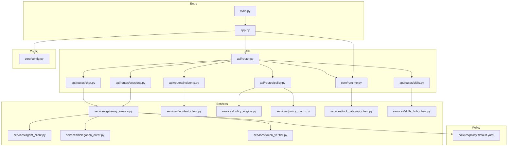

**Diagram sources**
- [main.py:1-9](file://products/platform-gateway/src/platform_gateway/main.py#L1-L9)
- [app.py:1-44](file://products/platform-gateway/src/platform_gateway/app.py#L1-L44)
- [router.py:1-23](file://products/platform-gateway/src/platform_gateway/api/router.py#L1-L23)
- [chat.py:1-103](file://products/platform-gateway/src/platform_gateway/api/routes/chat.py#L1-L103)
- [sessions.py:1-70](file://products/platform-gateway/src/platform_gateway/api/routes/sessions.py#L1-L70)
- [incidents.py:1-183](file://products/platform-gateway/src/platform_gateway/api/routes/incidents.py#L1-L183)
- [policy.py:1-55](file://products/platform-gateway/src/platform_gateway/api/routes/policy.py#L1-L55)
- [tools.py:1-69](file://products/platform-gateway/src/platform_gateway/api/routes/tools.py#L1-L69)
- [skills.py:1-53](file://products/platform-gateway/src/platform_gateway/api/routes/skills.py#L1-L53)
- [gateway_service.py:1-301](file://products/platform-gateway/src/platform_gateway/services/gateway_service.py#L1-L301)
- [agent_client.py:1-124](file://products/platform-gateway/src/platform_gateway/services/agent_client.py#L1-L124)
- [incident_client.py:1-193](file://products/platform-gateway/src/platform_gateway/services/incident_client.py#L1-L193)
- [delegation_client.py:1-229](file://products/platform-gateway/src/platform_gateway/services/delegation_client.py#L1-L229)
- [token_verifier.py:1-99](file://products/platform-gateway/src/platform_gateway/services/token_verifier.py#L1-L99)
- [policy_engine.py:1-243](file://products/platform-gateway/src/platform_gateway/services/policy_engine.py#L1-L243)
- [policy_matrix.py:1-62](file://products/platform-gateway/src/platform_gateway/services/policy_matrix.py#L1-L62)
- [tool_gateway_client.py:1-76](file://products/platform-gateway/src/platform_gateway/services/tool_gateway_client.py#L1-L76)
- [skills_hub_client.py:1-79](file://products/platform-gateway/src/platform_gateway/services/skills_hub_client.py#L1-L79)
- [policy-default.yaml:1-117](file://products/platform-gateway/src/platform_gateway/policies/policy-default.yaml#L1-L117)
- [config.py:1-117](file://products/platform-gateway/src/platform_gateway/core/config.py#L1-L117)
- [runtime.py:1-30](file://products/platform-gateway/src/platform_gateway/core/runtime.py#L1-L30)

**Section sources**
- [README.md:1-46](file://products/platform-gateway/README.md#L1-L46)

## Core Components
- Application bootstrap and middleware:
  - Creates FastAPI app, registers HTTP logging middleware, includes routers, sets up metrics and telemetry.
- Settings and runtime:
  - Environment-driven configuration for upstream services, JWKS, audiences, policy path, timeouts, and dev behavior.
  - Run settings for host/port resolution.
- API routes:
  - Chat and Sessions endpoints enforcing identity and policy, delegating to gateway service.
  - Incident proxy routes providing unified API access to incident-service with per-action policy enforcement.
  - **New**: Policy matrix endpoint serving live permission evaluation with role-scoped visibility.
  - **New**: Workspace proxy endpoints for tools catalog discovery and skills inventory listing.
- Gateway service:
  - Identity resolution, policy enforcement, proxying to agent-platform, streaming chat support.
- External clients:
  - Agent client for agent-platform v2 endpoints.
  - Incident client for incident-service with Basic credential authentication and error mapping.
  - Delegation client for broker-mediated token exchange with per-user cache and workload-token preference.
  - **New**: Tool gateway client for tool catalog discovery with delegated token forwarding.
  - **New**: Skills hub client for skills inventory with Basic credential authentication.
- Token verifier:
  - Local JWT verification using JWKS with issuer/audience checks and actor extraction.
- Policy engine:
  - Loads YAML bundle and evaluates actions against roles with deny-by-default semantics.
  - **Updated**: Now includes new protected actions (policy:read, tools:list, skills:read) with appropriate role-based access control.
- **New**: Policy matrix service:
  - Builds live permission matrix from loaded bundle with role-scoped visibility and metadata.

**Section sources**
- [app.py:1-44](file://products/platform-gateway/src/platform_gateway/app.py#L1-L44)
- [config.py:1-117](file://products/platform-gateway/src/platform_gateway/core/config.py#L1-L117)
- [runtime.py:1-30](file://products/platform-gateway/src/platform_gateway/core/runtime.py#L1-L30)
- [router.py:1-23](file://products/platform-gateway/src/platform_gateway/api/router.py#L1-L23)
- [chat.py:1-103](file://products/platform-gateway/src/platform_gateway/api/routes/chat.py#L1-L103)
- [sessions.py:1-70](file://products/platform-gateway/src/platform_gateway/api/routes/sessions.py#L1-L70)
- [incidents.py:1-183](file://products/platform-gateway/src/platform_gateway/api/routes/incidents.py#L1-L183)
- [policy.py:1-55](file://products/platform-gateway/src/platform_gateway/api/routes/policy.py#L1-L55)
- [tools.py:1-69](file://products/platform-gateway/src/platform_gateway/api/routes/tools.py#L1-L69)
- [skills.py:1-53](file://products/platform-gateway/src/platform_gateway/api/routes/skills.py#L1-L53)
- [gateway_service.py:1-301](file://products/platform-gateway/src/platform_gateway/services/gateway_service.py#L1-L301)
- [agent_client.py:1-124](file://products/platform-gateway/src/platform_gateway/services/agent_client.py#L1-L124)
- [incident_client.py:1-193](file://products/platform-gateway/src/platform_gateway/services/incident_client.py#L1-L193)
- [delegation_client.py:1-229](file://products/platform-gateway/src/platform_gateway/services/delegation_client.py#L1-L229)
- [token_verifier.py:1-99](file://products/platform-gateway/src/platform_gateway/services/token_verifier.py#L1-L99)
- [policy_engine.py:1-243](file://products/platform-gateway/src/platform_gateway/services/policy_engine.py#L1-L243)
- [policy_matrix.py:1-62](file://products/platform-gateway/src/platform_gateway/services/policy_matrix.py#L1-L62)
- [tool_gateway_client.py:1-76](file://products/platform-gateway/src/platform_gateway/services/tool_gateway_client.py#L1-L76)
- [skills_hub_client.py:1-79](file://products/platform-gateway/src/platform_gateway/services/skills_hub_client.py#L1-L79)
- [policy-default.yaml:1-117](file://products/platform-gateway/src/platform_gateway/policies/policy-default.yaml#L1-L117)

## Architecture Overview
The gateway sits between the portal and backend services. It authenticates users, authorizes actions, proxies requests, obtains delegated tokens for tool execution paths, serves live permission matrices, and provides workspace inventory discovery. The architecture now includes comprehensive transparency features and workspace capability visibility.

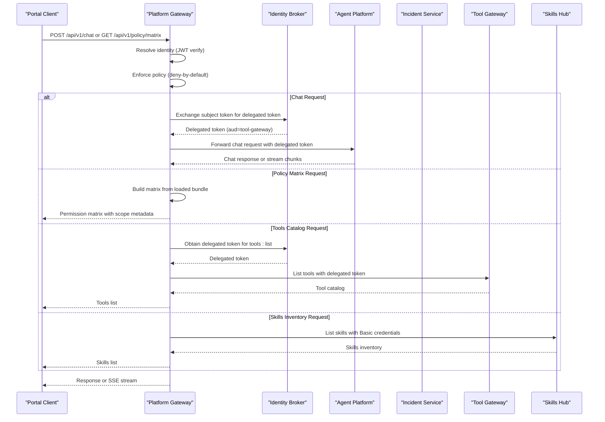

**Diagram sources**
- [chat.py:1-103](file://products/platform-gateway/src/platform_gateway/api/routes/chat.py#L1-L103)
- [incidents.py:1-183](file://products/platform-gateway/src/platform_gateway/api/routes/incidents.py#L1-L183)
- [policy.py:1-55](file://products/platform-gateway/src/platform_gateway/api/routes/policy.py#L1-L55)
- [tools.py:1-69](file://products/platform-gateway/src/platform_gateway/api/routes/tools.py#L1-L69)
- [skills.py:1-53](file://products/platform-gateway/src/platform_gateway/api/routes/skills.py#L1-L53)
- [gateway_service.py:1-301](file://products/platform-gateway/src/platform_gateway/services/gateway_service.py#L1-L301)
- [incident_client.py:1-193](file://products/platform-gateway/src/platform_gateway/services/incident_client.py#L1-L193)
- [delegation_client.py:1-229](file://products/platform-gateway/src/platform_gateway/services/delegation_client.py#L1-L229)
- [agent_client.py:1-124](file://products/platform-gateway/src/platform_gateway/services/agent_client.py#L1-L124)
- [tool_gateway_client.py:1-76](file://products/platform-gateway/src/platform_gateway/services/tool_gateway_client.py#L1-L76)
- [skills_hub_client.py:1-79](file://products/platform-gateway/src/platform_gateway/services/skills_hub_client.py#L1-L79)

## Detailed Component Analysis

### API Router and Routes
- The router aggregates health, runtime, auth, identity, sessions, chat, audit, incidents, **newly added** policy, tools, and skills routes.
- Chat, Sessions, and Incident routes enforce identity and policy before delegating to their respective service functions.
- **New**: Policy routes provide live permission matrix evaluation with role-scoped visibility.
- **New**: Workspace proxy routes provide tools catalog discovery and skills inventory listing with appropriate authentication patterns.

```mermaid
classDiagram
class Router {
+include_router(health)
+include_router(runtime)
+include_router(auth)
+include_router(identity)
+include_router(sessions)
+include_router(chat)
+include_router(audit)
+include_router(incidents)
+include_router(policy)
+include_router(tools)
+include_router(skills)
}
class ChatRoutes {
+POST /api/v1/chat
+GET /api/v1/chat/stream
}
class SessionsRoutes {
+POST /api/v1/sessions
+GET /api/v1/sessions/{session_id}
}
class IncidentsRoutes {
+GET /api/v1/incidents
+POST /api/v1/incidents
+GET /api/v1/incidents/{incident_id}
+GET /api/v1/incidents/{incident_id}/report
+POST /api/v1/incidents/{incident_id}/triage
}
class PolicyRoutes {
+GET /api/v1/policy/matrix
}
class ToolsRoutes {
+GET /api/v1/tools
}
class SkillsRoutes {
+GET /api/v1/skills
}
Router --> ChatRoutes : "includes"
Router --> SessionsRoutes : "includes"
Router --> IncidentsRoutes : "includes"
Router --> PolicyRoutes : "includes"
Router --> ToolsRoutes : "includes"
Router --> SkillsRoutes : "includes"
```

**Diagram sources**
- [router.py:1-23](file://products/platform-gateway/src/platform_gateway/api/router.py#L1-L23)
- [chat.py:1-103](file://products/platform-gateway/src/platform_gateway/api/routes/chat.py#L1-L103)
- [sessions.py:1-70](file://products/platform-gateway/src/platform_gateway/api/routes/sessions.py#L1-L70)
- [incidents.py:1-183](file://products/platform-gateway/src/platform_gateway/api/routes/incidents.py#L1-L183)
- [policy.py:1-55](file://products/platform-gateway/src/platform_gateway/api/routes/policy.py#L1-L55)
- [tools.py:1-69](file://products/platform-gateway/src/platform_gateway/api/routes/tools.py#L1-L69)
- [skills.py:1-53](file://products/platform-gateway/src/platform_gateway/api/routes/skills.py#L1-L53)

**Section sources**
- [router.py:1-23](file://products/platform-gateway/src/platform_gateway/api/router.py#L1-L23)
- [chat.py:1-103](file://products/platform-gateway/src/platform_gateway/api/routes/chat.py#L1-L103)
- [sessions.py:1-70](file://products/platform-gateway/src/platform_gateway/api/routes/sessions.py#L1-L70)
- [incidents.py:1-183](file://products/platform-gateway/src/platform_gateway/api/routes/incidents.py#L1-L183)
- [policy.py:1-55](file://products/platform-gateway/src/platform_gateway/api/routes/policy.py#L1-L55)
- [tools.py:1-69](file://products/platform-gateway/src/platform_gateway/api/routes/tools.py#L1-L69)
- [skills.py:1-53](file://products/platform-gateway/src/platform_gateway/api/routes/skills.py#L1-L53)

### Policy Matrix Endpoint
**New** - Provides live permission matrix evaluation derived from the currently enforced policy bundle with role-scoped visibility.

- **Endpoint**: GET /api/v1/policy/matrix
- **Authentication**: Requires `policy:read` action enforcement
- **Scoping**: 
  - `platform-admin` role receives full matrix with all roles and permissions
  - Other roles receive only their granted permissions (scope: "own")
- **Response**: Includes version, source, scope, roles, actions, and matrix data

Key features:
- Real-time evaluation using the same policy engine as enforcement
- Server-side role filtering ensures minimal data exposure
- Metadata includes bundle version and source (configured vs packaged-default)
- Comprehensive error handling for policy load failures (503)
- Audit logging with user context and scope information


**Diagram sources**
- [policy.py:30-55](file://products/platform-gateway/src/platform_gateway/api/routes/policy.py#L30-L55)
- [policy_matrix.py:25-62](file://products/platform-gateway/src/platform_gateway/services/policy_matrix.py#L25-L62)
- [policy_engine.py:188-198](file://products/platform-gateway/src/platform_gateway/services/policy_engine.py#L188-L198)

**Section sources**
- [policy.py:1-55](file://products/platform-gateway/src/platform_gateway/api/routes/policy.py#L1-L55)
- [policy_matrix.py:1-62](file://products/platform-gateway/src/platform_gateway/services/policy_matrix.py#L1-L62)

### Workspace Proxy Endpoints
**New** - Provides read-only workspace inventory discovery for tools and skills with appropriate authentication patterns and enhanced error handling.

#### Tools Catalog Discovery
- **Endpoint**: GET /api/v1/tools
- **Authentication**: Requires `tools:list` action + broker-mediated delegated token
- **Upstream**: Forwards to tool-gateway's `/api/v2/tools` with delegated token
- **Error Handling**: 503 when delegation chain unavailable, 502 on transport failures

#### Skills Inventory Listing  
- **Endpoint**: GET /api/v1/skills with query parameters (offset, limit, source, tag)
- **Authentication**: Requires `skills:read` action + Basic credentials (SKILLS_QUERY_CLIENTS)
- **Upstream**: Forwards to skills-hub's `/api/v1/skills` with Basic auth
- **Validation**: Query parameters validated (limit 1-100, offset ≥ 0)
- **Error Handling**: 503 when unconfigured, 502 on transport failures, 4xx passthrough

Key capabilities:
- Consistent error mapping across all workspace proxies
- Configurable timeouts (10 seconds default)
- Request correlation via x-request-id headers
- Comprehensive audit logging with operation context

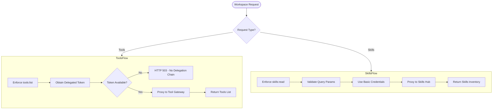

**Diagram sources**
- [tools.py:39-69](file://products/platform-gateway/src/platform_gateway/api/routes/tools.py#L39-L69)
- [skills.py:27-53](file://products/platform-gateway/src/platform_gateway/api/routes/skills.py#L27-L53)
- [tool_gateway_client.py:54-76](file://products/platform-gateway/src/platform_gateway/services/tool_gateway_client.py#L54-L76)
- [skills_hub_client.py:58-79](file://products/platform-gateway/src/platform_gateway/services/skills_hub_client.py#L58-L79)

**Section sources**
- [tools.py:1-69](file://products/platform-gateway/src/platform_gateway/api/routes/tools.py#L1-L69)
- [skills.py:1-53](file://products/platform-gateway/src/platform_gateway/api/routes/skills.py#L1-L53)
- [tool_gateway_client.py:1-76](file://products/platform-gateway/src/platform_gateway/services/tool_gateway_client.py#L1-L76)
- [skills_hub_client.py:1-79](file://products/platform-gateway/src/platform_gateway/services/skills_hub_client.py#L1-L79)

### Incident Proxy Routes
Provides unified API access to the incident-service with comprehensive policy enforcement and credential management.

- **List Incidents**: GET /api/v1/incidents with filtering by status, severity, source, limit, and offset
- **Create Incident**: POST /api/v1/incidents for manual incident reporting with reported_by tracking
- **Get Incident Detail**: GET /api/v1/incidents/{incident_id} with incident ID validation
- **Get Report**: GET /api/v1/incidents/{incident_id}/report for triage reports
- **Run Triage**: POST /api/v1/incidents/{incident_id}/triage requiring operator delegation chain

Key features:
- Per-action policy enforcement (incident:read, incident:create, incident:triage)
- Basic credential authentication to incident-service (never forwards user tokens)
- Operator identity forwarding via X-User-ID header for triage operations
- Delegated token forwarding via X-Delegated-Token header for agent turn execution
- Strict incident ID validation (pattern: inc-<lowercase alphanumeric>)
- Comprehensive error mapping (503 when unconfigured, 502 on transport failures, 4xx passthrough)


**Diagram sources**
- [incidents.py:63-183](file://products/platform-gateway/src/platform_gateway/api/routes/incidents.py#L63-L183)
- [incident_client.py:35-193](file://products/platform-gateway/src/platform_gateway/services/incident_client.py#L35-L193)

**Section sources**
- [incidents.py:1-183](file://products/platform-gateway/src/platform_gateway/api/routes/incidents.py#L1-L183)

### Incident Client
Handles all communication with the incident-service, implementing secure proxy patterns with proper credential management and error handling.

- **Authentication**: Uses gateway-held Basic credentials (INCIDENT_CLIENT_ID/SECRET) - never forwards user tokens
- **Request Handling**: Async HTTP client with configurable timeouts and comprehensive error mapping
- **Header Management**: Adds x-request-id for tracing, x-reported-by for incident creation, x-user-id and x-delegated-token for triage
- **Error Mapping**: Consistent error handling - 503 when service unconfigured, 502 on transport failures, 4xx passthrough with upstream messages

Key capabilities:
- List incidents with filtering parameters (status, severity, source, pagination)
- Create incidents with automatic reporter attribution
- Retrieve incident details and triage reports
- Execute triage operations with operator identity and delegated token forwarding
- Configurable timeout for triage operations (default 120 seconds)

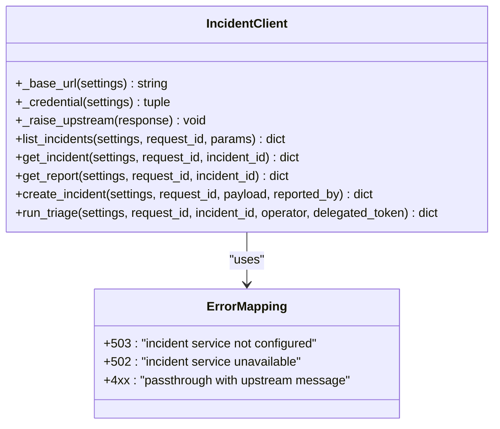

**Diagram sources**
- [incident_client.py:35-193](file://products/platform-gateway/src/platform_gateway/services/incident_client.py#L35-L193)

**Section sources**
- [incident_client.py:1-193](file://products/platform-gateway/src/platform_gateway/services/incident_client.py#L1-L193)

### Gateway Service
- Identity resolution supports local JWT verification and synthetic dev identity when auth is optional.
- Policy enforcement uses evaluate() from the policy engine; denies by default and records decisions.
- Proxies chat and session operations to agent-platform via agent_client.
- Provides streaming chat via StreamingResponse.

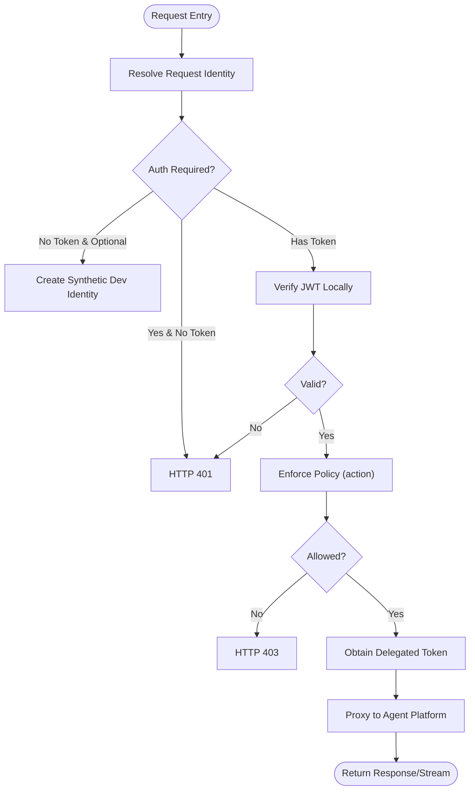

**Diagram sources**
- [gateway_service.py:1-301](file://products/platform-gateway/src/platform_gateway/services/gateway_service.py#L1-L301)
- [token_verifier.py:1-99](file://products/platform-gateway/src/platform_gateway/services/token_verifier.py#L1-L99)
- [delegation_client.py:1-229](file://products/platform-gateway/src/platform_gateway/services/delegation_client.py#L1-L229)

**Section sources**
- [gateway_service.py:1-301](file://products/platform-gateway/src/platform_gateway/services/gateway_service.py#L1-L301)

### Agent Client
- Single HTTP client binding to agent-platform v2 endpoints (/api/v2/*).
- Adds x-request-id and X-User-ID headers; forwards Authorization when delegated token present.
- Supports both regular and streaming chat with appropriate timeouts.

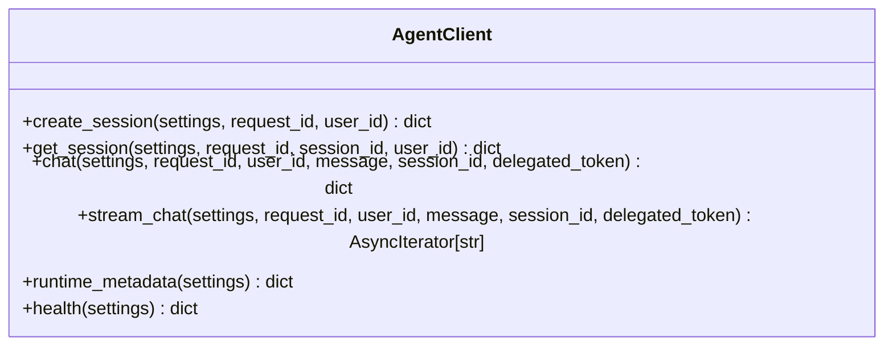

**Diagram sources**
- [agent_client.py:1-124](file://products/platform-gateway/src/platform_gateway/services/agent_client.py#L1-L124)

**Section sources**
- [agent_client.py:1-124](file://products/platform-gateway/src/platform_gateway/services/agent_client.py#L1-L124)

### Delegation Client
- Per-replica, per-user cache for delegated tokens with refresh-before-expiry strategy.
- Exchanges subject token at identity-broker using workload token (preferred) or static client credentials.
- Non-fatal failures allow chat to proceed without tools.
- Dev mode mints short-lived subject tokens signed locally.

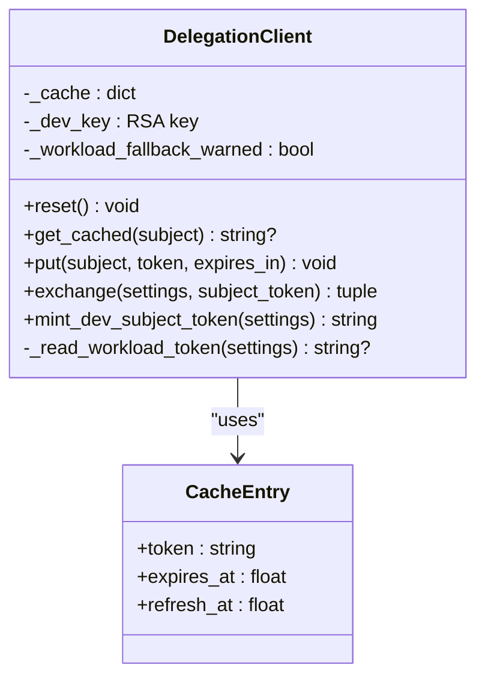

**Diagram sources**
- [delegation_client.py:1-229](file://products/platform-gateway/src/platform_gateway/services/delegation_client.py#L1-L229)

**Section sources**
- [delegation_client.py:1-229](file://products/platform-gateway/src/platform_gateway/services/delegation_client.py#L1-L229)

### Token Verifier
- Local JWT verification via JWKS with caching and lifespan control.
- Validates issuer, audience, required claims, and extracts actor (act.sub) if present.
- Raises typed errors for expired, invalid issuer/audience, and malformed tokens.

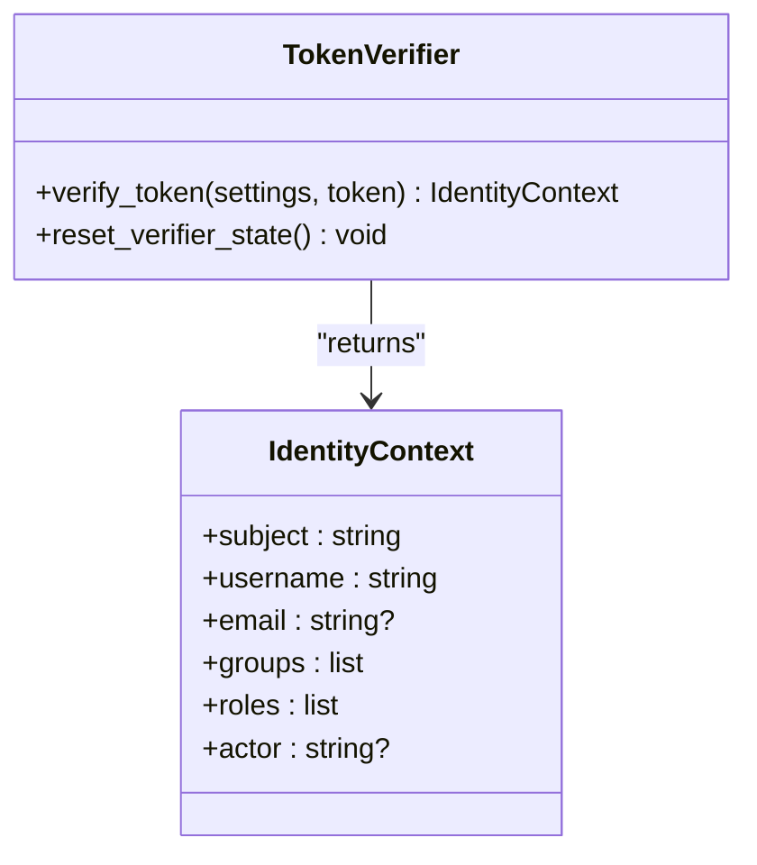

**Diagram sources**
- [token_verifier.py:1-99](file://products/platform-gateway/src/platform_gateway/services/token_verifier.py#L1-L99)

**Section sources**
- [token_verifier.py:1-99](file://products/platform-gateway/src/platform_gateway/services/token_verifier.py#L1-L99)

### Policy Engine and Default Bundle
- Loads YAML policy bundle and evaluates actions against roles with deny-by-default semantics.
- Explicit deny overrides allow; higher priority rules win among allows; disabled rules ignored.
- **Updated**: Default bundle now includes new protected actions with appropriate role-based access control:
  - `policy:read` granted to operational, developer, and observer roles for transparency
  - `tools:list` restricted to operational and developer roles for workspace visibility
  - `skills:read` granted to operational, developer, and observer roles for guidance visibility

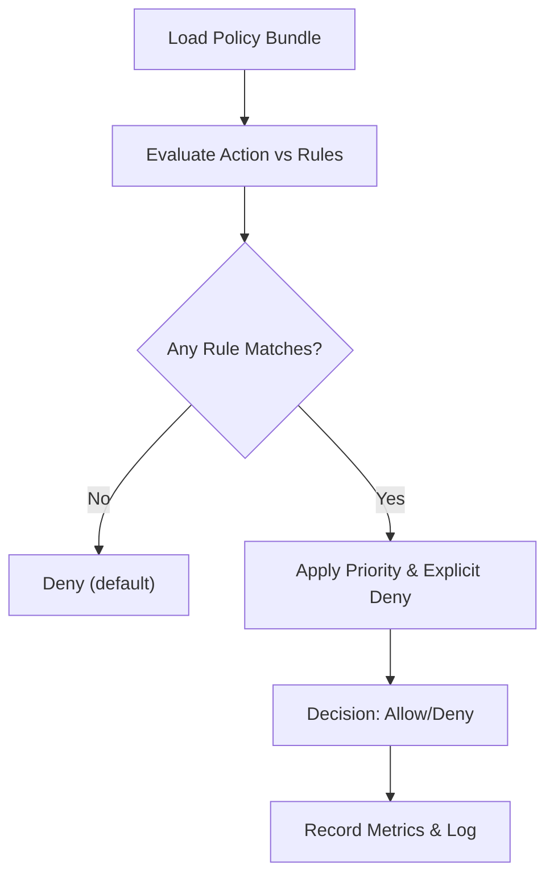

**Diagram sources**
- [policy-default.yaml:1-117](file://products/platform-gateway/src/platform_gateway/policies/policy-default.yaml#L1-L117)
- [gateway_service.py:222-254](file://products/platform-gateway/src/platform_gateway/services/gateway_service.py#L222-L254)

**Section sources**
- [policy-default.yaml:1-117](file://products/platform-gateway/src/platform_gateway/policies/policy-default.yaml#L1-L117)
- [gateway_service.py:222-254](file://products/platform-gateway/src/platform_gateway/services/gateway_service.py#L222-L254)
- [policy_engine.py:25-52](file://products/platform-gateway/src/platform_gateway/services/policy_engine.py#L25-L52)

### Application Bootstrap and Middleware
- FastAPI app creation with HTTP request logging middleware capturing method, path, status, duration, and request correlation id.
- Includes routers, sets up metrics and telemetry with service name/version metadata.

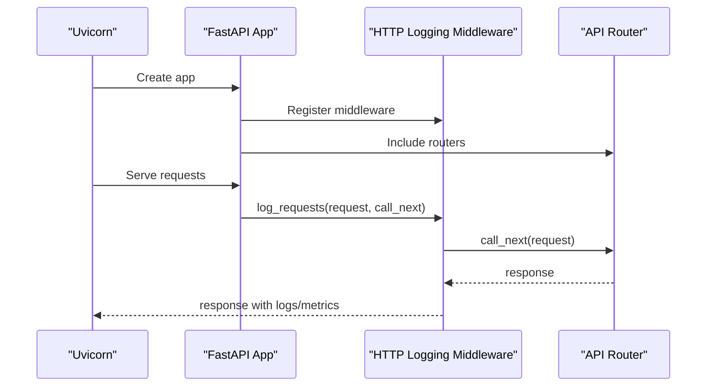

**Diagram sources**
- [main.py:1-9](file://products/platform-gateway/src/platform_gateway/main.py#L1-L9)
- [app.py:1-44](file://products/platform-gateway/src/platform_gateway/app.py#L1-L44)
- [router.py:1-23](file://products/platform-gateway/src/platform_gateway/api/router.py#L1-L23)

**Section sources**
- [main.py:1-9](file://products/platform-gateway/src/platform_gateway/main.py#L1-L9)
- [app.py:1-44](file://products/platform-gateway/src/platform_gateway/app.py#L1-L44)

## Dependency Analysis
High-level dependencies:
- main.py depends on app.py and runtime settings.
- app.py depends on router, metrics, observability, request context, telemetry, and metadata.
- api routes depend on gateway_service, config, schemas, and delegation_client.
- **New**: Policy routes depend on policy_engine and policy_matrix for live permission evaluation.
- **New**: Workspace proxy routes depend on tool_gateway_client and skills_hub_client for inventory discovery.
- gateway_service depends on agent_client, delegation_client, token_verifier, and policy_engine.
- incident_client depends on httpx and config for incident-service communication.
- agent_client depends on httpx and config.
- delegation_client depends on httpx, jwt, cryptography, and config.
- token_verifier depends on jwt and PyJWKClient.

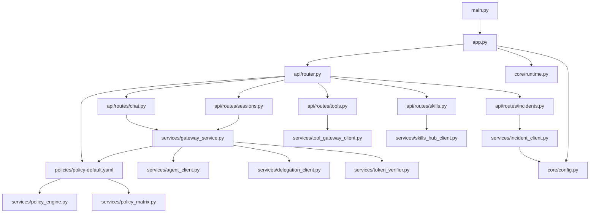

**Diagram sources**
- [main.py:1-9](file://products/platform-gateway/src/platform_gateway/main.py#L1-L9)
- [app.py:1-44](file://products/platform-gateway/src/platform_gateway/app.py#L1-L44)
- [router.py:1-23](file://products/platform-gateway/src/platform_gateway/api/router.py#L1-L23)
- [chat.py:1-103](file://products/platform-gateway/src/platform_gateway/api/routes/chat.py#L1-L103)
- [sessions.py:1-70](file://products/platform-gateway/src/platform_gateway/api/routes/sessions.py#L1-L70)
- [incidents.py:1-183](file://products/platform-gateway/src/platform_gateway/api/routes/incidents.py#L1-L183)
- [policy.py:1-55](file://products/platform-gateway/src/platform_gateway/api/routes/policy.py#L1-L55)
- [tools.py:1-69](file://products/platform-gateway/src/platform_gateway/api/routes/tools.py#L1-L69)
- [skills.py:1-53](file://products/platform-gateway/src/platform_gateway/api/routes/skills.py#L1-L53)
- [gateway_service.py:1-301](file://products/platform-gateway/src/platform_gateway/services/gateway_service.py#L1-L301)
- [incident_client.py:1-193](file://products/platform-gateway/src/platform_gateway/services/incident_client.py#L1-L193)
- [agent_client.py:1-124](file://products/platform-gateway/src/platform_gateway/services/agent_client.py#L1-L124)
- [delegation_client.py:1-229](file://products/platform-gateway/src/platform_gateway/services/delegation_client.py#L1-L229)
- [token_verifier.py:1-99](file://products/platform-gateway/src/platform_gateway/services/token_verifier.py#L1-L99)
- [policy_engine.py:1-243](file://products/platform-gateway/src/platform_gateway/services/policy_engine.py#L1-L243)
- [policy_matrix.py:1-62](file://products/platform-gateway/src/platform_gateway/services/policy_matrix.py#L1-L62)
- [tool_gateway_client.py:1-76](file://products/platform-gateway/src/platform_gateway/services/tool_gateway_client.py#L1-L76)
- [skills_hub_client.py:1-79](file://products/platform-gateway/src/platform_gateway/services/skills_hub_client.py#L1-L79)
- [policy-default.yaml:1-117](file://products/platform-gateway/src/platform_gateway/policies/policy-default.yaml#L1-L117)
- [config.py:1-117](file://products/platform-gateway/src/platform_gateway/core/config.py#L1-L117)
- [runtime.py:1-30](file://products/platform-gateway/src/platform_gateway/core/runtime.py#L1-L30)

**Section sources**
- [README.md:1-46](file://products/platform-gateway/README.md#L1-L46)

## Performance Considerations
- JWKS client caching reduces repeated key fetches; lifespan controlled by environment.
- Delegated token per-user cache avoids frequent broker exchanges; refresh fraction triggers early renewal.
- Streaming chat uses non-blocking async I/O with appropriate timeouts to prevent resource exhaustion.
- Health and readiness checks validate policy load and upstream connectivity to surface degraded states quickly.
- **New**: Policy matrix endpoint builds matrix efficiently using cached bundle with minimal overhead.
- **New**: Workspace proxy endpoints use configurable timeouts (10 seconds) to prevent resource exhaustion.
- **New**: Query parameter validation occurs before upstream calls to avoid unnecessary network overhead.
- **New**: All proxy clients implement consistent error mapping to minimize retry storms.

[No sources needed since this section provides general guidance]

## Troubleshooting Guide
Common issues and diagnostics:
- Authentication failures:
  - Malformed Authorization header or missing token when auth is required results in 401.
  - Expired or invalid issuer/audience raises specific verification errors.
- Policy denials:
  - Actions not matching any allow rule are denied by default; check role membership and action names.
  - **New**: New protected actions require appropriate roles (policy:read for observers, tools:list for operators/developers, skills:read for observers).
- Delegation failures:
  - If workload token is unavailable, falls back to static credentials; failures are logged and non-fatal, allowing tool-less operation.
  - **New**: Workspace proxy endpoints require successful delegation chains; missing delegated tokens result in 503 errors.
- Readiness degradation:
  - Policy load errors or agent-service connectivity issues mark readiness as degraded.
  - **New**: Missing incident service configuration results in 503 responses for all incident endpoints.
- **New**: Policy matrix endpoint issues:
  - Policy bundle load failures return 503 with "policy bundle unavailable" detail.
  - Insufficient permissions for policy:read action result in 403 responses.
  - Invalid JWT tokens prevent matrix generation.
- **New**: Workspace proxy connectivity issues:
  - Transport failures map to 502 with service-specific "unavailable" detail.
  - Upstream 5xx errors map to 502, while 4xx errors pass through unchanged.
  - Missing configuration (tool-gateway URL, skills-hub URL) results in 503 responses.
  - Invalid query parameters (limit > 100, negative offset) are rejected before upstream calls.

Operational tips:
- Inspect logs for "identity verified locally", "policy decision", "delegation exchange failed", and "workload token unavailable".
- Use /health/ready to detect degraded states and underlying error reasons.
- Validate environment variables for JWKS URL, audiences, policy path, and incident service configuration.
- **New**: Verify INCIDENT_SERVICE_URL, INCIDENT_CLIENT_ID, and INCIDENT_CLIENT_SECRET are properly configured.
- **New**: Monitor policy matrix endpoint usage and workspace proxy performance metrics.
- **New**: Check policy bundle version and source for transparency into effective permissions.
- **New**: Validate workspace proxy configuration (TOOL_GATEWAY_URL, SKILLS_HUB_URL, SKILLS_CLIENT_ID, SKILLS_CLIENT_SECRET).

**Section sources**
- [gateway_service.py:159-254](file://products/platform-gateway/src/platform_gateway/services/gateway_service.py#L159-L254)
- [delegation_client.py:190-229](file://products/platform-gateway/src/platform_gateway/services/delegation_client.py#L190-L229)
- [token_verifier.py:52-99](file://products/platform-gateway/src/platform_gateway/services/token_verifier.py#L52-L99)
- [incidents.py:43-50](file://products/platform-gateway/src/platform_gateway/api/routes/incidents.py#L43-L50)
- [incident_client.py:35-63](file://products/platform-gateway/src/platform_gateway/services/incident_client.py#L35-L63)
- [policy.py:38-46](file://products/platform-gateway/src/platform_gateway/api/routes/policy.py#L38-L46)
- [tools.py:53-59](file://products/platform-gateway/src/platform_gateway/api/routes/tools.py#L53-L59)
- [skills.py:30-31](file://products/platform-gateway/src/platform_gateway/api/routes/skills.py#L30-L31)

## Conclusion
The Platform Gateway Service cleanly separates portal-facing security and control-plane concerns from tool execution capabilities. It enforces strong authentication and authorization, proxies to agent-platform securely with least-privilege delegated tokens, provides unified API access to the incident service with comprehensive policy enforcement and credential management, and now offers transparency through live permission matrix evaluation and workspace inventory discovery. The addition of policy transparency and workspace proxy endpoints demonstrates the gateway's extensibility in providing secure, policy-enforced access to additional backend services while maintaining consistent security patterns and operational visibility. These enhancements enable operators to understand what capabilities are available and what permissions they have, improving both usability and security posture.

[No sources needed since this section summarizes without analyzing specific files]