# Platform Gateway Service

<cite>
**Referenced Files in This Document**
- [README.md](file://products/platform-gateway/README.md)
- [main.py](file://products/platform-gateway/src/platform_gateway/main.py)
- [app.py](file://products/platform-gateway/src/platform_gateway/app.py)
- [config.py](file://products/platform-gateway/src/platform_gateway/core/config.py)
- [runtime.py](file://products/platform-gateway/src/platform_gateway/core/runtime.py)
- [router.py](file://products/platform-gateway/src/platform_gateway/api/router.py)
- [chat.py](file://products/platform-gateway/src/platform_gateway/api/routes/chat.py)
- [sessions.py](file://products/platform-gateway/src/platform_gateway/api/routes/sessions.py)
- [documents.py](file://products/platform-gateway/src/platform_gateway/api/routes/documents.py)
- [incidents.py](file://products/platform-gateway/src/platform_gateway/api/routes/incidents.py)
- [policy.py](file://products/platform-gateway/src/platform_gateway/api/routes/policy.py)
- [tools.py](file://products/platform-gateway/src/platform_gateway/api/routes/tools.py)
- [skills.py](file://products/platform-gateway/src/platform_gateway/api/routes/skills.py)
- [models.py](file://products/platform-gateway/src/platform_gateway/api/routes/models.py)
- [runtime.py](file://products/platform-gateway/src/platform_gateway/api/routes/runtime.py)
- [health.py](file://products/platform-gateway/src/platform_gateway/api/routes/health.py)
- [gateway_service.py](file://products/platform-gateway/src/platform_gateway/services/gateway_service.py)
- [agent_client.py](file://products/platform-gateway/src/platform_gateway/services/agent_client.py)
- [incident_client.py](file://products/platform-gateway/src/platform_gateway/services/incident_client.py)
- [delegation_client.py](file://products/platform-gateway/src/platform_gateway/services/delegation_client.py)
- [token_verifier.py](file://products/platform-gateway/src/platform_gateway/services/token_verifier.py)
- [policy_engine.py](file://products/platform-gateway/src/platform_gateway/services/policy_engine.py)
- [policy_matrix.py](file://products/platform-gateway/src/platform_gateway/services/policy_matrix.py)
- [tool_gateway_client.py](file://products/platform-gateway/src/platform_gateway/services/tool_gateway_client.py)
- [skills_hub_client.py](file://products/platform-gateway/src/platform_gateway/services/skills_hub_client.py)
- [audit_emitter.py](file://products/platform-gateway/src/platform_gateway/services/audit_emitter.py)
- [api.py](file://products/platform-gateway/src/platform_gateway/schemas/api.py)
- [policy-default.yaml](file://products/platform-gateway/src/platform_gateway/policies/policy-default.yaml)
- [metadata.py](file://products/platform-gateway/src/platform_gateway/metadata.py)
- [SPEC-010 spec.md](file://docs/specs/SPEC-010-platform-gateway-extraction/spec.md)
- [SPEC-024 spec.md](file://docs/specs/SPEC-024-runtime-llm-model-switching/spec.md)
- [SPEC-039 spec.md](file://docs/specs/SPEC-039-operations-document-repository/spec.md)
- [SPEC-043 spec.md](file://docs/specs/SPEC-043-incident-report-document-type/spec.md)
- [SPEC-052 spec.md](file://docs/specs/SPEC-052-skill-content-viewer/spec.md)
- [SPEC-055 spec.md](file://docs/specs/SPEC-055-develop-as-you-go-skill-graduation/spec.md)
- [SPEC-056 spec.md](file://docs/specs/SPEC-056-studio-skill-development-workspace/spec.md)
- [ADR-0005](file://docs/adr/0005-platform-gateway-extraction.md)
</cite>

## Update Summary
**Changes Made**
- Enhanced session creation endpoint with dual authorization for development session type validation
- Added route-level dual-gate enforcement requiring both `session:create` and `session:skill_graduate` actions for development sessions
- Updated session creation flow to enforce session type validation at the policy boundary before proxying to agent service
- Enhanced error handling for development session creation with proper 4xx passthrough and 5xx mapping
- Added comprehensive testing coverage for development session authorization scenarios

## Table of Contents
1. Introduction
2. Project Structure
3. Core Components
4. Architecture Overview
5. Detailed Component Analysis
6. Dependency Analysis
7. Performance Considerations
8. Troubleshooting Guide
9. Conclusion

## Introduction
The Platform Gateway Service is the portal-facing edge service for the Luban AIOps platform. It authenticates portal users via JWT verification, enforces deny-by-default action policies, proxies chat and session requests to the agent-platform service, mediates short-lived delegated tokens through the identity-broker for downstream tool access, provides unified API access to the incident service with policy enforcement for incident operations, exposes live permission matrix evaluation, offers workspace inventory discovery for tools and skills, handles human-in-the-loop (HITL) confirmations with durable audit trails, manages session workspace lifecycle with server-side scoping to caller's own sessions, provides credential-gated model catalog discovery with per-turn model selection passthrough, implements operations document repository functionality with trusted foreign-session coverage decisions supporting both shift_summary and incident_report document types, exposes platform version information through the /api/v1/runtime endpoint for enhanced version tracking and monitoring capabilities across the platform, includes single-skill detail proxy functionality for reading full skill records including body content, supports skill target declaration for develop-as-you-go sessions with proper authorization controls, and now enforces dual authorization for development session creation requiring both session creation and graduation permissions. It exposes health, metrics, and runtime endpoints and maintains request correlation across hops.

Key responsibilities:
- Verify portal bearer tokens (issuer/audience JWKS validation; audience bound to platform-gateway).
- Enforce deny-by-default policy bundle on every portal-facing action (e.g., chat, sessions:*, incidents:*, policy:read, tools:list, skills:read, models:list, chat:confirm, session:list, session:delete, documents:create, documents:read, session:update, session:skill_graduate).
- Proxy chat/session traffic to agent-platform, exchanging the portal token for a short-lived delegated token (aud = tool-gateway, act.sub = platform-gateway) via identity-broker before forwarding.
- Handle HITL confirmations via POST /api/v1/chat/confirm with identity delegation and SSE streaming, emitting confirmation_decided audit events when decisions are applied.
- Provide unified API access to incident-service with per-action policy enforcement (incident:read, incident:create, incident:triage) and Basic credential authentication upstream.
- Serve live permission matrix via GET /api/v1/policy/matrix with role-scoped visibility (full vs own).
- Proxy workspace inventory discovery to tool-gateway (tools:list) and skills-hub (skills:read) with appropriate authentication patterns, including single-skill detail retrieval.
- Proxy model catalog discovery to agent-service (GET /api/v2/models) behind `models:list` policy action with credential gating.
- Implement operations document repository with policy enforcement for documents:create, documents:read actions, trusted foreign-session coverage computation, and support for both shift_summary and incident_report document types with dual-action authorization for incident reports.
- Expose platform version through /api/v1/runtime endpoint by merging SERVICE_VERSION into payload, enabling better version tracking and monitoring capabilities across the platform.
- Session workspace management now includes owner-only session rename capability behind `session:update` action with server-side ownership verification.
- Manage session workspace lifecycle (create, list, read, delete, update title) with server-side scoping to caller's own sessions and deny-by-default policy enforcement.
- Support skill target declaration for develop-as-you-go sessions behind `session:skill_graduate` policy action with proper authorization controls.
- **Enhanced**: Development session creation requires dual authorization - both `session:create` and `session:skill_graduate` actions must be granted to create development sessions.
- Relay auth/identity/runtime endpoints to identity-broker and agent-platform as needed.
- Expose /health/live, /health/ready, and /metrics.

**Section sources**
- [README.md:1-46](file://products/platform-gateway/README.md#L1-L46)
- [SPEC-010 spec.md:1-170](file://docs/specs/SPEC-010-platform-gateway-extraction/spec.md#L1-L170)
- [SPEC-024 spec.md:1-187](file://docs/specs/SPEC-024-runtime-llm-model-switching/spec.md#L1-L187)
- [SPEC-039 spec.md:1-268](file://docs/specs/SPEC-039-operations-document-repository/spec.md#L1-L268)
- [SPEC-043 spec.md:1-293](file://docs/specs/SPEC-043-incident-report-document-type/spec.md#L1-L293)
- [SPEC-052 spec.md:1-185](file://docs/specs/SPEC-052-skill-content-viewer/spec.md#L1-L185)
- [SPEC-055 spec.md:1-200](file://docs/specs/SPEC-055-develop-as-you-go-skill-graduation/spec.md#L1-L200)
- [SPEC-056 spec.md:228-378](file://docs/specs/SPEC-056-studio-skill-development-workspace/spec.md#L228-L378)
- [ADR-0005:1-47](file://docs/adr/0005-platform-gateway-extraction.md#L1-L47)

## Project Structure
The product follows a consistent FastAPI layout:
- Entry point and server configuration
- Application factory with middleware and telemetry
- API router aggregating route modules
- Services encapsulating business logic and external calls
- Policy bundle for deny-by-default authorization
- Configuration and runtime settings

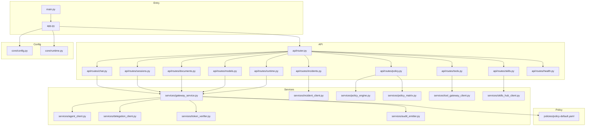

**Diagram sources**
- [main.py:1-9](file://products/platform-gateway/src/platform_gateway/main.py#L1-L9)
- [app.py:1-44](file://products/platform-gateway/src/platform_gateway/app.py#L1-L44)
- [router.py:1-35](file://products/platform-gateway/src/platform_gateway/api/router.py#L1-L35)
- [chat.py:1-187](file://products/platform-gateway/src/platform_gateway/api/routes/chat.py#L1-L187)
- [sessions.py:1-361](file://products/platform-gateway/src/platform_gateway/api/routes/sessions.py#L1-L361)
- [documents.py:1-188](file://products/platform-gateway/src/platform_gateway/api/routes/documents.py#L1-L188)
- [incidents.py:1-183](file://products/platform-gateway/src/platform_gateway/api/routes/incidents.py#L1-L183)
- [policy.py:1-55](file://products/platform-gateway/src/platform_gateway/api/routes/policy.py#L1-L55)
- [tools.py:1-69](file://products/platform-gateway/src/platform_gateway/api/routes/tools.py#L1-L69)
- [skills.py:1-79](file://products/platform-gateway/src/platform_gateway/api/routes/skills.py#L1-L79)
- [models.py:1-46](file://products/platform-gateway/src/platform_gateway/api/routes/models.py#L1-L46)
- [runtime.py:1-14](file://products/platform-gateway/src/platform_gateway/api/routes/runtime.py#L1-L14)
- [health.py:1-17](file://products/platform-gateway/src/platform_gateway/api/routes/health.py#L1-L17)
- [gateway_service.py:1-1363](file://products/platform-gateway/src/platform_gateway/services/gateway_service.py#L1-L1363)
- [agent_client.py:1-521](file://products/platform-gateway/src/platform_gateway/services/agent_client.py#L1-L521)
- [incident_client.py:1-193](file://products/platform-gateway/src/platform_gateway/services/incident_client.py#L1-L193)
- [delegation_client.py:1-229](file://products/platform-gateway/src/platform_gateway/services/delegation_client.py#L1-L229)
- [token_verifier.py:1-99](file://products/platform-gateway/src/platform_gateway/services/token_verifier.py#L1-L99)
- [policy_engine.py:1-444](file://products/platform-gateway/src/platform_gateway/services/policy_engine.py#L1-L444)
- [policy_matrix.py:1-62](file://products/platform-gateway/src/platform_gateway/services/policy_matrix.py#L1-L62)
- [tool_gateway_client.py:1-76](file://products/platform-gateway/src/platform_gateway/services/tool_gateway_client.py#L1-L76)
- [skills_hub_client.py:1-110](file://products/platform-gateway/src/platform_gateway/services/skills_hub_client.py#L1-L110)
- [audit_emitter.py:1-99](file://products/platform-gateway/src/platform_gateway/services/audit_emitter.py#L1-L99)
- [policy-default.yaml:1-326](file://products/platform-gateway/src/platform_gateway/policies/policy-default.yaml#L1-L326)
- [config.py:1-117](file://products/platform-gateway/src/platform_gateway/core/config.py#L1-L117)
- [runtime.py:1-30](file://products/platform-gateway/src/platform_gateway/core/runtime.py#L1-L30)

**Section sources**
- [README.md:1-46](file://products/platform-gateway/README.md#L1-L46)

## Core Components
- Application bootstrap and middleware:
  - Creates FastAPI app, registers HTTP logging middleware, includes routers, sets up metrics and telemetry.
- Settings and runtime:
  - Environment-driven configuration for upstream services, JWKS, audiences, policy path, timeouts, and dev behavior.
  - Run settings for host/port resolution.
- API routes:
  - Chat and Sessions endpoints enforcing identity and policy, delegating to gateway service.
  - Complete session workspace lifecycle management (create, list, read, delete, update title) with server-side scoping to caller's own sessions.
  - **Enhanced**: Session creation now enforces dual authorization for development sessions requiring both `session:create` and `session:skill_graduate` actions.
  - Skill target declaration endpoint for develop-as-you-go sessions with `session:skill_graduate` policy enforcement.
  - Operations document repository routes (create, list, fetch, publish, delete) with policy enforcement, trusted foreign-session coverage computation, and support for both shift_summary and incident_report document types with dual-action authorization for incident reports.
  - Incident proxy routes providing unified API access to incident-service with per-action policy enforcement.
  - Policy matrix endpoint serving live permission evaluation with role-scoped visibility.
  - Workspace proxy endpoints for tools catalog discovery and skills inventory listing, including single-skill detail retrieval.
  - Model catalog proxy endpoint for credential-gated model discovery behind `models:list` policy action.
  - Runtime endpoint exposing platform version information through /api/v1/runtime by merging SERVICE_VERSION into payload for enhanced version tracking and monitoring.
- Gateway service:
  - Identity resolution, policy enforcement, proxying to agent-platform, streaming chat support.
  - Session workspace proxy with proper error handling (upstream 4xx passthrough, transport failures map to 502).
  - Skill target declaration proxy with improved error handling for target validation failures.
  - Chat confirm handling with audit trail integration for confirmation_decided events.
  - Document repository proxy with trusted foreign-session coverage decision computation, dual-action authorization for incident reports, and type-specific payload handling.
  - Model catalog proxy with consistent error handling patterns matching other proxy endpoints.
  - Chat streaming with comprehensive audit trail coverage including fallback model attribution for streams closing without message_end frames.
  - Runtime status function that merges platform version from SERVICE_VERSION into the runtime payload for enhanced version tracking.
- External clients:
  - Agent client for agent-platform v2 endpoints including runtime_metadata method.
  - Document repository methods (create_document, list_documents, fetch_document, publish_document, delete_document) with foreign coverage header support and type-specific payload handling.
  - Session workspace methods (list_sessions, delete_session, get_session, update_session_title) with proper error handling.
  - Renamed `stream_chat` to `open_chat_stream` with eager upstream status checking.
  - `list_models()` method for credential-gated model catalog discovery.
  - Incident client for incident-service with Basic credential authentication and error mapping.
  - Delegation client for broker-mediated token exchange with per-user cache and workload-token preference.
  - Tool gateway client for tool catalog discovery with delegated token forwarding.
  - Skills hub client for skills inventory with Basic credential authentication, including single-skill detail retrieval.
- Token verifier:
  - Local JWT verification using JWKS with issuer/audience checks and actor extraction.
- Policy engine:
  - Loads YAML bundle and evaluates actions against roles with deny-by-default semantics.
  - Includes new protected actions (policy:read, tools:list, skills:read, chat:confirm, session:list, session:delete, models:list, documents:create, documents:read, session:update, session:skill_graduate) with appropriate role-based access control.
- Policy matrix service:
  - Builds live permission matrix from loaded bundle with role-scoped visibility and metadata.
- Audit emitter:
  - Fire-and-forget delivery of audit events including confirmation_decided, session_deleted, document_created, document_published, document_deleted, chat_completed, and skill_target_declared events with non-blocking operation.
  - Chat completed events now include model attribution with fallback support for complete operational visibility.
  - Document repository audit events with foreign-session coverage tracking and incident_id for incident reports.

**Section sources**
- [app.py:1-44](file://products/platform-gateway/src/platform_gateway/app.py#L1-L44)
- [config.py:1-117](file://products/platform-gateway/src/platform_gateway/core/config.py#L1-L117)
- [runtime.py:1-30](file://products/platform-gateway/src/platform_gateway/core/runtime.py#L1-L30)
- [router.py:1-35](file://products/platform-gateway/src/platform_gateway/api/router.py#L1-L35)
- [chat.py:1-187](file://products/platform-gateway/src/platform_gateway/api/routes/chat.py#L1-L187)
- [sessions.py:1-361](file://products/platform-gateway/src/platform_gateway/api/routes/sessions.py#L1-L361)
- [documents.py:1-188](file://products/platform-gateway/src/platform_gateway/api/routes/documents.py#L1-L188)
- [incidents.py:1-183](file://products/platform-gateway/src/platform_gateway/api/routes/incidents.py#L1-L183)
- [policy.py:1-55](file://products/platform-gateway/src/platform_gateway/api/routes/policy.py#L1-L55)
- [tools.py:1-69](file://products/platform-gateway/src/platform_gateway/api/routes/tools.py#L1-L69)
- [skills.py:1-79](file://products/platform-gateway/src/platform_gateway/api/routes/skills.py#L1-L79)
- [models.py:1-46](file://products/platform-gateway/src/platform_gateway/api/routes/models.py#L1-L46)
- [runtime.py:1-14](file://products/platform-gateway/src/platform_gateway/api/routes/runtime.py#L1-L14)
- [health.py:1-17](file://products/platform-gateway/src/platform_gateway/api/routes/health.py#L1-L17)
- [gateway_service.py:1-1363](file://products/platform-gateway/src/platform_gateway/services/gateway_service.py#L1-L1363)
- [agent_client.py:1-521](file://products/platform-gateway/src/platform_gateway/services/agent_client.py#L1-L521)
- [incident_client.py:1-193](file://products/platform-gateway/src/platform_gateway/services/incident_client.py#L1-L193)
- [delegation_client.py:1-229](file://products/platform-gateway/src/platform_gateway/services/delegation_client.py#L1-L229)
- [token_verifier.py:1-99](file://products/platform-gateway/src/platform_gateway/services/token_verifier.py#L1-L99)
- [policy_engine.py:1-444](file://products/platform-gateway/src/platform_gateway/services/policy_engine.py#L1-L444)
- [policy_matrix.py:1-62](file://products/platform-gateway/src/platform_gateway/services/policy_matrix.py#L1-L62)
- [tool_gateway_client.py:1-76](file://products/platform-gateway/src/platform_gateway/services/tool_gateway_client.py#L1-L76)
- [skills_hub_client.py:1-110](file://products/platform-gateway/src/platform_gateway/services/skills_hub_client.py#L1-L110)
- [audit_emitter.py:1-99](file://products/platform-gateway/src/platform_gateway/services/audit_emitter.py#L1-L99)
- [policy-default.yaml:1-326](file://products/platform-gateway/src/platform_gateway/policies/policy-default.yaml#L1-L326)

## Architecture Overview
The gateway sits between the portal and backend services. It authenticates users, authorizes actions, proxies requests, obtains delegated tokens for tool execution paths, serves live permission matrices, provides workspace inventory discovery, handles HITL confirmations with durable audit trails, manages session workspace lifecycle with server-side scoping, provides credential-gated model catalog discovery with per-turn model selection passthrough, implements operations document repository functionality with trusted foreign-session coverage decisions supporting both shift_summary and incident_report document types with dual-action authorization for incident reports, exposes platform version information through the /api/v1/runtime endpoint for enhanced version tracking and monitoring capabilities across the platform, includes single-skill detail proxy functionality for reading full skill records including body content, supports skill target declaration for develop-as-you-go sessions with proper authorization controls, and now enforces dual authorization for development session creation requiring both session creation and graduation permissions. The architecture includes comprehensive transparency features, workspace capability visibility, human-in-the-loop confirmation bridging, complete session workspace management, enhanced audit trail coverage with model attribution for complete operational visibility, secure document repository operations with cross-session coverage capabilities, enhanced runtime version exposure, enhanced skills content viewing capabilities, robust skill development workflow support, and hardened development session creation with dual authorization gates.

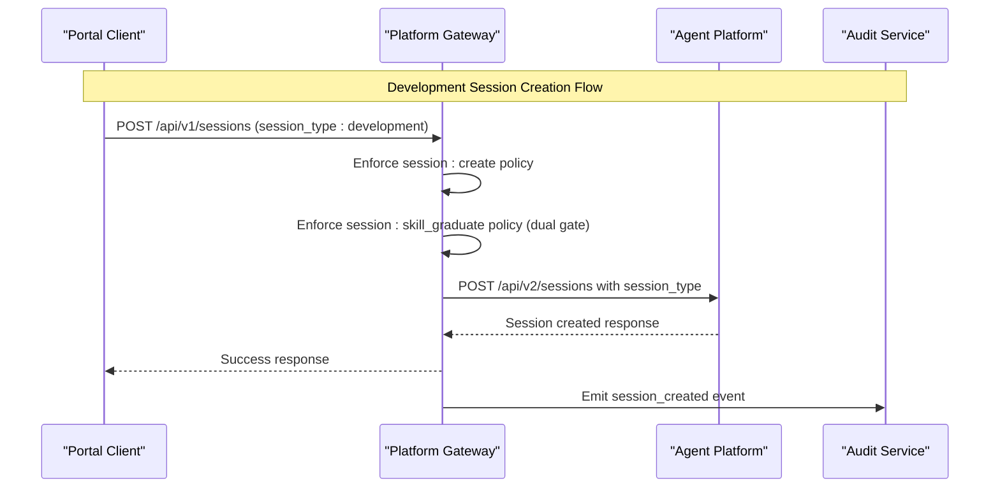

**Diagram sources**
- [sessions.py:41-101](file://products/platform-gateway/src/platform_gateway/api/routes/sessions.py#L41-L101)
- [gateway_service.py:331-371](file://products/platform-gateway/src/platform_gateway/services/gateway_service.py#L331-L371)
- [agent_client.py:32-51](file://products/platform-gateway/src/platform_gateway/services/agent_client.py#L32-L51)

## Detailed Component Analysis

### API Router and Routes
- The router aggregates health, runtime, auth, identity, sessions, chat, audit, incidents, newly added policy, tools, skills, models, approvals, and documents routes.
- Chat, Sessions, and Incident routes enforce identity and policy before delegating to their respective service functions.
- Complete session workspace lifecycle management with deny-by-default policy enforcement for all session operations including owner-only rename.
- **Enhanced**: Session creation route now implements dual authorization for development sessions, requiring both `session:create` and `session:skill_graduate` actions.
- Skill target declaration route for develop-as-you-go sessions with `session:skill_graduate` policy enforcement.
- Operations document repository routes provide create, list, fetch, publish, and delete functionality with policy enforcement, trusted foreign-session coverage computation, and support for both shift_summary and incident_report document types with dual-action authorization for incident reports.
- Chat Confirm route for HITL confirmation bridging with identity delegation and SSE streaming.
- Policy routes provide live permission matrix evaluation with role-scoped visibility.
- Workspace proxy routes provide tools catalog discovery and skills inventory listing with appropriate authentication patterns, including single-skill detail retrieval.
- Model catalog proxy route provides credential-gated model discovery behind `models:list` policy action.
- Runtime route exposes platform version information through /api/v1/runtime endpoint by merging SERVICE_VERSION into payload for enhanced version tracking and monitoring.

```mermaid
classDiagram
class Router {
+include_router(health)
+include_router(runtime)
+include_router(auth)
+include_router(identity)
+include_router(sessions)
+include_router(chat)
+include_router(audit)
+include_router(incidents)
+include_router(policy)
+include_router(tools)
+include_router(skills)
+include_router(models)
+include_router(approvals)
+include_router(documents)
}
class ChatRoutes {
+POST /api/v1/chat
+GET /api/v1/chat/stream
+POST /api/v1/chat/confirm
}
class SessionsRoutes {
+POST /api/v1/sessions
+GET /api/v1/sessions
+GET /api/v1/sessions/{session_id}
+DELETE /api/v1/sessions/{session_id}
+PATCH /api/v1/sessions/{session_id}/title
+POST /api/v1/sessions/{session_id}/skill-target
+POST /api/v1/sessions/{session_id}/skill-draft
+POST /api/v1/sessions/{session_id}/skill-graduate
}
class DocumentsRoutes {
+POST /api/v1/documents
+GET /api/v1/documents
+GET /api/v1/documents/{document_id}
+POST /api/v1/documents/{document_id}/publish
+DELETE /api/v1/documents/{document_id}
}
class IncidentsRoutes {
+GET /api/v1/incidents
+POST /api/v1/incidents
+GET /api/v1/incidents/{incident_id}
+GET /api/v1/incidents/{incident_id}/report
+POST /api/v1/incidents/{incident_id}/triage
}
class PolicyRoutes {
+GET /api/v1/policy/matrix
}
class ToolsRoutes {
+GET /api/v1/tools
}
class SkillsRoutes {
+GET /api/v1/skills
+GET /api/v1/skills/{skill_id : path}
}
class ModelsRoutes {
+GET /api/v1/models
}
class RuntimeRoutes {
+GET /api/v1/runtime
}
Router --> ChatRoutes : "includes"
Router --> SessionsRoutes : "includes"
Router --> DocumentsRoutes : "includes"
Router --> IncidentsRoutes : "includes"
Router --> PolicyRoutes : "includes"
Router --> ToolsRoutes : "includes"
Router --> SkillsRoutes : "includes"
Router --> ModelsRoutes : "includes"
Router --> RuntimeRoutes : "includes"
```

**Diagram sources**
- [router.py:1-35](file://products/platform-gateway/src/platform_gateway/api/router.py#L1-L35)
- [chat.py:1-187](file://products/platform-gateway/src/platform_gateway/api/routes/chat.py#L1-L187)
- [sessions.py:1-361](file://products/platform-gateway/src/platform_gateway/api/routes/sessions.py#L1-L361)
- [documents.py:1-188](file://products/platform-gateway/src/platform_gateway/api/routes/documents.py#L1-L188)
- [incidents.py:1-183](file://products/platform-gateway/src/platform_gateway/api/routes/incidents.py#L1-L183)
- [policy.py:1-55](file://products/platform-gateway/src/platform_gateway/api/routes/policy.py#L1-L55)
- [tools.py:1-69](file://products/platform-gateway/src/platform_gateway/api/routes/tools.py#L1-L69)
- [skills.py:1-79](file://products/platform-gateway/src/platform_gateway/api/routes/skills.py#L1-L79)
- [models.py:1-46](file://products/platform-gateway/src/platform_gateway/api/routes/models.py#L1-L46)
- [runtime.py:1-14](file://products/platform-gateway/src/platform_gateway/api/routes/runtime.py#L1-L14)

**Section sources**
- [router.py:1-35](file://products/platform-gateway/src/platform_gateway/api/router.py#L1-L35)
- [chat.py:1-187](file://products/platform-gateway/src/platform_gateway/api/routes/chat.py#L1-L187)
- [sessions.py:1-361](file://products/platform-gateway/src/platform_gateway/api/routes/sessions.py#L1-L361)
- [documents.py:1-188](file://products/platform-gateway/src/platform_gateway/api/routes/documents.py#L1-L188)
- [incidents.py:1-183](file://products/platform-gateway/src/platform_gateway/api/routes/incidents.py#L1-L183)
- [policy.py:1-55](file://products/platform-gateway/src/platform_gateway/api/routes/policy.py#L1-L55)
- [tools.py:1-69](file://products/platform-gateway/src/platform_gateway/api/routes/tools.py#L1-L69)
- [skills.py:1-79](file://products/platform-gateway/src/platform_gateway/api/routes/skills.py#L1-L79)
- [models.py:1-46](file://products/platform-gateway/src/platform_gateway/api/routes/models.py#L1-L46)
- [runtime.py:1-14](file://products/platform-gateway/src/platform_gateway/api/routes/runtime.py#L1-L14)

### Enhanced Session Creation with Dual Authorization
**Updated** - Enhanced session creation functionality with route-level dual authorization for development sessions, requiring both `session:create` and `session:skill_graduate` policy actions.

#### Development Session Creation with Dual Gate
- **Endpoint**: POST /api/v1/sessions
- **Authentication**: Requires `session:create` action + additional `session:skill_graduate` action for development sessions
- **Functionality**: Creates sessions with optional skill target declaration and session type specification
- **Response**: Created session details with session_id and session_type
- **Purpose**: Enables both operation sessions (default) and development sessions (requires dual authorization)

#### Implementation Details
- **Dual Authorization**: Development sessions require both `session:create` AND `session:skill_graduate` actions
- **Session Type Validation**: `session_type` parameter defaults to "operation", can be set to "development" for Studio sessions
- **Error Handling**: Upstream 4xx errors pass through with structured detail; 5xx errors map to 502
- **Audit Trail**: Emits `session_created` event with session_type and skill_target_declared flags
- **Security**: Non-authoring roles (developer, read-only-observer, auditor) cannot create development sessions even with session:create permission

Key capabilities:
- Backward compatible - operation sessions work as before with single `session:create` authorization
- Development sessions require higher trust level - both creation and graduation permissions
- Prevents unauthorized development session creation while maintaining existing functionality
- Supports skill target declaration during session creation for develop-as-you-go workflows
- Integrates seamlessly with existing session workspace infrastructure
- Provides clear error messages for authorization failures with specific action identification

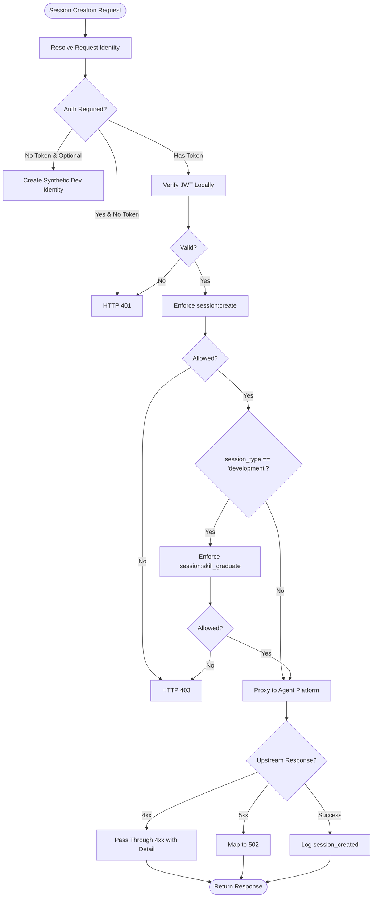

**Diagram sources**
- [sessions.py:41-101](file://products/platform-gateway/src/platform_gateway/api/routes/sessions.py#L41-L101)
- [gateway_service.py:331-371](file://products/platform-gateway/src/platform_gateway/services/gateway_service.py#L331-L371)

**Section sources**
- [sessions.py:41-101](file://products/platform-gateway/src/platform_gateway/api/routes/sessions.py#L41-L101)
- [gateway_service.py:331-371](file://products/platform-gateway/src/platform_gateway/services/gateway_service.py#L331-L371)
- [SPEC-056 spec.md:228-378](file://docs/specs/SPEC-056-studio-skill-development-workspace/spec.md#L228-L378)

### Enhanced Session Workspace with Skill Target Declaration
**Updated** - Enhanced session workspace functionality with new skill target declaration endpoint for develop-as-you-go sessions, requiring `session:skill_graduate` policy action enforcement.

#### Skill Target Declaration Endpoint
- **Endpoint**: POST /api/v1/sessions/{session_id}/skill-target
- **Authentication**: Requires `session:skill_graduate` action enforcement with identity verification
- **Functionality**: Declares the web target a skill-development session works against (SPEC-055 R-4)
- **Response**: Skill target declaration result with already_declared flag
- **Purpose**: Enables operators to declare the web target for develop-as-you-go skill development sessions

#### Implementation Details
- **Authorization**: Uses `session:skill_graduate` policy action - higher trust level than draft grants
- **Ownership**: Server-side ownership re-checked by agent layer (foreign/unknown sessions return 404)
- **Error Handling**: Upstream 4xx passes through with structured detail (foreign/unknown session, invalid target); 5xx maps to 502
- **Audit Trail**: Emits `skill_target_declared` event with request_id, session_id, user_id, and already_declared flag
- **Security**: Deliberately unaudited at gateway level - declaration scope becomes consequential only at graduation

Key capabilities:
- Higher trust level than session:skill_draft - output declares risk_class: write and machine-readable replay steps
- Same operational-role posture as skill drafting (platform-admin, approver, operator)
- Prevents widening of first-wins scope declarations
- Supports namespaced skill targets with embedded slashes
- Integrates seamlessly with existing session workspace infrastructure
- Provides clear error messages for invalid or unnormalizable targets

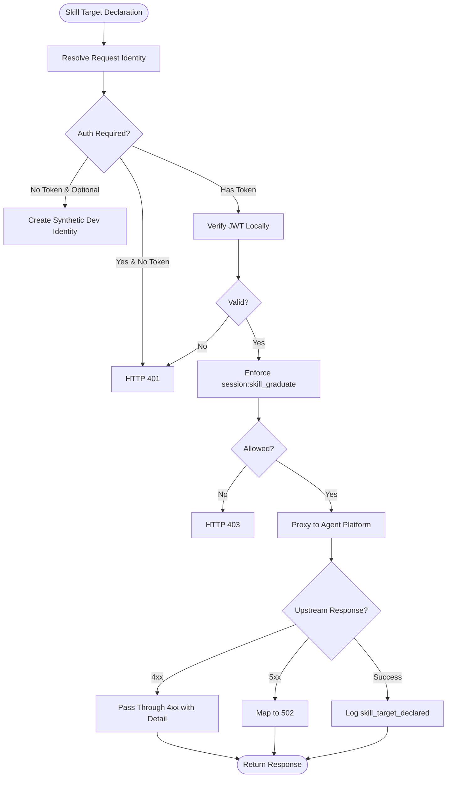

**Diagram sources**
- [sessions.py:194-242](file://products/platform-gateway/src/platform_gateway/api/routes/sessions.py#L194-L242)
- [gateway_service.py:556-595](file://products/platform-gateway/src/platform_gateway/services/gateway_service.py#L556-L595)

**Section sources**
- [sessions.py:194-242](file://products/platform-gateway/src/platform_gateway/api/routes/sessions.py#L194-L242)
- [gateway_service.py:556-595](file://products/platform-gateway/src/platform_gateway/services/gateway_service.py#L556-L595)
- [SPEC-055 spec.md:150-200](file://docs/specs/SPEC-055-develop-as-you-go-skill-graduation/spec.md#L150-L200)

### Enhanced Policy Engine with Skill Graduation Action
**Updated** - Enhanced policy engine with new ACTION_SESSION_SKILL_GRADUATE constant and protected action registration for skill target declaration and graduation workflows.

#### New Protected Action
- **Action Name**: `session:skill_graduate`
- **Purpose**: Gates both skill target declaration and graduation of captured authoring traces
- **Trust Level**: Higher than session:skill_draft - requires operational roles only
- **Protected Actions Set**: Added to PROTECTED_ACTIONS frozenset for policy enforcement

#### Default Policy Bundle Updates
- **Role Grants**: platform-admin, approver, and operator roles granted session:skill_graduate action
- **Denial Posture**: developer and read-only-observer roles denied by default
- **Bundle Version**: Updated to v1 with new rule for skill graduation
- **Rule ID**: allow-operators-skill-graduate with priority 100

Key capabilities:
- Single action gates both declaration and graduation phases
- Prevents partial capability grants that could bypass security controls
- Maintains consistency with existing operational role postures
- Supports high-trust skill development workflows
- Enables proper audit trail coverage for skill graduation activities

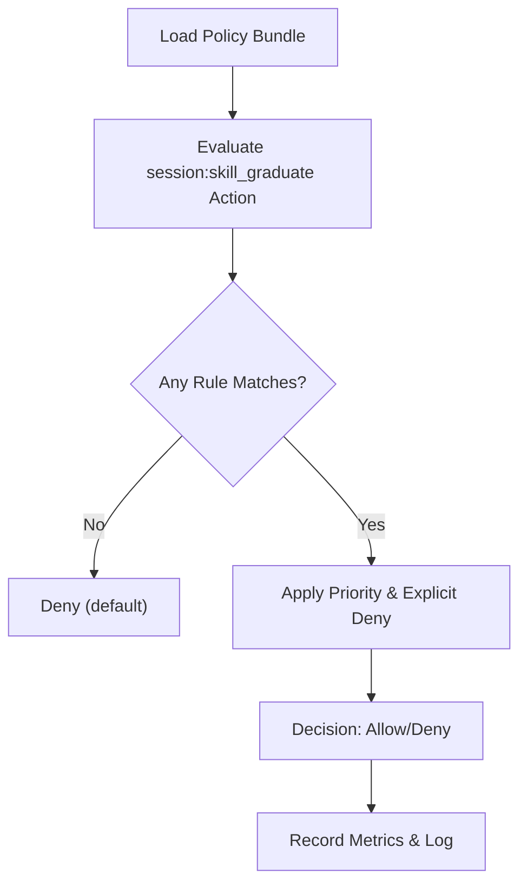

**Diagram sources**
- [policy_engine.py:82-91](file://products/platform-gateway/src/platform_gateway/services/policy_engine.py#L82-L91)
- [policy_engine.py:92-117](file://products/platform-gateway/src/platform_gateway/services/policy_engine.py#L92-L117)
- [policy-default.yaml:309-326](file://products/platform-gateway/src/platform_gateway/policies/policy-default.yaml#L309-L326)

**Section sources**
- [policy_engine.py:82-117](file://products/platform-gateway/src/platform_gateway/services/policy_engine.py#L82-L117)
- [policy-default.yaml:309-326](file://products/platform-gateway/src/platform_gateway/policies/policy-default.yaml#L309-L326)

### Enhanced Error Handling for Target Validation Failures
**Enhanced** - Improved error handling for skill target declaration with proper 4xx passthrough and 5xx mapping for target validation failures.

#### Error Handling Strategy
- **4xx Passthrough**: Unknown/foreign sessions (404), invalid targets (422) pass through with structured detail
- **5xx Mapping**: All server errors map to 502 with descriptive error messages
- **Detail Extraction**: Uses `_upstream_detail()` helper to extract structured error details from agent responses
- **Fallback Messages**: Provides meaningful fallback messages when structured details unavailable

#### Validation Failure Scenarios
- **Foreign Session**: Returns 404 with anti-enumeration protection
- **Unknown Session**: Returns 404 with anti-enumeration protection  
- **Invalid Target**: Returns 422 with detailed validation failure reason
- **Unnormalizable Origin**: Returns 422 when target cannot be normalized for corroboration
- **Service Unavailable**: Returns 502 when agent service is unreachable

Key capabilities:
- Consistent error handling pattern matching other proxy endpoints
- Preserves agent service structured error details for better debugging
- Provides clear user feedback for different types of validation failures
- Maintains security posture with anti-enumeration protection
- Enables proper troubleshooting through detailed error messages

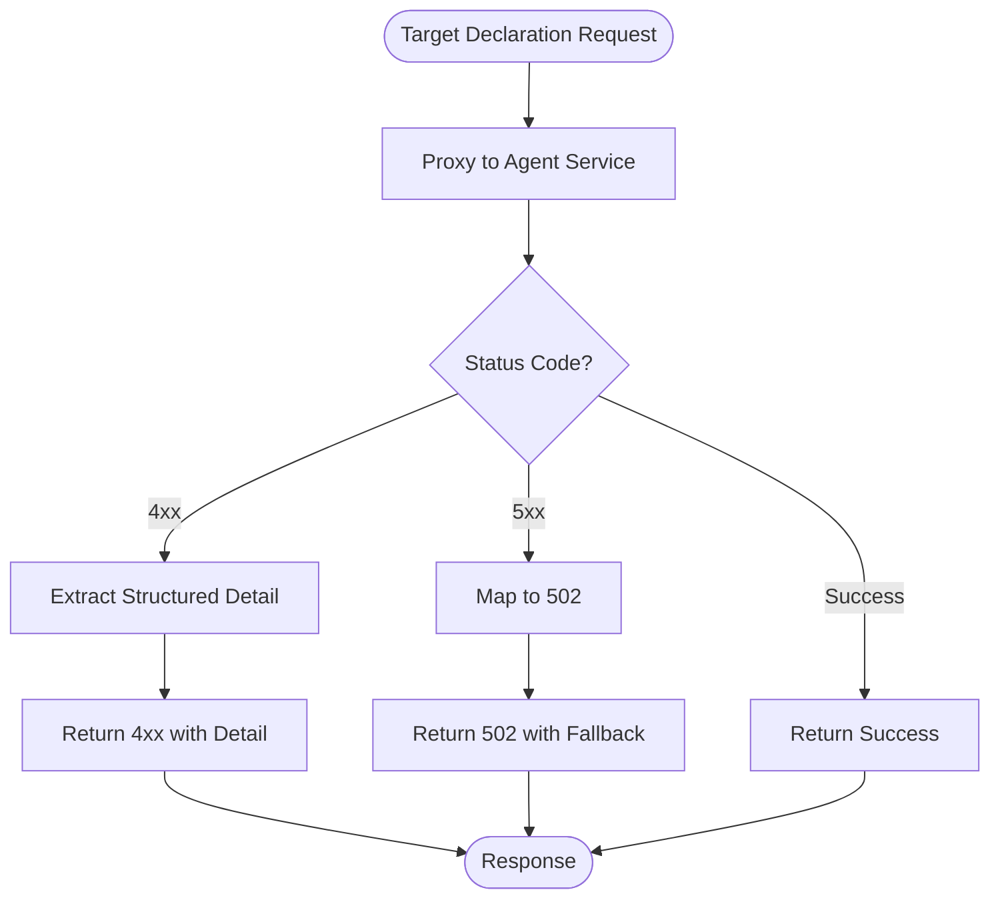

**Diagram sources**
- [gateway_service.py:575-595](file://products/platform-gateway/src/platform_gateway/services/gateway_service.py#L575-L595)
- [gateway_service.py:677-690](file://products/platform-gateway/src/platform_gateway/services/gateway_service.py#L677-L690)

**Section sources**
- [gateway_service.py:575-595](file://products/platform-gateway/src/platform_gateway/services/gateway_service.py#L575-L595)
- [gateway_service.py:677-690](file://products/platform-gateway/src/platform_gateway/services/gateway_service.py#L677-L690)

### Enhanced Streaming Chat Audit System
**Enhanced** - Implements robust error handling for streaming chat with comprehensive state tracking and fallback model attribution for streams closing without message_end frames.

#### Robust State Tracking
- **State Variables**: `saw_delta`, `parked`, `last_frame_session` track stream progress and context
- **Frame Parsing**: New helper functions `_frame_type()` and `_frame_session_id()` provide best-effort SSE frame parsing
- **Stream Completion Logic**: Handles both normal completion with message_end frames and abnormal closure without them

#### Fallback Model Attribution
- **Fallback Mechanism**: When streams close without message_end frames, uses requested model as fallback attribution
- **SPEC-024 Compliance**: Ensures complete audit coverage per SPEC-024 R-4 requirements
- **Model Resolution**: Request model > pinned model > default model resolution order maintained

#### Enhanced Error Handling
- **Early Status Checking**: Upstream status checked before any SSE frames yielded
- **Resource Cleanup**: Proper finally-block guards prevent resource leaks
- **Error Propagation**: Consistent 4xx passthrough and 5xx mapping to 502 errors

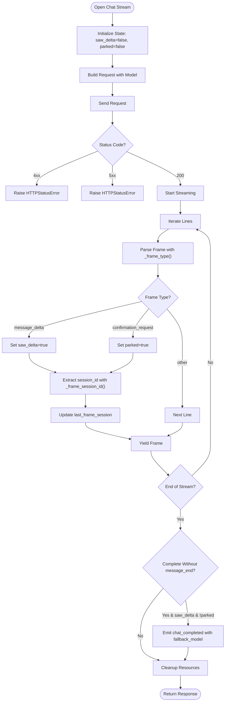

**Diagram sources**
- [gateway_service.py:1201-1227](file://products/platform-gateway/src/platform_gateway/services/gateway_service.py#L1201-L1227)
- [gateway_service.py:1229-1267](file://products/platform-gateway/src/platform_gateway/services/gateway_service.py#L1229-L1267)

**Section sources**
- [gateway_service.py:1201-1267](file://products/platform-gateway/src/platform_gateway/services/gateway_service.py#L1201-L1267)

### Enhanced Agent Client
**Updated** - Added new document repository methods, session title update method, and enhanced error handling for all operations.

- **New Methods**: 
  - `create_document()` creates documents with trusted foreign-session coverage header and type-specific payload handling
  - `list_documents()` lists documents with scope filtering
  - `fetch_document()` retrieves individual documents with anti-enumeration protection
  - `publish_document()` publishes documents for broader visibility
  - `delete_document()` deletes owner documents
  - `update_session_title()` updates session titles with ownership verification
  - **Enhanced**: `runtime_metadata()` method for retrieving agent-platform runtime information
- **Enhanced Methods**: `list_sessions()`, `delete_session()`, `get_session()` with proper error handling
- **Renamed Method**: `stream_chat` → `open_chat_stream` with eager upstream status checking
- **Error Handling**: Eager status checking prevents corrupt SSE streams by reading error responses before streaming
- **Resource Management**: Proper cleanup of HTTP connections and async resources in finally blocks
- **SSE Processing**: Filters and yields only data frames with proper SSE formatting

Key capabilities:
- Async streaming with configurable timeouts (connect: 5s, read/write: None for long-running streams)
- Status code validation before streaming begins (4xx errors raised immediately)
- Connection cleanup in finally blocks to prevent resource leaks
- SSE frame filtering to extract only relevant data frames
- Session workspace methods with consistent error handling patterns
- Document repository operations with trusted foreign-session coverage and type-specific payload handling
- Model catalog discovery with credential gating
- Runtime metadata retrieval for agent-platform communication
- Improved error propagation with proper HTTP status mapping

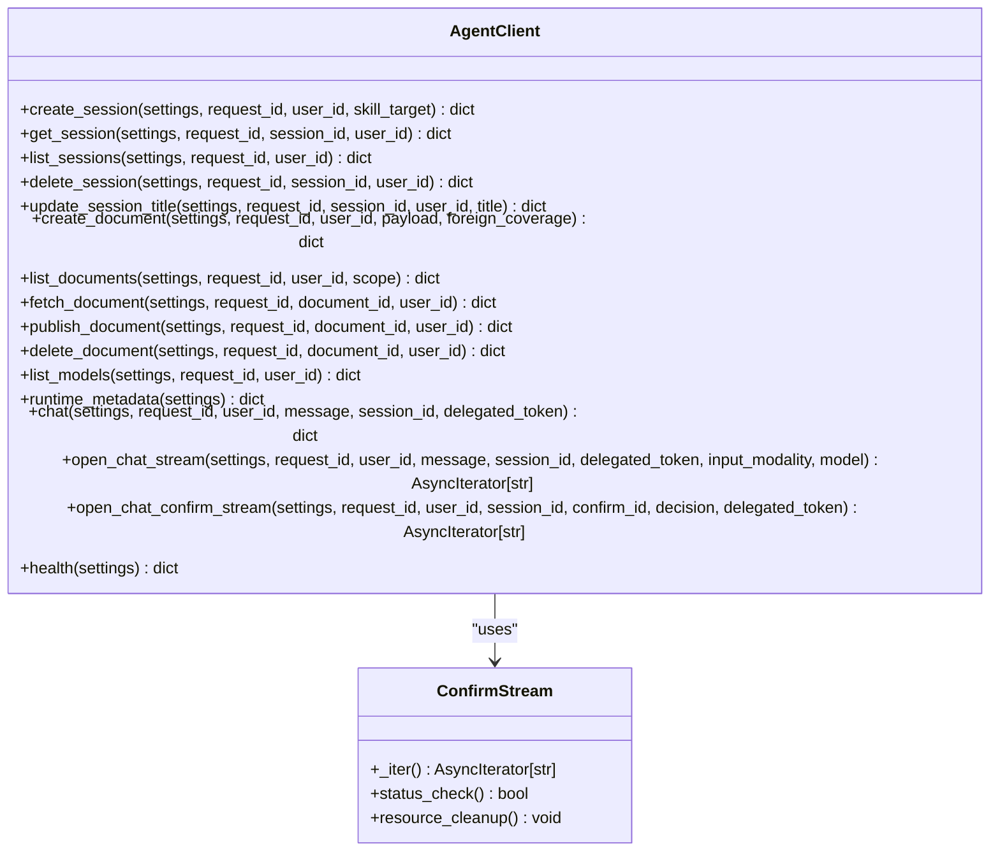

**Diagram sources**
- [agent_client.py:32-51](file://products/platform-gateway/src/platform_gateway/services/agent_client.py#L32-L51)
- [agent_client.py:145-200](file://products/platform-gateway/src/platform_gateway/services/agent_client.py#L145-L200)

**Section sources**
- [agent_client.py:1-200](file://products/platform-gateway/src/platform_gateway/services/agent_client.py#L1-L200)

### Enhanced Gateway Service
**Enhanced** - Enhanced with skill target declaration proxy functionality, improved error handling for target validation failures, session title update capability, enhanced chat streaming with robust state tracking and fallback model attribution, dual-action authorization for incident reports, improved error handling, enhanced runtime version exposure, and single-skill detail proxy functionality.

- Identity resolution supports local JWT verification and synthetic dev identity when auth is optional.
- Policy enforcement uses evaluate() from the policy engine; denies by default and records decisions.
- Proxies chat and session operations to agent-platform via agent_client.
- Provides streaming chat via StreamingResponse.
- Session workspace proxy with proper error handling (upstream 4xx passthrough, transport failures map to 502).
- Skill target declaration proxy with improved error handling for target validation failures.
- Chat confirm handling with SSE streaming and confirmation_decided audit event emission.
- Document repository proxy with trusted foreign-session coverage computation, dual-action authorization for incident reports, and type-specific payload handling.
- Model catalog proxy with consistent error handling pattern matching other proxy endpoints.
- Chat streaming with robust state tracking (saw_delta, parked, last_frame_session) and fallback model attribution for streams closing without message_end frames.
- Runtime status function that merges platform version from SERVICE_VERSION into the runtime payload for enhanced version tracking and monitoring capabilities.
- Enhanced streaming architecture with improved error propagation using helper functions (_frame_type, _frame_session_id).

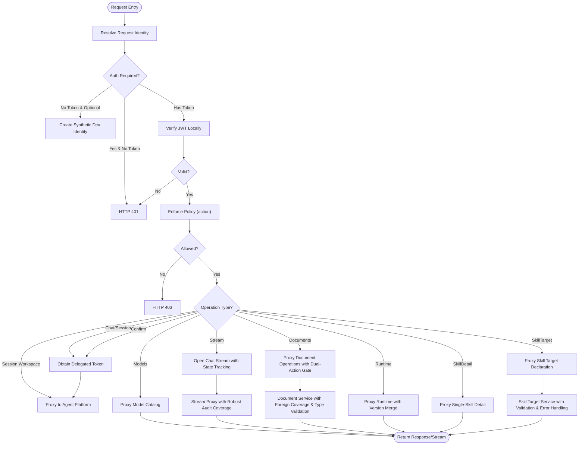

**Diagram sources**
- [gateway_service.py:556-595](file://products/platform-gateway/src/platform_gateway/services/gateway_service.py#L556-L595)
- [gateway_service.py:1201-1267](file://products/platform-gateway/src/platform_gateway/services/gateway_service.py#L1201-L1267)
- [token_verifier.py:1-99](file://products/platform-gateway/src/platform_gateway/services/token_verifier.py#L1-L99)
- [delegation_client.py:1-229](file://products/platform-gateway/src/platform_gateway/services/delegation_client.py#L1-L229)

**Section sources**
- [gateway_service.py:556-595](file://products/platform-gateway/src/platform_gateway/services/gateway_service.py#L556-L595)
- [gateway_service.py:1201-1267](file://products/platform-gateway/src/platform_gateway/services/gateway_service.py#L1201-L1267)

### Enhanced Operations Document Repository
**Enhanced** - Implements operations document repository functionality with policy enforcement, trusted foreign-session coverage decisions, and support for both shift_summary and incident_report document types with dual-action authorization for incident reports.

#### Document Creation with Dual-Action Authorization
- **Endpoint**: POST /api/v1/documents
- **Authentication**: Requires `documents:create` action enforcement with identity verification
- **Dual-Action Gate**: For incident_report documents, additionally requires `incident:read` action enforcement
- **Foreign Coverage Computation**: Evaluates `approvals:list` capability to determine if user can cover foreign sessions
- **Type-Specific Payload Handling**: Removes cross-type fields (session_ids for incident_report, incident_id for shift_summary) before forwarding
- **Trusted Header**: Forwards `X-Foreign-Coverage: allowed|denied` to agent service
- **Response**: Created document with digest containing type-specific metadata (session IDs for shift_summary, incident_id for incident_report)
- **Audit Trail**: Emits `document_created` event with document_type, foreign coverage information, and incident_id for incident reports

#### Document Listing and Reading
- **Endpoints**: GET /api/v1/documents (list), GET /api/v1/documents/{document_id} (fetch)
- **Authentication**: Requires `documents:read` action enforcement with identity verification
- **Scoping**: Supports `mine` (includes drafts) and `published` scopes
- **Response**: Document list or single document with appropriate visibility
- **Security**: Foreign draft reads return 404 for anti-enumeration protection

#### Document Publishing and Deletion
- **Endpoints**: POST /api/v1/documents/{document_id}/publish (publish), DELETE /api/v1/documents/{document_id} (delete)
- **Authentication**: Requires `documents:create` action enforcement with identity verification
- **Publishing**: One-way owner publish that exposes document to all `documents:read` holders
- **Deletion**: Owner-only document deletion with anti-enumeration protection
- **Audit Trail**: Emits `document_published` and `document_deleted` events

Key capabilities:
- Deny-by-default policy enforcement for document operations
- Dual-action authorization for incident_report documents requiring both `documents:create` and `incident:read`
- Trusted foreign-session coverage computation prevents unauthorized access to foreign session data
- Type-specific payload validation ensuring shift_summary uses session_ids and incident_report uses incident_id
- Server-side visibility matrix enforcement ensures proper document access control
- Consistent error handling: upstream 4xx passthrough, transport failures map to 502
- Comprehensive audit trail coverage for document lifecycle events with type-specific metadata
- Request correlation via x-request-id headers throughout the chain
- Role-based access control restricted to platform-admin, approver, and operator roles

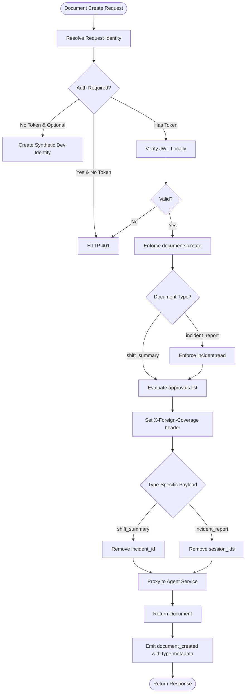

**Diagram sources**
- [documents.py:30-86](file://products/platform-gateway/src/platform_gateway/api/routes/documents.py#L30-L86)
- [gateway_service.py:692-729](file://products/platform-gateway/src/platform_gateway/services/gateway_service.py#L692-L729)
- [agent_client.py:320-337](file://products/platform-gateway/src/platform_gateway/services/agent_client.py#L320-L337)

**Section sources**
- [documents.py:1-188](file://products/platform-gateway/src/platform_gateway/api/routes/documents.py#L1-L188)
- [gateway_service.py:692-729](file://products/platform-gateway/src/platform_gateway/services/gateway_service.py#L692-L729)
- [agent_client.py:320-402](file://products/platform-gateway/src/platform_gateway/services/agent_client.py#L320-L402)
- [api.py:68-105](file://products/platform-gateway/src/platform_gateway/schemas/api.py#L68-L105)

### Enhanced Session Workspace Proxy Routes
**Updated** - Provides complete session workspace lifecycle management with deny-by-default policy enforcement, server-side scoping to caller's own sessions, new owner-only session rename capability, skill target declaration for develop-as-you-go sessions, and enhanced dual authorization for development session creation.

#### Session Creation with Dual Authorization
- **Endpoint**: POST /api/v1/sessions
- **Authentication**: Requires `session:create` action enforcement with identity verification
- **Enhanced**: Development sessions additionally require `session:skill_graduate` action enforcement
- **Request Body**: Session creation parameters with optional session_type and skill_target
- **Response**: Created session details with session_id and session_type
- **Audit Trail**: Emits `session_created` audit event with success outcome, session_type, and skill_target_declared flags

#### Session Listing  
- **Endpoint**: GET /api/v1/sessions
- **Authentication**: Requires `session:list` action enforcement with identity verification
- **Scoping**: Server-side filtering returns only caller's own sessions (SPEC-022 R-1)
- **Response**: List of sessions belonging to the authenticated user
- **Logging**: Tracks session count and user context
- **Error Handling**: Upstream 4xx errors pass through unchanged, transport failures and upstream 5xx map to 502

#### Session Reading
- **Endpoint**: GET /api/v1/sessions/{session_id}
- **Authentication**: Requires `session:read` action enforcement with identity verification
- **Error Handling**: Upstream 4xx errors (unknown/foreign sessions) pass through unchanged for anti-enumeration
- **Response**: Session details if accessible to caller
- **Security**: Foreign session access results in 404 to prevent enumeration

#### Session Deletion
- **Endpoint**: DELETE /api/v1/sessions/{session_id}
- **Authentication**: Requires `session:delete` action enforcement with identity verification
- **Error Handling**: Upstream 4xx errors (unknown/foreign sessions, parked confirmations) pass through unchanged
- **Audit Trail**: Emits `session_deleted` audit event with success outcome
- **Security**: Owner-only deletion with server-side ownership verification

#### Session Title Update (New)
- **Endpoint**: PATCH /api/v1/sessions/{session_id}/title
- **Authentication**: Requires `session:update` action enforcement with identity verification
- **Ownership**: Server-side ownership verification ensures callers can only rename their own sessions
- **Error Handling**: Upstream 4xx errors (blank/overlong titles, unknown/foreign sessions) pass through unchanged
- **Security**: Anti-enumeration protection returns 404 for foreign/unknown sessions
- **Scope**: Mirrors session:create grants across all roles with server-side scoping

#### Skill Target Declaration (New)
- **Endpoint**: POST /api/v1/sessions/{session_id}/skill-target
- **Authentication**: Requires `session:skill_graduate` action enforcement with identity verification
- **Functionality**: Declares web target for develop-as-you-go skill development sessions
- **Error Handling**: Upstream 4xx errors (invalid targets, foreign sessions) pass through with structured detail
- **Security**: Higher trust level than skill drafting - requires operational roles only
- **Audit Trail**: Emits `skill_target_declared` event with already_declared flag

Key capabilities:
- Deny-by-default policy enforcement for all session operations including owner rename and skill target declaration
- **Enhanced**: Development session creation requires dual authorization - both `session:create` and `session:skill_graduate` actions
- Server-side scoping ensures callers can only access and modify their own sessions
- Consistent error handling: upstream 4xx passthrough, transport failures map to 502
- Durable audit trail coverage for session lifecycle events
- Request correlation via x-request-id headers throughout the chain
- Owner-only session rename with validation and anti-enumeration protection
- High-trust skill target declaration with proper authorization controls

```mermaid
flowchart TD
Start(["Session Request"]) --> Type{"Operation Type?"}
Type --> |Create| CreateFlow["Create Session Flow with Dual Auth"]
Type --> |List| ListFlow["List Sessions Flow"]
Type --> |Read| ReadFlow["Read Session Flow"]
Type --> |Delete| DeleteFlow["Delete Session Flow"]
Type --> |UpdateTitle| UpdateFlow["Update Session Title Flow"]
Type --> |SkillTarget| SkillTargetFlow["Skill Target Declaration Flow"]
subgraph CreateFlow
C1["Enforce session:create"] --> C2{"session_type == 'development'?"}
C2 --> |Yes| C3["Enforce session:skill_graduate"]
C2 --> |No| C4["Resolve Identity"]
C3 --> C4
C4 --> C5["Proxy to Agent Platform"]
C5 --> C6["Emit session_created audit"]
C6 --> CReturn(["Return Session"])
end
subgraph ListFlow
L1["Enforce session:list"] --> L2["Resolve Identity"]
L2 --> L3["List Caller's Sessions"]
L3 --> LReturn(["Return Session List"])
end
subgraph ReadFlow
R1["Enforce session:read"] --> R2["Resolve Identity"]
R2 --> R3{"Upstream 4xx?"}
R3 --> |Yes| RPass["Pass Through 4xx"]
R3 --> |No| RProxy["Proxy to Agent Platform"]
RProxy --> RReturn(["Return Session"])
end
subgraph DeleteFlow
D1["Enforce session:delete"] --> D2["Resolve Identity"]
D2 --> D3{"Upstream 4xx?"}
D3 --> |Yes| DPass["Pass Through 4xx"]
D3 --> |No| DProxy["Proxy to Agent Platform"]
DProxy --> DAudit["Emit session_deleted audit"]
DAudit --> DReturn(["Return Result"])
end
subgraph UpdateFlow
U1["Enforce session:update"] --> U2["Resolve Identity"]
U2 --> U3{"Upstream 4xx?"}
U3 --> |Yes| UPass["Pass Through 4xx"]
U3 --> |No| UProxy["Proxy to Agent Platform"]
UProxy --> UReturn(["Return Updated Title"])
end
subgraph SkillTargetFlow
ST1["Enforce session:skill_graduate"] --> ST2["Resolve Identity"]
ST2 --> ST3{"Upstream 4xx?"}
ST3 --> |Yes| STPass["Pass Through 4xx"]
ST3 --> |No| STProxy["Proxy to Agent Platform"]
STProxy --> STAudit["Emit skill_target_declared"]
STAudit --> STReturn(["Return Declaration Result"])
end
```

**Diagram sources**
- [sessions.py:41-361](file://products/platform-gateway/src/platform_gateway/api/routes/sessions.py#L41-L361)
- [gateway_service.py:331-371](file://products/platform-gateway/src/platform_gateway/services/gateway_service.py#L331-L371)
- [agent_client.py:32-51](file://products/platform-gateway/src/platform_gateway/services/agent_client.py#L32-L51)
- [audit_emitter.py:1-99](file://products/platform-gateway/src/platform_gateway/services/audit_emitter.py#L1-L99)

**Section sources**
- [sessions.py:41-361](file://products/platform-gateway/src/platform_gateway/api/routes/sessions.py#L41-L361)
- [gateway_service.py:331-371](file://products/platform-gateway/src/platform_gateway/services/gateway_service.py#L331-L371)

### Enhanced Skills Inventory with Single-Skill Detail Access
**Updated** - Enhanced skills inventory functionality to support full skill record retrieval including body content through the new single-skill detail proxy endpoint.

#### Single-Skill Detail Endpoint
- **Endpoint**: GET /api/v1/skills/{skill_id:path}
- **Authentication**: Requires `skills:read` action enforcement with identity verification
- **Functionality**: Retrieves full skill record including body content from skills-hub
- **Response**: Complete skill record with metadata and body content
- **Purpose**: Enables operators to read the actual content of ingested skills that drive tool behavior and HITL gates

#### Implementation Details
- **Route Order**: Declared after the exact `/api/v1/skills` list route to prevent greedy path matching
- **Skill ID Format**: Accepts namespaced `<source_id>/<slug>` form with embedded slashes preserved literally
- **Credential Handling**: Uses gateway-held Basic credentials (`skills_client_id`/`skills_client_secret`) - never forwards user token
- **Error Mapping**: Consistent with list proxy - unknown id → 404 passthrough, unconfigured → 503, transport/5xx → 502
- **Audit Trail**: Logs `skill_detail_proxied` event with request_id, user_id, and skill_id

Key capabilities:
- Reuses existing `skills:read` policy action - no new policy surface
- Maintains same security posture as skills list endpoint
- Supports full skill content viewing for operator transparency
- Preserves URL-safe character set for skill IDs
- Integrates seamlessly with existing skills infrastructure
- Provides lazy loading pattern where detail is only fetched when View is invoked

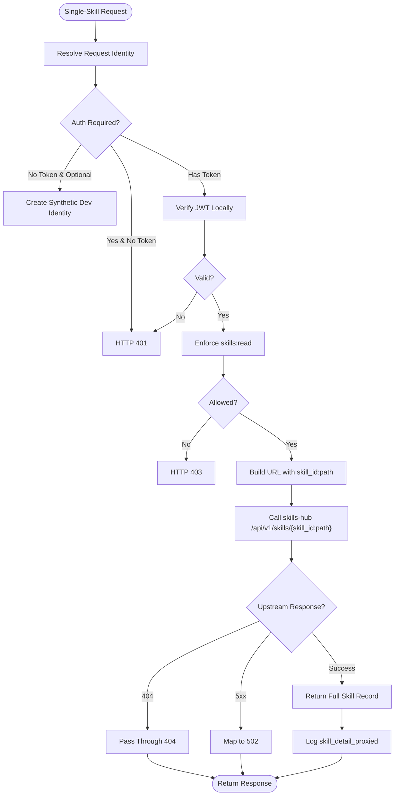

**Diagram sources**
- [skills.py:55-78](file://products/platform-gateway/src/platform_gateway/api/routes/skills.py#L55-L78)
- [skills_hub_client.py:81-109](file://products/platform-gateway/src/platform_gateway/services/skills_hub_client.py#L81-L109)

**Section sources**
- [skills.py:1-79](file://products/platform-gateway/src/platform_gateway/api/routes/skills.py#L1-L79)
- [skills_hub_client.py:1-110](file://products/platform-gateway/src/platform_gateway/services/skills_hub_client.py#L1-L110)
- [SPEC-052 spec.md:57-82](file://docs/specs/SPEC-052-skill-content-viewer/spec.md#L57-L82)

### Enhanced Runtime Endpoint
**Updated** - Provides platform version information through /api/v1/runtime endpoint by merging SERVICE_VERSION into payload for enhanced version tracking and monitoring capabilities across the platform.

#### Runtime Metadata Endpoint
- **Endpoint**: GET /api/v1/runtime
- **Authentication**: No authentication required (public endpoint)
- **Functionality**: Retrieves runtime metadata from agent-platform and merges platform version information
- **Response**: Combined payload containing agent-platform runtime metadata plus platform version from SERVICE_VERSION
- **Purpose**: Enables better version tracking and monitoring capabilities across the platform by exposing platform version alongside runtime information

#### Implementation Details
- **Version Merging**: The runtime_status function retrieves metadata from agent-platform's /api/v2/runtime endpoint and merges the platform version from SERVICE_VERSION into the payload
- **Service Version**: Uses SERVICE_VERSION constant from metadata.py (currently "0.27.2")
- **Error Handling**: Inherits error handling from agent_client.runtime_metadata() method
- **Performance**: Minimal overhead with single HTTP call to agent-platform plus simple dictionary merge

Key capabilities:
- Public endpoint accessible without authentication for version discovery
- Combines agent-platform runtime metadata with platform version information
- Enables centralized version tracking and monitoring across the platform
- Supports infrastructure automation and version compatibility checks
- Maintains consistency with other service endpoints pattern

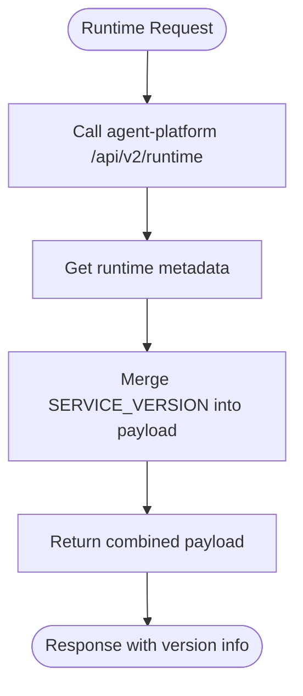

**Diagram sources**
- [runtime.py:9-13](file://products/platform-gateway/src/platform_gateway/api/routes/runtime.py#L9-L13)
- [gateway_service.py:90-95](file://products/platform-gateway/src/platform_gateway/services/gateway_service.py#L90-L95)
- [agent_client.py:471-477](file://products/platform-gateway/src/platform_gateway/services/agent_client.py#L471-L477)

**Section sources**
- [runtime.py:1-14](file://products/platform-gateway/src/platform_gateway/api/routes/runtime.py#L1-L14)
- [gateway_service.py:90-95](file://products/platform-gateway/src/platform_gateway/services/gateway_service.py#L90-L95)
- [metadata.py:1-6](file://products/platform-gateway/src/platform_gateway/metadata.py#L1-L6)

### Chat Confirm Endpoint
**Existing** - Provides Human-in-the-Loop (HITL) confirmation bridging for parked kernel confirmations with identity delegation and SSE streaming.

- **Endpoint**: POST /api/v1/chat/confirm
- **Authentication**: Requires `chat:confirm` action enforcement with identity verification
- **Request Body**: Session ID, confirmation ID, and decision (approve/deny)
- **Response**: SSE stream containing confirmation results and subsequent messages
- **Audit Trail**: Emits `confirmation_decided` event when kernel confirms the decision was applied

Key features:
- Identity delegation via broker-mediated token exchange for downstream tool access
- SSE streaming for real-time confirmation results and subsequent messages
- Durable audit trail integration with confirmation_decided events
- Proper error mapping: 4xx passthrough for unknown/expired confirmations, 502 for transport failures
- Policy enforcement with role-based access control (operators, developers, approvers allowed)

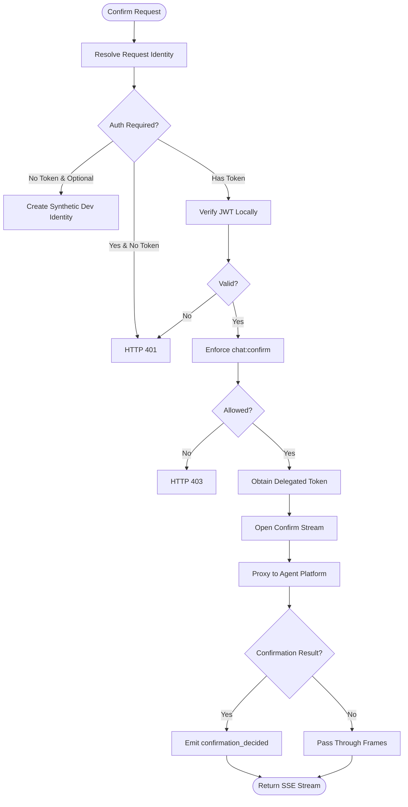

**Diagram sources**
- [chat.py:146-187](file://products/platform-gateway/src/platform_gateway/api/routes/chat.py#L146-L187)
- [gateway_service.py:503-563](file://products/platform-gateway/src/platform_gateway/services/gateway_service.py#L503-L563)
- [agent_client.py:201-256](file://products/platform-gateway/src/platform_gateway/services/agent_client.py#L201-L256)

**Section sources**
- [chat.py:146-187](file://products/platform-gateway/src/platform_gateway/api/routes/chat.py#L146-L187)
- [gateway_service.py:503-563](file://products/platform-gateway/src/platform_gateway/services/gateway_service.py#L503-L563)

### Policy Matrix Endpoint
**Existing** - Provides live permission matrix evaluation derived from the currently enforced policy bundle with role-scoped visibility.

- **Endpoint**: GET /api/v1/policy/matrix
- **Authentication**: Requires `policy:read` action enforcement
- **Scoping**: 
  - `platform-admin` role receives full matrix with all roles and permissions
  - Other roles receive only their granted permissions (scope: "own")
- **Response**: Includes version, source, scope, roles, actions, and matrix data

Key features:
- Real-time evaluation using the same policy engine as enforcement
- Server-side role filtering ensures minimal data exposure
- Metadata includes bundle version and source (configured vs packaged-default)
- Comprehensive error handling for policy load failures (503)
- Audit logging with user context and scope information

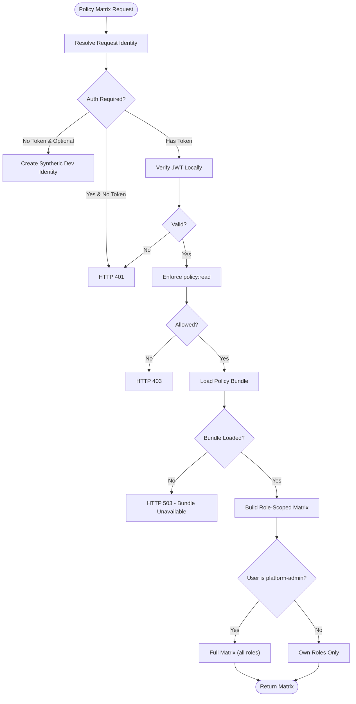

**Diagram sources**
- [policy.py:30-55](file://products/platform-gateway/src/platform_gateway/api/routes/policy.py#L30-L55)
- [policy_matrix.py:25-62](file://products/platform-gateway/src/platform_gateway/services/policy_matrix.py#L25-L62)
- [policy_engine.py:188-198](file://products/platform-gateway/src/platform_gateway/services/policy_engine.py#L188-L198)

**Section sources**
- [policy.py:1-55](file://products/platform-gateway/src/platform_gateway/api/routes/policy.py#L1-L55)
- [policy_matrix.py:1-62](file://products/platform-gateway/src/platform_gateway/services/policy_matrix.py#L1-L62)

### Workspace Proxy Endpoints
**Existing** - Provides read-only workspace inventory discovery for tools and skills with appropriate authentication patterns and enhanced error handling.

#### Tools Catalog Discovery
- **Endpoint**: GET /api/v1/tools
- **Authentication**: Requires `tools:list` action + broker-mediated delegated token
- **Upstream**: Forwards to tool-gateway's `/api/v2/tools` with delegated token
- **Error Handling**: 503 when delegation chain unavailable, 502 on transport failures

#### Skills Inventory Listing  
- **Endpoint**: GET /api/v1/skills with query parameters (offset, limit, source, tag)
- **Authentication**: Requires `skills:read` action + Basic credentials (SKILLS_QUERY_CLIENTS)
- **Upstream**: Forwards to skills-hub's `/api/v1/skills` with Basic auth
- **Validation**: Query parameters validated (limit 1-100, offset ≥ 0)
- **Error Handling**: 503 when unconfigured, 502 on transport failures, 4xx passthrough

#### Single-Skill Detail Retrieval (New)
- **Endpoint**: GET /api/v1/skills/{skill_id:path}
- **Authentication**: Requires `skills:read` action + Basic credentials (SKILLS_QUERY_CLIENTS)
- **Upstream**: Forwards to skills-hub's `/api/v1/skills/{skill_id:path}` with Basic auth
- **Validation**: Skill ID accepts namespaced format with embedded slashes
- **Error Handling**: 503 when unconfigured, 502 on transport failures, 4xx passthrough

Key capabilities:
- Consistent error mapping across all workspace proxies
- Configurable timeouts (10 seconds default)
- Request correlation via x-request-id headers
- Comprehensive audit logging with operation context
- Support for full skill content retrieval with body preservation

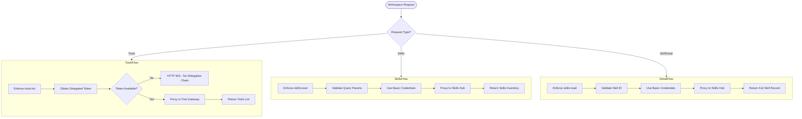

**Diagram sources**
- [tools.py:39-69](file://products/platform-gateway/src/platform_gateway/api/routes/tools.py#L39-L69)
- [skills.py:27-78](file://products/platform-gateway/src/platform_gateway/api/routes/skills.py#L27-L78)
- [skills_hub_client.py:58-109](file://products/platform-gateway/src/platform_gateway/services/skills_hub_client.py#L58-L109)
- [tool_gateway_client.py:54-76](file://products/platform-gateway/src/platform_gateway/services/tool_gateway_client.py#L54-L76)
- [skills_hub_client.py:58-79](file://products/platform-gateway/src/platform_gateway/services/skills_hub_client.py#L58-L79)

**Section sources**
- [tools.py:1-69](file://products/platform-gateway/src/platform_gateway/api/routes/tools.py#L1-L69)
- [skills.py:1-79](file://products/platform-gateway/src/platform_gateway/api/routes/skills.py#L1-L79)
- [tool_gateway_client.py:1-76](file://products/platform-gateway/src/platform_gateway/services/tool_gateway_client.py#L1-L76)
- [skills_hub_client.py:1-110](file://products/platform-gateway/src/platform_gateway/services/skills_hub_client.py#L1-L110)

### Incident Proxy Routes
**Existing** - Provides unified API access to the incident-service with comprehensive policy enforcement and credential management.

- **List Incidents**: GET /api/v1/incidents with filtering by status, severity, source, limit, and offset
- **Create Incident**: POST /api/v1/incidents for manual incident reporting with reported_by tracking
- **Get Incident Detail**: GET /api/v1/incidents/{incident_id} with incident ID validation
- **Get Report**: GET /api/v1/incidents/{incident_id}/report for triage reports
- **Run Triage**: POST /api/v1/incidents/{incident_id}/triage requiring operator delegation chain

Key features:
- Per-action policy enforcement (incident:read, incident:create, incident:triage)
- Basic credential authentication to incident-service (never forwards user tokens)
- Operator identity forwarding via X-User-ID header for triage operations
- Delegated token forwarding via X-Delegated-Token header for agent turn execution
- Strict incident ID validation (pattern: inc-<lowercase alphanumeric>)
- Comprehensive error mapping (503 when unconfigured, 502 on transport failures, 4xx passthrough)

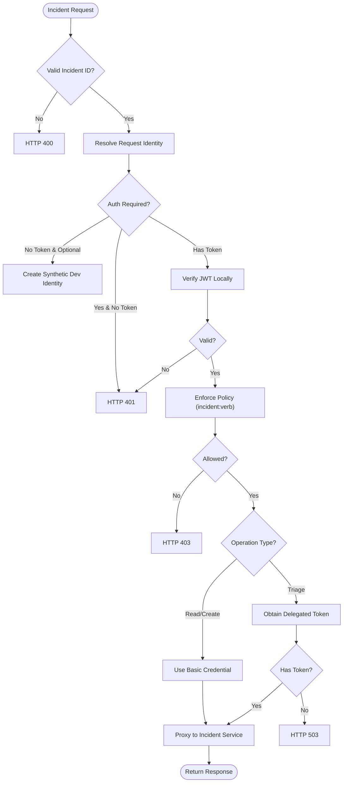

**Diagram sources**
- [incidents.py:63-183](file://products/platform-gateway/src/platform_gateway/api/routes/incidents.py#L63-L183)
- [incident_client.py:35-193](file://products/platform-gateway/src/platform_gateway/services/incident_client.py#L35-L193)

**Section sources**
- [incidents.py:1-183](file://products/platform-gateway/src/platform_gateway/api/routes/incidents.py#L1-L183)

### Policy Engine and Default Bundle
**Updated** - Enhanced with new session:skill_graduate action and role-based access control for skill graduation workflows.

- Loads YAML policy bundle and evaluates actions against roles with deny-by-default semantics.
- Explicit deny overrides allow; higher priority rules win among allows; disabled rules ignored.
- Default bundle now includes new protected actions with appropriate role-based access control:
  - `policy:read` granted to operational, developer, and observer roles for transparency
  - `tools:list` restricted to operational and developer roles for workspace visibility
  - `skills:read` granted to operational, developer, and observer roles for guidance visibility
  - `chat:confirm` restricted to operators, developers, approvers, and platform admins for HITL confirmations
  - `models:list` granted to operators and observers for model catalog discovery (mirrors chat scope)
  - `session:list` and `session:delete` mirror `session:create` grants with server-side scoping to caller's own sessions
  - `documents:create` and `documents:read` granted to platform-admin, approver, and operator roles for document operations with dual-action authorization for incident reports
  - `session:update` mirrors session lifecycle grants with server-side ownership verification
  - **New**: `session:skill_graduate` granted to platform-admin, approver, and operator roles for skill target declaration and graduation

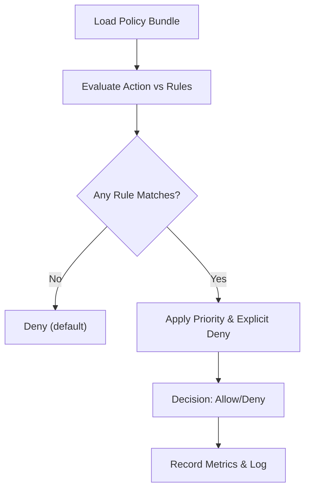

**Diagram sources**
- [policy-default.yaml:309-326](file://products/platform-gateway/src/platform_gateway/policies/policy-default.yaml#L309-L326)
- [gateway_service.py:222-254](file://products/platform-gateway/src/platform_gateway/services/gateway_service.py#L222-L254)
- [policy_engine.py:25-55](file://products/platform-gateway/src/platform_gateway/services/policy_engine.py#L25-L55)

**Section sources**
- [policy-default.yaml:309-326](file://products/platform-gateway/src/platform_gateway/policies/policy-default.yaml#L309-L326)
- [gateway_service.py:222-254](file://products/platform-gateway/src/platform_gateway/services/gateway_service.py#L222-L254)
- [policy_engine.py:25-55](file://products/platform-gateway/src/platform_gateway/services/policy_engine.py#L25-L55)

### Application Bootstrap and Middleware
**Existing** - FastAPI app creation with HTTP request logging middleware capturing method, path, status, duration, and request correlation id.

- Includes routers, sets up metrics and telemetry with service name/version metadata.

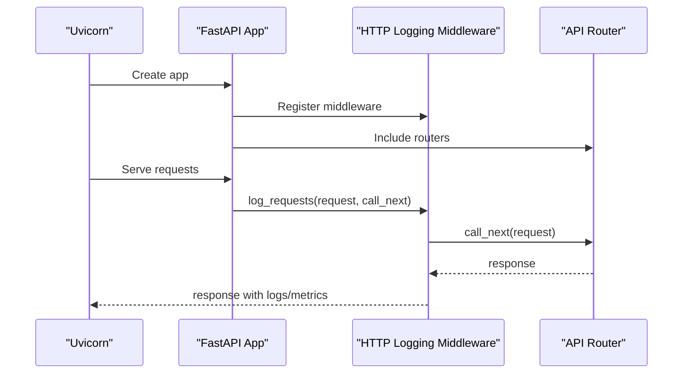

**Diagram sources**
- [main.py:1-9](file://products/platform-gateway/src/platform_gateway/main.py#L1-L9)
- [app.py:1-44](file://products/platform-gateway/src/platform_gateway/app.py#L1-L44)
- [router.py:1-35](file://products/platform-gateway/src/platform_gateway/api/router.py#L1-L35)

**Section sources**
- [main.py:1-9](file://products/platform-gateway/src/platform_gateway/main.py#L1-L9)
- [app.py:1-44](file://products/platform-gateway/src/platform_gateway/app.py#L1-L44)

## Dependency Analysis
**Enhanced** - Enhanced with new skill target declaration dependencies and improved error handling patterns.

High-level dependencies:
- main.py depends on app.py and runtime settings.
- app.py depends on router, metrics, observability, request context, telemetry, and metadata.
- api routes depend on gateway_service, config, schemas, and delegation_client.
- Sessions route depends on gateway_service for session workspace operations and audit_emitter for session lifecycle events.
- **Enhanced**: Session creation route now implements dual authorization requiring both `session:create` and `session:skill_graduate` actions for development sessions.
- Skill target declaration route depends on gateway_service for policy enforcement and agent_client for target validation.
- Documents route depends on gateway_service for document repository operations with dual-action authorization and audit_emitter for document lifecycle events.
- Chat confirm route depends on gateway_service for confirm handling and audit_emitter for confirmation_decided events.
- Policy routes depend on policy_engine and policy_matrix for live permission evaluation.
- Workspace proxy routes depend on tool_gateway_client and skills_hub_client for inventory discovery, including single-skill detail retrieval.
- Model catalog route depends on gateway_service for model catalog proxy and audit_emitter for models_listed events.
- Runtime route depends on gateway_service for runtime status with version merging and agent_client for runtime metadata retrieval.
- **Enhanced**: Skills route depends on gateway_service for policy enforcement and skills_hub_client for both list and detail operations.
- gateway_service depends on agent_client, delegation_client, token_verifier, and policy_engine.
- agent_client includes document repository methods with type-specific payload handling, session title update method, open_chat_confirm_stream method, list_models method, runtime_metadata method, and enhanced session workspace methods for confirm handling.
- incident_client depends on httpx and config for incident-service communication.
- delegation_client depends on httpx, jwt, cryptography, and config.
- token_verifier depends on jwt and PyJWKClient.

```mermaid
graph TB
Main["main.py"] --> App["app.py"]
App --> Router["api/router.py"]
Router --> Chat["api/routes/chat.py"]
Router --> Sessions["api/routes/sessions.py"]
Router --> Documents["api/routes/documents.py"]
Router --> Incidents["api/routes/incidents.py"]
Router --> Policy["api/routes/policy.py"]
Router --> Tools["api/routes/tools.py"]
Router --> Skills["api/routes/skills.py"]
Router --> Models["api/routes/models.py"]
Router --> Runtime["api/routes/runtime.py"]
Chat --> GwSvc["services/gateway_service.py"]
Sessions --> GwSvc
Documents --> GwSvc
Incidents --> IncClient["services/incident_client.py"]
Policy --> PolEngine["services/policy_engine.py"]
Policy --> PolMatrix["services/policy_matrix.py"]
Tools --> TgClient["services/tool_gateway_client.py"]
Skills --> ShClient["services/skills_hub_client.py"]
Models --> GwSvc
Runtime --> GwSvc
GwSvc --> Agent["services/agent_client.py"]
GwSvc --> Deleg["services/delegation_client.py"]
GwSvc --> Verify["services/token_verifier.py"]
GwSvc --> Policy["policies/policy-default.yaml"]
GwSvc --> Audit["services/audit_emitter.py"]
IncClient --> Config["core/config.py"]
App --> Config
App --> RuntimeSettings["core/runtime.py"]
ShClient --> SkillsHub["skills-hub service"]
```

**Diagram sources**
- [main.py:1-9](file://products/platform-gateway/src/platform_gateway/main.py#L1-L9)
- [app.py:1-44](file://products/platform-gateway/src/platform_gateway/app.py#L1-L44)
- [router.py:1-35](file://products/platform-gateway/src/platform_gateway/api/router.py#L1-L35)
- [chat.py:1-187](file://products/platform-gateway/src/platform_gateway/api/routes/chat.py#L1-L187)
- [sessions.py:1-361](file://products/platform-gateway/src/platform_gateway/api/routes/sessions.py#L1-L361)
- [documents.py:1-188](file://products/platform-gateway/src/platform_gateway/api/routes/documents.py#L1-L188)
- [incidents.py:1-183](file://products/platform-gateway/src/platform_gateway/api/routes/incidents.py#L1-L183)
- [policy.py:1-55](file://products/platform-gateway/src/platform_gateway/api/routes/policy.py#L1-L55)
- [tools.py:1-69](file://products/platform-gateway/src/platform_gateway/api/routes/tools.py#L1-L69)
- [skills.py:1-79](file://products/platform-gateway/src/platform_gateway/api/routes/skills.py#L1-L79)
- [models.py:1-46](file://products/platform-gateway/src/platform_gateway/api/routes/models.py#L1-L46)
- [runtime.py:1-14](file://products/platform-gateway/src/platform_gateway/api/routes/runtime.py#L1-L14)
- [gateway_service.py:1-1363](file://products/platform-gateway/src/platform_gateway/services/gateway_service.py#L1-L1363)
- [incident_client.py:1-193](file://products/platform-gateway/src/platform_gateway/services/incident_client.py#L1-L193)
- [agent_client.py:1-521](file://products/platform-gateway/src/platform_gateway/services/agent_client.py#L1-L521)
- [delegation_client.py:1-229](file://products/platform-gateway/src/platform_gateway/services/delegation_client.py#L1-L229)
- [token_verifier.py:1-99](file://products/platform-gateway/src/platform_gateway/services/token_verifier.py#L1-L99)
- [policy_engine.py:1-444](file://products/platform-gateway/src/platform_gateway/services/policy_engine.py#L1-L444)
- [policy_matrix.py:1-62](file://products/platform-gateway/src/platform_gateway/services/policy_matrix.py#L1-L62)
- [tool_gateway_client.py:1-76](file://products/platform-gateway/src/platform_gateway/services/tool_gateway_client.py#L1-L76)
- [skills_hub_client.py:1-110](file://products/platform-gateway/src/platform_gateway/services/skills_hub_client.py#L1-L110)
- [audit_emitter.py:1-99](file://products/platform-gateway/src/platform_gateway/services/audit_emitter.py#L1-L99)
- [policy-default.yaml:1-326](file://products/platform-gateway/src/platform_gateway/policies/policy-default.yaml#L1-L326)
- [config.py:1-117](file://products/platform-gateway/src/platform_gateway/core/config.py#L1-L117)
- [runtime.py:1-30](file://products/platform-gateway/src/platform_gateway/core/runtime.py#L1-L30)

**Section sources**
- [README.md:1-46](file://products/platform-gateway/README.md#L1-L46)

## Performance Considerations
**Enhanced** - Enhanced with new skill target declaration performance considerations and improved error handling efficiency.

- JWKS client caching reduces repeated key fetches; lifespan controlled by environment.
- Delegated token per-user cache avoids frequent broker exchanges; refresh fraction triggers early renewal.
- Streaming chat uses non-blocking async I/O with appropriate timeouts to prevent resource exhaustion.
- Health and readiness checks validate policy load and upstream connectivity to surface degraded states quickly.
- Session workspace operations use efficient HTTP client with 10-second timeouts to prevent resource exhaustion.
- Session listing and deletion operations benefit from server-side scoping, reducing unnecessary network overhead.
- Session workspace error handling minimizes retry storms through consistent status code mapping.
- `list_sessions()` function implements efficient error handling with immediate 4xx passthrough to avoid unnecessary processing.
- `open_chat_stream` method implements eager status checking to prevent resource leaks and improve error response times.
- Confirmation result parsing occurs only once per stream to minimize overhead.
- Audit event emission is fire-and-forget to avoid blocking confirm stream processing.
- Policy matrix endpoint builds matrix efficiently using cached bundle with minimal overhead.
- Workspace proxy endpoints use configurable timeouts (10 seconds) to prevent resource exhaustion.
- Query parameter validation occurs before upstream calls to avoid unnecessary network overhead.
- All proxy clients implement consistent error mapping to minimize retry storms.
- Model catalog proxy uses efficient HTTP client with 10-second timeout for credential-gated discovery.
- Model catalog operations benefit from deny-by-default policy enforcement to minimize unauthorized access attempts.
- Chat streaming with robust state tracking adds minimal overhead through efficient frame parsing and state updates.
- Fallback model attribution mechanism operates only when streams close without message_end frames, minimizing impact on normal flows.
- Helper functions (_frame_type, _frame_session_id) provide best-effort parsing that gracefully handles malformed frames.
- Document repository operations use efficient HTTP client with 10-second timeouts for document operations with dual-action authorization.
- Document listing operations benefit from server-side visibility matrix enforcement to minimize unnecessary data transfer.
- Foreign-session coverage computation is performed once per document create request to minimize overhead.
- Document operations benefit from deny-by-default policy enforcement to minimize unauthorized access attempts.
- Type-specific payload validation occurs at schema level to prevent unnecessary upstream calls.
- Session title update operations have minimal overhead due to simple ownership verification.
- Runtime endpoint has minimal performance overhead with single HTTP call to agent-platform plus simple dictionary merge operation.
- Runtime version exposure enables efficient version discovery without additional authentication overhead.
- Platform version merging occurs in memory with negligible computational cost.
- **Enhanced**: Single-skill detail proxy has minimal overhead with single HTTP call to skills-hub plus policy enforcement.
- **Enhanced**: Skill detail retrieval reuses existing skills:read policy action without additional authentication overhead.
- **Enhanced**: Namespaced skill ID format preserves slashes without additional encoding overhead.
- **Enhanced**: Skill target declaration has minimal overhead with single HTTP call to agent-platform plus policy enforcement.
- **Enhanced**: Skill target validation occurs at agent layer with efficient error handling patterns.
- **Enhanced**: session:skill_graduate policy action uses cached bundle evaluation for fast authorization checks.
- **Enhanced**: Development session creation dual authorization adds minimal overhead with cached policy evaluation.
- **Enhanced**: Session type validation occurs at route level before upstream calls to prevent unnecessary network overhead.

[No sources needed since this section provides general guidance]

## Troubleshooting Guide
**Enhanced** - Enhanced with new skill target declaration troubleshooting with specific guidance on skill development workflow issues and enhanced error handling patterns.

Common issues and diagnostics:
- Authentication failures:
  - Malformed Authorization header or missing token when auth is required results in 401.
  - Expired or invalid issuer/audience raises specific verification errors.
- Policy denials:
  - Actions not matching any allow rule are denied by default; check role membership and action names.
  - Session workspace actions require appropriate roles (session:list, session:delete mirror session:create grants).
  - `chat:confirm` action requires operator, developer, approver, or platform admin roles.
  - New protected actions require appropriate roles (policy:read for observers, tools:list for operators/developers, skills:read for observers, models:list for operators and observers, documents:create and documents:read for platform-admin, approver, and operator roles with dual-action authorization for incident reports, session:update mirrors session lifecycle grants, session:skill_graduate for platform-admin, approver, and operator roles).
- **Enhanced**: Development session creation authorization issues:
  - Development sessions require both `session:create` AND `session:skill_graduate` permissions
  - Missing either permission results in 403 with the specific failing action identified
  - `developer` and `read-only-observer` roles have `session:create` but not `session:skill_graduate`, so development sessions are denied
  - `platform-admin`, `approver`, and `operator` roles have both permissions and can create development sessions
  - First gate (`session:create`) fails for roles without basic session creation permission
  - Second gate (`session:skill_graduate`) fails for roles with session creation but not graduation permission
- Dual-action authorization issues for incident reports:
  - Incident report creation requires both `documents:create` AND `incident:read` permissions
  - Missing either permission results in 403 with the first failing action identified
  - `read-only-observer` has `incident:read` but not `documents:create`, so naturally excluded from creation
  - Combined gate reuses existing incident visibility matrix without new policy bundle changes
- Delegation failures:
  - If workload token is unavailable, falls back to static credentials; failures are logged and non-fatal, allowing tool-less operation.
  - Workspace proxy endpoints require successful delegation chains; missing delegated tokens result in 503 errors.
- Readiness degradation:
  - Policy load errors or agent-service connectivity issues mark readiness as degraded.
  - Missing incident service configuration results in 503 responses for all incident endpoints.
- Session workspace endpoint issues:
  - Upstream 4xx errors (unknown/foreign sessions, parked confirmations) pass through unchanged for better error visibility.
  - Transport failures and upstream 5xx errors map to 502 with appropriate detail messages.
  - `list_sessions()` function specifically implements consistent error handling with "agent service session list failed" detail for 502 errors, matching the behavior of get/delete proxies.
  - Server-side scoping ensures callers can only access their own sessions.
  - Consistent error handling across all session operations (create, list, read, delete, update title).
  - Session title update operations follow same error handling pattern with 4xx passthrough for blank/overlong titles and foreign/unknown sessions.
- Skill target declaration issues:
  - Upstream 4xx errors (invalid targets, foreign sessions) pass through with structured detail for better error visibility.
  - Transport failures and upstream 5xx errors map to 502 with "agent service skill target failed" detail.
  - Invalid target formats result in 422 with descriptive validation failure messages.
  - Foreign session access results in 404 with anti-enumeration protection.
  - session:skill_graduate policy action requires platform-admin, approver, or operator roles.
  - Already declared targets return success with already_declared flag set to true.
  - Network timeouts (10 seconds) prevent hanging requests during target validation.
- Document repository endpoint issues:
  - Upstream 4xx errors (validation failures, foreign-session denial, unknown documents) pass through unchanged for better error visibility.
  - Transport failures and upstream 5xx errors map to 502 with "agent service document [operation] failed" detail.
  - Foreign-session coverage computation failures result in "denied" coverage being forwarded to agent service.
  - Dual-action authorization failures for incident reports return 403 with the first failing action (`documents:create` or `incident:read`) identified.
  - Type-specific validation errors (missing session_ids for shift_summary, missing incident_id for incident_report) return 422 with descriptive messages.
  - Consistent error handling pattern matches other proxy endpoints (4xx passthrough, 5xx mapping to 502).
  - Document operations require platform-admin, approver, or operator roles for create/read actions.
- Streaming chat error handling:
  - `open_chat_stream` method performs eager upstream status checking before any SSE frames are yielded.
  - Upstream 4xx errors (unknown sessions, parked conflicts, unknown models) pass through unchanged with proper HTTP status codes.
  - Upstream 5xx errors and transport failures map to 502 Bad Gateway with descriptive error messages.
  - Connection cleanup occurs in finally blocks to prevent resource leaks.
  - SSE stream filtering ensures only data frames are forwarded to clients.
  - Model selection passthrough validates against credential-gated catalog (422 on invalid models).
  - Model attribution in audit trails captured from message_end frames for complete operational visibility.
  - Robust state tracking (saw_delta, parked, last_frame_session) ensures proper audit coverage even for streams closing without message_end frames.
  - Helper functions (_frame_type, _frame_session_id) provide graceful handling of malformed SSE frames.
  - Fallback model attribution mechanism ensures complete audit coverage per SPEC-024 requirements.
- Runtime endpoint issues:
  - Agent-platform connectivity failures result in 502 errors with appropriate detail messages.
  - Agent-platform runtime endpoint failures propagate upstream errors appropriately.
  - Version merging failures are handled gracefully with fallback to agent-platform version only.
  - Network timeouts (10 seconds) prevent hanging requests during version discovery.
  - Service version constant (SERVICE_VERSION) must be properly configured in metadata.py.
- **Enhanced**: Single-skill detail proxy issues:
  - Skills-hub connectivity failures result in 502 errors with "skills hub unavailable" detail.
  - Unknown skill IDs result in 404 passthrough with structured error messages.
  - Missing skills-hub configuration results in 503 with "skills hub not configured" detail.
  - Invalid skill ID formats may cause routing issues with namespaced paths.
  - Basic credential authentication failures result in 401 passthrough from skills-hub.
  - Network timeouts (10 seconds) prevent hanging requests during skill detail retrieval.
  - Name preservation of slashes in skill IDs is critical for proper routing to skills-hub.
- Audit trail issues:
  - `session_created` and `session_deleted` events are emitted for session lifecycle operations.
  - `confirmation_decided` events are only emitted when confirmation_result frames are received from upstream.
  - `chat_completed` events now include serving model attribution from message_end frames with fallback support.
  - `models_listed` events capture model count and user context for catalog operations.
  - Document repository audit events (`document_created`, `document_published`, `document_deleted`) include foreign coverage information, document_type, and incident_id for incident reports.
  - Single-skill detail operations emit `skill_detail_proxied` events with request_id, user_id, and skill_id.
  - **New**: Skill target declaration emits `skill_target_declared` events with request_id, session_id, user_id, and already_declared flag.
  - Audit service connectivity failures are non-fatal and don't affect session or confirm operations.
  - Event emission uses fire-and-forget pattern to avoid blocking operations.
- Policy matrix endpoint issues:
  - Policy bundle load failures return 503 with "policy bundle unavailable" detail.
  - Insufficient permissions for policy:read action result in 403 responses.
  - Invalid JWT tokens prevent matrix generation.
- Workspace proxy connectivity issues:
  - Transport failures map to 502 with service-specific "unavailable" detail.
  - Upstream 5xx errors map to 502, while 4xx errors pass through unchanged.
  - Missing configuration (tool-gateway URL, skills-hub URL) results in 503 responses.
  - Invalid query parameters (limit > 100, negative offset) are rejected before upstream calls.

Operational tips:
- Inspect logs for "identity verified locally", "policy decision", "delegation exchange failed", and "workload token unavailable".
- Use /health/ready to detect degraded states and underlying error reasons.
- Validate environment variables for JWKS URL, audiences, policy path, and incident service configuration.
- Verify INCIDENT_SERVICE_URL, INCIDENT_CLIENT_ID, and INCIDENT_CLIENT_SECRET are properly configured.
- Monitor policy matrix endpoint usage and workspace proxy performance metrics.
- Check policy bundle version and source for transparency into effective permissions.
- Validate workspace proxy configuration (TOOL_GATEWAY_URL, SKILLS_HUB_URL, SKILLS_CLIENT_ID, SKILLS_CLIENT_SECRET).
- Monitor session workspace endpoint performance and session lifecycle audit event volume.
- Check session workspace error rates and upstream connectivity issues.
- Validate session workspace policy rules and role assignments for session management workflows.
- Monitor `list_sessions()` function error rates and verify proper 4xx passthrough behavior matching get/delete proxies.
- Monitor streaming chat error rates and verify proper status code mapping for upstream errors.
- Monitor model catalog proxy performance and models_listed audit event volume.
- Check model catalog policy rules and role assignments for model discovery workflows.
- Monitor chat streaming error rates and verify proper model selection passthrough behavior.
- Validate chat streaming model attribution in audit trails for complete operational visibility.
- Monitor streaming chat state tracking (saw_delta, parked flags) for proper stream completion detection.
- Check fallback model attribution events for streams closing without message_end frames.
- Monitor chat confirm endpoint performance and confirmation_decided audit event volume.
- Check audit service connectivity and event ingestion success rates.
- Validate chat:confirm policy rules and role assignments for HITL workflows.
- Monitor document repository endpoint performance and document lifecycle audit event volume with document_type and incident_id tracking.
- Check document repository policy rules and role assignments for document operations with dual-action authorization.
- Monitor foreign-session coverage computation and X-Foreign-Coverage header values in document operations.
- Validate document repository upstream connectivity and error handling patterns for both shift_summary and incident_report types.
- Monitor session title update operations and verify proper ownership enforcement.
- Monitor dual-action authorization failures for incident reports and verify proper error messaging.
- Monitor runtime endpoint performance and verify proper version exposure through /api/v1/runtime.
- Check agent-platform connectivity and runtime endpoint availability for version discovery.
- Validate SERVICE_VERSION constant configuration in metadata.py for accurate version reporting.
- Monitor runtime endpoint error rates and verify proper error handling for agent-platform connectivity issues.
- **Enhanced**: Monitor single-skill detail proxy performance and verify proper skill content retrieval through /api/v1/skills/{skill_id:path}.
- **Enhanced**: Check skills-hub connectivity and skill detail endpoint availability for content viewing.
- **Enhanced**: Validate skills:read policy rules and role assignments for skill content access workflows.
- **Enhanced**: Monitor skill_detail_proxied audit events and verify proper skill_id tracking with namespaced paths.
- **Enhanced**: Check skills-hub Basic credential configuration (SKILLS_CLIENT_ID, SKILLS_CLIENT_SECRET) for skill detail access.
- **Enhanced**: Monitor skill target declaration endpoint performance and verify proper target validation through /api/v1/sessions/{session_id}/skill-target.
- **Enhanced**: Check agent-platform connectivity and skill target endpoint availability for develop-as-you-go sessions.
- **Enhanced**: Validate session:skill_graduate policy rules and role assignments for skill development workflows.
- **Enhanced**: Monitor skill_target_declared audit events and verify proper session_id and already_declared flag tracking.
- **Enhanced**: Check agent-platform skill target validation error handling and proper 4xx passthrough behavior.
- **Enhanced**: Monitor development session creation authorization failures and verify proper dual-gate enforcement.
- **Enhanced**: Check session creation policy rules and role assignments for development session workflows.
- **Enhanced**: Monitor session_created audit events with session_type field for development session tracking.
- **Enhanced**: Validate development session creation error handling for both authorization and upstream failures.

**Section sources**
- [gateway_service.py:159-254](file://products/platform-gateway/src/platform_gateway/services/gateway_service.py#L159-L254)
- [delegation_client.py:190-229](file://products/platform-gateway/src/platform_gateway/services/delegation_client.py#L190-L229)
- [token_verifier.py:52-99](file://products/platform-gateway/src/platform_gateway/services/token_verifier.py#L52-L99)
- [incidents.py:43-50](file://products/platform-gateway/src/platform_gateway/api/routes/incidents.py#L43-L50)
- [incident_client.py:35-63](file://products/platform-gateway/src/platform_gateway/services/incident_client.py#L35-L63)
- [policy.py:38-46](file://products/platform-gateway/src/platform_gateway/api/routes/policy.py#L38-L46)
- [tools.py:53-59](file://products/platform-gateway/src/platform_gateway/api/routes/tools.py#L53-59)
- [skills.py:30-31](file://products/platform-gateway/src/platform_gateway/api/routes/skills.py#L30-L31)
- [models.py:36-44](file://products/platform-gateway/src/platform_gateway/api/routes/models.py#L36-L44)
- [sessions.py:41-361](file://products/platform-gateway/src/platform_gateway/api/routes/sessions.py#L41-L361)
- [documents.py:30-188](file://products/platform-gateway/src/platform_gateway/api/routes/documents.py#L30-L188)
- [gateway_service.py:331-371](file://products/platform-gateway/src/platform_gateway/services/gateway_service.py#L331-L371)
- [gateway_service.py:556-595](file://products/platform-gateway/src/platform_gateway/services/gateway_service.py#L556-L595)
- [gateway_service.py:289-663](file://products/platform-gateway/src/platform_gateway/services/gateway_service.py#L289-L663)
- [chat.py:146-187](file://products/platform-gateway/src/platform_gateway/api/routes/chat.py#L146-L187)
- [gateway_service.py:503-563](file://products/platform-gateway/src/platform_gateway/services/gateway_service.py#L503-L563)
- [audit_emitter.py:68-99](file://products/platform-gateway/src/platform_gateway/services/audit_emitter.py#L68-L99)
- [agent_client.py:137-198](file://products/platform-gateway/src/platform_gateway/services/agent_client.py#L137-L198)
- [gateway_service.py:592-624](file://products/platform-gateway/src/platform_gateway/services/gateway_service.py#L592-L624)
- [gateway_service.py:1201-1267](file://products/platform-gateway/src/platform_gateway/services/gateway_service.py#L1201-L1267)
- [gateway_service.py:677-690](file://products/platform-gateway/src/platform_gateway/services/gateway_service.py#L677-L690)
- [runtime.py:9-13](file://products/platform-gateway/src/platform_gateway/api/routes/runtime.py#L9-L13)
- [gateway_service.py:90-95](file://products/platform-gateway/src/platform_gateway/services/gateway_service.py#L90-L95)
- [metadata.py:1-6](file://products/platform-gateway/src/platform_gateway/metadata.py#L1-L6)
- [skills.py:55-78](file://products/platform-gateway/src/platform_gateway/api/routes/skills.py#L55-L78)
- [skills_hub_client.py:81-109](file://products/platform-gateway/src/platform_gateway/services/skills_hub_client.py#L81-L109)

## Conclusion
The Platform Gateway Service cleanly separates portal-facing security and control-plane concerns from tool execution capabilities. It enforces strong authentication and authorization, proxies to agent-platform securely with least-privilege delegated tokens, provides unified API access to the incident service with comprehensive policy enforcement and credential management, offers transparency through live permission matrix evaluation, workspace inventory discovery, Human-in-the-Loop confirmation bridging with durable audit trails, credential-gated model catalog discovery, operations document repository functionality with trusted foreign-session coverage decisions supporting both shift_summary and incident_report document types with dual-action authorization for incident reports, exposes platform version information through the /api/v1/runtime endpoint for enhanced version tracking and monitoring capabilities across the platform, includes single-skill detail proxy functionality for reading full skill records including body content, supports skill target declaration for develop-as-you-go sessions with proper authorization controls, and now enforces dual authorization for development session creation requiring both session creation and graduation permissions. The addition of complete session workspace lifecycle management including owner-only session rename demonstrates the gateway's extensibility in supporting complex interactive workflows while maintaining consistent security patterns and operational visibility.

The enhanced development session creation represents a significant security enhancement that prevents unauthorized development session creation while maintaining backward compatibility for existing operation sessions. The route-level dual-gate enforcement ensures that only authorized operational roles (platform-admin, approver, operator) can create development sessions, while developers and observers retain their existing session creation capabilities for operation sessions. This approach leverages the existing `session:skill_graduate` action rather than introducing new policy vocabulary, maintaining consistency with established authorization patterns.

The enhanced streaming architecture represents a significant improvement in error handling and reliability. The renaming of `stream_chat` to `open_chat_stream` reflects the more explicit nature of the function's purpose and its enhanced error propagation capabilities. By eagerly checking upstream status before any SSE frames are yielded, the gateway now properly distinguishes between client errors (4xx) and server errors (5xx), mapping them appropriately to HTTP status codes rather than returning empty streams. This change eliminates the previous issue where upstream errors would only be detected after the response had already been committed, resulting in confusing 200 responses with no content. The improved error handling ensures that clients receive meaningful HTTP status codes that accurately reflect the underlying conditions, making debugging and troubleshooting significantly more straightforward.

The enhanced operations document repository functionality extends the gateway's capabilities to provide secure document management with trusted foreign-session coverage decisions supporting both shift_summary and incident_report document types. The dual-action authorization for incident reports requires both `documents:create` and `incident:read` permissions, ensuring that sensitive incident data remains protected while enabling collaborative document creation. The gateway computes whether users have approval-listing capability and forwards this as a trusted internal header to the agent service, which then applies appropriate metadata-only treatment for foreign sessions. This approach ensures that sensitive session data is never exposed to unauthorized users while still enabling collaborative document creation across session boundaries. The type-specific payload handling ensures that shift_summary documents use session_ids while incident_report documents use incident_id, preventing cross-type field mixing and maintaining data integrity.

The enhanced streaming chat audit system introduces robust state tracking and fallback mechanisms that ensure complete audit coverage regardless of how streams terminate. The new helper functions `_frame_type()` and `_frame_session_id()` provide best-effort SSE frame parsing that gracefully handles malformed frames, while the enhanced state tracking variables (`saw_delta`, `parked`, `last_frame_session`) enable sophisticated stream completion detection. The updated `_emit_stream_chat_completed()` function now accepts a `fallback_model` parameter, allowing it to attribute streams that close without message_end frames using the requested model, ensuring compliance with SPEC-024 R-4 requirements for complete audit coverage.

The new `open_chat_confirm_stream()` method extends the streaming pattern to confirmation handling, providing consistent error handling and resource cleanup across all streaming operations. Both streaming methods now implement proper finally-block guards for httpx responses and clients, preventing resource leaks and ensuring clean connection termination even when errors occur during streaming. This hardened approach to resource management improves the overall reliability and stability of the gateway service under various failure scenarios.

The enhanced error handling patterns ensure consistent behavior across all proxy endpoints, with proper distinction between client errors (4xx) and server errors (500+) for better debugging and operational clarity. The improved list_sessions() function now matches the error handling posture of get/delete proxies, passing through upstream 4xx errors unchanged instead of incorrectly surfacing them as 502 errors, providing consistent error handling across all session operations.

The enhanced runtime endpoint functionality provides platform version information through the /api/v1/runtime endpoint by merging SERVICE_VERSION into the payload retrieved from agent-platform. This enhancement enables better version tracking and monitoring capabilities across the platform by exposing platform version information alongside runtime metadata. The implementation leverages the existing agent-client runtime_metadata method and simply merges the platform version from SERVICE_VERSION into the response payload, providing a centralized location for version discovery without requiring additional authentication or complex routing logic.

The new single-skill detail proxy functionality addresses a critical gap in operator transparency by enabling direct access to full skill records including body content. This enhancement reuses the existing `skills:read` policy action and skills-hub's existing `get_skill` endpoint, maintaining consistency with the established security and operational patterns. The implementation supports namespaced skill IDs with embedded slashes, preserves URL safety, and provides consistent error handling that matches the existing skills list proxy. This capability is essential for operators to understand what skills actually do, particularly for validating where HITL gates land in browser-flow tests and ensuring proper skill behavior validation.

The new skill target declaration functionality completes the develop-as-you-go skill development workflow by enabling operators to declare the web target that a skill-development session will work against. This enhancement requires the higher-trust `session:skill_graduate` policy action, ensuring that only authorized operational roles can configure skill development targets. The implementation provides robust error handling for target validation failures, proper audit trail coverage through `skill_target_declared` events, and seamless integration with existing session workspace infrastructure. This capability is crucial for establishing the foundation for skill graduation workflows where captured authoring traces can be converted into executable-flow skill drafts.

These enhancements collectively demonstrate the platform's commitment to providing secure, observable, and reliable AI operations infrastructure while maintaining flexibility for evolving requirements and operational needs. The robust streaming audit system ensures that all chat operations are properly attributed and audited, regardless of how they terminate, providing operators with complete visibility into model usage and stream behavior for effective monitoring and troubleshooting. The operations document repository with trusted foreign-session coverage enables secure collaborative documentation while protecting sensitive session data, and the enhanced session workspace management provides comprehensive session lifecycle control with proper ownership enforcement and audit coverage. The dual-action authorization for incident reports ensures that incident data remains protected while enabling comprehensive incident reporting capabilities. The enhanced runtime version exposure provides essential infrastructure information for platform monitoring and version management across distributed components. The single-skill detail proxy completes the skills transparency picture by enabling operators to read the actual content of ingested skills that drive tool behavior and HITL gates, addressing a critical need identified during live browser-flow testing. The skill target declaration capability establishes the foundation for advanced skill development workflows with proper authorization controls and comprehensive audit coverage. The enhanced development session creation with dual authorization ensures that only authorized operational roles can create development sessions, preventing unauthorized skill development while maintaining backward compatibility for existing operation session workflows.